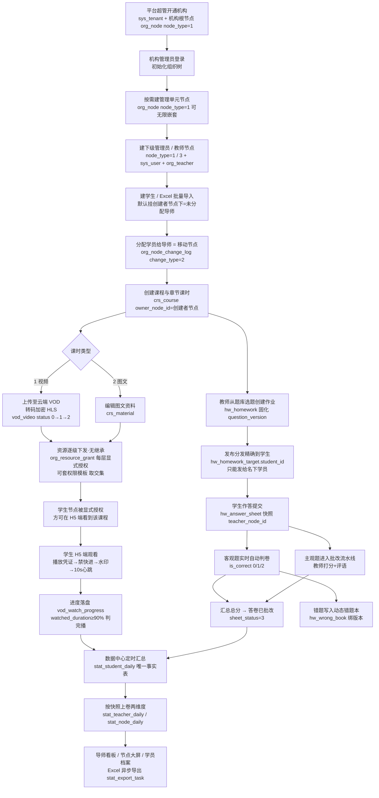
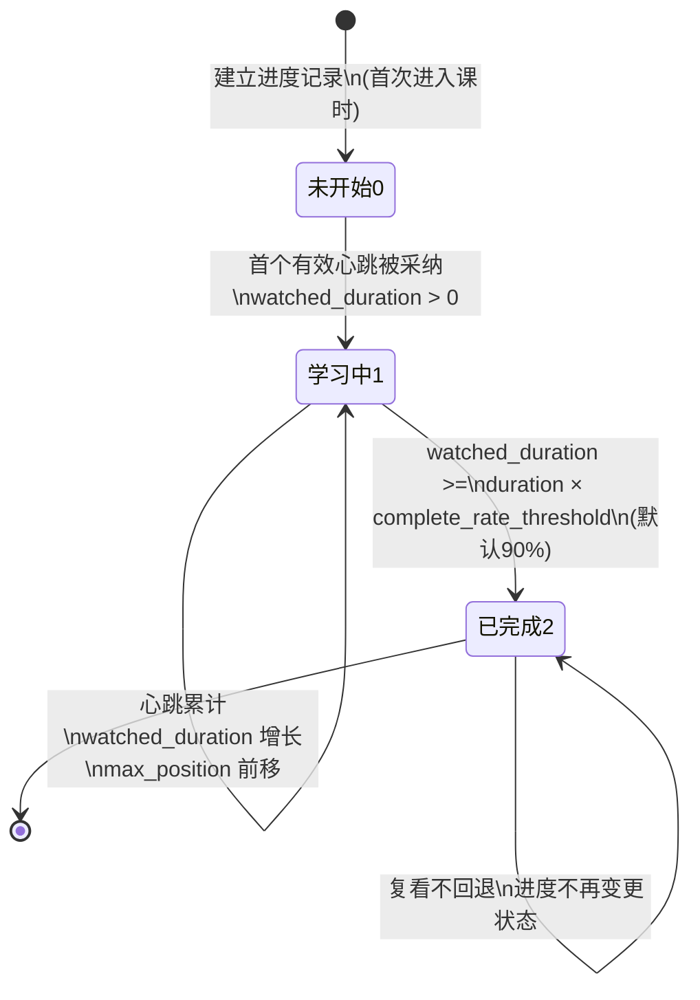

# EduMatrix 产品需求文档（PRD）

---

## 1. 文档信息

| 项目 | 内容 |
| --- | --- |
| 文档名称 | EduMatrix ToB 私域督学管理平台 产品需求文档 |
| 文档编号 | 01-PRD |
| 状态 | 已评审基线 |
| 日期 | 2026-08-12 |
| 需求基线 | `docs/00-原始需求.md`（客户输入 2026-08-12） |
| 设计契约 | `docs/DESIGN-CONTRACT.md`（表名/字段名/枚举值/路由前缀/错误码唯一权威） |
| 下游文档 | `docs/02-数据库设计.md`、`docs/03-API接口文档/*` |

> **量化口径锁定声明**：以下口径为全局硬约束，实现方不得擅自改动——心跳 ≥8s 视为有效、单次计入 min(实际间隔,15)s；播放凭证固定 300 秒；完播判定发生在落盘时刻（唯一判定时机）；图文课时首访即完成；半对不计入错误率、独立为漏选率；错题本宽口径纳入 `is_correct ∈ {0,2}`；高频错题榜按未掌握人数排序取 Top10；Excel 导入上限 2000 行；登录连续失败 5 次锁定 15 分钟。

### 1.1 术语约定

| 术语 | 说明 |
| --- | --- |
| 租户 | 即机构，`sys_tenant` 一行记录；机构 = 租户，`tenant_id` 为隔离键；**超管的直接子节点 = 一个机构 = 一个租户** |
| **节点** | `org_node` 一行；系统中**每一个组织单元与人员都是同一棵树上的节点**，node_type：0平台超管 1管理员 2教师 3学生 |
| **组织树** | 从平台根一路到学生的唯一一棵树；教师节点下**只能挂学生**，学生节点为**叶子**，深度不设上限 |
| **子树** | 某节点自身 + 其全部后代；判定式 `node.id = #{myNodeId} OR FIND_IN_SET(#{myNodeId}, node.ancestors)`；**"你能看到的数据 = 你的子树"是全系统唯一一条数据权限规则** |
| **名下学员** | 教师节点的直接子节点（node_type=3）集合；教师的子树即其名下学员 |
| **受管资源** | 课程（`crs_course`）、题目（`qb_question`）、视频（`vod_video`）三类，各带 `owner_node_id` 归属节点 |
| **资源授权** | `org_resource_grant` 一行（资源 → 目标节点）；**逐级显式、无继承**，每一层都必须单独授权 |
| **级联回收** | 撤销某节点的资源授权时，必须连带撤销该资源在目标节点**整个子树**内的全部授权；学习记录保留 |
| **权限模板** | `org_perm_template`，一组资源清单的批量授权快捷方式；应用时取"模板清单 ∩ 授权人当前拥有"，**绝不放大权限** |
| **标签** | `org_tag` / `org_student_tag`，**仅用于筛选与批量操作，不参与任何权限判断** |
| 课时 | 学习最小单元，`crs_lesson`，lesson_type：1视频 2图文 |
| 完播 | `watched_duration >= duration × 90%`（租户可配，配置键 `complete_rate_threshold`） |
| 心跳 | 播放器每 10 秒上报 `POST /api/v1/vod/heartbeat` 一次的进度请求 |
| 题目物理 ID | `qb_question.id`，雪花算法生成，全局唯一、永不复用、编辑不变更 |
| 固化版本 | 作业布置时将题目当前版本写死到 `hw_homework_question.question_version` |
| 所有 ID | 后端 bigint（雪花），API 与本文 JSON 示例中一律序列化为字符串 |
| 时间格式 | `yyyy-MM-dd HH:mm:ss`（东八区） |


---

## 2. 产品概述

### 2.1 产品定位

EduMatrix 是面向教育机构、学校及企业培训部门（ToB）的**私域督学管理系统**。区别于面向 C 端的公开课平台，本产品的核心是"一对一/一对多的私域监管式学习"：机构买单、导师执行、学生被监管、**学生之间互不可见**。平台通过禁快进、跑马灯水印、心跳进度追踪、作业自动判卷与数据看板，把"学生是否真的学了、学到什么程度"变成机构与导师可量化、可追责的数据。

**组织形态：统一组织树。** 系统中的每一个组织单元与人员——机构、校区、部门、管理员、教师、学生——都是**同一棵树上的节点**，一棵树到底。没有独立的教学分组单元：学生直接挂在导师（教师节点）下，教师挂在管理员/机构节点下。由此得到两条极简规则：

- **数据权限只有一条**：你能看到的数据 = 你所在节点的子树。
- **资源（课程/题目/视频）逐级显式下发，无继承**：每一层都必须被显式授权，天然逐级收缩；用**权限模板**抵消逐级授权的操作成本。

产品形态：Web PC 管理端（机构/各级管理员 + 教师端）+ H5 学生端；全部后端接口遵循 API-First 规范，为微信小程序 / App 预留 100% 可复用的标准接口。

### 2.2 目标客户

| 客户类型 | 典型场景 | 付费动机 |
| --- | --- | --- |
| K12 私域督学 / 一对一辅导机构 | 多校区多团队，学员按导师分配，一人一进度 | 私域隔离（学员互不可见）、督学（完播率）、导师业绩可量化 |
| 职业教育/考证机构 | 大量录播课时，多层代理/分校分销课程 | **课程逐级下发、每级可收缩**，防止下级拿到全部课程资产 |
| 民办学校/国际学校 | 校内混合式教学，作业电子化，按教研组分层管理 | 教务数据留痕、错题本、成绩曲线、组织可无限嵌套 |
| 企业内训部门 | 合规培训、岗前培训必须"看完"，按部门层级下发 | 完播强管控、学习档案可审计、部门树天然映射组织树 |

### 2.3 核心价值主张

1. **看得住**：禁快进 + 心跳校验 + 服务端间隔合理性校验，杜绝"挂机刷课""倍速偷跑"，完播数据真实可信。
2. **防得住**：加密 HLS + 时效播放凭证 + 姓名手机号跑马灯水印，视频资产防下载、防录屏传播、可溯源。
3. **管得细**：**统一组织树 + 子树数据权限**，一条规则覆盖全角色——上级只看得到自己子树，导师只看得到名下学员，学生只看得到自己，学生之间互不可见。
4. **收得住**：**资源逐级显式下发、无继承、撤销级联回收**，上级拥有 ≠ 下级自动拥有；多层代理/分校场景下资产不会一次性泄漏到底层。
5. **判得快**：六种题型、客观题实时自动判卷、主观题批改流水线，教师批改效率数倍提升。
6. **不错乱**：题目物理 ID + 版本快照机制，题库随便改，历史答卷与错题本永远显示做题当时的原题。
7. **算得清**：完播率、按时提交率、高频错题榜、学习档案与 Excel 报表，按**导师/节点**两维度上卷，教学效果与团队业绩数字化闭环。

### 2.4 与参考开源仓库的模块映射（引用原始需求 1.2 节）

| 功能模块 | 参考开源仓库 (GitHub) | 核心借鉴内容 / 解决的痛点 | 对应本产品模块 |
| --- | --- | --- | --- |
| 系统基座 & 权限控制 | RuoYi-Vue-Plus | RBAC 角色权限（操作权限）、多租户隔离、**树形子树数据权限**（`ancestors` 冗余祖级串 + `FIND_IN_SET` 单条件命中）、通用后台 API | 系统基座 + 模块 1 + 模块 R |
| 教务与课程结构 | roncoo-education（领课教育） | "课程-章节-课时"层级表结构、教务管理逻辑、学习数据看板设计 | 模块 2 + 模块 4 |
| 作业分发与题库系统 | mindskip/xzs（学之思） | 作业/试卷排版、客观题自动判卷、教师在线批改流水线、错题本版本控制与映射逻辑 | 模块 3 |
| 前端视频播放与防刷 | DPlayer | 播放器控制、禁用拖拽/快进控制、播放进度事件监听与定时心跳触发 | 模块 2（前端） |
| 音视频云端存储与分发 | 腾讯云 VOD / 阿里云 VOD | 云端自动化转码 HLS（`.m3u8`）、鉴权 URL 生成、流媒体 CDN 加速 | 模块 2（云端） |

### 2.5 成功指标

**North Star（北极星指标）**：**周活跃学习学生的"名下学员平均完播率"** —— 它同时反映了机构采买价值（学生真的在学）与产品管控能力（数据真实）。口径分母由导师名下在读学员数给出。

| 指标 | 定义 | 目标（上线后 6 个月） |
| --- | --- | --- |
| **名下学员平均完播率** | 导师名下每名在读学员完播率（已完成视频课时数 / 应学视频课时数）的算术平均，落 `stat_teacher_daily.avg_complete_rate`；节点维度按子树内学员数加权上卷至 `stat_node_daily` | ≥ 75% |
| 作业按时提交率 | deadline 前提交的答卷数 / 应交答卷数（应交 = 命中 `hw_homework_target` 的在读学生数） | ≥ 85% |
| 心跳数据有效率 | 通过服务端合理性校验（间隔 ≥8s 且参数合法）的心跳数 / 总心跳数 | ≥ 97%（低于此值说明刷课或网络异常显著） |
| 教师周活跃率 | 每周登录并产生批改/布置/查看看板行为的教师 / 全部教师 | ≥ 60% |
| 学生导入一次成功率 | Excel 导入 status=1（全部成功）的任务数 / 总导入任务数 | ≥ 90% |
| **资源授权一致性** | 悬挂授权巡检（子节点持有但父节点已无权）发现数 / 全部授权行 | = 0（非 0 即为级联回收缺陷，必须告警） |

---

## 3. 用户角色与权限

> **核心原则（契约 §2.4 / §3）：数据范围由树决定，操作权限由角色决定。**
> 父节点决定子节点"能看到哪些数据"，**不决定**"能执行哪些操作"。二者正交，实现上必须是两套独立的判定，不得互相替代。

### 3.1 角色定义（对齐契约第 3 节）

系统只有 **4 个固定角色**。管理员**分层但角色相同**——机构管理员与其下级管理员共用 `org_admin`，差别仅在树上的位置（子树范围不同）；**不存在"节点管理员""校区管理员"等派生角色**，新增管理层级只需在树上加一个 node_type=1 的节点。

| 角色 | role_key | user_type | 绑定节点类型 | 定位 | 数据范围（唯一规则） |
| --- | --- | --- | --- | --- | --- |
| 平台超管（运营方） | `super_admin` | 0 | 平台（树根） | 租户开通、续期、停用、平台配置 | 跨租户（平台级），不进业务页面 |
| 管理员（各级） | `org_admin` | 1 | 机构节点 / 管理员节点 | 建下级管理员、建教师、建学生、分配学员、资源下发、全模块管理 | **其所在节点的子树** |
| 教师 / 导师（执行方） | `teacher` | 2 | 教师节点 | 备课、组卷、给名下学员发课程与作业、批改、看名下看板 | **其子树 = 名下学员** |
| 学生（被监管方） | `student` | 3 | 学生节点（叶子） | 学习、作答、看本人档案 | **仅自身** |

登录体系：四类角色共用 `sys_user` 统一账号表，以 `user_type` 区分，并以 `sys_user.node_id` 指向其在组织树上的节点；教师、学生分别以 `org_teacher`、`org_student` 档案表 1:1 关联 `sys_user` 与 `org_node`。

**同角色不同位置的差异示例**：机构根节点上的管理员甲与其下级校区节点上的管理员乙，`role_key` 同为 `org_admin`、菜单按钮完全一致（都能点"新建教师"）；但甲的"新建教师"能建在整个机构任意位置，乙只能建在自己子树内，且乙的列表页只返回自己子树的行。

### 3.2 功能 × 角色权限矩阵

图例：✔ 可操作；👁 仅查看；**子树内** = 受"你只能看到你的子树"这一条数据权限规则约束；— 无权限。

| 功能 | super_admin | org_admin（各级） | teacher | student |
| --- | --- | --- | --- | --- |
| 租户开通/续期/停用 | ✔ | — | — | — |
| 建节点（机构/管理单元） | — | ✔（子树内） | — | — |
| 移动节点 / 停用 / 删除节点 | — | ✔（子树内，源与目标均须在子树内） | — | — |
| 建下级管理员账号 | — | ✔（子树内） | — | — |
| 建教师账号 | — | ✔（子树内） | — | — |
| 建学生账号 | — | ✔（子树内） | — | — |
| 学生 Excel 批量导入 | — | ✔（导入到子树内指定节点） | ✔（仅导入到本人节点下） | — |
| 学员分配给导师 / 转交其他管理员 | — | ✔（源与目标同在子树内） | — | — |
| 教师调岗（带学员子树整体移动） | — | ✔（子树内） | — | — |
| 学员标签定义与打标 | — | ✔（子树内） | ✔（名下学员打标，不可定义标签） | — |
| 退课 / 毕业归档 / 归档恢复 | — | ✔（子树内） | — | — |
| 节点异动轨迹查看 | — | 👁（子树内） | 👁（名下学员） | — |
| **资源下发（授权/撤销）** | — | ✔（只能授权自己拥有的，只能授权给子树内的） | ✔（只能把自己被授权的资源发给名下学员） | — |
| **权限模板定义 / 维护** | — | ✔（归属本节点，子树可见） | — | — |
| **权限模板套用** | — | ✔（建下级管理员/教师/学生时，取交集） | ✔（给学员套用，取交集） | — |
| 课程/章节/课时编排 | — | ✔（本节点拥有的课程） | ✔（本人拥有或被授权可编辑的课程） | — |
| 视频上传与媒资管理 | — | ✔（owner_node_id=本节点） | ✔（owner_node_id=本节点） | — |
| 观看课程视频/图文 | — | 👁（预览，本人有权的课程） | 👁（预览，本人有权的课程） | ✔（**本人节点被显式授权**且在有效期内） |
| 题库分类与题目管理 | — | ✔（本节点拥有 + 被授权可见的题目） | ✔（同左，范围随授权收缩） | — |
| 作业创建/发布/撤回 | — | ✔（分发对象限子树内学生） | ✔（**分发对象限名下学员**） | — |
| 作答与提交作业 | — | — | — | ✔（本人被分发的） |
| 客观题自动判卷 | 系统自动执行，无人工入口 | | | |
| 主观题批改流水线 | — | 👁（子树内，不代批） | ✔（本人布置或被指派） | — |
| 错题本 | — | 👁（子树内学生，只读） | 👁（名下学员，只读） | ✔（本人） |
| **导师看板** | — | 👁（子树内任一导师） | ✔（**本人名下**） | — |
| **机构/节点数据大屏** | — | ✔（**以本人节点为根按子树聚合**） | — | — |
| 学生学习档案 | — | 👁（子树内） | 👁（名下学员，含转入前完整历史） | ✔（本人） |
| Excel 报表异步导出 | — | ✔（子树内） | ✔（名下学员） | — |
| 操作/登录日志查看 | ✔（平台级） | ✔（本机构） | — | — |

**学生端可见性硬约束（契约 §2.7）**：学生端不展示同学名单、群体平均分、排行榜及他人任何数据；学生只能看到本人课程与进度、本人作业与成绩、本人错题本、本人档案。**排行类功能仅存在于管理端**（按节点/导师维度）。

### 3.3 数据权限：全系统唯一一条规则

> **你能看到的数据 = 你所在节点的子树。**

功能权限（菜单/按钮，`sys_menu.perms`）决定"能不能点"，数据权限决定"点了之后能看到哪些行"，两者叠加生效。系统**不设 DataScope 分档**，全部角色统一走同一条 SQL 条件：

```sql
-- 服务端统一注入（myNodeId = 当前登录用户 sys_user.node_id）
node.id = #{myNodeId} OR FIND_IN_SET(#{myNodeId}, node.ancestors) > 0
```

| 角色 | 命中范围 | 说明 |
| --- | --- | --- |
| 平台超管 | 全平台 | 跨租户，仅操作 `sys_tenant` 与平台级 `sys_menu` |
| 管理员（任意层级） | 其子树全部（下级管理员、教师、学生） | 同一条件，只是 `myNodeId` 不同 |
| 教师 | 其子树 = 名下学员 | 教师的子节点只能是学生 |
| 学生 | 仅自身 | 学生是叶子，子树 = 自己 |

硬性规则：

1. **只有这一条数据权限规则**，所有角色适用，不存在第二套过滤逻辑；标签、角色、资源授权**都不得扩大可见范围**（契约 §8.2 铁律 2）。
2. **租户隔离与子树权限是两道独立防线**，不得互相替代：跨租户访问（篡改他机构 ID）一律返回 **404**（不暴露存在性）；同租户跨子树访问按契约 §2.4 三分法：路径上的资源越界 → **404**，请求体/参数中显式指定的目标越界 → **10107**，功能权限不足 → **403**。
3. **学员被移走后，原上级立即失去对其全部数据（含历史明细）的访问权**；新上级立即获得其**转入前的完整学习历史**（学员档案口径）。导师业绩口径另按结算快照统计，见 §3.4。
4. **资源授权不等于数据权限**：被授权某课程只意味着"可以使用这门课"，不意味着能看到其他节点的学员数据；反之，能看到某学员也不意味着能给他发任何资源（须先自己拥有该资源）。
5. 平台超管不进入业务数据页面。

### 3.4 归属与结算：两个口径必须分开（契约 §2.6）

**原则：历史归原导师，以自然日为结算单位。**

| 数据 | 归属锚点 | 规则 |
| --- | --- | --- |
| 日学习汇总 | `stat_student_daily.teacher_node_id`（结算时刻快照） | 每日凌晨结算时写入当时的父节点（若父为教师）；**已结算行永不重算** |
| 答卷 | `hw_answer_sheet.teacher_node_id`（作答时刻快照） | 提交时固化 |
| 转导师当日 | 归**新导师** | 当日尚未结算，凌晨按结算时刻归属计算 |

- **学员档案（看学生）**：新导师可查看该学员**转入前的完整学习历史**，否则无法督学。
- **导师看板/业绩（看导师）**：只统计该导师名下期间产生的数据，按结算快照上卷。
- "今日实时"按当前归属计算，"历史趋势"按结算快照读取；**换绑当日两者短暂不一致属预期行为，非缺陷**（见第 8 章 B24）。
- 转导师当日归新导师的理由：原导师的 `student_count` 已随转出减 1，若把当日时长留在原导师分子里会造成"有进度、无活人"的分子分母错配，反而虚高原导师指标。

---

## 4. 核心业务总流程

主链路：机构开通 → 建组织树 → 建管理员/教师 → 导学生并分配导师 → 建课 → **资源逐级下发** → 学生观看 → 布置作业（精确到人）→ 批改 → 数据看板（导师/节点两维上卷）。



链路关键控制点：

| 环节 | 控制点 | 失败走向 |
| --- | --- | --- |
| 机构开通 | expire_time 到期或 status=1 停用，全机构禁登录 | 提示联系平台运营 |
| 建/移动节点 | 父子类型合法性（教师下只能挂学生、学生不可有子节点）+ 防成环校验 | 拒绝操作并返回结构类错误码（1xxxx） |
| 分配学员 | 目标导师/管理员必须在操作人子树内 | 跨子树操作返回 403 |
| 导学生 | 行级校验失败生成错误报告文件（fail_report_file_id） | 下载报告修正后重新导入 |
| **资源下发** | 授权人须已拥有该资源 + 目标节点须在其子树内 | 违反任一条拒绝授权；模板套用时自动跳过并列出无权项 |
| **撤销授权** | 必须级联撤销目标节点整个子树内该资源的全部授权 | 未级联即产生悬挂授权，巡检任务告警 |
| 转码 | video_status=3 转码失败 | 课时不可发布，管理端告警重传 |
| 观看 | 凭证过期（20001）/心跳异常（20002） | 前端重取凭证 / 丢弃该次心跳 |
| 作答 | 超 deadline 且 allow_late_submit=0 | 拒绝提交，答卷置 4 逾期未交 |

---

## 5. 功能需求详述

> 本章为 PRD 主体。功能编号规则：`F<模块>-<序号>`；资源授权模块采用 `FR-<序号>`，以保持模块 2/3/4 既有编号在下游 API 文档中的引用稳定。所有表名、字段名、枚举值、错误码严格引用设计契约与《00-通用约定》§9 错误码登记册，不得另造。
>
> **本章模块索引**：5.1 模块 1 组织树与人员管理 → 5.2 模块 R 资源授权与权限模板 → 5.3 模块 2 课程与视频学习追踪（局部改）→ 5.4 模块 3 作业分发与题库（局部改）→ 5.5 模块 4 数据中心。

## 5.1 模块 1：组织树与人员管理

> **本模块是整个系统的地基。** 系统中的每一个组织单元与人员都是 `org_node` 上的一个节点，一棵树到底；数据权限、学员归属、资源下发范围全部由这棵树推导。本模块的所有写操作都必须通过两道校验：**结构合法性**（父子类型合法、树不成环）与**管辖范围**（源节点与目标节点均在操作人子树内），任一不满足即拒绝。

### F1-1 机构（租户）开通与生命周期

**功能描述**：平台超管在平台端为付费客户开通机构。机构即租户（`sys_tenant`），记录名称、联系人（contact_name/contact_phone）、有效期（expire_time）、状态（status：0正常 1停用）、学生规模上限（max_student_count）。开通时同步创建**机构根节点**（`org_node`，node_type=1，parent_id=0）并回填 `sys_tenant.root_node_id`，以及首个机构管理员账号（`sys_user` user_type=1，node_id 指向该根节点）。

**业务规则**：

1. 机构名称全平台唯一；创建成功即生成 tenant_id，之后所有业务表数据均携带该 tenant_id。
2. **超管的直接子节点 = 一个机构 = 一个租户**：机构根节点自身的 id 即该租户的 `tenant_id`，机构以下所有节点继承同一 tenant_id（契约 §2.1）。租户隔离是**硬边界**，与子树数据权限是两道独立防线，不得互相替代。
3. expire_time 到期后，该机构全部账号登录被拒（10007，提示"机构服务已到期"）；数据保留不删除，续期后恢复。
4. status=1 停用等同到期处置，用于欠费/违规冻结。
5. 机构在读学生数（`org_student.status=0`）达到 max_student_count 时，新增/导入学生被拒绝（10010 / 10207）。
6. 初始机构管理员用户名由超管指定，初始密码系统生成（`pwd_reset_flag=1`）并强制首次登录修改；其 node_id = 机构根节点，因此**其子树 = 全机构**，无需另设"超级管理员"角色。
7. 机构根节点不可删除、不可移动、不可停用（停用机构走 `sys_tenant.status`）。

**关键交互**：平台端"租户管理"列表 → 新建机构表单 → 保存后弹出初始管理员账号密码（仅展示一次）。

**验收标准**：

- Given 机构 expire_time 为 `2026-08-11 23:59:59`，When 该机构任一账号在 `2026-08-12 09:00:00` 登录，Then 登录失败返回 10007 并提示机构服务已到期，`sys_login_log` 记录失败状态。
- Given 平台超管创建机构成功，When 查看该机构组织树，Then 存在且仅存在一个 node_type=1、parent_id=0 的机构根节点，`sys_tenant.root_node_id` 指向它，初始管理员 `sys_user.node_id` 亦指向它。
- Given 机构 max_student_count=500 且在读学生已 500 人，When 管理员导入含 10 名新学生的 Excel，Then 导入任务整体拒绝执行（10207），提示超出学生规模上限。
- Given 平台超管创建机构成功，When 机构管理员用初始密码首次登录，Then 系统强制进入修改密码页，未改密前不可访问其他页面。

### F1-2 组织树节点管理（建 / 改名 / 移动 / 停用 / 删除）

**功能描述**：管理员在**其子树范围内**维护组织树 `org_node`：新建管理单元节点（校区、部门、教研组等，node_type=1，可无限嵌套）、重命名、调整同级排序、**移动节点**、停用、删除。树上共四类节点，承载关系是硬约束：

| node_type | 节点类型 | 可承载的子节点 | 说明 |
| --- | --- | --- | --- |
| 1 | 机构 / 管理单元 | 机构、管理员、教师、学生 | 租户根节点、校区、部门等，可无限嵌套 |
| 2 | 管理员 | 机构、管理员、教师、学生 | 管理岗人员 |
| 3 | 教师 | **仅学生** | 导师节点；其直接子节点即"名下学员" |
| 4 | 学生 | **不可有子节点** | 叶子 |

**业务规则**：

1. **父子类型硬校验**：违反上表即拒绝——把管理员/教师/机构挂到教师节点下返回 10105，在学生节点下建任何节点返回 10106，其余非法组合返回 10104。教师尚无学员时其自身即为叶子，合法。
2. 同一父节点下 `node_name` 不重复（10102）；同级按 `sort` 排序。
3. **新建节点的父节点必须在操作人子树内**，否则 10107。
4. **移动节点的防成环校验（铁律 1）**：目标父节点不得是被移动节点自身，也不得是其任何后代，即
   `targetParentId != movingNodeId AND FIND_IN_SET(#{movingNodeId}, targetParent.ancestors) = 0`，违反返回 **10103**。
5. **移动节点后必须递归重算整棵子树的 `ancestors`**（含被移动节点自身），且**重算与移动在同一事务内**；任一后代 ancestors 未刷新即视为严重缺陷（子树查询会漏行或错行）。同事务内维护 `child_count` / `student_count` 冗余。
6. 移动的源节点与目标父节点**必须同时在操作人子树内**（10107）；跨子树搬运只能由共同上级执行。
7. 移动后**数据权限即时生效**：原上级立即失去对被移动子树全部数据（含历史明细）的访问权，新上级立即获得。
8. **树深度不设上限**；`ancestors` 冗余祖级路径（逗号串，如 `0,100,101,205`），子树查询用 `FIND_IN_SET(#{nodeId}, ancestors)` 单条件命中，不走递归 CTE。
9. **停用**（status=1）**按节点类型区分**：
   - **管理员节点**：本人及其**整棵子树**全部禁止登录（分支冻结）——停用一个管理员就是停掉他管的这一片（分部关停、欠费停服、合规冻结）
   - **教师节点**：**仅本人**禁止登录，**名下学员照常学习**——教师离职/停职/请假时学员的课程授权仍在，级联会让整批学员突然登不进去，是业务事故
   - **学生节点**：仅本人
   实现走"登录时查祖先链"（拆 `ancestors` 主键 IN 查询，命中 `node_type=1 且 status=1` 即拒登），**不做级联写库**——否则停一个 1.1 万人的分支要写 2.2 万行，且恢复时分不清谁是被级联停的、谁是本来就单独停的。
   停用节点不可作为新建/移动的目标父节点（10109）；停用节点不可作为新建/移动的目标父节点（10109）；历史数据保留可查；停用可恢复。
10. **删除**为逻辑删除（deleted_at=1）；**节点下存在未删除子节点时禁止删除**（10108），须先迁移或删除下级；机构根节点不可删除。
11. 删除教师节点前须先转移其全部名下学员（10206）——规则 10 的特例，提示语更具体。
12. 重命名不改变任何 id、不影响 ancestors、不影响任何已产生的资源授权关系。
13. 所有结构变更（建/移/停/删）写 `sys_oper_log`；涉及归属变化的另写 `org_node_change_log`（F1-9）。

**关键交互**：左侧组织树懒加载（按 parent_id 逐层拉取，服务端只返回操作人子树内的节点）+ 右侧节点详情/成员列表。支持拖拽移动：前端按承载规则预判并置灰非法落点、对自身后代落点直接禁止，**服务端二次校验为准**；移动前弹确认框展示影响面——"将随之移动 N 个子节点，其中学员 M 名；原上级将立即失去这些数据的可见性"。

**验收标准**：

- Given 节点 A 是节点 B 的祖先，When 管理员把 A 移动到 B 之下，Then 操作被拒绝返回 **10103（节点移动会导致成环）**，A、B 及其子树的 parent_id 与 ancestors 一律不变。
- Given 任意节点 A，When 提交的 targetParentId 等于 A 自身，Then 返回 10103。
- Given 教师节点 T，When 管理员在 T 下新建管理员节点，Then 返回 **10105（教师节点下只能挂学生）**；When 在 T 下新建学生节点，Then 创建成功。
- Given 学生节点 S，When 在 S 下新建任意节点，Then 返回 **10106（学生节点不可有子节点）**。
- Given 管理员节点 M，When 把 M 移动到某教师节点下，Then 返回 10104（非法的父子节点类型组合）。
- Given 校区节点 S1 下存在未删除的部门节点，When 管理员删除 S1，Then 返回 **10108（节点下存在子节点，不可删除）**，提示先处理下级。
- Given 教师节点 T 名下仍有 5 名学员，When 管理员删除 T，Then 返回 10206，提示先转移学员。
- Given 下级管理员乙的节点在校区 S1 子树内，When 乙尝试把某节点移动到 S2 子树下的目标父节点，Then 返回 **10107（目标节点不在您的管辖范围内）**。
- Given 节点 P 的子树共含 12 个后代，P 从父节点 X 移动到父节点 Y，When 事务提交，Then P 及全部 12 个后代的 `ancestors` 均已重算为以 Y 的 ancestors 为前缀；以 Y 为根做子树查询能命中全部 13 个节点。
- Given **管理员**节点 N 被停用（status=1），When 其子树内学生登录，Then 登录被拒；When **教师**节点 T 被停用，其名下学员登录，Then 登录成功（教师停用不级联）；When 管理员把其他节点移动到 N 之下，Then 返回 10109。

### F1-3 人员管理：建下级管理员 / 教师 / 学生

**功能描述**：管理员在其子树内创建三类人员，**创建人员 = 创建一个节点**。每类人员一次事务内同时落 `org_node` + `sys_user`（含 node_id）+ 对应档案表。

| 人员 | node_type | user_type | role_key | 档案表 | 可挂载的父节点 |
| --- | --- | --- | --- | --- | --- |
| 下级管理员 | 2 | 1 | `org_admin` | — | 机构节点 / 管理员节点 |
| 教师（导师） | 3 | 2 | `teacher` | `org_teacher` | 机构节点 / 管理员节点 |
| 学生 | 4 | 3 | `student` | `org_student` | 机构 / 管理员 / **教师**节点 |

**业务规则**：

1. **三写一事务**：`org_node` + `sys_user` + 档案表任一失败整体回滚，不允许出现"有账号无节点"或"有节点无账号"的孤儿数据。
2. username 全局唯一（10001）；手机号本租户内唯一（10013）；teacher_no 机构内唯一（10201）；student_no 机构内唯一，留空按规则自动生成（10202）。
3. 初始密码由创建者在请求中指定（`initPassword`，8~20 位含字母数字），或留空由服务端随机生成 ≥12 位强口令；两种情况明文均在创建响应中**返回一次**、不落库不可再查，`pwd_reset_flag=1` 强制首次登录改密。**严禁使用手机号后 6 位等可由账号推导的默认值**——用户名即手机号，同源意味着拿到名单即可登录任意账号。
4. **学生创建时默认挂在创建者所在节点下**：
   - 管理员创建 → 学生节点挂在**该管理员节点**下，语义为"**已归属该管理员，尚未分配导师**"，学员列表以"未分配导师"标记并支持一键筛选；
   - 教师创建 → 学生节点直接挂在**该教师节点**下，即刻成为其名下学员。
5. 创建学生前校验机构在读学生上限（10207 / 10010）。
6. 创建人员时**可套用权限模板**一键完成资源授权（见 FR-6），实际授权取交集，不放大权限。
7. **角色固定不分层**：任何层级的管理员 role_key 一律 `org_admin`，菜单/按钮权限完全一致；层级差异只体现在数据范围（子树）上（契约 §3）。
8. 停用人员：`sys_user.status=1` 后不可登录，但其历史创建的课程、作业、批改记录、已授出的资源授权保留归属不回滚。
9. 删除人员 = 删除其节点，受 F1-2 规则 10/11 约束；不允许对当前登录账号执行停用/删除/降权（10012）。
10. `org_teacher` 档案含 teacher_no、subject、title、entry_date、student_count（冗余，随学员增减同步维护）；`org_student` 档案含 student_no、guardian_name、guardian_phone、status、quit_time、quit_reason、archive_time。
11. **教师不能创建教师或管理员**：教师角色的可执行操作仅限备课、组卷、给名下学员发课程与作业、批改、看名下看板（契约 §3）。

**关键交互**：组织树上选中一个节点 → 右侧"新增下级"下拉（按该节点 node_type 动态只展示合法的人员类型）→ 表单 → 可选"套用权限模板" → 保存后展示账号与初始密码（仅展示一次）。

**验收标准**：

- Given 管理员甲所在节点为 N1，When 甲创建学生小明且未指定导师，Then 小明节点 parent_id=N1、node_type=3，学员列表中标记为"未分配导师"，`org_node_change_log` 新增一条 change_type=1（建档）。
- Given 教师张三，When 张三创建学生小刚，Then 小刚节点 parent_id=张三节点，即刻计入张三名下学员，`org_teacher.student_count` +1。
- Given 下级管理员乙，When 乙创建下级管理员丙，Then 丙的 role_key=`org_admin`（与乙相同）、菜单权限一致，且丙的子树严格包含于乙的子树。
- Given 教师张三，When 张三尝试调用创建教师账号接口，Then 返回 403（无该操作权限），前端亦不展示该入口。
- Given 创建学生时手机号已被本租户另一账号占用，When 提交，Then 返回 10013，无任何节点/账号/档案产生（事务回滚）。

### F1-4 学员分配、转交与教师调岗（同一个动作：移动节点）

**功能描述**：**"分配导师""转交给其他管理员""教师调岗"是同一个动作——移动节点**，共用同一接口与同一套校验，仅 `org_node_change_log.change_type` 不同。

| 业务语义 | 实际动作 | change_type |
| --- | --- | --- |
| 分配学员给导师 | 学生节点 → 移到目标**教师**节点下 | 2 分配导师 |
| 更换导师 | 学生节点 → 从教师 A 移到教师 B | 2 分配导师 |
| 转交学员给其他管理员 | 学生节点 → 移到目标**管理员/机构**节点下 | 3 转交管理员 |
| 教师调岗（带走学员） | 教师节点 → 移到目标管理员/机构节点下，**其学员子树整体跟随** | 4 教师调岗 |

**业务规则**：

1. **源节点与目标父节点必须都在操作人子树内**，否则 10107。跨子树的转交只能由共同上级执行。
2. 目标父节点类型必须合法（学生只能挂机构/管理员/教师；教师只能挂机构/管理员），否则 10104/10105/10106。
3. 目标父节点与当前父节点相同 → 10205（目标导师与当前导师相同）。
4. 仅 `org_student.status=0` 在读学生可被分配/转交；已退课（1）或已归档（2）→ 10203。批量名单中含状态不符者 → 10208（整批拒绝，不做部分成功）。
5. 目标节点已停用（status=1）→ 10109。
6. **教师调岗带走学员子树**：移动教师节点时其名下学员随之整体移动，无需逐个搬运；移动后在同一事务内重算整棵子树 ancestors；**只写 1 条 change_type=4 的轨迹（针对教师节点）**，随行学员不逐条写 change_type=2（其导师并未改变，逐条记录只会制造噪声）。
7. **权限影响即时生效**：移动完成后原上级立即失去对该学员/该教师子树全部数据（含历史明细）的访问权；新上级立即可见，且**可查看该学员转入前的完整学习历史**（学员档案口径，§3.4）。
8. **资源授权不随节点移动而自动变化**：学员已持有的 `org_resource_grant` 行不因换导师被自动撤销或自动新增。新导师如需追加资源须显式授权；旧导师如要收回须显式撤销（走 FR-4，级联生效）。这是"授权与归属正交"的直接后果，须在确认弹窗中明示。
9. 支持批量分配（多选学员 → 同一目标节点），逐个学员写异动轨迹；**任一行校验失败整批拒绝**，避免半成功导致归属错乱。
10. 同事务维护冗余：源/目标节点 child_count、教师 student_count。

**关键交互**：学员列表勾选 → "分配导师 / 转交" → 节点选择器（只展示操作人子树，非法目标类型置灰）→ 确认弹窗展示影响说明：原上级将立即失去数据可见性、**资源授权保持不变**、当日统计归新导师。

**验收标准**：

- Given 学员小明挂在管理员甲节点下（未分配导师），When 甲把小明分配给其子树内的教师张三，Then 小明 parent_id=张三节点、ancestors 已重算，`org_node_change_log` 新增 change_type=2 且 from_parent_id/to_parent_id 正确，`org_teacher.student_count` +1。
- Given 学员小明在教师张三名下，When 管理员把小明转给**不在其子树内**的教师李四，Then 返回 10107，小明归属不变。
- Given 教师张三名下有 12 名学员，When 管理员把张三从校区 S1 调岗到校区 S2，Then 张三与 12 名学员的 ancestors 全部重算为以 S2 为前缀；S1 的管理员立即查不到这 13 个节点的任何数据；`org_node_change_log` 仅新增 1 条 change_type=4。
- Given 分配时目标导师即当前导师，When 提交，Then 返回 10205，不产生轨迹。
- Given 学员小刚 `org_student.status=1` 已退课，When 管理员为其分配导师，Then 返回 10203。
- Given 批量分配 20 名学员，其中 1 名已归档，When 提交，Then 返回 10208，**20 名学员全部未被移动**。
- Given 小明当日在导师 A 名下观看 20 分钟后转给导师 B 又观看 30 分钟，When 次日凌晨结算，Then `stat_student_daily` 仅生成一行（`teacher_node_id=B`、`watch_seconds=3000`），导师 A 当日汇总不含该学员任何数据（§3.4，有意设计非缺陷）。
- Given 小明被转给导师 B，When B 打开小明的学习档案，Then 可见小明**转入前**的完整学习历史（时长、进度、答卷、错题）；When B 打开自己的导师看板，Then 业绩数据只含小明转入后产生的部分。

### F1-5 学员标签（仅筛选与批量操作，不参与权限）

**功能描述**：标签 `org_tag`（tag_name、tag_group、color、sort）用于给学员打标，`org_student_tag` 承载多对多关系。标签服务于**筛选**与**批量操作**两件事。

**业务规则**：

1. **标签绝不参与任何权限判断**（契约 §8.2 铁律 2）：打标既不改变谁能看到该学员，也不改变该学员能用哪些资源。任何"按标签授权"最终仍落到具体 `org_resource_grant` 行上。
2. 标签是**机构（租户）级公共字典**，同租户内全员可读；`org_tag` 不设归属节点，标签本身不携带任何范围语义。
3. 打标对象必须在操作人子树内；教师可给名下学员打标/取消标，**不可定义或删除标签**。
4. `(student_id, tag_id)` 唯一；单个学员标签数 ≤ 20。
5. 标签用途：学员列表筛选、**批量资源授权**（`grant_source=3` 按标签批量）、**批量作业分发**（`grant_source=3`）。批量操作的实际生效范围仍受"目标 ∩ 操作人子树"与"资源 ∩ 操作人已拥有"双重收缩（见 FR-3 规则 5）。
6. 删除标签仅解除关联，不影响学员本身，**也不回收此前按该标签授出的授权行**。

**验收标准**：

- Given 学员小明带标签"冲刺班"，When 管理员按标签"冲刺班"批量授权课程 K，Then 仅命中**操作人子树内**带该标签的学员；子树外带同标签的学员不被授权，且在响应中不出现（不暴露存在性）。
- Given 教师张三，When 张三尝试新建标签，Then 无入口且接口返回 403；When 张三给名下学员打标，Then 成功。
- Given 已按标签"冲刺班"给 30 名学员授出课程 K，When 管理员删除该标签，Then 30 条 `org_resource_grant` 行保持有效不回收，学员照常学习。
- Given 学员已有 20 个标签，When 再打第 21 个，Then 参数校验失败并提示上限。

### F1-6 学生 Excel 批量导入（导入到指定节点）

**功能描述**：管理员/教师下载标准模板，填写学生信息后上传，系统异步创建学生节点与账号（`org_node` + `sys_user` user_type=3 + `org_student`）并挂到**向导中选定的目标节点**下。导入过程记录于 `org_import_task`（biz_type=1），失败行生成错误报告文件供下载。

**导入向导选择项（非模板列）**：

| 选项 | 必填 | 说明 |
| --- | --- | --- |
| **目标节点** | 是 | 学生默认挂载的父节点，**必须在操作人子树内**（10107）；教师执行导入时该项锁定为教师本人节点 |
| 套用权限模板 | 否 | 可选一个模板，导入成功的学生自动按 FR-6 取交集授权（grant_source=5） |

**模板字段**：

| 列名 | 必填 | 校验规则 | 落库字段 |
| --- | --- | --- | --- |
| 学生姓名 | 是 | 1~50 字符 | sys_user.real_name |
| 手机号 | 是 | 11 位大陆手机号；作为登录 username；**全平台唯一**（已被任何机构注册即该行失败并给出明确原因） | sys_user.username / phone |
| 学号 | 否 | 机构内唯一；留空系统按规则生成 | org_student.student_no |
| **导师工号** | 否 | 留空 → 学生挂在向导选定的目标节点下（未分配导师）；填写 → 必须是**目标节点子树内**已存在的教师 `teacher_no`，该行学生直接挂到该教师节点下 | 决定 org_node.parent_id |
| 家长姓名 | 否 | 1~50 字符 | org_student.guardian_name |
| 家长手机号 | 否 | 11 位大陆手机号 | org_student.guardian_phone |
| 初始密码 | 否 | 8~20 位且含字母与数字；**留空由服务端随机生成 ≥12 位强口令**（严禁以手机号后 6 位等可由账号推导的值兜底——B 列手机号即登录账号） | sys_user.password（BCrypt） |

> 组织归属由"向导目标节点 + 可选导师工号"两项确定。

**业务规则**：

1. 仅接受 .xlsx，单文件 ≤ 5MB、**≤ 2000 行**；格式不符返回 10002，行数超限返回 10402。
2. 导入异步执行：上传即返回任务 ID，任务状态 0处理中 → 1成功 / 2部分失败 / 3失败；前端轮询任务详情。同一租户同一时刻仅允许一个处理中的学生导入任务（10401）。
3. 逐行独立校验与落库：某行失败不影响其他行（部分成功即 status=2）。
4. **错误报告下线机制**：失败行原样写入错误报告 Excel 并追加"失败原因"列（如"手机号已存在""导师工号不存在或不在目标节点子树内"），生成 `sys_file` 并回填 fail_report_file_id；页面提供"下载错误报告"，用户修正后仅重传失败行。
5. 同一文件内手机号重复：保留首行，其余行判失败进报告。
6. 手机号对应 username 已存在（含本租户学生及其他机构任何账号，按全平台唯一校验）：该行失败并注明"手机号已被注册"；已归档学生的手机号复用需人工处理，导入不自动复活账号。
7. **教师执行导入时目标节点锁定为本人节点**，导师工号列若填写他人工号则该行失败（管辖范围校验）。
8. 每成功一行：写 `org_node`（node_type=3）+ `sys_user` + `org_student` + `org_node_change_log`（change_type=1 建档），并维护父节点 child_count 与（若挂在教师下）`org_teacher.student_count`。
9. 导入前预校验机构在读学生上限：预计导入后总数超过 max_student_count 时**整任务拒绝执行**（10207），不做部分导入。
10. 若向导选择了权限模板，则对每一名导入成功的学生按 FR-6 取交集授权；因授权人无权而跳过的资源在任务详情中汇总展示（不逐行报错）。

**关键交互**：导入向导四步：选择目标节点（+可选模板）→ 下载模板 → 上传文件 → 结果页（total_count/success_count/fail_count + 错误报告下载 + 模板授权结果摘要）。

**验收标准**：

- Given 上传 100 行文件，其中 3 行手机号与已有账号重复、1 行导师工号不在目标节点子树内，When 任务执行完毕，Then 任务 status=2、success_count=96、fail_count=4，错误报告含 4 行且每行有明确失败原因。
- Given 上传的文件为 .xls 旧格式，When 提交导入，Then 返回 10002，不创建导入任务。
- Given 上传文件含 2500 数据行，When 提交，Then 返回 10402，不创建任务。
- Given 教师王五执行导入，When 其模板中某行填写了别的教师的工号，Then 该行失败进错误报告，原因为"无权将学生导入至该导师名下"。
- Given 导入向导选定目标节点为管理员节点 N1 且未填导师工号，When 导入成功，Then 这些学生 parent_id=N1，在学员列表中标记为"未分配导师"。
- Given 导入向导选择了权限模板 T 且授权人只拥有 T 中 5 门课，When 导入 30 名学生成功，Then 每名学生获得 5 条授权行（grant_source=5），任务详情汇总提示"模板中 15 项因无权跳过"。
- Given 导入成功的学生李雷初始密码列为空，When 管理员从本次导入的「账号密码表」（仅含随机生成的行，保留 7 天）取得李雷的随机初始密码并转告，李雷用手机号 + 该密码登录 H5 端，Then 登录成功并被引导修改初始密码。

### F1-7 退课（流失）

**功能描述**：学员中途流失/退费时，管理员将其 `org_student.status` 置 **1（已退课）**，记录 `quit_time` 与 `quit_reason`，并写 `org_node_change_log`（change_type=7 退课）。

**业务规则**：

1. 仅 status=0 在读学员可退课；对已退课/已归档学员执行 → 10203；批量名单中含状态不符者 → 10208（整批拒绝）。
2. `quit_reason` 必填（≤200 字，支持预置原因下拉 + 自定义），`quit_time` 取服务端时间。
3. 退课后：账号禁止登录；**退出一切在途统计分母**（导师看板与节点大屏的 student_count、平均完播率、按时提交率均剔除该生）；不再出现在作业分发对象与资源授权目标选择器中；已分发未提交的作业不再催交、不判逾期。
4. **节点不移动、授权不撤销、学习记录不删**：退课只改学籍状态。该生历史数据仍按结算快照归原导师，原导师/管理员可在"已退课"筛选下查看其档案（用于回访挽回与流失分析）。
5. 退课可撤销：走与归档恢复同一入口（F1-8 规则 6），恢复为 status=0 并写 change_type=6。
6. 退课是**流失口径的唯一数据来源**：机构大屏的流失率 = 区间内 status 由 0→1 的学员数 / 区间初在读学员数。

**验收标准**：

- Given 在读学员小刚，When 管理员填写退课原因"转线下"并提交，Then `org_student.status=1`、quit_time 与 quit_reason 落库，新增一条 change_type=7 轨迹，小刚立即无法登录。
- Given 小刚已退课，When 次日凌晨结算，Then 其原导师的 `stat_teacher_daily.student_count` 不再包含小刚，此前已生成的 `stat_student_daily` 历史行保留不动。
- Given 小刚已退课，When 管理员再次对其执行退课，Then 返回 10203。
- Given 小刚已退课但其课程授权仍在有效期内，When 查看其授权列表，Then 授权行仍在（未被撤销），但小刚无法登录使用。
- Given 批量退课名单含 1 名已归档学员，When 提交，Then 返回 10208，名单内学员全部状态不变。

### F1-8 毕业归档与归档恢复

**功能描述**：支持单个学员归档与**按节点批量归档**。学员 `org_student.status` 置 **2（毕业归档）**并记录 archive_time，写 `org_node_change_log`（change_type=5 毕业归档）。归档可逆，走"归档恢复"（change_type=6）。

**业务规则**：

1. 归档后学员账号禁止登录（登录返回 10015 提示"账号已归档"）；**不物理删除任何数据**。
2. 归档学员退出一切在途统计：不再计入导师/节点的平均完播率、按时提交率分母；历史日汇总数据保留。
3. 归档学员不再出现在作业分发对象、资源授权目标中；已分发未提交的作业不再催交、不判逾期。
4. **按节点批量归档**：选定一个节点（须在操作人子树内），默认全选其**子树内**全部 status=0 学员，可逐个剔除；执行前需二次确认（**输入目标节点名称**）。
5. 归档/恢复**仅管理员可执行**，教师无此操作权限（403）。
6. **归档恢复**：管理员可将误归档（status=2）或误退课（status=1）的学员恢复为 status=0；**恢复时必须重新指定归属节点**（默认回到原父节点；若原父节点已删除或已停用，则必须另选合法节点），写 change_type=6；对 status=0 的学员调用恢复接口 → 10204。
7. **归档不撤销资源授权**：授权行保留，恢复后若仍在有效期内即刻可用；已过期则需重新授权。
8. 节点本身不因学员归档而变化——归档是学籍状态，不是树结构操作，学员节点仍挂在原导师下（便于回溯与恢复）。

**验收标准**：

- Given 学员小红被归档，When 小红尝试登录 H5 端，Then 返回 10015 被拒；其历史答卷、错题本在管理端与原导师端仍可查询。
- Given 管理员对节点 N（子树内 40 名在读学员）发起批量归档并剔除 2 人，When 执行，Then 38 人 status=2、archive_time 落库、生成 38 条 change_type=5；次日 `stat_teacher_daily` / `stat_node_daily` 不再包含这 38 人，历史行保留可查。
- Given 管理员发起批量归档但输入的确认节点名称不匹配，When 点击执行，Then 操作不执行并提示确认名称错误。
- Given 小红归档后其原导师节点已被删除，When 管理员执行归档恢复，Then 必须重新指定归属节点方可提交；提交成功后写 change_type=6，小红 status=0 且挂在新指定节点下。
- Given 对 status=0 的在读学员调用归档恢复接口，When 请求到达，Then 返回 10204。
- Given 教师尝试调用归档接口，When 请求到达，Then 返回 403（无该操作权限）。

### F1-9 节点异动轨迹

**功能描述**：`org_node_change_log` 记录节点全生命周期异动：node_id、change_type、from_parent_id、to_parent_id、change_time、operator_id、reason。change_type 枚举：**1建档 2分配导师 3转交管理员 4教师调岗 5毕业归档 6归档恢复 7退课**。

**业务规则**：

1. 所有改变**归属**或**学籍状态**的动作**必须**写一条轨迹，且与业务写操作在同一事务内（缺轨迹即缺陷）。
2. 轨迹**只增不改不删**（审计要求），系统不提供任何编辑/删除接口。
3. 查看范围按子树：管理员看子树内全部节点轨迹；教师看名下学员轨迹；**学生端不展示异动轨迹**。
4. 教师调岗只对教师节点写 1 条 change_type=4，随行学员不逐条记录（F1-4 规则 6）；如需还原某学员在任意历史时刻的导师，按"学员轨迹 + 其历任导师节点的调岗轨迹"两级回溯。
5. 轨迹页支持按 change_type、时间范围、操作人筛选，支持导出。
6. `reason` 在退课场景必填、在转交管理员场景选填，其余场景可空。
7. 学员被移出某管理员子树后，该管理员即失去对其轨迹的查看权（与 §3.3 规则 3 一致）。

**验收标准**：

- Given 学员小明经历"建档 → 分配导师 → 更换导师 → 退课"，When 查看其异动轨迹，Then 按时间正序展示 4 条，change_type 依次为 1/2/2/7，每条含正确的 from_parent_id、to_parent_id 与操作人。
- Given 学员小明已被转出管理员甲的子树，When 甲查询小明的异动轨迹，Then 返回 404 / 空列表（甲已失去该节点可见性，且不暴露存在性）。
- Given 教师张三携 12 名学员调岗，When 查看这 12 名学员的轨迹，Then 无新增记录；查看张三节点轨迹，Then 新增 1 条 change_type=4。
- Given 尝试通过任何接口修改或删除已写入的轨迹行，When 请求到达，Then 无该能力接口存在（API 契约不提供）。

## 5.2 模块 R：资源授权与权限模板

> **编号说明**：本模块功能编号采用 `FR-` 前缀，以与模块 2/3/4 的 `F2-`/`F3-`/`F4-` 编号在下游 API 文档中的引用稳定。接口归属 `/api/v1/org/**`（03-02 分册）。
>
> **一句话理解**：资源（课程/题目/视频）像水一样只能**从上往下、一级一级地舀**——每一级都要有人明确地舀一瓢给下一级；**上级有 ≠ 下级有**。

### FR-1 资源归属与授权模型

**功能描述**：三类**受管资源**——课程 `crs_course`、题目 `qb_question`、视频 `vod_video`——各带 `owner_node_id`（创建时写入创建者所在节点）。授权关系统一落 `org_resource_grant`：resource_type（1课程 2题目 3视频）、resource_id、target_node_id、valid_start、valid_end、grant_source、source_ref_id、grant_by、grant_time，`UK(resource_type, resource_id, target_node_id)`。

**业务规则**：

1. **"拥有"的定义**：我是该资源的 `owner_node_id`，**或**该资源已显式授权给我所在节点且在有效期内。二者等价地赋予"使用 + 继续向下发"的能力。
2. **只能授权自己拥有的资源**，否则 **10301**（响应不区分"资源不存在"与"你无权"，防止通过错误码探测他人资源存在性）。
3. **只能授权给自己子树内的节点**，否则 **10302**。禁止横向授权（授给兄弟节点）与向上授权。
4. `UK` 保证同一资源对同一节点只有一行；重复授权返回 **10303**，修改有效期须走"修改授权"接口而非重复插入。
5. **判定语义：只查一条命中，不回溯祖先链**——判断"节点 X 能否使用资源 R"仅需 `target_node_id=X AND resource_id=R AND 在有效期内` 命中一行即可。这比继承模型更快，且不存在祖先链断裂导致的判定歧义（契约 §2.5 规则 4）。
6. 授权目标可以是任意类型节点：授给管理单元/管理员/教师节点 = 赋予其"使用 + 继续下发"的能力；**授给学生节点 = 该生可学**。**只有授到学生节点，学生端才看得见。**
7. 资源被逻辑删除或停用后，相关授权行保留但资源不可用；不做级联删除授权（避免恢复资源时授权丢失）。
8. **授权 ≠ 数据权限**：被授权某课程只意味着"可以使用这门课"，不意味着能看到别人的学员数据；反之能看到某学员也不意味着能给他发资源（须先自己拥有）。
9. 所有授权/撤销写 `sys_oper_log`。

**关键交互**：资源列表页（课程/题库/媒资）→ 选中一个或多个资源 → "下发"→ 目标选择器（组织树，仅展示操作人子树；可切换"按节点""按标签""名下全体"三种批量模式）→ 设置有效期 → 确认后展示逐条结果。

**验收标准**：

- Given 教师张三未被授权课程 K，When 张三尝试把 K 授权给名下学员，Then 返回 **10301**，无授权行产生。
- Given 管理员甲拥有课程 K，教师李四不在甲的子树内，When 甲把 K 授权给李四，Then 返回 **10302**。
- Given 课程 K 已授权给节点 N，When 再次对 N 授权 K，Then 返回 **10303**；修改有效期须走修改授权接口。
- Given 学生小明所在节点未被授权课程 K，但其导师节点已被授权 K，When 小明请求 K 的课程详情或播放凭证，Then 返回 **20013**（未被授权访问该课程）——**不回溯祖先链**，导师有权不代表学生有权。

### FR-2 逐级下发与"无继承"（本模块最核心规则）

**功能描述**：**资源不向下继承。上级拥有不等于下级自动拥有，每一层都必须显式授权。** 任一节点实际可用的资源 = 其上级显式授予它的那一份，天然逐级收缩，不存在跨级穿透。

**逐级收缩示例（系统必须能原样复现）**：

```
机构管理员（节点 N0）        拥有 100 门课      ← 自建或平台授予
        │  显式授权 30 门（org_resource_grant 写 30 行，target_node_id = N1）
        ▼
下级管理员（节点 N1）        拥有  30 门课      ← 另外 70 门他连列表都看不到
        │  显式授权 10 门（写 10 行，target_node_id = N2）
        ▼
教师 / 导师（节点 N2）       拥有  10 门课      ← 另外 20 门他看不到
        │  显式授权  3 门（写 3 行，target_node_id = N3）
        ▼
学生（节点 N3）              可学   3 门课      ← 学生端课程列表恰为这 3 门
```

**业务规则**：

1. **每一跳都是一次独立的授权写入；跳过任何一跳，链路即断**。只授权到教师而未授权到学生 → 学生看不到；只授权到学生而未授权到其导师（异常数据）→ 学生仍能学但导师无法在自己的资源库中管理该课程，属**悬挂授权**，由巡检告警（FR-7）。
2. **下级看不到上级未授予自己的资源**：资源列表接口只返回"我拥有的"（`owner_node_id = 我` ∪ 已授权给我且在有效期内），**绝不返回上级的全量清单**；请求未授予的资源详情按"不存在"处理，不暴露存在性。
3. **只能收缩不能放大**：任何一次授权的可选清单 = 授权人当前拥有的资源集合；UI 上不存在勾选超集的入口，服务端二次校验为准（10301）。
4. **平级不可互授**：同层两个管理员之间无授权路径，必须由共同上级分别授予。
5. 学生是叶子，被授权后无法再向下授权。
6. **无继承 ≠ 无批量**：逐级显式授权的操作成本由 `grant_source` 的三种批量方式（按节点/按标签/按名下全体）与**权限模板**（FR-5/FR-6）抵消，**而不是靠继承**。这是本设计的核心取舍：宁可多写授权行，也不接受"祖先链一断权限就说不清"的继承歧义。

**验收标准**：

- Given 机构管理员 N0 拥有 100 门课并把其中 30 门授给下级管理员 N1，When N1 打开课程列表，Then 只返回 30 门；请求第 31 门（N0 拥有但未授出）的详情返回 404/10301，**不暴露其存在**。
- Given N1 把其中 10 门授给教师 N2，When N2 给学员授权，Then 可选清单只有这 10 门；构造请求授权第 11 门 → 10301。
- Given N2 把其中 3 门授给学生 N3，When N3 登录 H5 端，Then 课程列表恰为这 3 门；N2 拥有的另外 7 门在学生端完全不可见。
- Given 上述四级授权链，When 直接查询"N3 能否使用 N0 拥有的第 50 门课"，Then 判定为否——即使 N0 拥有该课且 N3 在 N0 子树内，**无命中即无权**。
- Given 管理员甲与管理员乙是同级兄弟节点，When 甲把课程 K 授权给乙，Then 返回 10302（授权目标不在您的子树内）。

### FR-3 授权有效期与批量授权来源

**功能描述**：每条授权带 `valid_start` / `valid_end`（可空 = 永久），并以 `grant_source` 记录该行是如何产生的：**1手动选择 2按节点批量 3按标签批量 4按名下全体 5按权限模板**，`source_ref_id` 记模板 ID / 节点 ID / 标签 ID。

**业务规则**：

1. `valid_start` 必填（默认取授权时刻），`valid_end` 可空表示永久；`valid_start >= valid_end` → 20012。
2. **有效期不继承也不联动，但不得超出授权人自身**：下级授权的有效期由授权人自行指定，可短于但**不得长于**授权人对该资源的有效期；超出部分自动截断到授权人有效期末，并在响应中提示。此规则防止"父级已过期、子级仍有效"的时间维度悬挂。
3. 使用资源时校验有效期，不在期内 → 10304（学生侧课程场景表现为 20013）。
4. 批量授权的实际命中集合 = **（所选目标范围 ∩ 操作人子树）×（资源清单 ∩ 操作人当前拥有）**，双重收缩；被跳过的目标与资源在响应中**分组列出并注明原因，不静默丢弃**。
5. `grant_source=4`（按名下全体）是教师最常用的一键动作：把某资源授给自己全部在读名下学员；后续新增的学员**不会自动获得**该资源（无继承亦无追溯），需再次执行或在建档时套用模板。
6. **临期提醒**：管理端工作台展示 30 天内到期的授权（按资源与受影响学员数聚合），避免学员学到一半突然失权。

**验收标准**：

- Given 管理员甲对课程 K 的授权有效期至 `2026-12-31`，When 甲把 K 授给教师并指定有效期至 `2027-06-30`，Then 实际写入 `valid_end=2026-12-31` 并在响应中提示"已按授权人有效期截断"。
- Given 某授权 valid_end 已过，When 学生请求该课程播放凭证，Then 拒绝签发并返回 20013。
- Given 管理员按标签"冲刺班"批量授权 5 门课给 40 名学员，其中 3 名不在其子树内、2 门课其本人无权，When 提交，Then 实际写入 37 × 3 = 111 条授权行，响应分组列出被跳过的 3 名学员与 2 门课及各自原因。
- Given 教师用"按名下全体"把课程 K 授给当前 12 名学员，When 次日新增第 13 名学员，Then 第 13 名学员**不自动拥有** K，教师需再次授权或建档时套模板。
- Given 某课程授权将在 20 天后到期且影响 35 名学员，When 管理员打开工作台，Then 临期提醒卡片展示该课程与受影响学员数。

### FR-4 撤销授权与级联回收

**功能描述**：撤销某节点对某资源的授权时，**必须在同一事务内级联撤销该资源在目标节点整个子树内的全部授权**（契约 §2.5 规则 5，铁律 3）。

**业务规则**：

1. **级联范围**：目标节点自身 + 其全部后代针对该 `resource_id` 的授权行，一并撤销（逻辑删除）。
2. **不级联即为缺陷**：否则出现"父级已无权、子级仍持有"的悬挂授权，逐级收缩被破坏。
3. **学习记录一律保留不删**：`vod_watch_progress`、`hw_answer_sheet`、`hw_answer_detail`、`hw_wrong_book` 全部保留，仅失去继续访问权。
4. **对正在学习的学员即时生效**：撤销后，正在播放的学员在**下一次心跳或播放凭证续签**时被拒（20013 / 20001），前端提示"课程授权已被收回"并停止播放；**已累计的 watched_duration 与 max_position 不清零**，已完成课时保持 watch_status=2。
5. **已分发的作业不随授权撤销而撤回**：作业可作答性由 `hw_homework_target` 与作业状态决定，与课程/题目授权**解耦**；撤销课程授权不影响学员完成已分发作业（避免作业中途消失导致成绩缺失）。如需停止作业，走作业撤回（F3-4 规则 5）。
6. **撤销前置提示**：确认弹窗必须展示影响面——"将同时收回子树内 N 个节点的该资源（其中学员 M 名，其中 P 名正在学习该课程）"。
7. 撤销全量写 `sys_oper_log`，含级联影响的节点数与学员数。
8. 资源的 `owner_node_id` 节点不可"撤销自己的所有权"；资源要下线走资源状态管理（课程下架、视频禁用、题目停用），不走授权撤销。

**验收标准**：

- Given 管理员甲把课程 K 授给下级管理员乙、乙授给教师丙、丙授给 8 名学员，When 甲撤销乙对 K 的授权，Then 乙、丙及 8 名学员对 K 的授权行**全部被撤销（共 10 行）且在同一事务内完成**；8 名学员的 `vod_watch_progress` 一行不删。
- Given 学员小明正在播放课程 K 的课时，When 其导师的 K 授权被上级撤销（级联到小明），Then 小明在下一次心跳/凭证续签时被拒并提示"授权已收回"，已累计观看时长与 max_position 保持原值不清零。
- Given 学员小明已完成课程 K 的 10 个课时且已被分发 K 关联的作业 H，When K 的授权被撤销，Then 小明的课程列表不再有 K，**但作业 H 仍可作答、可查看成绩**，错题本条目保留。
- Given 撤销操作执行完毕，When 运行悬挂授权巡检（FR-7），Then 子树内不存在任何"父无权、子有权"的 K 授权行。
- Given 撤销将影响 3 个节点、42 名学员（其中 7 名正在学习），When 打开撤销确认弹窗，Then 弹窗准确展示这三个数字。

### FR-5 权限模板定义与维护

**功能描述**：`org_perm_template`（template_name、owner_node_id、description、item_count、status 0启用 1停用）+ `org_perm_template_item`（template_id、resource_type、resource_id；UK）。模板是一组资源清单的命名快照，用于批量授权，**专为抵消"逐级显式授权"的操作成本而设**（新招一名教师不必逐个勾选几百个资源）。

**业务规则**：

1. **模板只管资源，不含功能权限**：清单内容仅为课程/题目/视频，**不包含角色、菜单、按钮**——操作权限由角色决定，与模板无关（契约 §2.5）。
2. 模板归属创建者所在节点（`owner_node_id`），**可见范围按子树**：上级建的模板下级可见可用。
3. 模板内容可包含创建者当时拥有的任意资源；**模板本身不校验使用者是否拥有**——收缩发生在**应用时刻**（FR-6）。
4. 模板可编辑（增删条目）、停用（status=0，停用后不可再套用 → 10305）、逻辑删除；**已按模板产生的授权行不随模板变更或删除而回滚**（授权一经授出即独立存在）。
5. `item_count` 冗余维护；单模板条目上限 2000（与导入上限同量级，防止单次授权过大）。
6. 典型模板："高三数学包" = 20 课程 + 500 题目 + 80 视频；"新教师标配" = 10 课程 + 200 题目。

**验收标准**：

- Given 机构管理员在机构根节点创建模板 T，When 其下三级的教师打开"套用模板"，Then 能看到并可选择 T（子树可见）。
- Given 模板 T 已停用（status=1），When 套用 T，Then 返回 **10305**。
- Given 用模板 T 给 5 名学员授权后，管理员从 T 中移除 3 门课，When 查看这 5 名学员的授权，Then 授权行不变（不回滚）；此后再套用 T 才按新清单执行。
- Given 尝试在模板中加入角色或菜单权限，When 提交，Then 无该能力（模板条目 resource_type 只有 1/2/3 三种取值）。
- Given 模板条目数已达 2000，When 继续添加，Then 参数校验失败并提示上限。

### FR-6 权限模板套用（取交集，绝不放大权限）

**功能描述**：新建**下级管理员 / 教师 / 学生**时均可一键套用模板完成授权，也可对已存在的节点追加套用。生成的授权行 `grant_source=5`、`source_ref_id=模板 ID`。

**核心公式**：

```
实际授权 = 模板资源清单  ∩  授权人当前拥有的资源
```

**业务规则**：

1. 应用模板时**逐条校验授权人是否拥有该资源**；不拥有的部分**自动跳过**，并在响应中按资源类型分组列出被跳过项及原因，**绝不放大权限**（契约 §8.2 铁律 3）。
2. 交集为空 → **10306**（模板中无任何可授出的资源），不产生任何授权行。
3. 目标节点必须在授权人子树内（10302）；**套用模板不绕过 FR-1 的任何一条规则**——模板只是批量操作的快捷方式，不是权限的另一条来源。
4. **同一模板在不同层级套用结果不同，这是设计目的而非缺陷**：同一个"高三数学包"，机构管理员用能授出 20 门课，只拿到其中 5 门的下级管理员用就只授出 5 门。
5. 有效期在套用时统一指定，仍受 FR-3 规则 2 的截断约束。
6. 已存在的授权行（命中 UK）在套用时**跳过而非报错**，计入"已存在"分组返回。
7. 套用结果必须可审计：响应返回 `{成功 N 条，已存在 M 条，因无权跳过 P 条（含清单）}`，并写 `sys_oper_log`。
8. 建人员时套用与事后追加套用走同一套规则，不做差异化处理。

**验收标准**：

- Given 模板"高三数学包"含 20 门课且机构管理员拥有全部 20 门，When 机构管理员为新教师套用该模板，Then 生成 20 条授权行，`grant_source=5`、`source_ref_id` = 模板 ID。
- Given 同一模板，下级管理员乙只拥有其中 5 门，When 乙为其名下教师套用该模板，Then **只生成 5 条授权行**，响应列出 15 门"因无权跳过"，且**乙不会因套用模板而获得或授出其余 15 门**。
- Given 下级管理员丙对该模板中的资源一门都不拥有，When 丙套用该模板，Then 返回 **10306**，无任何授权行产生。
- Given 教师给学员套用模板，其中 3 门课学员已被授权，When 提交，Then 响应为"成功 N 条、已存在 3 条"，不报错、不产生重复行。
- Given 构造请求把模板套用到操作人子树外的节点，When 请求到达，Then 返回 10302。
- Given 管理员创建学生时勾选套用模板，When 创建成功，Then 学生节点建档与授权在同一事务内完成；若授权环节整体失败，学生账号亦不产生（事务回滚）。

### FR-7 悬挂授权巡检与一致性告警

**功能描述**：定时任务扫描"子节点持有但其授权来源上级已无权"的**悬挂授权**，作为级联回收的兜底防线（契约 §2.5 规则 6）。

**业务规则**：

1. 巡检频率：每日一次（低峰期执行），按租户分批，避免全表扫描影响在线业务。
2. 判定口径：对每一行 `org_resource_grant`，若其 `target_node_id` 的授权来源链上级（父节点，或直至 `owner_node_id` 所在链）已不再拥有该资源，则标记为悬挂。
3. 处理策略：**只告警不自动删除**（避免误伤在学学员）。在管理端"资源授权健康度"页列出悬挂行，提供两个修复动作：**一键回收**（按 FR-4 级联撤销）与**补授上级**（把该资源补授给缺失的中间层）。
4. 巡检结果计入成功指标"资源授权一致性"（§2.5），目标值为 **0**。
5. 巡检**不改变任何学习记录**，也不自动修改授权。

**验收标准**：

- Given 因程序缺陷造成教师已被撤销课程 K、但其名下学员仍持有 K 的授权，When 次日巡检运行，Then 该行被列入悬挂清单并告警，学员的学习记录不受任何影响。
- Given 悬挂清单中管理员点击"一键回收"，When 执行，Then 按 FR-4 级联规则撤销该资源在目标子树内的全部授权，学习记录保留。
- Given 悬挂清单中管理员点击"补授上级"，When 执行，Then 缺失的中间层节点获得该资源授权，再次巡检该行不再悬挂。
- Given 全租户无悬挂授权，When 巡检运行，Then 健康度页显示 0 条，指标"资源授权一致性"达标。

## 5.3 模块 2：课程与视频学习追踪

### F2-1 课程与"章-节-课时"编排

**功能描述**：管理员/教师创建课程（`crs_course`：course_name、**owner_node_id 归属节点**、cover_file_id、subject、description、status：0草稿 1已上架 2已下架），在课程内构建两级章节树（`crs_chapter`：parent_id=0 为章，否则为节）并在章/节下挂课时（`crs_lesson`，lesson_type：1视频 2图文）。课程冗余 lesson_count 与 total_duration（秒）。

> **归属与授权**：课程以 **`owner_node_id` 归属节点**（创建时写入创建者所在节点）；课程对学生/节点的授权统一走 `org_resource_grant`（resource_type=1）。课程的编排、章节层级、课时状态机等其余逻辑一字未改。

**业务规则**：

1. 章节最多两级：章（parent_id=0）→ 节（parent_id=章 id）；课时可直接挂在章下，也可挂在节下（chapter_id 指向章或节均可）。
2. 课时 sort 决定学习顺序；章、节各自按 sort 排序。
3. 课程 status=0 草稿时学生不可见；1 已上架**且学生节点被显式授权（`org_resource_grant` resource_type=1、target_node_id=该学生节点）且在有效期内**才可见；2 已下架后学生端立即不可见（学习进度保留）。
4. 视频课时必须关联 vod_video 且其 status=2（正常）才允许将课时置为 status=1 可见；图文课时必须关联 crs_material。
5. is_free_preview=1 的课时允许**已被授权该课程的学生**在课程详情页免验证直接试看（仍带水印与心跳）；未被授权者看不到该课程，故不存在试看入口。
6. 删除课程/章节/课时一律逻辑删除；删除章节时其下课时一并逻辑删除，二次确认提示影响课时数。
7. lesson_count、total_duration 在课时增删、视频时长变化时同步维护。
8. **编排权限**：课程只能由其 `owner_node_id` 所在节点的用户编排（增删章节课时）；被授权方只能"使用"不能"改内容"——避免下级改动上级资产。被授权方需要定制内容时应由上级复制一份新课程再授权。

**验收标准**：

- Given 某节点已是"节"（parent_id≠0），When 用户尝试在该节点下再建子章节，Then 操作被拒绝，提示章节结构最多两级。
- Given 视频课时关联的 vod_video.status=1（转码中），When 用户将该课时状态改为可见，Then 保存失败并返回 code=20008（关联视频状态不可用；20003 仅用于上架与发放播放凭证场景）。
- Given 课程从 1 已上架改为 2 已下架，When **已被授权的学生**刷新 H5 课程列表，Then 该课程消失；学生已产生的 vod_watch_progress 数据保留。
- Given 课程 K 的 owner_node_id 为节点 N0，教师 N2 被授权使用 K，When N2 尝试在 K 中新增课时，Then 操作被拒绝（无编排权限），N2 只能使用与下发。

### F2-2 图文课时

**功能描述**：图文课时（lesson_type=2）由 `crs_material` 承载：title、content（LONGTEXT 富文本）、attachment_file_ids（JSON 附件文件 ID 数组）。学生阅读图文即产生学习记录。

**业务规则**：

1. 富文本支持图片（上传至 `sys_file`，biz_type 标记图文资料图片）、加粗、列表、表格；不允许外链脚本（服务端 XSS 过滤白名单标签）。
2. 附件限 PDF/Word/PPT/图片，单个 ≤ 50MB，数量 ≤ 10。
3. 图文课时无 duration 概念，完播判定简化：学生**首次成功访问**图文内容接口（`GET /api/v1/course/lessons/{id}/material`）时由服务端直接将 watch_status 置 0 → 2（不经过 1）并记 complete_time，无需前端上报（watched_duration、max_position 保持 0；与 03-课程与视频分册 §6.3 一致）。
4. 图文内容编辑保存后立即生效，学生端下次打开见新内容（图文不做版本快照，区别于题目）。

**验收标准**：

- Given 学生首次成功打开图文课时详情页（内容接口返回成功），When 教师查看该生课程进度，Then 该图文课时 watch_status=2 已完成、complete_time 已记录。
- Given 富文本中被粘贴进 `<script>` 标签内容，When 保存图文资料，Then 服务端过滤脚本标签后落库，学生端渲染无脚本执行。

### F2-3 视频上传与云端转码（VOD）

**功能描述**：管理端上传视频至云端 VOD（provider：1腾讯 2阿里，首选腾讯云，阿里云走兼容适配层）。媒资记录于 `vod_video`（含 **`owner_node_id` 归属节点**，创建时写入上传者所在节点），状态机：0上传中 → 1转码中 → 2正常；异常 → 3转码失败；人工可置 9禁用。云端自动转码为**加密 HLS（.m3u8）**。

> **归属与授权**：媒资带 `owner_node_id`，视频作为受管资源可独立下发（`org_resource_grant` resource_type=3），用于"下级只能引用上级授予的视频建课"的场景。上传直传、转码回调、状态机、防下载等全部逻辑不变。

**业务规则**：

1. 上传流程：前端向后端申请上传凭证 → 前端直传云端（不经业务服务器）→ 上传完成回调置 status=1 → 云端转码完成回调置 status=2 并回填 hls_url、duration、size_bytes、cover_url。
2. 转码模板强制：加密 HLS 输出，禁止生成可直接下载的 MP4 播放地址。
3. status=3 转码失败：管理端媒资列表红色标记 + 站内提醒上传人（upload_user_id），支持"重新发起转码"与"重传源文件"。
4. status=9 禁用：所有引用该视频的课时立即不可播放（学生端提示视频已下架）。
5. 单文件 ≤ 4GB；支持断点续传（云 SDK 能力）；重复文件（同 MD5）提示复用已有媒资。
6. 媒资删除为逻辑删除，且被未删除课时引用时禁止删除。

**验收标准**：

- Given 视频上传完成且云端转码成功回调到达，When 管理员刷新媒资列表，Then 该视频 status=2、duration 与 hls_url 已回填，可被课时选用。
- Given 云端转码失败回调到达，When 上传人进入管理端，Then 收到站内提醒，媒资列表该条 status=3 并提供重试入口；引用它的课时无法置为可见。
- Given 媒资 V1 被课时 L1（未删除）引用，When 管理员删除 V1，Then 删除被拒绝并提示先解除课时引用。

### F2-4 播放凭证与时效鉴权

**功能描述**：学生播放视频前，前端必须调用后端接口获取带时效性的播放凭证（PlayAuth/Key）。后端校验该学生对该课时的访问权（**资源授权** + 有效期 + 课时可见）后签发，发放记录写 `vod_play_auth_log`（student_id、lesson_id、video_id、auth_token、expire_time、client_ip）审计。

**业务规则**：

1. 凭证有效期固定 300 秒（authExpire=300，与 03-课程与视频分册 §8.1 一致）；到期后播放器续播需静默重取凭证（无感续签）。
2. **签发前校验链**：学生在读（`org_student.status=0`）→ **该学生节点在 `org_resource_grant` 中对该课程有显式授权（resource_type=1、target_node_id=学生节点）且在 valid_start~valid_end 内**（**不回溯祖先链**：导师有权不代表学生有权）→ 课程已上架 → 课时可见 → 视频 status=2。任一不满足拒发（授权环节不满足返回 20013）。
3. 凭证与 studentId + lessonId 绑定，不可跨课时、跨用户使用。
4. 使用过期凭证请求播放，返回 code=20001（播放凭证过期），前端自动重取一次，仍失败则提示用户。
5. 每次签发必写 vod_play_auth_log；同一学生对同一视频高频取凭证（>20 次/小时）触发风控标记供审计。

**验收标准**：

- Given 学生节点对课程的授权 valid_end 为 `2026-08-10 23:59:59`，When 学生在 `2026-08-12 10:00:00` 请求该课程课时播放凭证，Then 拒绝签发并返回 20013，提示课程授权已过期。
- Given 学生小明的导师被授权课程 K 但小明本人节点未被授权，When 小明请求 K 的播放凭证，Then 拒绝签发返回 20013（无继承、不回溯祖先链）。
- Given 学生正在观看课程 K，此刻上级撤销了其导师对 K 的授权（级联至小明），When 小明的凭证到期后静默续签，Then 续签被拒并提示"课程授权已被收回"，已累计 watched_duration 与 max_position 保持不变（FR-4 规则 4）。
- Given 凭证 300 秒到期，学生连续观看第 6 分钟，When 播放器用旧凭证请求分片被拒（20001），Then 前端静默重取新凭证续播，播放不中断超过 3 秒。
- Given 学生 A 获取的凭证被复制给学生 B 使用，When B 携带该凭证播放，Then 服务端校验凭证与当前登录用户不匹配，拒绝播放并记审计日志。

### F2-5 禁快进与完播状态机

**功能描述**：DPlayer 二开实现禁快进：以 `vod_watch_progress.max_position`（最远触达秒）为界——**maxPosition 之前的区间允许自由拖拽（重播已看部分），maxPosition 之后禁止向前拖拽**。完播状态机：0未开始 → 1学习中 → 2已完成。



**业务规则**：

1. 拖拽目标 ≤ max_position：允许，属复看；拖拽目标 > max_position：前端强制回弹至 max_position 并 toast 提示"不能快进未观看部分"。
2. max_position 仅随正常播放推进（服务端以有效心跳的 currentTime 取 max 更新），复看不回退 max_position。
3. 状态只进不退：2 已完成为终态，之后的复看仍上报心跳（用于学习时长统计）但不改变状态。
4. 完播阈值为租户级配置 `complete_rate_threshold`（默认 90%）；阈值修改只影响此后的判定，已判完成的记录不回滚。
5. 前端禁用倍速 >1 的选项不作硬限制（允许 UI 提供倍速），但计时不受倍速影响（见 F2-7 规则 5）。
6. 断网期间前端本地暂停计时；恢复后从服务端进度续播（见 F2-8）。

**验收标准**：

- Given 学生当前 max_position=300 秒，When 学生把进度条拖到 500 秒，Then 播放器回弹到 300 秒继续播放并提示不能快进；When 拖到 120 秒，Then 正常从 120 秒复播。
- Given 课时 duration=600 秒、租户阈值 90%，When 学生 watched_duration 累计达到 540 秒，Then watch_status 置 2、complete_time 记录当前时间，且此后复看不再改变状态与 complete_time。
- Given 学生从未打开过课时 L1，When 教师查看进度列表，Then 该生 L1 行 watch_status=0 未开始、watched_duration=0。

### F2-6 跑马灯水印（防录屏）

**功能描述**：播放器画面浮动显示当前登录学生的"姓名 + 手机号"跑马灯水印，位置随机移动，使录屏传播内容可溯源到人，抬高盗录成本。

**业务规则**：

1. 水印内容：`real_name + phone`（手机号可配置脱敏显示中间四位为 * ，默认不脱敏以强化威慑；租户可配）。
2. 水印每 8~15 秒随机变换一次位置（随机落点覆盖画面九宫格全部区域），半透明（透明度 0.3~0.5），字号随播放器尺寸自适应。
3. 水印由前端渲染于视频层之上、控制层之下；水印 DOM 被删除或隐藏时播放器强制暂停（MutationObserver 防篡改）。
4. 全屏、画中画模式下水印同样存在；试看课时（is_free_preview=1）同样带水印。
5. 水印不可被用户关闭；管理端预览播放显示预览者账号信息。

**验收标准**：

- Given 学生打开控制台删除水印 DOM 节点，When 删除发生，Then 播放器 1 秒内暂停并提示异常，恢复水印后方可继续播放。
- Given 学生切换全屏播放 60 秒，When 观察画面，Then 水印至少变换 4 次位置且始终可见，内容为该生姓名+手机号。

### F2-7 10 秒心跳上报与服务端合理性校验

**功能描述**：播放器每 10 秒发送一次心跳（契约 6.4 固定签名）。服务端做间隔合理性校验后累计观看时长，写 Redis 缓冲，XXL-Job 每 60 秒批量落盘 `vod_watch_progress`，明细写 `vod_heartbeat_log`（按月分区，可归档，无逻辑删除）。

**接口（契约固定，不得变更）**：

```
POST /api/v1/vod/heartbeat
Body: {"lessonId":"1953827104412590081","videoId":"1953827104412590082","currentTime":123.4,"duration":600,"playRate":1.0}
Resp: {"code":200,"msg":"操作成功","data":{"watchedDuration":130,"watchStatus":1,"maxPosition":135}}
```

**业务规则**：

1. 前端触发：仅在真实播放（playing 且未暂停、页面可见）状态下每 10 秒触发；暂停、卡顿缓冲、页面切后台（Page Visibility 隐藏）时停止心跳。
2. 服务端以"本次心跳与该学生该课时上一次被采纳心跳的服务器接收时间差"为实际间隔：**≥8 秒视为有效**，单次计入 min(实际间隔, 15) 秒——8~15 秒为正常窗口全额计入；>15 秒（中途暂停/切后台/断线恢复）仍有效但单次封顶计入 15 秒，超出部分视为空窗不补算、不报错。仅 <8 秒（伪造加速/重复请求）或参数非法的心跳**不计入时长**，返回 code=20002（心跳间隔异常被丢弃），但仍写 vod_heartbeat_log 供审计（interval_sec 记实际值）。口径与契约 6.4、02-数据库设计心跳专栏、03-课程与视频 §8.2.1 一致。
3. 单次有效心跳计入时长 = **min(实际间隔, 15) 秒**，累加进 watched_duration（墙钟有效累计：复看已看区间同样计时长——watched_duration 语义为"累计学习投入时长"，完播判定用它对比 duration×阈值）。
4. max_position 取 max(当前值, 本次 currentTime)，仅有效心跳可推进。
5. **倍速不加速计时**：playRate 仅作记录与风控参考，时长按真实墙钟间隔计，2 倍速看 10 分钟视频仍只累计约 5 分钟墙钟时长对应的有效心跳。
6. **推进一致性校验**：有效心跳的 `Δ currentTime` 须落在 `[0.5, 1.5] × Δt × playRate` 区间；连续 5 次位置零推进而间隔正常，判定为挂机或纯脚本上报——只留痕不计时长并累加风控分。（不设此条时，脚本无需下载任何视频分片、仅按 10s 节奏发包即可 1:1 刷满时长。）
7. **并发课时数上限**：单学生同一时刻活跃课时数 ≤ 2（活跃 = 60s 内有有效心跳），超出的课时心跳直接丢弃并计风控分。原有并发防护只作用于"同一课时"，跨课时并行不受限是防刷模型的最大缺口。
8. **时长封顶**：单学生单日累计上限 10 小时、单课时累计上限 `duration × 3`，超出部分只记录不计入完播判定并触发风控标记。
9. currentTime 超出 [0, duration+2] 的心跳判非法丢弃；同一学生同一课时并发多端播放时，仅先到心跳被采纳，后到者因间隔 <8s 被 20002 丢弃（变相单端观看）。
10. 写路径：有效心跳更新 Redis（key：`vod:hb:{studentId}:{lessonId}`，含 watchedDuration/maxPosition/lastHeartbeatTime）→ XXL-Job 每 60s 批量 upsert `vod_watch_progress`（UK student_id+lesson_id）→ 完播判定在落盘时执行并回填 watch_status/complete_time。
11. 心跳响应实时回传 Redis 中最新 watchedDuration/watchStatus/maxPosition，供前端界面展示进度。
12. Redis 不可用时降级：心跳直写数据库（限流保护），保障计时不中断（性能目标详见第 7 章）。

**验收标准**：

- Given 学生正常播放，心跳每 10 秒到达一次，When 连续播放 60 秒，Then watched_duration 增加约 60 秒（6 次 × min(10,15)），vod_heartbeat_log 新增 6 行 interval_sec≈10。
- Given 攻击脚本每 3 秒发一次心跳，When 服务端接收，Then 除首次外均返回 code=20002 不计时长，vod_heartbeat_log 记录 interval_sec=3 的异常行可供风控分析。
- Given 学生以 2.0 倍速播放 300 秒墙钟时间，When 观察 watched_duration 增量，Then 增量约 300 秒（不是 600 秒），playRate=2.0 被记录在心跳日志。
- Given 学生页面切入后台 5 分钟后回到前台恢复播放，When 恢复后第一次心跳到达（与上次被采纳心跳间隔 >15s），Then 该次心跳有效并单次封顶计入 15 秒（5 分钟空窗不补算、不返回 20002），后续心跳按实际间隔正常累计。

### F2-8 断点续播

**功能描述**：学生再次进入课时，播放器自动定位到上次退出位置继续播放，进度来源为服务端 `vod_watch_progress`（Redis 有更新值时优先取 Redis）。

**业务规则**：

1. 拉起播放器时调用进度查询接口，取 max_position 作为续播起点（复看语义下取"最远触达"而非"最后停留"，保证不丢进度）。
2. 若 watch_status=2 已完成，默认从 0 开始复看并提示"本课时已完成"。
3. 进度查询与心跳同源（Redis 优先，落库兜底），换设备续播误差 ≤ 落盘周期 60 秒 + 一个心跳周期。
4. 学生离开页面时前端补发一次收尾心跳（beacon），尽量缩小续播误差。

**验收标准**：

- Given 学生在手机上看到 max_position=420 秒后关闭页面，When 3 分钟后在电脑浏览器打开同一课时，Then 播放器从 ≥405 秒（误差窗口内）位置续播。
- Given 学生课时已完成（watch_status=2），When 再次打开该课时，Then 从 0 秒播放并显示已完成标识，进度状态不发生变化。

### F2-9 完播判定与租户配置

**功能描述**：完播规则统一为 `watched_duration >= duration × complete_rate_threshold`，阈值默认 90%，租户级可配置（配置键 `complete_rate_threshold`，建议可配区间 60%~100%）。

**业务规则**：

1. 判定时机：XXL-Job 落盘 `vod_watch_progress` 时逐条判定；满足即 watch_status 置 2、写 complete_time。
2. 阈值调整仅对调整后的落盘判定生效，历史已完成记录不回滚、未完成记录按新阈值继续判定。
3. duration 以 `vod_video.duration`（云端转码回填）为准；视频替换导致 duration 变化时，已有进度记录按新 duration 参与后续判定（见第 8 章 B7）。

**验收标准**：

- Given 租户将阈值从 90% 调整为 80%，课时 duration=600，某学生 watched_duration=500（原未完成），When 下一次落盘判定执行，Then 500 ≥ 600×80%=480 成立，该生该课时置为已完成。
- Given 阈值 90%，学生 watched_duration=539、duration=600，When 落盘判定执行，Then 539 < 540，watch_status 保持 1 学习中。

## 5.4 模块 3：作业分发与题库

### F3-1 题库分类与六种题型

**功能描述**：题库按 `qb_category` 分类树（科目/知识点，parent_id 多级）组织题目 `qb_question`。question_type 六种：1单选 2多选 3判断 4填空 5简答 6材料题(父题)。材料题为"一拖多"：父题（question_type=6）承载阅读材料，子题通过 parent_id 指向父题 id，子题可为 1~5 任意题型；普通题 parent_id=0。

**各题型作答与存储要点**：

| question_type | 题型 | content 关键结构（qb_question_version.content JSON） | correct_answer 结构 | 判卷方式 |
| --- | --- | --- | --- | --- |
| 1 | 单选 | 题干 + 选项数组（A/B/C/D…，2~8 项） | 单个选项键，如 `"B"` | 自动 |
| 2 | 多选 | 题干 + 选项数组 | 选项键数组，如 `["A","C"]` | 自动 |
| 3 | 判断 | 题干 | `"true"` / `"false"` | 自动 |
| 4 | 填空 | 题干含空位标记，1~10 空 | 每空答案集数组（含同义答案） | 自动 |
| 5 | 简答 | 题干（可含图片） | 参考答案文本（供批改参照） | 人工 |
| 6 | 材料题(父题) | 材料正文 + 子题排序 | 无（分数=子题合计） | 按子题各自方式 |

**业务规则**：

1. 题目含 difficulty（1-5）、score_default（建议分值）、analysis（解析）、status（0草稿 1启用 2停用）；仅 1 启用可被选题。
2. 材料题父题不可单独被选入作业，选入即整体带入全部子题；子题不可脱离父题单独选入。
3. 停用题目：已被作业引用（存在未删除 hw_homework_question）时禁止停用，返回 code=30001（题目已被作业引用不可停用）——已发布作业不受影响（已固化版本继续可用）。
4. 题目删除为逻辑删除且同受规则 3 约束。
5. stem_preview 存题干纯文本摘要（≤200 字符）供列表检索展示。
6. **题目归属与可见性**：`qb_question` 带 `owner_node_id`（创建时写入创建者所在节点）。题库**不再是"租户级共享资源"**——某节点可见的题目 = `owner_node_id = 本节点` ∪ 已授权给本节点且在有效期内的题目（`org_resource_grant` resource_type=2）。上级拥有的题目未显式授权给下级时，下级在题库列表、选题器、搜索结果中**一律不可见**（不暴露存在性）。
7. **编辑权限随归属**：仅 `owner_node_id` 所在节点的用户可编辑/停用/删除题目；被授权方只能选用与继续下发。题目下发的级联回收规则同 FR-4——**撤销题目授权不影响已发布作业**，因作业已固化 `question_version`（见 F3-3 规则 3 与边界 B29）。

**验收标准**：

- Given 材料题 P（含 3 道子题），When 教师在选题器中勾选 P，Then 3 道子题全部带入作业且顺序按版本内子题排序，分值可逐子题调整。
- Given 题目 Q 已被已发布作业 H 引用，When 管理员停用 Q，Then 返回 code=30001，Q 保持启用状态。
- Given 教师创建填空题设置 2 个空、第 1 空同义答案集为 ["鲁迅","周树人"]，When 保存并预览，Then 版本 content 正确渲染 2 个空位，correct_answer 含该答案集。
- Given 上级管理员拥有 500 道题但只把其中 200 道授权给教师张三，When 张三打开题库列表与选题器，Then 只能看到并选用这 200 道；构造请求选用第 201 道 → 10301。

### F3-2 题目物理 ID + 版本机制

**功能描述**：所有题目使用雪花算法全局唯一物理 ID（`qb_question.id`），永不复用。题目内容存于 `qb_question_version`（question_id + version 唯一）：**编辑题目 = 写入新版本（version+1）并更新 `qb_question.current_version`，ID 不变；任何历史版本不可修改、不可删除**。

**业务规则**：

1. 创建题目：写 qb_question（current_version=1）+ qb_question_version（version=1）。
2. 编辑题目（题干/选项/答案/解析/子题排序任一变化）：新增 version=current_version+1 的版本快照，更新 current_version；question_id、category_id、question_type 不随版本变（题型不可改，需换题型应新建题目）。
3. 版本快照内容（content、correct_answer、analysis、score_default）落库后不可变，无任何更新入口（含管理员）。
4. 材料题子题独立走各自版本；父题版本的 content 中记录子题排序，子题内容变化不触发父题版本变化。
5. 提供版本历史查看：任意两版本 diff 展示（题干/选项/答案变化高亮）。
6. 所有消费方（作业、答卷、错题本）读题一律按"question_id + 指定 version"读版本快照，绝不读 current_version 兜底。

**验收标准**：

- Given 题目 Q（id="1953827104412590081"）current_version=2，When 教师修改选项 C 文案并保存，Then 生成 version=3 快照、current_version=3，Q 的 id 不变，version 1、2 内容原样可查。
- Given 尝试通过任何接口修改 qb_question_version 中 version=1 的 content，When 请求到达，Then 无该能力接口存在（API 契约不提供），数据不可变。

### F3-3 作业创建与选题（布置时固化版本）

**功能描述**：教师创建作业/试卷（`hw_homework`：homework_name、homework_type：1作业 2考试、**owner_node_id 归属节点**、course_id 可空、total_score、deadline、allow_late_submit、answer_visible_type：1提交后 2截止后、status：0草稿 1已发布 2已截止 3已撤回）。从题库选题写入 `hw_homework_question`，**布置（发布）时固化 question_version = 题目当时的 current_version**，此后题库再编辑不影响该作业。

**业务规则**：

1. 选题器按分类树 + 题型 + 难度 + 关键字（stem_preview）筛选，仅显示 status=1 启用题目；**且仅显示创建者当前拥有的题目**（本节点 owner ∪ 已授权且在有效期内，见 F3-1 规则 6）；同一题目在一份作业中只能出现一次（UK homework_id+question_id）。
2. 每题设置分值 score 与顺序 sort；total_score = Σscore，question_count 冗余维护（材料题按子题计数计分，父题不计分）。
3. 草稿态（status=0）可增删题、调分、改截止时间；**发布动作发生时**逐题读取 current_version 写入 question_version 完成固化。
4. 发布后题目集与固化版本不可变更；确需改题走"撤回→改→重新发布"（见 F3-4 规则 5、第 8 章 B8）。
5. deadline 必填且必须晚于发布时间；allow_late_submit=1 时允许截止后补交（答卷 is_late=1）；=0 时截止即锁。
6. answer_visible_type：1 提交后即可见答案与解析；2 截止后才可见（考试场景推荐）。

**验收标准**：

- Given 作业 H 草稿含题 Q（current_version=2），When 教师点击发布，Then hw_homework_question 中 Q 的 question_version 固化为 2；随后 Q 被编辑为 version=3，学生打开 H 仍看到 version=2 的题面。
- Given 作业 H 已发布，When 教师尝试在 H 中新增题目，Then 操作入口不可用，接口调用返回业务错误提示需先撤回。
- Given 教师设置 deadline 早于当前时间，When 点击发布，Then 参数校验失败（code=400），提示截止时间必须晚于当前时间。

### F3-4 作业发布分发与截止/逾期策略

**功能描述**：发布时选择分发对象写 `hw_homework_target`，**分发全量精确到学生**（`student_id` + `grant_source`）。选择方式仍可批量（按节点/按标签/名下全体），但服务端一律**展开为学生名单逐行落库**。到 deadline 后作业状态自动置 2 已截止，按 allow_late_submit 执行逾期策略。

**业务规则**：

1. **分发对象全量精确到学生**：`UK(homework_id, student_id)` 保证一名学生一行，天然去重。批量选择方式由 `grant_source` 记录：**1手动选择 2按节点批量 3按标签批量 4按名下全体**，`source_ref_id` 记节点 ID / 标签 ID。批量选择只是"如何选人"，落库结果永远是学生名单。
2. **数据权限收缩（唯一规则）**：分发名单中的每一名学生都必须在发布者子树内——**教师只能分发给名下学员**，管理员可分发给其子树内任意学生；名单中出现子树外学生或名单为空 → **30011**。
3. 只有 `org_student.status=0` 在读学员可作为分发对象；已退课/已归档学员自动从批量结果中剔除（不报错），手动点名则返回 10203。
4. **批量选择的展开时机为发布时刻，不做动态命中**：按"名下全体"发布后新增的学员**不会自动收到**该作业（与资源授权的无继承一致）；需要覆盖新学员应撤回后重新发布，或另建作业。
5. 发布即通知：命中学生 H5 端"我的作业"出现新任务（含 deadline 倒计时）。
6. 截止调度：定时任务扫描将过期作业置 status=2 已截止；此刻仍为 0 未开始/1 作答中的答卷：allow_late_submit=0 → 置 4 逾期未交（作答中未提交内容保留但不可再提交）；allow_late_submit=1 → 保持可提交，提交后 is_late=1，计入"逾期提交"。
7. 撤回：已发布作业可撤回（status=3 已撤回），学生端任务消失；**已提交答卷保留不删**；撤回后可编辑并重新发布，重新发布=重新固化版本、重新分发（原答卷处理策略见第 8 章 B8）。
8. 逾期未交（sheet_status=4）计入"未按时提交"统计口径。
9. **作业分发与课程授权解耦**：分发不校验学生是否拥有关联课程的授权，撤销课程/题目授权也不撤回已分发作业（见 FR-4 规则 5、边界 B27）。作业一旦发布，其题面由固化版本承载，学生始终可作答。
10. **学员转导师后的作业归属**：已分发的作业不随学员移动而撤销或重发；新导师可见该学员的作业与答卷（学员档案口径），但答卷业绩按 `hw_answer_sheet.teacher_node_id` 作答时刻快照归属统计（§3.4）。

**验收标准**：

- Given 教师张三名下 12 名学员，作业 H 按"名下全体"发布并点名了同一子树内另一导师的学员小刚，When 发布完成，Then `hw_homework_target` 落 13 行（每行一名学生、grant_source 分别为 4 与 1）；若小刚不在张三子树内，则整次发布返回 **30011**。
- Given 教师按"名下全体"发布作业 H 后新增了一名学员小李，When 小李登录 H5，Then 不出现作业 H（发布时刻展开，不做动态命中）。
- Given 分发名单中包含一名已退课学员，When 按节点批量发布，Then 该学员被自动剔除且不报错；若手动点名该学员，Then 返回 10203。
- Given H 的 deadline 为 `2026-08-15 22:00:00`、allow_late_submit=0，学生小美 22:05 仍在作答中，When 定时任务执行截止处理，Then H status=2，小美答卷置 4 逾期未交，提交按钮不可用。
- Given allow_late_submit=1，学生在截止后 1 小时提交，When 提交成功，Then 答卷 is_late=1、正常进入判卷流程，教师端标记"逾期提交"。

### F3-5 学生作答与提交

**功能描述**：学生在 H5 端进入作业，逐题作答（`hw_answer_sheet` 一人一卷，UK homework_id+student_id；`hw_answer_detail` 逐题明细，快照 question_version）。答卷状态：0未开始 → 1作答中 → 2已提交待批改 → 3已批改；逾期未交为 4。

**业务规则**：

1. 首次进入创建答卷（status=0→1），**`teacher_node_id` 记录作答时刻该学生的导师节点快照**（学生父节点为教师时取该节点，否则为空，表示未分配导师）。该快照是导师业绩统计的归属锚点，**一经写入永不重算**（§3.4）。
2. 作答自动暂存（每题失焦/切题时保存 student_answer），断网恢复不丢已存答案。
3. 提交为一次性动作：提交后不可修改、不可重复提交（重复请求返回 code=30003 答卷已提交不可重复提交）。
4. 截止后提交受 F3-4 规则 4 约束；作业 status=2 且 allow_late_submit=0 时提交返回 code=30002（作业已截止）。
5. 提交时全部客观题立即自动判卷（F3-6），若含简答题（含材料题下简答子题）则答卷置 2 已提交待批改；纯客观题作业直接汇总总分置 3 已批改。
6. 答案可见性按 answer_visible_type 控制：不可见期学生只能看已提交状态，不展示对错与答案解析。

**验收标准**：

- Given 学生作答中断网 2 分钟后恢复，When 重新打开作业，Then 已作答的题目答案完整回显，状态仍为 1 作答中。
- Given 学生已提交作业 H，When 再次调用提交接口，Then 返回 code=30003，答卷数据无任何变化。
- Given 纯客观题作业（无简答），When 学生提交，Then 答卷即时置 3 已批改并生成 total_score，无需教师介入。
- Given 学生小明在导师 A 名下提交答卷后被转给导师 B，When 查看该答卷，Then `teacher_node_id` 仍为 A（作答时刻快照，不重算）；导师 A 的看板业绩含该答卷，导师 B 的看板业绩不含，但 B 在小明的学员档案中可见该答卷（两个口径分离，§3.4）。

### F3-6 客观题自动判卷

**功能描述**：提交时系统实时比对 `hw_answer_detail.student_answer` 与固化版本的 correct_answer，写 is_correct（0错误 1正确 2半对，主观题待批改为 NULL）、score、auto_graded=1。

**判分规则（逐题型）**：

| 题型 | 规则 | is_correct |
| --- | --- | --- |
| 1 单选 | 与答案完全一致得满分，否则 0 分 | 1 / 0 |
| 2 多选 | **全对得满分；漏选（所选均正确但不全）得该题分值 50%（半对）；含错选得 0 分** | 1 / 2 / 0 |
| 3 判断 | 一致得满分，否则 0 分 | 1 / 0 |
| 4 填空 | 逐空精确匹配（去首尾空格、全角半角归一、忽略大小写可按题配置），**每空支持同义答案集**（命中任一即该空得分）；全部空对=满分（1），部分空对=按空均分累计（2 半对），全部空错=0 | 1 / 2 / 0 |
| 5 简答 | 不自动判，is_correct=NULL 待批改 | NULL |
| 6 材料题 | 父题不判分；各子题按自身题型规则独立判 | 按子题 |

**业务规则**：

1. 多选半对分值四舍五入保留一位小数；判分基准分值为 hw_homework_question.score（非题库 score_default）。
2. 判卷一律读固化的 question_version 对应版本快照的 correct_answer。
3. objective_score = Σ客观题得分，提交即回填；判卷结果不可人工改（客观题不开放教师改分，争议走题目纠错流程新建版本，见第 8 章 B9）。

**验收标准**：

- Given 多选题答案为 ["A","C"]、分值 4 分，When 学生答 ["A"]，Then is_correct=2、score=2.0；When 学生答 ["A","B"]，Then is_correct=0、score=0。
- Given 填空题 2 空、每空同义集分别为 ["鲁迅","周树人"] 与 ["朝花夕拾"]，分值 4 分，When 学生答 ["周树人","呐喊"]，Then 第 1 空对第 2 空错，is_correct=2、score=2.0。
- Given 判断题答案 "true"，When 学生答 "false"，Then is_correct=0、score=0，auto_graded=1。

### F3-7 主观题批改流水线

**功能描述**：含简答题的已提交答卷进入教师"待批改队列"。教师逐卷逐题打分（0~该题分值）、填写评语（comment），全部主观题批改完成后系统汇总 subjective_score 并计算 total_score = objective_score + subjective_score，答卷置 3 已批改，记录 grade_teacher_id、grade_time。

**业务规则**：

1. 队列范围：教师本人创建的作业的待批改答卷（sheet_status=2），按提交时间正序；管理员可查看**其子树内**的批改进度但不代批。
2. 批改界面左侧题面（按固化版本渲染）+ 参考答案，右侧学生作答 + 打分/评语；支持"按题批改"模式（同一题跨学生连续批改，提高一致性）。
3. 单题打分范围 [0, 该题 score]，步长 0.5；评语选填 ≤500 字。
4. 批改中途可保存草稿；仅当该卷全部 NULL 题均已打分才允许"完成批改"。
5. 已批改答卷允许批改教师在截止后 7 天内修正打分（记录 grade_time 更新与操作日志）；修正后总分与统计重算。
6. 学生端在答卷置 3 后（且满足 answer_visible_type）可见逐题得分、评语、参考答案与解析。

**验收标准**：

- Given 答卷含 2 道简答题，教师只批改了 1 道，When 点击"完成批改"，Then 操作被拒绝并定位到未批改题目。
- Given 教师完成全部主观题批改（objective_score=70、主观合计 18），When 提交批改，Then subjective_score=18、total_score=88、sheet_status=3、grade_teacher_id/grade_time 回填，学生端收到批改完成通知。
- Given 教师尝试给 5 分的简答题打 6 分，When 保存，Then 参数校验失败，提示超出该题分值上限。

### F3-8 动态错题本

**功能描述**：判卷产生错误（客观题 is_correct ∈ {0, 2}，未获满分即视为做错；主观题批改得分为 0）后，系统自动将题目归档至学生个人错题本 `hw_wrong_book`：绑定 question_id + **首次做错时刻的 question_version**、来源作业与明细（source_homework_id/source_answer_detail_id）、错误次数（wrong_count）、first_wrong_time/last_wrong_time、掌握状态（master_status：0未掌握 1已掌握）。

**业务规则**：

1. 写入时机：客观题在自动判卷后 is_correct ∈ {0, 2}（未获满分即视为做错）即写入/更新；主观题在教师批改得分为 0 分时写入（与 04-题库与作业分册 §4.4 一致）。
2. (student_id, question_id) 唯一：同一题再次做错仅 wrong_count+1、更新 last_wrong_time，**version 保持首次做错时刻的版本不变**（错题本展示始终为首次做错时的题面，杜绝题库更新导致错位）。
3. 材料题子题做错：错题本按子题维度记录，展示时携带父题材料上下文（父题材料按来源作业 hw_homework_question 固化的父题版本快照展示，与子题版本冻结原则一致）。
4. 学生可将错题标记"已掌握"（master_status=1，记 master_time）；此后再次做错自动翻回 0 未掌握并 wrong_count+1。
5. 错题本支持按科目分类、错误次数、掌握状态筛选；提供"重练"模式（重做不计分、不影响原答卷）。
6. 教师可查看**名下学员**错题本（只读）；管理员可查看其子树内全部学生错题本（只读）。学员转出后原导师立即失去查看权，新导师立即可见其**转入前的完整错题本**（学员档案口径，§3.4）。**学生之间的错题本互不可见**（契约 §2.7）。

**错题本与高频错题榜的口径差异（有意为之，勿"对齐"）**：二者是两套镜头，数据源与纳入标准均不同，不可互相推导。

| | 错题本 `hw_wrong_book` | 高频错题榜（F4-1） |
| --- | --- | --- |
| 面向 | 学生个人复习 | 导师对**名下学员群体**的教学诊断（仅管理端，学生端不可见） |
| 数据源 | 判卷时写入的 `hw_wrong_book` | 实时聚合 `hw_answer_detail`，不落表 |
| 客观题纳入 | `is_correct ∈ {0, 2}`（未获满分即入本，**宽口径**） | 错误率仅计 `is_correct=0`；半对单独计入漏选率（**分档口径**） |
| 理由 | 学生视角只关心"这题我没全对，得再看一遍" | 教师视角需区分"全班没学会"与"全班学得不牢"，干预手段不同 |

**验收标准**：

- Given 学生首次在作业 H1 做错题 Q（当时固化 version=2），When 后续 Q 更新到 version=4 且学生在 H2 再次做错，Then 错题本该条 wrong_count=2、last_wrong_time 更新，题面仍按 version=2 展示。
- Given 学生将错题 Q 标记已掌握，When 学生在新作业中再次做错 Q，Then master_status 自动翻回 0，wrong_count 累加。
- Given 学生 A 查看错题本接口被篡改传入学生 B 的 studentId，When 请求到达，Then 子树数据权限校验拦截返回 403（学生的子树 = 自身，B 不在其中）。
- Given 教师张三查看已转出其名下的原学员小明的错题本，When 请求到达，Then 返回 403/404（子树已不含小明）。

## 5.5 模块 4：数据中心

> **统计锚点**：**导师节点 / 组织节点**。`stat_student_daily` 是**唯一原始事实表**，凭行内的 `teacher_node_id` / `node_id` 两个结算时刻快照分别上卷到 `stat_teacher_daily`（导师维度）与 `stat_node_daily`（节点子树维度），不存在第二份原始数据。
>
> **学生端不再有任何他人数据**：排行榜、群体平均、同学名单一律仅存在于管理端（契约 §2.7）。

### F4-1 导师看板（原"教师看板"）

**功能描述**：教师登录后默认进入看板，展示**名下学员**（子树过滤）的核心教学指标：名下学员平均完播率、作业按时提交率、高频错题榜、待批改入口，支持按时间范围切换与按单个学员下钻。数据源：`stat_teacher_daily` / `stat_student_daily` 日汇总 + 今日实时明细补充。

> **说明**：教师的统计范围恒为"本人名下全体学员"，没有可切换的第二个集合。管理员进入本页时可选择其子树内的任一导师查看（只读，不代批）。

**指标计算公式**：

| 指标 | 公式 | 说明 |
| --- | --- | --- |
| **名下学员平均完播率** | `avg_complete_rate = Σ每名在读名下学员完播率 ÷ 名下在读学员数`，其中 `学生完播率 = 该生已完成视频课时数(watch_status=2) ÷ 该生应学视频课时总数 × 100%` | 统计范围仅限视频课时（lesson_type=1）；**应学视频课时总数 = 该生节点被显式授权（`org_resource_grant` resource_type=1，有效期内）的课程中，可见（status=1、未删除）视频课时总数**——分母按**逐生授权**计算；分母为 0 时记 0 并显示"—"；结果保留两位小数，落 `stat_teacher_daily.avg_complete_rate`(0-100) |
| 作业按时提交率 | `ontime_submit_rate = ( deadline 前提交的答卷数(submit_time<=deadline 且 is_late=0) / 应交答卷数 ) × 100%` | 应交答卷数 = 命中 `hw_homework_target` 的在读学生数（按作业聚合，再按 `hw_answer_sheet.teacher_node_id` 汇总到导师）；逾期提交(is_late=1)与逾期未交(status=4)均不计入分子 |
| 高频错题榜 | `按题聚合：错误人数 = COUNT(DISTINCT student_id) WHERE is_correct=0；错误率 = 错误人数 / 作答人数 × 100%`<br>`漏选人数 = COUNT(DISTINCT student_id) WHERE is_correct=2；漏选率 = 漏选人数 / 作答人数 × 100%` | 取**名下学员**在所选时间范围内的 `hw_answer_detail`，按 question_id 聚合，取 Top 10（**未掌握人数 = 错误人数 + 漏选人数** 降序 → 错误人数降序 → question_id 升序）；点击查看题面（按各答卷固化版本中最新的一版展示）与错误学员名单 |
| 单题掌握三态 | `正确率 + 漏选率 + 错误率 = 100%`（同一分母：作答人数，待批改不计入） | **半对（is_correct=2，多选漏选/填空部分正确）不计入错误率**，独立成"漏选率"一档：完全答错是"没学会"，半对是"学得不牢"，两者教学干预方式不同，看板并列展示不相加。榜单排序采用"未掌握人数"以避免全班普遍漏选的题目因错误人数为 0 而永不上榜 |
| 名下活跃学员数 | `active_student_count = COUNT(DISTINCT student_id) 当日有有效心跳或提交行为` | 落 `stat_teacher_daily.active_student_count` |
| 名下在读学员数 | `student_count = 该教师节点直接子节点中 org_student.status=0 的数量` | 落 `stat_teacher_daily.student_count`，随分配/转出/退课/归档即时变化 |

**业务规则**：

1. 日汇总由定时任务每日凌晨生成前一日 `stat_student_daily`，再按行内 `teacher_node_id` 快照上卷生成 `stat_teacher_daily`；看板"今日"数据用明细实时计算并标注"实时"。
2. **已结算行永不重算**（§3.4）：学员转导师后，历史 `stat_teacher_daily` 不追改；转入当日的数据归新导师。
3. 看板默认展示近 7 天趋势折线（完播率、按时提交率），可切近 30 天；日期跨度上限 90 天（超出 40006）。
4. 高频错题榜可一键"加入新作业选题篮"，形成错题重练闭环；**加入选题篮时仍受题目授权约束**——榜单中若含教师已失去授权的题目，该题不可加入并标注原因（见边界 B31）。
5. 学员转出/退课/归档后，从统计分母中剔除（历史日汇总不追改）。
6. 教师无法查看任何非名下学员的数据；管理员在本页选择导师时，可选范围恒为其子树内的教师节点。

**验收标准**：

- Given 教师张三名下 40 名在读学员、每人被授权课程的可见视频课时均为 20 个，各生完播率 =（该生已完成视频课时数 ÷ 20）× 100%，When 看板计算完播率，Then 显示 40 名学员完播率的算术平均（如合计已完成 600 个课时且分母相同，则为 75.00%）。
- Given 张三名下学员甲被授权 3 门课（共 20 个视频课时）、学员乙被授权 1 门课（共 5 个视频课时），When 计算平均完播率，Then 甲、乙**各自使用自己的分母**（20 与 5）算完播率后再取算术平均，不使用统一分母。
- Given 作业 H 分发给张三名下 40 名学员，35 人 deadline 前提交、2 人逾期提交、3 人逾期未交，When 看板计算 H 的按时提交率，Then 显示 35/40=87.50%。
- Given 教师张三，When 打开看板，Then 页面无范围切换器，统计范围恒为本人名下全体学员；构造请求查询另一教师的看板返回 403。
- Given 一道多选题 46 人作答，其中 0 人全错、38 人漏选（is_correct=2）、8 人全对，When 看板计算高频错题榜，Then 该题错误率为 0.00%、漏选率为 82.61%，且因未掌握人数 38 仍进入 Top10；错误率与漏选率两列并列展示，不相加。
- Given 学员小明于今日从导师 A 转到导师 B，When 今日实时查看 A 与 B 的看板，Then 小明已出现在 B 的名下学员列表与实时口径中，A 的实时口径已不含小明；When 次日查看历史趋势，Then 小明当日数据归 B，A 的历史行不变（换绑当日短暂不一致属预期）。

### F4-2 节点数据大屏（原"机构数据大屏"）

**功能描述**：面向**任意层级管理员**的经营与教学大屏，**以登录者所在节点为根、按其子树聚合**：核心 KPI（子树在读学员数、教师数、课程数、总学习时长）、子树完播率/提交率趋势、**下级节点对比**、**节点排行与导师排行**（完播率 Top/Bottom 5）、今日实时活跃曲线。数据源 `stat_node_daily` + `stat_teacher_daily`。

> **说明**：① 不区分"机构大屏"与"校区大屏"——**同一个页面，谁登录就以谁的节点为根**，机构管理员看到的是全机构，下级管理员看到的是自己那一块；② 同层对比统一为"**直接下级节点对比**"；③ 排行维度为**节点排行 + 导师排行**。

**指标计算**：

| 模块 | 口径 |
| --- | --- |
| 子树 KPI | 在读学员数 / 教师数 / 拥有课程数 / 总学习时长 = 以登录者节点为根的子树聚合；总学习时长 = Σ 子树内 `stat_student_daily.watch_seconds` + 今日实时增量 |
| 子树趋势 | 逐日来源 `stat_node_daily.avg_complete_rate` / `ontime_submit_rate`（本节点行即已按子树聚合）；末日（今日）为实时口径 |
| **直接下级节点对比** | 对登录者节点的每一个直接子节点，各取其 `stat_node_daily` 最新快照做柱状对比；完播率/提交率按各子节点子树内在读学员数加权 |
| **节点排行** | 子树内全部管理单元/管理员节点按 `avg_complete_rate` 降序 → `ontime_submit_rate` 降序，取 Top/Bottom 各 5（可配至 50）；仅统计子树内在读学员数 > 0 的节点 |
| **导师排行** | 子树内全部教师节点按 `stat_teacher_daily.avg_complete_rate` 降序取 Top/Bottom 各 5；仅统计名下在读学员数 > 0 的导师 |
| 今日实时活跃曲线 | 0 点起逐小时的子树内活跃学员数（去重到小时粒度），仅返回已过去与当前小时 |
| **流失率** | 区间内 `org_student.status` 由 0→1（退课）的学员数 / 区间初子树在读学员数（数据源 F1-7） |

**业务规则**：

1. 大屏数据以 `stat_node_daily` / `stat_teacher_daily` 聚合为主，今日实时部分每 60 秒自动刷新。
2. **聚合根由登录者的 `sys_user.node_id` 决定，不接受前端传入的任意 nodeId**；若前端传入 nodeId，服务端必须校验其在登录者子树内，否则 403。
3. 支持投屏模式（隐藏导航全屏展示，适配 16:9）。
4. 大屏所有指标点击可下钻：节点 → 下级节点 → 导师 → 学员明细，每一层下钻均受子树约束。
5. **教师无权访问本页**（无该功能权限，403）；教师的统计入口是 F4-1 导师看板。
6. `stat_node_daily` 逐节点存一行（该节点自身子树的聚合值），避免大屏实时递归求和。

**验收标准**：

- Given 机构有 3 个直接下级校区节点，When 机构管理员打开大屏"下级节点对比"模块，Then 展示 3 个校区的平均完播率与按时提交率柱状对比，数值与各校区 `stat_node_daily` 快照一致。
- Given 下级管理员乙的节点在校区 S1 之下，When 乙打开大屏，Then KPI、趋势、排行的聚合根为乙的节点（只含 S1 之下乙那一块），**不含 S1 其他分支**；构造请求把 nodeId 改为 S1 → 403。
- Given 子树内有 12 名导师，When 打开导师排行，Then 按名下学员平均完播率降序展示 Top5 与 Bottom5，名下在读学员数为 0 的导师不参与排名。
- Given 教师账号尝试访问大屏路由，When 请求到达，Then 返回 403（功能权限拒绝），页面跳转无权限提示页。
- Given 区间初子树在读 200 人、区间内 6 人退课，When 查看流失率，Then 显示 3.00%。

### F4-3 学员学习档案

**功能描述**：学员个人（及其导师/各级管理员按子树权限查看）的学习全景：累计学习时长、各课程进度百分比、作业历史成绩曲线、错题概览、**归属异动轨迹**。

**指标计算**：

| 指标 | 公式 |
| --- | --- |
| 累计学习时长 | `Σ stat_student_daily.watch_seconds`（今日部分加实时 Redis 增量） |
| 课程进度百分比 | `该课程已完成课时数(watch_status=2) / 该课程可见课时总数 × 100%`，**逐课程展示，课程范围 = 该生节点当前被授权且在有效期内的课程** |
| 成绩曲线 | 按 submit_time 时间序展示每次已批改答卷的 `total_score / homework.total_score × 100%` 得分率折线 |
| 错题概览 | 错题总数、未掌握数（master_status=0）、按科目分布 |
| 归属异动 | 来源 `org_node_change_log`，在时间轴上标注"分配导师/更换导师/转交/退课/归档"节点，便于新导师快速了解学员经历 |

**业务规则**：

1. 学生端 H5"我的档案"**仅可见本人**；导师可查名下学员档案；管理员可查其子树内学员档案。**档案页不展示任何他人数据、不展示群体平均值与排名**（契约 §2.7）。
2. **档案连续性（重要）**：档案按 `student_id` 维度组织，**不因换导师、转交、教师调岗而断档**——新导师可查看该学员**转入前的完整学习历史**（时长、进度、答卷、错题），否则无法督学（§3.4）。
3. 与"导师业绩"是两个口径：档案是"看学生"（全量历史），导师看板是"看导师"（只含其名下期间产生的数据），**两者数值不同是设计使然，不是数据不一致**。
4. 成绩曲线仅计入 sheet_status=3 已批改答卷；逾期未交在列表中单独标注不入曲线。
5. 已退课/已归档学员的档案仍可被其原上级在"已退课/已归档"筛选下查看（回访与流失分析）。
6. 课程进度列表中，**已被撤销授权的课程不再展示于"在学课程"**，但其学习记录仍计入累计时长与历史进度（可在"历史课程"折叠区查看，见边界 B28）。

**验收标准**：

- Given 学员本周产生 3 条 stat_student_daily（watch_seconds 分别为 1200/800/1500）且今日实时增量 300，When 打开档案页，Then 累计学习时长显示 3800 秒对应的时分格式（1小时3分20秒）。
- Given 学员完成 4 次作业得分率分别为 60%/70%/85%/90%，When 查看成绩曲线，Then 折线按提交时间正序呈现 4 个点，悬浮显示作业名与分数。
- Given 学员小明在导师 A 名下学习 3 个月后转给导师 B，When B 打开小明档案，Then 可见含 A 时期在内的全部累计时长、课程进度、答卷与错题；When B 打开自己的导师看板，Then 只含小明转入后的数据。
- Given 学生打开自己的档案页，When 页面渲染完成，Then 页面不含任何他人姓名、群体平均值或排名信息。
- Given 学员的课程 K 授权已被撤销，When 打开其档案，Then K 不在"在学课程"中，但其已产生的观看时长仍计入累计时长，K 的历史进度可在"历史课程"区查看。

### F4-4 Excel 报表异步导出

**功能描述**：管理员/教师发起导出（export_type：**1学员学习进度 2学员作业成绩**），系统创建 `stat_export_task`（biz_params 记录筛选条件 JSON），异步生成 Excel 存 `sys_file` 并回填 file_id，任务状态 0排队 → 1生成中 → 2完成 → 下载；失败置 3。

> **说明**：筛选条件为 **`nodeId`（按节点子树）或 `teacherNodeId`（按导师）或 `studentIds`（点名）**；报表中的归属列为"**归属路径**"（节点全路径，如 `华东校区/高三部/张三`）。

**报表内容**：

| export_type | 报表列 |
| --- | --- |
| 1 学员学习进度 | 学号、姓名、**归属路径**、导师、课程名、应学课时数、已完成课时数、课程进度、累计观看时长、最近学习时间 |
| 2 学员作业成绩 | 学号、姓名、**归属路径**、导师、作业名、提交状态（含逾期标注）、提交时间、客观分、主观分、总分、得分率、批改教师 |

**业务规则**：

1. 导出走异步任务队列，避免大数据量阻塞；单任务上限 5 万行，创建时预估行数超限直接拒绝创建并返回 40007，提示缩小范围分次导出。
2. **导出范围受子树约束**：教师仅可导出名下学员；管理员仅可导出其子树内学员。`biz_params` 中的 nodeId / teacherNodeId / studentIds **服务端一律二次校验**，出现子树外对象即整任务置 3 失败并记录数据权限拒绝，不生成文件。
3. 生成失败返回 40001 并允许重试；文件保留 7 天后清理（`sys_file` 逻辑删除），过期下载返回 40008。
4. 导出中心页展示历史任务列表（状态、发起时间、下载按钮）；任务仅创建人可查（40003）。
5. 学员学习进度报表的"应学课时数"按**该生实际被授权课程**计算（与 F4-1 分母口径一致），不同学员分母可以不同。

**验收标准**：

- Given 教师对名下 40 名学员发起"学员作业成绩"导出，When 任务完成，Then 任务 status=2 且下载的 Excel 行数 = 名下应交答卷数，逾期未交学员行提交状态列为"逾期未交"，归属路径列显示该学员在树上的全路径。
- Given 教师篡改请求 biz_params 中的 nodeId 为其子树外的节点，When 任务执行前校验，Then 任务直接置 3 失败，错误信息为数据权限拒绝，不生成文件。
- Given 导出预估行数为 6 万行，When 创建任务，Then 返回 40007 并提示缩小范围。

---

## 6. 页面清单

> **说明**：管理端不区分"机构管理端"与"下级管理端"——**同一套页面，谁登录就以谁的节点为根**；教师端仅有"名下学员"这一个维度入口；学生端不含任何他人数据入口。

### 6.1 管理端（PC，org_admin 各级共用；标 ★ 的页面平台超管在平台侧有对应形态）

| # | 页面名 | 核心元素 | 入口 |
| --- | --- | --- | --- |
| A1 | 登录页 ★ | 账号密码 + 图形验证码、忘记密码 | 直达 URL |
| A2 | 工作台首页 | 子树 KPI 卡片、待办（转码失败、导入失败、**30 天内到期的资源授权**、**悬挂授权告警**） | 登录后默认 |
| A3 | **组织树管理** | 树形结构（懒加载，仅本人子树）、节点 CRUD、**拖拽移动（成环/非法父子类型即时拦截）**、停用/启用、节点详情（类型、下级数、学员数） | 主导航-组织管理 |
| A4 | **人员管理（管理员/教师）** | 按节点筛选的人员列表、新建下级管理员、新建教师、停用/重置密码、教师详情（名下学员数、subject/title）、**教师调岗（带走学员子树）** | 主导航-组织管理 |
| A5 | **学员管理** | 学员列表（筛选：节点子树 / 导师 / 学籍状态 / **标签** / 未分配导师）、详情、**分配导师·转交管理员（同一入口）**、退课、毕业归档、归档恢复 | 主导航-组织管理 |
| A6 | 学员导入向导 | **选择目标节点（+可选权限模板）**→ 模板下载 → 上传 → 任务进度、错误报告下载、模板授权结果摘要 | 学员管理-批量导入 |
| A7 | **标签管理** | 标签定义（tag_group/color/sort）、批量打标、按标签批量操作入口 | 主导航-组织管理 |
| A8 | **节点异动轨迹** | 按 change_type / 时间 / 操作人筛选的轨迹流水，支持导出 | 组织管理-异动轨迹 |
| A9 | 课程管理 | 课程列表（**仅本人拥有的**：owner ∪ 被授权）、新建课程、上下架 | 主导航-课程中心 |
| A10 | 课程编排页 | 章-节树 + 课时列表、拖拽排序、课时编辑（视频选择/图文编辑）；**仅 owner 节点可编排** | 课程列表-编排 |
| A11 | 媒资库 | 视频列表（video_status 筛选）、上传（直传进度）、转码失败重试、禁用；仅本人拥有的媒资 | 主导航-课程中心 |
| A12 | **资源下发（授权）中心** | 三类资源统一下发工作台：选资源 → 选目标（组织树 / 标签 / 名下全体）→ 设有效期 → 逐条结果；**授权明细列表（按资源看谁有权、按节点看有哪些资源）**；**撤销（含级联影响面预览）** | 主导航-资源授权 |
| A13 | **权限模板管理** | 模板列表（子树可见）、新建/编辑清单（课程/题目/视频三类）、启用停用、**套用（展示成功/已存在/因无权跳过三组结果）** | 主导航-资源授权 |
| A14 | **资源授权健康度** | 悬挂授权巡检结果、一键回收、补授上级、临期授权提醒 | 主导航-资源授权 |
| A15 | 题库管理 | 分类树、题目列表（**仅本人拥有的**，题型/难度/状态筛选）、六题型编辑器、版本历史 diff | 主导航-题库作业 |
| A16 | 作业管理（管理视角） | 子树内作业列表、批改进度总览（只读不代批） | 主导航-题库作业 |
| A17 | **节点数据大屏** | 子树 KPI、趋势、**下级节点对比**、**节点排行 / 导师排行**、流失率、今日实时活跃、投屏模式 | 主导航-数据中心 |
| A18 | 导出中心 | 导出任务列表、状态、下载（范围限本人子树） | 主导航-数据中心 |
| A19 | 租户管理 ★ | 机构列表、开通/续期/停用、初始管理员发放（仅平台超管） | 平台侧导航 |
| A20 | 系统设置 | 角色权限、租户配置项（complete_rate_threshold、水印脱敏）、操作/登录日志 | 主导航-系统 |

### 6.2 教师（导师）端（PC，teacher）

| # | 页面名 | 核心元素 | 入口 |
| --- | --- | --- | --- |
| B1 | **导师看板** | 名下学员平均完播率 / 按时提交率趋势、高频错题榜、待批改入口（**无范围切换器**） | 登录后默认 |
| B2 | **我的学员** | 名下学员名单（含标签筛选）、**新建学员**（直接挂本人节点）、学员档案入口 | 主导航-我的学员 |
| B3 | **学员学习进度** | 学员×课时进度矩阵（watch_status 着色）、完播率排序、导出 | 我的学员-进度 |
| B4 | **我的资源** | 本人拥有的课程/题目/视频（owner ∪ 被授权），显示各自有效期与临期提醒 | 主导航-资源 |
| B5 | **给学员下发资源** | 选资源 → 选学员（名下全体 / 按标签 / 手动）→ 有效期 → 结果；可套用权限模板（取交集） | 我的资源-下发 |
| B6 | 课程编排（受限） | 仅对 owner_node_id = 本人节点的课程可编排，其余只读 | 主导航-课程 |
| B7 | 题库选题 | 分类/题型/难度筛选（**仅本人拥有的题目**）、选题篮、材料题整题带入 | 作业创建流程内 |
| B8 | 作业创建/编辑 | 基本信息（deadline/allow_late_submit/answer_visible_type）、题目列表调分排序 | 主导航-作业 |
| B9 | **作业发布** | **分发对象选择（名下全体 / 按标签 / 手动点名，全部展开为学生名单）**、发布确认（固化版本提示 + 命中人数） | 作业编辑-发布 |
| B10 | 作业列表与统计 | 状态筛选、提交率进度条、逾期名单、撤回操作 | 主导航-作业 |
| B11 | 批改工作台 | 待批改队列、按卷/按题批改模式、打分+评语、完成批改 | 看板/作业列表-待批改 |
| B12 | 学员错题本查看 | 名下学员错题列表（只读）、高频错题加入选题篮 | 学员详情 |
| B13 | 导出中心 | 同 A18，范围限名下学员 | 主导航-数据 |

### 6.3 学生端（H5，student；适配微信内置浏览器）

> **私域硬约束**：本端**不存在**任何展示他人数据的页面元素——无同学名单、无群体平均、无排行榜。

| # | 页面名 | 核心元素 | 入口 |
| --- | --- | --- | --- |
| C1 | 登录页 | 手机号+密码、首次登录强制改密 | 直达 URL / 二维码 |
| C2 | 学习首页 | 在学课程卡片（进度百分比）、待办作业（deadline 倒计时）、继续学习 | 登录后默认 |
| C3 | 课程列表 | **本人节点被显式授权且在有效期内**的课程、课程进度 | 底部 Tab-课程 |
| C4 | 课程详情 | 章-节-课时目录树、各课时 watch_status 图标、试看标识 | 课程列表-点击 |
| C5 | 视频播放页 | DPlayer（禁快进/跑马灯水印/倍速）、断点续播提示、心跳静默上报、**授权被收回时的中止提示** | 课时点击 |
| C6 | 图文课时页 | 富文本渲染、附件下载、打开即完成（服务端首次访问置已完成，无上报动作） | 课时点击 |
| C7 | 我的作业 | 未完成/已提交/已批改/逾期 Tab、deadline 倒计时 | 底部 Tab-作业 |
| C8 | 作答页 | 题目导航、六题型作答组件、自动暂存、提交确认 | 我的作业-开始作答 |
| C9 | 作业结果页 | 总分、逐题对错（is_correct 标识）、评语、答案解析（按 answer_visible_type）；**不展示任何群体排名** | 我的作业-已批改 |
| C10 | 错题本 | 科目/掌握状态筛选、错题详情（首错版本题面）、标记已掌握、重练 | 底部 Tab-错题本 |
| C11 | 我的档案 | 累计时长、课程进度列表、成绩曲线、错题概览（**仅本人数据**） | 底部 Tab-我的 |
| C12 | 个人设置 | 修改密码、查看**我的导师**（姓名与联系方式，由机构决定是否展示）；**不展示同学信息** | 我的-设置 |

---

## 7. 非功能需求

### 7.1 性能

| 项 | 指标 | 说明 |
| --- | --- | --- |
| 心跳峰值并发 | **5000 QPS**（对应约 5 万学生同时在线观看） | `POST /api/v1/vod/heartbeat` 单接口目标；架构：校验后写 Redis（key `vod:hb:{studentId}:{lessonId}`），**XXL-Job 每 60s 批量落盘** `vod_watch_progress`，明细异步批量写 `vod_heartbeat_log`（按月分区），主库无逐次写压力 |
| 心跳响应时延 | P99 ≤ 100ms | Redis 读写路径，不落主库 |
| 普通管理接口 | P95 ≤ 500ms | 列表分页 pageSize 上限 100 |
| 看板/大屏 | 首屏 ≤ 2s | 日汇总预聚合（stat_ 表）+ 今日实时限定明细范围 |
| Excel 导入/导出 | 2000 行导入 ≤ 60s；5 万行导出 ≤ 5min | 全部异步任务化，不阻塞请求线程 |
| 播放起播 | 凭证签发 ≤ 200ms，CDN 起播 ≤ 2s | 云 VOD CDN 分发 |

降级预案：Redis 不可用时心跳限流直写数据库；XXL-Job 失败重试 3 次并告警；心跳丢失不影响播放（前端静默重试，播放体验优先）。

### 7.2 可用性

1. 全年可用性目标 **99.9%**（年不可用 ≤ 8.76 小时）；发布采用滚动/灰度，避免停机。
2. 数据库主从 + 每日全量/binlog 增量备份，RPO ≤ 5 分钟、RTO ≤ 1 小时。
3. `vod_heartbeat_log` 按月分区，超过 6 个月归档冷存储，保证热表性能。
4. 关键任务（心跳落盘、日汇总、截止调度、导入导出）具备失败告警与手工补偿入口。

### 7.3 安全

1. **口令**：`sys_user.password` 一律 BCrypt 存储（cost≥10）；登录连续失败 5 次锁定 15 分钟；弱密码策略（≥8 位含字母数字）在改密时强制。
2. **会话**：Sa-Token JWT 风格 Token，`Authorization: Bearer {accessToken}`；accessToken 有效期 2 小时，refreshToken 7 天；登出/改密即时失效对应 Token。
3. **播放凭证时效**：固定 300 秒（authExpire=300），与用户+课时（studentId+lessonId）绑定，过期返回 20001；发放全量审计（vod_play_auth_log 含 client_ip）。
4. **防录屏**：跑马灯水印（姓名+手机号、随机位置、防 DOM 篡改）+ 加密 HLS + 无直链 MP4，泄露内容可溯源。
5. **越权防护——横向（子树）**：同租户内统一注入子树条件 `node.id = #{myNodeId} OR FIND_IN_SET(#{myNodeId}, node.ancestors)`（越界响应按契约 §2.4 三分法：路径上的资源越界 → 404，请求体/参数中显式指定的目标越界 → 10107，功能权限不足 → 403）；所有含节点/学生/资源 ID 的接口服务端二次校验归属，**绝不信任前端传参**（大屏聚合根、导出 biz_params、作业分发名单尤其）。
6. **越权防护——纵向**：功能权限以 `sys_menu.perms` 注解校验（如学生 Token 调教师批改接口、教师 Token 调建教师接口 → 403）；跨租户一律 404 不暴露存在性。
7. **注入与传输**：MyBatis 预编译防 SQL 注入；富文本白名单过滤防 XSS；全站 HTTPS；敏感操作（归档、撤回、停用）记 `sys_oper_log`。
8. **心跳防伪**：服务端间隔合理性校验（<8s 判异常丢弃，≥8s 有效、单次封顶计 15s）+ currentTime 边界校验 + playRate 记录 + 单端采纳策略，异常心跳全量留痕供风控。
9. **越权防护——资源授权面**：授权写接口必须同时校验"授权人拥有该资源"（10301）与"目标在授权人子树内"（10302）；**撤销必须级联到子树**（FR-4），否则形成可被利用的悬挂授权。资源列表接口只返回本节点拥有的资源，**不返回上级全量清单**，未授予资源的详情按不存在处理。
10. **树结构完整性**：移动节点必须做后代校验防成环（10103），`ancestors` 重算与移动同事务；结构校验不可只依赖前端置灰，服务端为唯一权威。

### 7.4 兼容性

| 端 | 范围 |
| --- | --- |
| PC 管理端/教师端 | Chrome ≥ 100、Edge ≥ 100、Safari ≥ 15；分辨率 ≥ 1366×768；不支持 IE |
| 学生端 H5 | iOS Safari ≥ 15、Android Chrome/主流厂商浏览器；**微信内置浏览器（X5/XWEB）为一级适配目标**：HLS 播放（hls.js 兜底）、页面切后台心跳暂停、微信内分享落地打开正常 |
| 视频播放 | 加密 HLS；不支持 MSE 的旧 WebView 给出升级提示 |

### 7.5 API-First 与小程序复用约束

1. 全部接口 RESTful，Base Path `/api/v1`，响应 `{"code":200,"msg":"操作成功","data":...}`；控制器层禁止视图绑定逻辑。
2. 所有 bigint ID 序列化为字符串（如 `"1953827104412590081"`）防 JS 精度丢失；时间统一 `yyyy-MM-dd HH:mm:ss`（东八区）。
3. 分页统一 `pageNum`/`pageSize`（默认 1/10，pageSize 上限 100），响应 `data:{"total":100,"list":[...]}`。
4. 逻辑删除统一走 `DELETE` 方法（后端执行 deleted_at=1）。
5. 学生端全部能力（登录、课程、播放凭证、心跳、作答、错题本、档案）必须无 Cookie 依赖、无浏览器特有 API 依赖（除播放器外），保证微信小程序 100% 复用；播放器在小程序侧以原生 video + 凭证 URL 方案替换，接口不变。
6. 错误码遵守契约段位：1xxxx 系统与组织 / 2xxxx 课程与视频 / 3xxxx 题库与作业 / 4xxxx 数据中心；前端按 code 而非 msg 做分支。

---

## 8. 边界与异常场景汇总表


### 8.1 组织树与人员归属

| # | 场景 | 处理策略 |
| --- | --- | --- |
| B1 | **移动节点导致成环**（把祖先移到自己的后代下，或移到自身） | 移动前强制后代校验 `targetParentId != movingNodeId AND FIND_IN_SET(movingNodeId, targetParent.ancestors)=0`，违反返回 **10103**；被移动子树的 parent_id 与 ancestors 一律不变。前端拖拽时对自身后代落点直接禁止，**服务端为唯一权威** |
| B2 | **非法父子类型组合** | 教师节点下建机构/管理员/教师 → 10105；学生节点下建任何节点 → 10106；其余非法组合 → 10104。教师无学员时其自身为叶子，合法 |
| B3 | **跨子树操作**（管理员移动/查看/授权子树外对象） | 源节点与目标节点必须同时在操作人子树内。按契约 §2.4 三分法：路径 `{id}` 上的对象越界 → **404**（不暴露存在性）；请求体/参数中显式指定的目标越界 → **10107**（授权场景 10302）；功能权限不足 → **403**。跨租户一律 404 |
| B4 | **节点移动后 ancestors 未重算** | 视为**严重缺陷**：子树查询会漏行或错行。移动与整棵子树 ancestors 递归重算必须在**同一事务**内完成；上线前须有覆盖多层嵌套的回归用例 |
| B5 | **教师带学员整体调岗** | 移动教师节点，其学员子树整体跟随并重算 ancestors；**只写 1 条 change_type=4 轨迹**，随行学员不逐条记 change_type=2；原上级立即失去这一整棵子树的数据可见性，新上级立即获得 |
| B6 | **有子节点的节点被删除** | 逻辑删除前校验：存在未删除子节点 → **10108**；教师仍有名下学员 → **10206**；机构根节点永不可删。须先迁移或删除下级 |
| B7 | **节点停用后其子树的账号** | **仅管理员节点**停用会冻结其子树；教师节点停用仅影响本人，名下学员照常登录；停用节点不可作为新建/移动的目标父节点（10109）；历史数据保留可查，停用可恢复 |
| B8 | **学员被转走后原上级仍访问其数据** | 移动完成即刻收缩：原上级对该学员全部数据（含历史明细、异动轨迹）返回 403/404；历史业绩按结算快照保留在原导师的 `stat_teacher_daily` 中，但**不再能下钻到人** |
| B9 | **学员未分配导师** | 管理员创建/导入的学生默认挂创建者节点下，语义为"已归属该管理员、尚未分配导师"；此类学员 `stat_student_daily.teacher_node_id` 为空，不计入任何导师看板，但计入节点大屏子树聚合；管理端提供"未分配导师"筛选与批量分配 |
| B10 | **批量分配/退课/归档名单中混入状态不符的学员** | **整批拒绝（10208 / 10203），不做部分成功**——半成功会造成归属与统计错乱且难以回滚；前端在提交前预校验并高亮问题行 |
| B11 | **退课与归档的区别** | 退课（status=1，记 quit_time/quit_reason，change_type=7）= 中途流失，是流失率的唯一数据源；毕业归档（status=2，记 archive_time，change_type=5）= 正常结业。两者都禁止登录、都退出在途统计分母、都不移动节点、都不撤销授权；恢复走同一入口（change_type=6） |
| B12 | **归档恢复时原父节点已被删除或停用** | 恢复接口**强制要求重新指定归属节点**（默认原父节点，不可用时必须另选合法节点）；对 status=0 的学员调用恢复 → 10204 |
| B13 | 导入 Excel 手机号重复 | 文件内重复：保留首行其余判失败；与任何已存在账号重复：该行失败（全平台唯一）；全部失败行进错误报告文件（fail_report_file_id）下载修正后重传，不阻断其他行 |
| B14 | 导入时目标节点或导师工号越权 | 目标节点不在操作人子树内 → 整任务拒绝（10107）；某行导师工号不在目标节点子树内 → 该行失败进报告，原因"无权将学生导入至该导师名下"；教师执行导入时目标节点锁定为本人节点 |
| B15 | 导入将超出机构学生上限 | 创建任务前预校验，预计超出 max_student_count → **整任务拒绝**（10207），不做部分导入，避免留下"导了一半"的脏数据 |
| B16 | 机构到期/停用时在途数据 | 全部账号禁登录；进行中的异步任务（导入/导出/落盘）执行完毕但结果不可访问；数据完整保留，续期后恢复访问 |
| B17 | 归档/退课学员有未批改答卷 | 答卷保留且仍可被教师批改（成绩留档）；该生不再计入任何统计分母；批改完成学生侧不再推送通知 |

### 8.2 资源授权与权限模板

| # | 场景 | 处理策略 |
| --- | --- | --- |
| B18 | **上级拥有但下级未被授权时下级请求该资源** | **无继承、不回溯祖先链**：无命中授权行即无权，返回 20013（课程）/10301（题库）；资源列表不返回上级全量清单，详情按"不存在"处理，**不暴露存在性** |
| B19 | **越权授权**（授给子树外节点 / 授出自己没有的资源） | 目标越界 → **10302**；资源无权 → **10301**（不区分"不存在"与"无权"，防探测）；平级互授一律 10302，只能由共同上级分别授予 |
| B20 | **重复授权同一资源给同一节点** | 命中 `UK(resource_type, resource_id, target_node_id)` → **10303**；调整有效期须走"修改授权"接口，不得靠重复插入 |
| B21 | **撤销授权时学员正在学习该课程** | 撤销即时生效，级联至整棵子树。正在播放的学员在**下一次心跳或凭证续签**时被拒（20013/20001），前端提示"课程授权已被收回"并停止播放；**已累计 watched_duration 与 max_position 不清零**，已完成课时保持 watch_status=2；`vod_watch_progress`、答卷、错题本一律保留 |
| B22 | **撤销未级联导致悬挂授权**（父无权、子有权） | 属**铁律违反**。级联撤销必须与主撤销同事务；兜底由每日巡检发现并告警（FR-7），**只告警不自动删除**，管理端提供"一键回收"与"补授上级"两个修复动作；指标目标值为 0 |
| B23 | **授权有效期长于授权人自身有效期** | 自动截断到授权人有效期末并在响应中提示，防止"父级已过期、子级仍有效"的时间维度悬挂 |
| B24 | **模板中部分资源授权人已无权** | 应用时取交集，无权部分**自动跳过**并在响应中分组列出（含原因），**绝不放大权限**；交集为空 → **10306**，不产生任何授权行；同一模板在不同层级套用结果不同是设计目的 |
| B25 | **模板被修改或删除后已授出的权限** | **不回滚**——授权行一经写入即独立存在，与模板解耦；此后再套用才按新清单执行。停用模板 → 不可再套用（10305） |
| B26 | **学员转导师后其已持有的资源授权** | **不自动撤销也不自动新增**（授权与归属正交）。新导师如需追加须显式授权，旧导师如要收回须显式撤销（级联生效）。确认弹窗必须明示这一点，避免"以为转走就收回了" |
| B27 | **撤销课程/题目授权时已分发的作业** | **解耦不联动**：作业可作答性由 `hw_homework_target` 与作业状态决定，题面由固化 `question_version` 承载；撤销授权不撤回作业、不影响作答与成绩，避免作业中途消失导致成绩缺失。需要停止作业请走作业撤回 |
| B28 | **已撤销授权课程的历史学习记录如何展示** | 学员档案中该课程移出"在学课程"，进入"历史课程"折叠区；其观看时长仍计入累计时长；导师看板的完播率分母按**当前有效授权**计算，故撤销后分母自动收缩（历史日汇总不追改） |
| B29 | **题目被撤销授权但已在已发布作业中** | 已固化版本不受影响，学生作答、判卷、错题本展示一切正常；撤销仅阻止该教师在**新作业**中再选用该题；高频错题榜中若含已失权题目，可展示但"加入选题篮"置灰并标注原因 |
| B30 | **资源被逻辑删除/停用后的授权行** | 授权行保留不做级联删除（便于资源恢复后授权自动生效）；使用时按资源状态拒绝。课程下架、视频禁用（status=9）、题目停用均走资源状态管理，不走授权撤销 |
| B31 | **按标签/按名下全体批量授权后新增的对象** | **不追溯、不动态命中**：新增学员不会自动获得此前批量授出的资源；需再次执行批量授权，或在建档/导入时套用权限模板。这与作业分发的"发布时刻展开"口径一致 |
| B32 | 删除标签后此前按标签授出的权限 | 授权行**保持有效不回收**（标签只是选人方式，不是权限载体）；标签绝不参与任何权限判断 |

### 8.3 课程、作业与统计

| # | 场景 | 处理策略 |
| --- | --- | --- |
| B33 | **学员转导师后历史答卷归属** | `hw_answer_sheet.teacher_node_id` 为**作答时刻快照**：历史答卷业绩归原导师；学员档案（student_id 维度）连续不断档，新导师可见全部历史；新导师业绩只含转入后新答卷 |
| B34 | **学员当日转导师的日汇总归属** | 归**新导师**：`stat_student_daily` 一名学生一天一行，`teacher_node_id` 取结算时刻的导师。理由：原导师 student_count 已减 1，把时长留在原导师分子里会造成"有进度、无活人"的分子分母错配而虚高原导师指标。影响面限当日一天，如需按导师拆分可用 `vod_heartbeat_log.created_time` join `org_node_change_log` 区间还原 |
| B35 | **换绑当日"今日实时"与"历史趋势"数值不一致** | **预期行为非缺陷**：今日实时按当前归属计算，历史趋势按结算快照读取，两者在换绑当日短暂不一致；前端在看板对"今日"列标注"实时"字样，帮助文案须写明 |
| B36 | 作业发布后教师想改题 | 已发布作业题目集与固化版本不可改；必须撤回（status=3）→ 修改 → 重新发布（重新固化、重新分发）；撤回时已提交答卷保留，重新发布视为新一轮任务，已提交学生需重新作答（前端明确提示影响面） |
| B37 | 视频转码失败（video_status=3） | 站内提醒 upload_user_id + 管理端红色标记；引用该视频的课时禁止置为可见（20008）；提供重新转码/重传入口；不影响其他课时 |
| B38 | 心跳伪造（脚本高频/离线补发/篡改 currentTime） | 服务端间隔校验：<8s 判异常返回 20002 不计时；≥8s 有效、单次封顶计入 min(实际间隔,15)s（离线空窗不补算、不报错）；currentTime 超 [0,duration+2] 丢弃；全部异常心跳落 `vod_heartbeat_log` 留痕；高异常率触发风控标记供机构核查 |
| B39 | 学生正在作答时作业被撤回 | 作答页下一次暂存/提交请求返回作业已撤回提示，跳回作业列表；已暂存答案保留于答卷（status 停在 1），若作业重新发布则可继续作答 |
| B40 | 课时视频被替换导致 duration 变化 | 已有 `vod_watch_progress` 保留 watched_duration/max_position；后续完播判定按新 duration；若 max_position > 新 duration 则截断为新 duration；管理端替换时提示会影响在学学员进度语义 |
| B41 | 作业撤回后重新发布，原答卷如何处理 | 原答卷保留（审计可查）不删除；重新发布生成新一轮作答要求：未提交者继续作答（沿用原答卷暂存），已提交者答卷标记为"作废重考"须重新作答；统计口径仅计最新一轮 |
| B42 | 客观题答案配置错误引发争议 | 客观题不开放教师手工改分；处理路径：编辑题目修正答案生成新版本 → 对受影响作业由管理员触发"按新答案重判"专项任务（仅重判该题、重算总分、修正错题本），全程记操作日志 |
| B43 | 学生跨设备同时播放同一课时 | 心跳单端采纳：并发端心跳因间隔 <8s 被 20002 丢弃，实际仅一端累计时长；播放不强制踢下线，风控留痕 |
| B44 | deadline 时刻恰好在提交请求处理中 | 以服务端接收时间为准：submit_time <= deadline 判按时；超过且 allow_late_submit=1 判 is_late=1；=0 返回 30002 拒绝，答卷按截止调度置 4 |
| B45 | 题目被停用但已在已发布作业中 | 已固化版本不受停用影响，学生作答、判卷、错题本展示一切正常；停用仅阻止新选题；若强行停用被 30001 拦截（引用未清理时） |
| B46 | Redis 故障期间的心跳 | 降级直写数据库（限流阈值内），超限心跳返回失败但前端静默重试不打断播放；故障恢复后 XXL-Job 对账 Redis 与库中进度取大值合并 |
| B47 | 学生重复提交答卷（双击/重放请求） | 提交接口幂等：以答卷状态机 + UK(homework_id,student_id) 保证，二次请求返回 30003，不产生重复判卷与错题本重复计数 |
| B48 | 材料题子题在错题本中的展示 | 错题按子题记录；渲染时联动加载父题材料（引用做错时刻的父题版本快照），保证材料与子题版本语义一致 |
| B49 | 导出任务数据量超限（>5 万行） | 任务创建时预估行数，超限直接拒绝创建并提示缩小时间/节点范围分次导出；避免生成中途 OOM（40007） |
| B50 | 大屏聚合根被前端篡改 | 聚合根默认取登录者 `sys_user.node_id`；若前端传入 nodeId，服务端必须校验其在登录者子树内，否则 403，绝不按传入值直接聚合 |

---

（全文完。本 PRD 与《DESIGN-CONTRACT》如有冲突，以契约为准并先行修订契约。）
