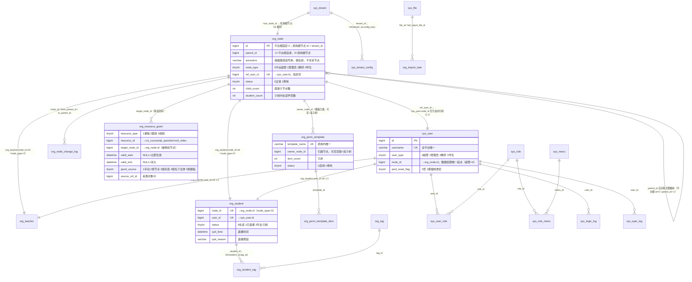
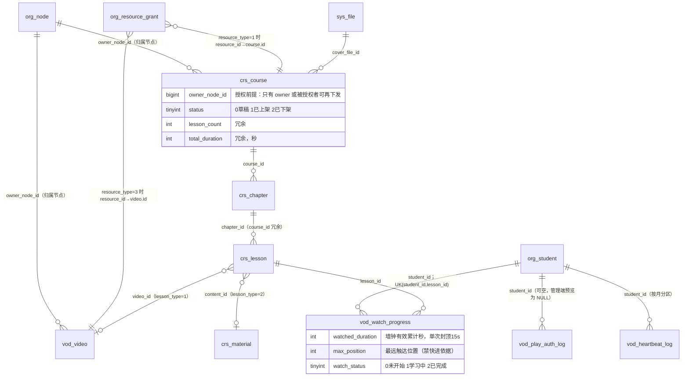
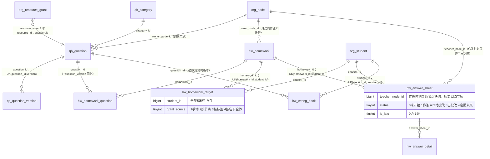
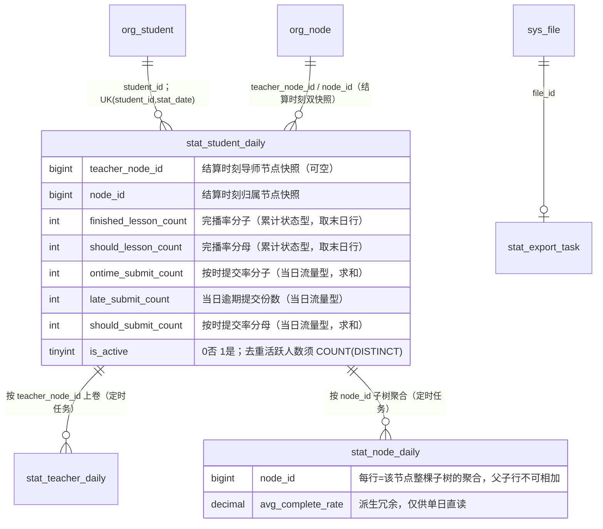

# EduMatrix 数据库设计说明文档

> 日期：2026-08-12
> 数据库：MySQL 8.0+（utf8mb4 / utf8mb4_0900_ai_ci / InnoDB）
> 本文档与 `docs/sql/edumatrix_ddl.sql` 逐字段一致，与 `docs/DESIGN-CONTRACT.md`（设计契约）共同构成数据层唯一权威。若三者出现出入，以设计契约为准，先改契约再改本文与 DDL。
>
>
> **一句话读懂本系统**：系统里的每一个组织单元和每一个人都是同一棵树上的节点；**你能看到的数据 = 你所在节点的子树**；课程/题目/视频**逐级显式下发、不向下继承**。

---

## 1. 设计总览

### 1.1 设计原则

| 原则 | 落地方式 |
| --- | --- |
| **统一组织树** | 平台超管、管理员、教师、学生**全部是 `org_node` 的节点**（`node_type` 1/2/3/4），一棵树到底。师生关系由树的父子结构表达（学生挂在教师节点下 = 该导师名下学员），不设独立的分组表与师生关系表。树顶是唯一一行 `id=0` 的虚拟平台根（`parent_id=-1`、`ancestors=''`、`tenant_id=0`）。 |
| **数据权限只有一条规则** | **你能看到的数据 = 你所在节点的子树**：`node.id = #{myNodeId} OR FIND_IN_SET(#{myNodeId}, node.ancestors)`。全系统不存在第二套过滤逻辑；平台超管的 `sys_user.node_id = 0`（平台根），其子树即全平台，因此**连超管都不需要特例分支**。角色只决定"能执行什么操作"，树只决定"能看到哪些数据"（契约 §2.4、§3）。 |
| **资源逐级下发、无继承** | 受管资源（课程/题目/视频）各带 `owner_node_id`，授权落在 `org_resource_grant`。上级拥有 ≠ 下级自动拥有，**每一层都必须显式授权**；判定"某节点能否用某资源"只需一条命中、不回溯祖先链；撤销必须**级联回收**整棵子树。详见 §3.3。 |
| **多租户隔离** | 机构 = 租户，机构根节点的 `id` 即该租户的 `tenant_id`。除 `sys_menu`、`sys_tenant` 平台级表外所有表带 `tenant_id`，MyBatis-Plus 租户插件在 SQL 层自动注入过滤；跨租户访问一律 404（不暴露存在性）。租户隔离是硬边界，与子树权限是**两道独立防线**，不得互相替代。 |
| **软删除（逻辑删除）** | 核心业务数据禁止物理删除，统一将 `deleted_at` 由 0 置为当前毫秒时间戳。唯一索引与软删的冲突采用【方案A：唯一索引末尾追加 `deleted_at`】，详见 §7。日志/心跳明细表（`sys_login_log`、`sys_oper_log`、`vod_play_auth_log`、`vod_heartbeat_log`）按契约例外允许按时间/分区物理归档；其中仅 `vod_heartbeat_log` 不带 `deleted_at`。 |
| **版本快照** | 题目内容存于不可变的 `qb_question_version`，题目物理 ID（雪花，永不复用）恒定；作业布置时固化 `question_version`，作答明细与错题本同样快照版本号，规避"题库更新导致历史内容错位"。 |
| **归属快照** | `hw_answer_sheet.teacher_node_id`（作答时刻）与 `stat_student_daily.teacher_node_id` / `node_id`（结算时刻）为归属快照：**历史归原导师、以自然日为结算单位**，已结算行永不重算（契约 §2.6）。详见 §3.5。 |
| **统计存分子分母** | `stat_` 表凡比率指标一律落库**分子列 + 分母列**，绝不只存比率——比率不可跨天平均。统计列进一步分为**累计状态型**（`finished/should_lesson_count`，区间取末日行、严禁跨天求和）与**当日流量型**（`*_submit_count`、`watch_seconds`，区间跨天求和），两类取值方式相反，列注释已显式标注。详见 §3.6。 |
| **冗余换性能** | 高频读路径预置冗余列，写侧同步维护：`org_node.ancestors`（祖级路径，免递归 CTE）、`org_node.child_count / student_count`、`org_teacher.student_count`、`crs_course.lesson_count / total_duration`、`crs_lesson.course_id / duration`、`vod_watch_progress.course_id`、`hw_homework.total_score / question_count`、`qb_question.stem_preview` 等。 |
| **异步削峰** | 10 秒心跳属高频写：先写 Redis（`vod:hb:{studentId}:{lessonId}`），XXL-Job 每 60s 批量 UPSERT 落盘 `vod_watch_progress`，明细异步追加进按月分区的 `vod_heartbeat_log`。导入（`org_import_task`）与导出（`stat_export_task`）同为异步任务表模式。 |
| **主键与 ID** | 全部表主键统一 `id BIGINT`，雪花算法、Java 侧生成、非自增（`vod_heartbeat_log` 为满足分区键约束采用 `(id, created_time)` 联合主键）。两个例外：平台根节点固定 `id=0`，机构根节点的 `id` 等于其 `tenant_id`。前端/JSON 中 bigint ID 一律以字符串传输防 JS 精度丢失。 |
| **命名规范** | 表名/字段名全小写下划线；前缀 `sys_`/`org_`/`crs_`/`vod_`/`qb_`/`hw_`/`stat_`；唯一索引 `uk_` 前缀，普通索引 `idx_` 前缀；不使用保留字（心跳播放位置命名为 `current_time_sec`）。 |
| **通用字段** | 所有业务表表尾统一携带 `tenant_id / create_by / create_time / update_by / update_time / deleted_at / remark`（契约 §2.2）；平台级表不带 `tenant_id`；日志/心跳明细表按例外精简 `update_by / remark`。 |

### 1.2 表清单总表（41 张）

> 下表与契约第 4 节表清单（sys_ 10 + org_ 10 + crs_ 4 + vod_ 4 + qb_ 3 + hw_ 6 + stat_ 4 = 41 张）及 DDL 实际建表逐张对应，任何一张均不得增删改名。预估行量级按"单机构 1 万学生、运行 3 年"的中位场景给出（详细推算见 §6）。**加粗**为核心表。

| # | 表名 | 说明 | 所属域 | 预估行量级（单机构·3年） |
| --- | --- | --- | --- | --- |
| 1 | `sys_tenant` | 机构（租户）表，id 即 tenant_id，+root_node_id | 系统与组织域 | 1（全平台百级） |
| 2 | `sys_user` | 统一账号表（+node_id 所在节点、+pwd_reset_flag） | 系统与组织域 | ~1.1 万 |
| 3 | `sys_role` | 角色表（RBAC，**已删除 data_scope**） | 系统与组织域 | 十级 |
| 4 | `sys_user_role` | 用户-角色关联表 | 系统与组织域 | ~1.1 万 |
| 5 | `sys_menu` | 菜单/按钮权限表（平台级，无 tenant_id） | 系统与组织域 | 数百（全平台共享） |
| 6 | `sys_role_menu` | 角色-菜单关联表 | 系统与组织域 | 千级 |
| 7 | `sys_file` | 文件表（附件/图文图片/导入导出文件） | 系统与组织域 | 十万级 |
| 8 | `sys_login_log` | 登录日志表（可归档清理） | 系统与组织域 | 千万级（滚动清理） |
| 9 | `sys_oper_log` | 操作日志表（可归档清理） | 系统与组织域 | 百万级（滚动清理） |
| 10 | `sys_tenant_config` | 租户配置表（租户级可配参数） | 系统与组织域 | 十级 |
| 11 | **`org_node`** | **统一组织树（平台超管/管理员/教师/学生同表，每个节点都是一个人）** | 系统与组织域 | ~1.1 万（每人一个节点） |
| 12 | **`org_teacher`** | **教师档案表（1:1 教师节点 / 1:1 sys_user）** | 系统与组织域 | 数百 |
| 13 | **`org_student`** | **学生档案表（1:1 学生节点，+退课字段）** | 系统与组织域 | ~1 万 |
| 14 | **`org_node_change_log`** | **节点异动轨迹（移动/分配/转交/归档）** | 系统与组织域 | ~4 万 |
| 15 | **`org_resource_grant`** | **资源逐级下发授权（最高频鉴权表）** | 系统与组织域 | ~4 万 / 机构（见 §6） |
| 16 | **`org_perm_template`** | **权限模板（抵消逐级授权的操作成本）** | 系统与组织域 | 十级 |
| 17 | **`org_perm_template_item`** | **模板资源明细** | 系统与组织域 | 千级 |
| 18 | **`org_tag`** | **标签定义（仅筛选与批量，不参与鉴权）** | 系统与组织域 | 十级 |
| 19 | **`org_student_tag`** | **学生-标签 M:N** | 系统与组织域 | ~3 万 |
| 20 | `org_import_task` | Excel 导入任务表 | 系统与组织域 | 千级 |
| 21 | `crs_course` | 课程表（**+owner_node_id**） | 课程与视频域 | 数百 |
| 22 | `crs_chapter` | 章/节表（两级树） | 课程与视频域 | 千级 |
| 23 | `crs_lesson` | 课时表 | 课程与视频域 | ~1 万 |
| 24 | `crs_material` | 图文资料内容表 | 课程与视频域 | 千级 |
| 25 | `vod_video` | 云端媒资表（**+owner_node_id**） | 课程与视频域 | ~1 万 |
| 26 | `vod_play_auth_log` | 播放凭证发放记录表（审计，可归档） | 课程与视频域 | 千万级（滚动清理） |
| 27 | `vod_watch_progress` | 学习进度表（学生×课时聚合态） | 课程与视频域 | ~400 万 |
| 28 | `vod_heartbeat_log` | 心跳明细表（按月分区，保留 6 个月） | 课程与视频域 | 常驻 ~0.95 亿（分区轮转） |
| 29 | `qb_category` | 题库分类树表 | 题库与作业域 | 百级 |
| 30 | `qb_question` | 题目主表（物理 ID 恒定，**+owner_node_id**） | 题库与作业域 | ~5 万 |
| 31 | `qb_question_version` | 题目版本快照表（不可变） | 题库与作业域 | ~10 万 |
| 32 | `hw_homework` | 作业/试卷定义表（**+owner_node_id**） | 题库与作业域 | ~5 万 |
| 33 | `hw_homework_question` | 作业-题目表（固化版本） | 题库与作业域 | ~75 万 |
| 34 | **`hw_homework_target`** | **分发对象表（全量精确到学生）** | 题库与作业域 | ~240 万 |
| 35 | **`hw_answer_sheet`** | **学生答卷表（class_id → teacher_node_id 快照）** | 题库与作业域 | ~240 万 |
| 36 | `hw_answer_detail` | 逐题作答明细表 | 题库与作业域 | ~3600 万 |
| 37 | `hw_wrong_book` | 动态错题本表 | 题库与作业域 | ~50 万 |
| 38 | **`stat_student_daily`** | **学生日汇总（唯一事实表，双快照 + 分子分母）** | 统计域 | ~750 万 |
| 39 | **`stat_teacher_daily`** | **导师日汇总（按 teacher_node_id 上卷）** | 统计域 | ~22 万 |
| 40 | **`stat_node_daily`** | **节点日汇总（按 node_id 子树聚合）** | 统计域 | ~4 万 |
| 41 | `stat_export_task` | 报表导出任务表（异步） | 统计域 | 千级 |

---

## 2. ER 关系图（逻辑外键）

**为什么不建物理外键（FOREIGN KEY）：**

1. **性能**：物理外键在每次写入时触发父表回查与共享锁，心跳落盘、批量导入、批量授权/分发等高并发批量写场景会放大锁竞争甚至死锁；
2. **软删除语义冲突**：本系统"删除"是给 `deleted_at` 写入毫秒时间戳，父行逻辑删除后子行仍物理存在，物理外键的 `RESTRICT/CASCADE` 语义与之天然矛盾；
3. **自关联树的运维成本**：`org_node.parent_id` 自引用 + 平台根 `parent_id=-1` 的哨兵值本身就无法用物理外键表达；
4. **运维灵活性**：在线 DDL、分区轮转、归档迁移、未来按 `tenant_id` 分库分表都要求表间无物理约束；
5. **一致性由服务层保证**：引用完整性统一在 Service 层校验（如删除媒资前反查引用课时；停用题目前反查作业引用，错误码 30001；删除节点前校验 `child_count`）。

以下 ER 图中的连线均为**逻辑外键**（应用层约定），`A →(字段) B` 表示 `A.字段` 引用 `B.id`。

### 2.1 组织与权限域（核心）



**关键点**：`org_node` 是整张图的枢纽——`sys_user`、`org_teacher`、`org_student`、`org_resource_grant`、`org_perm_template`、`stat_*` 全部围绕它挂载。学生"归谁管"没有独立字段，只由 `org_node.parent_id` 表达。

### 2.2 课程与视频域



> 课程/视频对节点与学生的授权**统一走 `org_resource_grant`**，本域不设独立授权表。

### 2.3 题库与作业域



### 2.4 统计域



**统计架构**：`stat_student_daily` 是**唯一原始事实表**，凭行内双快照向两个维度上卷，不存在第二份原始数据。

---

## 3. 核心设计要点

本章讲透六个"看 DDL 看不出来、但实现时一定会踩坑"的地方。**所有 SQL 均为 MySQL 8.0 语法**，`#{}` 为 MyBatis 参数占位。

### 3.1 org_node：ancestors 冗余路径 vs 递归 CTE

#### 3.1.1 为什么选 ancestors 冗余路径

MySQL 8.0 已支持递归 CTE（`WITH RECURSIVE`），理论上无需冗余路径即可查子树。本项目仍选择 `ancestors` 冗余列，理由如下：

| 维度 | ancestors 冗余路径 | 递归 CTE |
| --- | --- | --- |
| **读性能** | 子树判定退化为**单列条件**，可与业务表 JOIN 后一次过滤；前缀 LIKE 可命中索引 | 每次查询都要实际递归展开，深度 N 就是 N 轮自连接；子树大时中间结果集膨胀 |
| **与业务查询的组合** | `WHERE n.ancestors LIKE '...'` 可直接拼进任意业务 SQL（学员列表、作业列表、统计上卷），**不破坏原有分页与排序** | CTE 结果需物化后再 JOIN，MySQL 对 CTE 无法下推谓词，分页时容易全量物化 |
| **鉴权路径的可预测性** | 鉴权是**每个请求都要跑**的公共路径，必须 O(1) 可预测；冗余列让执行计划稳定 | 执行计划随树形态波动，压测难以覆盖最坏情况 |
| **写代价** | 移动节点需重算整棵子树的 `ancestors`（低频操作，见 3.1.2） | 移动只改 `parent_id`，写侧最轻 |
| **一致性风险** | `ancestors` 与 `parent_id` 可能不一致（需事务保证 + 巡检兜底） | 无冗余即无不一致 |

**结论**：本系统**读远多于写**（鉴权是每请求必经路径，移动节点是人工低频操作），用"写时一次重算"换"读时零递归"是划算的。递归 CTE 仍保留为**巡检工具**——定时任务用 CTE 独立推导一遍真实路径，与 `ancestors` 比对，发现不一致即告警：

```sql
-- 巡检：用递归 CTE 重算真实祖级路径，与冗余列比对
WITH RECURSIVE t (id, parent_id, calc_anc) AS (
    SELECT id, parent_id, '' FROM org_node WHERE id = 0            -- 平台根
    UNION ALL
    SELECT n.id, n.parent_id,
           CASE WHEN t.calc_anc = '' THEN CAST(t.id AS CHAR)
                ELSE CONCAT(t.calc_anc, ',', t.id) END
      FROM org_node n JOIN t ON n.parent_id = t.id
     WHERE n.deleted_at = 0
)
SELECT n.id, n.ancestors AS stored, t.calc_anc AS expected
  FROM org_node n JOIN t ON t.id = n.id
 WHERE n.ancestors <> t.calc_anc;
```

#### 3.1.2 子树查询的三条路径（性能关键）

**`FIND_IN_SET(#{nodeId}, ancestors)` 语义最准，但无法走索引**（函数作用在列上，必然全表扫描）。DDL 为此提供三条互补路径，服务层按场景选择：

| 路径 | 写法 | 命中索引 | 适用场景 |
| --- | --- | --- | --- |
| **① 逐层展开（默认）** | `WHERE tenant_id=? AND parent_id IN (...)` | `idx_tenant_parent_sort` | 组织树懒加载、面包屑、BFS 遍历；单层毫秒级 |
| **② 前缀 LIKE（取全子树）** | `WHERE ancestors LIKE CONCAT(P, ',%') OR ancestors = P` | `idx_ancestors(ancestors(255))` | 一次性取整棵子树（统计上卷、级联回收、批量重算） |
| **③ FIND_IN_SET** | `WHERE FIND_IN_SET(?, ancestors)` | 无 | 仅用于已被 `tenant_id` 收敛到小结果集的场景、离线巡检 |

其中 `P` 为目标节点的**自身路径前缀** = `CONCAT(node.ancestors, ',', node.id)`（若 `node.ancestors` 为空串即平台根，则 `P = CAST(node.id AS CHAR)`）。

> **必须写 `ancestors = P OR ancestors LIKE CONCAT(P, ',%')` 两个条件**：直接子节点的 `ancestors` 恰好等于 `P`（后面没有逗号），只写 LIKE 会漏掉整层直接子节点。
>
> **不要写 `LIKE CONCAT(P, '%')`**（少一个逗号）：雪花 ID 虽等长，但 `P` 结尾若是 `...,100`，`LIKE '...,100%'` 会误命中 `...,1001`。必须以逗号收边。

#### 3.1.3 移动节点：子树 ancestors 批量重算的 SQL 思路与事务边界

移动一个节点，等价于把**它与它的整棵子树**从旧路径挪到新路径。核心是一条"前缀替换"UPDATE：

```sql
-- 【事务开始】以下 7 步必须在同一个事务内，任何一步失败全部回滚
START TRANSACTION;

-- 1. 按 id 升序加锁（固定加锁顺序，避免并发移动时死锁）
SELECT id, parent_id, ancestors, node_type, tenant_id
  FROM org_node
 WHERE id IN (#{movingId}, #{targetParentId})
 ORDER BY id
   FOR UPDATE;

-- 2. 前置校验（详见 3.1.4 与下方防成环）：同租户、类型合法、不成环、目标在操作人子树内
--    任一不满足即 ROLLBACK 并返回 1xxxx 段错误码

-- 3. 计算新旧前缀（Java 侧算好后作为参数传入）
--    oldP = 旧 ancestors 为空 ? movingId : CONCAT(旧 ancestors, ',', movingId)
--    newSelfAnc = target.ancestors 为空 ? CAST(target.id AS CHAR)
--                                      : CONCAT(target.ancestors, ',', target.id)
--    newP = CONCAT(newSelfAnc, ',', movingId)

-- 4. 更新被移动节点自身
UPDATE org_node
   SET parent_id = #{targetParentId},
       ancestors = #{newSelfAnc},
       update_by = #{operatorId}
 WHERE id = #{movingId};

-- 5. 【核心】一条 UPDATE 批量重算整棵子树：把旧前缀整体替换为新前缀
--    因 ancestors 一定以 oldP 开头，SUBSTRING 截掉旧前缀后拼上新前缀即可
UPDATE org_node
   SET ancestors = CONCAT(#{newP}, SUBSTRING(ancestors, CHAR_LENGTH(#{oldP}) + 1)),
       update_by = #{operatorId}
 WHERE tenant_id = #{tenantId}
   AND (ancestors = #{oldP} OR ancestors LIKE CONCAT(#{oldP}, ',%'));   -- 命中 idx_ancestors

-- 6. 维护冗余计数：旧父 child_count-1、新父 child_count+1；
--    student_count 沿【旧父到根】与【新父到根】两条链自底向上加减（子树学员数为增量）
UPDATE org_node SET child_count = child_count - 1 WHERE id = #{oldParentId};
UPDATE org_node SET child_count = child_count + 1 WHERE id = #{targetParentId};
UPDATE org_node SET student_count = student_count - #{movedStudentCnt}
 WHERE id IN (#{oldParentId}, ...Java 侧 split(oldParentAncestors, ',') 得到的祖先 id 列表...);
-- 注意：绝不可写成 WHERE id = ? OR FIND_IN_SET(id, '常量串')。
-- FIND_IN_SET 的第一个参数是【列】，无法走索引，MySQL 必然全表扫描；
-- 而 InnoDB 的 UPDATE 会对扫描过程中经过的每一行加行锁（RR 下还有间隙锁）。
-- 这条 UPDATE 跑在一个已持有 FOR UPDATE 锁的事务里，等于每次分配导师
-- 都把整张 org_node（单租户约 1.1 万行）锁一遍，并发移动直接串行化，
-- 且极易与步骤 1 规定的 id 升序加锁顺序形成死锁。
-- ancestors 本就是逗号串，Java 侧 split 后用 IN 即可精确锁定几行。
UPDATE org_node SET student_count = student_count + #{movedStudentCnt}
 WHERE id IN (#{targetParentId}, ...Java 侧 split(targetParentAncestors, ',') 得到的祖先 id 列表...);

-- 7. 写异动轨迹（change_type：2分配导师 / 3转交管理员 / 4教师调岗 / 8节点移动）
INSERT INTO org_node_change_log (id, node_id, change_type, from_parent_id, to_parent_id,
                                 change_time, operator_id, reason, tenant_id, create_by,
                                 create_time, update_time, deleted_at)
VALUES (#{snowflakeId}, #{movingId}, #{changeType}, #{oldParentId}, #{targetParentId},
        NOW(), #{operatorId}, #{reason}, #{tenantId}, #{operatorId}, NOW(), NOW(), 0);

COMMIT;
-- 【事务结束】
```

**事务边界的四条硬要求**：

1. **校验、移动、重算、计数、轨迹必须同事务**（契约 §2.3 约束 4、§9.2 铁律 1）。若重算脱离事务，中途失败会留下"`parent_id` 已改、`ancestors` 未改"的裂开状态——而 `ancestors` 正是鉴权依据，裂开即**越权**。
2. **加锁顺序固定为 id 升序**。两个管理员同时互相移动对方子树内的节点时，乱序加锁必然死锁。
3. **子树规模与锁持有时间**：单租户全树上限约 1.1 万行（每人一节点），第 5 步 UPDATE 走 `idx_ancestors` 前缀范围扫描，实测万级行内 100ms 量级，可接受。若某机构子树超 5 万行，应改为**分批 UPDATE（每批 5000 行，同一事务内循环）**，避免单条 UPDATE 长时间持有大量行锁。
4. **禁止跨租户移动**：`moving.tenant_id` 必须等于 `target.tenant_id`，否则整棵子树的 `tenant_id` 都要改写，属于"迁租户"运维动作，不走此接口。

#### 3.1.4 防成环校验的具体写法

成环的唯一成因：**把节点移动到自己的后代下面**（或移到自己身上）。校验只需一条 SQL，且必须在同一事务内、拿到锁之后执行：

```sql
-- 返回 1 = 允许移动；返回 0 = 拒绝（成环或跨租户），抛 1xxxx 段错误码
SELECT COUNT(*)
  FROM org_node
 WHERE id = #{targetParentId}
   AND deleted_at = 0
   AND tenant_id = #{tenantId}                    -- 跨租户禁止
   AND id <> #{movingId}                          -- ① 不能移到自己身上
   AND FIND_IN_SET(#{movingId}, ancestors) = 0;   -- ② 目标不能是自己的后代
```

要点：

- **两个条件缺一不可**：`id <> movingId` 挡住"移到自己"，`FIND_IN_SET(...) = 0` 挡住"移到自己的后代"。只写后者会漏掉自环（节点自身的 `ancestors` 不含自己）。
- 此处 `FIND_IN_SET` **无性能问题**：`id = #{targetParentId}` 已把结果集收敛到 1 行，函数只在这一行上求值。
- **必须在 `FOR UPDATE` 拿到锁之后再校验**。否则两个并发事务可能同时通过校验（A 把 X 移到 Y 下、B 把 Y 移到 X 下），提交后成环。
- **等价的纯 Java 写法**（避免多一次查询）：拿到 `targetParent.ancestors` 后判断 `targetParentId != movingId && !splitToSet(targetParent.ancestors).contains(movingId)`，语义完全一致。
- **兜底巡检**：即便有事务保护，仍建议每日跑一次 3.1.1 的递归 CTE 巡检；递归 CTE 遇到环会**自然被 `cte_max_recursion_depth` 截断报错**，这本身就是一个成环探测器。

#### 3.1.5 node_type 承载规则的落库校验点

契约 §2.3 的承载规则（教师下只能挂学生、学生必为叶子）**无法用 MySQL 约束表达**——`CHECK` 约束不能跨行查询父节点，本项目又不使用触发器。因此必须在服务层枚举**全部会改变父子关系的入口**并逐一校验，遗漏任何一个都会破坏树的语义：

| 落库校验点 | 校验内容 | 违反时 |
| --- | --- | --- |
| **新建人员**（建管理员 / 教师 / 学生） | 父节点 `node_type=0` → 新节点必须为 1；`=1` → 允许 1/2/3；`=2` → 必须为 3；`=3` → 一律拒绝（学生必为叶子） | 拒绝，1xxxx 段错误码 |
| **移动节点** | 同上，按**目标父节点**的 `node_type` 判定；另需校验被移动节点若为 `node_type=1/2`，目标父不得为 2 或 3 | 拒绝 |
| **修改 node_type** | **直接禁止**。人员类型变更（教师转管理员）应走"改角色 + 移动节点"，不得原地改 `node_type`，否则其既有子树可能瞬间违规 | 接口不提供该能力 |
| **删除节点** | `child_count > 0` 拒绝删除（必须先移走子节点）；`node_type=2` 且 `student_count > 0` 时提示"请先转移名下学员" | 拒绝 |
| **建账号** | **所有节点的 `ref_user_id` 均非空**（每个节点都是一个人），且必须与 `sys_user.node_id` 互为反向引用、`node_type` 与 `sys_user.user_type` 相等；一人一节点由 `uk_ref_user_id` 兜住 | 拒绝 |
| **导入学生** | Excel 批量导入时逐行套用"新建人员"规则，失败行进 `org_import_task` 的失败报告，不阻断整批 | 单行失败 |

> 建议把上述判定收敛为一个 `NodeTypeRule.assertCanBeChildOf(parentType, childType)` 静态方法，所有入口共用，杜绝"某个接口忘了校验"。

### 3.2 数据权限：一条规则的实际 SQL 过滤

全系统只有一条规则：**你能看到的数据 = 你所在节点的子树**。登录时把 `sys_user.node_id` 与该节点的 `ancestors` 一并放进会话上下文（Sa-Token Session），之后所有查询复用同一段过滤条件。

**通用过滤片段（MyBatis 拦截器统一注入）**：

```sql
-- 形式 A：语义版（结果集已被 tenant_id 收敛时使用）
AND (n.id = #{myNodeId} OR FIND_IN_SET(#{myNodeId}, n.ancestors))

-- 形式 B：索引版（大结果集必须用这个，命中 idx_ancestors）
AND (n.id = #{myNodeId} OR n.ancestors = #{myPrefix} OR n.ancestors LIKE CONCAT(#{myPrefix}, ',%'))
-- 其中 myPrefix = myAncestors 为空串 ? CAST(myNodeId AS CHAR) : CONCAT(myAncestors, ',', myNodeId)
```

**各角色的实际过滤效果**（同一段 SQL，只是参数不同）：

| 角色 | myNodeId | myPrefix | 实际可见 |
| --- | --- | --- | --- |
| 平台超管 | `0` | `'0'` | 全平台（`ancestors` 以 `0` 开头的全部节点 = 所有租户），且租户插件对超管放行 |
| 机构最高管理员 | 机构根节点 id | `'0,机构id'` | 本机构全部：下级管理员、教师、学生 |
| 下级管理员 | 其管理员节点 id | `'0,机构id,上级id'` | 其子树：更下级管理员、教师、学生 |
| 教师/导师 | 其教师节点 id | `'0,...,管理员id'` | 其子树 = 名下学员（教师节点下只能是学生） |
| 学生 | 其学生节点 id | `'0,...,教师id'` | 仅自身（学生是叶子，子树只有它自己） |

**示例一：查"我可见的学员列表"**（管理员/教师/学生共用同一条 SQL）

```sql
SELECT s.id, s.student_no, u.real_name, u.phone, s.status, n.parent_id
  FROM org_student s
  JOIN org_node   n ON n.id = s.node_id AND n.deleted_at = 0
  JOIN sys_user   u ON u.id = s.user_id AND u.deleted_at = 0
 WHERE s.deleted_at = 0
   AND s.tenant_id  = #{tenantId}                                     -- 租户硬边界（插件注入）
   AND s.status     = 0
   AND (n.id = #{myNodeId}                                            -- 子树规则（唯一数据权限）
        OR n.ancestors = #{myPrefix}
        OR n.ancestors LIKE CONCAT(#{myPrefix}, ',%'))
 ORDER BY s.create_time DESC
 LIMIT #{offset}, #{size};
```

- 教师执行它 → `myPrefix` 是教师节点路径 → 只捞到自己名下学员；
- 机构管理员执行它 → 捞到全机构学员；
- 学生执行它 → 只捞到自己。
- **同一条 SQL、同一个索引路径**，没有 `if (role == TEACHER)` 分支。

**示例二：查"某学员的学习明细"（点开档案页）**

```sql
-- 先做一次归属校验（越权直接 403，不返回数据）
SELECT COUNT(*)
  FROM org_student s JOIN org_node n ON n.id = s.node_id
 WHERE s.id = #{studentId} AND s.tenant_id = #{tenantId}
   AND (n.id = #{myNodeId} OR n.ancestors = #{myPrefix}
        OR n.ancestors LIKE CONCAT(#{myPrefix}, ',%'));
```

**示例三：导师看板按名下学员逐日聚合**

```sql
-- 注意：GROUP BY stat_date 是【同一天内跨学员求和】，与"跨天求和"无关，
--       累计状态型列在同一天内跨学员求和是正确的（见 §3.6.2）
SELECT d.stat_date,
       SUM(d.finished_lesson_count) / NULLIF(SUM(d.should_lesson_count), 0) * 100 AS complete_rate
  FROM stat_student_daily d
  JOIN org_student s ON s.id = d.student_id
  JOIN org_node   n ON n.id = s.node_id
 WHERE d.tenant_id = #{tenantId}
   AND d.stat_date BETWEEN #{from} AND #{to}
   AND (n.id = #{myNodeId} OR n.ancestors = #{myPrefix}
        OR n.ancestors LIKE CONCAT(#{myPrefix}, ',%'))
 GROUP BY d.stat_date;
```

> **注意"看学生"与"看导师"是两个口径**：上面这条是按**当前归属**实时算的（学员档案口径）；导师历史业绩必须改用 `stat_student_daily.teacher_node_id` 快照过滤（业绩口径），见 §3.5。

**三条不可违反的边界**：

1. **标签不得扩大可见范围**：`org_tag` / `org_student_tag` 只用于筛选与批量操作，按标签批量时仍要逐个校验目标是否落在自己子树内；
2. **角色不得扩大可见范围**：`sys_role` 已删除 `data_scope`，角色只管菜单与按钮；
3. **资源授权不得扩大可见范围**：被授权课程 ≠ 能看到别人的学习数据，两件事互不相干。

### 3.3 org_resource_grant：为什么不做继承，以及级联回收

#### 3.3.1 为什么不做继承

"继承模型"是指只在高层授权一次，下级自动拥有，鉴权时沿 `ancestors` 回溯祖先链判断。本项目**明确不采用**：

| 对比项 | 逐级显式授权（本方案） | 继承模型 |
| --- | --- | --- |
| **鉴权查询** | **只需一跳**：`target_node_id = 我 AND resource_id = X AND 有效期内`，`idx_target_resource` 单索引命中，O(1) 且执行计划稳定 | 需回溯整条祖先链：`target_node_id IN (我, 父, 祖父, ..., 根)`，深度越深越慢，且 IN 列表长度不定 |
| **语义歧义** | 无：一个节点持有什么，表里就写着什么 | **祖先链断裂即歧义**：A→B→C，撤销 B 的权限后 C 还有没有权？沿链回溯时 A 仍有权，于是 C "隔代继承"了 A 的授权——这与"逐级收缩"直接冲突 |
| **收缩语义** | 天然收缩：任一节点实际可用 = 其父级显式给它的那一份，不存在跨级穿透 | 需额外引入"拒绝授权/例外表"来实现收缩，复杂度反而更高 |
| **审计与追溯** | 每一行都记录 `grant_by` / `grant_time` / `grant_source`，"这个学员为什么有这门课"一查即知 | 只能追到最高层那一次授权，中间层无记录 |
| **代价** | **行数放大**（详见 §6 容量估算）+ 运维操作成本 | 行数极少 |

**行数放大用两件事抵消**：① 存储便宜（见 §6，百机构规模也就 GB 级）；② 操作成本由**权限模板**（§3.4）抵消。

#### 3.3.2 鉴权查询（最高频路径）

```sql
-- 判定"我能否使用资源 X"：单索引命中，不回溯祖先链
SELECT 1
  FROM org_resource_grant
 WHERE target_node_id = #{myNodeId}
   AND resource_type  = #{type}
   AND resource_id    = #{resourceId}
   AND deleted_at     = 0
   AND (valid_start IS NULL OR valid_start <= NOW())
   AND (valid_end   IS NULL OR valid_end   >= NOW())
 LIMIT 1;

-- 列出"我能用哪些课程"：同一个索引 idx_target_resource(target_node_id, resource_type, resource_id, deleted_at, valid_end)
SELECT g.resource_id, c.course_name, c.cover_file_id, g.valid_end
  FROM org_resource_grant g
  JOIN crs_course c ON c.id = g.resource_id AND c.deleted_at = 0 AND c.status = 1
 WHERE g.target_node_id = #{myNodeId}
   AND g.resource_type  = 1
   AND g.deleted_at     = 0
   AND (g.valid_end IS NULL OR g.valid_end >= NOW());
```

> **实测**：2 万行样本上 `EXPLAIN` 该查询为 `type=range, key=idx_target_resource, rows=1`。补上 resource_id 后点查由「扫该节点全部授权行（原 135 行）再逐行过滤」变为 1 行命中——对 5000 QPS 的布尔点查，这是两个数量级的差别；列表查询走前三列前缀，效果不劣于原索引扫描。

#### 3.3.3 级联回收的实现思路（必须实现）

撤销某节点的资源授权时，**必须同时撤销该资源在目标节点整棵子树内的全部授权**。否则会出现"父级已无权、子级仍持有"的**悬挂授权**，逐级收缩被破坏（契约 §2.5 规则 5、§9.2 铁律 3）。

```sql
START TRANSACTION;

-- 1. 取目标节点路径前缀 P（并加锁防并发授权）
SELECT id, ancestors FROM org_node WHERE id = #{targetNodeId} FOR UPDATE;
--    P = ancestors 为空串 ? CAST(id AS CHAR) : CONCAT(ancestors, ',', id)

-- 2. 【核心】一条 UPDATE 撤销"目标节点 + 其整棵子树"内该资源的全部有效授权
UPDATE org_resource_grant g
  JOIN org_node n ON n.id = g.target_node_id
   SET g.deleted_at  = 1,
       g.update_by   = #{operatorId},
       g.update_time = NOW()
 WHERE g.resource_type = #{type}          -- 先用 idx_resource_type_id 把候选行收敛到"该资源的全部授权"
   AND g.resource_id   = #{resourceId}
   AND g.deleted_at    = 0
   AND g.tenant_id     = #{tenantId}
   AND (n.id = #{targetNodeId}            -- 再用子树条件过滤
        OR n.ancestors = #{P}
        OR n.ancestors LIKE CONCAT(#{P}, ',%'));

-- 3. 写操作日志（sys_oper_log），记录本次级联影响行数，便于事后核对

COMMIT;
```

**四个实现要点**：

1. **驱动顺序**：先用 `idx_resource_type_id(resource_type, resource_id)` 把候选行收敛到"该资源的全部授权行"（单资源通常几十到几千行），再 JOIN `org_node` 做子树过滤。反过来先扫子树节点会放大很多倍。
2. **学习记录一律保留不删**：`vod_watch_progress`、`hw_answer_sheet`、`hw_wrong_book` **绝不随授权撤销而删除**，学员只是失去继续访问权，历史数据完整保留（契约 §2.5 规则 5）。
3. **撤销是逻辑删除**：给 `deleted_at` 写入毫秒时间戳而非物理删除，保留"谁在什么时候撤了谁的权"的审计链；注意唯一索引 `uk_resource_target` 末尾含 `deleted_at`，同一业务键**最多容纳一条已删除记录**，因此重新授权时应走 `INSERT ... ON DUPLICATE KEY UPDATE deleted_at=0`（复用原行）而不是插新行，详见 §7。
4. **节点移动会天然产生悬挂**：把教师连人带学员从管理员 A 移到管理员 B 下时，学员仍持有 A 下发的资源，而新父 B 可能无权。**移动接口不自动回收**（否则学员正在学的课会突然消失），改由巡检发现后由管理员决策，这是有意的产品取舍。

#### 3.3.4 悬挂授权巡检（兜底防线）

每日凌晨定时任务扫描"子节点持有、但父节点既非 owner 又无有效授权"的行，只告警不自动清理（避免误伤学员在学资源）：

```sql
-- 以课程（resource_type=1）为例，题目/视频同构，可 UNION ALL 或分三次跑
SELECT g.id, g.resource_id, g.target_node_id, n.parent_id, g.grant_by, g.grant_time
  FROM org_resource_grant g
  JOIN org_node n ON n.id = g.target_node_id AND n.deleted_at = 0
 WHERE g.resource_type = 1
   AND g.deleted_at    = 0
   AND (g.valid_end IS NULL OR g.valid_end >= NOW())
   AND n.parent_id > 0                                    -- 机构根节点(parent_id=0)与平台根不参与
   -- 父节点不是该资源的 owner
   AND NOT EXISTS (SELECT 1 FROM crs_course c
                    WHERE c.id = g.resource_id AND c.owner_node_id = n.parent_id AND c.deleted_at = 0)
   -- 且父节点没有该资源的有效授权
   AND NOT EXISTS (SELECT 1 FROM org_resource_grant p
                    WHERE p.resource_type = 1 AND p.resource_id = g.resource_id
                      AND p.target_node_id = n.parent_id AND p.deleted_at = 0
                      AND (p.valid_end IS NULL OR p.valid_end >= NOW()));
```

告警输出进运维看板，附"一键级联回收"操作入口（复用 3.3.3 的 SQL）。

### 3.4 权限模板取交集的落库逻辑

模板解决的是"新招一名教师要逐个勾选几百个资源"的运维负担。核心约束：**模板只是批量快捷方式，应用时取交集，绝不放大权限**（契约 §9.2 铁律 3）。

**实际授权 = 模板资源清单 ∩ 授权人当前拥有的资源**，其中"授权人拥有"= 自己是 `owner_node_id` **或** 自己所在节点有该资源的有效授权。

因为雪花 ID 需在 Java 侧生成，落库分两步：

**第一步：算交集与差集（一条 SQL 同时得到"能授的"和"要跳过的"）**

```sql
SELECT i.resource_type,
       i.resource_id,
       CASE WHEN owned.ok IS NULL THEN 0 ELSE 1 END AS grantable   -- 1=交集内可授，0=授权人已无权，跳过
  FROM org_perm_template_item i
  LEFT JOIN LATERAL (
        SELECT 1 AS ok
         WHERE EXISTS (  -- ① 授权人已被显式授权且在有效期内
                 SELECT 1 FROM org_resource_grant g
                  WHERE g.resource_type   = i.resource_type
                    AND g.resource_id     = i.resource_id
                    AND g.target_node_id  = #{granterNodeId}
                    AND g.deleted_at      = 0
                    AND (g.valid_start IS NULL OR g.valid_start <= NOW())
                    AND (g.valid_end   IS NULL OR g.valid_end   >= NOW()))
            OR EXISTS (  -- ② 或授权人自己就是资源 owner
                 SELECT 1 FROM crs_course c
                  WHERE i.resource_type = 1 AND c.id = i.resource_id
                    AND c.owner_node_id = #{granterNodeId} AND c.deleted_at = 0)
            OR EXISTS (
                 SELECT 1 FROM qb_question q
                  WHERE i.resource_type = 2 AND q.id = i.resource_id
                    AND q.owner_node_id = #{granterNodeId} AND q.deleted_at = 0)
            OR EXISTS (
                 SELECT 1 FROM vod_video v
                  WHERE i.resource_type = 3 AND v.id = i.resource_id
                    AND v.owner_node_id = #{granterNodeId} AND v.deleted_at = 0)
  ) owned ON TRUE
 WHERE i.template_id = #{templateId}
   AND i.deleted_at  = 0;
```

**第二步：对 `grantable=1` 的行批量落库（雪花 ID Java 侧生成，每批 500 行）**

```sql
INSERT INTO org_resource_grant
      (id, resource_type, resource_id, target_node_id, valid_start, valid_end,
       grant_source, source_ref_id, grant_by, grant_time,
       tenant_id, create_by, create_time, update_time, deleted_at)
VALUES (?, ?, ?, #{targetNodeId}, #{validStart}, #{validEnd},
        5, #{templateId}, #{granterUserId}, NOW(),
        #{tenantId}, #{granterUserId}, NOW(), NOW(), 0)
   -- 重复应用同一模板时续期而非报错；同时把此前撤销过的行"复活"
   ON DUPLICATE KEY UPDATE valid_start = VALUES(valid_start),
                           valid_end   = VALUES(valid_end),
                           grant_source= 5,
                           source_ref_id = VALUES(source_ref_id),
                           deleted_at  = 0,
                           update_time = NOW();
```

**落库逻辑的六条约束**：

1. **`grant_source` 固定写 5（按权限模板）、`source_ref_id` 写 `template_id`**，这样后续可按 `idx_source` 整批回滚某次模板应用。
2. **差集必须回给前端**：`grantable=0` 的条目要在响应中逐条列出（资源名 + 跳过原因"授权人已无该资源权限"），不能静默丢弃——否则管理员会以为全授成功。
3. **目标节点必须在授权人子树内**：应用模板前先跑一次 §3.2 的子树校验，与取交集是**两道独立校验**，缺一不可。
4. **模板可见性 ≠ 模板可授内容**：模板按 `owner_node_id` 子树可见，上级建的模板下级能用；但下级应用时因取交集自动收缩——同一个"高三数学包"，机构管理员用能授出 20 门课，只拿到 5 门的下级管理员用就只授出 5 门。这正是设计意图。
5. **模板只管资源，不含功能权限**：模板里没有角色、菜单、按钮，操作权限由角色决定，与模板无关。
6. **模板内容变化不追溯**：模板后续增删资源，**不影响**此前已生成的授权行（授权行是快照）；需要同步时重新应用一次模板。

### 3.5 stat_student_daily 双快照：历史归原导师、以日结算

`stat_student_daily` 每行带两个"结算时刻"快照：`teacher_node_id`（当时的导师节点，父节点非教师时为 NULL）与 `node_id`（当时的直属归属节点）。它们让"导师看板的历史永不变化"成为**数据层的性质**，而不是查询时的技巧。

**结算任务（XXL-Job，每日 02:00 结算前一自然日）**：

```sql
INSERT INTO stat_student_daily
      (id, student_id, teacher_node_id, node_id, stat_date,
       watch_seconds, finished_lesson_count, should_lesson_count,
       ontime_submit_count, late_submit_count, should_submit_count, is_active,
       tenant_id, create_by, create_time, update_time, deleted_at)
SELECT #{snowflakeId},
       s.id,
       CASE WHEN p.node_type = 2 THEN p.id ELSE NULL END,   -- 父为教师才算导师，否则 NULL
       p.id,                                                -- 直属归属节点（管理员或教师）
       #{statDate},
       ...指标列（由 vod_watch_progress / hw_answer_sheet 当日增量聚合而来）...
  FROM org_student s
  JOIN org_node n ON n.id = s.node_id AND n.deleted_at = 0
  JOIN org_node p ON p.id = n.parent_id                     -- 结算这一刻的树 = 快照来源
 WHERE s.deleted_at = 0 AND s.status = 0 AND s.tenant_id = #{tenantId}
   ON DUPLICATE KEY UPDATE
       watch_seconds         = VALUES(watch_seconds),
       finished_lesson_count = VALUES(finished_lesson_count),
       should_lesson_count   = VALUES(should_lesson_count),
       ontime_submit_count   = VALUES(ontime_submit_count),
       late_submit_count     = VALUES(late_submit_count),
       should_submit_count   = VALUES(should_submit_count),
       is_active             = VALUES(is_active),
       update_time           = NOW();
-- 【关键】ON DUPLICATE KEY UPDATE 子句中【故意不包含 teacher_node_id / node_id】：
--          任务重跑、指标补数都不会覆盖归属快照 → "已结算行永不重算"由 SQL 本身保证，
--          而不是靠开发者自觉。
```

**"历史归原导师、以日结算"如何成立**：

| 场景 | 数据表现 | 结果 |
| --- | --- | --- |
| 学员 8/01–8/10 在导师甲名下 | 8/01–8/10 的行 `teacher_node_id = 甲` | 甲的看板永远保留这 10 天 |
| 8/11 白天转给导师乙 | 8/11 凌晨 02:00 结算 8/10 时学员还在甲名下 → 8/10 行归甲 | 转导师不影响任何历史行 |
| 8/12 凌晨结算 8/11 | 此刻树上学员已在乙名下 → **8/11 整天归乙** | 与"分母对齐"一致：学员已不在甲名下，若把 8/11 数据留给甲，甲会出现"有数据、无学员"的错配 |
| 甲查 8 月看板 | `WHERE teacher_node_id = 甲 AND stat_date BETWEEN '2026-08-01' AND '2026-08-31'` | 只出 8/01–8/10，干净利落，无需任何异动表回放 |
| 乙查该学员档案 | `WHERE student_id = X`（**不带 teacher_node_id 条件**） | 能看到转入前的完整历史，否则无法督学 |

**两个口径必须分开写、分开取索引**：

```sql
-- 口径一【学员档案：看学生】——按 student_id 全量读，不看归属快照
SELECT * FROM stat_student_daily
 WHERE student_id = #{studentId} AND stat_date BETWEEN #{from} AND #{to};   -- 走 uk_student_date

-- 口径二【导师业绩：看导师】——按结算快照读，只统计该导师名下期间产生的数据
SELECT stat_date, SUM(finished_lesson_count) num, SUM(should_lesson_count) den
  FROM stat_student_daily
 WHERE teacher_node_id = #{myTeacherNodeId} AND stat_date BETWEEN #{from} AND #{to}
 GROUP BY stat_date;                                                        -- 走 idx_teacher_node_date
```

**换绑当日的短暂不一致是预期行为**：`hw_answer_sheet.teacher_node_id` 在**提交时刻**固化，而 `stat_student_daily` 在**次日凌晨**固化。学员 8/11 上午交了作业（答卷快照记甲）、下午转给乙，则 8/11 的日汇总归乙，而那份答卷仍挂在甲名下。"今日实时"按当前归属算、"历史趋势"按结算快照读，两者在换绑当日短暂打架——这是取舍后的既定口径，必须在产品文档与报表脚注中写明，不要当 bug 修。

**上卷（两个维度，同一份事实数据）**：

```sql
-- 导师维度 → stat_teacher_daily
INSERT INTO stat_teacher_daily (..., teacher_node_id, stat_date, student_count,
                                finished_lesson_count, should_lesson_count,
                                ontime_submit_count, should_submit_count,
                                avg_complete_rate, ontime_submit_rate, active_student_count, ...)
SELECT ..., d.teacher_node_id, d.stat_date, COUNT(*),
       SUM(d.finished_lesson_count), SUM(d.should_lesson_count),
       SUM(d.ontime_submit_count),   SUM(d.should_submit_count),
       ROUND(SUM(d.finished_lesson_count) / NULLIF(SUM(d.should_lesson_count), 0) * 100, 2),
       ROUND(SUM(d.ontime_submit_count)   / NULLIF(SUM(d.should_submit_count), 0) * 100, 2),
       SUM(d.is_active), ...
  FROM stat_student_daily d
 WHERE d.stat_date = #{statDate} AND d.teacher_node_id IS NOT NULL
 GROUP BY d.teacher_node_id, d.stat_date;      -- 走 idx_teacher_node_date
```

节点维度（`stat_node_daily`）为**子树聚合**，写法与取舍见 §3.6。

### 3.6 统计口径：分子分母落库、两类列语义与 stat_node_daily 的子树聚合

#### 3.6.1 比率不可跨天平均——必须存分子分母

**核心事实**：`AVG(每日比率) ≠ 区间真实比率`。因为各日分母不同，对日比率取算术平均相当于给每天赋予相同权重，与真实占比无关。

举例：某导师周一应交 100 份、按时交 90（90%），周二应交 2 份、按时交 0（0%）。

- 错误算法：`AVG(90%, 0%) = 45%`
- 正确算法：`(90+0) / (100+2) = 88.2%`

两者相差近一倍。因此本项目 `stat_` 表凡是比率指标，**一律落库分子列 + 分母列**：

| 指标 | 分子 | 分母 |
| --- | --- | --- |
| 完播率 | `finished_lesson_count` | `should_lesson_count` |
| 按时提交率 | `ontime_submit_count` | `should_submit_count` |
| 活跃占比 | `SUM(is_active)`（`stat_student_daily`）/ `active_student_count`（上卷表） | `student_count` |

`stat_teacher_daily` / `stat_node_daily` 仍保留 `avg_complete_rate` / `ontime_submit_rate` 两个派生比率列，但**仅供单日直读展示**（今日卡片、当日排行榜）；**任何跨天区间查询一律走分子分母**。建议在 DAO 层把这两列标注为 `@Deprecated for range query`，并在 Code Review 中把 `AVG(*_rate)` 列为禁用写法。

`NULLIF(分母, 0)` 不可省略：新学员当天没有任何应学课时（分母为 0），不加保护会抛除零错误或产生 NULL 污染整列聚合。

#### 3.6.2 【最易踩坑】统计列分两类语义，取区间值的方式完全不同

**只存分子分母还不够**——还必须分清每一列是"截至该日的累计状态"还是"当日新增的流量"，两者取区间值的方式完全相反。**混用会直接算错数**，这是实现方最容易踩的坑，因此 DDL 的列 COMMENT 已把类型显式写进注释。

| 类型 | 列 | 语义 | 区间取值方式 |
| --- | --- | --- | --- |
| **① 累计状态型** | `finished_lesson_count`、`should_lesson_count` | **截至该日的累计快照**（不是当日新增） | **取末日行**，`严禁跨天求和` |
| **② 当日流量型** | `ontime_submit_count`、`late_submit_count`、`should_submit_count`、`watch_seconds` | 当日新增量 | **跨天求和 Σ** |
| **③ 活跃标记** | `is_active`（事实表）、`active_student_count`（上卷表） | 当日是否活跃 / 当日活跃人数 | 按天求和只得**活跃人日**；区间**去重活跃人数**须回事实表 `COUNT(DISTINCT student_id)` |

三张统计表（`stat_student_daily` / `stat_teacher_daily` / `stat_node_daily`）的对应列**都适用**本规则。

> **重要口径**：`stat_student_daily.finished_lesson_count` 是"**截至该日累计完播课时数**"，不是当日新增；跨天求和会重复计数。

**为什么累计状态型不能求和**：完播率的分子分母是**同一批课时的累计进度**，跨天 Σ 会把同一门课时重复计数。

| 日期 | finished（累计） | should（累计） | 当日完播率 |
| --- | --- | --- | --- |
| 第 1 天 | 10 | 100 | 10% |
| 第 2 天 | 15 | 100 | 15% |

- **正确**（取末日行）：`15 / 100 = 15%`
- **错误**（跨天求和）：`(10+15) / (100+100) = 25/200 = 12.5%` —— 那 10 门课时被数了两遍

```sql
-- ✅ 正确：区间完播率 = 取区间【末日】那一行的分子分母相除
SELECT ROUND(finished_lesson_count / NULLIF(should_lesson_count, 0) * 100, 2) AS complete_rate
  FROM stat_teacher_daily
 WHERE teacher_node_id = #{nodeId}
   AND stat_date <= #{to}
 ORDER BY stat_date DESC
 LIMIT 1;                     -- 累计状态型：末日快照即区间值

-- ✅ 正确：区间按时提交率 = 分子分母各自跨天求和后相除
SELECT ROUND(SUM(ontime_submit_count) / NULLIF(SUM(should_submit_count), 0) * 100, 2) AS ontime_rate
  FROM stat_teacher_daily
 WHERE teacher_node_id = #{nodeId} AND stat_date BETWEEN #{from} AND #{to};

-- ✅ 正确：区间去重活跃学员数（回事实表，不能用 SUM(active_student_count)）
SELECT COUNT(DISTINCT student_id) AS active_students
  FROM stat_student_daily
 WHERE teacher_node_id = #{nodeId} AND stat_date BETWEEN #{from} AND #{to} AND is_active = 1;

-- ❌ 错误一：对累计状态型跨天求和（同一课时重复计数）
SELECT SUM(finished_lesson_count) / SUM(should_lesson_count) FROM stat_teacher_daily WHERE ...;
-- ❌ 错误二：对日比率取平均（各日分母不同，等权平均失真）
SELECT AVG(avg_complete_rate) FROM stat_teacher_daily WHERE ...;
-- ❌ 错误三：把活跃人日当作活跃人数（同一学员活跃 5 天会被数 5 次）
SELECT SUM(active_student_count) FROM stat_teacher_daily WHERE ...;
```

**"完播率变化量"怎么算**：若报表要展示"本区间新增完播课时数"，用**末日行减去首日前一日行**（差分），而不是求和：
`新增完播 = finished(to) − finished(from − 1 日)`。

#### 3.6.3 stat_node_daily = 该节点整棵子树的聚合

契约明确 `stat_node_daily` 每行的值 = **该节点整棵子树内全部学员的汇总**（不是直属汇总）。

**结算写法**：

```sql
-- 对每个管理员节点 X，聚合其整棵子树内学员的当日事实行
INSERT INTO stat_node_daily (..., node_id, stat_date, student_count,
                             finished_lesson_count, should_lesson_count,
                             ontime_submit_count, should_submit_count,
                             avg_complete_rate, ontime_submit_rate, active_student_count, ...)
SELECT ..., x.id, #{statDate}, COUNT(*),
       SUM(d.finished_lesson_count), SUM(d.should_lesson_count),
       SUM(d.ontime_submit_count),   SUM(d.should_submit_count),
       ROUND(SUM(d.finished_lesson_count) / NULLIF(SUM(d.should_lesson_count), 0) * 100, 2),
       ROUND(SUM(d.ontime_submit_count)   / NULLIF(SUM(d.should_submit_count), 0) * 100, 2),
       SUM(d.is_active), ...
  FROM org_node x                                          -- x = 待汇总的节点
  JOIN org_node n ON n.id = x.id                           -- 子树条件：n 在 x 的子树内
                  OR n.ancestors = CONCAT(x.ancestors, ',', x.id)
                  OR n.ancestors LIKE CONCAT(x.ancestors, ',', x.id, ',%')
  JOIN stat_student_daily d ON d.node_id = n.id AND d.stat_date = #{statDate}
 WHERE x.node_type = 1 AND x.deleted_at = 0 AND x.tenant_id = #{tenantId}
 GROUP BY x.id;
```

**取舍说明**：

| | 子树聚合（本方案） | 直属聚合（未采用） |
| --- | --- | --- |
| **读大屏** | **1 行命中**，任意节点点开即出数，无需展开子树 | 每次都要先展开子树节点集合再 `IN (...)` 求和，节点多时 IN 列表巨大 |
| **写代价** | 一个学员的数据会被其**所有祖先节点各计一次**，写放大 = 树深度（本系统 3~5 层，可接受） | 写一次即可 |
| **父子行关系** | **不可相加**：父行已包含子行数据，对多行 SUM 会重复计数 | 可自由相加 |
| **跨节点汇总** | 只能取**最近公共祖先**的那一行 | 任意多节点相加 |

**因此在查询层必须立三条红线**：

1. 读某节点大屏 → `WHERE node_id = #{nodeId} AND stat_date BETWEEN ...`，**永远只取一个 node_id**；
2. 需要"若干个节点合计" → **不能** `WHERE node_id IN (a,b,c)` 然后 SUM，必须回到 `stat_student_daily` 用子树条件重算，或取这几个节点的最近公共祖先行；
3. 跨天区间仍按 3.6.1 / 3.6.2 的规则取值（累计状态型取末日行、当日流量型跨天求和），子树聚合与跨天聚合是两个正交问题，都要遵守。

---

## 4. 分域详细设计

> 字段表均自 `edumatrix_ddl.sql` 逐字段提取。"可空"列：N = NOT NULL，Y = NULL；默认列 `CURRENT_TIMESTAMP` 简写为 `CURRENT_TS`，`ON UPDATE CURRENT_TIMESTAMP` 简写为 `ON UPDATE CURRENT_TS`，无默认写 `—`。以下各表通用字段（`create_by/create_time/update_by/update_time/deleted_at/remark`）语义一致，逐表照列不再重复解释。表的分组顺序与 DDL 中的七个区块一致。

### 4.1 系统与组织域（sys_ 10 张 + org_ 10 张）

#### 4.1.1 sys_tenant 机构（租户）表

用途：一个机构即一个租户，本表 id 即全系统 tenant_id。平台级表，不带 tenant_id 字段。`root_node_id` 指向该机构在统一组织树上的根节点（该节点挂在平台根之下，即 org_node.parent_id=0），其值与本表 id 相同（契约 2.1）。root_node_id 必须允许 NULL：开通租户时存在循环依赖（根节点的 tenant_id 来自租户行 id，租户行的 root_node_id 来自根节点 id），落库顺序固定为「插租户行（root_node_id 暂空）→ 插机构根节点 → 回写 root_node_id」，三步同一事务。

| 字段 | 类型 | 可空 | 默认 | 说明 |
| --- | --- | --- | --- | --- |
| id | BIGINT | N | — | 租户ID（雪花算法，即全系统 tenant_id；契约 2.1：其值 = 该机构在 org_node 上的根节点 id） |
| root_node_id | BIGINT | Y | NULL | 机构根节点ID（→org_node.id，值与本表 id 相同）。【必须允许 NULL】：开通租户存在循环依赖（根节点的 tenant_id 来自租户行 id，租户行的 root_node_id 来自根节点 id），落库顺序固定为「插租户行(root_node_id 暂空) → 插机构根节点 → 回写 root_node_id」，三步同一事务（契约 2.1） |
| name | VARCHAR(100) | N | — | 机构名称 |
| contact_name | VARCHAR(50) | Y | NULL | 联系人姓名 |
| contact_phone | VARCHAR(20) | Y | NULL | 联系人手机号 |
| expire_time | DATETIME | Y | NULL | 服务到期时间（NULL=永久） |
| status | TINYINT | N | 0 | 租户状态：0正常 1停用 |
| max_student_count | INT | N | 0 | 学生账号数上限（0=不限制） |
| create_by | BIGINT | Y | NULL | 创建人 user_id |
| create_time | DATETIME | N | CURRENT_TS | 创建时间 |
| update_by | BIGINT | Y | NULL | 更新人 user_id |
| update_time | DATETIME | N | CURRENT_TS / ON UPDATE CURRENT_TS | 更新时间 |
| deleted_at | BIGINT | N | 0 | 逻辑删除：0=未删除，删除时写入毫秒时间戳 |
| remark | VARCHAR(500) | Y | NULL | 备注 |

索引：

| 索引 | 列 | 支撑查询场景 |
| --- | --- | --- |
| PRIMARY | (id) | 主键 |
| uk_name | (name, deleted_at) | 机构名称唯一（追加 deleted_at 兼容逻辑删除） |
| idx_status_expire | (status, expire_time) | 平台超管租户列表按状态/到期时间筛选 |
| idx_root_node_id | (root_node_id) | 由机构根节点反查租户（组织树自上而下渲染时定位租户信息） |

关系：root_node_id 逻辑指向 org_node.id；本表 id 被全系统所有带 tenant_id 的业务表引用为租户隔离键。本项目不建物理外键。

#### 4.1.2 sys_user 统一账号表

用途：管理员/教师/学生共用同一套登录体系，平台超管 tenant_id=0。两个关键列：node_id 指向该账号在组织树上的节点，与 org_node.ref_user_id 互为反向引用，是契约 2.4 数据权限的唯一起点（可见范围 = 本节点子树），建号即建节点，平台超管亦在树上（node_id=0）；pwd_reset_flag 用于管理员重置密码或批量导入初始密码后强制用户登录改密。

| 字段 | 类型 | 可空 | 默认 | 说明 |
| --- | --- | --- | --- | --- |
| id | BIGINT | N | — | 用户ID（雪花算法） |
| username | VARCHAR(50) | N | — | 登录账号（全平台唯一） |
| password | VARCHAR(100) | N | — | 登录密码（BCrypt 密文，永不明文存储） |
| user_type | TINYINT | N | — | 用户类型：0平台超管 1管理员 2教师 3学生 |
| real_name | VARCHAR(50) | N | — | 真实姓名 |
| phone | VARCHAR(20) | Y | NULL | 手机号（视频跑马灯水印展示用） |
| avatar | VARCHAR(500) | Y | NULL | 头像 URL |
| node_id | BIGINT | Y | NULL | 所在节点ID（→org_node.id，与 org_node.ref_user_id 互为反向引用）：契约 2.4 数据权限唯一起点——可见范围 = 本节点子树；每个人（含平台超管）都在树上，建号即建节点 |
| status | TINYINT | N | 0 | 账号状态：0正常 1停用 |
| pwd_reset_flag | TINYINT | N | 0 | 是否需强制修改密码：0否 1是（管理员重置密码/批量导入初始密码后置 1，登录后强制改密） |
| last_login_time | DATETIME | Y | NULL | 最后登录时间 |
| tenant_id | BIGINT | N | 0 | 租户（机构）ID，平台超管为 0 |
| create_by | BIGINT | Y | NULL | 创建人 user_id |
| create_time | DATETIME | N | CURRENT_TS | 创建时间 |
| update_by | BIGINT | Y | NULL | 更新人 user_id |
| update_time | DATETIME | N | CURRENT_TS / ON UPDATE CURRENT_TS | 更新时间 |
| deleted_at | BIGINT | N | 0 | 逻辑删除：0=未删除，删除时写入毫秒时间戳 |
| remark | VARCHAR(500) | Y | NULL | 备注 |

索引：

| 索引 | 列 | 支撑查询场景 |
| --- | --- | --- |
| PRIMARY | (id) | 主键 |
| uk_username | (username, deleted_at) | 登录账号全平台唯一（错误码 10001 依据） |
| idx_tenant_type_status | (tenant_id, user_type, status) | 机构内按用户类型分页列表 |
| idx_node_id | (node_id) | 按节点反查账号（节点删除/移动前校验、登录时装配数据权限起点） |
| idx_phone | (phone) | 按手机号检索用户 |

关系：node_id 逻辑指向 org_node.id（1:1 反向引用）；被 sys_user_role.user_id、org_teacher.user_id、org_student.user_id 引用；全表所有 create_by / update_by / operator_id / grant_by 语义上均指向本表 id。

#### 4.1.3 sys_role 角色表（RBAC）

用途：承载操作权限的 RBAC 角色定义，tenant_id=0 的四条内置角色为平台预置、随租户开通引用。本表无 data_scope 字段——契约 §3 明确「操作权限由角色定、数据范围由树定」，全系统只有一条数据权限规则（本节点子树），不存在角色级数据档位；内置角色共 4 个：super_admin / org_admin / teacher / student（机构管理员与下级管理员角色相同，差别仅在树的位置，不再需要单独的"节点管理员"角色）。

| 字段 | 类型 | 可空 | 默认 | 说明 |
| --- | --- | --- | --- | --- |
| id | BIGINT | N | — | 角色ID（雪花算法） |
| role_name | VARCHAR(50) | N | — | 角色名称 |
| role_key | VARCHAR(50) | N | — | 角色标识（仅决定操作权限，不决定数据范围）：super_admin平台超管 org_admin管理员 teacher教师/导师 student学生 |
| status | TINYINT | N | 0 | 角色状态：0正常 1停用 |
| sort | INT | N | 0 | 显示顺序（升序） |
| tenant_id | BIGINT | N | 0 | 租户（机构）ID，平台内置角色为 0 |
| create_by | BIGINT | Y | NULL | 创建人 user_id |
| create_time | DATETIME | N | CURRENT_TS | 创建时间 |
| update_by | BIGINT | Y | NULL | 更新人 user_id |
| update_time | DATETIME | N | CURRENT_TS / ON UPDATE CURRENT_TS | 更新时间 |
| deleted_at | BIGINT | N | 0 | 逻辑删除：0=未删除，删除时写入毫秒时间戳 |
| remark | VARCHAR(500) | Y | NULL | 备注 |

索引：

| 索引 | 列 | 支撑查询场景 |
| --- | --- | --- |
| PRIMARY | (id) | 主键 |
| uk_tenant_role_key | (tenant_id, role_key, deleted_at) | 同租户内角色标识唯一（追加 deleted_at 兼容逻辑删除） |

关系：被 sys_user_role.role_id、sys_role_menu.role_id 引用；tenant_id 逻辑指向 sys_tenant.id（内置角色为 0）。

#### 4.1.4 sys_user_role 用户-角色关联表

用途：账号与角色的 M:N 绑定，决定该账号能执行哪些操作；数据可见范围不由本表决定，与树无关。平台超管的绑定记录 tenant_id=0。

| 字段 | 类型 | 可空 | 默认 | 说明 |
| --- | --- | --- | --- | --- |
| id | BIGINT | N | — | 主键ID（雪花算法） |
| user_id | BIGINT | N | — | 用户ID（→sys_user.id） |
| role_id | BIGINT | N | — | 角色ID（→sys_role.id） |
| tenant_id | BIGINT | N | 0 | 租户（机构）ID，平台超管绑定记录为 0 |
| create_by | BIGINT | Y | NULL | 创建人 user_id |
| create_time | DATETIME | N | CURRENT_TS | 创建时间 |
| update_by | BIGINT | Y | NULL | 更新人 user_id |
| update_time | DATETIME | N | CURRENT_TS / ON UPDATE CURRENT_TS | 更新时间 |
| deleted_at | BIGINT | N | 0 | 逻辑删除：0=未删除，删除时写入毫秒时间戳 |
| remark | VARCHAR(500) | Y | NULL | 备注 |

索引：

| 索引 | 列 | 支撑查询场景 |
| --- | --- | --- |
| PRIMARY | (id) | 主键 |
| uk_user_role | (user_id, role_id, deleted_at) | 同一用户不可重复绑定同一角色（追加 deleted_at 兼容逻辑删除） |
| idx_role_id | (role_id) | 按角色反查用户列表 |

关系：user_id 逻辑指向 sys_user.id，role_id 逻辑指向 sys_role.id；登录鉴权时本表 JOIN sys_role_menu → sys_menu 装配权限标识集合。

#### 4.1.5 sys_menu 菜单/按钮权限表

用途：平台级的菜单目录、页面与按钮权限定义，无 tenant_id（所有租户共用同一套菜单树，租户之间的差异由角色绑定决定）。perms 为权限标识，供后端注解与前端按钮级控制使用。

| 字段 | 类型 | 可空 | 默认 | 说明 |
| --- | --- | --- | --- | --- |
| id | BIGINT | N | — | 菜单ID（雪花算法） |
| parent_id | BIGINT | N | 0 | 父菜单ID（0=顶级） |
| menu_name | VARCHAR(50) | N | — | 菜单/按钮名称 |
| menu_type | CHAR(1) | N | — | 类型：M目录 C菜单 F按钮 |
| perms | VARCHAR(100) | Y | NULL | 权限标识（如 org:student:import） |
| path | VARCHAR(200) | Y | NULL | 前端路由地址（按钮类型为空） |
| icon | VARCHAR(100) | Y | NULL | 菜单图标 |
| sort | INT | N | 0 | 显示顺序（升序） |
| visible | TINYINT | N | 1 | 是否显示：0隐藏 1显示 |
| status | TINYINT | N | 0 | 菜单状态：0正常 1停用 |
| create_by | BIGINT | Y | NULL | 创建人 user_id |
| create_time | DATETIME | N | CURRENT_TS | 创建时间 |
| update_by | BIGINT | Y | NULL | 更新人 user_id |
| update_time | DATETIME | N | CURRENT_TS / ON UPDATE CURRENT_TS | 更新时间 |
| deleted_at | BIGINT | N | 0 | 逻辑删除：0=未删除，删除时写入毫秒时间戳 |
| remark | VARCHAR(500) | Y | NULL | 备注 |

索引：

| 索引 | 列 | 支撑查询场景 |
| --- | --- | --- |
| PRIMARY | (id) | 主键 |
| idx_parent_id | (parent_id, sort) | 构建菜单树按父节点取子节点 |

关系：parent_id 自引用本表 id 构成菜单树；被 sys_role_menu.menu_id 引用。本表与 sys_tenant 一样是平台级表，不参与租户过滤。

#### 4.1.6 sys_role_menu 角色-菜单关联表

用途：角色与菜单/按钮权限的 M:N 绑定，是 RBAC 操作权限的落地表。平台内置角色的绑定记录 tenant_id=0。

| 字段 | 类型 | 可空 | 默认 | 说明 |
| --- | --- | --- | --- | --- |
| id | BIGINT | N | — | 主键ID（雪花算法） |
| role_id | BIGINT | N | — | 角色ID（→sys_role.id） |
| menu_id | BIGINT | N | — | 菜单ID（→sys_menu.id） |
| tenant_id | BIGINT | N | 0 | 租户（机构）ID，平台内置角色绑定为 0 |
| create_by | BIGINT | Y | NULL | 创建人 user_id |
| create_time | DATETIME | N | CURRENT_TS | 创建时间 |
| update_by | BIGINT | Y | NULL | 更新人 user_id |
| update_time | DATETIME | N | CURRENT_TS / ON UPDATE CURRENT_TS | 更新时间 |
| deleted_at | BIGINT | N | 0 | 逻辑删除：0=未删除，删除时写入毫秒时间戳 |
| remark | VARCHAR(500) | Y | NULL | 备注 |

索引：

| 索引 | 列 | 支撑查询场景 |
| --- | --- | --- |
| PRIMARY | (id) | 主键 |
| uk_role_menu | (role_id, menu_id, deleted_at) | 同一角色不可重复绑定同一菜单（追加 deleted_at 兼容逻辑删除）。**勿加 `tenant_id`**：`role_id` 是雪花 ID、全局唯一，一个角色只属于一个租户，`(role_id, menu_id)` 跨租户不可能碰撞；加上 `tenant_id` 反而让"同一角色在不同租户下重复绑定同一菜单"成为合法，削弱约束 |
| idx_menu_id | (menu_id) | 按菜单反查授权角色 |

关系：role_id 逻辑指向 sys_role.id，menu_id 逻辑指向 sys_menu.id。

#### 4.1.7 sys_file 文件表

用途：统一承载附件、图文资料图片、导入导出文件等所有上传物的元信息，业务表只存 file_id。storage 区分本地与 OSS（默认 2 即 OSS），biz_type 用于按业务场景检索与清理。

| 字段 | 类型 | 可空 | 默认 | 说明 |
| --- | --- | --- | --- | --- |
| id | BIGINT | N | — | 文件ID（雪花算法） |
| file_name | VARCHAR(255) | N | — | 原始文件名 |
| file_url | VARCHAR(500) | N | — | 访问 URL / 存储路径 |
| file_size | BIGINT | N | 0 | 文件大小（字节） |
| file_type | VARCHAR(50) | Y | NULL | 文件扩展名/MIME 类型（如 xlsx、image/png） |
| storage | TINYINT | N | 2 | 存储位置：1本地 2OSS |
| biz_type | VARCHAR(50) | Y | NULL | 业务类型（course_cover课程封面 material_image图文图片 material_attach图文附件 import_excel导入文件 fail_report导入失败报告 credential_sheet导入账号密码表 export_report导出报表 avatar头像 answer作答附件 common其他） |
| tenant_id | BIGINT | N | 0 | 租户（机构）ID |
| create_by | BIGINT | Y | NULL | 创建人（上传人）user_id |
| create_time | DATETIME | N | CURRENT_TS | 创建时间 |
| update_by | BIGINT | Y | NULL | 更新人 user_id |
| update_time | DATETIME | N | CURRENT_TS / ON UPDATE CURRENT_TS | 更新时间 |
| deleted_at | BIGINT | N | 0 | 逻辑删除：0=未删除，删除时写入毫秒时间戳 |
| remark | VARCHAR(500) | Y | NULL | 备注 |

索引：

| 索引 | 列 | 支撑查询场景 |
| --- | --- | --- |
| PRIMARY | (id) | 主键 |
| idx_tenant_biz | (tenant_id, biz_type, create_time) | 机构内按业务类型检索文件 |

关系：被 crs_course.cover_file_id、crs_material.attachment_file_ids（JSON 数组元素）、org_import_task.file_id / fail_report_file_id、stat_export_task.file_id 等逻辑引用。

#### 4.1.8 sys_login_log 登录日志表

用途：记录所有登录尝试（成功与失败）。按契约 2.2 的日志表例外，本表不带 create_by / update_by / remark，以 login_time 作为业务时间列，允许按时间物理归档清理；deleted_at 仍保留但业务上恒为 0。登录失败且账号不存在时 user_id 为 NULL，仅记录尝试的 username。

| 字段 | 类型 | 可空 | 默认 | 说明 |
| --- | --- | --- | --- | --- |
| id | BIGINT | N | — | 日志ID（雪花算法） |
| user_id | BIGINT | Y | NULL | 用户ID（登录失败且账号不存在时为 NULL） |
| username | VARCHAR(50) | Y | NULL | 尝试登录的账号 |
| ip | VARCHAR(64) | Y | NULL | 登录 IP |
| user_agent | VARCHAR(500) | Y | NULL | 浏览器 UA |
| status | TINYINT | N | 0 | 登录结果：0成功 1失败 |
| msg | VARCHAR(255) | Y | NULL | 结果描述（如 密码错误/验证码错误） |
| login_time | DATETIME | N | CURRENT_TS | 登录时间 |
| tenant_id | BIGINT | N | 0 | 租户（机构）ID |
| update_time | DATETIME | N | CURRENT_TS / ON UPDATE CURRENT_TS | 更新时间 |
| deleted_at | BIGINT | N | 0 | 逻辑删除：0=未删除，删除时写入毫秒时间戳（日志业务恒为 0，清理走物理归档） |

索引：

| 索引 | 列 | 支撑查询场景 |
| --- | --- | --- |
| PRIMARY | (id) | 主键 |
| idx_user_time | (user_id, login_time) | 查询某用户登录轨迹 |
| idx_tenant_time | (tenant_id, login_time) | 机构维度登录日志分页与按时间归档清理 |

关系：user_id 逻辑指向 sys_user.id（可为空，不构成强引用）。

#### 4.1.9 sys_oper_log 操作日志表

用途：记录后台写操作的审计流水，params 为脱敏后的 JSON 文本，cost_ms 供性能排查。与登录日志同属契约 2.2 的日志表例外：不带 create_by / update_by / remark，以 oper_time 作为业务时间列，允许按时间物理归档清理。

| 字段 | 类型 | 可空 | 默认 | 说明 |
| --- | --- | --- | --- | --- |
| id | BIGINT | N | — | 日志ID（雪花算法） |
| user_id | BIGINT | Y | NULL | 操作人 user_id |
| module | VARCHAR(50) | Y | NULL | 业务模块（如 学生管理/作业管理） |
| action | VARCHAR(50) | Y | NULL | 操作动作（如 新增/修改/删除/导出） |
| method | VARCHAR(200) | Y | NULL | 请求方法（HTTP 方法 + 路径或 Java 方法签名） |
| params | TEXT | Y | NULL | 请求参数（JSON 文本，敏感字段已脱敏） |
| ip | VARCHAR(64) | Y | NULL | 操作 IP |
| status | TINYINT | N | 0 | 执行结果：0成功 1失败 |
| error_msg | VARCHAR(2000) | Y | NULL | 失败异常信息 |
| cost_ms | INT | N | 0 | 执行耗时（毫秒） |
| oper_time | DATETIME | N | CURRENT_TS | 操作时间 |
| tenant_id | BIGINT | N | 0 | 租户（机构）ID |
| update_time | DATETIME | N | CURRENT_TS / ON UPDATE CURRENT_TS | 更新时间 |
| deleted_at | BIGINT | N | 0 | 逻辑删除：0=未删除，删除时写入毫秒时间戳（日志业务恒为 0，清理走物理归档） |

索引：

| 索引 | 列 | 支撑查询场景 |
| --- | --- | --- |
| PRIMARY | (id) | 主键 |
| idx_user_time | (user_id, oper_time) | 查询某用户操作轨迹 |
| idx_tenant_module_time | (tenant_id, module, oper_time) | 机构维度按模块/时间检索操作日志 |

关系：user_id 逻辑指向 sys_user.id（可为空，不构成强引用）。

#### 4.1.10 sys_tenant_config 租户配置表

用途：承载"租户可配"的业务参数，键白名单见契约 §5 末（complete_rate_threshold 完播判定阈值、watermark_phone_mask 水印手机号脱敏开关）。config_value 一律字符串存储，由服务层按键解析类型与取值范围；读取时优先取本租户配置，无记录则回落平台默认值。云厂商选择属平台部署级参数，不是租户配置键。

| 字段 | 类型 | 可空 | 默认 | 说明 |
| --- | --- | --- | --- | --- |
| id | BIGINT | N | — | 配置ID（雪花算法） |
| config_key | VARCHAR(50) | N | — | 配置键（如 complete_rate_threshold） |
| config_value | VARCHAR(200) | N | — | 配置值（字符串存储，服务层按键解析类型与取值范围） |
| tenant_id | BIGINT | N | — | 租户（机构）ID |
| create_by | BIGINT | Y | NULL | 创建人 user_id |
| create_time | DATETIME | N | CURRENT_TS | 创建时间 |
| update_by | BIGINT | Y | NULL | 更新人 user_id |
| update_time | DATETIME | N | CURRENT_TS / ON UPDATE CURRENT_TS | 更新时间 |
| deleted_at | BIGINT | N | 0 | 逻辑删除：0=未删除，删除时写入毫秒时间戳 |
| remark | VARCHAR(500) | Y | NULL | 备注 |

索引：

| 索引 | 列 | 支撑查询场景 |
| --- | --- | --- |
| PRIMARY | (id) | 主键 |
| uk_tenant_config_key | (tenant_id, config_key, deleted_at) | 同租户同配置键唯一（配置读写按此点查/UPSERT，追加 deleted_at 兼容逻辑删除） |

关系：tenant_id 逻辑指向 sys_tenant.id；complete_rate_threshold 被 vod_watch_progress 的完播判定读取。

#### 4.1.11 org_node 统一组织树表【全系统核心表】

用途：一棵树到底——**每个节点都是一个人**，不存在独立于人的组织单元节点。node_type 取 0平台超管、1管理员、2教师、3学生（与 sys_user.user_type 取值完全一致），承载规则为：0（超管）只挂 1；1（管理员）可挂 1/2/3；2（教师）下只能挂 3（学生），其直接子节点即"名下学员"；3（学生）必须是叶子。组织层级由管理员节点的嵌套表达——"华东校区"即某位管理员管的那一片，节点名可命名为校区名、ref_user_id 指向该片区负责人。ref_user_id **全部非空**，与 sys_user.node_id 互为反向引用。树顶是全表唯一一行 id=0 的平台根（node_type=0、tenant_id=0、parent_id=-1、ancestors=''），平台超管 sys_user.node_id=0，其子树即全平台，故全系统无需为超管写特例分支。租户约定：机构根节点（即机构最高管理员节点）的 id 即该租户的 tenant_id（契约 2.1），其 parent_id=0 即挂在平台根之下，机构以下所有节点继承同一 tenant_id。

本表是数据权限的唯一依据（契约 2.4）：你能看到的数据 = 你所在节点的子树，判定式 `id = #{myNodeId} OR FIND_IN_SET(#{myNodeId}, ancestors)`，全系统不存在第二套过滤逻辑。ancestors 为逗号分隔的祖级路径，根在前、不含本节点（如 `0,100,101,205`，平台根节点自身为空串），VARCHAR(1000) 约可容纳 50 级，树深度不设上限。子树查询有三条路径，服务层按场景选择：a) 逐层展开（默认推荐），由 idx_tenant_parent_sort 支撑按 parent_id 逐层 IN 查询，适用于树懒加载、面包屑、子树 BFS，单层毫秒级；b) ancestors 前缀 LIKE，用于一次性取全子树，`WHERE ancestors LIKE CONCAT(X.ancestors, ',', X.id, ',%')` 可命中 idx_ancestors 的左前缀索引；c) FIND_IN_SET 语义最准但无法走索引、全表扫描，仅在已被 tenant_id 收敛到小结果集或离线巡检任务中使用。ancestors 重算与移动防成环的实现细节详见 §3.1。

| 字段 | 类型 | 可空 | 默认 | 说明 |
| --- | --- | --- | --- | --- |
| id | BIGINT | N | — | 节点ID（雪花算法；两个特例：平台根节点固定 id=0；机构根节点的 id 即该租户的 tenant_id，契约 2.1） |
| parent_id | BIGINT | N | 0 | 父节点ID（-1=平台根节点自身，全表唯一；0=其父为平台根，即机构最高管理员节点；其余为上级节点 id：管理员的父为上级管理员，教师的父为管理员，学生的父为管理员或教师） |
| ancestors | VARCHAR(1000) | N | '0' | 祖级路径（逗号串，根在前、不含本节点，如 0,100,101,205；平台根节点自身为空串 ''）：子树判定 FIND_IN_SET(#{nodeId},ancestors)；批量取子树用 LIKE CONCAT(ancestors,',',id,',%') 走前缀索引；深度不设上限，1000 字符约容纳 50 级 |
| node_name | VARCHAR(100) | N | — | 节点名称（管理员节点可命名为机构名/校区名以表达组织层级；管理员/教师/学生节点填其真实姓名，与 sys_user.real_name 同步） |
| node_type | TINYINT | N | — | 节点类型：0平台超管 1管理员 2教师 3学生（契约 §5；承载规则：3 下只能挂 4，4 必为叶子） |
| ref_user_id | BIGINT | N | — | 关联账号 user_id（→sys_user.id）：**全部节点非空**（每个节点都是一个人），与 sys_user.node_id 互为反向引用 |
| sort | INT | N | 0 | 同级显示顺序（升序） |
| status | TINYINT | N | 0 | 节点状态：0正常 1停用（停用不改变树结构，仅禁止其账号登录与被分配） |
| child_count | INT | N | 0 | 直接子节点数（冗余计数，增删/移动子节点时同步维护；>0 时禁止删除本节点） |
| student_count | INT | N | 0 | 子树内在读学生节点总数（冗余计数：教师节点=名下学员数，管理员节点=其子树学员总数；异动时自底向上逐级维护） |
| tenant_id | BIGINT | N | — | 租户（机构）ID，平台根节点为 0 |
| create_by | BIGINT | Y | NULL | 创建人 user_id |
| create_time | DATETIME | N | CURRENT_TS | 创建时间 |
| update_by | BIGINT | Y | NULL | 更新人 user_id |
| update_time | DATETIME | N | CURRENT_TS / ON UPDATE CURRENT_TS | 更新时间 |
| deleted_at | BIGINT | N | 0 | 逻辑删除：0=未删除，删除时写入毫秒时间戳（child_count>0 时禁止删除，须先移走子节点） |
| remark | VARCHAR(500) | Y | NULL | 备注 |

索引：

| 索引 | 列 | 支撑查询场景 |
| --- | --- | --- |
| PRIMARY | (id) | 主键 |
| uk_ref_user_id | (ref_user_id, deleted_at) | 一个账号在树上仅占一个节点（用户→节点反查亦走此索引最左前缀；ref_user_id 已收敛为 NOT NULL，本索引因此是强约束，不存在 NULL 绕过） |
| idx_tenant_parent_sort | (tenant_id, parent_id, sort) | 【子树查询主路径】按父节点逐层展开：组织树懒加载、子树 BFS 遍历、机构内定位根节点（parent_id=0）；FIND_IN_SET 无法走索引，逐层查询是默认策略 |
| idx_parent_type | (parent_id, node_type) | 某节点下按类型取人：管理员页"我下面的教师列表"、教师页"我名下的学员列表"（高频） |
| idx_ancestors | (ancestors(255)) | 【子树查询备选路径】ancestors 前缀 LIKE 一次性取全子树（LIKE '0,100,101,%' 可命中左前缀）；亦用于移动节点时按路径前缀批量重算子树 ancestors |
| idx_tenant_type_status | (tenant_id, node_type, status) | 机构内按类型统计/分页（教师总数、学生总数、停用节点巡检） |

关系：parent_id 自引用本表 id 构成整棵树；ref_user_id 与 sys_user.node_id 互为 1:1 反向引用；被 sys_tenant.root_node_id、org_teacher.node_id、org_student.node_id、org_node_change_log.node_id / from_parent_id / to_parent_id、org_resource_grant.target_node_id、org_perm_template.owner_node_id、crs_course / qb_question / vod_video 的 owner_node_id、hw_answer_sheet.teacher_node_id、stat_student_daily.teacher_node_id / node_id、stat_teacher_daily.teacher_node_id、stat_node_daily.node_id 逻辑引用。

#### 4.1.12 org_teacher 教师档案表

用途：教师的档案属性表，与 org_node 的教师节点（node_type=2）1:1、与 sys_user 1:1。教师即一个树节点，其直接子节点就是"名下学员"，师生关系只由树的父子结构表达，不设独立的师生关系表。本表只承载工号/科目/职称等档案属性，不承载任何权限或归属语义。student_count 与 org_node.student_count 同源同步。

| 字段 | 类型 | 可空 | 默认 | 说明 |
| --- | --- | --- | --- | --- |
| id | BIGINT | N | — | 教师ID（雪花算法） |
| node_id | BIGINT | N | — | 教师节点ID（→org_node.id，node_type=2，1:1；名下学员 = 该节点的直接子节点） |
| user_id | BIGINT | N | — | 账号ID（→sys_user.id，1:1） |
| teacher_no | VARCHAR(50) | Y | NULL | 教师工号（机构内编号） |
| subject | VARCHAR(50) | Y | NULL | 任教科目（如 数学/英语） |
| title | VARCHAR(50) | Y | NULL | 职称（如 高级教师） |
| entry_date | DATE | Y | NULL | 入职日期 |
| student_count | INT | N | 0 | 名下在读学员数（冗余计数，与 org_node.student_count 同源同步；分配/转交/调岗/归档时维护） |
| tenant_id | BIGINT | N | — | 租户（机构）ID |
| create_by | BIGINT | Y | NULL | 创建人 user_id |
| create_time | DATETIME | N | CURRENT_TS | 创建时间 |
| update_by | BIGINT | Y | NULL | 更新人 user_id |
| update_time | DATETIME | N | CURRENT_TS / ON UPDATE CURRENT_TS | 更新时间 |
| deleted_at | BIGINT | N | 0 | 逻辑删除：0=未删除，删除时写入毫秒时间戳（节点仍有子节点即名下仍有学员时禁止删除，须先移走学员） |
| remark | VARCHAR(500) | Y | NULL | 备注 |

索引：

| 索引 | 列 | 支撑查询场景 |
| --- | --- | --- |
| PRIMARY | (id) | 主键 |
| uk_node_id | (node_id, deleted_at) | 契约 UK(node_id)：一个教师节点仅一份档案（追加 deleted_at 兼容逻辑删除） |
| uk_user_id | (user_id, deleted_at) | 契约 UK(user_id)：一个账号仅对应一份教师档案（追加 deleted_at 兼容逻辑删除） |
| idx_tenant_teacher_no | (tenant_id, teacher_no) | 机构内按工号检索教师 |
| idx_tenant_subject | (tenant_id, subject) | 机构内按任教科目筛选教师（分配学员时的候选导师列表） |

关系：node_id 逻辑指向 org_node.id（1:1），user_id 逻辑指向 sys_user.id（1:1）；导师维度的统计以 org_node 的教师节点 id 为锚点（stat_teacher_daily.teacher_node_id），而非本表 id。

#### 4.1.13 org_student 学生档案表

用途：学生的档案属性表，与 org_node 的学生节点（node_type=3）1:1、与 sys_user 1:1。学生即一个叶子节点，归属完全由树的位置表达——挂在管理员节点下表示已归属该管理员但尚未分配导师，挂在教师节点下即该导师名下学员；本表没有 node_id 之外的第二个归属字段，"谁是我的导师"由 org_node.parent_id 且该父节点 node_type=2 判定。退课与归档字段（status / quit_time / quit_reason / archive_time），学籍状态枚举见契约 §5 student_status。

| 字段 | 类型 | 可空 | 默认 | 说明 |
| --- | --- | --- | --- | --- |
| id | BIGINT | N | — | 学生ID（雪花算法） |
| node_id | BIGINT | N | — | 学生节点ID（→org_node.id，node_type=3，1:1；父节点即当前归属的管理员或导师） |
| user_id | BIGINT | N | — | 账号ID（→sys_user.id，1:1） |
| student_no | VARCHAR(50) | Y | NULL | 学号（机构内编号） |
| guardian_name | VARCHAR(50) | Y | NULL | 监护人姓名 |
| guardian_phone | VARCHAR(20) | Y | NULL | 监护人手机号 |
| status | TINYINT | N | 0 | 学籍状态：0在读 1已退课(流失) 2毕业归档（契约 §5 student_status） |
| quit_time | DATETIME | Y | NULL | 退课时间（status=1 时写入） |
| quit_reason | VARCHAR(500) | Y | NULL | 退课原因（status=1 时写入，流失分析依据） |
| archive_time | DATETIME | Y | NULL | 毕业归档时间（status=2 时写入） |
| tenant_id | BIGINT | N | — | 租户（机构）ID |
| create_by | BIGINT | Y | NULL | 创建人 user_id |
| create_time | DATETIME | N | CURRENT_TS | 创建时间 |
| update_by | BIGINT | Y | NULL | 更新人 user_id |
| update_time | DATETIME | N | CURRENT_TS / ON UPDATE CURRENT_TS | 更新时间 |
| deleted_at | BIGINT | N | 0 | 逻辑删除：0=未删除，删除时写入毫秒时间戳（学习记录禁止随之删除） |
| remark | VARCHAR(500) | Y | NULL | 备注 |

索引：

| 索引 | 列 | 支撑查询场景 |
| --- | --- | --- |
| PRIMARY | (id) | 主键 |
| uk_node_id | (node_id, deleted_at) | 契约 UK(node_id)：一个学生节点仅一份档案（组织树 → 学员档案的点查入口，追加 deleted_at 兼容逻辑删除） |
| uk_user_id | (user_id, deleted_at) | 契约 UK(user_id)：一个账号仅对应一份学生档案（追加 deleted_at 兼容逻辑删除） |
| idx_tenant_status | (tenant_id, status) | 机构内按学籍状态分页（在读/已退课/已毕业统计与列表） |
| idx_tenant_student_no | (tenant_id, student_no) | 机构内按学号检索学生 |

关系：node_id 逻辑指向 org_node.id（1:1），user_id 逻辑指向 sys_user.id（1:1）；本表 id 被 org_student_tag.student_id、hw_homework_target.student_id、hw_answer_sheet.student_id、hw_wrong_book.student_id、vod_watch_progress.student_id、vod_play_auth_log.student_id、vod_heartbeat_log.student_id、stat_student_daily.student_id 逻辑引用。学籍状态变更（退课/归档/恢复）同时写入 org_node_change_log。

#### 4.1.14 org_node_change_log 节点异动轨迹表

用途：记录节点在树上的每一次移动与状态变更。所有异动都统一为"节点在树上的移动"，因此只需记录 from_parent_id → to_parent_id，无需再区分"转导师/转节点"两套字段；教师带学员整体调岗时只记教师节点一行，其学员子树跟随移动但不逐个记录。本表是"这个人为什么归他管"的唯一追溯依据，业务上禁止删除（deleted_at 恒为 0）。归属结算以自然日切分（契约 2.6：转导师当日归新导师）。

| 字段 | 类型 | 可空 | 默认 | 说明 |
| --- | --- | --- | --- | --- |
| id | BIGINT | N | — | 主键ID（雪花算法） |
| node_id | BIGINT | N | — | 发生异动的节点ID（→org_node.id；教师调岗时为教师节点，其学员子树跟随移动但不逐个记录） |
| change_type | TINYINT | N | — | 异动类型：1建档 2分配导师 3转交管理员 4教师调岗 5毕业归档 6归档恢复 7退课 8节点移动（管理员节点自身改父）（契约 §5 change_type） |
| from_parent_id | BIGINT | Y | NULL | 原父节点ID（→org_node.id；change_type=1 建档时为 NULL） |
| to_parent_id | BIGINT | Y | NULL | 新父节点ID（→org_node.id；仅状态类异动 5/6/7 且树位置未变时为 NULL） |
| change_time | DATETIME | N | CURRENT_TS | 异动时间（归属结算以自然日切分，见契约 2.6：转导师当日归新导师） |
| operator_id | BIGINT | Y | NULL | 操作人 user_id |
| reason | VARCHAR(500) | Y | NULL | 异动原因（如 导师离职/学员申请更换/校区调整） |
| tenant_id | BIGINT | N | — | 租户（机构）ID |
| create_by | BIGINT | Y | NULL | 创建人 user_id |
| create_time | DATETIME | N | CURRENT_TS | 创建时间 |
| update_by | BIGINT | Y | NULL | 更新人 user_id |
| update_time | DATETIME | N | CURRENT_TS / ON UPDATE CURRENT_TS | 更新时间 |
| deleted_at | BIGINT | N | 0 | 逻辑删除：0=未删除，删除时写入毫秒时间戳（轨迹业务上禁止删除，恒为 0） |
| remark | VARCHAR(500) | Y | NULL | 备注 |

索引：

| 索引 | 列 | 支撑查询场景 |
| --- | --- | --- |
| PRIMARY | (id) | 主键 |
| idx_node_time | (node_id, change_time) | 学员/教师档案页展示异动时间线（高频） |
| idx_to_parent_time | (to_parent_id, change_time) | 按接收方查询期间转入的下级（导师/管理员业绩口径核对） |
| idx_from_parent_time | (from_parent_id, change_time) | 按转出方查询期间转出的下级（流失与人员流动分析） |
| idx_tenant_type_time | (tenant_id, change_type, change_time) | 机构内按异动类型统计（如当月退课数/转交数） |

关系：node_id / from_parent_id / to_parent_id 三列均逻辑指向 org_node.id；operator_id 逻辑指向 sys_user.id。

#### 4.1.15 org_resource_grant 资源逐级下发授权表【全系统最高频鉴权表】

用途：承载契约 2.5 的资源逐级下发模型。受管资源为课程（resource_type=1）、题目（=2）、视频（=3），每一级都必须显式授权、不向下继承——上级拥有不等于下级自动拥有，任一节点实际可用的资源 = 其父级显式授予它的那一份，天然逐级收缩，不存在跨级穿透。判定"某节点能否使用某资源"只需一跳命中、不回溯祖先链：按 target_node_id + resource_type + resource_id + deleted_at=0 + 有效期区间查询，由最高频索引 idx_target_resource(target_node_id, resource_type, resource_id, deleted_at, valid_end) 单索引命中，无回表回溯、无递归；该索引的列序与"我能用哪些课程/题目/视频"及"我能否用资源 X"两类查询完全对应，而唯一键 uk_resource_target(resource_type, resource_id, target_node_id) 是**全库唯一不追加 deleted_at 的唯一索引**（契约 §2.2 特例）——授权是反复授予/撤销的高频对象，若追加 deleted_at 则第二次撤销即撞唯一键；去掉后重新授权只能走 INSERT ... ON DUPLICATE KEY UPDATE deleted_at=0 复活原行，正确行为被固化进约束本身。服务层强制四条约束：授权人必须已拥有该资源（自己是 owner_node_id 或自己已被有效授权）；目标节点必须在授权人子树内；撤销必须级联回收——递归撤销目标节点整棵子树内该资源的全部授权行（走 idx_resource_type_id 定位），否则会出现"父级已无权、子级仍持有"的悬挂授权。级联回收的实现细节详见 §3.3。已产生的学习记录（vod_watch_progress / hw_answer_sheet / hw_wrong_book）一律保留不删，仅失去继续访问权。

| 字段 | 类型 | 可空 | 默认 | 说明 |
| --- | --- | --- | --- | --- |
| id | BIGINT | N | — | 主键ID（雪花算法） |
| resource_type | TINYINT | N | — | 受管资源类型：1课程 2题目 3视频（契约 §5 resource_type） |
| resource_id | BIGINT | N | — | 资源ID（resource_type=1→crs_course.id，=2→qb_question.id，=3→vod_video.id） |
| target_node_id | BIGINT | N | — | 被授权的目标节点ID（→org_node.id；可以是管理员/教师/学生节点，逐级显式授权，无继承） |
| valid_start | DATETIME | Y | NULL | 授权生效时间（NULL=立即生效） |
| valid_end | DATETIME | Y | NULL | 授权失效时间（NULL=永久有效） |
| grant_source | TINYINT | N | 1 | 授权来源：1手动选择 2按节点批量 3按标签批量 4按名下全体 5按权限模板（契约 §5 grant_source） |
| source_ref_id | BIGINT | Y | NULL | 来源对象ID（grant_source=2→org_node.id，=3→org_tag.id，=4→org_node.id(授权人节点)，=5→org_perm_template.id；=1 时为 NULL） |
| grant_by | BIGINT | Y | NULL | 授权人 user_id |
| grant_time | DATETIME | N | CURRENT_TS | 授权时间 |
| tenant_id | BIGINT | N | — | 租户（机构）ID |
| create_by | BIGINT | Y | NULL | 创建人 user_id |
| create_time | DATETIME | N | CURRENT_TS | 创建时间 |
| update_by | BIGINT | Y | NULL | 更新人 user_id |
| update_time | DATETIME | N | CURRENT_TS / ON UPDATE CURRENT_TS | 更新时间 |
| deleted_at | BIGINT | N | 0 | 逻辑删除：0=未删除，删除时写入毫秒时间戳（撤销授权=置 1，级联回收对子树内同资源行批量置 1） |
| remark | VARCHAR(500) | Y | NULL | 备注 |

索引：

| 索引 | 列 | 支撑查询场景 |
| --- | --- | --- |
| PRIMARY | (id) | 主键 |
| uk_resource_target | (resource_type, resource_id, target_node_id) | 同一资源对同一节点仅一行。**全库唯一不追加 deleted_at 的唯一索引**（契约 §2.2 特例）：授权反复增删，追加 deleted_at 会在第二次撤销时撞键；去掉后重新授权只能走 UPSERT 复活原行 |
| idx_target_resource | (target_node_id, resource_type, resource_id, deleted_at, valid_end) | 【全系统最高频鉴权查询】"我能用哪些课程/题目/视频" + "我能否用资源X"：按目标节点 + 资源类型 + 有效期单索引命中，不回溯祖先链 |
| idx_resource_type_id | (resource_type, resource_id) | 按资源反查全部被授权节点：级联回收（撤销时定位子树内同资源授权）、悬挂授权巡检、资源删除前影响面评估 |
| idx_source | (grant_source, source_ref_id) | 按来源整批撤销/追溯（模板应用批次回滚、按标签批量授权回收） |
| idx_tenant_grant_time | (tenant_id, grant_time) | 机构内授权流水按时间倒序分页（授权审计） |

关系：target_node_id 逻辑指向 org_node.id；resource_id 按 resource_type 分别逻辑指向 crs_course.id / qb_question.id / vod_video.id；source_ref_id 按 grant_source 分别逻辑指向 org_node.id / org_tag.id / org_perm_template.id；grant_by 逻辑指向 sys_user.id。

#### 4.1.16 org_perm_template 权限模板表

用途：抵消逐级显式授权的操作成本（契约 2.5）——新招一名教师无需逐个勾选几百个资源，套用模板即可一键授权，生成的授权行 grant_source=5。模板只管资源、不含功能权限（角色、菜单、按钮等操作权限由角色决定，与模板无关）。模板可见范围 = owner_node_id 的子树，上级建的模板下级可见可用；应用时实际授权 = 模板资源清单 ∩ 授权人当前拥有的资源，绝不放大权限，差集在响应中列出。删除模板不影响已生成的授权行。

| 字段 | 类型 | 可空 | 默认 | 说明 |
| --- | --- | --- | --- | --- |
| id | BIGINT | N | — | 模板ID（雪花算法） |
| template_name | VARCHAR(100) | N | — | 模板名称（如 高三数学包） |
| owner_node_id | BIGINT | N | — | 归属节点ID（→org_node.id，创建者所在节点；可见范围=该节点子树，上级建的模板下级可见可用） |
| description | VARCHAR(500) | Y | NULL | 模板说明 |
| item_count | INT | N | 0 | 模板资源条目数（冗余计数，明细增删时同步维护） |
| status | TINYINT | N | 0 | 模板状态：0启用 1停用（方向与 sys_user/sys_tenant/org_node 一致） |
| tenant_id | BIGINT | N | — | 租户（机构）ID |
| create_by | BIGINT | Y | NULL | 创建人 user_id |
| create_time | DATETIME | N | CURRENT_TS | 创建时间 |
| update_by | BIGINT | Y | NULL | 更新人 user_id |
| update_time | DATETIME | N | CURRENT_TS / ON UPDATE CURRENT_TS | 更新时间 |
| deleted_at | BIGINT | N | 0 | 逻辑删除：0=未删除，删除时写入毫秒时间戳（删除模板不影响已生成的授权行） |
| remark | VARCHAR(500) | Y | NULL | 备注 |

索引：

| 索引 | 列 | 支撑查询场景 |
| --- | --- | --- |
| PRIMARY | (id) | 主键 |
| uk_tenant_template_name | (tenant_id, template_name, deleted_at) | 机构内模板名唯一（追加 deleted_at 兼容逻辑删除） |
| idx_owner_status | (owner_node_id, status) | 模板可见性：按归属节点取模板（配合子树条件判断下级是否可用） |

关系：owner_node_id 逻辑指向 org_node.id；本表 id 被 org_perm_template_item.template_id 引用，并作为 org_resource_grant.source_ref_id 在 grant_source=5 时的取值。

#### 4.1.17 org_perm_template_item 模板资源明细表

用途：存放权限模板收录的资源清单明细，一行一个资源。resource_type 与 org_resource_grant 同枚举（契约 §5 resource_type）。父表的 item_count 为本表条目数的冗余计数，明细增删时同步维护。

| 字段 | 类型 | 可空 | 默认 | 说明 |
| --- | --- | --- | --- | --- |
| id | BIGINT | N | — | 主键ID（雪花算法） |
| template_id | BIGINT | N | — | 模板ID（→org_perm_template.id） |
| resource_type | TINYINT | N | — | 受管资源类型：1课程 2题目 3视频（契约 §5 resource_type） |
| resource_id | BIGINT | N | — | 资源ID（resource_type=1→crs_course.id，=2→qb_question.id，=3→vod_video.id） |
| tenant_id | BIGINT | N | — | 租户（机构）ID |
| create_by | BIGINT | Y | NULL | 创建人 user_id |
| create_time | DATETIME | N | CURRENT_TS | 创建时间 |
| update_by | BIGINT | Y | NULL | 更新人 user_id |
| update_time | DATETIME | N | CURRENT_TS / ON UPDATE CURRENT_TS | 更新时间 |
| deleted_at | BIGINT | N | 0 | 逻辑删除：0=未删除，删除时写入毫秒时间戳 |
| remark | VARCHAR(500) | Y | NULL | 备注 |

索引：

| 索引 | 列 | 支撑查询场景 |
| --- | --- | --- |
| PRIMARY | (id) | 主键 |
| uk_template_resource | (template_id, resource_type, resource_id, deleted_at) | 契约 UK(template_id,resource_type,resource_id)：同一模板不可重复收录同一资源（追加 deleted_at 兼容逻辑删除） |
| idx_resource_type_id | (resource_type, resource_id) | 按资源反查引用它的模板（资源下架前提示受影响模板） |

关系：template_id 逻辑指向 org_perm_template.id；resource_id 按 resource_type 分别逻辑指向 crs_course.id / qb_question.id / vod_video.id。

#### 4.1.18 org_tag 标签定义表

用途：承载年级/科目/能力层级等横切属性。这类属性跨导师、跨节点，做成树节点会导致同一年级散落在树的不同深度而无法聚合，故独立成标签体系。标签仅用于筛选与批量操作，不参与任何权限判断：按标签批量授权/分发时仍须逐个校验目标是否在自己子树内，标签不得扩大可见范围（契约 8.2 铁律 2）。tag_group 用于筛选器内的分组互斥展示。

| 字段 | 类型 | 可空 | 默认 | 说明 |
| --- | --- | --- | --- | --- |
| id | BIGINT | N | — | 标签ID（雪花算法） |
| tag_name | VARCHAR(50) | N | — | 标签名称（如 高三/数学/冲刺班） |
| tag_group | VARCHAR(50) | Y | NULL | 标签分组名（如 年级/科目/能力层级；同组标签在筛选器内互斥展示） |
| color | VARCHAR(20) | Y | NULL | 展示色值（如 #409EFF） |
| sort | INT | N | 0 | 显示顺序（升序） |
| tenant_id | BIGINT | N | — | 租户（机构）ID |
| create_by | BIGINT | Y | NULL | 创建人 user_id |
| create_time | DATETIME | N | CURRENT_TS | 创建时间 |
| update_by | BIGINT | Y | NULL | 更新人 user_id |
| update_time | DATETIME | N | CURRENT_TS / ON UPDATE CURRENT_TS | 更新时间 |
| deleted_at | BIGINT | N | 0 | 逻辑删除：0=未删除，删除时写入毫秒时间戳 |
| remark | VARCHAR(500) | Y | NULL | 备注 |

索引：

| 索引 | 列 | 支撑查询场景 |
| --- | --- | --- |
| PRIMARY | (id) | 主键 |
| uk_tenant_tag_name | (tenant_id, tag_name, deleted_at) | 同机构内标签名唯一（追加 deleted_at 兼容逻辑删除） |
| idx_tenant_group_sort | (tenant_id, tag_group, sort) | 标签选择器按分组分区展示 |

关系：本表 id 被 org_student_tag.tag_id 引用，并作为 org_resource_grant.source_ref_id 与 hw_homework_target.source_ref_id 在来源=3（按标签批量）时的取值。

#### 4.1.19 org_student_tag 学生-标签关联表

用途：学生与标签的 M:N 关联，是"按标签批量授权/分发"（grant_source=3）的取数依据。仅作筛选用途，不影响任何权限判定。

| 字段 | 类型 | 可空 | 默认 | 说明 |
| --- | --- | --- | --- | --- |
| id | BIGINT | N | — | 主键ID（雪花算法） |
| student_id | BIGINT | N | — | 学生ID（→org_student.id） |
| tag_id | BIGINT | N | — | 标签ID（→org_tag.id） |
| tenant_id | BIGINT | N | — | 租户（机构）ID |
| create_by | BIGINT | Y | NULL | 创建人 user_id |
| create_time | DATETIME | N | CURRENT_TS | 创建时间 |
| update_by | BIGINT | Y | NULL | 更新人 user_id |
| update_time | DATETIME | N | CURRENT_TS / ON UPDATE CURRENT_TS | 更新时间 |
| deleted_at | BIGINT | N | 0 | 逻辑删除：0=未删除，删除时写入毫秒时间戳 |
| remark | VARCHAR(500) | Y | NULL | 备注 |

索引：

| 索引 | 列 | 支撑查询场景 |
| --- | --- | --- |
| PRIMARY | (id) | 主键 |
| uk_student_tag | (student_id, tag_id, deleted_at) | 契约 UK(student_id,tag_id)：同一学生同一标签仅一条（追加 deleted_at 兼容逻辑删除） |
| idx_tag_id | (tag_id) | 按标签批量拉取学员（grant_source=3 按标签批量授权/分发依据，高频） |

关系：student_id 逻辑指向 org_student.id，tag_id 逻辑指向 org_tag.id。

#### 4.1.20 org_import_task Excel 导入任务表

用途：记录 Excel 批量导入的异步任务及其结果统计。file_id 指向导入源文件，status=2/3 时生成失败明细报告并回填 fail_report_file_id 供下载。异步 Worker 按 status 扫描处理中任务。批量导入产生的学生账号会被置 pwd_reset_flag=1，登录后强制改密。

| 字段 | 类型 | 可空 | 默认 | 说明 |
| --- | --- | --- | --- | --- |
| id | BIGINT | N | — | 任务ID（雪花算法） |
| biz_type | TINYINT | N | 1 | 导入业务类型：1学生导入 |
| file_id | BIGINT | N | — | 导入源文件ID（→sys_file.id） |
| total_count | INT | N | 0 | 总行数 |
| success_count | INT | N | 0 | 成功行数 |
| fail_count | INT | N | 0 | 失败行数 |
| status | TINYINT | N | 0 | 任务状态：0处理中 1成功 2部分失败 3失败 |
| target_node_id | BIGINT | N | — | 导入目标父节点ID（→org_node.id）：后台 Worker 的全部输入就是本行，据此决定学员挂在哪个节点下，缺此列导入任务无法执行 |
| template_id | BIGINT | Y | NULL | 套用的权限模板ID（→org_perm_template.id，套用时取交集） |
| credential_file_id | BIGINT | Y | NULL | 账号密码表文件ID（→sys_file.id，biz_type=credential_sheet），仅当存在服务端随机生成初始密码的行时有值，保留 7 天 |
| fail_report_file_id | BIGINT | Y | NULL | 失败明细报告文件ID（→sys_file.id，status=2/3 时生成） |
| tenant_id | BIGINT | N | — | 租户（机构）ID |
| create_by | BIGINT | Y | NULL | 创建人（发起导入者）user_id |
| create_time | DATETIME | N | CURRENT_TS | 创建时间 |
| update_by | BIGINT | Y | NULL | 更新人 user_id |
| update_time | DATETIME | N | CURRENT_TS / ON UPDATE CURRENT_TS | 更新时间 |
| deleted_at | BIGINT | N | 0 | 逻辑删除：0=未删除，删除时写入毫秒时间戳 |
| remark | VARCHAR(500) | Y | NULL | 备注 |

索引：

| 索引 | 列 | 支撑查询场景 |
| --- | --- | --- |
| PRIMARY | (id) | 主键 |
| idx_tenant_time | (tenant_id, create_time) | 机构内导入任务列表按时间倒序分页 |
| idx_status | (status) | 异步 Worker 扫描处理中任务 |

关系：file_id 与 fail_report_file_id 均逻辑指向 sys_file.id；导入成功的每一行会生成 sys_user + org_node + org_student 三条记录，并写入一条 change_type=1（建档）的 org_node_change_log。
### 4.2 课程与视频域（crs_ 4 张 + vod_ 4 张）

#### 4.2.1 crs_course 课程表

用途：机构内课程的定义主表，承载课程名称、封面、科目、简介与上架状态，并冗余课时总数与视频总时长供列表页直读。`owner_node_id`（归属节点，创建时写入创建者所在节点），它是契约 §2.5 的**授权前提**——只有 owner 本人、或已被显式授权且在有效期内的节点，才能把该课程再向下授权。课程是三类**受管资源**之一（`resource_type=1`），对节点与学生的授权统一走 `org_resource_grant`，逐级显式、无继承，本表不设配套授权表。授权模型细节见主文档 §3.3 专栏。课程禁止物理删除，一律逻辑删除。

| 字段 | 类型 | 可空 | 默认 | 说明 |
| --- | --- | --- | --- | --- |
| id | BIGINT | N | — | 课程ID（雪花算法） |
| course_name | VARCHAR(100) | N | — | 课程名称 |
| owner_node_id | BIGINT | N | — | 归属节点ID（→org_node.id，创建时写入创建者所在节点）：契约 2.5 授权前提——只有 owner 或被显式授权者才能再向下授权 |
| cover_file_id | BIGINT | Y | NULL | 封面文件ID（→sys_file.id） |
| subject | VARCHAR(50) | Y | NULL | 所属科目（如 数学/英语） |
| description | VARCHAR(2000) | Y | NULL | 课程简介 |
| status | TINYINT | N | 0 | 课程状态：0草稿 1已上架 2已下架 |
| lesson_count | INT | N | 0 | 课时总数（冗余计数，课时增删时同步维护） |
| total_duration | INT | N | 0 | 视频总时长（冗余，秒） |
| tenant_id | BIGINT | N | — | 租户（机构）ID |
| create_by | BIGINT | Y | NULL | 创建人 user_id |
| create_time | DATETIME | N | CURRENT_TS | 创建时间 |
| update_by | BIGINT | Y | NULL | 更新人 user_id |
| update_time | DATETIME | N | CURRENT_TS / ON UPDATE CURRENT_TS | 更新时间 |
| deleted_at | BIGINT | N | 0 | 逻辑删除：0=未删除，删除时写入毫秒时间戳（课程禁止物理删除） |
| remark | VARCHAR(500) | Y | NULL | 备注 |

索引：

| 索引 | 列 | 支撑查询场景 |
| --- | --- | --- |
| PRIMARY | (id) | 主键 |
| idx_tenant_status | (tenant_id, status) | 机构内课程列表按上架状态筛选 |
| idx_owner_node_status | (owner_node_id, status) | "我创建的课程"列表 / 授权校验时确认自己是否为 owner（高频） |

关系：逻辑外键 `owner_node_id → org_node.id`、`cover_file_id → sys_file.id`；被 `crs_chapter.course_id`、`crs_lesson.course_id`、`hw_homework.course_id` 引用；授权关系由 `org_resource_grant`（`resource_type=1`，`resource_id=crs_course.id`）表达。本项目不建物理外键。

#### 4.2.2 crs_chapter 章/节表

用途：课程目录的两级树，`parent_id=0` 表示"章"，否则表示该章下的"节"。仅承载结构与排序，不承载内容——内容落在 `crs_lesson`。同一课程内章与节共用本表，加载目录时按 `(course_id, parent_id, sort)` 逐层展开。

| 字段 | 类型 | 可空 | 默认 | 说明 |
| --- | --- | --- | --- | --- |
| id | BIGINT | N | — | 章节ID（雪花算法） |
| course_id | BIGINT | N | — | 所属课程ID（→crs_course.id） |
| parent_id | BIGINT | N | 0 | 父节点ID：0=章，否则为该章下的节 |
| chapter_name | VARCHAR(100) | N | — | 章/节名称 |
| sort | INT | N | 0 | 同级显示顺序（升序） |
| tenant_id | BIGINT | N | — | 租户（机构）ID |
| create_by | BIGINT | Y | NULL | 创建人 user_id |
| create_time | DATETIME | N | CURRENT_TS | 创建时间 |
| update_by | BIGINT | Y | NULL | 更新人 user_id |
| update_time | DATETIME | N | CURRENT_TS / ON UPDATE CURRENT_TS | 更新时间 |
| deleted_at | BIGINT | N | 0 | 逻辑删除：0=未删除，删除时写入毫秒时间戳 |
| remark | VARCHAR(500) | Y | NULL | 备注 |

索引：

| 索引 | 列 | 支撑查询场景 |
| --- | --- | --- |
| PRIMARY | (id) | 主键 |
| idx_course_parent_sort | (course_id, parent_id, sort) | 加载课程目录树（章→节按序展开） |

关系：逻辑外键 `course_id → crs_course.id`、`parent_id → crs_chapter.id`（自引用，0 为章）；被 `crs_lesson.chapter_id` 引用。本项目不建物理外键。

#### 4.2.3 crs_lesson 课时表

用途：目录树的叶子，是学习行为的最小单位。`lesson_type=1` 时挂云端媒资（`video_id`），`=2` 时挂图文资料（`content_id`），二者由服务层按类型强制校验必填。`duration` 冗余自 `vod_video`，是完播判定的分母（`watched_duration ≥ duration × 90%`）；`course_id` 冗余自章节，用于绕过 `crs_chapter` 直接做课程维度统计。课时禁止物理删除。

| 字段 | 类型 | 可空 | 默认 | 说明 |
| --- | --- | --- | --- | --- |
| id | BIGINT | N | — | 课时ID（雪花算法） |
| course_id | BIGINT | N | — | 所属课程ID（冗余自章节，加速课程维度查询） |
| chapter_id | BIGINT | N | — | 所属节ID（→crs_chapter.id） |
| lesson_name | VARCHAR(100) | N | — | 课时名称 |
| lesson_type | TINYINT | N | 1 | 课时类型：1视频 2图文 |
| video_id | BIGINT | Y | NULL | 视频媒资ID（→vod_video.id，lesson_type=1 时必填） |
| content_id | BIGINT | Y | NULL | 图文资料ID（→crs_material.id，lesson_type=2 时必填） |
| duration | INT | N | 0 | 视频时长（秒，冗余自 vod_video，完播判定分母） |
| sort | INT | N | 0 | 节内显示顺序（升序） |
| is_free_preview | TINYINT | N | 0 | 是否免费试看：0否 1是 |
| status | TINYINT | N | 1 | 课时状态：0隐藏 1可见 |
| tenant_id | BIGINT | N | — | 租户（机构）ID |
| create_by | BIGINT | Y | NULL | 创建人 user_id |
| create_time | DATETIME | N | CURRENT_TS | 创建时间 |
| update_by | BIGINT | Y | NULL | 更新人 user_id |
| update_time | DATETIME | N | CURRENT_TS / ON UPDATE CURRENT_TS | 更新时间 |
| deleted_at | BIGINT | N | 0 | 逻辑删除：0=未删除，删除时写入毫秒时间戳（课时禁止物理删除） |
| remark | VARCHAR(500) | Y | NULL | 备注 |

索引：

| 索引 | 列 | 支撑查询场景 |
| --- | --- | --- |
| PRIMARY | (id) | 主键 |
| idx_chapter_sort | (chapter_id, sort) | 加载节下课时列表 |
| idx_course_status | (course_id, status) | 课程维度统计可见课时/计算课程进度 |
| idx_video_id | (video_id) | 按媒资反查引用课时（删除媒资前校验） |

关系：逻辑外键 `course_id → crs_course.id`、`chapter_id → crs_chapter.id`、`video_id → vod_video.id`、`content_id → crs_material.id`；被 `vod_watch_progress.lesson_id`、`vod_heartbeat_log.lesson_id`、`vod_play_auth_log.lesson_id` 引用。本项目不建物理外键。

#### 4.2.4 crs_material 图文资料内容表

用途：非视频课时的正文载体，存富文本 HTML 与附件文件 ID 数组。`attachment_file_ids` 为 JSON 数组，元素逐个指向 `sys_file.id`，避免为附件单独建关联表。本表按机构维度独立管理，可被多个课时复用。

| 字段 | 类型 | 可空 | 默认 | 说明 |
| --- | --- | --- | --- | --- |
| id | BIGINT | N | — | 图文资料ID（雪花算法） |
| title | VARCHAR(200) | N | — | 资料标题 |
| content | LONGTEXT | Y | — | 富文本正文（HTML） |
| attachment_file_ids | JSON | Y | — | 附件文件ID数组（JSON，如 ["1953827104412590081"]，元素→sys_file.id） |
| tenant_id | BIGINT | N | — | 租户（机构）ID |
| create_by | BIGINT | Y | NULL | 创建人 user_id |
| create_time | DATETIME | N | CURRENT_TS | 创建时间 |
| update_by | BIGINT | Y | NULL | 更新人 user_id |
| update_time | DATETIME | N | CURRENT_TS / ON UPDATE CURRENT_TS | 更新时间 |
| deleted_at | BIGINT | N | 0 | 逻辑删除：0=未删除，删除时写入毫秒时间戳 |
| remark | VARCHAR(500) | Y | NULL | 备注 |

索引：

| 索引 | 列 | 支撑查询场景 |
| --- | --- | --- |
| PRIMARY | (id) | 主键 |
| idx_tenant_time | (tenant_id, create_time) | 机构内图文资料库列表分页 |

关系：被 `crs_lesson.content_id` 引用；`attachment_file_ids` 内元素逻辑指向 `sys_file.id`。本项目不建物理外键。

#### 4.2.5 vod_video 云端媒资表

用途：腾讯云／阿里云 VOD 媒资的本地镜像，记录云端媒资 ID、时长、封面、加密 HLS 地址与转码状态。上传流程为「预创建（`status=0`，`vod_file_id` 为 NULL）→ 上传完成回调回填 `vod_file_id` → 转码回调回填 `duration`／`hls_url`」，唯一索引 `uk_provider_file` 保证回调幂等（`vod_file_id` 为 NULL 的上传中记录因 MySQL 唯一索引不约束 NULL 而可多条并存）。`owner_node_id`（上传时写入上传者所在节点），是契约 §2.5 的**授权前提**——只有 owner 或被显式授权者才能再向下授权。视频是三类**受管资源**之一（`resource_type=3`），对节点与学生的授权统一走 `org_resource_grant`，逐级显式、无继承。授权模型细节见主文档 §3.3 专栏。

| 字段 | 类型 | 可空 | 默认 | 说明 |
| --- | --- | --- | --- | --- |
| id | BIGINT | N | — | 媒资ID（雪花算法） |
| owner_node_id | BIGINT | N | — | 归属节点ID（→org_node.id，上传时写入上传者所在节点）：契约 2.5 授权前提，视频亦为受管资源（resource_type=3） |
| provider | TINYINT | N | 1 | 云厂商：1腾讯 2阿里 |
| vod_file_id | VARCHAR(100) | Y | NULL | 云端媒资唯一ID（腾讯 FileId / 阿里 VideoId；预创建（status=0）时为 NULL，上传完成回调回填） |
| video_name | VARCHAR(200) | N | — | 视频名称 |
| duration | INT | N | 0 | 视频时长（秒，转码回调后回填） |
| cover_url | VARCHAR(500) | Y | NULL | 云端封面 URL |
| size_bytes | BIGINT | N | 0 | 源文件大小（字节） |
| status | TINYINT | N | 0 | 媒资状态：0上传中 1转码中 2正常 3转码失败 9禁用 |
| hls_url | VARCHAR(500) | Y | NULL | 加密 HLS 播放地址（.m3u8，播放时需另取时效凭证） |
| upload_user_id | BIGINT | Y | NULL | 上传人 user_id |
| tenant_id | BIGINT | N | — | 租户（机构）ID |
| create_by | BIGINT | Y | NULL | 创建人 user_id |
| create_time | DATETIME | N | CURRENT_TS | 创建时间 |
| update_by | BIGINT | Y | NULL | 更新人 user_id |
| update_time | DATETIME | N | CURRENT_TS / ON UPDATE CURRENT_TS | 更新时间 |
| deleted_at | BIGINT | N | 0 | 逻辑删除：0=未删除，删除时写入毫秒时间戳 |
| remark | VARCHAR(500) | Y | NULL | 备注 |

索引：

| 索引 | 列 | 支撑查询场景 |
| --- | --- | --- |
| PRIMARY | (id) | 主键 |
| uk_provider_file | (provider, vod_file_id, deleted_at) | 同一云厂商媒资ID唯一（转码回调幂等定位，追加 deleted_at 兼容逻辑删除；vod_file_id 为 NULL 的上传中记录不参与唯一冲突，可多条并存） |
| idx_tenant_status | (tenant_id, status) | 机构媒资库按转码状态筛选 |
| idx_owner_node_status | (owner_node_id, status) | "我上传的媒资"列表 / 授权校验时确认自己是否为 owner |

关系：逻辑外键 `owner_node_id → org_node.id`、`upload_user_id → sys_user.id`；被 `crs_lesson.video_id`、`vod_play_auth_log.video_id`、`vod_heartbeat_log.video_id` 引用；授权关系由 `org_resource_grant`（`resource_type=3`）表达。本项目不建物理外键。

#### 4.2.6 vod_play_auth_log 播放凭证发放记录表

用途：每次发放播放凭证（PlayAuth／Key）的审计流水，用于排查取证频次异常与凭证盗用。`expire_time` 是错误码 20001（凭证过期）的校验依据，`auth_token` 脱敏截断后存储。

**取证人不只是学生**：管理端预览走的是同一条播放凭证链路（03-课程与视频 §9.1），因此教师与管理员也会产生审计行，而二者没有 `org_student` 档案行。审计主体故统一用 `viewer_user_id`（→`sys_user.id`）+ `viewer_type`，`student_id` 仅在 `viewer_type=3` 时有值、其余为 NULL——若沿用"`student_id NOT NULL`"，管理端每次预览要么插入失败、要么只能不落审计，而预览恰恰是最需要留痕的场景（能看到全机构课程的人在批量取证）。

本表按契约 2.2 的日志例外精简 `update_by` / `remark` / `create_by`（写入方为系统，取证人记于 `viewer_user_id`），仍携带 `deleted_at`（业务上恒为 0），清理走按时间物理归档而非逻辑删除。

| 字段 | 类型 | 可空 | 默认 | 说明 |
| --- | --- | --- | --- | --- |
| id | BIGINT | N | — | 记录ID（雪花算法） |
| viewer_user_id | BIGINT | N | — | 取证人账号ID（→sys_user.id）：学生、教师、管理员均可取证 |
| viewer_type | TINYINT | N | — | 取证人类型（=sys_user.user_type）：1管理员 2教师 3学生 |
| student_id | BIGINT | Y | NULL | 学生ID（→org_student.id）：仅 viewer_type=3 时有值；管理端预览为 NULL |
| lesson_id | BIGINT | N | — | 课时ID（→crs_lesson.id） |
| video_id | BIGINT | N | — | 媒资ID（→vod_video.id） |
| auth_token | VARCHAR(500) | N | — | 发放的播放凭证（PlayAuth/Key，脱敏截断存储） |
| expire_time | DATETIME | N | — | 凭证过期时间（错误码 20001 校验依据） |
| client_ip | VARCHAR(64) | Y | NULL | 请求方 IP |
| create_time | DATETIME | N | CURRENT_TS | 发放时间 |
| tenant_id | BIGINT | N | — | 租户（机构）ID |
| update_time | DATETIME | N | CURRENT_TS / ON UPDATE CURRENT_TS | 更新时间 |
| deleted_at | BIGINT | N | 0 | 逻辑删除：0=未删除，删除时写入毫秒时间戳（日志业务恒为 0，清理走物理归档） |

索引：

| 索引 | 列 | 支撑查询场景 |
| --- | --- | --- |
| PRIMARY | (id) | 主键 |
| idx_viewer_time | (viewer_user_id, create_time) | 审计某账号取证频次（防刷排查），覆盖三类取证人 |
| idx_student_time | (student_id, create_time) | 审计某学员取证频次；NULL 行不入索引，正合需求 |
| idx_lesson_time | (lesson_id, create_time) | 按课时统计取证量 |

关系：逻辑外键 `student_id → org_student.id`、`lesson_id → crs_lesson.id`、`video_id → vod_video.id`。本项目不建物理外键。

#### 4.2.7 vod_watch_progress 学习进度表

用途：学生 × 课时的进度聚合态，是完播率与学习时长统计的唯一读取入口。心跳／完播设计：客户端心跳先写 Redis，XXL-Job 每 60s 批量 UPSERT 落盘本表（依据 `uk_student_lesson`），落盘时刻是**唯一的完播判定时机**。`watched_duration` 为墙钟有效累计秒——复看已看区间同样计入，单次心跳最多计入 `min(实际间隔, 15)` 秒，间隔 <8s 的心跳直接丢弃（返回 20002），从而压制倍速与挂机刷时长；`max_position` 记录最远触达位置以实现禁快进（仅允许回看 ≤ 此值的区间）。完播判定为 `watched_duration ≥ duration × 90%`，90% 为租户级可配项 `complete_rate_threshold`（合法范围 60~100）。心跳接口签名见契约 §6.4。

| 字段 | 类型 | 可空 | 默认 | 说明 |
| --- | --- | --- | --- | --- |
| id | BIGINT | N | — | 主键ID（雪花算法） |
| student_id | BIGINT | N | — | 学生ID（→org_student.id） |
| lesson_id | BIGINT | N | — | 课时ID（→crs_lesson.id） |
| course_id | BIGINT | N | — | 课程ID（冗余自课时，加速课程维度统计） |
| watched_duration | INT | N | 0 | 已看时长（墙钟有效累计秒：复看已看区间同样计入，单次心跳最多计入 min(间隔,15)s；完播判定分子） |
| max_position | INT | N | 0 | 最远触达位置（秒，禁快进：仅允许回看 ≤ 此值区间） |
| watch_status | TINYINT | N | 0 | 完播状态：0未开始 1学习中 2已完成（watched_duration≥duration×90% 置 2，阈值租户可配 complete_rate_threshold） |
| complete_time | DATETIME | Y | NULL | 完播时间（watch_status=2 时写入） |
| last_heartbeat_time | DATETIME | Y | NULL | 最后一次有效心跳时间（间隔合理性校验基准） |
| tenant_id | BIGINT | N | — | 租户（机构）ID |
| create_by | BIGINT | Y | NULL | 创建人 user_id |
| create_time | DATETIME | N | CURRENT_TS | 创建时间 |
| update_by | BIGINT | Y | NULL | 更新人 user_id |
| update_time | DATETIME | N | CURRENT_TS / ON UPDATE CURRENT_TS | 更新时间 |
| deleted_at | BIGINT | N | 0 | 逻辑删除：0=未删除，删除时写入毫秒时间戳 |
| remark | VARCHAR(500) | Y | NULL | 备注 |

索引：

| 索引 | 列 | 支撑查询场景 |
| --- | --- | --- |
| PRIMARY | (id) | 主键 |
| uk_student_lesson | (student_id, lesson_id, deleted_at) | 契约 UK(student_id,lesson_id)：一名学生一个课时仅一条进度（心跳落盘 UPSERT 依据，追加 deleted_at 兼容逻辑删除） |
| idx_lesson_id | (lesson_id) | 教师端查看某课时下名下学员的观看进度（高频） |
| idx_course_student | (course_id, student_id) | 学生课程进度百分比计算/个人档案 |
| idx_lesson_status | (lesson_id, watch_status) | 课时完播率统计（完成人数/总人数） |

关系：逻辑外键 `student_id → org_student.id`、`lesson_id → crs_lesson.id`、`course_id → crs_course.id`；本表是 `stat_student_daily` 观看类指标的上游事实来源。按契约 §2.5，资源授权被撤销时本表记录一律保留不删，仅失去继续访问权。本项目不建物理外键。

#### 4.2.8 vod_heartbeat_log 心跳明细表

用途：逐条心跳原始流水，是防刷审计与进度争议回溯的唯一依据，可按学生×课时回放完整心跳序列。有效性规则与 `vod_watch_progress` 一致：`interval_sec ≥ 8s` 视为有效，单次计入 `min(实际间隔, 15)` 秒，>15s 封顶但不报错。当前播放位置字段命名为 `current_time_sec` 以避开 MySQL 保留字，对应请求体的 `currentTime`。本表按契约第 4 节例外**不带 `deleted_at`**，且精简 `update_by` / `remark`；为满足 MySQL 分区键必须包含在每个唯一键中的约束，主键采用 `(id, created_time)` 联合形式。按 `RANGE (TO_DAYS(created_time))` 每月一个分区，预建 2026-08 ~ 2027-01 共 6 个月分区 + `pmax` 兜底分区；清理一律走 `DROP PARTITION` 秒级裁剪，严禁 `DELETE` 大批量删除。分区轮转与归档的运维流程见主文档 §5。

| 字段 | 类型 | 可空 | 默认 | 说明 |
| --- | --- | --- | --- | --- |
| id | BIGINT | N | — | 记录ID（雪花算法） |
| student_id | BIGINT | N | — | 学生ID（→org_student.id） |
| lesson_id | BIGINT | N | — | 课时ID（→crs_lesson.id） |
| video_id | BIGINT | N | — | 媒资ID（→vod_video.id） |
| current_time_sec | DECIMAL(10,1) | N | 0.0 | 心跳上报时的播放位置（秒，对应请求体 currentTime；命名已避开保留字） |
| interval_sec | INT | N | 0 | 与上次心跳的实际间隔（秒，>=8s 视为有效，单次计入 min(实际间隔,15)） |
| client_ip | VARCHAR(64) | Y | NULL | 客户端 IP |
| device | VARCHAR(200) | Y | NULL | 设备/浏览器标识（UA 摘要） |
| created_time | DATETIME | N | CURRENT_TS | 心跳时间（分区键） |
| tenant_id | BIGINT | N | — | 租户（机构）ID |
| update_time | DATETIME | N | CURRENT_TS / ON UPDATE CURRENT_TS | 更新时间 |

索引：

| 索引 | 列 | 支撑查询场景 |
| --- | --- | --- |
| PRIMARY | (id, created_time) | 主键（联合分区键：MySQL 要求分区列必须包含在每一个唯一键中） |
| idx_student_lesson_time | (student_id, lesson_id, created_time) | 防刷审计：回放某学生某课时的心跳序列 |

分区：`PARTITION BY RANGE (TO_DAYS(created_time))`，`p202608` / `p202609` / `p202610` / `p202611` / `p202612` / `p202701` 各以次月 1 日为 `VALUES LESS THAN` 边界，末尾 `pmax VALUES LESS THAN MAXVALUE`。

关系：逻辑外键 `student_id → org_student.id`、`lesson_id → crs_lesson.id`、`video_id → vod_video.id`；本表是 `vod_watch_progress` 聚合态的原始明细来源。本项目不建物理外键。

### 4.3 题库与作业域（qb_ 3 张 + hw_ 6 张）

#### 4.3.1 qb_category 题库分类树表

用途：机构内题库的分类树（科目 → 知识点），`parent_id=0` 为顶级，支持多级嵌套。仅用于题目归类与选题筛选，不参与任何权限判断——题目的可用范围由 `org_resource_grant` 决定，与分类无关。

| 字段 | 类型 | 可空 | 默认 | 说明 |
| --- | --- | --- | --- | --- |
| id | BIGINT | N | — | 分类ID（雪花算法） |
| parent_id | BIGINT | N | 0 | 父分类ID（0=顶级，支持科目→知识点多级树） |
| category_name | VARCHAR(50) | N | — | 分类名称 |
| sort | INT | N | 0 | 同级显示顺序（升序） |
| tenant_id | BIGINT | N | — | 租户（机构）ID |
| create_by | BIGINT | Y | NULL | 创建人 user_id |
| create_time | DATETIME | N | CURRENT_TS | 创建时间 |
| update_by | BIGINT | Y | NULL | 更新人 user_id |
| update_time | DATETIME | N | CURRENT_TS / ON UPDATE CURRENT_TS | 更新时间 |
| deleted_at | BIGINT | N | 0 | 逻辑删除：0=未删除，删除时写入毫秒时间戳 |
| remark | VARCHAR(500) | Y | NULL | 备注 |

索引：

| 索引 | 列 | 支撑查询场景 |
| --- | --- | --- |
| PRIMARY | (id) | 主键 |
| idx_tenant_parent_sort | (tenant_id, parent_id, sort) | 构建机构题库分类树 |

关系：逻辑外键 `parent_id → qb_category.id`（自引用，0 为顶级）；被 `qb_question.category_id` 引用。本项目不建物理外键。

#### 4.3.2 qb_question 题目主表

用途：题目的**物理身份**表，只存不随内容变化的元信息（分类、题型、难度、父题、状态、当前版本号），题干与答案全部落在 `qb_question_version`。核心机制是**物理 ID 恒定**：`id` 为雪花全局唯一、永不复用，作业（`hw_homework_question`）、作答明细（`hw_answer_detail`）、错题本（`hw_wrong_book`）一律以此 ID 绑定题目，再各自记录一个 `question_version` 快照，因而题库后续更新绝不会造成历史作业与错题的内容错位。编辑题目 = 写入新版本行并把 `current_version` +1，主表 ID 不变。`question_type=6`（材料题父题）时子题通过 `parent_id` 挂在父题下，普通题 `parent_id=0`。`owner_node_id`（创建时写入出题人所在节点），是契约 §2.5 的**授权前提**——只有 owner 或被显式授权者才能再向下授权。题目是三类**受管资源**之一（`resource_type=2`），对节点与学生的授权统一走 `org_resource_grant`，逐级显式、无继承。授权模型细节见主文档 §3.3 专栏。题目被作业引用时不可停用（错误码 30001），且禁止物理删除。

| 字段 | 类型 | 可空 | 默认 | 说明 |
| --- | --- | --- | --- | --- |
| id | BIGINT | N | — | 题目物理ID（雪花算法，全局唯一，永不复用；错题本/作业以此绑定） |
| owner_node_id | BIGINT | N | — | 归属节点ID（→org_node.id，创建时写入出题人所在节点）：契约 2.5 授权前提，题目为受管资源（resource_type=2） |
| category_id | BIGINT | N | — | 所属分类ID（→qb_category.id） |
| question_type | TINYINT | N | — | 题型：1单选 2多选 3判断 4填空 5简答 6材料题(父题) |
| parent_id | BIGINT | N | 0 | 材料题子题所属父题ID（→qb_question.id），普通题=0 |
| difficulty | TINYINT | N | 3 | 难度：1-5（1最易 5最难） |
| current_version | INT | N | 1 | 当前版本号（从1起，每次编辑内容+1，历史版本存 qb_question_version） |
| stem_preview | VARCHAR(500) | Y | NULL | 题干纯文本摘要（列表页展示/检索，随当前版本更新） |
| status | TINYINT | N | 0 | 题目状态：0草稿 1启用 2停用（被作业引用不可停用，错误码 30001） |
| tenant_id | BIGINT | N | — | 租户（机构）ID |
| create_by | BIGINT | Y | NULL | 创建人 user_id |
| create_time | DATETIME | N | CURRENT_TS | 创建时间 |
| update_by | BIGINT | Y | NULL | 更新人 user_id |
| update_time | DATETIME | N | CURRENT_TS / ON UPDATE CURRENT_TS | 更新时间 |
| deleted_at | BIGINT | N | 0 | 逻辑删除：0=未删除，删除时写入毫秒时间戳（题目禁止物理删除） |
| remark | VARCHAR(500) | Y | NULL | 备注 |

索引：

| 索引 | 列 | 支撑查询场景 |
| --- | --- | --- |
| PRIMARY | (id) | 主键 |
| idx_category_status | (category_id, status) | 教师选题：按分类筛启用题目（高频） |
| idx_parent_id | (parent_id) | 材料题加载子题列表 |
| idx_tenant_type_status | (tenant_id, question_type, status) | 机构题库按题型筛选 |
| idx_owner_node_status | (owner_node_id, status) | "我出的题"列表 / 授权校验时确认自己是否为 owner |

关系：逻辑外键 `owner_node_id → org_node.id`、`category_id → qb_category.id`、`parent_id → qb_question.id`（自引用）、`create_by → sys_user.id`；被 `qb_question_version.question_id`、`hw_homework_question.question_id`、`hw_answer_detail.question_id`、`hw_wrong_book.question_id` 引用；授权关系由 `org_resource_grant`（`resource_type=2`）表达。本项目不建物理外键。

#### 4.3.3 qb_question_version 题目版本快照表

用途：题目内容的**不可变快照**。每次编辑题目写入一行新版本（`version` 从 1 起递增）并回写主表 `current_version`；任何已写入的历史版本**不可修改、不可删除**（`deleted_at` 业务上恒为 0）。作业固化的 `question_version`、作答明细的 `question_version`、错题本首次做错时刻的 `question_version` 全部指向本表的具体行，从而保证"当时看到的题目"可精确复原。`content` 与 `correct_answer` 以 JSON 存储（题干／选项／子题排序、标准答案或简答评分要点），客观题自动判卷即以 `correct_answer` 比对；`analysis` 按作业的 `answer_visible_type` 时机对学生展示；`score_default` 是组卷时的默认分值，可在 `hw_homework_question.score` 内覆写。版本创建人与创建时间统一使用表尾通用字段 `create_by` / `create_time`，不另设 `created_by` / `created_time`（避免双真相源）。

| 字段 | 类型 | 可空 | 默认 | 说明 |
| --- | --- | --- | --- | --- |
| id | BIGINT | N | — | 版本记录ID（雪花算法） |
| question_id | BIGINT | N | — | 题目物理ID（→qb_question.id） |
| version | INT | N | — | 版本号（从1起递增，编辑题目=写入新版本并回写主表 current_version） |
| content | JSON | N | — | 题目内容快照（JSON：题干/选项/子题排序等，写入后不可变） |
| correct_answer | JSON | Y | — | 标准答案（JSON；客观题自动判卷比对依据，简答题可为评分要点） |
| analysis | TEXT | Y | — | 题目解析（按 answer_visible_type 时机对学生展示） |
| score_default | DECIMAL(6,2) | N | 0.00 | 建议分值（组卷时的默认分，作业内可覆写） |
| tenant_id | BIGINT | N | — | 租户（机构）ID |
| create_by | BIGINT | Y | NULL | 版本创建人 user_id（→sys_user.id） |
| create_time | DATETIME | N | CURRENT_TS | 创建时间 |
| update_by | BIGINT | Y | NULL | 更新人 user_id |
| update_time | DATETIME | N | CURRENT_TS / ON UPDATE CURRENT_TS | 更新时间 |
| deleted_at | BIGINT | N | 0 | 逻辑删除：0=未删除，删除时写入毫秒时间戳（版本快照业务上禁止删除，恒为0） |
| remark | VARCHAR(500) | Y | NULL | 备注 |

索引：

| 索引 | 列 | 支撑查询场景 |
| --- | --- | --- |
| PRIMARY | (id) | 主键 |
| uk_question_version | (question_id, version, deleted_at) | 契约 UK(question_id,version)：同一题目版本号唯一（追加 deleted_at 保持全库统一方案） |

关系：逻辑外键 `question_id → qb_question.id`；被 `hw_homework_question.question_version`、`hw_answer_detail.question_version`、`hw_wrong_book.question_version` 以 `(question_id, version)` 组合逻辑引用。本项目不建物理外键。

#### 4.3.4 hw_homework 作业/试卷定义表

用途：作业与考试的定义主表，承载题量、总分、截止时间、逾期补交与答案公布策略。`total_score` 冗余为 Σ 普通题行与材料题父题行的 `hw_homework_question.score`（子题行不重复计入），`question_count` 冗余为可作答题目数（普通题各计 1，材料题按子题计数、父题不计）。`status=1` 且过 `deadline` 由定时任务自动置 2（走 `idx_status_deadline`），学生逾期提交按 `allow_late_submit` 判定（错误码 30002）。`owner_node_id`（创建时写入创建者所在节点）：**作业本身不是受管资源**，不进 `org_resource_grant`，该列纯粹用于"谁建的作业归谁管"——管理端按自己节点的子树过滤下级布置的作业，实现数据范围收敛。作业禁止物理删除。

| 字段 | 类型 | 可空 | 默认 | 说明 |
| --- | --- | --- | --- | --- |
| id | BIGINT | N | — | 作业ID（雪花算法） |
| homework_name | VARCHAR(100) | N | — | 作业/试卷名称 |
| homework_type | TINYINT | N | 1 | 类型：1作业 2考试 |
| owner_node_id | BIGINT | N | — | 归属节点ID（→org_node.id，创建时写入创建者所在节点）：作业本身不是受管资源，此列用于"谁建的作业归谁管"的数据范围过滤（子树可见） |
| course_id | BIGINT | Y | NULL | 关联课程ID（→crs_course.id，可空） |
| total_score | DECIMAL(6,2) | N | 0.00 | 总分（冗余=Σ 普通题行与材料题父题行的 hw_homework_question.score，子题行不重复计入） |
| question_count | INT | N | 0 | 可作答题目数量（冗余计数：普通题各计1，材料题按子题计数、父题不计） |
| deadline | DATETIME | Y | NULL | 完成截止时间（过期未交置答卷状态4，错误码 30002 依据） |
| publish_time | DATETIME | Y | NULL | 发布时间（status 置 1 时写入） |
| allow_late_submit | TINYINT | N | 0 | 是否允许逾期补交：0否 1是 |
| answer_visible_type | TINYINT | N | 2 | 答案公布时机：1提交后 2截止后 |
| status | TINYINT | N | 0 | 作业状态：0草稿 1已发布 2已截止 3已撤回 |
| tenant_id | BIGINT | N | — | 租户（机构）ID |
| create_by | BIGINT | Y | NULL | 创建人 user_id |
| create_time | DATETIME | N | CURRENT_TS | 创建时间 |
| update_by | BIGINT | Y | NULL | 更新人 user_id |
| update_time | DATETIME | N | CURRENT_TS / ON UPDATE CURRENT_TS | 更新时间 |
| deleted_at | BIGINT | N | 0 | 逻辑删除：0=未删除，删除时写入毫秒时间戳（作业禁止物理删除） |
| remark | VARCHAR(500) | Y | NULL | 备注 |

索引：

| 索引 | 列 | 支撑查询场景 |
| --- | --- | --- |
| PRIMARY | (id) | 主键 |
| idx_creator_status | (create_by, status) | 教师端"我创建的作业"列表按状态筛选（创建人可为教师或管理员） |
| idx_course_id | (course_id) | 按课程聚合关联作业 |
| idx_status_deadline | (status, deadline) | 定时任务扫描已发布且过期作业自动置已截止 |
| idx_owner_node_status | (owner_node_id, status) | 管理端按节点子树查看下级布置的作业（数据权限过滤后的作业列表） |

关系：逻辑外键 `owner_node_id → org_node.id`、`course_id → crs_course.id`、`create_by → sys_user.id`；被 `hw_homework_question.homework_id`、`hw_homework_target.homework_id`、`hw_answer_sheet.homework_id`、`hw_wrong_book.source_homework_id` 引用。本项目不建物理外键。

#### 4.3.5 hw_homework_question 作业-题目表

用途：作业的题目清单，核心作用是**发布时固化题目版本**——`question_version` 写入发布时刻 `qb_question.current_version` 的快照，此后题库如何编辑都不影响本作业呈现的题面与判卷答案，彻底规避题库更新错位。`score` 为本题在该作业中的分值，可覆写版本表的 `score_default`；`sort` 决定题目排列顺序。停用题目前须按 `idx_question_id` 反查引用情况（错误码 30001）。

| 字段 | 类型 | 可空 | 默认 | 说明 |
| --- | --- | --- | --- | --- |
| id | BIGINT | N | — | 主键ID（雪花算法） |
| homework_id | BIGINT | N | — | 作业ID（→hw_homework.id） |
| question_id | BIGINT | N | — | 题目物理ID（→qb_question.id） |
| question_version | INT | N | — | 锁定的题目版本号（发布时刻 current_version 快照，→qb_question_version.version） |
| score | DECIMAL(6,2) | N | 0.00 | 本题在该作业中的分值 |
| sort | INT | N | 0 | 题目排列顺序（升序） |
| tenant_id | BIGINT | N | — | 租户（机构）ID |
| create_by | BIGINT | Y | NULL | 创建人 user_id |
| create_time | DATETIME | N | CURRENT_TS | 创建时间 |
| update_by | BIGINT | Y | NULL | 更新人 user_id |
| update_time | DATETIME | N | CURRENT_TS / ON UPDATE CURRENT_TS | 更新时间 |
| deleted_at | BIGINT | N | 0 | 逻辑删除：0=未删除，删除时写入毫秒时间戳 |
| remark | VARCHAR(500) | Y | NULL | 备注 |

索引：

| 索引 | 列 | 支撑查询场景 |
| --- | --- | --- |
| PRIMARY | (id) | 主键 |
| uk_homework_question | (homework_id, question_id, deleted_at) | 契约 UK(homework_id,question_id)：同一作业不可重复选同一题（追加 deleted_at 兼容逻辑删除） |
| idx_question_id | (question_id) | 按题目反查被哪些作业引用（停用校验，错误码 30001） |

关系：逻辑外键 `homework_id → hw_homework.id`、`question_id → qb_question.id`，`(question_id, question_version)` 组合逻辑指向 `qb_question_version`。本项目不建物理外键。

#### 4.3.6 hw_homework_target 作业分发对象表

用途：作业的分发对象清单，**全量精确到学生**。批量入口不落库为"批量行"，而是在服务层展开为逐个学生行，再由 `grant_source` + `source_ref_id` 记录来源以支持整批撤回与追溯。`grant_source` 枚举为 **1手动选择 2按节点批量 3按标签批量 4按名下全体**——作业分发**不使用 5按权限模板**（模板只管课程/题目/视频三类受管资源）。展开时目标学生必须落在分发者子树内（契约 §2.4），标签仅用于筛选，不得扩大可见范围；请求体中显式指定的学生越界时返回业务码 10107 而非静默忽略。撤回分发走逻辑删除（`deleted_at` 写入毫秒时间戳）。

| 字段 | 类型 | 可空 | 默认 | 说明 |
| --- | --- | --- | --- | --- |
| id | BIGINT | N | — | 主键ID（雪花算法） |
| homework_id | BIGINT | N | — | 作业ID（→hw_homework.id） |
| student_id | BIGINT | N | — | 分发目标学员ID（→org_student.id） |
| grant_source | TINYINT | N | 1 | 分发来源：1手动选择 2按节点批量 3按标签批量 4按名下全体（契约 §5 grant_source；作业分发不使用 5按权限模板） |
| source_ref_id | BIGINT | Y | NULL | 批量来源对象ID（grant_source=2→org_node.id，=3→org_tag.id，=4→org_node.id(分发者节点)；=1 时为 NULL） |
| tenant_id | BIGINT | N | — | 租户（机构）ID |
| create_by | BIGINT | Y | NULL | 创建人 user_id |
| create_time | DATETIME | N | CURRENT_TS | 创建时间 |
| update_by | BIGINT | Y | NULL | 更新人 user_id |
| update_time | DATETIME | N | CURRENT_TS / ON UPDATE CURRENT_TS | 更新时间 |
| deleted_at | BIGINT | N | 0 | 逻辑删除：0=未删除，删除时写入毫秒时间戳（撤回分发走逻辑删除） |
| remark | VARCHAR(500) | Y | NULL | 备注 |

索引：

| 索引 | 列 | 支撑查询场景 |
| --- | --- | --- |
| PRIMARY | (id) | 主键 |
| uk_homework_student | (homework_id, student_id, deleted_at) | 契约 UK(homework_id,student_id)：同一学员不可重复分发同一作业（追加 deleted_at 兼容逻辑删除） |
| idx_student_homework | (student_id, homework_id) | 学生端拉取本人待办作业列表（最高频） |
| idx_source | (grant_source, source_ref_id) | 按批量来源整批撤回分发 / 追溯分发由来 |

关系：逻辑外键 `homework_id → hw_homework.id`、`student_id → org_student.id`；`source_ref_id` 按 `grant_source` 分别逻辑指向 `org_node.id`（=2/=4）或 `org_tag.id`（=3）。本项目不建物理外键。

#### 4.3.7 hw_answer_sheet 学生答卷表

用途：学生 × 作业的答卷头表，记录答卷状态流转（0未开始 → 1作答中 → 2已提交待批改 → 3已批改，逾期未交为 4）与三个分数字段：`objective_score` 提交时由系统自动判分写入，`subjective_score` 教师批改完成后写入，`total_score` 为二者之和。重复提交返回错误码 30003。`teacher_node_id` 是**作答时刻的导师节点快照**（`org_node`，`node_type=2`），提交时固化，学员此后转导师也不改写本行——契约 §2.6"历史归原导师"由此落地，原导师看板的历史业绩不会随学员流动而回溯变化。该列**可为 NULL，表示作答时该学员直挂管理员节点、尚未分配导师**。归属结算的完整口径（聚合数值走快照、个体明细叠加当前子树过滤，即"数能算进去，人看不见"）见主文档 §3.5 专栏。答卷禁止物理删除，资源授权被撤销时亦一律保留。

| 字段 | 类型 | 可空 | 默认 | 说明 |
| --- | --- | --- | --- | --- |
| id | BIGINT | N | — | 答卷ID（雪花算法） |
| homework_id | BIGINT | N | — | 作业ID（→hw_homework.id） |
| student_id | BIGINT | N | — | 学生ID（→org_student.id） |
| teacher_node_id | BIGINT | Y | NULL | 作答时刻导师节点ID快照（→org_node.id，node_type=2；NULL=作答时学员直挂管理员节点、尚未分配导师；转导师不影响历史业绩口径） |
| status | TINYINT | N | 0 | 答卷状态：0未开始 1作答中 2已提交待批改 3已批改 4逾期未交 |
| objective_score | DECIMAL(6,2) | Y | NULL | 客观题得分（提交时系统自动判分写入） |
| subjective_score | DECIMAL(6,2) | Y | NULL | 主观题得分（教师批改完成后写入） |
| total_score | DECIMAL(6,2) | Y | NULL | 总得分（=客观+主观，批改完成后写入） |
| submit_time | DATETIME | Y | NULL | 提交时间（重复提交返回错误码 30003） |
| is_late | TINYINT | N | 0 | 是否逾期提交：0否 1是 |
| grade_teacher_id | BIGINT | Y | NULL | 批改人 user_id（→sys_user.id；教师与管理员均可批改） |
| grade_time | DATETIME | Y | NULL | 批改完成时间 |
| tenant_id | BIGINT | N | — | 租户（机构）ID |
| create_by | BIGINT | Y | NULL | 创建人 user_id |
| create_time | DATETIME | N | CURRENT_TS | 创建时间 |
| update_by | BIGINT | Y | NULL | 更新人 user_id |
| update_time | DATETIME | N | CURRENT_TS / ON UPDATE CURRENT_TS | 更新时间 |
| deleted_at | BIGINT | N | 0 | 逻辑删除：0=未删除，删除时写入毫秒时间戳（答卷禁止物理删除） |
| remark | VARCHAR(500) | Y | NULL | 备注 |

索引：

| 索引 | 列 | 支撑查询场景 |
| --- | --- | --- |
| PRIMARY | (id) | 主键 |
| uk_homework_student | (homework_id, student_id, deleted_at) | 契约 UK(homework_id,student_id)：一名学生一份作业仅一份答卷（追加 deleted_at 兼容逻辑删除） |
| idx_homework_status | (homework_id, status) | 教师批改流水线拉取待批改答卷/提交率统计（高频） |
| idx_student_submit | (student_id, submit_time) | 学生个人档案历史成绩曲线按时间排序 |
| idx_teacher_node_homework | (teacher_node_id, homework_id) | 导师维度上卷：作业按时提交率/成绩导出按作答时刻节点快照统计（历史归原导师，转导师后原导师看板不变） |

关系：逻辑外键 `homework_id → hw_homework.id`、`student_id → org_student.id`、`teacher_node_id → org_node.id`（`node_type=2`）、`grade_teacher_id → sys_user.id`；被 `hw_answer_detail.answer_sheet_id` 引用；是 `stat_student_daily` 作业类指标的上游事实来源。本项目不建物理外键。

#### 4.3.8 hw_answer_detail 逐题作答明细表

用途：答卷的逐题明细，是自动判卷、人工批改与错题本生成的共同落点。`question_version` 记录作答时刻的题目版本号快照（与作业固化版本一致），保证判分与回看始终对齐当时题面。`is_correct` 采用三态口径：0错误 1正确 2半对（多选漏选／填空部分对／主观题部分得分），主观题批改前为 NULL；契约 §5 规定"正确率 + 漏选率 + 错误率 = 100%"同分母，半对不计入错误率而独立为漏选率，错题本则按宽口径纳入 `is_correct ∈ {0,2}`。`auto_graded` 区分自动判分与人工判分，`comment` 供主观题批改时填写评语。明细禁止物理删除。

| 字段 | 类型 | 可空 | 默认 | 说明 |
| --- | --- | --- | --- | --- |
| id | BIGINT | N | — | 明细ID（雪花算法） |
| answer_sheet_id | BIGINT | N | — | 答卷ID（→hw_answer_sheet.id） |
| question_id | BIGINT | N | — | 题目物理ID（→qb_question.id） |
| question_version | INT | N | — | 作答时刻的题目版本号快照（与作业固化版本一致） |
| student_answer | JSON | Y | — | 学生作答内容（JSON：选项/填空文本/简答富文本） |
| is_correct | TINYINT | Y | NULL | 判定结果：0错误 1正确 2半对(多选漏选/填空部分对/主观题部分得分) NULL待批改（主观题批改前）；三态口径：正确率+漏选率+错误率=100%，半对不计入错误率 |
| score | DECIMAL(6,2) | Y | NULL | 本题得分 |
| auto_graded | TINYINT | N | 1 | 判分方式：0人工 1自动 |
| comment | VARCHAR(1000) | Y | NULL | 教师评语（主观题批改时填写） |
| grade_time | DATETIME | Y | NULL | 本题判分时间 |
| tenant_id | BIGINT | N | — | 租户（机构）ID |
| create_by | BIGINT | Y | NULL | 创建人 user_id |
| create_time | DATETIME | N | CURRENT_TS | 创建时间 |
| update_by | BIGINT | Y | NULL | 更新人 user_id |
| update_time | DATETIME | N | CURRENT_TS / ON UPDATE CURRENT_TS | 更新时间 |
| deleted_at | BIGINT | N | 0 | 逻辑删除：0=未删除，删除时写入毫秒时间戳（答卷明细禁止物理删除） |
| remark | VARCHAR(500) | Y | NULL | 备注 |

索引：

| 索引 | 列 | 支撑查询场景 |
| --- | --- | --- |
| PRIMARY | (id) | 主键 |
| uk_sheet_question | (answer_sheet_id, question_id, deleted_at) | 同一答卷同一题仅一条作答记录（追加 deleted_at 兼容逻辑删除） |
| idx_question_correct | (question_id, is_correct) | 高频错题排行榜：按题目聚合错误数（高频） |

关系：逻辑外键 `answer_sheet_id → hw_answer_sheet.id`、`question_id → qb_question.id`，`(question_id, question_version)` 组合逻辑指向 `qb_question_version`；被 `hw_wrong_book.source_answer_detail_id` 引用。本项目不建物理外键。

#### 4.3.9 hw_wrong_book 动态错题本表

用途：学生维度的动态错题集合，一名学生一道题仅一条记录（`uk_student_question`），再次做错走 `wrong_count` +1 并刷新 `last_wrong_time`，不新增行。核心机制与题库版本快照一致：本表绑定**题目物理 ID + 首次做错时刻的版本号**，错题内容按该版本快照展示，不随题库后续更新而变化，从而规避题库更新造成的内容错位。`source_homework_id` / `source_answer_detail_id` 保留首次做错的来源链路以支持下钻回看。`master_status` 由学生或导师标记，`=1` 时写入 `master_time`。按契约 §2.5，资源授权被撤销时本表记录一律保留不删。

| 字段 | 类型 | 可空 | 默认 | 说明 |
| --- | --- | --- | --- | --- |
| id | BIGINT | N | — | 错题记录ID（雪花算法） |
| student_id | BIGINT | N | — | 学生ID（→org_student.id） |
| question_id | BIGINT | N | — | 题目物理ID（→qb_question.id） |
| question_version | INT | N | — | 首次做错时刻的题目版本号（内容按此版本快照展示，不随题库更新变化） |
| source_homework_id | BIGINT | Y | NULL | 首次做错来源作业ID（→hw_homework.id） |
| source_answer_detail_id | BIGINT | Y | NULL | 首次做错来源作答明细ID（→hw_answer_detail.id） |
| wrong_count | INT | N | 1 | 累计做错次数（再次做错 +1 并刷新 last_wrong_time） |
| first_wrong_time | DATETIME | N | CURRENT_TS | 首次做错时间 |
| last_wrong_time | DATETIME | N | CURRENT_TS | 最近做错时间 |
| master_status | TINYINT | N | 0 | 掌握状态：0未掌握 1已掌握 |
| master_time | DATETIME | Y | NULL | 标记已掌握时间（master_status=1 时写入） |
| tenant_id | BIGINT | N | — | 租户（机构）ID |
| create_by | BIGINT | Y | NULL | 创建人 user_id |
| create_time | DATETIME | N | CURRENT_TS | 创建时间 |
| update_by | BIGINT | Y | NULL | 更新人 user_id |
| update_time | DATETIME | N | CURRENT_TS / ON UPDATE CURRENT_TS | 更新时间 |
| deleted_at | BIGINT | N | 0 | 逻辑删除：0=未删除，删除时写入毫秒时间戳 |
| remark | VARCHAR(500) | Y | NULL | 备注 |

索引：

| 索引 | 列 | 支撑查询场景 |
| --- | --- | --- |
| PRIMARY | (id) | 主键 |
| uk_student_question | (student_id, question_id, deleted_at) | 契约 UK(student_id,question_id)：一名学生一道题仅一条错题记录（重复做错走计数，追加 deleted_at 兼容逻辑删除） |
| idx_student_master | (student_id, master_status, last_wrong_time) | 学生端错题本按掌握状态筛选并按最近错时间排序（高频） |

关系：逻辑外键 `student_id → org_student.id`、`question_id → qb_question.id`、`source_homework_id → hw_homework.id`、`source_answer_detail_id → hw_answer_detail.id`，`(question_id, question_version)` 组合逻辑指向 `qb_question_version`。本项目不建物理外键。
### 4.4 统计域（stat_ 4 张）

统计域由一张原始事实表（`stat_student_daily`）、两张上卷汇总表（`stat_teacher_daily` / `stat_node_daily`）与一张异步导出任务表（`stat_export_task`）构成。事实表凭行内 `teacher_node_id` / `node_id` 双快照向导师、节点两个维度上卷，系统中不存在第二份原始数据。读表前必须先理解以下三条口径规则。

**规则一：比率不落库，只落分子列与分母列。**

各日的分母不同（学员数、应学课时数、应提交份数每天都在变），对日比率做等权平均会失真——任务重的日子与只有零星几条记录的日子被同等对待。因此本域凡涉及比率的指标，一律落库分子列 + 分母列，由查询侧计算。两张上卷表保留的 `avg_complete_rate` / `ontime_submit_rate` 是派生冗余列，**仅供单日直读展示**，任何跨天区间都禁止 `AVG(比率列)`。

**规则二：统计列分两类语义，取区间值的方式完全不同，切勿混用。**

| 类型 | 列 | 语义 | 区间取值 |
| --- | --- | --- | --- |
| 累计状态型 | `finished_lesson_count`、`should_lesson_count` | 截至该日的累计快照，**不是当日新增** | 取**末日行**，严禁跨天求和 |
| 当日流量型 | `ontime_submit_count`、`late_submit_count`、`should_submit_count`、`watch_seconds` | 当日新增量 | 跨天求和 Σ |
| 活跃标记 | `is_active`、`active_student_count` | 当日是否活跃 / 当日活跃人数 | 按天求和只得"活跃人日"；区间**去重**活跃人数须回事实表 `COUNT(DISTINCT student_id)` |

完播率的分子分母是累计状态，跨天 Σ 会把同一门课时重复计数：第 1 天 10/100、第 2 天 15/100，两日区间真值是 15/100 = 15%，按 Σ 算成 25/200 = 12.5% 就错了。故两个比率的区间口径并不对称：

- **区间完播率 = 末日行 `finished_lesson_count` ÷ 末日行 `should_lesson_count`**
- **区间按时提交率 = `Σontime_submit_count` ÷ `Σshould_submit_count`**

注意 `stat_student_daily.finished_lesson_count` 为"截至本日累计完播课时数"，不是当日新增，跨天求和会重复计数。

```sql
-- 正确①：区间完播率（累计状态型）——取末日那一行的分子分母相除，不求和
SELECT ROUND(finished_lesson_count / NULLIF(should_lesson_count, 0) * 100, 2) AS complete_rate
FROM   stat_teacher_daily
WHERE  teacher_node_id = ? AND stat_date <= ? /* 区间末日 */ AND deleted_at = 0
ORDER  BY stat_date DESC
LIMIT  1;

-- 正确②：区间按时提交率（当日流量型）——分子分母分别 SUM 再相除
SELECT ROUND(SUM(ontime_submit_count) / NULLIF(SUM(should_submit_count), 0) * 100, 2) AS ontime_rate,
       SUM(watch_seconds) AS watch_seconds        -- 流量型可直接求和
FROM   stat_teacher_daily
WHERE  teacher_node_id = ? AND stat_date BETWEEN ? AND ? AND deleted_at = 0;

-- 正确③：区间去重活跃人数——汇总表只有人日，必须回事实表
SELECT COUNT(DISTINCT student_id) AS active_students
FROM   stat_student_daily
WHERE  teacher_node_id = ? AND stat_date BETWEEN ? AND ? AND is_active = 1 AND deleted_at = 0;

-- 错误①：对累计状态型跨天求和，同一门课时被重复计数
SELECT SUM(finished_lesson_count) / SUM(should_lesson_count) FROM stat_teacher_daily WHERE ...;

-- 错误②：对日比率求平均，各日分母不同，结果不是区间真实比率
SELECT AVG(avg_complete_rate), AVG(ontime_submit_rate) FROM stat_teacher_daily WHERE ...;

-- 错误③：把活跃人日当作活跃人数（同一学员连续 7 天活跃会被计成 7 人）
SELECT SUM(active_student_count) AS active_students FROM stat_teacher_daily WHERE ...;
```

**规则三：`stat_node_daily` 每行 = 该节点整棵子树的聚合。**

结算时按 `org_node.ancestors` 展开每个节点的子树，把子树内全部学员的事实行汇总成一行写入。收益是读某节点大屏**只需 1 行命中**，无需在查询期展开子树求和；代价是**父子节点的行不可相加**（父行已经包含了子行的数据），跨节点汇总只能取最近公共祖先的那一行，绝不能对多行 `SUM`，否则重复计数。`stat_teacher_daily` 不存在此问题——导师节点互不嵌套，同一日期的多位导师行可按规则二逐列相加。

#### 4.4.1 stat_student_daily 学生日学习汇总表

用途：全平台唯一的原始统计事实表。定时任务每日凌晨基于 `vod_watch_progress` / `hw_answer_sheet` 生成学生 × 自然日的一行汇总，并在行内固化 `teacher_node_id`（结算时刻导师节点）与 `node_id`（结算时刻直属归属节点）双快照，导师看板与机构大屏的一切历史口径均由本表上卷得到；区间去重活跃人数等无法从汇总表还原的指标也回本表计算。

| 字段 | 类型 | 可空 | 默认 | 说明 |
| --- | --- | --- | --- | --- |
| id | BIGINT | N | — | 主键ID（雪花算法） |
| student_id | BIGINT | N | — | 学生ID（→org_student.id） |
| teacher_node_id | BIGINT | Y | NULL | 结算时刻导师节点ID快照（→org_node.id，node_type=2；NULL=结算时直挂管理员节点、尚未分配导师；已结算行永不重算） |
| node_id | BIGINT | Y | NULL | 结算时刻学生节点所在位置的父节点ID快照（→org_node.id，即当时的直属归属节点；已结算行永不重算，机构大屏按此列上卷） |
| stat_date | DATE | N | — | 统计日期（自然日，结算单位） |
| watch_seconds | INT | N | 0 | 【当日流量型】当日观看视频总秒数（墙钟有效累计）；当日新增；区间取值为跨天求和 |
| finished_lesson_count | INT | N | 0 | 【累计状态型】【完播率分子】累计快照：截至本日已完播课时数（不是当日新增）；区间取值取末日行，严禁跨天求和 |
| should_lesson_count | INT | N | 0 | 【累计状态型】【完播率分母】累计快照：截至本日应学课时数（已授权课程中处于学习计划内的课时数）；区间取值取末日行，严禁跨天求和 |
| ontime_submit_count | INT | N | 0 | 【当日流量型】【按时提交率分子】当日按时提交作业份数（is_late=0）；当日新增；区间取值为跨天求和 |
| late_submit_count | INT | N | 0 | 【当日流量型】当日逾期提交作业份数（is_late=1，与按时提交分开计，二者之和为当日实际提交总数）；当日新增；区间取值为跨天求和 |
| should_submit_count | INT | N | 0 | 【当日流量型】【按时提交率分母】当日应提交作业份数（截止日为当日的已分发作业数）；当日新增；区间取值为跨天求和 |
| is_active | TINYINT | N | 0 | 当日是否活跃：0否 1是（有观看或作答行为即为 1）；按天求和只得活跃人日，区间去重活跃人数须回事实表 COUNT(DISTINCT student_id) |
| tenant_id | BIGINT | N | — | 租户（机构）ID |
| create_by | BIGINT | Y | NULL | 创建人 user_id（定时任务写入为 NULL） |
| create_time | DATETIME | N | CURRENT_TS | 创建时间 |
| update_by | BIGINT | Y | NULL | 更新人 user_id |
| update_time | DATETIME | N | CURRENT_TS ON UPDATE CURRENT_TS | 更新时间 |
| deleted_at | BIGINT | N | 0 | 逻辑删除：0=未删除，删除时写入毫秒时间戳 |
| remark | VARCHAR(500) | Y | NULL | 备注 |

索引：

| 索引 | 列 | 支撑查询场景 |
| --- | --- | --- |
| PRIMARY | (id) | 主键 |
| uk_student_date | (student_id, stat_date, deleted_at) | 契约 UK(student_id,stat_date)：一名学生一天一条汇总（定时任务 UPSERT 依据，追加 deleted_at 兼容逻辑删除） |
| idx_teacher_node_date | (teacher_node_id, stat_date) | 【上卷维度①】导师维度：生成 stat_teacher_daily / 导师看板历史趋势（按结算快照读取，历史归原导师） |
| idx_node_date | (node_id, stat_date) | 【上卷维度②】节点维度：结算任务按 node_id 取数生成 stat_node_daily（写入侧按 ancestors 展开子树后 IN 查询）；大屏查询侧读 stat_node_daily 单行命中，不经本索引 |
| idx_tenant_date | (tenant_id, stat_date) | 机构全量按日扫描（结算任务分片、全机构趋势） |

关系：数据来源 `vod_watch_progress` / `hw_answer_sheet`；`student_id → org_student.id`，`teacher_node_id` / `node_id → org_node.id`；向上被 `stat_teacher_daily` 与 `stat_node_daily` 二次聚合。

要点：本表是唯一原始事实表，靠行内 `teacher_node_id` / `node_id` 双快照分别向导师维度（→ `stat_teacher_daily`）与节点维度（→ `stat_node_daily`）上卷，系统中不存在第二份原始数据；已结算行永不重算，历史归原导师。行内两类语义并存——完播率分子分母是累计快照（取末日行），提交与时长是当日流量（跨天求和），上卷与查询都必须按列区分处理。双快照的结算时机与转导师当日归属等细节见 §3.5 专栏。

#### 4.4.2 stat_teacher_daily 导师日汇总表

用途：定时任务按 `stat_student_daily.teacher_node_id` 快照二次聚合得到的导师 × 自然日汇总，即"导师看板／业绩"口径，导师端看板与机构管理端导师排行榜直接读本表。

| 字段 | 类型 | 可空 | 默认 | 说明 |
| --- | --- | --- | --- | --- |
| id | BIGINT | N | — | 主键ID（雪花算法） |
| teacher_node_id | BIGINT | N | — | 导师节点ID（→org_node.id，node_type=2） |
| stat_date | DATE | N | — | 统计日期（自然日） |
| student_count | INT | N | 0 | 当日名下学员数（结算时刻 teacher_node_id 指向本节点的在读学员数） |
| finished_lesson_count | INT | N | 0 | 【累计状态型】【完播率分子】名下学员累计快照合计：截至本日已完播课时数；区间取值取末日行，严禁跨天求和 |
| should_lesson_count | INT | N | 0 | 【累计状态型】【完播率分母】名下学员累计快照合计：截至本日应学课时数；区间取值取末日行，严禁跨天求和 |
| ontime_submit_count | INT | N | 0 | 【当日流量型】【按时提交率分子】名下学员当日按时提交份数合计；当日新增；区间取值为跨天求和 |
| should_submit_count | INT | N | 0 | 【当日流量型】【按时提交率分母】名下学员当日应提交份数合计；当日新增；区间取值为跨天求和 |
| avg_complete_rate | DECIMAL(5,2) | N | 0.00 | 当日完播率（0-100，两位小数）= finished_lesson_count/should_lesson_count×100，派生冗余列【仅供单日直读】；区间完播率取末日行的分子分母相除，禁止 AVG(本列) |
| ontime_submit_rate | DECIMAL(5,2) | N | 0.00 | 当日按时提交率（0-100，两位小数）= ontime_submit_count/should_submit_count×100，派生冗余列【仅供单日直读】；区间按时提交率 = Σ分子÷Σ分母，禁止 AVG(本列) |
| active_student_count | INT | N | 0 | 当日活跃学员数（= SUM(stat_student_daily.is_active)）；按天求和只得活跃人日，区间去重活跃人数须回事实表 COUNT(DISTINCT student_id) |
| tenant_id | BIGINT | N | — | 租户（机构）ID |
| create_by | BIGINT | Y | NULL | 创建人 user_id（定时任务写入为 NULL） |
| create_time | DATETIME | N | CURRENT_TS | 创建时间 |
| update_by | BIGINT | Y | NULL | 更新人 user_id |
| update_time | DATETIME | N | CURRENT_TS ON UPDATE CURRENT_TS | 更新时间 |
| deleted_at | BIGINT | N | 0 | 逻辑删除：0=未删除，删除时写入毫秒时间戳 |
| remark | VARCHAR(500) | Y | NULL | 备注 |

索引：

| 索引 | 列 | 支撑查询场景 |
| --- | --- | --- |
| PRIMARY | (id) | 主键 |
| uk_teacher_node_date | (teacher_node_id, stat_date, deleted_at) | 契约 UK(teacher_node_id,stat_date)：一位导师一天一条汇总（追加 deleted_at 兼容逻辑删除） |
| idx_tenant_date | (tenant_id, stat_date) | 机构管理端导师排行榜按日期聚合全部导师 |

关系：来源 `stat_student_daily`（按 `idx_teacher_node_date` 上卷）；`teacher_node_id → org_node.id`（node_type=2），对应教师档案 `org_teacher.node_id`。

要点：本表是 `stat_student_daily` 导师维度的上卷产物，不是第二份原始数据；分子分母取自结算快照，学员转出后其历史仍留在原导师行内，重跑任务不改已结算行。导师节点之间互不嵌套，同一日期的多位导师行可按规则二逐列相加（流量列求和、累计列同取该日快照）；跨日期区间仍须按列区分——完播率取末日行，提交率 Σ 分子 ÷ Σ 分母。结算与快照口径见 §3.5。

#### 4.4.3 stat_node_daily 节点日汇总表

用途：定时任务按 `stat_student_daily.node_id` 快照二次聚合得到的组织节点 × 自然日汇总，供机构/校区大屏按管理员节点取数。**每行 = 该节点整棵子树的聚合**：结算时按 `org_node.ancestors` 展开子树并把其中全部学员汇总成一行，读某节点大屏 1 行命中，查询期无需展开子树求和。

| 字段 | 类型 | 可空 | 默认 | 说明 |
| --- | --- | --- | --- | --- |
| id | BIGINT | N | — | 主键ID（雪花算法） |
| node_id | BIGINT | N | — | 组织节点ID（→org_node.id）；本行为【该节点整棵子树】的聚合，非直属汇总，父子行不可相加 |
| stat_date | DATE | N | — | 统计日期（自然日） |
| student_count | INT | N | 0 | 当日该节点子树内在读学员总数 |
| finished_lesson_count | INT | N | 0 | 【累计状态型】【完播率分子】子树内学员累计快照合计：截至本日已完播课时数；区间取值取末日行，严禁跨天求和 |
| should_lesson_count | INT | N | 0 | 【累计状态型】【完播率分母】子树内学员累计快照合计：截至本日应学课时数；区间取值取末日行，严禁跨天求和 |
| ontime_submit_count | INT | N | 0 | 【当日流量型】【按时提交率分子】子树内学员当日按时提交份数合计；当日新增；区间取值为跨天求和 |
| should_submit_count | INT | N | 0 | 【当日流量型】【按时提交率分母】子树内学员当日应提交份数合计；当日新增；区间取值为跨天求和 |
| avg_complete_rate | DECIMAL(5,2) | N | 0.00 | 当日完播率（0-100，两位小数）= finished_lesson_count/should_lesson_count×100，派生冗余列【仅供单日直读】；区间完播率取末日行的分子分母相除，禁止 AVG(本列) |
| ontime_submit_rate | DECIMAL(5,2) | N | 0.00 | 当日按时提交率（0-100，两位小数）= ontime_submit_count/should_submit_count×100，派生冗余列【仅供单日直读】；区间按时提交率 = Σ分子÷Σ分母，禁止 AVG(本列) |
| active_student_count | INT | N | 0 | 当日子树内活跃学员数（= SUM(stat_student_daily.is_active)）；按天求和只得活跃人日，区间去重活跃人数须回事实表 COUNT(DISTINCT student_id) |
| tenant_id | BIGINT | N | — | 租户（机构）ID |
| create_by | BIGINT | Y | NULL | 创建人 user_id（定时任务写入为 NULL） |
| create_time | DATETIME | N | CURRENT_TS | 创建时间 |
| update_by | BIGINT | Y | NULL | 更新人 user_id |
| update_time | DATETIME | N | CURRENT_TS ON UPDATE CURRENT_TS | 更新时间 |
| deleted_at | BIGINT | N | 0 | 逻辑删除：0=未删除，删除时写入毫秒时间戳 |
| remark | VARCHAR(500) | Y | NULL | 备注 |

索引：

| 索引 | 列 | 支撑查询场景 |
| --- | --- | --- |
| PRIMARY | (id) | 主键 |
| uk_node_date | (node_id, stat_date, deleted_at) | 契约 UK(node_id,stat_date)：一个节点一天一条汇总（追加 deleted_at 兼容逻辑删除） |
| idx_tenant_date | (tenant_id, stat_date) | 机构大屏按日期批量取数（结算任务写入分片） |

关系：来源 `stat_student_daily`（按 `idx_node_date` 上卷，结算时按 `org_node.ancestors` 展开子树）；`node_id → org_node.id`。

要点：本表与 `stat_teacher_daily` 是同一份事实数据的两种切法，取自 `stat_student_daily` 的另一枚快照（`node_id`），不产生新的原始数据。子树聚合的取舍必须写进查询规范：**读单个节点大屏 1 行命中**（`WHERE node_id = ? AND stat_date = ?`，无需展开子树），代价是**父子节点的行不可相加**——父行已包含子行数据，跨节点汇总只能取最近公共祖先的那一行，对多行 `SUM` 会重复计数。同一节点跨日期区间的多行同样不能整体求和，须按规则二区分：完播率取末日行的分子分母相除，提交率与观看时长跨天求和。结算与快照口径见 §3.5。

#### 4.4.4 stat_export_task 报表导出任务表

用途：Excel 报表异步导出任务（1学员学习进度 2学员作业成绩）。提交后排队（0），Worker 生成（1），完成写 `file_id`（2），失败写 `fail_reason`（3，对应错误码 40001）。

| 字段 | 类型 | 可空 | 默认 | 说明 |
| --- | --- | --- | --- | --- |
| id | BIGINT | N | — | 任务ID（雪花算法） |
| export_type | TINYINT | N | — | 导出类型：1学员学习进度 2学员作业成绩 |
| biz_params | JSON | Y | — | 导出条件参数（JSON，如 {"nodeId":"1953827104412590402","teacherNodeId":null,"dateRange":["2026-08-01","2026-08-31"]}；nodeId 表示按该节点子树导出） |
| status | TINYINT | N | 0 | 任务状态：0排队 1生成中 2完成 3失败（失败对应错误码 40001） |
| file_id | BIGINT | Y | NULL | 生成的报表文件ID（→sys_file.id，status=2 时写入） |
| fail_reason | VARCHAR(500) | Y | NULL | 失败原因（status=3 时写入） |
| applicant_id | BIGINT | N | — | 申请人 user_id |
| tenant_id | BIGINT | N | — | 租户（机构）ID |
| create_by | BIGINT | Y | NULL | 创建人 user_id |
| create_time | DATETIME | N | CURRENT_TS | 创建时间 |
| update_by | BIGINT | Y | NULL | 更新人 user_id |
| update_time | DATETIME | N | CURRENT_TS ON UPDATE CURRENT_TS | 更新时间 |
| deleted_at | BIGINT | N | 0 | 逻辑删除：0=未删除，删除时写入毫秒时间戳 |
| remark | VARCHAR(500) | Y | NULL | 备注 |

索引：

| 索引 | 列 | 支撑查询场景 |
| --- | --- | --- |
| PRIMARY | (id) | 主键 |
| idx_applicant_time | (applicant_id, create_time) | 我的导出任务列表按时间倒序 |
| idx_status | (status) | 异步 Worker 扫描排队中任务 |

关系：`file_id → sys_file.id`（biz_type=export_report）；`applicant_id → sys_user.id`；导出数据范围沿用申请人所在节点的子树（教师仅可导名下学员）。

要点：本表只承载任务调度状态，不存放统计数据本身，导出内容仍从 `stat_student_daily` 及其两张上卷表读取；`biz_params.dateRange` 指定的区间指标必须按规则二计算——完播率取末日行、提交率 Σ 分子 ÷ Σ 分母、去重活跃人数回事实表，导出文件中不得出现由 `AVG(比率列)` 得到的数字。

---

## 5. 分区与归档策略

### 5.1 vod_heartbeat_log 月分区轮转

分区定义（与 DDL 一致）：`PARTITION BY RANGE (TO_DAYS(created_time))`，预建 2026-08 ~ 2027-01 共 6 个月分区 + `pmax` 兜底。

轮转流程（XXL-Job / MySQL 事件调度，每月执行）：

1. **追加新分区（提前 1 个月）**：`pmax` 必须始终存在且为空，用 REORGANIZE 从 `pmax` 中拆出新月分区：

   ```sql
   -- 例：2026-12 月初为 2027-02 预建分区
   ALTER TABLE vod_heartbeat_log
     REORGANIZE PARTITION pmax INTO (
       PARTITION p202702 VALUES LESS THAN (TO_DAYS('2027-03-01')),
       PARTITION pmax    VALUES LESS THAN MAXVALUE
     );
   ```

2. **过期清理（保留 6 个月）**：清理前**必须确认**该月数据已完成 `stat_` 汇总（`stat_student_daily` 覆盖到对应日期），随后如需留底先 `EXCHANGE PARTITION`/导出至冷存储（对象存储 CSV/Parquet），再执行秒级删除：

   ```sql
   ALTER TABLE vod_heartbeat_log DROP PARTITION p202608;
   ```

3. **红线**：严禁对该表执行大批量 `DELETE`（产生巨量 undo/binlog 并锁表），清理一律走分区裁剪；查询必须带 `created_time` 范围条件以命中分区裁剪。

### 5.2 日志表归档周期建议

| 表 | 在线保留 | 归档方式 | 说明 |
| --- | --- | --- | --- |
| `vod_heartbeat_log` | 6 个月 | 月分区 DROP（可先导出冷存储） | 防刷审计窗口通常 ≤ 3 个月，6 个月留足复核余量 |
| `vod_play_auth_log` | 6 个月 | 按 `create_time` 分批删除（每批 ≤ 1 万行，低峰执行）或改造为月分区 | 凭证审计与防刷排查用 |
| `sys_login_log` | 12 个月 | 按 `login_time` 分批删除，删除前导出归档库 | 安全合规建议留 1 年 |
| `sys_oper_log` | 12 个月 | 按 `oper_time` 分批删除，删除前导出归档库 | 含敏感操作追溯，留 1 年 |
| 业务表（`deleted_at != 0` 的软删数据） | 永久在线 | 不清理 | 契约禁止物理删除；确需瘦身时仅可迁移至同构归档库并保留主键 |
| `stat_student_daily` / `stat_teacher_daily` / `stat_node_daily` | 3 年 | 3 年后按 `stat_date` 迁移归档库 | 报表口径要求可回溯 3 学年 |
---

## 6. 容量估算

**基础假设**：单机构 1 万学生；平台 100 机构（合计 100 万学生）；日活率 40%；活跃学生日均观看 30 分钟视频（10s 心跳 ≈ 180 次/日）；每学生每周 2 份作业、每份平均 15 题；每年 200 个学习日；3 年周期。行大小含主键与二级索引摊销。

### 6.1 大表容量

| 表 | 估算口径 | 单机构 1 万学生（3 年） | 100 机构（3 年） | 行均大小 | 存储量（单机构 / 100机构） |
| --- | --- | --- | --- | --- | --- |
| `vod_heartbeat_log`（心跳明细） | 4000 日活 × 180 条 × 600 学习日 = 4.32 亿条累计；**保留 6 个月常驻** ≈ 4000 × 180 × 132 日 ≈ **0.95 亿条** | 常驻 ~0.95 亿（累计 4.32 亿，滚动清理） | 常驻 ~95 亿（累计 432 亿） | ~130 B | 常驻 ~12 GB / ~1.2 TB |
| `hw_answer_detail`（答题明细） | 1 万学生 × 2 份/周 × 15 题 × 40 周 × 3 年 = **3600 万条** | ~3600 万 | ~36 亿 | ~500 B（含 JSON 作答） | ~18 GB / ~1.8 TB |
| `stat_student_daily`（唯一事实表） | 1 万学生 × 250 日/年 × 3 年 | ~750 万 | ~7.5 亿 | ~280 B | ~2.1 GB / ~210 GB |
| `vod_watch_progress`（进度表） | 1 万学生 × 3 年累计接触 ~400 课时 | ~400 万 | ~4 亿 | ~300 B（含 4 个索引） | ~1.2 GB / ~120 GB |
| **`org_resource_grant`（授权表）** | **见 §6.2 专项测算** | **~4.1 万（稳态）/ ~10 万（3 年含撤销留存）** | **~410 万 / ~1000 万** | ~250 B（4 个索引） | ~25 MB / **~2.5 GB** |
| `hw_answer_sheet` | 1 万学生 × 80 份/年 × 3 年 | ~240 万 | ~2.4 亿 | ~350 B | ~0.8 GB / ~84 GB |
| `hw_homework_target` | 同答卷量级（分发即生成） | ~240 万 | ~2.4 亿 | ~200 B | ~0.5 GB / ~48 GB |
| `org_node`（统一组织树） | 每人一个节点：1 万学生 + 数百教师 + 数十各级管理员 | ~1.1 万 | ~110 万 | ~350 B（ancestors 变长） | ~4 MB / ~0.4 GB |
| `stat_teacher_daily` | 300 导师 × 750 日 | ~22 万 | ~2200 万 | ~200 B | ~45 MB / ~4.4 GB |
| `stat_node_daily` | ~50 个管理员节点 × 750 日 | ~4 万 | ~400 万 | ~200 B | ~8 MB / ~0.8 GB |

### 6.2 专项测算：org_resource_grant（逐级显式授权的行数放大）

`org_resource_grant` 是唯一"因架构选择而显著放大行数"的表——**不做继承意味着每一层都要落一行**。必须单独测算，确认放大后仍在可控范围。

**测算参数**（按契约场景）：100 机构 × 每机构 50 教师 × 每教师 20 学员 × 人均 10 门课。即每机构 1000 名学员、全平台 10 万名学员。

| 授权层级 | 计算口径 | 单机构行数 | 100 机构行数 |
| --- | --- | --- | --- |
| **学生级·课程** | 50 教师 × 20 学员 × 10 门课 | 10,000 | 1,000,000 |
| 教师级·课程 | 50 教师 × 30 门课（教师持有量是下发给学员的超集） | 1,500 | 150,000 |
| 管理员级·课程 | 1 机构管理员 × 100 门 + 5 下级管理员 × 60 门 | 400 | 40,000 |
| 教师级·题目 | 50 教师 × 500 道题（题目下发到教师即止，学生通过作业作答，无需逐题授权） | 25,000 | 2,500,000 |
| 教师级·视频 | 50 教师 × 80 个独立媒资（随课程消费的视频无需单独授权） | 4,000 | 400,000 |
| **稳态合计** | | **~4.1 万** | **~410 万** |
| **3 年累计**（含撤销留存的软删行、人员流动重授、模板重复应用） | 稳态 × 2~2.5 | **~8~10 万** | **~800~1000 万** |

**放大倍数**：若采用继承模型，只需在顶层授权约 500 行/机构；逐级显式授权放大到 4.1 万行/机构，**放大约 80 倍**。

**存储结论**：1000 万行 × ~250 B（含 4 个索引摊销）≈ **2.5 GB**。对比同库的 `hw_answer_detail`（1.8 TB）与 `vod_heartbeat_log`（常驻 1.2 TB），授权表的体量**可以忽略不计**。放大 80 倍换来的是鉴权查询从"回溯祖先链"降为"单索引一跳"，这笔交易明显划算。

**索引可行性结论**：

1. **主鉴权索引 `idx_target_resource(target_node_id, resource_type, resource_id, deleted_at, valid_end)` 支撑两类查询**。`target_node_id` 基数极高（全平台 110 万节点），单节点持有的授权行数有明确上界：学生 ~10~30 行、教师 ~600 行、管理员 ~200 行。因此"我能用哪些课程"这类查询的扫描行数是**百级**，不随平台总量增长。
   - **实测验证**：在 2 万行样本上 `EXPLAIN` 该查询，结果为 `type=range, key=idx_target_resource, rows=1`。补上 resource_id 后点查由「扫该节点全部授权行（原 135 行）再逐行过滤」变为 1 行命中——对 5000 QPS 的布尔点查，这是两个数量级的差别；列表查询走前三列前缀，效果不劣于原索引扫描，符合预期。
2. **唯一索引 `uk_resource_target(resource_type, resource_id, target_node_id)` 承担 UPSERT 幂等**，重复授权/续期走 `ON DUPLICATE KEY UPDATE`，避免脏行累积——这也是把 3 年累计行数压在稳态 2~2.5 倍的关键。
3. **级联回收走 `idx_resource_type_id(resource_type, resource_id)`**：单个资源的授权行数 = 该资源下发到的节点数，课程约 60~2000 行、热门题目约 5000 行，级联 UPDATE 的影响行数在千级，单事务内可完成，无需分批。
4. **写侧峰值在模板应用**：一次"高三数学包"（20 课程 + 500 题目 + 80 视频 = 600 条）应用到一名教师即插入 600 行。批量 INSERT 按每批 500 行提交，单次操作 ~1.2 秒，属可接受的人工操作时延。若某机构一次性给 50 名教师批量套模板（3 万行），应放进异步任务。
5. **不需要为该表单独分表**。即使平台增长到 1000 机构，行数约 1 亿、存储约 25 GB，仍在单实例 InnoDB 舒适区；届时按 `tenant_id` 水平拆库即可自然分散。

### 6.3 结论与扩容预案

1. 单机构规模下所有表均在单实例 MySQL 舒适区（最大常驻表 < 20 GB），**无需分库分表**；
2. 100 机构规模的压力集中在 `vod_heartbeat_log`（写 QPS 峰值 ≈ 40 万日活同时段在线 20% × 每 10s 一跳 ≈ 8000 QPS，经 Redis 缓冲后落库为 60s 批量写）与 `hw_answer_detail`（1.8 TB）；届时按 `tenant_id` 水平拆库（多租户天然分片键，所有业务表均带 `tenant_id`），或将两张明细表先行迁移至独立实例；
3. **组织与授权类表全部为轻量表**：`org_node`（0.4 GB @100 机构）、`org_resource_grant`（2.5 GB @100 机构）、模板与标签表（MB 级），**不构成容量风险点**；
4. `hw_answer_detail.student_answer`、`qb_question_version.content` 为 JSON 大字段，列表查询必须走覆盖索引避免回表拖行；
5. `org_node.ancestors` 为 VARCHAR(1000) 变长列，前缀索引 255 字符（utf8mb4 下 1020 字节，未超 InnoDB DYNAMIC 行格式 3072 字节上限）；深度 50 级以内不会截断，超深组织树需先评估；
6. 容量数字为规划值，上线后以 `information_schema.TABLES` 实测月增速滚动修正。

---

## 7. 唯一索引与逻辑删除的冲突处理方案

**问题**：业务表禁止物理删除。若唯一索引不含 `deleted_at`（如 `uk_username(username)`），软删一条记录后，再新建同业务键的记录会触发唯一冲突——被"删除"的数据挡住了新数据。

**本项目统一采用【方案A：唯一索引末尾追加 `deleted_at` 列】**（与 DDL 文件头声明一致）：所有含 `deleted_at` 的表，其唯一索引一律在末尾追加 `deleted_at`，如 `uk_username(username, deleted_at)`、`uk_student_lesson(student_id, lesson_id, deleted_at)`、`uk_resource_target(resource_type, resource_id, target_node_id, deleted_at)`。

**`deleted_at` 是毫秒时间戳，不是 0/1 标志**——这一点是方案A能成立的关键：

| | `is_deleted TINYINT(0/1)` | **`deleted_at BIGINT`（本项目）** |
| --- | --- | --- |
| 存活行唯一性 | 强约束 | 强约束 |
| 同一业务键可容纳的已删除行 | **最多 1 条** | **任意多条**（每次删除时间戳不同） |
| "打标→去标→再打标→再去标" | 第二次去标即撞唯一键 | 正常 |
| 删除时间审计 | 需另加一列 | 白得 |

反复增删在 `org_student_tag`、`sys_user_role`、`hw_answer_detail` 上都是常规操作，0/1 方案在这些表上必然踩坑，因此本项目一律用时间戳。MyBatis-Plus 配置 `@TableLogic(value="0", delval="UNIX_TIMESTAMP(NOW(3))*1000")`。

**效果**：

- 存活记录（`deleted_at=0`）之间唯一性照常强约束；
- 软删后（`deleted_at` = 删除时刻毫秒值），可再插入同业务键的存活记录，且历史已删行可无限累积，互不冲突；
- UPSERT（`INSERT ... ON DUPLICATE KEY UPDATE`，如心跳落盘、日汇总、资源授权续期）继续依赖唯一索引幂等命中存活行。

**特别提示：`org_resource_grant` 仍建议走"复用原行"路径**。时间戳方案下重新授权插新行不会再撞唯一键，但资源授权是**高频反复授予/撤销**的对象（转导师、模板重复应用、有效期续期），每次插新行会让软删行无限累积、拖慢鉴权索引。正确写法是重新授权时用 UPSERT 把原行复活：

```sql
INSERT INTO org_resource_grant (id, resource_type, resource_id, target_node_id, ...)
VALUES (...)
    ON DUPLICATE KEY UPDATE deleted_at = 0,          -- 复活原行，而非插新行
                            valid_start = VALUES(valid_start),
                            valid_end   = VALUES(valid_end),
                            grant_source= VALUES(grant_source),
                            update_time = NOW();
```

> 注意：`uk_resource_target` 末尾含 `deleted_at`，因此上面这条 UPSERT 在"存在存活行"时命中存活行（续期），在"只存在已删行"时**不会**命中（`deleted_at` 值不同）。服务层需先按 `(resource_type, resource_id, target_node_id)` 探测是否存在已删行：存在则走 `UPDATE ... SET deleted_at=0`，不存在才 INSERT。该逻辑必须收敛到统一的 `ResourceGrantService.grant()` 入口，禁止各业务方自行拼 SQL。

**未选用的备选方案（供评审知悉）**：

| 备选 | 做法 | 不采用原因 |
| --- | --- | --- |
| 方案B：删除时间戳/墓碑值列 | 用 `delete_time`（存活=0，删除=删除时刻）替代 `deleted_at` 进唯一索引，可容纳无限次同键删除 | 与 MyBatis-Plus `@TableLogic` 布尔语义不兼容，全部查询条件需改写，侵入面大 |
| 方案C：删除时改写业务键 | 软删时把唯一列改写为 `原值#deleted#雪花id` | 污染原始数据，违背"历史数据追踪链路完整"的需求基线 |
| 方案D：MySQL 8.0 函数索引过滤 | 仅对 `deleted_at=0` 建函数唯一索引 | MySQL 无原生部分索引，函数索引方案可读性差且工具链（迁移/同步）兼容性风险高 |

---

（全文完。本文档任何字段/枚举/命名如需变更，先改 `DESIGN-CONTRACT.md`，再同步 `edumatrix_ddl.sql` 与本文档。）
