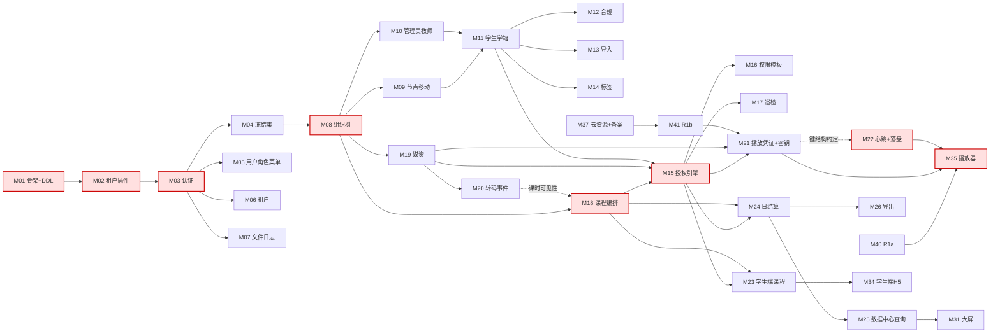

# EduMatrix 一期实施计划（模块拆分 · 关键路径 · 里程碑）

> **本文不做设计决策。** 所有表名、字段、枚举、路由、错误码一律引用已冻结文档；文档未定案的一律进 §F，不自行发明。
> 文档权威顺序：`DESIGN-CONTRACT.md` > `03-API接口文档/` 六分册 > `01-PRD-产品需求文档.md` > `02-数据库设计.md` + `docs/sql/edumatrix_ddl.sql`。
> **验收标准的引用格式**：PRD 的验收标准是 `F<编号>` / `FR-<编号>` 小节下的无编号 Given-When-Then 条目，本文一律写作「PRD F1-2 验收标准 · Given …」定位到具体一条，不另写一套。

---

## 0. 编制前提（若与实际不符请在 §F 之外单独指出）

| 项 | 取值 | 说明 |
| --- | --- | --- |
| 团队构成 | 6 人：后端 ×3、前端 ×2（1 PC / 1 H5+播放器）、测试兼 DBA/运维 ×1 | 沿用上一版计划的人数；分工是本文的假设 |
| 工作日 | 每周 5 天，人日 = 1 人 1 工作日 | 不含节假日 |
| 前端与后端的耦合方式 | 接口文档已冻结（契约 §7.5 API-First），前端按文档对 mock 先行，**每个前端模块约 30% 人日为联调**，只有联调段挂在后端之后 | 这是把前端移出关键路径的唯一依据；若接口在编码期被改，该假设失效 |
| 范围 | 127 个接口（03-01 全 36 / 03-02 全 50 / 03-03 全 34 / 03-05 除 §4.2 共 7），03-04 全部不做 | 见 §E |
| DDL | `edumatrix_ddl.sql` 一次性建全 41 表作为 Flyway 基线 `V202608120000__baseline.sql`（契约 §7.3），**不删作业 9 表** | 见 M01 |
| **⚠ 未决事项（阻塞派工）** | **MS3 有约 4 个工作日（≈12 人日）后端缺口未消化** | 三个处置见 [§C 末「合计缺口」](#合计缺口不抹平)与 [§F-8](#f-需求方待决项)，**需决策后方可派工** |

---

## A. 模块划分

### A.0 总表

> 「可并行人数」= 该模块内部最多能同时投入几个人。取 1 的模块在 §B 逐一说明为什么不能拆。
> 后段项（§A.2 判定）在本表中标 ⏳，**已计入人日与工期**。

#### 后端（171 人日）

| # | 模块 | 一句话职责 | 前置 | 后置 | 人日 | 可并行人数 |
| --- | --- | --- | --- | --- | --- | --- |
| M01 | 工程骨架与 Flyway 基线 | 建 41 表、统一响应/错误码/traceId/雪花 ID/时间时区/分页 | — | 全部 | 6 | 2 |
| M02 | 多租户插件与无会话上下文 | `TenantLineHandler` 对 `sys_role`/`sys_role_menu` 放行 `tenant_id=0`；`TenantHelper` 三条规则 | M01 | M03、全部任务 | 4 | **1** |
| M03 | 认证与会话（6 接口） | 登录/登出/刷新/验证码/me/改密；登录两段停用校验 | M02 | M04~M26 | 6 | **1** |
| M04 | 冻结集鉴权与停用生效 | `frozen:{tenantId}` + `node:anc:{nodeId}`，鉴权拦截器与 Redis 降级 | M03 | M08、M09 | 4 | **1** |
| M05 | 用户 / 角色 / 菜单（16 接口） | 03-01 §2/§3/§4；预置角色对 `org_admin` 全只读 | M03 | M27 | 8 | 2 |
| M06 | 租户与租户配置（9 接口） | 开通三步同事务、续期、停用、键白名单 | M03 | M33 | 5 | **1** |
| M07 | 文件与日志（5 接口） | 私有桶签名 URL、三重类型校验、Excel 公式注入防护、双日志 | M03 | M13、M18、M26 | 5 | **1** |
| M08 | 组织树查询与节点维护（5 接口） | 树懒加载 + 子树三条选路 + 改名 / 停用启用 / 重置密码 | M04 | M09~M26 | 8 | 2 |
| M09 | **节点移动事务（1 接口）** | 行锁 + 成环校验 + `ancestors` 前缀重算 + 冗余计数 + 异动轨迹 + 缓存失效 | M08 | M11 | 6 | **1** |
| M10 | 管理员与教师（9 接口） | 三写一事务、`NodeTypeRule` 承载校验 | M08 | M11、M18 | 6 | 2 |
| M11 | 学生与学籍（11 接口） | 建/改/删学生、分配导师、转交、退课、归档、恢复、轨迹查询 ⏳(仅接口 26) | M09、M10 | M15、M24 | 9 | 2 |
| M12 | K12 合规三件套 | F7-1 同意留痕、F7-3 归档原因 + 30 日脱敏任务 + 10209 | M11 | — | 4 | **1** |
| M13 | ⏳ 学生 Excel 导入（3 接口） | 模板下载、异步导入 Worker、失败报告 | M07、M11 | — | 5 | **1** |
| M14 | ⏳ 学员标签（7 接口） | 标签字典 + 批量打标 + 按标签选人 | M11 | M15 批量来源 3 | 4 | **1** |
| M15 | **资源授权引擎（5 接口）** | 授权 / 撤销级联子树 / 改有效期 / 两个资源列表；`GrantChecker` 公共判定 | M08、M18、M19 | M17、M21~M26 | 10 | **1** |
| M16 | ⏳ 权限模板（9 接口） | 模板 CRUD + 祖先模板脱敏 + 套用取交集 | M15 | — | 8 | 2 |
| M17 | 授权巡检任务 | 每日按租户分批扫悬挂授权，`dangling` / `crossScope` 分类计数 + 指标 | M15 | — | 3 | **1** |
| M18 | 课程与课时编排（21 接口） | 课程 / 章节 / 课时 / 图文资料 CRUD 与状态机 | M08 | M15、M21、M23 | 12 | 2 |
| M19 | VOD 媒资与上传（5 接口） | 上传凭证、媒资列表、删除、重转码、禁用启用；阿里云 SDK 封装 | M08 | M15、M20、M21 | 7 | **1** |
| M20 | 转码事件消费任务 | XXL-Job 拉 SMQ、幂等键、先落库后删消息、`GetPlayInfo` 挑流、异步刷冗余 | M19 | M18 课时可见性 | 5 | **1** |
| M21 | **播放凭证与解密密钥（2 接口）** | 两条逐条相同的校验链、keyToken、`MtsHlsUriToken`、水印文本、双类型审计 | M15、M19 | M22、M35 | 8 | **1** |
| M22 | **心跳与进度（3 接口）+ 落盘任务** | 九条防刷规则、`reject_rule`、Redis 脏集合、60s 批量落盘、完播判定 | M21（仅键结构约定） | M24、M35 | 12 | **1** |
| M23 | 学生端课程接口（3 接口） | 我的课程 / 课程大纲 / 图文课时（首访置已完成） | M15、M18 | M34 | 4 | **1** |
| M24 | 日结算任务（三级上卷） | `stat_student_daily` → `stat_teacher_daily` / `stat_node_daily`，双快照 | M15、M18、M11 | M25 | 8 | **1** |
| M25 | 数据中心查询（4 接口） | 导师看板、节点大屏、学员档案（管理端 / 本人） | M24 | M31、M32 | 8 | 2 |
| M26 | ⏳ 报表异步导出（3 接口） | `exportType=1` 异步 Worker + 任务查询 + 7 天清理 | M07、M24 | — | 6 | **1** |

#### 前端（80.5 人日，含 R1a）

| # | 模块 | 一句话职责 | 前置 | 后置 | 人日 | 可并行人数 |
| --- | --- | --- | --- | --- | --- | --- |
| M27 | 管理端骨架与权限壳 | 路由、`perms` 指令、ID 字符串化、组织树选择器组件 | M01（接口文档） | M28~M33 | 6 | **1** |
| M28 | 组织 / 人员 / 学员 / 轨迹页（A3~A8） | 树拖拽、人员 CRUD、分配转交、导入向导 ⏳、标签 ⏳、轨迹 ⏳ | M27 | — | 13 | 2 |
| M29 | 课程编排与媒资库（A9~A11） | 章节树拖拽、课时编辑、直传进度、转码失败重试 | M27 | — | 9 | **1** |
| M30 | ⏳ 资源下发中心与权限模板（A12/A13） | 三类资源下发工作台、撤销影响面预览、模板套用三组结果 | M27 | — | 8 | **1** |
| M31 | ⏳ 工作台 / 大屏 / 导出中心（A2/A17/A18） | 子树 KPI、趋势、下级节点对比、导师排行、流失率、投屏 ⏳ | M27 | — | 10 | **1** |
| M32 | 教师端（B1/B2/B4/B5/B6） | 导师看板、我的学员、我的资源、给学员下发、受限编排 | M27 | — | 7 | **1** |
| M33 | 平台超管端与系统设置（A19/A20） | 租户列表 / 开通 / 续期、角色权限、租户配置项 | M27 | — | 5 | **1** |
| M34 | 学生端 H5 非播放页（C1~C4/C6/C11/C12） | 登录改密、学习首页、课程列表 / 详情、图文课时、我的档案 | M27 | — | 10 | **1** |
| M35 | **DPlayer 二开 + 播放页 C5** | 禁快进、跑马灯水印 + MutationObserver、10s 心跳、20001/20002/20020 三种响应策略、无感续签 | M40(R1a) | — | 11 | **1** |
| M40 | **R1a 客户端能力验证** | 微信 X5/XWEB 播加密 HLS、key 请求可拦截、水印防篡改、进度条可拦截 | — | M35 | 1.5 | **1** |

#### 测试 / DBA / 运维（46.5 人日，含 R1b）

| # | 模块 | 一句话职责 | 前置 | 后置 | 人日 | 可并行人数 |
| --- | --- | --- | --- | --- | --- | --- |
| M36 | CI 流水线与环境 | `check_consistency.py` 挂 CI + pre-commit、预发环境、Flyway 校验 | — | 全部 | 6 | **1** |
| M37 | 云资源与合规前置 | VOD / OSS / CDN / SMQ / KMS 开通、转码模板组、区域闸口核对、**ICP 备案跟进** | — | M19~M21 | 8 | **1** |
| M38 | 造数与压测 | 1.1 万节点造数、R2 移动耗时、R3 心跳 5000 QPS、结算任务压测 | M36 | — | 13 | **1** |
| M39 | 逐条验收与上线核对 | 127 接口 + PRD 全部验收标准 + 边界 B1~B50 覆盖 + 上线核对清单 | M36 | — | 18 | **1** |
| M41 | **R1b 端到端加密链路验证** | 转码模板出加密 HLS、`MtsHlsUriToken` 透传、CDN 拼 key URI、真密钥接口联调 | M37（含备案） | M21 | 1.5 | **1** |

**合计：171 + 80.5 + 46.5 = 298 人日。**

> 与上一版 233 人日的差额 65 人日中：约 40 人日来自上一版漏计的六项后段模块（M13/M14/M16/M26/M28 轨迹页/M31 大屏进阶），约 15 人日来自测试兼 DBA/运维按真实负载（46.5 人日）而非 1/6 产能计入，约 10 人日来自 M12 合规三件套与 M17 巡检任务此前未单列。

> **M38 为什么是 13 而不是 12**：§D 声明 R2 = 3 人日、R3 = 4 人日，加上 1.1 万节点造数与结算任务压测共 6 人日，合计 13。此前写成 12 是把 R3 按 3 人日装箱的结果——而 R3 的四项观测里，第 ④ 项「连续 30 分钟后 `heartbeat_flush_lag_seconds` 的斜率是否为 0」必须靠持续 30 分钟的稳态压测才看得到，那恰恰是这项验证存在的**全部理由**（"跑不完就会累积，滞后是单调发散的"）。把 R3 压回 3 人日只能砍掉 5 万在线的压测夹具（则压不到 5000 QPS）或砍掉 30 分钟稳态跑（则废掉第 ④ 项），两者都等于取消这项验证，故改总量而非改 R3。

---

### A.1 逐模块明细

> 「做完什么算做完」一律指向 PRD 已有的验收标准；PRD 没有覆盖的（如 M02、M04、M20），指向契约或分册的可测条款并注明。

#### 地基层

| 模块 | 涉及表 | 涉及接口 | 做完什么算做完 |
| --- | --- | --- | --- |
| **M01** | 全部 41 张（`sys_`10 / `org_`10 / `crs_`4 / `vod_`4 / `qb_`3 / `hw_`6 / `stat_`4） | 无 | ① `V202608120000__baseline.sql` 在空库跑通并建出 41 张表，`vod_heartbeat_log` 的 7 个分区就位；② 任一接口的响应满足 00-通用约定 §3（`{code,msg,data}`）、§5（bigint 一律字符串）、§6（`yyyy-MM-dd HH:mm:ss`/东八区）；③ 响应头 `X-Trace-Id` 原样回传（契约 §7.1）；④ 00-通用约定 §9 的全部错误码落成枚举类，与登记册逐码一致 |
| **M02** | 全部带 `tenant_id` 的表 | 无 | ① 租户 A 用户查 `sys_role` 能读到 4 个 `tenant_id=0` 内置角色行、读不到租户 B 自建角色（契约 §2.9 定案表）；② 其余 5 张表 + `org_node` 维持严格等式过滤；③ 放行逻辑写在 `TenantLineHandler` 表达式里，全局 grep 不到业务代码手写的 `OR tenant_id = 0`；④ XXL-Job 线程处理完 `TenantHelper.clear()`，线程复用不串租户（契约 §2.8 规则 1） |
| **M03** | `sys_user`、`sys_role`、`sys_role_menu`、`sys_menu`、`sys_login_log`、`org_node`、`org_student` | 03-01 §1.1~1.6（6 个） | PRD F1-1 验收标准 · Given 机构 expire_time 为 2026-08-11 → 10007；PRD F1-1 验收标准 · Given 机构管理员用初始密码首次登录 → 强制改密页；PRD F1-2 验收标准 · Given 管理员节点 N 被停用 → 子树学生登录被拒 / 教师停用不级联；`GET /auth/me` 的 `roles`、`perms` 非空数组（契约 §2.9 反例） |
| **M04** | `org_node` | 无（拦截器） | ① 停用一个管理员节点后，其子树内**已持有有效 accessToken** 的账号下一次请求即返回 10017，不等 2 小时（契约 §2.3「定案」段）；② 启用后立即恢复；③ 停用先 `SADD` 后提交、启用先提交后 `SREM`（契约 §2.3 顺序约束 1）；④ 断开 Redis 后鉴权降级为拆 `ancestors` 主键 IN 查库，**不跳过校验**（顺序约束 2） |
| **M05** | `sys_user`、`sys_role`、`sys_user_role`、`sys_menu`、`sys_role_menu` | 03-01 §2.1~2.6、§3.1~3.6、§4.1~4.4（16 个） | PRD F1-3 验收标准 · Given 下级管理员乙创建丙 → `role_key=org_admin`、菜单权限一致；`org_admin` 对 4 个预置角色的改名 / 停用 / 改菜单绑定一律拒绝（契约 §2.9 末段）；10008 / 10009 / 10012 可复现 |
| **M06** | `sys_tenant`、`sys_tenant_config`、`org_node`、`sys_user` | 03-01 §5.1~5.7、§6.1~6.2（9 个） | PRD F1-1 验收标准 · Given 平台超管创建机构成功 → 有且仅有一个 `node_type=1`、`parent_id=0` 的根节点且与 `root_node_id` 互指；开通三步在同一事务（契约 §2.1）；配置键不在白名单 → 10016 |
| **M07** | `sys_file`、`sys_login_log`、`sys_oper_log` | 03-01 §7.1~7.3、§8.1~8.2（5 个） | 00-通用约定 §7.4 逐条：桶私有、签名 URL ≤30min、魔数校验、`Content-Disposition: attachment`、Excel 首字符 `= + - @` 前置单引号；归属校验只在 §7.3 下载接口实现一次 |

#### 组织树与人员

| 模块 | 涉及表 | 涉及接口 | 做完什么算做完 |
| --- | --- | --- | --- |
| **M08** | `org_node`、`sys_user`、`org_teacher`、`org_student` | 03-02 接口 1 `GET /api/v1/org/nodes/tree`、2 `GET /api/v1/org/nodes/{id}`、3 `PUT /api/v1/org/nodes/{id}`、5 `PUT /api/v1/org/nodes/{id}/status`、6 `PUT /api/v1/org/nodes/{id}/password/reset` | PRD F1-2 验收标准 · Given 管理员节点 N 被停用 / 教师节点 T 被停用 / 移动到 N 之下返回 10109；子树查询按契约 §2.4 选路表落地（教师走 `idx_parent_type`、管理员走 `idx_ancestors(255)` 前缀 LIKE，**空串分支不可省**）；慢查询日志中不得出现 `FIND_IN_SET`（契约 §7.1） |
| **M09** | `org_node`、`org_node_change_log`、`org_resource_grant`（读） | 03-02 接口 4 `PUT /api/v1/org/nodes/{id}/move` | PRD F1-2 验收标准 · Given 节点 P 子树含 12 个后代 → 13 个节点 `ancestors` 全部重算；PRD F1-2 验收标准 · Given A 是 B 的祖先 → 10103 且 parent_id/ancestors 一律不变；03-02 §3.4 校验表 11 条逐条可复现；02-数据库设计 §3.1.3 的 7 步在**同一事务**、按 id 升序加锁；提交后 `node:anc:*` 递归删除。**`outOfScopeGrants` 字段在 M15 完成后合入（0.5 人日已计入 M15）** |
| **M10** | `org_node`、`sys_user`、`sys_user_role`、`org_teacher` | 03-02 接口 7~10（管理员）、11~15（教师） | PRD F1-3 验收标准 · Given 教师张三尝试调创建教师接口 → 403；PRD F1-3 验收标准 · Given 手机号已占用 → 10013 且事务回滚无孤儿数据；PRD F1-2 验收标准 · Given 教师 T 名下仍有 5 名学员 → 10206 |
| **M11** | `org_node`、`sys_user`、`org_student`、`org_node_change_log`、`org_teacher` | 03-02 接口 16~26（11 个） | PRD F1-3 验收标准 · Given 甲创建学生小明 → `parent_id=N1`、轨迹 change_type=1；PRD F1-4 全部 7 条验收标准（分配 / 越界 10107 / 调岗带走 12 人只写 1 条 change_type=4 / 10205 / 10203 / 批量含归档整批拒绝 10208）；PRD F1-7、F1-8、F1-9 全部验收标准 |
| **M12** | `org_student`（`archive_reason`/`anonymized_at`）、`sys_user`、`sys_oper_log`、`org_import_task` | 无独立接口（挂在接口 17、24、25 上） | PRD F7-1 两条、F7-3 全部 5 条验收标准。特别是：`archiveReason=2` 归档满 30 日后脱敏任务把 `guardian_phone`/`sys_user.phone` 覆写为掩码并回填 `anonymized_at`，而 `sys_login_log`/`sys_oper_log` 不受影响；已脱敏再调恢复 → 10209 |
| **M13** ⏳ | `org_import_task`、`sys_file`、`org_node`、`sys_user`、`org_student`、`org_node_change_log` | 03-02 接口 27~29 | PRD F1-6 全部 7 条验收标准（100 行 4 失败 → status=2 / .xls → 10002 / 2500 行 → 10402 / 教师填他人工号该行失败 / 套模板取交集 / 随机初始密码可登录） |
| **M14** ⏳ | `org_tag`、`org_student_tag` | 03-02 接口 30~36 | PRD F1-5 全部 4 条验收标准（按标签批量授权只命中子树内 / 教师无建标签入口 403 / 删标签不回收授权行 / 21 个标签参数校验失败） |

#### 资源授权

| 模块 | 涉及表 | 涉及接口 | 做完什么算做完 |
| --- | --- | --- | --- |
| **M15** | `org_resource_grant`、`org_node`、`crs_course`、`vod_video`、`sys_oper_log` | 03-02 接口 37 `GET /api/v1/org/grants/grantable-resources`、38 `POST /api/v1/org/grants`、39 `DELETE /api/v1/org/grants`、40 `PUT /api/v1/org/grants/validity`、41 `GET /api/v1/org/nodes/{id}/granted-resources` | PRD FR-1 全部 5 条、FR-2 全部 5 条、FR-3 全部 5 条、FR-4 全部 5 条验收标准。重点三条：FR-2 · Given 四级授权链 → 查询"N3 能否用 N0 第 50 门课"判定为否；FR-4 · Given 甲撤销乙对 K 的授权 → 乙 / 丙 / 8 名学员共 10 行**同事务**撤销且 `vod_watch_progress` 一行不删；FR-3 · Given 授权人有效期 2026-12-31 → 下级指定 2027-06-30 被截断并提示。另：单次写入 ≤5000 行超限整体拒绝（契约 §2.5 模板段）；`resourceType∈{2,3}` 目标为学生节点 → 10308 |
| **M16** ⏳ | `org_perm_template`、`org_perm_template_item`、`org_resource_grant` | 03-02 接口 42~50 | PRD FR-5 全部 7 条、FR-6 全部 6 条验收标准。**必须单独实现的是 FR-5 · Given 机构建的模板 T 含 600 项、下级只拥有 120 项 → 明细只返回 120 项、另 480 项只给计数**（取交集管不了"看得见"） |
| **M17** | `org_resource_grant`、`org_node` | 无接口（XXL-Job） | PRD FR-7 验收标准 · Given 教师被撤销 K 但学员仍持有 → 次日巡检列入悬挂清单并告警；`grant_dangling_count` 与 `crossScopeCount` **分两类计数**（契约 §2.5 规则 6），指向已删除 / 已停用资源的授权行不计为悬挂（规则 12）。**"一键回收 / 补授上级"两个修复动作属 §F-2 待决，不在本模块范围** |

#### 课程与视频

| 模块 | 涉及表 | 涉及接口 | 做完什么算做完 |
| --- | --- | --- | --- |
| **M18** | `crs_course`、`crs_chapter`、`crs_lesson`、`crs_material`、`sys_file` | 03-03 接口 1~21 | PRD F2-1 全部 4 条、F2-2 两条验收标准。重点：F2-1 · Given 视频课时关联的 `vod_video.status=1` → 置可见失败返回 **20008**（20003 仅用于上架与发凭证）；F2-1 · Given 教师 N2 被授权 K 但非 owner → 新增课时被拒 |
| **M19** | `vod_video` | 03-03 接口 25 `POST /api/v1/vod/videos/upload-token`、26、27、33、34 | PRD F2-3 验收标准 · Given 媒资 V1 被未删除课时引用 → 删除被拒（20016）；接口 25 续签仅 `status∈{0,3}` 可用；接口 34 仅 2↔9 合法切换；`owner_node_id` 由服务端强制写入上传者节点，请求体不接受 |
| **M20** | `vod_video`、`crs_lesson`、`crs_course`、`sys_oper_log` | 无接口（XXL-Job，03-03 §7.2） | PRD F2-3 验收标准 · Given `TranscodeComplete(success)` 被消费 → status=2 且 `duration`/`hls_url` 回填；映射 `TranscodeComplete` 而非 `StreamTranscodeComplete`；挑流条件 `Format=="m3u8" && Encrypt==true`，**挑不到置 status=3 不得置 2**；幂等键 `vod_file_id+EventType+Status`；**先落库成功再删消息**；反查不到媒资 → 记 `vod_callback_orphan_total` 并删消息；冗余刷新走独立异步任务 |
| **M21** | `vod_play_auth_log`、`vod_video`、`crs_lesson`、`crs_course`、`org_resource_grant`、`org_student`、`sys_user` | 03-03 接口 28 `POST /api/v1/vod/play-auth`、29 `GET /api/v1/vod/decrypt-key` | PRD F2-4 全部 5 条验收标准；**外加 03-03 §8.2 的四步校验链与 8.1 逐条相同**：撤销授权后，学员用已有 m3u8 地址请求密钥同样返回 20013；keyToken TTL ≤ 300s；8.1 续签必须换发新 keyToken 并重跑校验链；8.1 写 `event_type=1`、8.2 写 `event_type=2`，管理端预览 `student_id` 留 NULL；水印文本 `viewer_type=3` 一律脱敏且不读租户配置（PRD F7-2 三条验收标准） |
| **M22** | `vod_watch_progress`、`vod_heartbeat_log`、`vod_video`、`sys_tenant_config` | 03-03 接口 30 `POST /api/v1/vod/heartbeat`、31、32 | PRD F2-7 全部 9 条验收标准（含 seek 复看正常计时、连续 3 次 seeked=true → 20002、多端 20020、静默 60s 后接管不被规则 6 永久拒绝）、F2-5 三条、F2-8 两条、F2-9 验收标准。请求体与响应体签名与契约 §6.4 **逐字一致**；`reject_rule` 取值域 = 03-03 §8.3.1 编号，1 与 4 保留不用；被拒心跳不推进任何基准 |
| **M23** | `crs_course`、`crs_lesson`、`crs_material`、`vod_watch_progress`、`org_resource_grant` | 03-03 接口 22 `GET /api/v1/course/my-courses`、23、24 | PRD FR-2 验收标准 · Given N2 把 3 门授给学生 N3 → 学生端课程列表恰为这 3 门；PRD F2-2 验收标准 · Given 学生首次成功打开图文课时 → `watch_status=2` 且 `complete_time` 已记录（0→2 不经过 1） |

#### 数据中心

| 模块 | 涉及表 | 涉及接口 | 做完什么算做完 |
| --- | --- | --- | --- |
| **M24** | `stat_student_daily`、`stat_teacher_daily`、`stat_node_daily`、`vod_watch_progress`、`org_node`、`org_student`、`org_resource_grant`、`crs_lesson` | 无接口（XXL-Job 每日 00:30） | PRD F1-4 验收标准 · Given 小明当日从 A 转到 B → `stat_student_daily` 仅 1 行且 `teacher_node_id=B`；PRD F1-7 验收标准 · Given 小刚已退课 → 次日起不计入 `stat_teacher_daily.student_count`，历史行保留；03-05 §2.1.1 两类列语义正确落库（累计快照 vs 当日新增）；**`ontime_submit_count` / `late_submit_count` / `should_submit_count` / `ontime_submit_rate` 本期恒写 0，`is_active` 退化为 `watch_seconds > 0`，列语义与 DDL COMMENT 一字不改** |
| **M25** | `stat_*` 三表、`vod_watch_progress`、`org_node_change_log`、`org_node` | 03-05 §4.1 `GET /api/v1/stat/teacher/dashboard`、§4.3 `GET /api/v1/stat/node/overview`、§4.4 `GET /api/v1/stat/students/{id}/profile`、§4.5 `GET /api/v1/stat/my/profile` | PRD F4-1 验收标准 · Given 甲 15/20、乙 1/5 → **合并分子分母 64.00%** 而非算术平均 47.50%；PRD F4-2 验收标准 · Given 乙把 nodeId 改为 S1 → 403 / 10107（按 03-05 §4.3 口径为 10107）；PRD F4-3 全部 5 条验收标准。**作业相关指标返回 0 且前端展示「—」** |
| **M26** ⏳ | `stat_export_task`、`sys_file`、`stat_student_daily` | 03-05 §4.6~4.8（3 个） | PRD F4-4 验收标准 · Given 教师篡改 `bizParams.nodeId` 为子树外 → 任务置 3 不生成文件；Given 预估 6 万行 → 40007；文件保留 7 天，过期下载 40008。**仅实现 `exportType=1`，列结构照 03-05 §5.1** |

#### 前端

| 模块 | 页面 | 做完什么算做完 |
| --- | --- | --- |
| **M27** | 骨架 | 任一受控按钮在 `perms` 缺失时不渲染；全站 ID 以字符串收发，无 `parseInt` |
| **M28** | A3~A8 | PRD F1-2 关键交互：拖拽时对自身后代落点直接禁止、非法落点置灰；移动前弹窗展示「将随之移动 N 个子节点，其中学员 M 名；原上级将立即失去可见性」；PRD F1-4 确认弹窗必须明示**资源授权保持不变**（B26） |
| **M29** | A9~A11 | 章节两级限制在前端预判、服务端为准；媒资 status=3 红色标记 + 重试入口（PRD F2-3 验收标准） |
| **M30** ⏳ | A12/A13 | PRD FR-4 验收标准 · Given 撤销影响 3 节点 42 学员其中 7 人在学 → 弹窗准确展示这三个数字；PRD FR-6 套用响应三组结果（成功 / 已存在 / 因无权跳过） |
| **M31** ⏳ | A2/A17/A18 | PRD F4-2 全部 5 条验收标准；作业相关指标位展示「—」；投屏模式 16:9 |
| **M32** | B1/B2/B4/B5/B6 | PRD F4-1 验收标准 · Given 教师打开看板 → **无范围切换器** |
| **M33** | A19/A20 | PRD F1-1 关键交互：保存后弹出初始管理员账号密码（仅展示一次） |
| **M34** | C1~C4/C6/C11/C12 | PRD F4-3 验收标准 · Given 学生打开档案页 → 页面不含任何他人姓名 / 群体平均 / 排名（契约 §2.7） |
| **M35** | C5 + 播放器 | PRD F2-5 验收标准 · Given max_position=300 拖到 500 → 回弹并提示；PRD F2-6 两条验收标准（删水印 DOM 1 秒内暂停；全屏 60 秒至少变换 4 次位置）；20020 **不得静默降级**，须暂停并提示 + 「在本设备继续」按钮（03-03 §8.3.3） |

#### 测试 / DBA / 运维

| 模块 | 做完什么算做完 |
| --- | --- |
| **M36** | `python3 scripts/check_consistency.py` 进 CI 与 pre-commit，退出码 1 即阻断合并；预发环境可一键重建并跑 Flyway |
| **M37** | 契约 §1「上线前必须在控制台确认的两件事」逐条签字确认；存储区域 = 仅中国大陆、加速域名加速区域 = 仅中国内地两个下拉框**分别**截图留档；**ICP 备案完成**（见 §D 行动项） |
| **M38** | R2 报告（MS2 内）与 **R3 报告（MS3 末，不排到 MS4）**（见 §D）；1.1 万节点 + 5 万在线的造数脚本可重复执行 |
| **M39** | 127 个接口逐个走通；PRD 第 5 章全部验收标准逐条打勾；边界表 B1~B50 中本期范围内的条目逐条覆盖 |

---

### A.2 判定为「本期后段」的模块

| 模块 | 后段的理由 | 延后代价 |
| --- | --- | --- |
| M13 学生 Excel 导入（接口 27~29） | 主链路的「建人」由接口 17 单个创建即可跑通，导入是操作效率而非能力 | 首批客户导入 2000 名学员要手工点 2000 次，试点期几乎必然要求提前 |
| M14 学员标签（接口 30~36） | 标签「仅用于筛选与批量操作，不参与任何权限判断」（契约 §4），主链路不经过它 | `grant_source=3`（按标签批量）无法使用，批量授权只剩按节点与名下全体两种 |
| M16 权限模板（接口 42~50） | 模板是逐级显式授权的**操作成本抵消手段**，不是权限来源；砍掉它授权链一样通 | 新招一名教师要逐个勾选几百个资源（FR-5 开篇即写明这正是模板存在的理由），机构侧体感极差 |
| M26 报表异步导出（§4.6~4.8） | 数据在库里、页面能看，导出是交付形态而非数据能力 | 机构无法把数据带出系统做校区月度复盘，是销售侧常被问的功能 |
| M11 接口 26 学生异动轨迹**查询页** | 轨迹的**写入**在移动事务内（铁律 1 的一部分，绝不可延后），查询只是读同一张表 | 新导师接手学员时看不到经历，督学要靠口头交接 |
| M31 大屏进阶模块（下级节点对比 / 节点排行 / 导师排行 / 流失率 / 投屏） | 大屏的 KPI + 趋势两块已能演示「看到学习数据」，进阶模块是同一接口的额外展示 | 投屏是签约演示环节的常用素材；排行是机构管理层最先问的一屏 |

> **明确不可延后的写入项**：`org_node_change_log` 的全部写入（M09/M11）在移动 / 学籍变更事务内，漏写事后无法补算，与查询页的延后无关。

---

## B. 依赖拓扑与关键路径

### B.1 依赖图

### B.2 关键路径推导

| 序 | 模块 | 人日 | ÷ 并行度 | 日历天 | 累计 |
| --- | --- | --- | --- | --- | --- |
| 1 | M01 工程骨架与 Flyway 基线 | 6 | ÷2 | 3 | 3 |
| 2 | M02 多租户插件 | 4 | ÷1 | 4 | 7 |
| 3 | M03 认证与会话 | 6 | ÷1 | 6 | 13 |
| 4 | M08 组织树查询与节点维护 | 8 | ÷2 | 4 | 17 |
| 5 | M18 课程与课时编排 | 12 | ÷2 | 6 | 23 |
| 6 | M15 资源授权引擎 | 10 | ÷1 | 10 | 33 |
| 7 | M22 心跳与进度 + 落盘（与 M21 并行，取长者） | 12 | ÷1 | 12 | 45 |
| 8 | M35 播放器联调段（11 × 30%） | 3.3 | ÷1 | 4 | 49 |
| 9 | 端到端验收（M39 尾段） | 5 | ÷1 | 5 | 54 |

**关键路径 = 54 个工作日。**

### B.3 三条工期下界，取最大

| 下界 | 计算 | 值 |
| --- | --- | --- |
| 关键链 | 上表求和 | **54 工作日** |
| 后端资源线 | 171 人日 ÷ 3 人 | **57 工作日** |
| 前端资源线 | 80.5 ÷ 2 | 40 工作日 |
| 测试/DBA/运维资源线 | 46.5 ÷ 1 | 47 工作日 |

取最大 = 57；里程碑装箱后的依赖等待按 15% 计（见 §C 各里程碑差额） → **总工期 66 个工作日 ≈ 13.5 周**。

> **后端资源线（57）比关键链（54）还长，意味着瓶颈不是依赖链而是后端人手：3 名后端的利用率 93%，全程无缓冲。** 任一后端模块超估 2 天即整体顺延，这是本计划最脆弱的一处（处置见 §C 末）。

### B.4 为什么这些模块的并行度只能是 1

| 模块 | 不能拆的原因 |
| --- | --- |
| M02 租户插件 | 只有一个 `TenantLineHandler` 表达式构造点。契约 §2.9 明令「不要靠业务代码逐处手写 `OR tenant_id = 0`」，一旦拆给两人就会退化成两处各写一半 |
| M03 认证 | 登录一条链路上串着验证码、锁定、租户到期、归档、两段停用校验、双 Token、pwd_reset_flag 七个判定，拆开必然互相覆盖 |
| M04 冻结集 | 一个拦截器 + 两个 Redis 键 + 一条降级路径。写侧顺序（先 SADD 后提交 / 先提交后 SREM）是单点逻辑，拆开就会有人漏掉方向 |
| **M09 节点移动** | 02-数据库设计 §3.1.3 的 7 步在同一事务、按 id 升序加锁；成环校验必须在持锁后。任何拆分都会在事务边界处产生 TOCTOU 窗口 |
| **M15 授权引擎** | 授权、撤销级联、有效期截断三者共用同一套「拥有 / 子树 / 有效期」判定；级联撤销与截断是同一棵子树上的两种写法，分给两人必然出现口径分叉（正是 FR-1 规则 4 警告的"撤销+重授"陷阱的来源） |
| **M22 心跳九条规则** | 规则 2/3/6/9 通过「基准是否推进」互相咬合（契约 §6.4、03-03 §8.3.1 末四段），规则 6 与 `seeked` 限频互为前提，规则 9 的接管必须重置规则 6 的基准。只做前五条会产生"多端并发导致时长永久归零"的静默故障 |
| M20 转码事件消费 | 幂等键、落库/删消息顺序、挑流条件、租户上下文四件事在一个循环体内 |
| M21 播放凭证 + 密钥 | 两个接口的校验链要求**逐条相同**（契约 §1、03-03 §8.2）。分给两人写两遍，就是这条要求被破坏的最短路径 |
| M24 日结算 | 一条事实表 → 两个维度上卷，双快照写入时点唯一 |
| M35 播放器 | 禁快进、水印、心跳三项都挂在同一个 DPlayer 实例的事件流上 |

---

## C. 里程碑

> 每个里程碑给出「串行链长度 vs 可用工作日」与「资源负载 vs 可用工作日」两组对照，**差额为负一律写出**。

### MS0 —— 地基与前置结论（第 1~2 周，10 个工作日）

- **目标**：能建库、能验收、**能确定加密播放这条技术路线成不成立**。
- **包含模块**：M01、M02、M36、M37（首段：云账号 / 域名 / **备案提交**）、M40 R1a、M27。
- **对照**：

| 线 | 长度 | 可用 | 差额 |
| --- | --- | --- | --- |
| 后端串行链 M01(3)→M02(4) | 7 | 10 | +3 |
| 前端串行链 M40(1.5)→M27(6) | 7.5 | 10 | +2.5 |
| 测试/运维负载 M36(6)+M37 首段(3) | 9 | 10 | +1 |

- **可演示验收场景**：
  - Given 一个空的 MySQL 8 实例，When 执行 `V202608120000__baseline.sql`，Then 建出 41 张表且 `vod_heartbeat_log` 7 个分区就位（契约 §9.1）。
  - Given 任一次文档改动，When 提交，Then CI 执行 `scripts/check_consistency.py`，有 ERROR 即阻断合并（退出码 1）。
  - Given 一段用 ffmpeg 自切的 AES-128 加密 HLS + 一个 mock 密钥端点，When 在微信 X5/XWEB 中打开，Then hls.js 能播放、能拦到 key 请求并读到 URL 参数（R1a，见 §D）。
- **退出条件**：① 基线建表通过；② CI 可用；③ **R1a 四问全部有书面结论**；④ ICP 备案已提交且有 owner 与目标日期。**退出条件不含 R1b、不含备案完成**——备案是周级外部依赖，挂上去这个里程碑从第一天起就退不出来。

### MS1 —— 登录进得去，权限不是空的（第 3~4 周，12 个工作日，累计 22）

- **目标**：四类角色都能登录，`/auth/me` 返回非空 `roles`/`perms`，停用一个管理员分支能立即生效。
- **包含模块**：M03、M04、M05、M06、M07、M33、M28（起步 6 人日）、M37（续 3）、M39（起步 2）。
- **对照**：

| 线 | 长度 | 可用 | 差额 |
| --- | --- | --- | --- |
| 后端串行链 M03(6)→M05(4) | 10 | 12 | +2 |
| 后端负载 28 人日 ÷ 3 | 9.3 | 12 | +2.7 |
| 前端负载 (5+6) ÷ 2 | 5.5 | 12 | +6.5 |

- **可演示验收场景**：
  - PRD F1-1 验收标准 · Given 平台超管创建机构成功，When 查看该机构组织树，Then 存在且仅存在一个 `node_type=1`、`parent_id=0` 的机构根节点，与 `sys_tenant.root_node_id` 互指。
  - PRD F1-1 验收标准 · Given 机构管理员用初始密码首次登录，Then 强制进入修改密码页，未改密前不可访问其他页面。
  - PRD F1-2 验收标准 · Given **管理员**节点 N 被停用，When 其子树内学生登录，Then 被拒（10017）；When **教师**节点 T 被停用，其名下学员登录，Then 成功。
  - 契约 §2.9 反例：Given 租户 A 的机构管理员登录，When 调 `/auth/me`，Then `roles`/`perms` **非空**（若空即 MS1 不通过）。
- **退出条件**：上述四条通过；停用一个管理员后子树内**已持有 accessToken** 的账号下一次请求即 10017（M04）。

### MS2 —— 建人、移人、树不烂（第 5~7 周，14 个工作日，累计 36）

- **目标**：能在树上建管理员 / 教师 / 学生，能分配导师、转交、教师带学员调岗，且 `ancestors` 与冗余计数全对。
- **包含模块**：M08、M09、M10、M11、M12、M14 ⏳、M28（余 7）、M32（起步 4）、M38（造数 + R2，6）、M39（4）。
- **对照**：

| 线 | 长度 | 可用 | 差额 |
| --- | --- | --- | --- |
| **后端串行链 M08(4)→M09(6)→M11(4.5)** | **14.5** | 14 | **−0.5** |
| 后端负载 37 人日 ÷ 3 | 12.3 | 14 | +1.7 |
| 前端负载 (7+4) ÷ 2 | 5.5 | 14 | +8.5 |
| 测试负载 6+4 | 10 | 14 | +4 |

- **可演示验收场景**：
  - PRD F1-4 验收标准 · Given 教师张三名下有 12 名学员，When 管理员把张三从校区 S1 调岗到 S2，Then 张三与 12 名学员的 `ancestors` 全部重算为以 S2 为前缀；S1 的管理员立即查不到这 13 个节点的任何数据；`org_node_change_log` 仅新增 1 条 change_type=4。
  - PRD F1-2 验收标准 · Given 节点 A 是节点 B 的祖先，When 把 A 移动到 B 之下，Then 10103 且两棵子树的 `parent_id`/`ancestors` 一律不变。
  - PRD F1-4 验收标准 · Given 批量分配 20 名学员其中 1 名已归档，When 提交，Then 10208 且 **20 名学员全部未被移动**。
  - PRD F7-3 验收标准 · Given `archiveReason=2` 归档满 30 日，When 脱敏任务执行，Then `guardian_phone`/`sys_user.phone` 变掩码、`anonymized_at` 回填，而 `sys_login_log`/`sys_oper_log` 不受影响。
- **退出条件**：F1-2 / F1-3 / F1-4 / F1-7 / F1-8 / F1-9 全部验收标准通过；**R2 报告出具**（1.1 万节点下移动一棵 5000 节点子树的事务耗时）。
- **差额处置**：−0.5 天由 M11 的两名开发在 M09 收尾阶段并行起草学籍状态机（不触碰移动事务）吸收。

### MS3 —— 建课、发媒资、下发到学生（第 8~10 周，15 个工作日，累计 51）

- **目标**：上传一个视频，转码完成后编进课程，逐级授权到某个学生节点，该学生的课程列表恰好是被授出的那几门。
- **包含模块**：M13 ⏳、M15、M16 ⏳、M17、M18、M19、M20、M22（提前起步 6）、M29、M30 ⏳、M32（余 3）、M34（起步 5）、M35（对 R1a 产出的 mock 端点先行开发，7）、M37（余 2）、M41 R1b、**M38（结算任务压测 3 + R3 心跳压测 4，共 7）**、M39（4）。

> **R3 为什么从 MS4 前移到本里程碑末**：R3 只依赖 M22 的落盘逻辑成型，**不依赖 M21 播放凭证、也不依赖真实播放链路**——压的是 `POST /api/v1/vod/heartbeat` 与脏集合落盘，造数即可（本就要造 5 万在线模拟，不需要真视频、真凭证）。而 MS4 的后端串行链恰好等于可用工作日（零缓冲），§D 又写明 R3 撞车的三条处置「都不是实施方可以自行决定的」——改落盘周期要改 PRD F2-8 规则 3、改采样写入要改契约、分片并发要重做 M22 落盘段约 4 人日。**把一个可能要改契约的验证放在零缓冲的最后一个里程碑，撞车时没有任何调整余地**，所以它必须在还有余量的 MS3 末跑完。
- **对照**：

| 线 | 长度 | 可用 | 差额 |
| --- | --- | --- | --- |
| **后端串行链 M18(6)→M15(10)** | **16** | 15 | **−1** |
| **后端负载 56 人日 ÷ 3** | **18.7** | 15 | **−3.7** |
| **前端负载 (9+8+3+5+7) ÷ 2** | **16** | 15 | **−1** |
| 测试负载 2+1.5+**7**+4 | 14.5 | 15 | **+0.5** |

- **可演示验收场景**：
  - PRD F2-3 验收标准 · Given 视频上传完成且 `TranscodeComplete(success)` 被消费任务处理完毕，When 刷新媒资列表，Then status=2、`duration` 与 `hls_url` 已回填，可被课时选用。
  - PRD FR-2 验收标准 · Given 机构管理员 N0 有 100 门课授给 N1 30 门、N1 授给 N2 10 门、N2 授给学生 N3 3 门，When N3 登录 H5，Then 课程列表恰为这 3 门；直接查询「N3 能否用 N0 的第 50 门」判定为否。
  - PRD FR-4 验收标准 · Given 甲把 K 授给乙、乙授给丙、丙授给 8 名学员，When 甲撤销乙对 K 的授权，Then 10 行**同一事务内**全部撤销，8 名学员的 `vod_watch_progress` 一行不删。
  - PRD FR-5 验收标准 · Given 机构建的模板 T 含 600 项而下级只拥有 120 项，When 他查看 T 的明细，Then 只返回 120 项，其余仅以 `{600,120,480}` 计数呈现。
- **退出条件**：F2-1 / F2-3 / FR-1 / FR-2 / FR-3 / FR-4 / FR-5 / FR-6 全部验收标准通过；**R1b 报告出具**；**R3 报告出具**（若撞车，三条处置中要改 PRD 或改契约的那两条必须在此刻提出，MS4 没有承接空间）。
- **差额处置**：前端 −1 天靠 M30 的「模板套用三组结果」页后置到 MS4 吸收（M30 已标 ⏳）；**后端 −3.7 天无法在本里程碑内消化**，见本节末「合计缺口」。另注：吸收 R3 后测试线只剩 **+0.5 天**（原 +4.5），这条线也进入无缓冲状态——R2/R1b/R3 三份报告任一需要复跑，就要占用 M39 的验收人日。

### MS4 —— 学生真的看到视频，管理端看到数据（第 11~13.5 周，15 个工作日，累计 66）

- **目标**：学生在微信里打开课程 → 加密视频起播 → 禁快进、带水印、心跳计时 → 次日管理端大屏与导师看板出数。
- **包含模块**：M21、M22（余 6）、M23、M24、M25、M26 ⏳、M31 ⏳、M34（余 5）、M35（联调段 4）、M39（余 8）。**M38 已在 MS3 末跑完，本里程碑不含压测工作。**
- **对照**：

| 线 | 长度 | 可用 | 差额 |
| --- | --- | --- | --- |
| 后端串行链 M22 余(6)→M35 联调(4)→端到端验收(5) | 15 | 15 | **0（零缓冲）** |
| 后端负载 40 人日 ÷ 3 | 13.3 | 15 | +1.7 |
| 前端负载 (10+5+4) ÷ 2 | 9.5 | 15 | +5.5 |
| 测试负载 8（M39 余） | 8 | 15 | +7 |

> **这里就是上一版计划退不出来的地方，本版的解法写在这里，不靠缓冲抹平**：
> M21（播放凭证 + 密钥，8 人日）与 M22（心跳，12 人日）内部各自并行度为 1，但**两者可由两名后端并行**——前提是先花 0.5 人日把 `authToken` / `keyToken` / `sessionId` 的 Redis 键结构落成常量类（03-03 §8.1 已定义全部字段，只是抄下来）。此后 M21 与 M22 互不阻塞，串行链从 8+12=20 压到 12。
> 同时把 M22 的前 6 人日提前到 MS3 末启动（它不依赖 M21 完成，只依赖上述键约定），MS4 内只剩 6 人日。代价是 **MS3 的后端负载再增 6 人日**，MS3 差额由 −3.7 扩大到 −3.7（已计入上表 56 人日中）。

- **可演示验收场景**：
  - PRD F2-4 验收标准 · Given 学生小明的导师被授权课程 K 但小明本人节点未被授权，When 小明请求 K 的播放凭证，Then 20013（无继承、不回溯祖先链）。
  - **契约 §1 / 03-03 §8.2** · Given 学生已拿到 m3u8 地址且正在播放，When 上级撤销其课程授权，Then 下一次 `GET /api/v1/vod/decrypt-key` 返回 20013、播放中断——**不是等凭证过期**。
  - PRD F2-7 验收标准 · Given 学生在电脑（会话 S1）播放后又在手机（S2）打开同一课时，When S2 心跳到达且 S1 在 60 秒内仍活跃，Then S2 返回 20020 并暂停提示；Given S1 停止心跳满 60 秒，Then S2 自动接管并正常计时。
  - PRD F2-5 验收标准 · Given max_position=300，When 拖到 500，Then 回弹到 300 并提示；拖到 120 正常复播。
  - PRD F2-6 验收标准 · Given 学生删除水印 DOM 节点，Then 播放器 1 秒内暂停。
  - PRD F4-1 验收标准 · Given 学员甲 15/20、乙 1/5，When 计算平均完播率，Then **64.00%**（合并分子分母），不是 47.50%。
  - PRD F4-2 验收标准 · Given 下级管理员乙打开大屏，Then 聚合根为乙的节点；构造请求把 nodeId 改为上级 S1 → 拒绝。
- **退出条件**：F2-4~F2-9、F4-1~F4-4 全部验收标准通过；`heartbeat_flush_lag_seconds` 在**真实播放链路**上稳定 < 180s（压测在 MS3 用造数做过，本条是在有真凭证、真解密、真播放器的链路上复核，两者不重复）；契约 §7.1 的 10 项指标全部有埋点。
- **差额处置**：本里程碑没有负差额，但**后端串行链恰好等于可用工作日（零缓冲）**——M22 落盘段、M35 联调、端到端验收三段中任一段超期一天，上线日期即顺延一天。**R3 已前移至 MS3 末**，正是因为它撞车时的三条处置要改 PRD 或改契约（见 §D），而这里没有任何承接空间。

### 合计缺口（不抹平）

| 里程碑 | 缺口 |
| --- | --- |
| MS2 | 后端串行链 −0.5 天（可内部吸收） |
| MS3 | 后端负载 **−3.7 天**、后端串行链 −1 天、前端 −1 天（靠 M30 后置吸收） |
| MS4 | 后端串行链 0（零缓冲，无负差额但也无余量） |

**净结果：在 66 个工作日、3 名后端不变的前提下，MS3 有约 4 个工作日（≈12 人日）的后端缺口无法在里程碑内消化。** 三个处置，请需求方选一个：

| 选项 | 做法 | 代价 |
| --- | --- | --- |
| **(a) 增补后端**（推荐） | MS2~MS3 期间增补 1 名后端 4 周（约 20 人日） | 人力成本；新人前 3 天产出按 0 计已含在 20 人日里 |
| (b) 移交付时点 | M16 权限模板（8 人日）与 M26 报表导出（6 人日）延到上线后第 1 个迭代 | 范围不减，但首版交付时机构侧要手工逐条授权、无法导出报表 |
| (c) 延工期 | 66 → 71 个工作日（14.2 周） | 直接顺延 1 周 |

---

## D. 前置风险项与验证计划

### R1a —— 客户端能力（**唯一能推翻已定案架构的一项**）

| 项 | 内容 |
| --- | --- |
| 验证什么 | ① 微信 X5/XWEB 能否用 hls.js 播 AES-128 加密 HLS；② 能否拦到 key 请求并读到 URL 上的自定义参数；③ 水印 DOM + MutationObserver 在同层渲染 / 全屏下是否有效；④ 进度条能否拦住（iOS 全屏是否被系统播放器接管） |
| 依赖 | **零阿里云依赖**：ffmpeg 自切一段加密 HLS + 二十行 mock 密钥端点，扔任意一台已备案的 HTTPS 静态站 |
| 排期 | MS0 第 1 周，1.5 人日（前端-播放器） |
| 撞车后的影响面 | ①不成立 → 契约 §1「HLS 标准加密 + DPlayer + hls.js」整条选型失效，须回到阿里云私有加密 + 阿里云播放器，M21/M22/M35 全部重做（约 30 人日）；②不成立 → `MtsHlsUriToken` 身份通道失效，密钥接口无法鉴权，契约 §2.5「撤销级联回收」的落地点整个消失；③④不成立 → PRD F2-5/F2-6 两条一级卖点降级为"仅 Android 有效"，须与需求方重新约定验收口径 |

> **MS0 的退出条件只挂 R1a。** 它不需要阿里云、不需要备案，第 1 周就能做完。

### R1b —— 端到端加密链路

| 项 | 内容 |
| --- | --- |
| 验证什么 | 阿里云转码模板出加密 HLS、控制台「HLS 标准加密参数透传」开关生效、`MtsHlsUriToken` 被 CDN 追加到 `#EXT-X-KEY` 的 URI 末尾、真密钥接口 + KMS 取密钥联调 |
| 依赖 | 阿里云账号 + 加速域名 + **ICP 备案** |
| 排期 | 备案完成后、MS3 之内，1.5 人日（前端 + 运维） |
| 撞车后的影响面 | **调试而非重选**：R1a 已证明客户端路径可行，R1b 撞车只是参数透传或模板组配置问题，影响 M21 的联调时点（1~3 天），不动架构 |

### R2 —— `ancestors` 子树前缀重算在真实数据量下的耗时

| 项 | 内容 |
| --- | --- |
| 验证什么 | 单租户约 1.1 万节点下，02-数据库设计 §3.1.3 第 5 步的前缀 LIKE UPDATE 耗时。**重点是它跑在一个已持有 `FOR UPDATE` 锁的事务里**——耗时即锁持有时间，直接决定并发移动的吞吐与死锁概率 |
| 验证方式 | 造 1.1 万节点、深度 6~8 层的真实形态树；分别移动 100 / 1000 / 5000 节点的子树，各 20 次，记录事务总耗时 P50/P99、锁等待、`tree_move_subtree_size` 分布；再做 10 并发交叉移动测死锁率 |
| 所需时间 | 3 人日（含造数脚本，计入 M38），MS2 内完成 |
| 撞车后的影响面 | 若 5000 节点子树的 UPDATE 超过 500ms：02-数据库设计 §3.1.3 要点 3 已给出方案（分批 UPDATE 每批 5000 行，同一事务内循环），追加约 2 人日改造 M09；若 10 并发下出现死锁，说明 id 升序加锁没有覆盖全部加锁点，须重查 M09 的锁顺序——这属于**铁律 1 未落地**，不可上线 |

### R3 —— 心跳 5000 QPS 下 Redis 脏集合 + 60s 批量落盘的实际行为

| 项 | 内容 |
| --- | --- |
| 验证什么 | 5 万人在线时单轮落盘要 UPSERT 5 万行 `vod_watch_progress` + 批插约 30 万行 `vod_heartbeat_log`（每人每分钟 6 条）。**跑不完就会累积，滞后是单调发散的**——`heartbeat_flush_lag_seconds` 一旦越过 180s 告警线就不会自己回落 |
| 验证方式 | 压测 `POST /api/v1/vod/heartbeat` 到 5000 QPS 持续 30 分钟，观察：① 接口 P99 是否 ≤100ms（PRD §7.1）；② 单轮落盘耗时是否 < 60s；③ `vod:hb:dirty` 脏集合规模是否收敛；④ 连续 30 分钟后 `heartbeat_flush_lag_seconds` 的斜率是否为 0 |
| 所需时间 | 4 人日（含造数与 5 万在线模拟，计入 M38），**MS3 末完成**。 **为什么能提前**：R3 只依赖 M22 的落盘逻辑成型，**不依赖 M21 播放凭证、也不依赖真实播放链路**——压的是 `POST /api/v1/vod/heartbeat` 与脏集合落盘两段，用造数直接灌心跳即可，不需要真视频、真凭证、真解密。而下面「撞车后的影响面」里的三条处置有两条要改 PRD 或改契约，放在零缓冲的 MS4 就没有任何调整余地 |
| 撞车后的影响面 | 落盘跑不完时，学习时长会**静默丢失且用户无感知**（契约 §7.1 该指标的存在理由）。可选处置需要需求方拍板，因为都改口径或改架构：① 落盘周期从 60s 放宽（PRD F2-8 规则 3「换设备续播误差 ≤ 落盘周期 60 秒 + 一个心跳周期」随之放宽，属 PRD 改动）；② `vod_heartbeat_log` 明细改为采样写入（契约要求"每条心跳都写"且 `reject_rule` 是审计唯一依据，属契约改动）；③ 落盘任务按租户分片并发（不改口径，但要重做 M22 的落盘段，约 4 人日）。**三条都不是实施方可以自行决定的，故列入本节而非当作调优。** |

### 独立行动项：ICP 备案

| 项 | 内容 |
| --- | --- |
| 性质 | **整份计划里唯一技术手段完全无效的外部依赖**（契约 §1「上线前置项，周级前置周期，比技术项长」） |
| Owner | 测试兼 DBA/运维（M37），需机构方提供主体资质材料——**请需求方指定机构侧对接人** |
| 动作与目标日期 | ① 域名注册与主体资料准备：**MS0 第 1 个工作日启动**；② 提交备案：**MS0 结束前（第 10 个工作日）**；③ 备案通过：**目标 MS2 结束前（第 36 个工作日）**，按管局 20 工作日上限留 6 天余量 |
| 卡点判定 | 若第 36 个工作日仍未通过，R1b 与 M21 的真机联调无法开始 → MS3 退出条件不满足 → 整体顺延，且**顺延天数等于备案剩余天数，无法用加人追回** |
| 并行手段 | R1a 用任意一台已备案的 HTTPS 静态站即可完成，不等备案；M19/M20/M21 的开发用阿里云 VOD 的默认测试域名进行，只有**加密 HLS 的 CDN 参数透传（R1b）**必须等自有加速域名 |

---

## E. 显式的「本期不做」清单

> 这份清单的作用是防止二期开工时有人把它们当成遗漏。**表全部建，代码全部不写。**

### E.1 不做的表（9 张，DDL 基线里已建，一行代码不碰）

| 表 | 二期接入时要回来补什么 |
| --- | --- |
| `qb_category` | 分类树 CRUD；与 `org_node` 无关，是独立的科目/知识点树 |
| `qb_question` | 题目 CRUD、六题型 JSON 校验（契约 §5 答案 JSON 结构表）、`owner_node_id` 归属；**并把 `resource_type=2` 接进 M15 的资源列表**（本期接口 37 的 `resourceType=2` 返回空） |
| `qb_question_version` | 版本快照写入（编辑即 version+1）、历史不可改不可删 |
| `hw_homework` | 作业定义与四状态机（0草稿1已发布2已截止3已撤回） |
| `hw_homework_question` | 发布时固化 `question_version` |
| `hw_homework_target` | 发布时展开为学生名单（全量精确到学生） |
| `hw_answer_sheet` | **发布时为每个目标学生预建 `status=0` 答卷并写入 `teacher_node_id` 快照**（契约 §2.6：不预建则"逾期未交"统计口径整个落空） |
| `hw_answer_detail` | 逐题作答明细、自动判分（`question_type∈{1,2,3,4}`）、`is_correct` 三态 |
| `hw_wrong_book` | 错题本，绑定首次做错时刻的 `question_version` |

### E.2 不做的接口（32 个）

| 来源 | 数量 | 说明 |
| --- | --- | --- |
| 03-04 题库与作业 全册 | 31 | `/api/v1/question/**` + `/api/v1/homework/**` 全部 |
| 03-05 §4.2 单次作业分析 `GET /api/v1/stat/teacher/homework/{homeworkId}/analysis` | 1 | 二期随作业一起接入；错误码 40005 本期无接口抛出 |

> 127 + 32 = 159，与 00-通用约定 §10 声明的接口总数一致。

### E.3 不做的指标与字段（列存在、本期恒为 0 或空）

| 位置 | 本期取值 | 二期接入时要回来补什么 |
| --- | --- | --- |
| `stat_student_daily.ontime_submit_count` / `late_submit_count` / `should_submit_count` | **恒 0** | 由 `hw_answer_sheet` 按 `submit_time <= deadline 且 is_late=0` 与 `hw_homework_target` 命中的在读学生数填充（03-05 §2.3(3)） |
| `stat_teacher_daily` / `stat_node_daily` 的 `ontime_submit_count` / `should_submit_count` / `ontime_submit_rate` | **恒 0** | 按 `hw_answer_sheet.teacher_node_id` 快照上卷 |
| `stat_student_daily.is_active`、`active_student_count` | 本期退化为 `watch_seconds > 0` | 恢复为 03-05 §2.3(5) 的完整口径「当日有有效心跳**或提交行为**」 |
| 导师看板「高频错题榜」「单题掌握三态」 | 不返回该字段 | 依赖 `hw_answer_detail`（03-05 §2.3(4) 实时聚合，不落 `stat_` 表） |
| 学员档案「成绩曲线」「错题概览」 | 不返回该字段 | 依赖 `hw_answer_sheet` / `hw_wrong_book` |
| `stat_export_task.export_type = 2`（学员作业成绩） | 本期不实现（返回值待定，见 §F-7） | 按 03-05 §5.2 的列结构生成 |
| `org_resource_grant.resource_type = 2`（题目） | 授权引擎实现 10308 拒绝分支，但接口 37 的 `resourceType=2` 返回空列表 | 接入题目资源列表与「我可授权的题目」 |
| `org_perm_template_item.resource_type = 2` | 允许存在（模板可含题目条目），但取交集时恒为空 → 计入 `skippedCount` | 题目实体接入后自动生效，无需改模板逻辑 |
| 前端展示 | 作业相关指标位一律展示「**—**」而非 `0%` | 换回真实数值 |

> **不做的三件事的反面**：本期**必须**保留 `stat_*` 三表的全部作业相关列、保留其 DDL COMMENT 中「累计快照 / 当日新增」的语义标注、保留 `hw_*` 九张表。改列语义或删列，二期就要走 gh-ost 改大表（契约 §7.3）。

---

## F. 需求方待决项

> 以下每一条都已回原文核对；「文档现状」列写的是核对结果，不是猜测。

| # | 问题 | 文档现状（已核对） | 为什么必须由你定 | 卡住哪个模块 |
| --- | --- | --- | --- | --- |
| **F-1** | `sys_menu` 的菜单 / 按钮初始化数据，以及四个内置角色的 `sys_role_menu` 绑定，从哪来？ | `edumatrix_ddl.sql` 尾部（1280~1341 行）只插了 4 个 `sys_role` 行（`super_admin`/`org_admin`/`teacher`/`student`），**`sys_menu` 与 `sys_role_menu` 一行都没有**。契约 §2.9 只解决了"读得到 `tenant_id=0` 的行"，没规定这些行的内容 | 读到一个没有菜单绑定的角色，`perms` 依然是空数组，**后果与零权限相同**——契约 §2.9 花大篇幅解决的那个故障会以另一种形态原样重现。菜单树的粒度（按钮拆到什么程度、哪些按钮归 `teacher`）是产品决策，不是实施决策 | M05（已预留 2 人日在其 8 人日内）；MS1 退出条件依赖它 |
| **F-2** | PRD FR-7 的「一键回收 / 补授上级」、页面 A14 资源授权健康度、页面 A2 的「30 天内到期的资源授权」与「悬挂授权告警」卡片，走哪个接口？ | 03-02 分册 50 个接口里**没有任何巡检结果查询、一键回收、补授上级、临期授权查询接口**；全文 grep「一键回收 / 补授上级 / 健康度 / 临期」在 API 文档中零命中。FR-7 规则 3 与 FR-3 规则 6 明确要求这些页面动作 | 三个页面（A2 两张卡片、A14 整页）在 PRD 里有验收标准（FR-7 · Given 点击"一键回收" → 按 FR-4 级联撤销），但**没有接口可调**。是新增 3~4 个接口（约 6 人日 + 前端 4 人日），还是本期只做巡检任务与告警、页面延后？ | M17（巡检任务本期做，页面待定）、M30、M31 |
| **F-3** | 03-03 §8.3.1 规则 6/7/8 反复提到的「风控分」落在哪张表 / 哪个接口？ | 全库 grep：`风控分` 只出现在契约 §6.4、PRD F2-7 规则 6/7、03-03 §8.3.1 规则 6/7 的**描述文字**里。**DDL 41 张表中没有任何 `risk_score` 类列**，`vod_heartbeat_log` 只有 `reject_rule`；没有任何接口读取或展示它；契约 §7.1 的 10 项指标里也没有它 | 「累加风控分」写不出验收标准（契约 §9.3 的写作纪律：写不出验收标准的条款等于不存在）。三种可能的落法代价差很多：① 只在 Redis 计数 + 打 Prometheus 指标（约 1 人日）；② 新增一张风控表并在管理端展示（新表 + 接口，约 6 人日，且**要动 Flyway 增量脚本**）；③ 明确本期只留痕 `vod_heartbeat_log.reject_rule`、不做风控分 | M22 |
| **F-4** | 转码失败的「站内提醒 `upload_user_id`」走什么？ | PRD F2-3 规则 3 与验收标准、边界 B37、03-03 §7.5 都写了「站内提醒上传人」。**41 张表里没有任何消息 / 通知 / 站内信表**，159 个接口里没有消息列表接口 | PRD F2-3 有验收标准「Given `TranscodeComplete(fail)` 被处理，When 上传人进入管理端，Then **收到站内提醒**」——没有载体就测不了。可选：① 降级为「媒资列表红色标记 + 工作台待办计数」（用现有接口，0.5 人日）；② 新增消息表与 2~3 个接口（新表 + 约 5 人日，动 Flyway） | M20、M29、M31 |
| **F-5** | 平台部署级参数（阿里云 AK/SK、转码模板组 ID、SMQ 队列名与 Endpoint、KMS 配置）存在哪里？是否允许按机构分别配置？ | **后半问文档已答**：契约 §5 末与 02-数据库设计 §4 明写「云厂商选择属**平台部署级参数**，不是租户配置键」，`sys_tenant_config` 键白名单只有 `complete_rate_threshold` 与 `watermark_phone_mask` 两个 → **不允许按机构配置**。**前半问文档没答**：没有任何一处规定这些参数的存放载体（配置中心 / 环境变量 / KMS / 配置文件） | AK/SK 是凭据，存放方式决定运维流程与安全审计口径；且契约 §1「上线前必须在控制台确认的两件事」要求可核对，需要一个确定的查看位置 | M19、M20、M21、M37 |
| **F-6** | PRD §6.2 教师端 B3「学员×课时进度矩阵」用哪个接口？ | 03-03 §8.4 单课时进度与 §8.5 整课进度**明写「本接口不对管理端开放」**（权限仅 `student`）；03-05 §4.4 学员学习档案是**单个学员**维度，不是矩阵；159 个接口里没有「某课程下名下全体学员 × 全部课时」的接口。注：`vod_watch_progress` 上已建 `idx_lesson_id`，注释即写「教师端查看某课时下名下学员的观看进度（高频）」——**索引为它建了，接口没建** | B3 是教师端主导航下的一个页面且带导出，PRD §6.2 已列。要么新增 1 个接口（约 3 人日 + 前端 4 人日），要么把 B3 降级为「逐个学员点开档案页」并从页面清单中改写 | M25、M32 |
| **F-7** | 本期 `exportType=2`（学员作业成绩）传进来返回什么？ | 03-05 §3 定义 40002 为「`exportType` 不在 **1/2** 范围」——即 2 是合法值。本期不实现它（§E.2），但**没有任何错误码表达"合法但本期未提供"** | 直接返回 40002 会与"参数非法"语义冲突（契约 §9.3 的同源原则：不要让两件事落在同一个取值上）；新增错误码必须先在 00-通用约定 §9 登记（该表 4xxxx 段预留 40009~40099）。是登记一个新码，还是前端直接不展示该选项？ | M26、M31 |
| **F-8** **（阻塞派工）** | MS3 的约 4 个工作日（≈12 人日）后端缺口，选哪个处置？ | §C 末「合计缺口」已给出三个选项与各自代价：**(a) MS2~MS3 增补 1 名后端 4 周（约 20 人日，已标推荐）／(b) M16 权限模板（8 人日）与 M26 报表导出（6 人日）移到上线后第 1 个迭代／(c) 工期 66 → 71 个工作日**。三条的代价原文已写全，本条不重复 | 这不是估算精度问题，**是范围、人力、工期三者取其一的取舍**，只能由需求方定。且 MS4 的后端串行链已是零缓冲（15 天对 15 天），缺口不会自己在后面被吸收——不选就等于默认走 (c) 并且没人知道 | **MS3 全部后端模块的派工**：M13 / M15 / M16 / M17 / M18 / M19 / M20 / M22（提前段）。选 (b) 时 M16 与 M26 整体移出本期交付 |

---

## 附：三张表的数字对账（§A 合计 / §B 关键路径 / §C 里程碑）

| 口径 | 数值 | 出处 |
| --- | --- | --- |
| 总人日 | 298（后端 171 + 前端 80.5 + 测试运维 46.5） | §A.0 三张表求和 |
| 关键路径 | 54 工作日 | §B.2 逐模块 `人日 ÷ 并行度` 求和 |
| 后端资源线 | 57 工作日 | 171 ÷ 3 |
| 总工期 | **66 工作日 ≈ 13.5 周** | §C 五个里程碑 10+12+14+15+15 |
| 里程碑内人日合计 | 298 | MS0 (BE10+FE7.5+QA9=26.5) + MS1 (28+11+5=44) + MS2 (37+11+10=58) + MS3 (56+32+**14.5**=**102.5**) + MS4 (40+19+**8**=**67**) = 298 ✓ 分线校验：BE 10+28+37+56+40=171 ✓；FE 7.5+11+11+32+19=80.5 ✓；QA 9+5+10+**14.5+8**=**46.5** ✓ QA 逐模块校验：M36 6（MS0）+ M37 8（3/3/2）+ M38 **13**（MS2 6 / MS3 7 / MS4 0）+ M39 18（2/4/4/8）+ M41 1.5（MS3）= 46.5 ✓ |
| **未消化缺口** | **约 4 个工作日 ≈ 12 人日（集中在 MS3 的后端）** | §C「合计缺口」，三个处置选项待需求方决策 |

> 66 工作日 > 关键路径 54，差 12 天来自里程碑边界上的依赖等待与前端联调窗口；66 > 后端资源线 57，差 9 天来自 MS3 的 −3.7 与各里程碑的装箱余量。**三者对得上，但对得很紧——后端全程 93% 利用率，没有任何缓冲。**
>
> **R3 前移与 M38 补 1 人日对总工期无影响**：R3 不在关键路径上（关键路径是 M01→M02→M03→M08→M18→M15→M22→M35 联调→端到端验收，全为后端与前端模块）；测试资源线由 46 升至 47 工作日，仍远低于后端资源线 57，不构成新的约束。变的只是 MS3/MS4 之间 4 人日的位置（MS3 98.5→102.5、MS4 70→67）与总量 +1（297→298）。

---

### 附二：本次修订对 §A/§B/§C/附录 的影响面（供复核）

| 改动 | §A.0 | §B 关键路径 | §B.3 资源线 | §C 里程碑 | 附录 |
| --- | --- | --- | --- | --- | --- |
| M38 12 → 13 人日（R3 按 §D 声明的 4 人日装箱） | QA 45.5→46.5、合计 297→298 | 不变（R3 不在链上） | 测试线 46→47 工作日，仍非约束 | MS4 的 M38 由 3 改为 4 后整体移出 | 总人日、三条分线校验、新增逐模块校验 |
| R3 由 MS4 前移至 MS3 末 | 不变 | 不变 | 不变 | MS3 测试负载 10.5→14.5（+4.5→+0.5）、MS4 11→8（+4→+7）；两处退出条件对调 | MS3 98.5→102.5、MS4 70→67 |
| 总工期 | — | 54 不变 | 57（后端）仍为最大 | 10+12+14+15+15 = 66 不变 | 66 不变 |
