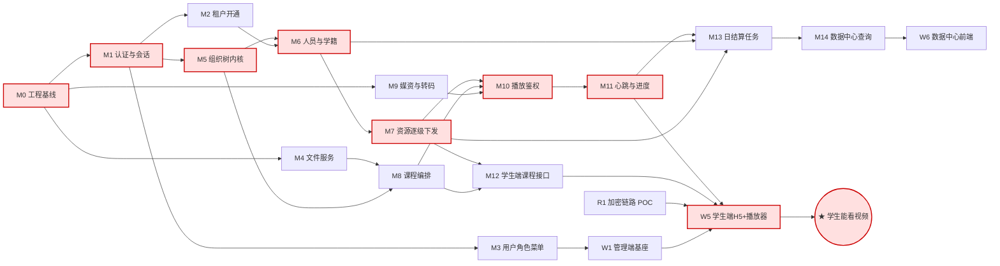

# EduMatrix 一期实施计划

> **本文档不重新设计任何东西。** 所有表名、字段、枚举、路由、错误码一律引用既有文档；权威顺序为
> `DESIGN-CONTRACT.md` > `03-API接口文档/` 分册（细化处以分册为准）> `01-PRD` > `02-数据库设计 / sql/edumatrix_ddl.sql`。
> 计划中发现的、文档未定案的问题，一律进入 **§F 需求方待决项**，不在此处自行拍板。
>
> **一期目标主链路**：建机构 → 建人 → 建课 → 下发课程 → 学生看视频 → 看到学习数据。
>
> **人力假设**：后端 3 人 + 前端 2 人 + 1 人兼测试/DBA/运维 = **6 人**。下文"人日"均指**单人工作日**。

---

## A. 模块划分

### A.0 总表

| # | 模块 | 一句话职责 | 前置 | 后置 | 人日 |
| --- | --- | --- | --- | --- | --- |
| **R1** | 加密播放链路可行性验证 | 在真机微信内置浏览器上跑通 AES-128 HLS + hls.js + 水印/禁拖拽/心跳 | 无（不依赖后端） | M10、M12、W5 | 3 |
| **M0** | 工程基线与 Flyway 基线 | 起服务、建 41 张表、把租户插件与全局约定一次做对 | 无 | 全部 | 8 |
| **M1** | 认证与会话 | 登录/登出/刷新/验证码/当前用户/改密 + 冻结集鉴权 | M0 | 全部 | 10 |
| **M2** | 租户开通与租户配置 | 平台超管开机构、续期、停用；租户配置键读写 | M1 | M6、M11 | 6 |
| **M3** | 用户·角色·菜单·日志 | RBAC 基座与两张日志表的读写 | M1 | W1 | 10 |
| **M4** | 文件服务 | 上传/详情/下载（私有桶 + 签名 URL + 魔数校验） | M0 | M6、M8、M14 | 5 |
| **M5** | 组织树内核 | 树查询、改名、**移动（事务+行锁+ancestors 重算）**、停用启用、重置密码 | M1 | M6、M7、M13、M14 | 12 |
| **M6** | 人员管理与学籍 | 建管理员/教师/学生、分配导师、转交、退课、归档、脱敏 | M5 | M7、M11、M13 | 18 |
| **M7** | 资源逐级下发 | 授权、撤销（级联子树）、改有效期、可授权列表、已获授权列表、悬挂巡检 | M5、M6 | M10、M13、M14 | 14 |
| **M8** | 课程编排 | 课程、章节、课时、图文资料（含学生端大纲/图文查看） | M4、M5 | M10、M13 | 14 |
| **M9** | 媒资与转码链路 | 上传凭证、媒资管理、**SMQ 转码事件消费任务** | M0、M5 | M8、M10 | 10 |
| **M10** | 播放鉴权 | 播放凭证 + **解密密钥下发**（两条逐字相同的校验链） | M7、M8、M9 | M11、W5 | 8 |
| **M11** | 心跳、防刷与进度 | 九条规则、Redis 缓冲、60s 落盘、完播判定、进度查询 | M10 | M13 | 14 |
| **M12** | 学生端课程接口 | 我的课程、课程大纲、图文课时内容 | M7、M8 | W5 | 5 |
| **M13** | 日结算任务 | `stat_student_daily` 结算 + 两个维度上卷 | M6、M7、M8、M11 | M14 | 10 |
| **M14** | 数据中心查询 | 导师看板、节点大屏、学员档案、我的档案、异步导出 | M13 | W6 | 12 |
| **W1** | 管理端基座（前端） | 登录页、菜单路由、权限指令、工作台骨架、系统设置 | M1、M3 | W2~W6 | 10 |
| **W2** | 组织与人员（前端） | A3 组织树、A4 人员管理、A5 学员管理 | W1、M5、M6 | — | 14 |
| **W3** | 资源下发中心（前端） | A12 授权工作台、B4/B5 教师侧下发 | W1、M7 | — | 10 |
| **W4** | 课程与媒资（前端） | A9 课程、A10 编排、A11 媒资库（含管理端预览） | W1、M8、M9 | — | 12 |
| **W5** | 学生端 H5 + 播放器 | C1~C6、C11；DPlayer 二开（禁拖拽/水印/心跳） | R1、M10、M11、M12 | — | 18 |
| **W6** | 数据中心（前端） | B1 导师看板、A17 节点大屏、A18/B13 导出中心 | W1、M14 | — | 10 |
| | **合计** | | | | **233** |

> 233 人日 ÷ 6 人 ≈ 39 个有效工作日；叠加联调、验收与缓冲，排期按 **11 周**计（见 §C）。

### A.1 逐模块明细

---

#### R1 加密播放链路可行性验证

| 项 | 内容 |
| --- | --- |
| 职责 | 用一段真实的加密 HLS 验证「微信内置浏览器（X5/XWEB）+ AES-128 标准加密 + hls.js + DPlayer 二开」四者能否共存 |
| 涉及表 | 无 |
| 涉及接口 | 无（用静态站点 + 一个最小 mock 密钥端点模拟 `GET /api/v1/vod/decrypt-key`，03-03 §8.2） |
| 依赖 | 阿里云点播已开通、**加速域名已完成 ICP 备案**、控制台已开启「HLS 标准加密参数透传」（契约 §1、03-03 §8.2） |
| 被依赖 | M10、M12、W5 |
| 人日 | 3（前端 1 人；不含备案等待时间） |

**做完什么算做完**：一份带真机截图的结论文档，逐条回答——① X5/XWEB 是否支持 MSE 从而 hls.js 可用；② `#EXT-X-KEY` 的 URI 末尾是否真的携带了 `MtsHlsUriToken`；③ 水印 DOM 在 X5 全屏/同层播放下是否仍在画面之上且可按 8~15s 随机移位（PRD F2-6 验收第 2 条）；④ 删除水印 DOM 能否被检测到并 1 秒内暂停（PRD F2-6 验收第 1 条）；⑤ 切后台/回前台时心跳能否按 03-03 §8.3.3 暂停与恢复。**任一项失败即触发契约 §1 加密方式的变更评审，不得默默继续。**

---

#### M0 工程基线与 Flyway 基线

| 项 | 内容 |
| --- | --- |
| 职责 | 一次性把全局约定做对，避免后续每个模块各写一遍 |
| 涉及表 | **全部 41 张**（`docs/sql/edumatrix_ddl.sql` 原样落为 Flyway `V202608120000__baseline.sql`，含 9 张本期不用的 `qb_`/`hw_` 表，契约 §7.3） |
| 涉及接口 | 无 |
| 依赖 / 被依赖 | 无 / 全部 |
| 人日 | 8 |

**必须在本模块一次做对的六件事**（漏一件后面处处返工）：

1. **租户插件放行规则**：`TenantLineHandler` 对 `sys_role` / `sys_role_menu` 返回 `tenant_id = ? OR tenant_id = 0`，其余表严格等式；**禁止用 `ignoreTable`，也禁止业务代码逐处手写 `OR tenant_id = 0`**（契约 §2.9）。
2. **逻辑删除**：`@TableLogic(value="0", delval="UNIX_TIMESTAMP(NOW(3))*1000")`（契约 §2.2）。
3. **无会话写入的租户上下文**：`TenantHelper.setTenantId()` / `clear()` 的统一切面，覆盖 XXL-Job 与异步 Worker（契约 §2.8 三条规则）。
4. **ID 字符串化**：全部 bigint 序列化为字符串（00-通用约定 §5）。
5. **统一响应与三分法异常**：`{code,msg,data}`；404 / 403 / 10107 的分工按 00-通用约定 §2.4 收敛到一个异常处理器。
6. **`traceId` + `X-Trace-Id` 响应头**，贯穿 MDC、线程池、XXL-Job（契约 §7.1）。

**做完什么算做完**：`flyway migrate` 在空库上建出 41 张表且 `check_consistency.py` 的 C6 通过；一个探针接口能证明"租户 A 的账号读得到 `tenant_id=0` 的内置角色行、读不到租户 B 的自建角色行"；`scripts/check_consistency.py` 已挂 CI（见 §A.2）。

---

#### M1 认证与会话

| 项 | 内容 |
| --- | --- |
| 职责 | 登录链路 + 每请求鉴权 + 冻结集 |
| 涉及表 | `sys_user`、`sys_role`、`sys_user_role`、`sys_menu`、`sys_role_menu`、`sys_login_log`、`sys_tenant`（读）、`org_node`（读）、`org_student`（读，判 10015） |
| 涉及接口 | 03-01：1.1 `GET /auth/captcha`、1.2 `POST /auth/login`、1.3 `POST /auth/refresh`、1.4 `POST /auth/logout`、1.5 `GET /auth/me`、1.6 `PUT /auth/password` |
| 依赖 / 被依赖 | M0 / 全部 |
| 人日 | 10 |

**关键点**：

- 登录校验五条拒绝路径各自的错误码不得混：`10005`（账号级封禁/锁定）、`10007`（租户停用或到期）、`10015`（学籍归档）、`10017`（组织侧停用，含①自身节点②祖先链中的管理员）、`10003`（用户名或密码错误，不区分具体项）。
- **冻结集**：`frozen:{tenantId}`（SET）+ `node:anc:{nodeId}`（STRING），鉴权拦截器求交集命中即 10017；Redis 不可用时**降级为查库，不得跳过校验**（契约 §2.3）。
- **`ancestors` 绝不可写进 JWT**（契约 §2.3）。
- refreshToken 旋转（一次性使用），失败返回 `10006`（00-通用约定 §2.2）。

**做完什么算做完**：PRD F1-1 验收第 1、4 条与 F1-2 验收最后一条（管理员停用级联子树、教师停用不级联）全部通过；`/auth/me` 对非超管账号返回**非空** `roles`/`perms`（03-01 §1.5 的加载链路说明）。

---

#### M2 租户开通与租户配置

| 项 | 内容 |
| --- | --- |
| 职责 | 平台超管侧的机构生命周期 |
| 涉及表 | `sys_tenant`、`sys_tenant_config`、`org_node`、`sys_user`、`sys_user_role` |
| 涉及接口 | 03-01：5.1~5.7（`/system/tenants` 全部 7 个）、6.1~6.2（`/system/tenant-configs`） |
| 依赖 / 被依赖 | M1 / M6（`max_student_count` 校验）、M11（`complete_rate_threshold`）、W5（`watermark_phone_mask`） |
| 人日 | 6 |

**关键点**：开通租户的三步同事务（插租户行 `root_node_id` 暂空 → 插机构根节点 → 回写 `root_node_id`，契约 §2.1）；配置键**白名单只有两个**（`complete_rate_threshold`、`watermark_phone_mask`，契约 §5），越界返回 `10016`。

**做完什么算做完**：PRD F1-1 验收第 2、3 条通过。

---

#### M3 用户·角色·菜单·日志

| 项 | 内容 |
| --- | --- |
| 职责 | RBAC 基座 |
| 涉及表 | `sys_user`、`sys_role`、`sys_user_role`、`sys_menu`、`sys_role_menu`、`sys_login_log`、`sys_oper_log` |
| 涉及接口 | 03-01：2.1~2.6、3.1~3.6、4.1~4.4、8.1~8.2（共 18 个） |
| 依赖 / 被依赖 | M1 / W1 |
| 人日 | 10 |

**关键点**：`tenant_id=0` 的四个内置角色及其菜单绑定对 `org_admin` **全只读**，只有 `super_admin` 可改、任何人不可删（契约 §2.9 写侧收紧）；`PUT /system/users/{id}/status` 是**超管专用**，机构管理员的停用一律走 02 分册接口 5（契约 §2.3）。

**做完什么算做完**：租户管理员能建自建角色并分配菜单，且无法修改任何 `tenant_id=0` 的行；`sys_oper_log` 记录敏感操作（PRD 7.3 第 7 条）。
**阻塞项**：`sys_menu` 的菜单/按钮初始化数据未定案，见 §F-1。

---

#### M4 文件服务

| 项 | 内容 |
| --- | --- |
| 职责 | 全系统唯一的文件出入口 |
| 涉及表 | `sys_file` |
| 涉及接口 | 03-01：7.1 `POST /system/files`、7.2 `GET /system/files/{id}`、7.3 `GET /system/files/{id}/download` |
| 依赖 / 被依赖 | M0 / M6（导入报告）、M8（封面/附件）、M14（导出文件） |
| 人日 | 5 |

**关键点**（00-通用约定 §7.4，全局强制）：桶私有 + ≤30 分钟签名 URL；**bizType 归属校验只在 7.3 实现一次，其他任何接口不得返回可直接访问的文件地址**；扩展名 + Content-Type + **魔数**三重校验且以魔数为准，SVG 不在白名单。

**做完什么算做完**：绕过 7.3 拿不到任何文件直链；上传 `.jpg` 扩展名的 `.svg` 被拒（`10011`）。

---

#### M5 组织树内核

| 项 | 内容 |
| --- | --- |
| 职责 | 全系统数据权限的物理基础 |
| 涉及表 | `org_node`、`org_node_change_log`、`sys_user`（读） |
| 涉及接口 | 03-02：1 `GET /org/nodes/tree`、2 `GET /org/nodes/{id}`、3 `PUT /org/nodes/{id}`、4 `PUT /org/nodes/{id}/move`、5 `PUT /org/nodes/{id}/status`、6 `PUT /org/nodes/{id}/password/reset` |
| 依赖 / 被依赖 | M1 / M6、M7、M13、M14 |
| 人日 | 12 |

**关键点**：

- 移动节点的 **7 步同事务**（含 `FOR UPDATE` 按 id 升序加锁、锁内做成环与类型校验、前缀替换 UPDATE 重算子树 `ancestors`、冗余计数、写轨迹）逐条按 02-数据库设计 §3.1.3 落地；**冗余计数的 UPDATE 禁止内联 `FIND_IN_SET`**（同节明确警示）。
- 子树查询三条选路（逐层展开 / 前缀 LIKE / `FIND_IN_SET`）收敛为一个工具类，**`FIND_IN_SET` 不得进高频查询**（契约 §2.4；`FIND_IN_SET` 出现在慢查询日志中即视为缺陷，契约 §7.1）。
- 前缀 LIKE 必须写 `ancestors = P OR ancestors LIKE CONCAT(P, ',%')` 两个条件，且 `P` 的空串分支不可省（契约 §2.4、02-数据库设计 §3.1.2）。
- 承载规则收敛为 `NodeTypeRule.assertCanBeChildOf(parentType, childType)`，被全部改父入口共用（02-数据库设计 §3.1.5）。
- 停用/启用的 Redis 顺序：停用**先 SADD 再提交事务**，启用**先提交事务再 SREM**（契约 §2.3）；移动时递归删除子树的 `node:anc:*`。

**做完什么算做完**：PRD F1-2 的 10 条验收标准全部通过，其中"P 及全部 12 个后代 ancestors 重算"一条须有覆盖 ≥4 层嵌套的自动化用例（边界 B4 要求）。

---

#### M6 人员管理与学籍

| 项 | 内容 |
| --- | --- |
| 职责 | 建人、调人、退课、归档、脱敏 |
| 涉及表 | `org_node`、`org_teacher`、`org_student`、`org_node_change_log`、`sys_user`、`sys_user_role` |
| 涉及接口 | 03-02：7~10（管理员）、11~15（教师）、16~26（学生，含分配导师 20/21、转交 22、退课 23、批量归档 24、归档恢复 25、异动轨迹 26） |
| 依赖 / 被依赖 | M5 / M7、M11、M13 |
| 人日 | 18 |

**关键点**：

- 建人 = 建 `sys_user` + `org_node` + 档案 + 回填 + 冗余计数 + 轨迹，**同事务**（03-02 §6.2）。
- 分配导师 / 转交管理员 / 教师调岗 **共用 M5 的移动实现**，只有 `change_type` 不同（2/3/4/8，契约 §5）；教师带学员调岗**只写 1 条 `change_type=4`**（边界 B5）。
- 合规两条本期必做：`guardianConsent` 必填且必须为 `true`（PRD F7-1）；`archiveReason=2` 启动 30 日脱敏倒计时，配套 XXL-Job 每日扫描并回写 `anonymized_at`，已脱敏者恢复返回 `10209`（PRD F7-3、03-02 §6.9/§6.10）。
- 批量类操作**整批拒绝、不做部分成功**（`10203`/`10208`，边界 B10）。

**做完什么算做完**：PRD F1-3、F1-4、F1-7、F1-8、F7-1、F7-3 的全部验收标准通过。
**本期后段项**：接口 27~29（Excel 导入）、接口 30~36（标签）见 §A.3。

---

#### M7 资源逐级下发

| 项 | 内容 |
| --- | --- |
| 职责 | 决定"学生能不能看到这门课"的唯一开关 |
| 涉及表 | `org_resource_grant` |
| 涉及接口 | 03-02：37 `GET /org/grants/grantable-resources`、38 `POST /org/grants`、39 `DELETE /org/grants`、40 `PUT /org/grants/validity`、41 `GET /org/nodes/{id}/granted-resources` |
| 依赖 / 被依赖 | M5、M6 / M10、M13、M14 |
| 人日 | 14 |

**关键点**（契约 §2.5 全 12 条规则，逐条对照实现）：

- 授权双校验：授权人拥有该资源（`10301`）+ 目标在其子树内（`10302`）；重复 `10303`；题目/视频授给学生节点 `10308`。
- **不回溯祖先链**：可用性判定只查一条 `target_node_id = 我` 的命中行。
- **撤销必须级联目标节点整棵子树、同事务**；学习记录一行不删。
- 有效期向上截断（规则 7）；跨管辖授权降级只读（规则 9）；**资源被删/停用时授权行原样保留、不级联撤销**（规则 12）。
- 授权写入统一走 `ResourceGrantService.grant()`：先探测已删行走"复活"路径，否则 INSERT（02-数据库设计 §7）。
- 单次写入授权行数 ≤ 5000，超限整体拒绝（契约 §2.5）。
- 悬挂授权巡检（XXL-Job）**必须分两类计数**：`danglingCount` 目标值 0、`crossScopeCount` 不进告警（契约 §2.5 规则 6、§7.1）。

**做完什么算做完**：PRD FR-1、FR-2、FR-3、FR-4 全部验收标准通过，其中 FR-4 第 1 条（四级链撤销 10 行同事务）与 FR-2 第 1~4 条（无继承四连问）须有自动化用例。
**说明**：巡检**只产出指标与日志**；PRD FR-7 的"一键回收 / 补授上级"两个管理动作**无接口定义**，见 §F-2。

---

#### M8 课程编排

| 项 | 内容 |
| --- | --- |
| 职责 | 课程 → 章 → 节 → 课时的内容组织 |
| 涉及表 | `crs_course`、`crs_chapter`、`crs_lesson`、`crs_material` |
| 涉及接口 | 03-03：1~6（课程）、7~11（章节）、12~16（课时）、17~21（图文资料） |
| 依赖 / 被依赖 | M4、M5 / M10、M13 |
| 人日 | 14 |

**关键点**：章节固定两级，越级返回 `20006`；课时类型与资源参数不匹配返回 `20019`；关联视频 `status≠2` 时课时不可置可见（`20008`，PRD F2-1 验收第 2 条）；**被授权方只读**——写操作要求 `owner_node_id = 我的节点`，否则 403（契约 §2.5 规则 8）；富文本存库前过滤脚本标签（PRD F2-2 验收第 2 条）。

**做完什么算做完**：PRD F2-1、F2-2 验收标准通过；课程上下架状态机（`20005`）有用例。

---

#### M9 媒资与转码链路

| 项 | 内容 |
| --- | --- |
| 职责 | 视频从上传到 `status=2` 可用 |
| 涉及表 | `vod_video` |
| 涉及接口 | 03-03：25 `POST /vod/videos/upload-token`、26 `GET /vod/videos`、27 `DELETE /vod/videos/{id}`、33 `POST /vod/videos/{id}/retranscode`、34 `PUT /vod/videos/{id}/status`；**外加 §7.2「转码事件消费」XXL-Job 任务（非接口）** |
| 依赖 / 被依赖 | M0、M5 / M8、M10 |
| 人日 | 10 |

**关键点**（03-03 §7.2）：

- **拉模式，无入站端点**：XXL-Job 每 10s 拉 SMQ，AK/SK 鉴权，无签名校验。
- 事件映射只认 **`TranscodeComplete`**（成功/失败共用），**不得用 `StreamTranscodeComplete` 做状态跃迁**。
- **报文里的 URL 一律不采信**，反调 `GetPlayInfo`，按 `Format == "m3u8" && Encrypt == true` 挑唯一一路；**挑不到必须置 `status=3` 并告警，绝不置 2**（契约 §1 部署约定第 3 条）。
- 幂等键 `vod_file_id + EventType + Status`；**先落库成功再删消息**；反查不到媒资时记 `sys_oper_log` + `vod_callback_orphan_total` 并删除消息。
- 冗余刷新（课时 `duration`、课程 `total_duration`）**另发异步任务**，不进消费事务。
- 只实现 `provider=2`（阿里云）；`provider=1` 分支本期不实现（契约 §1）。

**做完什么算做完**：PRD F2-3 三条验收标准通过；能人工构造"挑选结果为空"的报文并确认落到 `status=3`；`vod_event_last_consume_lag_seconds` 指标可读。

---

#### M10 播放鉴权

| 项 | 内容 |
| --- | --- |
| 职责 | 加密视频的两道闸口 |
| 涉及表 | `vod_play_auth_log`（写）、`org_resource_grant` / `crs_lesson` / `crs_course` / `vod_video`（读） |
| 涉及接口 | 03-03：28 `POST /vod/play-auth`、29 `GET /vod/decrypt-key` |
| 依赖 / 被依赖 | M7、M8、M9 / M11、W5 |
| 人日 | 8 |

**关键点**：

- 两个接口的校验链**逐条相同**（课时可见 → 该学生节点对该课程有有效授权且课程已上架 → 视频 `status=2`），差别只在身份来源：8.1 走 Token，**8.2 只认 URL 上的 `MtsHlsUriToken`，不读任何请求头**（03-03 §8.1/§8.2）。
- `keyToken` 的 TTL ≤ `authExpire`（300s）；**续签必须换发新 keyToken 并重跑完整校验链**——这是 FR-4 规则 4 真正生效的那一处。
- 两个接口都写 `vod_play_auth_log`，`event_type` 分别为 1 / 2；管理端预览同样落审计，`student_id` 留 NULL。
- 水印文本：**学生端一律脱敏且不读租户配置**；管理端预览读 `watermark_phone_mask`（PRD F7-2 三条）。
- 明文密钥不落库、不进日志。

**做完什么算做完**：PRD F2-4 五条验收标准通过；**专项用例**——撤销授权后，拿着未过期的 m3u8 地址直接请求 29 号接口，返回 `20013`（这条是契约 §1 唯一点名的越权面）。

---

#### M11 心跳、防刷与进度

| 项 | 内容 |
| --- | --- |
| 职责 | 让"已看时长"真实可信 |
| 涉及表 | `vod_watch_progress`、`vod_heartbeat_log` |
| 涉及接口 | 03-03：30 `POST /vod/heartbeat`、31 `GET /vod/progress`、32 `GET /vod/progress/course/{courseId}` |
| 依赖 / 被依赖 | M10 / M13 |
| 人日 | 14 |

**关键点**：

- **九条规则全部实现**（03-03 §8.3.1），不得只做前五条；`reject_rule` 落库取值域为 `0/2/3/5/6/7/8/9`，**1 与 4 保留不使用**。
- 规则 6 的 `seeked` 反滥用（连续 ≤2 次、单课时每小时 ≤20 次）、规则 7 跨课时并发 ≤2、规则 8 单日 10h / 单课时 3×、规则 9 同课时会话择一（`20020`）**四条互相咬合，必须一起做**。
- **被拒绝的心跳一律不推进任何基准**；唯一例外是规则 9 的会话接管必须重置位置基准。
- Redis 缓冲 + XXL-Job 每 60s 落盘；**完播判定只在落盘时执行**（唯一判定时机）；进度查询合并 Redis 与 DB 取大值。
- 请求体/响应体签名与契约 §6.4 逐字一致，任何字段不得增删改名。

**做完什么算做完**：PRD F2-5、F2-7、F2-8、F2-9 全部验收标准通过；`reject_rule` 的 7 个取值**每一个都能由一条自动化用例构造出来**；`heartbeat_flush_lag_seconds` 指标可读。

---

#### M12 学生端课程接口

| 项 | 内容 |
| --- | --- |
| 职责 | 学生侧的课程可见性出口 |
| 涉及表 | `crs_course`、`crs_chapter`、`crs_lesson`、`crs_material`、`org_resource_grant`、`vod_watch_progress`（读） |
| 涉及接口 | 03-03：22 `GET /course/my-courses`、23 `GET /course/courses/{id}/outline`、24 `GET /course/lessons/{id}/material` |
| 依赖 / 被依赖 | M7、M8 / W5 |
| 人日 | 5 |

**关键点**：可见课程 = **本人节点被显式授权且在有效期内 + 课程已上架**，不回溯祖先链（`20013`）；图文课时**首次成功访问即置 `watch_status=2`**（PRD F2-2 验收第 1 条），进度百分比分母含图文课时（03-05 §2.3(7)）。

**做完什么算做完**：PRD FR-2 验收第 3 条（学生端恰好只看到被授予的 3 门）通过。

---

#### M13 日结算任务

| 项 | 内容 |
| --- | --- |
| 职责 | 生成唯一事实表并向两个维度上卷 |
| 涉及表 | `stat_student_daily`、`stat_teacher_daily`、`stat_node_daily` |
| 涉及接口 | 无（XXL-Job，每日 00:30 结算 T-1，03-05 §2.1） |
| 依赖 / 被依赖 | M6、M7、M8、M11 / M14 |
| 人日 | 10 |

**本期口径（约束 2，必须写进代码注释与任务日志）**：

| 列 | 本期行为 |
| --- | --- |
| `watch_seconds` | 正常结算（当日流量型） |
| `finished_lesson_count` / `should_lesson_count` | 正常结算（**累计状态型**；分母 = 授权给**该学员本人节点**的课程下的可见视频课时数，不回溯祖先链，03-05 §2.3(2)） |
| `is_active` / `active_student_count` | 正常结算，但本期判定条件退化为 `watch_seconds > 0`（作业分支恒为 0） |
| `ontime_submit_count` / `late_submit_count` / `should_submit_count` | **本期恒写 0**，列保留不动、语义不改 |
| `ontime_submit_rate` | 因分母为 0，按 03-05 §2.3(3) 除零兜底记 0；**前端展示"—"，不得展示 0%** |

其余硬约束：写入两个归属快照 `teacher_node_id` / `node_id`；**已结算行永不重算**，重跑对已有行为幂等空操作；`stat_node_daily` 每行是**子树聚合**，父子行不可相加；未分配导师的学员不进任何导师看板但照常进节点聚合（契约 §2.6）；任务按租户分片、每片设/清租户上下文（契约 §2.8）。

**做完什么算做完**：PRD F1-4 验收第 7 条（转导师当日归新导师）、F1-7 验收第 2 条、F1-8 验收第 2 条通过；`stat_settle_job_duration_seconds` 指标可读。

---

#### M14 数据中心查询

| 项 | 内容 |
| --- | --- |
| 职责 | 把结算结果读出来 |
| 涉及表 | `stat_student_daily`、`stat_teacher_daily`、`stat_node_daily`、`stat_export_task`、`vod_watch_progress`（今日实时） |
| 涉及接口 | 03-05：4.1 `GET /stat/teacher/dashboard`、4.3 `GET /stat/node/overview`、4.4 `GET /stat/students/{id}/profile`、4.5 `GET /stat/my/profile`、4.6 `POST /stat/exports`、4.7 `GET /stat/exports`、4.8 `GET /stat/exports/{id}`（**不含 4.2 单次作业分析**） |
| 依赖 / 被依赖 | M13 / W6 |
| 人日 | 12 |

**关键点**：

- **区间取法分两类**：完播率取**区间末日一行**相除（严禁 Σ）；学习时长/提交率用 `Σ分子 ÷ Σ分母`；`*_rate` 列只许单日直读（03-05 §2.1.1）。
- 返回比率**必须同时返回分子分母**。
- 越权三分法：`nodeId` / `teacherNodeId` 越界 → `10107`；路径 `{id}` 越界 → `404`；学生调 4.1/4.3/4.4 → `403`（03-05 §2.5/§2.6）。
- "数能算进去，人看不见"：聚合走快照含已转出学员，明细叠加当前子树过滤（契约 §2.6）。
- 导出本期只做 `exportType=1`（学员学习进度）；≥5 万行拒绝（`40007`）；Excel 写出**必须防公式注入**；文件保留 7 天（00-通用约定 §7.4）。

**本期字段降级口径**：4.1 的 `topWrongQuestions` 返回空数组、`ontimeSubmitRate`/`ontimeSubmitCount`/`shouldSubmitCount` 恒 0；4.4/4.5 的成绩曲线与错题概览返回空数组/0。**字段一律保留、不删**，前端统一展示"—"，二期接上作业后无需改接口契约。

**做完什么算做完**：PRD F4-1 验收第 1、2、4、6 条（完播率合并分子分母、无范围切换器、换绑当日不一致），F4-2 验收第 2、4、5 条，F4-3 全部 5 条，F4-4 第 2、3 条通过。（F4-1 第 3 条按时提交率、第 5 条高频错题榜与 F4-4 第 1 条作业成绩导出属二期，见 §E。）

---

#### W1~W6 前端模块

| 模块 | 页面（PRD §6 编号） | 依赖 | 人日 | 做完什么算做完 |
| --- | --- | --- | --- | --- |
| **W1** 管理端基座 | A1 登录、A2 工作台骨架、A20 系统设置 | M1、M3 | 10 | 按 `/auth/me` 的 `perms` 控制按钮显隐；`needChangePassword=true` 时强制跳改密页且不可访问其他路由（PRD F1-1 验收第 4 条） |
| **W2** 组织与人员 | A3 组织树、A4 人员管理、A5 学员管理 | W1、M5、M6 | 14 | 树懒加载 + 拖拽移动，落点为自身后代时前端直接禁止（服务端仍为唯一权威，边界 B1）；分配导师/转交同一入口 |
| **W3** 资源下发中心 | A12 授权工作台、B4 我的资源、B5 给学员下发 | W1、M7 | 10 | 撤销确认弹窗准确展示"影响 N 个节点 / M 名学员 / K 名正在学习"（PRD FR-4 验收第 5 条） |
| **W4** 课程与媒资 | A9 课程、A10 编排、A11 媒资库 | W1、M8、M9 | 12 | 直传进度条 + 转码失败重试入口；管理端预览走 8.1/8.2 同一链路 |
| **W5** 学生端 H5 + 播放器 | C1~C6、C11 | **R1**、M10、M11、M12 | 18 | DPlayer 二开三件套（禁前拖、跑马灯水印、10s 心跳）在微信内置浏览器上通过 PRD F2-5/F2-6/F2-7 全部验收；`20020` **必须暂停并提示**、不得静默降级 |
| **W6** 数据中心 | B1 导师看板、A17 节点大屏、A18/B13 导出中心 | W1、M14 | 10 | 作业类指标一律显示"—"；趋势图对 `shouldSubmitCount=0` 的点**断点展示**、不得连成谷底 |

### A.2 文档一致性检查挂 CI（约束 5，归属 M0）

| 项 | 内容 |
| --- | --- |
| 落地方式 | ① `.github/workflows/docs-check.yml`：`push` 与 `pull_request` 触发，`python3 scripts/check_consistency.py`，退出码非 0 即失败并阻塞合并；② 仓库内提供 `.githooks/pre-commit` 并在 README 写明 `git config core.hooksPath .githooks` 一行启用 |
| 为什么两条都要 | pre-commit 可被 `--no-verify` 绕过，CI 不可；pre-commit 提供本地即时反馈，CI 提供强制力 |
| 验收 | 故意注入 scripts/README「自检」小节列出的任一缺陷（如删掉某列定义的行尾逗号），CI 必须红 |

### A.3 判断为"可排到本期后段或二期"的项（约束 4）

> 以下均**不在主链路上**，故排到里程碑 4 或二期。每条给出理由与代价。

| 项 | 涉及接口 / 表 | 判断 | 理由 | 延后的代价 |
| --- | --- | --- | --- | --- |
| **权限模板** | 03-02 接口 42~50；`org_perm_template` / `org_perm_template_item` | **本期后段**（里程碑 4） | 契约 §2.5 明确它只是"抵消逐级显式授权操作成本"的批量快捷方式，**套用结果 = 模板 ∩ 授权人已有资源**，与逐条授权逐字相同；主链路一条也不经过它 | 里程碑 2~3 期间建人时 `templateId` 传值会得到 `10305`（当时确无模板），属正确行为；上线前必须补，否则新招一名教师要逐个勾选几百个资源 |
| **学员标签** | 03-02 接口 30~36；`org_tag` / `org_student_tag` | **本期后段** | 契约 §2.5 与 03-02 §2.5 双重明确"仅用于筛选与批量操作，**不参与任何权限判断**"；删标签不影响已授出的权限（PRD F1-5 验收第 3 条） | A5 的标签筛选、A12/B5 的"按标签批量授权"入口同步延后；`grant_source=3` 暂不产生 |
| **学生 Excel 批量导入** | 03-02 接口 27~29；`org_import_task` | **本期后段** | 单个创建学生（接口 17）已能跑通主链路；导入是操作效率项 | **合规 F7-1 的第 1 条验收标准（导入侧留痕）在延后期间无法验收**，只能验单建路径的第 2 条——这一点必须在里程碑 2 的验收报告里写明，不能默认已覆盖 |
| **异动轨迹查询页** | 03-02 接口 26；页面 A8 | **写入本期必做，查询与页面后段** | 轨迹写入在移动事务内，是铁律 1 的一部分，漏写无法事后补；查询只是展示 | 无（数据已在库里） |
| **报表异步导出** | 03-05 接口 4.6~4.8；`stat_export_task` | **本期后段** | 主链路不依赖；且它自带一套独立要求（5 万行上限、7 天保留、防公式注入、Worker 租户上下文），与看板不共享代码 | 里程碑 4 内必须完成，PRD F4-4 是本期范围 |
| **大屏进阶模块** | 03-05 接口 4.3 的 `childNodeComparison` / `teacherRanking` / 流失率 / 投屏 | **本期后段** | KPI + 趋势即可满足"看到学习数据"；排行与对比需要额外的多节点聚合与 `rankLimit` 语义，且**父子行不可相加**的坑集中在这里 | PRD F4-2 验收第 1、3 条延后到里程碑 4 末 |
| **腾讯云 `provider=1` 分支** | `vod_video.provider` | **不做**（非延后） | 契约 §1 已定案"阿里云 VOD 为本期唯一实现，腾讯云保留 `provider` 列以备兼容，本期不实现" | 无 |

---

## B. 依赖拓扑与关键路径

### 关键路径（红色链）

**M0 → M1 → M5 → M6 → M7 → M10 → M11 → W5 → 「学生能看视频」**，合计 **84 + 18 = 102 人日**的串行工作量。

| 判据 | 说明 |
| --- | --- |
| 为什么 M5→M6→M7 不可并行 | M7 的两条校验都要问树：「目标在不在我子树内」（M5 的 `ancestors`）与「授权对象是不是一个学生节点」（M6 建出来的人）。没有树和人，授权接口连测试数据都造不出来 |
| 为什么 M10 在关键路径上而 M8/M9 不在 | M8（课程）与 M9（转码）可在 M0 之后立即并行开工，各 14 / 10 人日，远短于 M1+M5+M6+M7 的 54 人日，因此有充足浮动时间；**但 M9 的浮动时间受制于云资源开通与备案**，见 §D-1 |
| 唯一不依赖后端的关键前置 | **R1**。它不在链上，却能**推翻链的终点**——若 X5 上标准加密不可用，M10 的密钥接口整个作废、W5 全部重做。故排在第 1 周，与 M0 并行 |
| 浮动最大的模块 | M2（6 人日）、M3（10 人日）、M4（5 人日）、M13/M14（在关键里程碑之后） |

**延期传导规则**：关键路径上任一模块延期 1 天，「学生能看视频」这个里程碑就推迟 1 天，**不存在用加人追回的空间**（M5 的 `ancestors` 重算、M7 的级联撤销、M11 的九条规则都是单点串行的强逻辑工作）。非关键路径模块的延期在 §C 的里程碑边界处才会显形。

---

## C. 里程碑

### 里程碑 0：加密链路可行、工程能跑（第 1 周）

- **目标（一句可演示的话）**：*"用一部装了微信的真机扫码打开 H5，能播放一段 AES-128 加密的 HLS，画面上有跑马灯水印、进度条拖不过去、每 10 秒发一次心跳。同时，空库上 `flyway migrate` 建出 41 张表、服务能起来。"*
- **包含模块**：R1、M0
- **验收场景**（PRD 已有的验收标准，先在 POC 环境上跑一遍）：
  - Given 学生打开控制台删除水印 DOM 节点，When 删除发生，Then 播放器 1 秒内暂停并提示异常，恢复水印后方可继续播放。（PRD F2-6 验收 1）
  - Given 学生切换全屏播放 60 秒，When 观察画面，Then 水印至少变换 4 次位置且始终可见，内容为该生姓名+手机号。（PRD F2-6 验收 2）
  - Given 学生当前 max_position=300 秒，When 学生把进度条拖到 500 秒，Then 播放器回弹到 300 秒继续播放并提示不能快进；When 拖到 120 秒，Then 正常从 120 秒复播。（PRD F2-5 验收 1，POC 阶段以本地 mock 的 maxPosition 验证）
- **退出条件**：
  1. R1 结论文档签字：**"HLS 标准加密方案在微信内置浏览器上可行"** 或 **"不可行 + 变更评审已发起"**，二选一，不允许"待观察"；
  2. `flyway migrate` 在空库建出 41 张表，`check_consistency.py` 在 CI 上绿；
  3. 探针接口证明租户插件对 `sys_role`/`sys_role_menu` 放行 0 且对其他表严格过滤。

---

### 里程碑 1：开机构、能登录、看得到自己的树（第 2–4 周）

- **目标**：*"平台超管开一个机构，机构管理员用初始密码登录并被强制改密，改完看到自己的组织树，能改名、能拖着节点换位置、能停用一个下级管理员让他那一片全登不进来。"*
- **包含模块**：M0（收尾）、M1、M2、M3、M4、M5、W1
- **验收场景**（全部引自 PRD，逐条编号可追）：
  - Given 平台超管创建机构成功，When 查看该机构组织树，Then 存在且仅存在一个 node_type=1、parent_id=0 的机构根节点，`sys_tenant.root_node_id` 指向它，该节点的 `ref_user_id` 与初始管理员 `sys_user.node_id` 互为反向引用。（F1-1 验收 2）
  - Given 平台超管创建机构成功，When 机构管理员用初始密码首次登录，Then 系统强制进入修改密码页，未改密前不可访问其他页面。（F1-1 验收 4）
  - Given 机构 expire_time 为 `2026-08-11 23:59:59`，When 该机构任一账号在 `2026-08-12 09:00:00` 登录，Then 登录失败返回 10007 并提示机构服务已到期，`sys_login_log` 记录失败状态。（F1-1 验收 1）
  - Given 节点 A 是节点 B 的祖先，When 管理员把 A 移动到 B 之下，Then 操作被拒绝返回 **10103**，A、B 及其子树的 parent_id 与 ancestors 一律不变。（F1-2 验收 1）
  - Given 节点 P 的子树共含 12 个后代，P 从父节点 X 移动到父节点 Y，When 事务提交，Then P 及全部 12 个后代的 `ancestors` 均已重算为以 Y 的 ancestors 为前缀；以 Y 为根做子树查询能命中全部 13 个节点。（F1-2 验收 9）
  - Given **管理员**节点 N 被停用（status=1），When 其子树内学生登录，Then 登录被拒；When **教师**节点 T 被停用，其名下学员登录，Then 登录成功（教师停用不级联）；When 管理员把其他节点移动到 N 之下，Then 返回 10109。（F1-2 验收 10）
  - Given 下级管理员乙的节点在校区 S1 子树内，When 乙尝试把某节点移动到 S2 子树下的目标父节点，Then 返回 **10107**。（F1-2 验收 8）
- **退出条件**：
  1. 上述七条自动化通过；
  2. 任一非超管账号 `/auth/me` 返回**非空** `roles` 与 `perms`（契约 §2.9 的开箱可用性）；
  3. **风险验证 R2 已执行**（1.1 万节点造数 + 移动耗时实测，见 §D-2），结论落纸；
  4. `tree_move_depth` / `tree_move_subtree_size` 两个指标可读。

---

### 里程碑 2：人建得出来，资源发得下去（第 5–6 周）

- **目标**：*"机构管理员建下级管理员、建教师、建学生，把学生分给导师；把一门课逐级授到学生本人节点上，再从中间层撤销一次，看到整条子树的授权同时消失、而学习记录一行不少。"*
- **包含模块**：M6、M7、W2、W3
- **验收场景**：
  - Given 管理员甲所在节点为 N1，When 甲创建学生小明且未指定导师，Then 小明节点 parent_id=N1、node_type=3，学员列表中标记为"未分配导师"，`org_node_change_log` 新增一条 change_type=1（建档）。（F1-3 验收 1）
  - Given 创建学生时手机号已被本租户另一账号占用，When 提交，Then 返回 10013，无任何节点/账号/档案产生（事务回滚）。（F1-3 验收 5）
  - Given 教师张三名下有 12 名学员，When 管理员把张三从校区 S1 调岗到校区 S2，Then 张三与 12 名学员的 ancestors 全部重算为以 S2 为前缀；S1 的管理员立即查不到这 13 个节点的任何数据；`org_node_change_log` 仅新增 1 条 change_type=4。（F1-4 验收 3）
  - Given 批量分配 20 名学员，其中 1 名已归档，When 提交，Then 返回 10208，**20 名学员全部未被移动**。（F1-4 验收 6）
  - Given 机构管理员 N0 拥有 100 门课并把其中 30 门授给下级管理员 N1，When N1 打开课程列表，Then 只返回 30 门；请求第 31 门（N0 拥有但未授出）的详情返回 404/10301，**不暴露其存在**。（FR-2 验收 1）
  - Given 上述四级授权链，When 直接查询"N3 能否使用 N0 拥有的第 50 门课"，Then 判定为否——即使 N0 拥有该课且 N3 在 N0 子树内，**无命中即无权**。（FR-2 验收 4）
  - Given 管理员甲把课程 K 授给下级管理员乙、乙授给教师丙、丙授给 8 名学员，When 甲撤销乙对 K 的授权，Then 乙、丙及 8 名学员对 K 的授权行**全部被撤销（共 10 行）且在同一事务内完成**；8 名学员的 `vod_watch_progress` 一行不删。（FR-4 验收 1）
  - Given 管理员甲对课程 K 的授权有效期至 `2026-12-31`，When 甲把 K 授给教师并指定有效期至 `2027-06-30`，Then 实际写入 `valid_end=2026-12-31` 并在响应中提示"已按授权人有效期截断"。（FR-3 验收 1）
  - Given 管理员单个创建学生且未勾选"已取得监护人同意"，When 提交，Then 返回 `400`，学生未被创建。（F7-1 验收 2）
  - Given 学员已脱敏（`anonymized_at` 非空），When 管理员尝试归档恢复，Then 返回 **`10209`**。（F7-3 验收 5）
- **退出条件**：
  1. 上述十条自动化通过；
  2. 悬挂授权巡检任务上线，`grant_dangling_count` 与 `crossScopeCount` **分两个指标打点**，前者告警线 > 0；
  3. 脱敏定时任务上线并能在改小时间窗的测试环境上跑出 `anonymized_at` 回填；
  4. 验收报告显式记录："F7-1 的导入侧留痕验收标准本期后段随 Excel 导入一并验收，当前未覆盖"。

---

### 里程碑 3：★ 学生能看视频（第 7–9 周）

- **目标**：*"教师上传一段视频、转码成功、编进课程，管理员把这门课授到学生本人节点上；学生在微信里打开 H5，登录、看到这门课、点开播放，进度条拖不动、水印跟着走、时长在涨；上级把授权撤掉，学生这一端在续签时被拒并提示'课程授权已被收回'，已看时长不清零。"*
- **包含模块**：M8、M9、M10、M11、M12、W4、W5（+ 风险验证 R3）
- **验收场景**：
  - Given 视频上传完成且云端转码成功回调到达，When 管理员刷新媒资列表，Then 该视频 status=2、duration 与 hls_url 已回填，可被课时选用。（F2-3 验收 1）
  - Given 视频课时关联的 vod_video.status=1（转码中），When 用户将该课时状态改为可见，Then 保存失败并返回 code=20008。（F2-1 验收 2）
  - Given 学生小明的导师被授权课程 K 但小明本人节点未被授权，When 小明请求 K 的播放凭证，Then 拒绝签发返回 20013（无继承、不回溯祖先链）。（F2-4 验收 2）
  - Given 学生正在观看课程 K，此刻上级撤销了其导师对 K 的授权（级联至小明），When 小明的凭证到期后静默续签，Then 续签被拒并提示"课程授权已被收回"，已累计 watched_duration 与 max_position 保持不变。（F2-4 验收 3 / FR-4 规则 4）
  - Given 凭证 300 秒到期，学生连续观看第 6 分钟，When 播放器用旧凭证请求分片被拒（20001），Then 前端静默重取新凭证续播，播放不中断超过 3 秒。（F2-4 验收 4）
  - Given 学生正常播放，心跳每 10 秒到达一次，When 连续播放 60 秒，Then watched_duration 增加约 60 秒（6 次 × min(10,15)），vod_heartbeat_log 新增 6 行 interval_sec≈10。（F2-7 验收 1）
  - Given 攻击脚本每 3 秒发一次心跳，When 服务端接收，Then 除首次外均返回 code=20002 不计时长。（F2-7 验收 2）
  - Given 学生以 2.0 倍速播放 300 秒墙钟时间，When 观察 watched_duration 增量，Then 增量约 300 秒（不是 600 秒）。（F2-7 验收 3）
  - Given 学生把进度条从 500 秒拖回 120 秒复看，When 拖动后第一次心跳以 `seeked=true` 上报 `currentTime=120`，Then 该心跳**有效并正常计入时长**；此后 `seeked=false` 的心跳恢复推进一致性校验，`max_position` 保持 500 不回退。（F2-7 验收 5）
  - Given 脚本连续 3 次以 `seeked=true` 上报，When 服务端接收第 3 次，Then 返回 code=20002 丢弃并计风控分。（F2-7 验收 6）
  - Given 学生在电脑上播放课时 L（会话 S1）后，又在手机上打开同一课时（会话 S2），When S2 的心跳到达且 S1 在 60 秒内仍活跃，Then S2 返回 **20020**，手机端暂停并提示；电脑端继续正常计时。（F2-7 验收 7）
  - Given 学生关闭电脑（S1 停止心跳）满 60 秒后，手机端 S2 继续上报，Then S2 **自动接管**为活跃会话，推进校验基准随之重置，此后手机端正常计时。（F2-7 验收 8）
  - Given 课时 duration=600 秒、租户阈值 90%，When 学生 watched_duration 累计达到 540 秒，Then watch_status 置 2、complete_time 记录当前时间，且此后复看不再改变状态与 complete_time。（F2-5 验收 2）
  - Given 学生在手机上看到 max_position=420 秒后关闭页面，When 3 分钟后在电脑浏览器打开同一课时，Then 播放器从 ≥405 秒（误差窗口内）位置续播。（F2-8 验收 1）
  - Given 租户**未修改任何配置**，When 学生在 H5 端播放视频，Then 跑马灯水印展示"姓名 + 手机号中间四位打星"，**完整手机号不出现在任何 DOM 节点、也不出现在任何接口响应中**。（F7-2 验收 1）
  - Given 租户把 `watermark_phone_mask` 置为 `0`，When 学生播放，Then 水印**仍然脱敏**。（F7-2 验收 2）
- **退出条件**：
  1. 上述十六条通过，其中心跳类用例在**微信内置浏览器真机**上至少各跑一遍；
  2. `vod_heartbeat_log.reject_rule` 的全部 7 个取值（0/2/3/5/6/7/8/9 中除 0 外的 6 个拒绝值 + 0）各有一条能稳定构造的用例；
  3. **专项越权用例通过**：撤销授权后直接请求 `GET /api/v1/vod/decrypt-key` 返回 `20013`；
  4. **风险验证 R3 已执行**（心跳 5000 QPS 压测，见 §D-3），`heartbeat_flush_lag_seconds` 在压测峰值下 < 180s，或已落地分片方案；
  5. `vod_event_last_consume_lag_seconds`、`vod_callback_orphan_total`、`heartbeat_reject_total{rule}` 三个指标接入告警。

---

### 里程碑 4：看得到学习数据 + 上线前置项（第 10–11 周）

- **目标**：*"次日早上，导师打开看板看到名下 40 名学员的平均完播率与近 7 日趋势；机构管理员打开大屏看到子树 KPI；点开一个学员的档案看到他从入学到今天的完整学习历史；导出一份学员学习进度报表。作业相关的指标位置上显示'—'。"*
- **包含模块**：M13、M14、W6 + §A.3 的本期后段项（权限模板、标签、Excel 导入、异动轨迹页、导出、大屏进阶）
- **验收场景**：
  - Given 张三名下学员甲被授权 3 门课（共 20 个视频课时、已完成 15 个）、学员乙被授权 1 门课（共 5 个视频课时、已完成 1 个），When 计算平均完播率，Then **合并分子分母后相除** = (15+1) ÷ (20+5) = **64.00%**。（F4-1 验收 2）
  - Given 教师张三，When 打开看板，Then 页面无范围切换器，统计范围恒为本人名下全体学员；构造请求查询另一教师的看板返回 403。（F4-1 验收 4）
  - Given 学员小明于今日从导师 A 转到导师 B，When 今日实时查看 A 与 B 的看板，Then 小明已出现在 B 的名下学员列表与实时口径中，A 的实时口径已不含小明；When 次日查看历史趋势，Then 小明当日数据归 B，A 的历史行不变。（F4-1 验收 7）
  - Given 下级管理员乙的节点在校区 S1 之下，When 乙打开大屏，Then KPI、趋势、排行的聚合根为乙的节点，**不含 S1 其他分支**；构造请求把 nodeId 改为 S1 → 403。（F4-2 验收 2；按 03-05 §2.5 该场景实际返回 `10107`，以分册为准）
  - Given 教师账号尝试访问大屏路由，When 请求到达，Then 返回 403，页面跳转无权限提示页。（F4-2 验收 4）
  - Given 学员本周产生 3 条 stat_student_daily（watch_seconds 分别为 1200/800/1500）且今日实时增量 300，When 打开档案页，Then 累计学习时长显示 3800 秒对应的时分格式。（F4-3 验收 1）
  - Given 学员小明在导师 A 名下学习 3 个月后转给导师 B，When B 打开小明档案，Then 可见含 A 时期在内的全部累计时长、课程进度；When B 打开自己的导师看板，Then 只含小明转入后的数据。（F4-3 验收 3，作业与错题部分二期）
  - Given 学生打开自己的档案页，When 页面渲染完成，Then 页面不含任何他人姓名、群体平均值或排名信息。（F4-3 验收 4）
  - Given 教师篡改请求 biz_params 中的 nodeId 为其子树外的节点，When 任务执行前校验，Then 任务直接置 3 失败，错误信息为数据权限拒绝，不生成文件。（F4-4 验收 2）
  - Given 导出预估行数为 6 万行，When 创建任务，Then 返回 40007 并提示缩小范围。（F4-4 验收 3）
  - Given 机构建的模板 T 含 600 项，某下级管理员当前只拥有其中 120 项，When 他查看 T 的明细，Then 列表**只返回那 120 项**，另外 480 项仅以 `{总数 600, 可用 120, 已隐藏 480}` 的计数呈现。（FR-5 验收 2）
  - Given 同一模板，下级管理员乙只拥有其中 5 门，When 乙为其名下教师套用该模板，Then **只生成 5 条授权行**，响应列出 15 门"因无权跳过"。（FR-6 验收 2）
  - Given 上传 100 行文件，其中 3 行手机号与已有账号重复、1 行导师工号不在目标节点子树内，When 任务执行完毕，Then 任务 status=2、success_count=96、fail_count=4，错误报告含 4 行且每行有明确失败原因。（F1-6 验收 1）
  - Given 管理员通过 Excel 导入 100 名学生，When 任务完成，Then `org_import_task` 中记录了确认监护人同意的操作人与时间戳，且该记录**不可编辑**。（F7-1 验收 1）
- **退出条件**：
  1. 上述场景通过；
  2. `stat_teacher_daily` / `stat_node_daily` 中三个 `*_submit_count` 列**确认为 0**，且前端对应指标显示"—"（不是 0%）；
  3. `stat_settle_job_duration_seconds` P99 < 30min；
  4. **上线前置核对清单签字**：存储区域仅中国大陆、加速域名加速区域仅中国内地、ICP 备案完成、点播访问 SMQ 的 RAM 授权已开通且队列 Endpoint 为公网、visibility timeout > 单条处理耗时上限（契约 §1 与 §7.2）；
  5. 契约 §7.1 的 10 项监控指标全部有数据，`grant_dangling_count` 与 `vod_callback_orphan_total` 告警线设为 > 0。

---

## D. 前置风险项与验证计划

> 三项都是**读文档消除不掉、只能写代码撞**的未知。下表的"影响面"一栏写的是撞车后要改什么，不是概率。

### D-1 微信内置浏览器（X5/XWEB）+ HLS 标准加密 + hls.js 三方兼容性 ★唯一能推翻架构的一项

| 项 | 内容 |
| --- | --- |
| 为什么是未知 | PRD 7.4 把微信内置浏览器列为**一级适配目标**，而契约 §1 选 HLS 标准加密的两条理由之一正是"保住微信内置浏览器兼容性"——但这条理由**至今没有被验证过**，它是一个假设，不是一个结论 |
| 排期 | **第 1 周，与 M0 并行，不依赖任何后端代码** |
| 验证方式 | ① 用阿里云点播转出一段单档加密 HLS（模板组按契约 §1 配置，`Format=m3u8 && Encrypt=true`）；② 控制台开启**「HLS 标准加密参数透传」**；③ 静态站点 + 一个只判 token 有效性的 mock 密钥端点；④ 用 DPlayer 二开壳套上水印/禁前拖/心跳三件套；⑤ 在 **iOS 微信 + Android 微信（X5 与 XWEB 各一台）** 上真机跑 PRD F2-6 的两条验收标准与 F2-5 验收 1 |
| 所需时间 | **3 人日**（前端 1 人）。**但有周级前置依赖**：加速域名的 **ICP 备案是硬门槛**（契约 §1"上线前置项"），备案不到位连 POC 都做不了 |
| 撞车后的影响面 | 改为**阿里云私有加密 + 阿里云播放器 SDK**：① 契约 §1 的加密定案与 §2.9 之外的白名单表（00-通用约定 §2.3）要改；② 03-03 §8.2「获取解密密钥」**整个接口作废**（接口总数 -1，触发 C5 与 README 的 159 同步修改）；③ `vod_video.encrypt_type` / `decrypt_key_uri` 语义变更、`hls_url` 改存 VideoId → 需要 Flyway 增量脚本；④ **W5 全部重做**——DPlayer 二开的禁拖拽、跑马灯水印、10s 心跳三项要在阿里云播放器 SDK 上重新实现（+10~15 人日）；⑤ M10 的两条校验链合并为一条（8.1 发 PlayAuth 即可） |
| 立即要做的事（本周） | **确认 ICP 备案是否已启动**。它是唯一一个技术上无法压缩、且会把 R1 连同 M9/M10 一起往后推的外部依赖 |

### D-2 `org_node.ancestors` 子树前缀重算在真实数据量下的耗时

| 项 | 内容 |
| --- | --- |
| 为什么是未知 | 02-数据库设计 §3.1.3 写的是"实测万级行内 **100ms 量级**，可接受"，但这是估算不是实测；且真正的风险不在单次耗时，而在**这条 UPDATE 跑在一个已持有 `FOR UPDATE` 锁的事务里** |
| 排期 | **M5 完成后立即，里程碑 1 的退出条件之一** |
| 验证方式 | ① 造数脚本生成单租户 **1.1 万节点、5 层**的真实形态树（按 02-数据库设计 §6.1：1 万学生 + 数百教师 + 数十管理员）；② 分档测量移动子树规模 = 1 / 100 / 1000 / 5000 节点时，第 5 步前缀 UPDATE 的耗时与整个事务的锁持有时间；③ **并发用例**：两个事务同时移动同一子树内的不同节点，验证 id 升序加锁确实不死锁；④ `EXPLAIN` 确认前缀 LIKE 走 `idx_ancestors`，且 `ancestors(255)` 的 12 级前缀截断确实只影响选择性、不影响正确性（服务层按完整 `ancestors` 复核） |
| 所需时间 | **2 人日**（后端 1 人 + DBA 半天） |
| 撞车后的影响面 | **小，且已有既定方案**：02-数据库设计 §3.1.3 要点 3 已写明"子树超 5 万行改为分批 UPDATE（每批 5000 行，同一事务内循环）"。改动**限于 M5 内部一个方法**，不改接口、不改表、不改文档。真正要盯的是第 ③ 项——若死锁复现，说明加锁顺序实现有误，那是缺陷不是调优 |

### D-3 心跳 5000 QPS 目标下 Redis 脏集合 + 60s 批量落盘的实际行为

| 项 | 内容 |
| --- | --- |
| 为什么是未知 | PRD 7.1 给的是目标（5000 QPS / P99 ≤ 100ms），03-03 §8.3.2 给的是机制（脏集合 + 每 60s 落盘），**两者之间没有任何一处算过量**：5 万人同时在线意味着脏集合单 key 有 5 万成员、每 60s 要 UPSERT 5 万行 `vod_watch_progress` + 批量插 30 万行 `vod_heartbeat_log`。九条规则每条心跳还要多次访问 Redis |
| 排期 | **M11 完成后，里程碑 3 的退出条件之一** |
| 验证方式 | ① 压测 `POST /vod/heartbeat` 到 5000 QPS，测 P99 与单条心跳的 Redis 往返次数；② 预置 5 万成员的 `vod:hb:dirty`，测一轮落盘的墙钟耗时是否 < 60s（**跑不完就会累积，滞后是单调发散的**）；③ 观测 `heartbeat_flush_lag_seconds`（告警线 180s）；④ 验证 `vod_heartbeat_log` 的月分区在批量插入下不退化；⑤ 顺带验证 Redis 故障时的降级直写（边界 B46） |
| 所需时间 | **3 人日**（后端 1 人 + 压测环境准备 1 人日） |
| 撞车后的影响面 | **中**：可能要把 `vod:hb:dirty` 拆成分片键（`vod:hb:dirty:{slot}`）、落盘任务改多线程按分片并行、`vod_heartbeat_log` 改异步队列批量写。**接口签名与表结构均不变**（契约 §6.4 的心跳签名固定），但 03-03 §8.3.2 的落盘描述要回改一处——属于"改文档一句话"，须走契约的变更流程而不是默默改代码 |

---

## E. 显式的"本期不做"清单

> 这份清单的作用是**防止二期开工时有人把它们当成遗漏**。每条都注明二期接入时要回来补什么。

### E.1 不做的表（9 张，**基线里必须建，不得删**）

| 表 | 二期接入时 |
| --- | --- |
| `qb_category`、`qb_question`、`qb_question_version` | 直接用表，不需要建表脚本（契约 §7.3：`edumatrix_ddl.sql` 是 Flyway 初始基线，此后只走增量脚本） |
| `hw_homework`、`hw_homework_question`、`hw_homework_target`、`hw_answer_sheet`、`hw_answer_detail`、`hw_wrong_book` | 同上。注意 `hw_answer_detail` 稳态 3600 万行，届时**任何加索引都要走 gh-ost**（契约 §7.3） |

### E.2 不做的接口（32 个，本期实现 159 − 32 = **127 个**）

| 范围 | 数量 | 说明 |
| --- | --- | --- |
| 03-04 题库与作业**全部** | 31 | 题库分类 4 + 题目 8 + 作业定义与发布 8 + 学生作答 4 + 批改 3 + 错题本 4 |
| 03-05 §4.2 单次作业分析 | 1 | `GET /api/v1/stat/teacher/homework/{homeworkId}/analysis` |

**连带不做**：03-05 §4.6 导出的 `exportType=2`（学员作业成绩报表）及其 Excel 列结构（03-05 §5.2）；PRD 页面 A15、A16、B7~B12、C7~C10。

### E.3 恒为 0 / 恒为空的指标与列

| 位置 | 本期行为 | 二期要回来补什么 |
| --- | --- | --- |
| `stat_student_daily.ontime_submit_count` / `late_submit_count` / `should_submit_count` | **恒写 0**，列与语义原样保留 | 日结算任务补写这三列（按 03-05 §2.3(3) 的"当日到期作业集"口径） |
| `stat_teacher_daily` / `stat_node_daily` 的 `ontime_submit_count` / `should_submit_count` / `ontime_submit_rate` | 恒 0 | 上卷逻辑补这两列的 Σ 与派生 rate |
| `stat_student_daily.is_active` | 判定条件退化为 `watch_seconds > 0` | 恢复完整条件：`watch_seconds > 0 或 当日有提交答卷行为`（03-05 §2.3(5)） |
| 03-05 §4.1 `topWrongQuestions` | 返回空数组 | 补高频错题榜模块（`hw_answer_detail` + `idx_teacher_date_question` 覆盖索引查询，03-05 §2.3(4)） |
| 03-05 §4.1 `ontimeSubmitRate` / `ontimeSubmitCount` / `shouldSubmitCount` 及趋势数组同名字段 | 恒 0，前端显示"—" | 无需改接口契约，结算补数后自动有值 |
| 03-05 §4.4 / §4.5 学员档案的成绩曲线、错题概览、作业完成情况 | 返回空数组 / 0 | 同上 |
| PRD 页面 A2 工作台的"待办：导入失败" | 随 Excel 导入本期后段一并做 | — |
| PRD 页面 B1 导师看板的"待批改入口" | 不展示 | 二期接批改流水线 |

> **本期一律保留字段、不删字段**。删了二期就要改接口契约与前端；保留则二期只改结算任务，前端零改动。

### E.4 明确不实现的分支

| 项 | 依据 |
| --- | --- |
| 腾讯云 VOD（`provider=1`）的上传与转码分支 | 契约 §1："阿里云 VOD（主，本期唯一实现）；腾讯云 VOD 保留 `provider` 列以备兼容，本期不实现" |
| 多清晰度切换 | 契约 §1 部署约定第 1 条：`hls_url` 是单值列，要支持清晰度切换**必须先改数据模型** |
| 跨时区租户 | 契约 §6.1：全部租户位于东八区，不是"暂未支持"而是被 `stat_` 日结算、作业 deadline、心跳月分区三处口径依赖的前提 |
| 境外存储/加速 | 契约 §1 与 §7.2：存储区域仅中国大陆、加速区域仅中国内地，新增区域须先过合规评审 |
| `20017` 回调签名校验 | 00-通用约定 §9.3：已废弃，**保留号位不复用** |

---

## F. 需求方待决项

> 以下六条都是**文档没有定案、我也不应该替你决定**的问题。前两条会阻塞里程碑，标注了阻塞点。

| # | 问题 | 现状（有据可查的部分） | 为什么我不能自己定 | 阻塞点 |
| --- | --- | --- | --- | --- |
| **F-1** | **`sys_menu` 的菜单/按钮初始化数据与四个内置角色的 `sys_role_menu` 绑定，全套 `perms` 标识清单在哪里？** | DDL 尾部的"最小初始化数据"只插了 4 个角色行（`super_admin`/`org_admin`/`teacher`/`student`），**一行 `sys_menu`、一行 `sys_role_menu` 都没有**。全部文档中出现过的 `perms` 只有零星几个示例（`system:user:list`、`system:user:add`、`system:user:resetPwd`、`system:user:export`，见 00-通用约定 §106 与 03-01 §2.1/§4.1） | 契约 §2.9 已经解决了"读不到平台级角色行"的问题，但**读到了一个没有任何菜单绑定的角色，`perms` 依然是空数组**——后果与零权限完全相同（前端按钮全隐、后端 `@SaCheckPermission` 全 403）。而权限标识一旦发版就是**线上鉴权依据**（03-01 §4.3 明确"改动会影响线上鉴权，需与后端注解同步发版"），自造一套等于自造契约 | **阻塞里程碑 1**。可选路径：由我按 PRD §6 的 A1~A20 / B1~B13 / C1~C12 页面清单反推一版菜单树与 `perms` 清单交你确认——但需要你先点头，因为它会成为新的权威数据 |
| **F-2** | **PRD FR-7 的"一键回收"与"补授上级"两个管理动作、A14 资源授权健康度页、A2 工作台的"临期授权提醒/悬挂授权告警"卡片，走哪个接口？** | PRD FR-7 验收标准第 2、3 条明确要求这两个动作可执行（"管理员点击一键回收，When 执行，Then 按 FR-4 级联规则撤销…"），FR-3 验收第 5 条要求临期提醒卡片。但 03-02 的 50 个接口里**没有任何巡检结果查询、一键回收、补授上级、临期授权列表的接口**，00-通用约定 §9 也没有对应错误码 | 这正是契约 §9.3 那条写作纪律点名的情形——"PRD 落得出验收标准、但没有接口承载它"。新增接口要先在 00-通用约定 §9 登记错误码、改 §10 接口总数、同步 README 的 159（否则 C3/C5 会红），属于**改契约级动作** | 阻塞里程碑 4 的 FR-7 验收。降级方案：本期只做巡检任务 + 指标告警（这部分有依据，契约 §7.1 `grant_dangling_count`），管理动作走工单人工处理 |
| **F-3** | **"风控分"落在哪里？** | 03-03 §8.3.1 规则 6/7/8 三处写"累加风控分""触发风控标记供机构核查"，PRD F2-7 与边界 B38 同样写"高异常率触发风控标记供机构核查"。但 **41 张表里没有任何一列承载它**，也没有查询接口 | "供机构核查"暗示要能被机构看到；若只打 Prometheus 指标（`heartbeat_reject_total{rule}`，契约 §7.1）则机构侧看不到，与 PRD 措辞不符。加列或加表都是数据模型变更 | 不阻塞（可先只做指标），但里程碑 3 的 F2-7 验收第 6 条"计风控分"字面上无法验证 |
| **F-4** | **站内提醒走什么？** | PRD F2-3 规则要求"转码失败**站内提醒** upload_user_id"、边界 B37 同样。41 张表里没有消息/通知表，接口文档里没有消息接口 | 是降级为"媒资列表红色标记 + 管理端待办卡片"（A11/A2 已有此描述），还是真要一套站内信？前者不需要新表，后者要新表 + 新接口 | 不阻塞。**建议**（待你确认）：本期按 A11 的"红色标记 + 重试入口"实现，不做站内信 |
| **F-5** | **平台部署级参数存在哪里？是否允许按机构分别配置？** | 契约 §1 与 03-03 §7.1 反复强调云厂商、区域、转码模板组、SMQ 队列、`DecryptKeyUri`、KMS 属**平台部署级参数，不是 `sys_tenant_config` 键**（白名单只有 2 个键，契约 §5）。但没有任何一处定义它们的存放形式 | 如果将来出现"大客户要用自己的阿里云账号"的诉求，这就从配置问题变成表结构问题（要按租户存一套凭证），事后补代价大。这是商务口径，不是技术口径 | 不阻塞（本期先按"全平台一套、放配置中心/环境变量"实现），但需要你在里程碑 3 前给个方向 |
| **F-6** | **教师端 B3「学员学习进度」页（学员×课时进度矩阵、完播率排序）用哪个接口？** | PRD §6.2 的 B3 页面要求"学员×课时进度矩阵（watch_status 着色）、完播率排序、导出"。但：03-03 §8.4/§8.5 两个进度接口**明确写了"本接口不对管理端开放"**；03-02 接口 15（教师名下学员列表）只返回 `lastStudyTime`，没有逐课时进度；03-05 只有单个学员的档案（4.4），没有列表页 | 三份文档都读过，确实没有承载这个页面的接口。要么新增一个接口（同 F-2，属改契约级动作），要么把 B3 降级为"从学员列表逐个点进 4.4 档案页"，要么本期只提供导出（`exportType=1` 已覆盖该数据） | 不阻塞里程碑 3。**建议**（待你确认）：本期 B3 降级为"学员列表 + 点进档案 + 导出报表"三件套，不新增接口 |

---

## 附：一页纸排期视图

| 周 | 里程碑 | 后端（3 人） | 前端（2 人） | 兼测试/DBA/运维（1 人） |
| --- | --- | --- | --- | --- |
| 1 | **MS0** | M0 工程基线 | **R1 加密链路 POC** | CI 挂 `check_consistency.py`、云资源与备案跟进 |
| 2–4 | **MS1** | M1 → M2 / M3 / M4 → M5 | W1 管理端基座 | **R2 树重算压测**、造数脚本 |
| 5–6 | **MS2** | M6 → M7 | W2 组织人员 → W3 授权中心 | 授权链与级联撤销用例 |
| 7–9 | **MS3 ★** | M8 / M9 并行 → M10 → M11 / M12 | W4 课程媒资 → W5 学生端 H5 | **R3 心跳压测**、九条规则用例、真机验证 |
| 10–11 | **MS4** | M13 → M14 + 后段项（模板/标签/导入） | W6 数据中心 + 后段页面 | 上线前置核对清单、指标与告警 |
