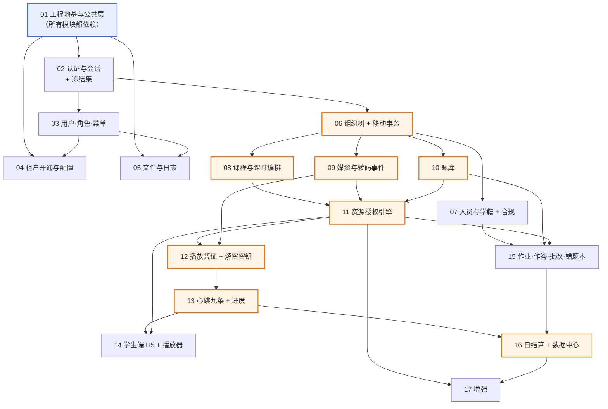

# EduMatrix 实施计划（模块序列）

> **本文不做设计决策。** 表名、字段、枚举、路由、错误码一律引用已冻结文档；文档未定案的一律进 §E 待决项，不自行发明。
>
> **文档权威顺序**：`DESIGN-CONTRACT.md` > `03-API接口文档/` 六分册 > `01-PRD-产品需求文档.md` > `02-数据库设计.md` + `backend/src/main/resources/db/migration/V202608120000__baseline.sql`。
> `docs/00-原始需求.md` 是客户输入基线，**只读、不引用为设计依据**。
>
> **执行方式**：一个开发者，按 01 → 17 顺序逐个模块做完再做下一个。没有并行、没有分期，**全部接口都在这条序列里**——没有任何一个接口游离在 17 个模块之外（总数以 `00-通用约定` §10 为准，本文不复述）。

---

## ⚠️ 开工前的头号未知项：R1a 微信内置浏览器可行性

> **⚠ 状态（2026-08-20 起）：已在 Android XWEB 上跑过一轮，选型已改，但【结论仍未签字】。**
> 需方已选定**路线 B：阿里云私有加密 + `VidAuth` + Aliplayer**（**产品侧决策，不是被实测逼的**），因此本节下文那句「AES-128 加密 HLS + hls.js」描述的是**原路线**。
>
> **`poc/r1a-aliplayer/RESULT.md` 的结论勾选框与签字栏至今是空的**，该文件自己写着「结论未定，且已明确还缺什么」；**iOS 微信四项零覆盖 · 签字前必测、不可豁免**。**开工前先看那份文件的签字栏，不要只看这一节。**
> 详见 §D 的 R1a 与 §B 模块 14「做完什么算做完」。

**先做这一项，在写第 01 行代码之前。**

它是整份计划里**唯一能推翻已定案架构**的一项：微信内置浏览器（X5/XWEB）上，AES-128 加密 HLS + hls.js + 跑马灯水印 + 禁止向前拖拽，这四件事能不能**同时**成立。任何一件不成立，契约 §1 的加密选型就要回到阿里云私有加密 + 阿里云播放器 SDK——模块 12 的解密密钥接口、模块 14 的 DPlayer 二开整体重做。

**它不依赖任何前置**：不依赖后端、不依赖阿里云账号、不依赖 ICP 备案。ffmpeg 自切一段加密 HLS + 二十行 mock 密钥端点，扔任意一台已备案的 HTTPS 静态站即可跑完。

**越晚做越贵**：模块 12 与 14 写完再撞车，付出的是删代码，不是改计划。

**怎么做见 §D 的 R1a**（四问、依赖、撞车后的影响面）。

---

## ✅ F-1 已解决（数据部分）：菜单与角色绑定已落地

**当初为什么必须先解决它**——这段推演保留在此，因为它是一次真实故障的还原，不是流程说辞：

> 读到一个没有菜单绑定的角色，`perms` 依然是空数组，**后果与零权限完全相同**：前端按钮全隐、后端 `@SaCheckPermission` 全部 403。契约 §2.9 花大篇幅解决的那个"系统开箱即不可用"，会以另一种形态原样重现。而它是个**不报错的故障**——接口返回 200、字段齐全，只是数组为空（03-01 §1.5）。

**现在去哪找**：

| 内容 | 位置 |
| --- | --- |
| 菜单与角色绑定数据 | `backend/src/main/resources/db/migration/V202608140000__init_menu_and_role_menu.sql`（Flyway 增量，基线未动） |
| `perms` 命名规范 | `DESIGN-CONTRACT.md` §3.1（格式 / 八个前缀 / 动作词表穷举 / 禁用同义写法） |
| 菜单树权威表 | `DESIGN-CONTRACT.md` §10 附表 A（与上述 SQL 同源生成） |

**还剩什么**：F-1 的**数据**问题已解决，**三件产品决策仍待拍板**——按钮粒度、`student` 的绑定是否需要、`teacher` 的 B3（依赖 F-6）。**这三件不阻塞模块 03 开工**，改的是数据不是代码。详见 §E 的 F-1。

---

## §A 模块索引

| # | 模块 | 前置 | 一句话交付物 |
| --- | --- | --- | --- |
| **01** | 工程地基与公共层 | — | 41 表 Flyway 基线 + 租户插件 + 数据权限入口 + 统一响应/ID/时间/traceId，**全系统只写这一次** |
| **02** | 认证与会话 + 冻结集鉴权 | 01 | 四类角色能登录，停用一个管理员分支对已在线的人**立即**生效 |
| **03** | 用户 · 角色 · 菜单 | 01, 02 | `/auth/me` 返回非空 `roles` / `perms`（初始化数据已就位，见 F-1） |
| **04** | 租户开通与租户配置 | 01, 03 | 平台超管能开机构，三步同事务；两个租户配置键可读可改 |
| **05** | 文件与日志 | 01, 03 | 私有桶 + 时效签名 URL + 三重类型校验；登录/操作日志可查 |
| **06** | 组织树查询与节点移动事务 | 01, 02 | 树能查、能改名、能停用；**移动节点是全系统唯一改树入口**，`ancestors` 同事务重算 |
| **07** | 人员与学籍 + K12 合规 | 06 | 建管理员/教师/学生，分配导师、转交、调岗、退课、归档、脱敏 |
| **08** | 课程与课时编排 | 06 | 课程—章节—课时三级结构可编排，图文课时可用 |
| **09** | 媒资与转码事件消费 | 06 | 视频直传上云，`FileUploadComplete` / `TranscodeComplete` 经 XXL-Job 拉队列消费 |
| **10** | 题库 | 06 | 六题型 + 版本快照；**三类受管资源就此齐全** |
| **11** | 资源授权引擎 | 08, 09, 10 | `org_resource_grant` 逐级下发、级联撤销、有效期截断，**`resource_type` 1/2/3 一次做全** |
| **12** | 播放凭证与解密密钥 | 09, 11 | 两条逐条相同的校验链；密钥接口才是真正的鉴权闸口 |
| **13** | 心跳九条与进度 | 12 | 防刷九条全实现，Redis 缓冲 60s 批量落盘，落盘时判完播 |
| **14** | 学生端 H5 与播放器二开 | 11, 12, 13 | 学生在微信里打开加密视频：~~禁快进~~（**F-113 取消**）、跑马灯水印、**前端计时器**、静默心跳 |
| **15** | 作业发布 · 作答 · 批改 · 错题本 | 07, 10, 11 | 发布固化版本、预建答卷、自动判卷、批改流水线、动态错题本 |
| **16** | 日结算与数据中心 | 13, 15 | `stat_student_daily` 双快照上卷；**全部指标列都有真值，无恒 0 列** |
| **17** | 增强 | 11, 16 | 权限模板、标签、Excel 导入、报表导出、大屏进阶 |

**接口分配核对**：03-01 共 36（02:6 + 03:16 + 04:9 + 05:5）｜03-02 共 51（06:6 + 07:20 + 11:6 + 17:19）｜03-03 共 33（08:21 + 09:5 + 12:1 + 13:3 + 14:3）｜03-04 共 31（10:12 + 15:19）｜03-05 共 8（16:5 + 17:3）。五个分册相加 **159**。

> **本行是核对，不是声明。** 接口总数的权威在 `00-通用约定` §10，本行的作用是验证"17 个模块的接口分配之和 = 那个总数"，即没有接口无人认领、也没有模块认领了不存在的接口。**两侧不一致时，改的是本行，不是 §10。**
>
> **⚠ 它曾经漏掉过一个接口，而且是它自称要防的那一种（模块 11 落地时发现）。** 原文写 `07:21 + 11:6`：模块 07 的 §B「涉及接口」表**只有 20 行**，模块 11 的表只有 6 行，而 03-02 §6.12（接口 52 归属变更影响面预检）逐字写着「签名在模块 07 敲定，**实现落在模块 11**」——**52 号被算进了模块 07 的数字里，却不在任何模块的 §B 表里**，于是"没有接口无人认领"这句话本身是假的，且全库无人实现它。
>
> 成因是**这一行只校验求和**：`36 + 52 + 34 + 31 + 8 = 161` 恒成立，与每个模块的数字对不对无关。而"每个模块声明的数 = §B 该模块表的行数"**从来没有被比对过**。已订正为 `07:20 + 11:7`，并新增一致性检查 **C20** 逐模块比对这两侧 —— 此后再错会红。
>
> 此前本行写「合计 159」并声称"与 §10 声明一致"——F-2 把总数从 159 改到 160 后，§10 与 `README.md` 都跟上了，本行没有，那句"一致"就成了假的。这类复述型数字是 C5 管不到的：C5 比对的是目录表 / 正文 / README 三处，本文档不在其中，也不该在——**04 对接口总数没有权威，它只是引用者**。因此文首（§0 执行方式）那处纯叙述性的复述已删除，全文只保留本行一个数字，且明确标注它是被核对方。

### 两处顺序调整及理由

| 调整 | 理由（可核对） |
| --- | --- |
| **题库（10）排在资源授权（11）之前** | 03-04 §0.1 规定题目可见性判定为「我的节点是该题的 `owner_node_id`，或该题已被显式授权给我的节点」。题目实体不存在时，授权引擎的 `resource_type=2` 只能写成空实现或 TODO。先做题库，11 就能把 1/2/3 三类一次做全 |
| **数据中心（16）排在作业（15）之后** | 03-05 §2.3(5) 的 `is_active` 完整口径是「`watch_seconds > 0` **或** 当日有提交答卷行为（`ontime_submit_count + late_submit_count > 0`）」；`ontime_submit_rate` 的分子分母全部来自 `hw_answer_sheet` / `hw_homework_target`。作业先做完，结算任务一次算全，`stat_*` 三表不出现恒 0 列 |

### 需方 2026-08-21 定的本轮排期：A → C → B

> **这三件是同一天定的三个批次，顺序是需方定的，不是实现方按依赖推的。**

| 批次 | 内容 | 需方给的理由 / 判据 |
| --- | --- | --- |
| **A**<br>**已落地** | **撤销教师 21 条受管资源写权限** —— 三类受管资源的写权限教师一条不留，资源由管理员生产，教师只教学与管理 | 与同日 F-105（视频上传收窄）同源、同做法：**改初始化数据不改代码**。范围最小、无前置，先落地免得后两批把它压在下面。**已落地**：迁移 `V202608210200`，`sys_role_menu` 200 → **179**、`teacher` 的 `perms` 58 → **37**，见 F-110 |
| **C**<br>**接着做** | **模块 12 / 13 / 14 + 加密路线订正（口头估 46 处，实测 49 处，另有 5 份清单之外的文件，见 F-112）** | **产品能不能用的分水岭** —— 学生能不能看到视频就取决于这条线。加密路线从标准加密改为阿里云私有加密的 46 处订正也在这一批里一次做完（F-106 已登记「03-03 §8 留给这一轮重写」，不要提前改一遍） |
| **B**<br>**放最后** | **F-108 平台级共享内容** | **它要改刚做完的授权引擎**（模块 11），排在前面等于一边改一边被 C 推翻。四件落地事项里三件是配置、一件是真活（`owner_node_id = 0` 的归属判定），见 F-108 |

**A 与 B 都动权限数据，但不冲突**：A 删的是 `teacher` 的 21 条绑定，B 加的是 `super_admin` 的内容权限（今天一条都没有，见 F-108 第 2 件）—— 两批各改各的角色，不会互相覆盖。

---

## §B 逐模块明细

### 01 工程地基与公共层

| 项 | 内容 |
| --- | --- |
| **前置** | 无 |
| **涉及表** | **写**：全部 41 张（本模块只建表，**不新增任何业务数据**）。`sys_10 + org_10 + crs_4 + vod_4 + qb_3 + hw_6 + stat_4`（契约 §9.1）。<br>注意基线脚本**自带**四个内置角色与一套示例租户/管理员/教师/学生的 `INSERT`——它们是基线内容的一部分，模块 01 不改也不删（契约 §7.3）；其中示例数据会随迁移进入生产库，见 §E 的 **F-16** |
| **涉及接口** | 无 |

**必读文档**

| 文档 | 读它为了什么 |
| --- | --- |
| `DESIGN-CONTRACT.md` §2.2 通用字段 | 逻辑删除是**毫秒时间戳**不是 0/1 标志；唯一索引末尾统一追加 `deleted_at` |
| `DESIGN-CONTRACT.md` §2.9 平台级行 | `TenantLineHandler` 只对 `sys_role` / `sys_role_menu` 放行 `tenant_id = 0`，其余 5 张表加 `org_node` 严格过滤 |
| `DESIGN-CONTRACT.md` §2.8 无会话上下文的写入 | 三类无会话写入的统一规则；`TenantHelper` 用完必须 `clear()` |
| `DESIGN-CONTRACT.md` §2.4 数据权限选路表 | `FIND_IN_SET` 是语义定义**不是执行写法**，三条执行路径各自命中哪个索引 |
| `02-数据库设计.md` §3.1.2 子树查询的三条路径 | 前缀 LIKE 的 SQL 模板与**空串分支不可省**的推导 |
| `02-数据库设计.md` §3.2 数据权限的实际 SQL 过滤 | 拦截器统一注入的过滤片段长什么样 |
| `00-通用约定.md` §3 / §4 / §5 / §6 | 响应体、分页、ID 字符串化、时间与时区四条硬约定 |
| `00-通用约定.md` §9 错误码总表 | 全部错误码落成枚举类，与登记册逐码一致 |
| `DESIGN-CONTRACT.md` §7.1 可观测性 | `traceId` 贯穿链路、响应头 `X-Trace-Id` 回传；10 项指标的埋点位置 |
| `DESIGN-CONTRACT.md` §7.3 数据库变更管理 | 基线文件此后不再改动，一切走增量脚本 |

**必须落地的规则**

1. 基线文件即 `backend/src/main/resources/db/migration/V202608120000__baseline.sql`（由原 `docs/sql/edumatrix_ddl.sql` 原样改名迁入，**迁移动作本身就属于本模块**，见 `05-工程结构.md` §B），**一次性建全 41 张表**（契约 §7.3）。做到第 15 个模块才写作业代码，但 9 张 `qb_` / `hw_` 表从第 1 天就在库里——**不要因为暂时用不到就删表或拆基线**，此后变更一律走增量脚本，基线文件不再改动。
2. `vod_heartbeat_log` 按月 RANGE 分区随基线建出，含 `pmax`（DDL 尾部分区定义）。
3. 逻辑删除：`@TableLogic(value="0", delval="UNIX_TIMESTAMP(NOW(3))*1000")`（契约 §2.2）。核心业务数据禁止物理删除。
4. 租户插件放行逻辑**写在 `TenantLineHandler` 的表达式构造里**，返回 `tenant_id = ? OR tenant_id = 0` 而非单等式（契约 §2.9）。
5. `sys_menu` 与 `sys_tenant` 不带 `tenant_id`，**不进插件**（契约 §2.9）。
6. 超管的跨租户访问靠**租户插件对超管整体放行**，与第 4 条是两条不同通道，不得混用（契约 §2.9）。
7. 数据权限过滤只有一条规则——你能看到的数据 = 你所在节点的子树（契约 §2.4）。按选路表实现三条路径：教师退化为 `parent_id` 直查、管理员走 `ancestors` 前缀 LIKE、逐层浏览走 `parent_id`。**前缀计算的空串分支不可省**（契约 §2.4 选路表）。
8. 解析 `ancestors` 时**跳过首位哨兵 `0`**；按 `IN` 查名称时返回行数比 id 数少 1 是正确行为（契约 §2.9）。
9. 无会话上下文模板：事件消费 / 定时任务 / 异步 Worker 三类入口统一用「从数据显式取 `tenant_id` → `TenantHelper.setTenantId()` → 处理 → `clear()`」，跨租户任务按租户分片，**无法确定租户一律拒绝并告警**（契约 §2.8 规则 1/2/3）。
10. 所有 bigint ID 序列化为字符串；请求侧一律以字符串接收（`00-通用约定` §5）。
11. 时间统一 `yyyy-MM-dd HH:mm:ss`、纯日期 `yyyy-MM-dd`、时长以秒为整数；服务器、数据库、接口三层都在东八区（`00-通用约定` §6）。
12. 统一响应体 `{code, msg, data}`；分页 `data` 固定 `{total, list}`，允许附加可选 `summary`，除三者外不得有同级字段（`00-通用约定` §3 / §4.2）。
13. 业务错误统一 HTTP 200，框架层错误 HTTP 码与 `code` 一致（`00-通用约定` §3.3）。
14. `traceId` 32 位 hex，经 MDC 贯穿日志、异步线程池、XXL-Job；响应头 `X-Trace-Id` 原样回传（契约 §7.1）。
15. 慢查询阈值 200ms，`FIND_IN_SET` 出现在慢查询日志中即视为缺陷并单独告警（契约 §7.1）。
16. 越权拒绝三分法落成公共异常：路径上的资源越界 → 404；请求体/参数中显式指定的目标越界 → `10107`；功能权限不足 → 403（契约 §2.4 / `00-通用约定` §2.4）。
17. 数据权限过滤条件为空集时记 `ERROR` 日志——那意味着过滤逻辑写漏了，正在返回全量数据（契约 §7.1 日志分级）。

**对外产出（后续模块一律调用，不得自写）**

| 产出 | 形态 |
| --- | --- |
| 租户过滤 | `TenantLineHandler` 实现类（含 `tenant_id = 0` 放行表清单）；业务代码**任何地方不得出现手写的 `OR tenant_id = 0`** |
| 无会话租户上下文 | `TenantHelper.setTenantId(Long)` / `TenantHelper.clear()`，配一个 `runWithTenant(tenantId, Runnable)` 包装器保证 `clear()` 一定执行 |
| 数据权限 | `SubtreeScopeHelper.subtreeNodeIds(myNodeId)` 返回子树节点 ID 集合（按选路表实现，内部区分教师/管理员两条路径）；`SubtreeScopeHelper.assertInSubtree(targetNodeId)` 越界时按三分法抛对应异常 |
| 祖先链缓存 | Redis `node:anc:{nodeId}` → STRING，值为该节点 `ancestors`（契约 §2.3）。读写封装为 `NodeAncestorCache.get(nodeId)` / `evictSubtree(nodeId)` |
| 统一响应 | `R<T>` + 全局异常处理器；`R.ok(data)` / `R.fail(ErrorCode)` |
| 错误码 | `ErrorCode` 枚举，逐码对应 `00-通用约定` §9 登记册 |
| ID | 雪花 `IdWorker.nextId()`；Jackson 全局 `Long → String` 序列化器 |
| 分页 | `PageResult<T>{total, list}`；`pageSize` 上限 100 强制生效 |
| 幂等 | `@Idempotent` 注解 + Redis key `idem:{userId}:{requestId}`，TTL 5 分钟（`00-通用约定` §7.2） |
| 链路 | `TraceIdFilter` + MDC；异步线程池与 XXL-Job 的 traceId 继承包装 |
| 指标 | `MetricsRegistry` 常量类，登记契约 §7.1 的 10 项指标名 |

**禁止事项**

- 不自造表名、字段名、枚举值、接口路径、错误码——一律引用已冻结文档。
- 不重写公共层：本模块是公共层本身，后续模块需要上述能力时**调用这里的类**。
- 不改已交付模块。
- **本模块特有**：不得为了"暂时用不到"而从基线里删除 `qb_` / `hw_` 九张表；不得在业务代码里逐处手写租户放行条件（契约 §2.9 明令）；不得把 `ancestors` 写进 JWT（它随节点移动而变，写进去就固化成发证时刻的快照，契约 §2.3）。

**做完什么算做完**

- 空库执行基线脚本 → 41 张表建出，`vod_heartbeat_log` 分区就位（契约 §9.1 表总数）。
- 任一接口响应满足 `00-通用约定` §3 / §5 / §6；响应头带 `X-Trace-Id`。
- 自检：`SELECT COUNT(*) FROM information_schema.tables WHERE table_schema=...` 得 41；全局 grep 业务代码，`OR tenant_id = 0` 命中数为 0；`FIND_IN_SET` 在业务 Mapper 中命中数为 0。

---

### 02 认证与会话 + 冻结集鉴权

| 项 | 内容 |
| --- | --- |
| **前置** | 01（提供统一响应、错误码、`NodeAncestorCache`、租户插件） |
| **涉及表** | **写**：`sys_login_log`、`sys_user`（`last_login_time` / `pwd_reset_flag`）｜**只读**：`org_node`、`sys_tenant`、`org_student`、`sys_role`、`sys_role_menu`、`sys_menu`、`sys_user_role` |

**涉及接口（03-01，6 个）**

| 编号 | 名称 | 方法 | 路径 |
| --- | --- | --- | --- |
| §1.1 | 获取图形验证码 | GET | `/api/v1/auth/captcha` |
| §1.2 | 登录 | POST | `/api/v1/auth/login` |
| §1.3 | 刷新令牌 | POST | `/api/v1/auth/refresh` |
| §1.4 | 登出 | POST | `/api/v1/auth/logout` |
| §1.5 | 获取当前用户信息 | GET | `/api/v1/auth/me` |
| §1.6 | 修改密码（本人） | PUT | `/api/v1/auth/password` |

**必读文档**

| 文档 | 读它为了什么 |
| --- | --- |
| `DESIGN-CONTRACT.md` §2.3「停用语义」与「定案：鉴权拦截器校验冻结集」 | 停用按节点类型区分；登录两段校验；冻结集为什么不是用户集 |
| `03-01 §1.2` 登录 | 登录校验的完整判定顺序与各自错误码 |
| `03-01 §1.5` 获取当前用户信息 | `roles` / `perms` / `nodePath` 的组装口径 |
| `00-通用约定.md` §2.1 / §2.2 Token 机制与生命周期 | 双 Token 有效期、refreshToken 旋转（一次性使用） |
| `00-通用约定.md` §2.3 认证白名单 | 免登录接口只有**三条**，且**全部属于认证自身**（登录 / 验证码 / 刷新令牌）—— 原第四条**解密密钥接口**（03-03 接口 29 获取解密密钥）已随加密路线改为阿里云私有加密而删除（F-112） |
| `00-通用约定.md` §8 限流约定 | 登录与验证码的 IP 限流、连续密码错误锁定 |
| `PRD` §7.3 安全条款 1/2 | BCrypt cost ≥ 10、弱密码策略、登出即时失效 |

**必须落地的规则**

1. **登录停用校验分两段，缺一不可**（契约 §2.3）：① 本人所在节点 `status=1` 即拒登（教师/学生的"仅本人"停用由此生效）；② 拆 `ancestors` 主键 `IN` 查询，命中 `node_type=1 且 status=1` 的祖先即拒登（管理员的分支冻结由此生效）。两段任一命中返回 `10017`。
2. **只写 `org_node.status` 一行，绝不同步写 `sys_user.status`**（契约 §2.3）。后者是与组织无关的账号级封禁、仅超管可置。停用与启用天然对称可逆，正因为写的是同一字段的两个方向。
3. **冻结集鉴权**（契约 §2.3）：Redis `frozen:{tenantId}` SET 存该租户当前被停用的节点 id；每请求取 `node:anc:{myNodeId}` 拆出祖先链与冻结集求交，命中即拒并返回 `10017`。
4. 顺序约束两条，方向都朝"宁可多拦一瞬"（契约 §2.3）：停用**先 `SADD` 再提交事务**；启用**先提交事务再 `SREM`**。
5. **Redis 不可用时鉴权降级为查库**（拆 `ancestors` 主键 `IN`，约 5 行点查），**不得跳过校验**——这是安全校验不是缓存加速（契约 §2.3）。
6. 租户到期或停用 → `10007`；账号级封禁或锁定 → `10005`；学籍已归档 → `10015`；节点或其上级停用 → `10017`。四者提示语不同，不得合并（`00-通用约定` §9.2）。
7. refreshToken **旋转**：每次刷新下发新的，旧的立即失效；失效或过期返回 `10006`（`00-通用约定` §2.2 规则 3/4）。
8. `pwd_reset_flag=1` 时强制改密，未改密前不得访问其他页面（PRD F1-1 规则 6）。
9. 登录失败连续 5 次锁定 15 分钟，返回 `10005` 并在 `msg` 提示剩余时间（`00-通用约定` §8）。
10. 登录成功与失败**都**写 `sys_login_log`（PRD F1-1 验收标准要求失败也留痕）。
11. `/auth/me` 的 `roles` / `perms` 依赖 `sys_user_role → sys_role → sys_role_menu → sys_menu` 链路；该链路的初始化数据已由 `backend/src/main/resources/db/migration/V202608140000__init_menu_and_role_menu.sql` 提供（四角色 perms 计数 **`org_admin 94 / teacher 61 / super_admin 31 / student 0`**，见 §E 的 F-1）。
    > **本行数字于模块 02 按迁移后实测值订正**（原写 `93 / 61 / 31 / 2`）。两处差异都源自本文档 §E 内部的后续定案，属同一份文档的前后不一致，非权威冲突：**`student 0`** 依据 F-1 定案②「`student` 不绑任何菜单行……`sys_role_menu` 中 `student` 的 2 条绑定已删除（201 → 200 行）」，库中正为 200 行；**`org_admin 94`** 依据 F-2 定案「菜单 A14 的 `visible` 由 0 改 1 并绑 `org_admin`」，即 93 + 1。
    >
    > **`student` 的 `perms` 为空数组是设计意图，不是租户插件失效。**两者的外部表现相同（接口 200、字段齐全、数组为空），区分方法：看 `roles` —— 其中有 `student` 这一行即说明 `tenant_id = 0` 的平台级放行生效。该区分已写成断言（`AuthMeIT.studentHasRolesButNoPerms`）。

**对外产出**

| 产出 | 形态 |
| --- | --- |
| 冻结集 | Redis `frozen:{tenantId}` → SET；封装 `FrozenNodeCache.add(tenantId, nodeId)` / `remove(...)` / `isFrozen(tenantId, ancestorIds)`，含 Redis 不可用时的查库降级分支 |
| 会话上下文 | 登录时把 `userId` / `userType` / `nodeId` / `tenantId` 放进 Sa-Token Session；`LoginHelper.getNodeId()` 等取值方法。**`ancestors` 不进 Token**（契约 §2.3） |
| 鉴权拦截器 | 每请求执行冻结集校验，模块 03 之后的所有接口自动受保护 |

**禁止事项**

- 通用三条（不自造命名 / 不重写公共层 / 不改已交付模块）。
- 需要租户上下文、数据权限、统一响应、ID 序列化时**调用 01 的公共类，不要自己写一份**。
- **本模块特有**：不得为"让停用立刻生效"而遍历子树逐个 `StpUtil.logout()`——那又回到"为 1.1 万人写 2.2 万次"的形态（契约 §2.3 方案对照表）；不得把 `ancestors` 写进 JWT；不得在停用时顺手改 `sys_user.status`。

**做完什么算做完**

- PRD F1-1 验收标准 · Given 机构 `expire_time` 为 `2026-08-11 23:59:59`，When 该机构任一账号在 `2026-08-12 09:00:00` 登录，Then 返回 `10007` 且 `sys_login_log` 记录失败状态。
- PRD F1-1 验收标准 · Given 机构管理员用初始密码首次登录，Then 强制进入修改密码页。
- PRD F1-2 验收标准 · Given **管理员**节点 N 被停用，When 其子树内学生登录，Then 被拒；When **教师**节点 T 被停用，其名下学员登录，Then 成功。
- 自检：停用一个管理员节点后，其子树内**已持有有效 accessToken** 的账号下一次请求即返回 `10017`（不等 2 小时）；断开 Redis 后该校验仍生效（走查库降级）。

---

### 03 用户 · 角色 · 菜单

| 项 | 内容 |
| --- | --- |
| **前置** | 01、02（提供登录态与 `perms` 的消费方） |
| **涉及表** | **写**：`sys_user`、`sys_role`、`sys_user_role`、`sys_menu`、`sys_role_menu`、**`org_node`**、**`org_node_change_log`**｜**只读**：**`sys_tenant`**<br>**订正说明**：本行原写「只读 `org_node`」，与 03-01 分册不符。§2.2 的副作用是「**同一事务内**创建 `org_node` 节点并回写 `sys_user.node_id`，同时记录一条 `org_node_change_log`（`change_type=1` 建档）」，§2.4 要求「同时**逻辑删除**其 `org_node` 节点」——两处都是**写**；§2.2「创建学生账号受租户 `max_student_count` 限制」则需只读 `sys_tenant`。<br>**`org_node_change_log` 只有 §2.2 一处写入**：§2.4 的原文只有节点逻辑删除与作废 Token，而 03-02 分册的三个删除人员接口同样不写轨迹——**不要在删除路径上补一条** |

**涉及接口（03-01，16 个）**

| 编号 | 名称 | 方法 | 路径 |
| --- | --- | --- | --- |
| §2.1 | 分页查询用户 | GET | `/api/v1/system/users` |
| §2.2 | 创建用户 | POST | `/api/v1/system/users` |
| §2.3 | 修改用户 | PUT | `/api/v1/system/users/{id}` |
| §2.4 | 删除用户（逻辑删除） | DELETE | `/api/v1/system/users/{id}` |
| §2.5 | 重置用户密码 | PUT | `/api/v1/system/users/{id}/password/reset` |
| §2.6 | 启用/停用用户 | PUT | `/api/v1/system/users/{id}/status` |
| §3.1 | 分页查询角色 | GET | `/api/v1/system/roles` |
| §3.2 | 查询角色详情 | GET | `/api/v1/system/roles/{id}` |
| §3.3 | 创建角色 | POST | `/api/v1/system/roles` |
| §3.4 | 修改角色 | PUT | `/api/v1/system/roles/{id}` |
| §3.5 | 删除角色（逻辑删除） | DELETE | `/api/v1/system/roles/{id}` |
| §3.6 | 为角色分配菜单 | PUT | `/api/v1/system/roles/{id}/menus` |
| §4.1 | 查询菜单树 | GET | `/api/v1/system/menus/tree` |
| §4.2 | 创建菜单 | POST | `/api/v1/system/menus` |
| §4.3 | 修改菜单 | PUT | `/api/v1/system/menus/{id}` |
| §4.4 | 删除菜单（逻辑删除） | DELETE | `/api/v1/system/menus/{id}` |

**必读文档**

| 文档 | 读它为了什么 |
| --- | --- |
| `DESIGN-CONTRACT.md` §2.9 末段「放宽的只是读，写侧必须反向收紧」 | 四个内置角色对 `org_admin` **全只读**，只有 `super_admin` 可改、任何人不可删 |
| `DESIGN-CONTRACT.md` 第 3 节 角色与操作权限 | 四个角色穷举；机构管理员与下级管理员**角色相同**，差别只在树的位置 |
| `03-01 §3` 导语与 §3.4 / §3.5 / §3.6 | 预置角色的只读约束在三个写接口上分别怎么落 |
| **`03-01 §2` 导语**（逐字读） | **本组写接口 2.2~2.6 一律仅 `super_admin`**，只有 2.1 保留 `org_admin`；以及「为什么必须收敛成一条路径」的三条理由（建人/删人/停用） |
| `03-01 §2.6` 启用/停用用户 | 该接口已收敛为**超管专用**（契约 §2.3） |
| `00-通用约定.md` §9.2 | 本模块相关业务错误码**共 10 个**：`10001` / `10008` / `10009` / `10012` / `10104` / `10105` / `10106` / `10107` / `10108` / `10207`。<br>**订正说明**：本行原只列前四个。逐接口对照 03-01 的「相关业务错误码」表：§2.2 六个（`10001` `10207` `10104` `10105` `10106` `10107`）、§2.3 一个（`10012`）、§2.4 两个（`10012` `10108`）、§2.6 一个（`10012`）、§3.5 一个（`10008`）、§4.4 一个（`10009`）；§2.1/§2.5/§3.1~§3.4/§3.6/§4.1~§4.3 无业务码（预置角色受限、`roleName`/`roleKey`/`perms` 重复、越权菜单一律 **400**） |

**必须落地的规则**

1. `sys_role` / `sys_role_menu` 的 `tenant_id = 0` 行是**全平台共用的同一行**，对 `org_admin` 全只读：改名称、改状态、改菜单绑定一律拒绝，任何人不可删（契约 §2.9）。
2. **`/api/v1/system/users` 的五个写接口（§2.2 创建 / §2.3 修改 / §2.4 删除 / §2.5 重置密码 / §2.6 启停用）一律仅 `super_admin` 可调**；只有 §2.1 分页查询保留 `org_admin`。菜单管理的 §4.2 / §4.3 / §4.4 同样仅 `super_admin`（平台级维护接口，org_admin 及以下 403）。
   **订正说明**：本条原只写了「`PUT /users/{id}/status` 仅超管可调」，漏了 §2.2~§2.5 四条。三方证据一致、本条落单：① 03-01 §2 导语明写「本组的写接口（2.2~2.6）**一律仅 `super_admin` 可调**，用途限定为平台级账号维护……机构侧人员的建、改、删、重置密码、启停用**一律走 02-组织机构分册的 `/api/v1/org/**`**」；② §2.2~§2.6 的「允许角色」栏逐条写着「**仅 `super_admin`**」；③ 菜单初始化脚本 `V202608140000` 里 `system:user:add/edit/remove/resetPwd/status` 与 `system:menu:add/edit/remove` **只绑了 `super_admin`**。
   **为什么这条不能弄错**：§2 导语给了理由——本组的创建**不写 `org_teacher` / `org_student` 档案**，机构侧经此路径建人会产生 PRD F1-3 规则 1 明令禁止的**孤儿数据**（有节点无档案，在 `/org/teachers` 列表里查不到、无工号无科目）。把 `org_admin` 放进来，等于给机构侧开了一条造孤儿数据的路。
   而 §2.6 那一条的单独理由仍然成立：机构侧改不了 `sys_user.status`，这正是不允许停用节点时顺手写它的原因。
   **落地形态**：收敛**不靠代码里的 `if`**，靠 `sys_role_menu` 的初始化数据——权限的真相只有一份，代码里再写一份就有了两份，而两份迟早会分叉（本条冲突正是这个形态）。回归测试见 `SystemUserWriteScopeIT`。
3. 角色数据权限口径：`org_admin` 可见「本租户自建角色 + 平台预置角色」（03-01 §3.1）。
4. 不允许对当前登录账号执行删除、停用、降权 → `10012`（PRD F1-3 规则 9）。
5. 角色被用户引用时不可删 → `10008`；菜单存在子节点或被角色引用时不可删 → `10009`（`00-通用约定` §9.2）。
6. 用户名全局唯一 → `10001`。删除走逻辑删除，`uk_username(username, deleted_at)` 自动放行同名重建（契约 §2.2）。
7. **任何层级的管理员 `role_key` 一律 `org_admin`**，菜单/按钮权限完全一致；层级差异只体现在数据范围（契约 §3、PRD F1-3 规则 7）。

**对外产出**

| 产出 | 形态 |
| --- | --- |
| 权限校验 | `@SaCheckPermission("system:user:list")` 形态的注解可用；`perms` 从 `sys_menu.perms` 装配 |
| 菜单初始化脚本 | 已落成 `backend/src/main/resources/db/migration/V202608140000__init_menu_and_role_menu.sql`（124 行菜单 + 201 行角色绑定）。**此后追加菜单同样走增量脚本，不改基线文件**（契约 §7.3） |

**禁止事项**

- 通用三条。
- 需要租户上下文/数据权限/统一响应/ID 序列化时调用 01 的公共类，不要自己写一份。
- **本模块特有**：不得给 `org_admin` 开放预置角色的任何写入口；不得把菜单初始化数据写进 `V202608120000__baseline.sql`（基线已冻结，走增量脚本）。

**做完什么算做完**

- **契约 §3 / PRD F1-3 规则 7**：两个**不同层级**的 `org_admin`（机构最高管理员与下级管理员）调 `/auth/me`，`role_key` 相同、`perms` **逐条相同**，差异只体现在 `nodeId`。
  **订正说明**：本条原写的是 PRD F1-3 那条完整验收标准（「乙创建丙，丙的 role_key 与乙相同、菜单权限一致，且丙的子树严格包含于乙的子树」），**与模块 07 的完成判据第一条「PRD F1-3 全部 5 条验收标准」重复**，且本模块跑不出它：F1-3 的 5 条逐条都是 `/org/**` 的语义（三写一事务、`org_teacher.student_count` +1、`guardianConsent`、`10013` 时事务回滚），而按 03-01 §2 导语，建人走 `/org/**`，本模块的 §2.2 是超管专用且不写档案表——用它建人正是被禁的那条路。参数名也对不上（PRD/03-02 用 `initPassword` 明文返回一次，03-01 §2.2 用 `password` 调用方指定不回显），**说明这两条路本来就不是同一件事**。
  该判据**整体归模块 07**；本模块承担的是其中属于 RBAC 的那半句（角色固定不分层），它不需要建人就能验。
- 自检：租户 A 的机构管理员调 `/auth/me`，`roles` 与 `perms` **均非空**；同一账号尝试修改预置 `teacher` 角色的菜单绑定被拒；租户 A 列不出租户 B 的自建角色。
- **写侧收紧三件套**：`org_admin` 对预置角色的改名称 / 改状态 / 改菜单绑定分别被拒（**400**）；`super_admin` 改得动；**任何人删不掉**（含超管）。
- **§3.6 防提权**：`org_admin` 给自建角色分配一个自己没有的菜单 → 被拒（400）；§3.3 建角色时塞越权菜单同样被拒（它等价于建后调 §3.6）。
- **§2.2~§2.6 五个写接口对 `org_admin` 全部 403**（规则 2 的回归测试）。
- **同名重建**：创建用户 U → 逻辑删除 → 再创建同名 U 成功（`uk_username(username, deleted_at)` 自动放行）。
- **§2.4 子节点保护**：删除一个仍有未删除子节点的用户 → `10108`，账号与节点均未被改动。
- **§2.2 副作用**：同事务落 `org_node` + `org_node_change_log`（`change_type=1`、`from_parent_id` 为 NULL），`node_type` 与 `userType` **恒等**，父节点 `child_count` +1。

---

### 04 租户开通与租户配置

| 项 | 内容 |
| --- | --- |
| **前置** | 01、03 |
| **涉及表** | **写**：`sys_tenant`、`sys_tenant_config`、`org_node`、`sys_user`、`sys_user_role`｜**只读**：`org_student`（在读学生数上限校验） |

**涉及接口（03-01，9 个）**

| 编号 | 名称 | 方法 | 路径 |
| --- | --- | --- | --- |
| §5.1 | 分页查询租户 | GET | `/api/v1/system/tenants` |
| §5.2 | 查询租户详情 | GET | `/api/v1/system/tenants/{id}` |
| §5.3 | 创建租户（开通机构） | POST | `/api/v1/system/tenants` |
| §5.4 | 修改租户 | PUT | `/api/v1/system/tenants/{id}` |
| §5.5 | 删除租户（逻辑删除） | DELETE | `/api/v1/system/tenants/{id}` |
| §5.6 | 租户续期 | PUT | `/api/v1/system/tenants/{id}/renew` |
| §5.7 | 启用/停用租户 | PUT | `/api/v1/system/tenants/{id}/status` |
| §6.1 | 查询租户配置列表 | GET | `/api/v1/system/tenant-configs` |
| §6.2 | 修改租户配置 | PUT | `/api/v1/system/tenant-configs/{configKey}` |

**必读文档**

| 文档 | 读它为了什么 |
| --- | --- |
| `DESIGN-CONTRACT.md` §2.1 多租户与树根 | 开通租户的**循环依赖**与固定的三步落库顺序 |
| `03-01 §5.0` 租户与组织树根节点的对应关系 | 机构根节点 id = `tenant_id` = `sys_tenant.root_node_id` |
| `DESIGN-CONTRACT.md` §5 末「租户配置键白名单」 | 只有两个合法键及各自默认值与取值范围 |
| `PRD` F1-1 机构开通与生命周期 | 到期、停用、学生规模上限三条业务规则 |

**必须落地的规则**

1. **三步同一事务**（契约 §2.1）：插租户行（`root_node_id` 暂空）→ 插机构根节点 → 回写 `root_node_id`。`sys_tenant.root_node_id` 必须允许 NULL，否则这个循环依赖解不开。
2. 机构根节点 `node_type=1`、`parent_id=0`、其 id 即该租户的 `tenant_id`；与初始管理员 `sys_user.node_id` 互为反向引用（PRD F1-1 规则 2）。
3. 初始密码系统生成，`pwd_reset_flag=1`，明文**仅在创建响应中返回一次**、不落库不可再查（PRD F1-1 规则 6、F1-3 规则 3）。
4. 机构根节点**不可删除、不可移动、不可停用**（PRD F1-1 规则 7）；停用机构走 `sys_tenant.status`。
5. 在读学生数（`org_student.status=0`）达 `max_student_count` 时新增/导入被拒 → `10207`（PRD F1-1 规则 5）。
6. 配置键不在白名单 → `10016`（`00-通用约定` §9.2）。两个合法键：`complete_rate_threshold`（int，默认 90，范围 60~100）、`watermark_phone_mask`（int，默认 1）。
7. **云厂商选择属平台部署级参数，不是租户配置键**（契约 §5 末）——不得为它加键。存放位置见 §E 的 F-5。

**对外产出**

| 产出 | 形态 |
| --- | --- |
| 租户配置读取 | `TenantConfigHelper.getInt(key)`，读不到时回落平台默认值（02-数据库设计 §4 `sys_tenant_config` 说明）。模块 13 判完播、模块 12 取水印开关都走它 |

**禁止事项**

- 通用三条 + 调用 01 公共类。
- **本模块特有**：不得往租户配置键白名单里加键（白名单是穷举，契约 §5 末）；不得把 AK/SK 等部署参数塞进 `sys_tenant_config`。

**做完什么算做完**

- PRD F1-1 验收标准 · Given 平台超管创建机构成功，When 查看该机构组织树，Then 存在且仅存在一个 `node_type=1`、`parent_id=0` 的机构根节点，`sys_tenant.root_node_id` 指向它，且与初始管理员 `sys_user.node_id` 互为反向引用。
- PRD F1-1 验收标准 · Given `max_student_count=500` 且在读已 500 人，When 导入含 10 名新学生的 Excel，Then 整体拒绝（`10207`）。
- 自检：中断第 2 步后回滚，库中不留孤儿租户行。

---

### 05 文件与日志

| 项 | 内容 |
| --- | --- |
| **前置** | 01、03 |
| **涉及表** | **写**：`sys_file`、`sys_oper_log`｜**只读**：`sys_login_log`、`sys_tenant`（清理任务逐租户进入，见 Q-2）、`sys_user`（按 `user_type` 收窄可上传的 `bizType`，走 `system` 域内已有的 `SysUserMapper`，不另开第二个 `sys_user` Mapper） |

**涉及接口（03-01，5 个）**

| 编号 | 名称 | 方法 | 路径 |
| --- | --- | --- | --- |
| §7.1 | 上传文件 | POST | `/api/v1/system/files` |
| §7.2 | 查询文件详情 | GET | `/api/v1/system/files/{id}` |
| §7.3 | 下载文件 | GET | `/api/v1/system/files/{id}/download` |
| §8.1 | 分页查询登录日志 | GET | `/api/v1/system/logs/login` |
| §8.2 | 分页查询操作日志 | GET | `/api/v1/system/logs/oper` |

**必读文档**

| 文档 | 读它为了什么 |
| --- | --- |
| `00-通用约定.md` §7.4 文件与导出的安全基线 | 六条硬要求逐条，含 Excel 公式注入与字符白名单 |
| `03-01 §7.3` 下载文件 | 归属校验的**唯一入口**就在这里 |
| `DESIGN-CONTRACT.md` §7.2 第 5 条 | 两张日志表保留 ≥ 6 个月，且不参与删除请求的清理 |

**必须落地的规则**

1. 对象存储桶**一律私有**；任何文件访问经服务端换取**时效签名 URL（≤30 分钟）**，禁止长期公开直链；文件域名与业务域名分离（`00-通用约定` §7.4）。
2. **归属校验只在下载接口实现一次**；任何其他接口不得返回可直接访问的文件地址，否则该校验被绕过（`00-通用约定` §7.4）。
3. 上传三重校验：扩展名 + 请求 `Content-Type` + **文件头魔数**，以魔数为准且必须与扩展名一致；服务端强制重命名为 `{fileId}.{规范扩展名}`；下载统一 `Content-Disposition: attachment` + `X-Content-Type-Options: nosniff`；**SVG 不在白名单内**（`00-通用约定` §7.4）。
4. **Excel 写出防公式注入**：任何 `.xlsx` 的字符串单元格若以 `=` `+` `-` `@` `Tab` `CR` 开头，必须前置单引号或显式设为文本格式（`00-通用约定` §7.4）。这条要做成公共工具，模块 17 的导入失败报告与导出报表都用它。
5. 敏感文件（导入源文件、失败报告、导出报表）保留 **7 天**后由定时任务物理清理（`00-通用约定` §7.4）。
6. 文件类型不支持或超限 → `10011`（`00-通用约定` §9.2）。
7. 两张日志表保留 ≥ 6 个月，**不参与删除请求的清理**（契约 §7.2 第 5 条）——与模块 07 的脱敏任务边界要划清。
8. **三个文件接口不加 `@SaCheckPermission`**（契约 §3.1 边界 0，F-1② 定案）：`system:file:*` 的 `perms` 只用于管理端 A22 页面的菜单显隐，不作为接口鉴权依据。归属校验走 `00-通用约定` §7.4 的 `bizType` 校验，且**只在下载接口（03-01 §7.3）实现一次**——任何其他接口不得返回可直接访问的文件地址，否则该校验被绕过。

**对外产出**

| 产出 | 形态 |
| --- | --- |
| 对象存储 SPI | `common/file/ObjectStorage`（`storageType` / `put` / `delete` / `presignedUrl` / `openStream`）；OSS 实现 `integration/aliyun/OssClient`（**启动自检：桶 ACL 必须 Private、Location 必须 `oss-cn-*`，不满足即启动失败**），本地实现 `common/file/LocalObjectStorage` |
| 文件服务 | `FileService.upload(...)` 返回 `SysFile`；`FileService.inlineSignedUrl(fileId)` 生成 ≤30 分钟**内联**签名地址（**仅 `course_cover` / `material_image` / `avatar` 三种**，D-2 定案）；`resolveForDownload` / `signedDownloadUrl` / `openStream` 供 §7.3 |
| 文件归属校验 SPI | `common/file/FileOwnershipChecker` + `FileOwnershipRegistry`。**没有 checker 一律拒绝（fail closed）**；待模块 11 / 15 / 17 各自注册 |
| 上传类型判定 | `common/file/FileMagic`（一级魔数表）+ `FileTypeDetector`（**二级族内判别**：ZIP 族按条目、OLE2 族按 POIFS 根条目；`txt` 三条与门） |
| Excel 安全写出 | **`common/excel/SafeExcelWriter`**，字符串单元格自动做公式注入转义（六个前导字符）；**`common/excel/ExcelInputValidator`** 拒绝以 `= + - @` 开头的文本 + 字符白名单。**落 `common/` 而不是 `system/file`**——消费方跨 `org` / `stat` / `system` 三域，检查③ 禁止领域包互相 import |
| 操作日志 | `@OperLog(module=..., action=...)` 注解 + **`common/operlog/OperLogAspect` 切面** + **`OperLogWriter`（全库唯一写 `sys_oper_log` 的实现）** + `SensitiveParamMasker` |
| 敏感文件清理 | `job/TempFileCleanupJob`，每日 03:30，**正向白名单**四个 bizType（Q-2 定案） |

**禁止事项**

- 通用三条 + 调用 01 公共类。
- **本模块特有**：不得在下载接口之外的任何接口返回文件直链或未签名地址；不得把 SVG 加进上传白名单；不得让脱敏任务清理两张日志表。

**做完什么算做完**

- 自检（对齐 `00-通用约定` §7.4 逐条）：改扩展名伪装的文件被魔数校验拒绝；签名 URL 超过 30 分钟后失效；构造姓名为 `=1+1` 的数据导出后，单元格内容以单引号开头、Excel 打开不执行公式；跨用户请求他人文件的下载接口被拒。

> **落地补充（模块 05 交付时）**：上面第一条「改扩展名伪装」**只测跨族是测不出问题的**——ZIP 族（`docx`/`xlsx`/`pptx`/`zip`）与 OLE2 族（`doc`/`xls`/`ppt`）**族内魔数完全相同**，只做一级判定时「真 `.xlsx` 改名 `.docx`」会被放行而这条自检**看起来仍然是绿的**。故验收以 `FileTypeDetectorTest#realXlsxIsNotMistakenForDocx` 与 `SysFileIT#familyLevelSpoofingIsRejected` 为准。
>
> **第二条「签名 URL 超过 30 分钟后失效」在 CI 里跑不了**（要真等 30 分钟、且要真实 OSS）。等价保障拆成两条离线用例：`OssPresignParamsTest#ttlIsThirtyMinutes` 断言签名请求的过期时刻恰好是 30 分钟后；`FileConstants.SIGNED_URL_TTL` 写死不做成配置项。**这一点如实说明，不声称已验证「超时失效」本身。**

---

### 06 组织树查询与节点移动事务

| 项 | 内容 |
| --- | --- |
| **前置** | 01（`SubtreeScopeHelper` / `NodeAncestorCache`）、02（冻结集写侧） |
| **涉及表** | **写**：`org_node`、`org_node_change_log`、`sys_user`（重置密码）、**`org_teacher`（`student_count`，见下）**｜**只读**：`org_student`、`org_resource_grant`（移动时回传跨管辖清单） |

> **`org_teacher` 由「只读」订正为「写」（模块 06 落地时核实）**：本行原写着只读，与**模块 07「对外产出 · 冗余维护」**那一行冲突——后者逐字：「`org_teacher.student_count` 与 `org_node.child_count` / `student_count` 的维护**统一在 06 的移动事务**与本模块建删事务内」。取「写」的依据有两条，都不是推测：① DDL 对该列的注释逐字「名下在读学员数（冗余计数，**与 `org_node.student_count` 同源同步**；**分配/转交/调岗**/归档时维护）」；② 分配导师 / 转交管理员 / 教师调岗**全部**是移动事务的语义化封装（模块 07 规则 5：「一律调用 06 的 `NodeMoveService`，不得另写改父逻辑」），**模块 07 没有别的钩子能补这一笔**。不在移动事务里维护，接口 4 被直接调用时该冗余列就**静默变陈旧**。<br>**这是对 `02-数据库设计 §3.1.3` 七步模板的一处增补**（模板的步骤 6 只写 `org_node` 两列），已在 `NodeMemberMapper#addTeacherStudentCount` 与 `NodeMoveService` 步骤 6 处逐条注明「有意增补、不是照抄遗漏」，以免下一个人对着模板核对时误判。

**涉及接口（03-02，6 个）**

| 引用（分册 + 目录编号 + 接口名） | 方法 | 路径 |
| --- | --- | --- |
| 03-02 接口 1 组织树查询 | GET | `/api/v1/org/nodes/tree` |
| 03-02 接口 2 节点详情 | GET | `/api/v1/org/nodes/{id}` |
| 03-02 接口 3 修改节点 | PUT | `/api/v1/org/nodes/{id}` |
| 03-02 接口 4 移动节点 | PUT | `/api/v1/org/nodes/{id}/move` |
| 03-02 接口 5 节点停用 / 启用 | PUT | `/api/v1/org/nodes/{id}/status` |
| 03-02 接口 6 重置人员密码 | PUT | `/api/v1/org/nodes/{id}/password/reset` |

**必读文档**

| 文档 | 读它为了什么 |
| --- | --- |
| `DESIGN-CONTRACT.md` §2.3 结构约束 1~5 | 承载规则、防成环、`ancestors` 同事务重算、深度上限 50 级 |
| `02-数据库设计.md` §3.1.3 移动节点的完整事务 | **7 步 SQL 模板**与加锁顺序；第 6 步为什么绝不能写成 `FIND_IN_SET` |
| `02-数据库设计.md` §3.1.4 防成环校验的具体写法 | 两个条件缺一不可；为什么必须在 `FOR UPDATE` 之后校验 |
| `02-数据库设计.md` §3.1.5 承载规则的落库校验点 | 全部会改变父子关系的入口逐一枚举，建议收敛为一个静态方法 |
| `00-通用约定.md` §7.5 组织树结构操作的并发约束 | 同一事务、行锁、校验在锁内、**非幂等不可重试** |
| `03-02 §3.4` 移动节点 | 11 条校验的**执行顺序**与各自错误码；`outOfScopeGrants` 回传 |
| `03-02 §3.5` 节点停用 / 启用 | 冻结集写侧顺序；为什么不碰 `sys_user.status` |
| `03-02 §3.1` 组织树查询 | 懒加载口径（按 `parent_id` 逐层，只返回操作人子树） |

**必须落地的规则**

1. **移动节点是全系统唯一改变树结构的入口**（03-02 §3.4）。模块 07 的分配导师、转交管理员、教师调岗都是它的语义化封装，**不得另写一套改父逻辑**。
2. 事务内按 02-数据库设计 §3.1.3 的 7 步执行：更新 `parent_id` 与自身 `ancestors` → **一条前缀替换 UPDATE 重算整棵子树** → 旧父 `child_count-1` / 新父 `+1` → 沿新旧两条祖先链维护 `student_count` → 写 `org_node_change_log`。**任一步失败整体回滚。**
3. **加锁顺序固定为 id 升序**；成环校验与父子类型校验必须在 `FOR UPDATE` 拿到锁之后执行（`00-通用约定` §7.5、02-数据库设计 §3.1.3 要求 2/3.1.4）。
4. **第 6 步维护 `student_count` 时绝不可写 `FIND_IN_SET`**——它是列上的函数、必然全表扫，而这条 UPDATE 跑在已持有 `FOR UPDATE` 锁的事务里，等于每次分配导师都把整张 `org_node` 锁一遍（02-数据库设计 §3.1.3 注释）。改为 Java 侧 `split(ancestors)` 后用 `IN`。
5. 防成环两个条件缺一不可：`targetParentId != movingNodeId` 且 `FIND_IN_SET(movingNodeId, targetParent.ancestors) = 0`。此处 `FIND_IN_SET` **无性能问题**，因为 `id = targetParentId` 已把结果集收敛到 1 行（02-数据库设计 §3.1.4）。违反 → `10103`。
6. 树深度上限 50 级，**必须在服务层校验**，超限返回 `400`——不校验的话第 51 级会在写入时 `Data too long` 让整个复合事务回滚、失败点难以定位（契约 §2.3 约束 5）。
7. **事务提交后**递归删除被移动子树的 `node:anc:*` 键（契约 §2.3、03-02 §3.4）。这是「学员被移走后原上级立即失去访问权」这句承诺的**唯一落地机制**。
8. 移动响应必须回传 `outOfScopeGrants` 清单，并支持 `revokeOutOfScopeGrants`（默认 `false`）（契约 §2.5 规则 9、03-02 §3.4）。**本模块先把字段与开关做出来**，级联回收动作在模块 11 接上。
9. 异动类型按被移动节点与目标父节点的类型自动推断：学生→教师 = `2`；学生→管理员 = `3`；教师→管理员 = `4`；管理员→管理员 = `8`（03-02 §3.4 映射表）。
10. **教师调岗只写 1 条 `change_type=4`**，随行学员不逐条写 `change_type=2`（PRD F1-4 规则 6）。
11. 停用/启用只写 `org_node.status` 一行，配合模块 02 的冻结集；停用节点不可作为新建/移动/授权目标 → `10109`（03-02 §3.5）。
12. 重置人员密码：事务内写 `sys_user.password` → 置 `pwd_reset_flag=1` → **作废该用户全部在线 Token** → 写 `sys_oper_log`（03-02 §3.6）。
13. 移动接口对客户端**不可自动重试**（`00-通用约定` §7.5）——超时后节点可能已移动成功。

**对外产出**

| 产出 | 形态 |
| --- | --- |
| 唯一改树入口 | `NodeMoveService.move(nodeId, toParentId, opts)`，返回含 `changeType` / `affectedNodeCount` / `outOfScopeGrants`。模块 07 全部改父动作调它 |
| 承载规则 | `NodeTypeRule.assertCanBeChildOf(parentType, childType)` 静态方法，所有入口共用（02-数据库设计 §3.1.5 建议） |
| 异动轨迹 | `NodeChangeLogWriter.write(nodeId, changeType, from, to, reason)`，**必须在调用方事务内** |
| 树指标 | `tree_move_depth` / `tree_move_subtree_size` 两个 Histogram 埋点（契约 §7.1） |

**禁止事项**

- 通用三条 + 调用 01 公共类。
- **本模块特有**：不得在 `NodeMoveService` 之外新增任何写 `parent_id` 的路径；不得把 `ancestors` 重算与移动拆成两个事务（契约 §9.2 铁律 1）；不得在维护冗余计数时使用 `FIND_IN_SET`；不得在锁外做成环校验。

**做完什么算做完**

- PRD F1-2 验收标准 · Given 节点 P 的子树共含 12 个后代，P 从 X 移动到 Y，When 事务提交，Then P 及全部 12 个后代的 `ancestors` 均已重算为以 Y 的 `ancestors` 为前缀；以 Y 为根做子树查询能命中全部 13 个节点。
- PRD F1-2 验收标准 · Given 节点 A 是 B 的祖先，When 把 A 移动到 B 之下，Then `10103` 且两棵子树的 `parent_id` 与 `ancestors` 一律不变。
- PRD F1-2 验收标准 · Given 教师节点 T，When 在 T 下新建管理员节点，Then `10105`；When 在 T 下新建学生节点，Then 成功。
- PRD F1-2 验收标准 · Given 校区节点 S1 下存在未删除的下级节点，When 删除 S1，Then `10108`。
- 边界 B4 的回归要求：**覆盖多层嵌套的移动用例**必须在上线前存在。
- 自检：10 个并发事务交叉移动同一子树内的不同节点，跑完后全树 `ancestors` 与 `parent_id` 自洽、无环（可用 02-数据库设计 §3.1.1 的递归 CTE 巡检，遇环会被 `cte_max_recursion_depth` 截断报错）。

---

### 07 人员与学籍 + K12 合规

| 项 | 内容 |
| --- | --- |
| **前置** | 06（`NodeMoveService` / `NodeTypeRule` / 异动轨迹） |
| **涉及表** | **写**：`org_node`、`sys_user`、`sys_user_role`、`org_teacher`、`org_student`、`org_node_change_log`、`sys_oper_log`｜**只读**：`sys_tenant`（学生上限） |

**涉及接口（03-02，20 个）**

| 引用（分册 + 目录编号 + 接口名） | 方法 | 路径 |
| --- | --- | --- |
| 03-02 接口 7 管理员分页列表 | GET | `/api/v1/org/admins` |
| 03-02 接口 8 新建下级管理员 | POST | `/api/v1/org/admins` |
| 03-02 接口 9 修改管理员 | PUT | `/api/v1/org/admins/{id}` |
| 03-02 接口 10 删除管理员 | DELETE | `/api/v1/org/admins/{id}` |
| 03-02 接口 11 教师分页列表 | GET | `/api/v1/org/teachers` |
| 03-02 接口 12 新建教师 | POST | `/api/v1/org/teachers` |
| 03-02 接口 13 修改教师 | PUT | `/api/v1/org/teachers/{id}` |
| 03-02 接口 14 删除教师 | DELETE | `/api/v1/org/teachers/{id}` |
| 03-02 接口 15 教师名下学员列表 | GET | `/api/v1/org/teachers/{id}/students` |
| 03-02 接口 16 学生分页列表 | GET | `/api/v1/org/students` |
| 03-02 接口 17 创建学生 | POST | `/api/v1/org/students` |
| 03-02 接口 18 修改学生 | PUT | `/api/v1/org/students/{id}` |
| 03-02 接口 19 删除学生 | DELETE | `/api/v1/org/students/{id}` |
| 03-02 接口 20 分配导师 | POST | `/api/v1/org/students/{id}/assign-teacher` |
| 03-02 接口 21 批量分配导师 | POST | `/api/v1/org/students/assign-teacher-batch` |
| 03-02 接口 22 转交给其他管理员 | POST | `/api/v1/org/students/transfer-admin` |
| 03-02 接口 23 学生退课 | POST | `/api/v1/org/students/{id}/quit` |
| 03-02 接口 24 批量毕业归档 | POST | `/api/v1/org/students/archive` |
| 03-02 接口 25 归档恢复 | POST | `/api/v1/org/students/{id}/unarchive` |
| 03-02 接口 26 学生异动轨迹 | GET | `/api/v1/org/students/{id}/change-logs` |

**必读文档**

| 文档 | 读它为了什么 |
| --- | --- |
| `PRD` F1-3 人员管理 | 三写一事务；初始密码规则；学生默认挂创建者节点的语义 |
| `PRD` F1-4 学员分配、转交与教师调岗 | 三个业务语义共用同一个动作与同一套校验 |
| `PRD` F1-7 退课 / F1-8 毕业归档与归档恢复 | 两者的区别、统计分母的进出、恢复时必须重新指定归属节点 |
| `PRD` F1-9 节点异动轨迹 | 轨迹只增不改不删；教师调岗只写 1 条 |
| `PRD` §7.6 F7-1 / F7-2 / F7-3 | 合规三件套的**可测**验收标准（契约 §7.2 只有条款、没有验收标准） |
| `03-02 §6.9` 批量毕业归档 | `archiveReason` 与 30 日脱敏倒计时的关系；脱敏任务的扫描条件 |
| `03-02 §6.10` 归档恢复 | 已脱敏不可恢复 → `10209` |
| `DESIGN-CONTRACT.md` §2.2「同源原则」表第 2 行 | 脱敏为什么是**覆写掩码 + `anonymized_at`**，而不是置 NULL |

**必须落地的规则**

1. **三写一事务**：`org_node` + `sys_user` + 档案表任一失败整体回滚，不允许出现"有账号无节点"或"有节点无账号"（PRD F1-3 规则 1）。
2. 唯一性：username 全局唯一 → `10001`；手机号本租户内唯一 → `10013`；`teacher_no` 机构内唯一 → `10201`；`student_no` 机构内唯一 → `10202`（PRD F1-3 规则 2）。
3. 初始密码由创建者指定或服务端随机生成 ≥12 位强口令，明文**仅返回一次**，`pwd_reset_flag=1`。**严禁使用手机号后 6 位等可由账号推导的默认值**——用户名即手机号，同源意味着拿到名单即可登录任意账号（PRD F1-3 规则 3）。
4. 学生创建时默认挂在**创建者所在节点**下：管理员创建 → 语义为"已归属该管理员、尚未分配导师"；教师创建 → 即刻成为其名下学员（PRD F1-3 规则 4）。
5. 分配导师 / 批量分配 / 转交管理员 **一律调用 06 的 `NodeMoveService`**，不得另写改父逻辑（03-02 §3.4 说明）。
6. 仅 `org_student.status=0` 在读学生可被分配/转交，否则 `10203`；批量名单中含状态不符者 **整批拒绝** → `10208`，不做部分成功（PRD F1-4 规则 4/9、边界 B10）。
7. 目标父节点与当前父节点相同 → `10205`；目标节点已停用 → `10109`（PRD F1-4 规则 3/5）。
8. 删除教师节点前须先转移全部名下学员 → `10206`；节点下存在未删除子节点 → `10108`（PRD F1-2 规则 10/11）。
9. **F7-1 监护人同意留痕**：创建学生必须携带 `guardianConsent=true`，否则 `400`；服务端据此写 `sys_oper_log`（操作人 + 时间戳）（03-02 §6.2 参数表、PRD F7-1）。
10. **F7-3 删除请求路径**：`archiveReason=2` 归档 → 30 日撤回窗口 → 脱敏定时任务扫描 `archive_reason=2 AND archive_time <= NOW()-30天 AND anonymized_at IS NULL`，把 `org_student.guardian_phone` / `sys_user.phone` 覆写为掩码、`guardian_name` / `real_name` 覆写为姓氏 + `*`，回写 `anonymized_at` 并记 `sys_oper_log`（03-02 §6.9）。**`sys_login_log` / `sys_oper_log` 不受影响**（契约 §7.2 第 5 条）。
11. `archiveReason=1`（正常毕业）满 30 日**不脱敏**——毕业校友的联系方式必须保留（PRD F7-3）。
12. 已脱敏（`anonymized_at` 非空）不可归档恢复 → `10209`；对 `status=0` 的学员调恢复 → `10204`（03-02 §6.10）。
13. 归档恢复**必须重新指定归属节点**（默认原父节点；原父已删除或停用时必须另选）（PRD F1-8 规则 6）。
14. 退课是**流失口径的唯一数据来源**：`status` 由 0→1，记 `quit_time` / `quit_reason`，写 `change_type=7`（PRD F1-7 规则 6）。
15. 退课与归档**都不移动节点、不撤销授权、不删学习记录**（PRD F1-7 规则 4、F1-8 规则 7/8、边界 B11）。
16. 归档/恢复**仅管理员可执行**，教师调用返回 403（PRD F1-8 规则 5）。
17. 轨迹**只增不改不删**，系统不提供任何编辑/删除接口（PRD F1-9 规则 2）。
18. 学员被移出某管理员子树后，该管理员即失去对其轨迹的查看权（PRD F1-9 规则 7）。

**对外产出**

| 产出 | 形态 |
| --- | --- |
| 学籍状态校验 | `StudentStatusGuard.assertActive(studentId)`，`status != 0` 时抛 `10203`；批量版整批拒绝抛 `10208`。模块 15 发布作业、模块 11 授权目标选择器都调它 |
| 脱敏任务 | XXL-Job `AnonymizeArchivedStudentJob`（每日一次），按 §2.8 规则设置租户上下文 |
| 冗余维护 | `org_teacher.student_count` 与 `org_node.child_count` / `student_count` 的维护统一在 06 的移动事务与本模块建删事务内 |

**禁止事项**

- 通用三条 + 调用 01 公共类；**改父一律走 06 的 `NodeMoveService`**。
- **本模块特有**：不得用置 NULL 的方式做脱敏（契约 §2.2 同源原则——那会把"本来就没填"和"提过删除请求已脱敏"混成同一状态，而后者恰是监管问询时唯一要证明的事）；不得让脱敏任务碰两张日志表；不得对批量操作做部分成功。

**做完什么算做完**

- PRD F1-3 全部 5 条验收标准。
- PRD F1-4 全部 7 条验收标准（重点：教师带 12 名学员调岗后 13 个节点 `ancestors` 全部重算、原上级立即查不到、**只新增 1 条 `change_type=4`**）。
- PRD F1-7 全部 5 条、F1-8 全部 6 条、F1-9 全部 4 条验收标准。
- PRD F7-1 两条、F7-3 全部 5 条验收标准。
- 自检：未勾选监护人同意时创建学生返回 `400` 且无任何节点/账号/档案产生。

---

### 08 课程与课时编排

| 项 | 内容 |
| --- | --- |
| **前置** | 06（`owner_node_id` 需要节点体系与数据权限） |
| **涉及表** | **写**：`crs_course`、`crs_chapter`、`crs_lesson`、`crs_material`｜**只读**：`vod_video`（课时关联校验）、`sys_file`（封面与附件） |

**涉及接口（03-03，21 个）**

| 引用（分册 + 目录编号 + 接口名） | 方法 | 路径 |
| --- | --- | --- |
| 03-03 接口 1 课程分页列表 | GET | `/api/v1/course/courses` |
| 03-03 接口 2 课程详情 | GET | `/api/v1/course/courses/{id}` |
| 03-03 接口 3 创建课程 | POST | `/api/v1/course/courses` |
| 03-03 接口 4 修改课程 | PUT | `/api/v1/course/courses/{id}` |
| 03-03 接口 5 删除课程 | DELETE | `/api/v1/course/courses/{id}` |
| 03-03 接口 6 课程上下架 | PUT | `/api/v1/course/courses/{id}/shelf` |
| 03-03 接口 7 章节树查询 | GET | `/api/v1/course/courses/{id}/chapters` |
| 03-03 接口 8 创建章节 | POST | `/api/v1/course/chapters` |
| 03-03 接口 9 修改章节 | PUT | `/api/v1/course/chapters/{id}` |
| 03-03 接口 10 删除章节 | DELETE | `/api/v1/course/chapters/{id}` |
| 03-03 接口 11 章节拖拽排序 | PUT | `/api/v1/course/courses/{id}/chapters/sort` |
| 03-03 接口 12 课时分页列表 | GET | `/api/v1/course/lessons` |
| 03-03 接口 13 课时详情 | GET | `/api/v1/course/lessons/{id}` |
| 03-03 接口 14 创建课时 | POST | `/api/v1/course/lessons` |
| 03-03 接口 15 修改课时 | PUT | `/api/v1/course/lessons/{id}` |
| 03-03 接口 16 删除课时 | DELETE | `/api/v1/course/lessons/{id}` |
| 03-03 接口 17 图文资料分页列表 | GET | `/api/v1/course/materials` |
| 03-03 接口 18 图文资料详情 | GET | `/api/v1/course/materials/{id}` |
| 03-03 接口 19 创建图文资料 | POST | `/api/v1/course/materials` |
| 03-03 接口 20 修改图文资料 | PUT | `/api/v1/course/materials/{id}` |
| 03-03 接口 21 删除图文资料 | DELETE | `/api/v1/course/materials/{id}` |

**必读文档**

| 文档 | 读它为了什么 |
| --- | --- |
| `PRD` F2-1 课程与「章-节-课时」编排 | 两级章节、课时可见性前置、编排权限归 `owner_node_id` |
| `PRD` F2-2 图文课时 | 富文本 XSS 过滤白名单；**图文完播判定简化为首次访问置 2** |
| `03-03 §0.2.1` 课程与视频的归属字段 | `owner_node_id` 是唯一归属真相源，不设 `teacher_id` / `creator` |
| `03-03 §1.6` 课程上下架 / §2.5 章节拖拽排序 | 状态机与并发编辑冲突（`20018`） |
| `00-通用约定.md` §9.3 | `20004` / `20005` / `20006` / `20008` / `20009` / `20010` / `20014` / `20018` / `20019` 的触发场景 |

**必须落地的规则**

1. 课程以 `owner_node_id` 归属（创建时写入创建者所在节点）；需要作者署名时用公共字段 `create_by`。**不设专用创建人列**（契约 §4 资源归属唯一化）。
2. 章节最多两级：章（`parent_id=0`）→ 节；课时可挂在章下也可挂在节下。违反 → `20006`（PRD F2-1 规则 1）。
3. 视频课时必须关联 `vod_video` 且其 `status=2` 才允许置为可见，否则 `20008`；**`20003` 只用于上架与发放播放凭证场景**（PRD F2-1 验收标准明确区分）。
4. 图文课时必须关联 `crs_material`，否则 `20009`；`lessonType` 与关联资源参数不匹配 → `20019`。
5. **编排权限只归 `owner_node_id` 所在节点**：被授权方只能使用不能改内容，写操作返回 403（PRD F2-1 规则 8）。这条在模块 11 完成后才有被授权方，但**判定逻辑现在就要写对**。
6. 富文本服务端 XSS 白名单过滤，不允许外链脚本（PRD F2-2 规则 1）。
7. **图文课时完播判定：学生首次成功访问内容接口时服务端直接把 `watch_status` 由 0 置 2**（不经过 1）并记 `complete_time`，`watched_duration` / `max_position` 保持 0（PRD F2-2 规则 3、03-03 §6.3）。写入动作在模块 14 的学生端接口里，**本模块只需保证课时结构支持它**。
8. `lesson_count` / `total_duration` 在课时增删与视频时长变化时同步维护（PRD F2-1 规则 7）。
9. 删除一律逻辑删除；删除章节时其下课时一并逻辑删除，二次确认提示影响课时数（PRD F2-1 规则 6）。
10. 图文资料被课时引用时不可删 → `20010`。
11. 章节排序提交的 id 集合与课程未删除章节集合不一致 → `20018`（并发编辑）。

**对外产出**

| 产出 | 形态 |
| --- | --- |
| 课时可见性判定 | `common/course/LessonVisibilityChecker.assertVisible(lessonId[, lessonType])`：存在、未删除、`status=1`、类型匹配，否则 `20014`。**接口在 `common/`、实现在 `course/catalog/`**（检查③：`vod` 领域不能 import `course`）。模块 12 / 13 / 14 共用 |
| 资源归属判定 | `common/resource/ResourceOwnerChecker` 的**两个方法**：`isOwner(type, id, nodeId)` = **严格** `owner_node_id` 相等（契约 §2.5 规则 8，编排/写操作）；`canUse(type, id, nodeId)` = owner **∪** 被显式授权且在有效期内（契约 §2.5 规则 1，授权前提/可见性）。<br>**⚠ 原写「与模块 11 的授权规则 1 共用」是不成立的**：规则 1 要并集、规则 8 要严格相等，**一个布尔值无法同时正确**，而模块 11 的对外产出又把并集命名为 `GrantChecker.owns`——同一个「owner」在库里指两件事，调错不报错。需方定案（E）：收敛成上面两个方法，模块 11 的 `owns` 收敛到 `canUse` |
| 授权判定（读侧） | `common/grant/ResourceGrantReader`：`hasGrant` / `grantedResourceIds` / `countActiveTargets`。**单条命中、不回溯祖先链**（契约 §2.5 规则 4）。与 `common/subtree/SubtreeScopeHelper` 同型的**永久公共构件**（需方定案 F）——它是全系统唯一的资源可见性口径，模块 08 / 10 / 11 / 12 / 13 / 14 / 15 / 16 都要问同一个问题。**模块 11 只做写侧** |
| 冗余计数维护 | `common/course/CourseCounterRefresher.refreshByCourse(courseId)` / `.refreshByVideo(videoId, duration)`。**`crs_lesson.duration` 与 `crs_course.lesson_count` / `total_duration` 全库唯一写入点**；模块 09 的转码事件刷新必须经它，不得直写 |
| 媒资读取（**临时**） | `common/media/VideoRefReader` + ⚠ 临时实现 `common/media/TempVideoRefReader`。模块 09 到期接管并删除，见模块 09「做完什么算做完」 |

**禁止事项**

- 通用三条 + 调用 01 公共类。
- **本模块特有**：不得给课程/课时加独立的授权表或授权字段——授权统一走 `org_resource_grant`（契约 §4 注）；不得让被授权方获得编排能力；不得用 `20003` 表达"关联视频状态不可用"。

**做完什么算做完**

- PRD F2-1 全部 4 条验收标准（重点：关联视频 `status=1` 时置课时可见返回 **`20008`**；`owner_node_id` 非本节点时新增课时被拒）。
- PRD F2-2 两条验收标准（含 `<script>` 被过滤 —— **断言的是库里的值**，不是响应；只在输出过滤等于没做）。
- 自检：在"节"下再建子章节被拒并提示两级上限。
- 自检：**20 个线程并发建课时，`lesson_count` 恰好等于 20**。去掉编排写操作的课程行锁（`CrsCourseMapper#lockForUpdate`）本条即红——冗余计数这一类问题在本项目已经出过两次（`org_node.child_count/student_count`、`org_teacher.student_count`）。
- 自检：`20003` **只出现在上架**（§1.6）；课时侧的「关联视频状态不可用」一律 `20008`（`LessonIT#never20003OnLessonWrite` 遍历三种失败入参断言不等于 `20003`）。
- 自检（**F-42 定案**）：**按 id 访问路径上的资源时探测不出存在性**。课程 / 课时 / 图文资料各取一个「不存在的 id」与一个「存在但不可见的 id」，用同一账号请求同一端点，断言**两次响应本身**（`(httpStatus, bizCode)`）完全相等且同为 404（`ExistenceProbeIT`）。<br>**只比相等是不够的**——两边同时退化成 500 或 200 也会绿；**只钉 404 也不够**——那就回到了「分别断言」。两条一起才拦得住。<br>另有一条反向断言：**请求体 / 查询参数里的 id 仍返业务码**（`20004` / `20009`），少了它「一律改成 404」这种过度修正不会被任何测试拦下。
- **⚠ 接管模块 05 定的文件地址下发口径（D-2 / D-3 定案，本条是它唯一的强制检查点）**：
  - Given 课程列表 / 课程详情 / 我的课程，When 返回 `coverUrl`，Then 它是 `FileService#inlineSignedUrl(coverFileId)` 现签的 **≤30 分钟签名地址**，**不是** `sys_file.file_url` 的原值（该列**只存对象键**，读出来直接返回等于下发了一条永久直链，违反 `00-通用约定` §7.4 第 1 行）。
  - Given 图文资料详情（`03-03 §4.2`）与学生端图文课时（`§6.3`），When 返回 `attachments[]`，Then **只有 `fileId` / `fileName` / `fileSize`，没有 `fileUrl`** —— `material_attach` 不在 D-2 的内联档里，取文件一律走 `03-01 §7.3`。**并同步删除 `03-03 §4.2` 与 `§6.3` 响应示例里的 `fileUrl` 字段。**
  - Given 图文资料正文 `content` 内嵌图片（D-3 定案），When 保存，Then 正文里存的是 **`fileId` 占位**而不是 URL；When 出参，Then `MaterialService` 把占位重写为 `inlineSignedUrl` 的签名地址。**不做重写就等于正文里躺着一条永久直链，而它会随富文本被复制传播。**
  - Given `material_attach` 的下载（`03-01 §7.3`），When 模块 11 尚未注册 `GrantChecker`，Then 返回 **404**（B-3 / F-38 定案的 fail-closed）——**这是设计行为，不是模块 08 的 bug**，解除条件见模块 11 的「做完什么算做完」。

  > **为什么这条写在这里**：与 F-27 同一条理由 —— F 清单会越来越长没人逐条回看，而「做完什么算做完」是完工判据、必须被逐条对照。同一件事另外三处标记：`00-通用约定` §7.4 第 2 行的 D-2 订正段、`system/file/service/FileService#inlineSignedUrl` 的类注释、F 清单的 F-38。

---

### 09 媒资与转码事件消费

| 项 | 内容 |
| --- | --- |
| **前置** | 06（`owner_node_id`）、08（课时引用校验）、01（`TenantHelper` 无会话上下文） |
| **涉及表** | **写**：`vod_video`、`sys_oper_log`｜**只读**：`crs_lesson`（引用计数）、`crs_course`（冗余刷新） |

**涉及接口（03-03，5 个）**

| 引用（分册 + 目录编号 + 接口名） | 方法 | 路径 |
| --- | --- | --- |
| 03-03 接口 25 获取视频上传凭证 | POST | `/api/v1/vod/videos/upload-token` |
| 03-03 接口 26 媒资分页列表 | GET | `/api/v1/vod/videos` |
| 03-03 接口 27 删除媒资 | DELETE | `/api/v1/vod/videos/{id}` |
| 03-03 接口 33 重新发起转码 | POST | `/api/v1/vod/videos/{id}/retranscode` |
| 03-03 接口 34 媒资禁用/启用 | PUT | `/api/v1/vod/videos/{id}/status` |

**外加一个 XXL-Job 任务（非接口）**：转码事件消费，见 `03-03 §7.2`。

**必读文档**

| 文档 | 读它为了什么 |
| --- | --- |
| `03-03 §7.2` 转码事件消费 | 事件映射、幂等键、**先落库再删消息**、挑流条件、孤儿消息处置 |
| `DESIGN-CONTRACT.md` §2.8「转码事件为什么改用消息队列拉取」 | 四条理由与保留的幂等要求；报文里的 URL 一律不采信 |
| `DESIGN-CONTRACT.md` §1「转码模板组的部署约定」 | 单一清晰度、挑选规则、挑不到必须置 3、两个区域下拉框 |
| `PRD` F2-3 视频上传与云端转码 | 上传流程、状态机、失败处置、单文件上限 |
| `03-03 §7.1` 获取视频上传凭证 | 续签/重传允许的媒资状态 `status ∈ {0,3}` |
| `DESIGN-CONTRACT.md` §7.1 | `vod_callback_orphan_total` / `vod_event_queue_depth` / `vod_event_last_consume_lag_seconds` 三项指标 |

**必须落地的规则**

1. 上传直传：服务端预创建 `vod_video`（`status=0`，`upload_user_id` = 当前用户），阿里云返回的 `cloudVideoId` **在发放凭证时即写入 `vod_file_id`**——事件反查链路自建号起就是闭合的（03-03 §7.1、契约 §2.8 规则 1）。
2. `owner_node_id` 由服务端强制写入上传者所在节点，**请求体不接受该参数**（03-03 §7.3 说明）。
3. 转码成功必须映射 **`TranscodeComplete`（`Status=success`）**，**不能映射 `StreamTranscodeComplete`**——后者是单清晰度完成，会造成"低清先转完就置 2、高清地址永远写不进去"，且源视频损坏时收不到任何失败通知（03-03 §7.2）。
4. **不采信报文中的任何 URL**（官方返回的是 HTTP 地址，全站 HTTPS 下会被混合内容拦截）；改为反调 `GetPlayInfo`，按 **`Format == "m3u8"`（F-114：加不加密都收）** 挑出唯一一路写入 `hls_url`（03-03 §7.2、契约 §1）。
5. **挑不到则置 `status=3` 并告警，绝不可置 2**——否则 `hls_url` 为 NULL 而状态为 2，课时能上架、学生点进去什么都播不了（契约 §1 部署约定第 3 条）。
6. 幂等键 `vod_file_id + EventType + Status`，**加 `Status` 是必需的**——`TranscodeComplete` 的成功与失败共用同一 `EventType`（契约 §2.8、03-03 §7.2）。
7. **必须先落库成功再删消息**，顺序反了就是丢事件（契约 §2.8）。
8. 消费任务按 §2.8 三条规则设置租户上下文：从 `vod_file_id` 反查媒资行取 `tenant_id` → `setTenantId` → 处理完 `clear()`；**反查不到媒资时记 `sys_oper_log` + `vod_callback_orphan_total` 指标并删除该消息**——不删会被无限重投，但这是一次静默的数据丢失，必须有人看见（契约 §2.8 规则 3）。
9. **冗余刷新（引用课时的 `duration`、所属课程的 `total_duration`）必须另发异步任务**，不放在消费事务里——扇出会拉长单条消息处理时间进而逼高不可见时长（03-03 §7.2）。
10. 消息不可见时长必须大于单条消息处理耗时上限，与拉取间隔一起定（契约 §1 上线前置确认第 2 条）。
11. 续签/重传仅 `status ∈ {0,3}` 可用，否则 `20015`；重新发起转码仅 `status=3` 可调用（03-03 §7.1 / §7.5）。
12. 禁用/启用仅在 `2 ↔ 9` 之间切换，其他状态返回 `20015`；转码状态一律由事件消费驱动（03-03 §7.6）。
13. 媒资被未删除课时引用时不可删 → `20016`（PRD F2-3 规则 6）。
14. 写操作要求 `owner_node_id = 我的节点`，被授权方只读（03-03 §7.4 / §7.5 / §7.6 权限说明）。

**对外产出**

| 产出 | 形态 |
| --- | --- |
| 媒资状态判定 | `VideoStatusChecker.assertPlayable(videoId)`：`status ∈ {0,1}` 抛 `20003`，`status ∈ {3,9}` 抛 `20015`。模块 12 播放凭证与解密密钥共用 |
| 事件消费任务 | XXL-Job `VodEventConsumeJob`，10s 触发一次，单次拉取上限 16 条 |
| 云 SDK 封装 | `VodClient`（上传凭证 / `GetPlayInfo` / 提交转码），部署参数来源见 §E 的 F-5 |

**禁止事项**

- 通用三条 + 调用 01 公共类（尤其 `TenantHelper`：本任务无会话，必须显式设置并 `clear()`）。
- **本模块特有**：不得新增任何免登录的 HTTP 回调端点（契约 §2.8——去掉它之后再没有一个免登录入口能写库）；不得按 `StreamTranscodeComplete` 推进状态；不得把报文里的 URL 直接存进 `hls_url`；不得在挑流为空时置 `status=2`。

**做完什么算做完**

- PRD F2-3 全部 3 条验收标准（重点：`TranscodeComplete(success)` 处理完毕后 `status=2` 且 `duration` / `hls_url` 已回填；媒资被未删除课时引用时删除被拒）。
- 自检：同一条消息重复投递两次，第二次被幂等键拦下且不产生第二次 `GetPlayInfo` 调用；构造一条 `vod_file_id` 查不到媒资的消息，`vod_callback_orphan_total` +1 且该消息被删除；模拟落库失败，消息**未被删除**、下一轮重新可见。
- **⚠ 接管模块 08 留下的三件事（本条是它们唯一的强制检查点）**：
  1. **实现 `common/media/VideoRefReader`**（`vod/media/service/VodVideoRefProvider`），并**删除** `common/media/TempVideoRefReader` 与 `common/media/mapper/VideoRefMapper`。<br>
     **只加不删会立刻红**：`CourseSpiWiringIT#videoRefReaderHasExactlyOneImplementation` 按 **Bean 数量**断言恰为 1（不是 `@Autowired` 能不能注入——给其中一个加 `@Primary` 就能绕过那种断言，留下一个永远不被调用却仍存在的死实现）；**删了没加则上下文启动失败**，更早红。删完请把那条断言里的 `instanceof TempVideoRefReader` 改成 `VodVideoRefProvider`。
  2. **规则 9 的异步刷新任务调 `common/course/CourseCounterRefresher#refreshByVideo(videoId, duration)`**，**不得自己 `UPDATE crs_lesson`**——`crs_lesson.duration` 与 `crs_course.total_duration` 的写入点全库只有 `course/catalog/service/CourseCounterService` 一处（两份同源实现迟早写歧；且 `vod` 领域 import `course` 会直接命中约定检查③）。本模块的「涉及表」写的是「**只读** `crs_lesson` / `crs_course`」，正是因为写侧走这个接口。
  3. **补一个 `common/resource/ResourceOwnerProvider`（`resourceType=3` 视频）**。在那之前 `ResourceOwnerChecker` 对 `VIDEO` **抛 `IllegalStateException`**（不是返回 `false`——静默返回 false 会让模块 11 的授权引擎判定「你不是 owner」而接口 200、字段齐全、结果错）。补完请更新 `CourseSpiWiringIT#onlyCourseOwnerProviderRegistered` 里被钉住的类型集合。

  > **为什么这三条写在这里**：与 F-27 / D-2 同一条理由 —— F 清单会越来越长没人逐条回看，而「做完什么算做完」是完工判据、必须被逐条对照。同一件事另外两处标记：`common/media/VideoRefReader` 与 `TempVideoRefReader` 的类注释、`05-工程结构.md` §D 模块 09 行与 §E1 表。

---

### 10 题库

| 项 | 内容 |
| --- | --- |
| **前置** | 06（`owner_node_id` 与数据权限） |
| **涉及表** | **写**：`qb_category`、`qb_question`、`qb_question_version`｜**只读**：`hw_homework_question`（引用校验） |

**涉及接口（03-04，12 个）**

| 引用（分册 + 目录编号 + 接口名） | 方法 | 路径 |
| --- | --- | --- |
| 03-04 接口 1 获取题库分类树 | GET | `/api/v1/question/categories` |
| 03-04 接口 2 新增题库分类 | POST | `/api/v1/question/categories` |
| 03-04 接口 3 修改题库分类 | PUT | `/api/v1/question/categories/{id}` |
| 03-04 接口 4 删除题库分类 | DELETE | `/api/v1/question/categories/{id}` |
| 03-04 接口 5 分页查询题目 | GET | `/api/v1/question/questions` |
| 03-04 接口 6 创建题目 | POST | `/api/v1/question/questions` |
| 03-04 接口 7 修改题目（自动生成新版本） | PUT | `/api/v1/question/questions/{id}` |
| 03-04 接口 8 题目详情（当前版本） | GET | `/api/v1/question/questions/{id}` |
| 03-04 接口 9 题目版本列表 | GET | `/api/v1/question/questions/{id}/versions` |
| 03-04 接口 10 题目指定版本快照 | GET | `/api/v1/question/questions/{id}/versions/{version}` |
| 03-04 接口 11 启用/停用题目 | PUT | `/api/v1/question/questions/{id}/status` |
| 03-04 接口 12 删除题目 | DELETE | `/api/v1/question/questions/{id}` |

**必读文档**

| 文档 | 读它为了什么 |
| --- | --- |
| `DESIGN-CONTRACT.md` §5「答案 JSON 结构」表 | 六种题型的 JSON 形状；**判断题必须是布尔字面量不是字符串** |
| `PRD` F3-1 题库分类与六种题型 / F3-2 题目物理 ID + 版本机制 | 版本规则：编辑 = 写新版本并更新 `current_version`，历史不可改不可删 |
| `03-04 §0.1` 角色、数据权限与题目可见性 | 可见性判定公式；材料题以**父题**为授权粒度 |
| `03-04 §2.2` 创建题目 / §2.3 修改题目 | 六题型的 `content` / `correctAnswer` 校验口径 |
| `00-通用约定.md` §9.4 | `30001` / `30004` / `30005` / `30006` / `30007` / `30008` 的触发场景 |

**必须落地的规则**

1. 题目物理 ID 恒定、永不复用；编辑题目 = 写入新 `qb_question_version`（`version+1`）并更新 `current_version`；**历史版本不可修改、不可删除**（契约 §4 版本规则、PRD F3-2）。
2. 六种题型的 `correct_answer` / `student_answer` **共用同一形状**，按契约 §5 的表逐型实现。
3. **判断题必须是 JSON 布尔字面量 `true`，不是字符串 `"true"`**——两者在 JSON 里都"看得过去"，但一旦两端不一致，全部判断题一律判错，且客观题不开放教师改分、错了没有救济路径。服务端反序列化时做类型校验，收到 `"true"` 直接返回 `400`，**不做隐式转换**（契约 §5 强调段）。
4. 多选比较前**必须排序去重**；填空按 `index` 对齐并去首尾空白（契约 §5）。
5. 材料题（`question_type=6`）父题不存答案，逐子题按其自身题型取结构，父题分数 = 子题之和（契约 §5）。授权粒度为父题（03-04 §0.1）。
6. 题目以 `owner_node_id` 归属；写操作（改/停用/删除）**仅限自有题目**（03-04 §0.1 权限表）。
7. 分类下存在子分类或题目时不可删 → `30004`；题目被作业引用时不可停用 → `30001`、不可删除 → `30005`（`00-通用约定` §9.4）。
8. 题目内容与题型不匹配 → `30006`；请求的版本不存在 → `30007`。
9. 题目状态 `0草稿 1启用 2停用`；选题/发布时存在 0 或 2 的题目 → `30008`（模块 15 校验，本模块提供状态）。

**对外产出**

| 产出 | 形态 |
| --- | --- |
| 题目可见性 | `QuestionVisibilityChecker.visibleIds(myNodeId)` 与 `assertVisible(questionId)`，实现 03-04 §0.1 的判定公式（自有 ∪ 显式授权且在有效期内）。**模块 11 完成后这里才有第二个分支**，接口签名现在就定 |
| 答案 JSON | `AnswerJson` 序列化/反序列化 + 类型校验（含判断题布尔断言）；`AutoGrader.grade(type, correct, student)` 供模块 15 调用 |
| 版本快照 | `QuestionVersionService.snapshot(questionId)` 返回当前版本号，供模块 15 发布时固化 |

**禁止事项**

- 通用三条 + 调用 01 公共类。
- **本模块特有**：不得对判断题做字符串到布尔的隐式转换；不得修改或删除任何历史版本行；不得在题目上加独立授权字段（授权走 `org_resource_grant`，`resource_type=2`）。

**做完什么算做完**

- PRD F3-1 与 F3-2 的验收标准（题型校验、版本递增、历史不可改）。
- 自检：提交 `{"answer": "true"}` 的判断题被 `400` 拒绝；提交 `{"answer": true}` 通过；多选提交 `["C","A"]` 与 `["A","C"]` 判分一致；编辑题目后 `current_version` +1 且旧版本行内容逐字不变。
- **⚠ 补一个 `common/resource/ResourceOwnerProvider`（`resourceType=2` 题目）**（模块 08 留下的强制检查点）。在那之前 `ResourceOwnerChecker` 对 `QUESTION` **抛 `IllegalStateException`** 而不是返回 `false` —— 后者会让模块 11 的授权引擎静默判定「你不是 owner」，接口 200、字段齐全、结果错。补完请更新 `CourseSpiWiringIT#onlyCourseOwnerProviderRegistered` 里被钉住的类型集合。

> **✅ 模块 10 已交付（2026-08-20）**，六个提交 + 一个文档提交：
> C1 骨架与两条守卫 → C2 `AnswerJson` / `AutoGrader` → C3 三条对外产出 →
> C4 分类四接口（含 F-72 迁移）→ C5 题目写侧四接口 → C6 题目读侧四接口。
> **C3 排在所有接口之前**：下游模块 11 / 15 照签名开工，而 C3 一行 Controller 都没有，
> 不会被接口实现的返工带着改。
>
> **新增的一条约定检查 ⑦**（`scripts/check_backend_conventions.sh`）：题目版本表只增不改 ——
> 窄 Mapper 不继承 `BaseMapper`（含全限定写法）、无 `Update`/`Delete` 注解、
> 全库无 `UPDATE`/`DELETE ... qb_question_version`，并带空转守卫。
> 它的第一条 grep **是被自己的变异测试逼出来的**：最初只写
> `extends[[:space:]]+BaseMapper`，用 `extends com.baomidou...BaseMapper` 做变异时**检查仍然是绿的**
> —— 与检查 ⑥ 当年踩的是同一个坑。
>
> **本模块登记的 F 条目**：F-70（填空 `accepts`，推翻契约 §5）、F-71（简答暂按契约，解除条件已写死）、
> F-72（分类写权限，推翻契约附表 A）、F-73（不加库级触发器）、F-74（C19 缺号临时保留区）、
> F-75（**未定案，卡模块 15**）、F-76（引用判定口径）、F-77（**未定案，卡模块 14**：版本 diff 无接口承载）、
> F-78（接口 11/12 传子题 ID → 400）、F-79（材料题父题分数 ≠ 子题之和 → 30006）。
>
> **交付时实测**（`mvn clean verify`，两栏口径统一写「总数（执行 + 跳过）」）：
> 单元 **123 → 155**（+32，无跳过）；IT 总数 **362 → 422**（+60），
> 其中执行 **359 → 419**（+60）、跳过恒 3（`EDUMATRIX_R2` 门控的 `R2SubtreeMovePerfIT`）。
> **⚠ 别把两个口径混着写**：`Tests run: 422` 是<b>总数、已含那 3 条跳过</b>，
> 写成「422 执行 + 3 跳过」等于把总数说成了 425。交付报告初稿就是这么错的
> （基线报执行数 359、交付后报总数 422，同一张表两个单位）——
> 增量都是 60、结论不受影响，但这正是本项目反复点名的「数字对账」。
> 一致性检查 19 项 0 错 0 警；约定检查 6 条会红的全绿，`TenantHelper.ignore()` 仍 1 处；
> 接口总数仍 **161**（12 个接口本就在目录表里，一个都没新增）。

---

### 11 资源授权引擎

| 项 | 内容 |
| --- | --- |
| **前置** | 08（课程）、09（视频）、10（题目）——**三类受管资源到此齐全，`resource_type` 1/2/3 一次做全** |
| **涉及表** | **写**：`org_resource_grant`（含**接管移动事务里 `revokeOutOfScopeGrants=true` 的级联回收**——模块 06 只做了字段与开关，回收动作留给本模块，见「做完什么算做完」最后一条）、`sys_oper_log`｜**只读**：`org_node`、`crs_course`、`qb_question`、`vod_video` |

**涉及接口（03-02，6 个）**

| 引用（分册 + 目录编号 + 接口名） | 方法 | 路径 |
| --- | --- | --- |
| 03-02 接口 37 我可授权的资源列表 | GET | `/api/v1/org/grants/grantable-resources` |
| 03-02 接口 38 授权资源给节点 | POST | `/api/v1/org/grants` |
| 03-02 接口 39 撤销资源授权（级联子树） | DELETE | `/api/v1/org/grants` |
| 03-02 接口 41 节点已获授权资源列表 | GET | `/api/v1/org/nodes/{id}/granted-resources` |
| 03-02 接口 51 授权健康度巡检结果查询 | GET | `/api/v1/org/grants/health` |
| 03-02 接口 52 归属变更影响面预检 | POST | `/api/v1/org/students/transfer-precheck` |

> **接口 52 原先不在本表里，而 §A 的核对行把它算进了模块 07 的 21 个** —— 模块 07 的 §B 表只有 20 行。也就是说它**被计数认领、却不在任何模块的实现清单里**，全库无人做。依据 `00-通用约定` §10 与 03-02 §6.12 的原文（「签名在模块 07 敲定，**实现落在模块 11**」）归入本模块，§A 已同步订正为 `07:20 + 11:7`，并新增一致性检查 **C20** 防止再犯。**需方 2026-08-21 定案取消授权有效期后，接口 40 删除，本表 7 → 6 行，§A 同步为 `11:6`、03-02 共 `52 → 51`、五册合计 `161 → 160`。**

**外加一个 XXL-Job 任务（非接口）**：悬挂授权巡检，见 `PRD` FR-7。

**必读文档**

| 文档 | 读它为了什么 |
| --- | --- |
| `DESIGN-CONTRACT.md` §2.5 资源逐级下发（规则 1~12） | 十二条规则，本模块的主体 |
| `02-数据库设计.md` §3.3 为什么不做继承，以及级联回收 | 落库逻辑与索引依据 |
| `PRD` FR-1 / FR-2 / FR-3 / FR-4 / FR-7 | 各自的验收标准 |
| `03-02 §9.2` 授权资源给节点 | 批量双重收缩、总量上限、`10308` 的处置 |
| `03-02 §9.3` 撤销资源授权 | 级联是强制行为、不提供关闭开关；`cascadeDetail` 披露影响面 |
| ~~`03-02 §9.4` 修改授权有效期~~ | **已删除**（需方 2026-08-21 定案取消有效期）；§9.4 保留为墓碑小节，写着它当初为什么必须独立存在 —— 将来若恢复有效期会再遇到同一个问题 |
| `DESIGN-CONTRACT.md` §7.1 | `grant_dangling_count`（>0 告警）与 `grant_rows_per_node`（P99>2000）两项指标 |

**必须落地的规则**

1. **只能授权自己拥有的资源**（自己是 `owner_node_id`，或该资源已显式授权给自己所在节点），否则 `10301`；**响应不区分"不存在"与"无权"**以防探测（契约 §2.5 规则 1、PRD FR-1 规则 2）。
2. **只能授权给自己子树内的节点**，否则 `10302`；禁止横向与向上授权（契约 §2.5 规则 2）。
3. **不向下继承，每一层都必须显式授权**（契约 §2.5 规则 3、PRD FR-2）。
4. **判定只查一条命中，不回溯祖先链**：`target_node_id = 我 AND resource_id = X AND 在有效期内`（契约 §2.5 规则 4）。
5. **级联回收必须实现**：撤销时同事务级联撤销该资源在目标节点整棵子树内的全部授权；**学习记录一律保留不删**（契约 §2.5 规则 5、PRD FR-4）。级联**不提供关闭开关**（03-02 §9.3）。
6. **有效期不得超过上级**：下级授权的 `valid_end` 自动截断为不晚于授权人自身的 `valid_end`；授权人为 `owner_node_id` 时不受此限（契约 §2.5 规则 7）。**缩短有效期时子树内晚于新值的行一并截断，延长则不级联**（PRD FR-1 规则 4）。
7. **修改有效期走独立接口**，既不重复插入也不走"撤销+重授"——撤销强制级联整棵子树，用它续期会连带清空下级全部授权（PRD FR-1 规则 4）。
8. **被授权方只能用、不能改**：写操作一律要求 `owner_node_id = 我的节点`，否则 403（契约 §2.5 规则 8）。
9. **`resource_type` 为 2（题目）或 3（视频）时不得授权给学生节点** → `10308`；套用模板时改为跳过并计入 `skippedCount`，不抛该码（契约 §2.5 规则 11、`00-通用约定` §9.2）。
10. **资源被删除/停用时授权行一律保留，不做级联撤销**——资源状态可逆而级联撤销不可逆，一次误下架会清空全机构授权（契约 §2.5 规则 12）。巡检时指向已删除/已停用资源的授权行**不计为悬挂**。
11. **撤销课程授权不影响已分发的作业**（契约 §2.5 规则 10、PRD FR-4 规则 5、边界 B27）——作业是已下达的任务，不是资源。
12. **节点移动与授权正交**：不自动撤销也不自动新增；跨管辖授权**降级为只读**（丧失再下发能力），判定为「授权行的 `target_node_id` 当前祖先链不再包含该资源 `owner_node_id` 或其有效授权链」（契约 §2.5 规则 9）。**在此接上模块 06 预留的 `outOfScopeGrants` 与 `revokeOutOfScopeGrants`。**
13. 批量授权实际命中 =（所选目标范围 ∩ 操作人子树）×（资源清单 ∩ 操作人当前拥有），双重收缩；被跳过的目标与资源**分组列出并注明原因，不静默丢弃**（PRD FR-3 规则 4）。
14. **单次写入的授权行数 ≤ 5000**，超限整体拒绝、不落任何行、提示分批（契约 §2.5 模板段、03-02 §9.2）。
15. 重复授权 → `10303`（命中 `UK(resource_type, resource_id, target_node_id, deleted_at)`）。
16. **巡检结果必须分两类计数**：`danglingCount` 真悬挂（目标值 0，进告警）与 `crossScopeCount` 跨管辖（合法保留、只作待办，**不计入一致性指标**）。合并计数会让任何一次教师调岗或学员转交使指标永久非 0，最终结果是运维关掉告警、真悬挂也没人看（契约 §2.5 规则 6）。
17. 所有授权/撤销写 `sys_oper_log`，撤销需含级联影响的节点数与学员数（PRD FR-1 规则 9、FR-4 规则 7）。
18. **`@SaCheckPermission` 通过不等于资源权限通过。** 系统有三个**互相独立**的权限维度，只有第一个随树逐级收缩：

    | 维度 | 载体 | 是否逐级收缩 |
    | --- | --- | --- |
    | 数据范围 | `org_node.ancestors` 子树 | **是**，自动生效 |
    | 功能权限 | `sys_role_menu` → `sys_menu.perms` | **否**，由角色定、与树位置无关（契约 §3 开篇：操作权限由固定角色决定，树只决定数据范围） |
    | 资源可用性 | `org_resource_grant` | **既不收缩也不继承**，逐级显式授权、不回溯祖先链（契约 §2.5 规则 3/4） |

    因此：下级管理员持有 `org:grant:grant` 只说明他能执行"下发"这个**动作**，不说明他能下发**哪些资源**；选中上级拥有但未授予他的资源时必须返回 `10301`。**功能权限与资源可用性是两道独立的门，授权判定不得因为注解已放行就跳过拥有性校验**（契约 §2.5、§3）——拥有性一律走 `common/resource/ResourceOwnerChecker.canUse`。

**对外产出**

| 产出 | 形态 |
| --- | --- |
| 授权判定 | **复用模块 08 交付的 `common/grant/ResourceGrantReader.hasGrant(...)`** —— 单条命中、不回溯祖先链。**本模块不另写一份**（需方定案 F）：它与 `common/subtree/SubtreeScopeHelper` 同型，是全系统唯一的资源可见性口径，模块 08 / 10 / 12 / 13 / 14 / 15 / 16 都在问同一个问题；散成两份实现的后果是「有的地方回溯了祖先链、有的地方没回溯」，而**两种写法都返回 200** |
| 拥有判定 | **`common/resource/ResourceOwnerChecker.canUse(type, id, nodeId)`** = 是 `owner_node_id` ∪ 被授权且在有效期内。**原写作 `GrantChecker.owns` 的那个谓词收敛到这里**（需方定案 E）——它与规则 8 要的 `isOwner`（严格相等）不是同一件事，而两者都被叫作「owner」时，调错**不会报错**。写操作一律用 `isOwner` |
| 授权写侧 | `GrantService`：授权 / 撤销（级联子树）/ 有效期截断。**本模块只做写侧** |
| 级联撤销 | `GrantService.revokeCascade(resourceType, resourceId, targetNodeId)`，同事务级联，返回 `cascadeDetail` |
| **跨管辖授权回收** | 供 `org/node/service/NodeMoveService` 在移动事务内调用，落地 `revokeOutOfScopeGrants=true` 的回收语义（契约 §2.5 规则 9）。**这是模块 06 显式留给本模块的接口**：它当前只 `log.warn` 不回收，验收标准见「做完什么算做完」最后一条 |
| 巡检任务 | XXL-Job `GrantConsistencyJob`（每日低峰、按租户分批），产出 `grant_dangling_count` 与 `crossScopeCount` 两个独立指标 |

**禁止事项**

- 通用三条 + 调用 01 公共类。
- **本模块特有**：不得回溯祖先链做授权判定；不得把撤销做成"非级联"或加开关；不得用"撤销+重授"实现续期；不得对 `resource_type=2/3` 放行学生节点目标；不得在资源被删除或停用时级联撤销授权行；不得把 `danglingCount` 与 `crossScopeCount` 合并成一个数。

**做完什么算做完**

- PRD FR-1 全部 5 条、FR-2 全部 5 条、FR-3 全部 5 条、FR-4 全部 5 条、FR-7 全部 4 条验收标准。
- 重点三条：FR-2 · Given 四级授权链，查询「N3 能否用 N0 拥有的第 50 门课」→ 判定为否；FR-4 · Given 甲撤销乙对 K 的授权 → 乙/丙/8 名学员共 10 行**同一事务内**全部撤销且 `vod_watch_progress` 一行不删；FR-3 · Given 授权人有效期至 12-31、下级指定至次年 06-30 → 实际写入 12-31 并在响应中提示已截断。
- 自检：构造 `资源数 × 目标节点数 = 5001` 的批量授权，整体被拒且**一行未落**；把题目授权给学生节点 → `10308`；课程下架后授权行仍在，重新上架后学员无需重授即可访问。
- **⚠ 接管模块 06 留下的 `revokeOutOfScopeGrants` 空转开关（F-27 定案选项 b，本条是它唯一的强制检查点）**：
  - Given 移动节点时传 `revokeOutOfScopeGrants=true`，When 事务提交，Then 该子树内**由原上级授予、现已跨出其管辖范围**的授权**全部被撤销**，且响应的 `outOfScopeGrants` 为**已回收**的清单；
  - Given 同一场景传 `revokeOutOfScopeGrants=false`（或不传），When 事务提交，Then 授权**一律保留**，`outOfScopeGrants` 为**仍保留**的清单；
  - **并同步把 `03-02 §3.4` 的三处措辞改回**（说明段、请求参数表 `revokeOutOfScopeGrants` 那一行、响应字段说明 `outOfScopeGrants` 那一行）——三处现在都带着「〔模块 11 落地后本段恢复为…〕」的显式标记，**照标记逐处还原**；
  - 并删除 `org/node/service/NodeMoveService` 里那段「本模块不执行回收」的 `log.warn` 与其上方注释。

- **⚠ 解除模块 05 对 `material_attach` 的 fail-closed 限制（B-3 / F-38 定案，本条是它唯一的强制检查点）**：
  - Given 模块 05 交付的 `common/file/FileOwnershipChecker` SPI，When 模块 11 注册一个覆盖 `MATERIAL_ATTACH` 的实现（走 `GrantChecker` 判「该学生节点被显式授权该课程」，与 `03-03 §6.3` 的 `20013` 判定**逐条相同**），Then `03-01 §7.3` 下载 `material_attach` 对**已授权**的学生返回文件、对**未授权**的返回 **404**。
  - Given 未注册前的现状，Then 该 bizType 一律 404（`FileOwnershipRegistry` 的 fail-closed 默认分支）。**注册之后必须同步修改 `SysFileIT#pendingCheckerListIsExactlyAsDesigned` 的期望清单**，否则那条用例会红 —— 那正是提醒。
  - 并同步更新 `FileOwnershipChecker` / `FileOwnershipRegistry` 类注释里的「当前一律 404 的 bizType 清单」。

  > **成因留档见 F-38**：`03-01 §7.3` 把 `material_attach` 归在「其余 bizType 本租户已登录用户可下载」，而 `03-03 §6.3` 要求学生看图文课时必须被授权该课程 —— 同一份讲义走两条路结论不同，且 `fileId` 可近邻枚举。模块 05 落地时按「暂时下不了优于能下且不该下」先关上。

- **⚠ 接管模块 08 留下的两件事（本条是它们唯一的强制检查点）**：
  1. **读侧复用 `common/grant/ResourceGrantReader`，本模块只做写侧**（需方定案 F）。新写一份授权判定即为缺陷 —— 两份实现迟早出现「有的地方回溯了祖先链、有的地方没回溯」，而**两种写法都返回 200**。
  2. **`GrantChecker.owns` 收敛到 `common/resource/ResourceOwnerChecker.canUse`**（需方定案 E）：契约 §2.5 规则 1（owner ∪ 被授权）与规则 8（严格 owner）是两个谓词，**一个布尔值无法同时正确**；两者都叫「owner」时调错不会报错。写操作一律用 `isOwner`，授权前提与可见性用 `canUse`。

  > **为什么这条验收标准写在这里，而不是只留在 F 清单里**：F-27 定案时需方明确说过「后续会忘记」。F 清单会越来越长，没人逐条回看；而「做完什么算做完」是模块 11 完工的判据，**是唯一必须被逐条对照的地方**。同一件事另外三处标记（`03-02 §3.4` 的三处措辞、`NodeMoveService` 的 WARN 注释、F-27 条目）都指向本条。

---

### 12 播放凭证与解密密钥

| 项 | 内容 |
| --- | --- |
| **前置** | 09（`VideoStatusChecker`）、11（授权写侧就位后才有被授权方；读侧判定用模块 08 交付的 `common/grant/ResourceGrantReader`，**不 import `org` 领域**） |
| **涉及表** | **写**：`vod_play_auth_log`｜**只读**：`crs_lesson`、`crs_course`、`vod_video`、`org_resource_grant`、`org_student`、`sys_user`、`sys_tenant_config` |

**涉及接口（03-03，1 个）**

| 引用（分册 + 目录编号 + 接口名） | 方法 | 路径 |
| --- | --- | --- |
| 03-03 接口 28 获取播放凭证 | POST | `/api/v1/vod/play-auth` |

**必读文档**

| 文档 | 读它为了什么 |
| --- | --- |
| `DESIGN-CONTRACT.md` §1「视频加密方式定案」**订正段**（2026-08-20） | 路线是**阿里云私有加密 + `VidAuth` + Aliplayer**；`encrypt_type` 默认 1 → 2；`ALIYUN_KMS_*` 本期**不消费**；四条部署约定（单一清晰度、挑选规则、挑不到置 3、区域约束）**原样成立，不要因为换了加密方式去改挑流条件** |
| `03-03 §8.1` 获取播放凭证 | **五步校验链**、响应字段生成规则、换发必须回传 `sessionId`；**它是唯一的那道闸** |
| `03-03 §8.1.1` 换发与「撤销何时生效」 | F-106 定案：**心跳与换发都不重判授权**；它推翻了 PRD FR-4 规则 4 与契约 §1 的核心验收场景 |
| `03-03 §8.2` **墓碑小节** | 接口 29 为什么删、越权面为什么没消失只是换了守门人（F-112） |
| `PRD` F2-4 播放凭证与时效鉴权 | 五条验收标准 |
| `PRD` §7.6 F7-2 最小必要与水印脱敏 | 学生端一律脱敏且不读租户配置；管理端预览可配 |

**必须落地的规则**

1. **8.1 校验链【五步】，与 03-03 §8.1 逐条对齐**（按序执行，任一失败即终止）：

   | # | 校验 | 失败码 |
   | --- | --- | --- |
   | **1** | **学生在读**：`org_student.status = 0` | `20013` |
   | 2 | 课时校验：存在、未删、`status=1`、`lesson_type=1` | `20014` |
   | 3 | 授权校验（学生）：`org_resource_grant` 有 `resource_type=1 AND resource_id=课程ID AND target_node_id=本学生节点ID AND deleted_at=0`，**不回溯祖先链** | `20013` |
   | 4 | 课程已上架：`crs_course.status = 1` | `20013` |
   | 5 | 视频校验：`status ∈ {0,1}` → `20003`；`status ∈ {3,9}` → `20015` | 见左 |

   > **⚠ 本条原文写的是「三步」，且【整个漏掉了第 1 步「学生在读」】**——按三步实现，**退课 / 结业 / 归档的学生照样拿得到播放凭证，而且不报错、不告警、页面一切正常**。
   > 03-03 §8.1 逐字写着这一步是「**撤销之外唯一的失效手段**」（F-103 定案：授权一律永久有效、没有到期日）——**需方定了永久有效之后，全靠它兜底**。
   > 原文另有两处并入描述：「课程已上架」被塞进第 3 步的括号里、「有效期内」在 F-103 之后已无对象。现按 03-03 拆成五行，**一步一行、一步一码**。
2. ~~**8.2 的校验链与 8.1 逐条相同，不得简化**~~ —— **接口 29 已删除（F-112），本条失去适用对象**。取而代之的是：**8.1 的五步校验链一条都不能少**，因为它现在是**唯一**的那道闸。下面这段原文仍然成立，只是守门人换了：m3u8 与 TS 分片由 CDN 直出，`auth_key` 只防盗链、不防越权——**8.1 拦的是"能不能拿到地址"，8.2 拦的是"能不能看"，只做前者等于没做**。
3. ~~**身份不能走请求头**~~ —— **随接口 29 一并失效**（F-112）：私有加密下没有 `#EXT-X-KEY`、没有 hls.js 内核发起的密钥请求、也没有 `MtsHlsUriToken`。**本模块从此不占用免登录白名单**。〔原文，保留供回溯〕：`#EXT-X-KEY` 的密钥 URI 是转码提交时写死的固定地址，发起请求的是 hls.js 内核，不会携带任何自定义头。身份**完全来自 URL 上的 `MtsHlsUriToken`**（契约 §1、03-03 §8.2）。需先在控制台开启「HLS 标准加密参数透传」。
4. ~~**keyToken 的 TTL 必须 ≤ `authExpire`（300s）**~~ —— **没有 `keyToken` 了**（F-112）。**取而代之要记住的是**：`playAuth` 由**阿里云签发、有它自己的有效期**，我们控制不了；而按 F-106，**换发时不重判授权**，所以「撤销后的拦截窗口」不再由任何 TTL 决定，而是**由这一个视频的剩余时长决定**（§8.1.1）。
5. **〔F-106 推翻原文〕换发凭证时【不重跑授权判定】，心跳同样不重判。** 原文是「续签时必须重新跑完整校验链」，需方 2026-08-21 定案改为「撤销从**下一次点开视频**起生效，正在播放的那个可以看完」。**这一条明知地推翻 PRD FR-4 规则 4 的「即时生效」与契约 §1 的核心验收场景**，两处已在原处标注。**下一个人在心跳里加一次 `org_resource_grant` 查询，改的是需方定案，不是补 bug。**
6. `sessionId` 标识**本次播放**而非本次取证；**续签凭证时保持不变**（契约 §6.4、03-03 §8.1）。
7. 审计：**8.1 每次发放都写 `vod_play_auth_log`，`event_type` 恒为 1**。取值 2（解密密钥）随接口 29 删除而**不再被写入**；**DDL 与枚举不动**，留着比改掉便宜，且它记录着这条路线存在过（F-112）。`student_id` 仅 `viewer_type=3` 时写入，管理端预览留 NULL（03-03 §8.1）。
8. 管理端预览走同一接口，跳过"学生节点被授权"这一步，改按 03-03 §0.2 的资源可见性校验；**预览同样必须落审计**（03-03 §8.1）。
9. **【F-114：第一版不做水印】** 接口 28 **不下发 `watermark` 字段**。原文保留待启用：学生端播放（`viewer_type=3`）一律中间四位打星、**不读租户配置、不可关闭**；管理端预览（`viewer_type ∈ {1,2}`）读 `watermark_phone_mask`（契约 §7.2 第 2 条、PRD F7-2）。
   > **启用前必读 `poc/r1a-aliplayer/RESULT.md`**：iOS 微信全屏下 DOM 水印**不成立**，且**自检会报假绿**。这一条将来不是照抄就能用。
10. `maxPosition` 取 `vod_watch_progress.max_position` 与 Redis 缓冲的较大值。**原文「`watchStatus=2` 后同样按真实 `max_position` 限制拖拽，不解除禁快进」已失效（F-113）**：拖拽本就不受限，且第一版不会出现 `watchStatus=2`。`maxPosition` 仍下发，用途见 PRD F2-5 规则 2（识别「看到多深」）。
11. **【F-114：第一版不做】** 原文：水印刷新间隔由服务端每次在 **8~15 秒**间随机下发（03-03 §8.1、PRD F2-6 规则 2）。<br>**启用时注意判据**：断言「值落在 8~15 之间」的用例对**常量实现照样全绿**，必须断言「多次调用取到了不止一个值」才抓得住。
12. **本模块不接触任何密钥**：私有加密下密钥由点播服务托管，我们既不取也不下发（F-112）。`vod_video.decrypt_key_uri` 随之**恒为 `NULL`**；**列与 DDL 注释一字不改** —— 基线是冻结内容（契约 §7.3），改它会变 Flyway 校验和。
13. 凭证有效期固定 300 秒（`authExpire=300`）（PRD F2-4 规则 1）。**⚠ 它不是 `playAuth` 的有效期** —— 后者由阿里云签发、我们控制不了也读不到（03-03 §8.1.1 为此单列了一张对照表）。

14. **【F-114 新增】`encryptType` 按 `vod_video.encrypt_type` 逐行翻译，不得写死**：库里 `2` → 下发 `1`；`0` / `1` → 下发 `0`。**第一版不加密（新媒资写 0），而存量视频是 2，两者会长期混在一起** —— 写死任何一个值都会让另一半播不了，表现是「视频打不开」，**与代码 bug 不可区分**。

**对外产出**

| 产出 | 形态 |
| --- | --- |
| Redis 键 | `play:auth:{authToken}` → Hash{studentId, lessonId, videoId, sessionId}，TTL 300s。~~`play:key:{keyToken}`~~ 随接口 29 删除（F-112） |
| 常量类 | `PlayAuthKeys`（键前缀与 TTL 常量）、`PlayAuthConst.AUTH_EXPIRE = 300`。**模块 13 的心跳规则 1 直接读这些键，不要另建一套** |
| 校验链 | `PlayAuthChainService.verify(viewerUserId, lessonId)` —— **现在只有 8.1 一个调用方**。**方法仍然单独抽出来**：它是唯一的闸，被单独命名、单独测试比内联在 Controller 里更难被悄悄简化 |

**禁止事项**

- 通用三条 + 调用 01 公共类。
- **本模块特有**：**不得简化 8.1 那五步中的任何一步**（它是唯一的闸，见 §8.2 墓碑小节）；**不得在心跳或换发时加授权重判**（那会推翻 F-106，需方定案的是「到下一次为止」）；**不得自建任何密钥分发接口**（私有加密下密钥由点播服务托管）；不得给学生端水印读租户配置；不得把明文密钥写进日志。

**做完什么算做完**

- PRD F2-4 全部 5 条验收标准。
- **~~契约 §1 / 03-03 §8.2 的核心场景~~（原文：撤销后下一次取密钥返回 `20013` 且播放中断）**：**该场景已随接口 29 删除而失去载体**（F-112），且它描述的生效时机**已被需方 2026-08-21 定案推翻**（F-106：撤销从**下一次点开视频**起生效，正在播放的那个可以看完）。**新口径与判据见本 PR 第二个提交改写后的 03-03 §8.1。**
- PRD F7-2 三条验收标准（学生端一律脱敏；租户把 `watermark_phone_mask` 置 0 对学生端无效；管理端预览按配置显示）。
- 自检：把 8.1 的授权校验临时改成恒真 → **必须有用例变红**。**原自检是「8.2 仍能独立拦下」，那道后备闸已经没了** —— 现在唯一能证明这道闸活着的办法就是**打断它、看有没有东西响**。**没有东西响 = 这个闸没有被任何用例守着。**
- **⚠ 开工前先看 `F-48` 是否已定案（本条是它在模块 12 侧唯一的强制检查点）**：
  - F-48 的内容是「`20013`（未被授权）与『课程/课时不存在』返回可区分的不同码 → 能被用来探测存在性」，
    受影响的正是本模块的 **§8.1** 与 **§8.2**（另有模块 14 的 §6.2 / §6.3 / §8.5）。
  - **✅ 2026-08-21 已定案（需方裁决）：不收口，`20014` 与 `20013` 保持两种回答。**
    **本模块按现状实现**，§8.1 五步的错误码栏一个字不改（第 2 步 `20014`，第 1 / 3 / 4 步 `20013`）。
    裁决四条理由见 §E F-48 条目 —— 核心是「界面上本来就看不到、试出来也拿不到内容」，
    **而合并的代价是真的：学生看到「页面不存在」会以为系统坏了，老师也查不出原因**。
  - **⚠ §8.4 单课时进度那个口径缺口属于模块 13，不要混进来一起改**（F-48 正文已写明）。
  - **⚠ `20014` 只移走「不存在」那一个子情形，不要整个换掉、也不要拆细**：§8.1 / §8.2 链上「不存在 / 已删除 /
    `status=0` 隐藏 / 类型不匹配」四种当前同为 `20014`。收口时只有**第一种**改判 `20013`（它与 `20013`
    之间才是可区分的）；**剩下三种保持合并、保持不可区分，不要为它们拆新码** —— 拆码等于把刚堵上的洞
    在别处重新打开。完整指令见 F-48「收口动作」两句 (a)(b)。
  - **⚠〔已失效 · 本轮改写〕原文**：「无论定不定案，§8.1 与 §8.2 的校验链必须逐条相同」。
    **§8.2 上一轮已成墓碑（接口 29 删除，F-112），没有第二条链可比** —— 这条判据指着一个不存在的东西。
    **取而代之的唯一判据**：**把五步里任意一步改成恒真 → 必须有用例变红**（变异 M38~M42，五步各一条）。
    **某一步不红 = 那一步没有被任何用例守着 —— 补用例，不是改断言。**
    **第 1 步（学生在读）尤其要单独跑**：它是本轮才补进 04 的，最可能没有用例守着。
  - **为什么写在这里**：与 F-27 / F-38 同一条理由 —— F 清单会越来越长没人逐条回看，
    而「做完什么算做完」是完工判据、必须被逐条对照。

---

### 13 心跳九条与进度

| 项 | 内容 |
| --- | --- |
| **前置** | 12（`PlayAuthKeys` / `sessionId`） |
| **涉及表** | **写**：`vod_watch_progress`、`vod_heartbeat_log`｜**只读**：`vod_video`、`crs_lesson`、`sys_tenant_config` |

**涉及接口（03-03，3 个）**

| 引用（分册 + 目录编号 + 接口名） | 方法 | 路径 |
| --- | --- | --- |
| 03-03 接口 30 播放心跳上报 | POST | `/api/v1/vod/heartbeat` |
| 03-03 接口 31 单课时进度查询 | GET | `/api/v1/vod/progress` |
| 03-03 接口 32 整课进度查询 | GET | `/api/v1/vod/progress/course/{courseId}` |

**外加一个 XXL-Job 任务（非接口）**：心跳批量落盘，见 `03-03 §8.3.2`。

**必读文档**

| 文档 | 读它为了什么 |
| --- | --- |
| `03-03 §8.3.1` 服务端九条校验规则 | **本模块的主体**，九条与阈值 |
| `03-03 §8.3.2` Redis 缓冲 + 批量落盘 | 键结构、脏集合、落盘周期、完播判定时机 |
| `03-03 §8.3.3` 客户端降级策略 | 三种错误码前端各自怎么处理（模块 14 实现，此处定口径） |
| `DESIGN-CONTRACT.md` §6.4 关键接口签名 | 请求体与响应体**签名固定，任何字段不得增删改名**；`seeked` 与 `sessionId` 的由来 |
| `PRD` F2-5 **播放控制与进度记录**（F-113 改名）/ F2-7 心跳 / F2-8 断点续播 / F2-9 完播判定（**第一版延后**） | 验收标准与状态机 |
| `DESIGN-CONTRACT.md` §7.1 | `heartbeat_flush_lag_seconds`（>180s 告警）与 `heartbeat_reject_total{rule}` 两项指标 |

**必须落地的规则**

1. **九条规则全部实现**（03-03 §8.3.1）。规则 6/7/9 互相咬合，只做前五条会出现"多端并发导致学习时长永久归零"这类静默故障。
2. 规则 1 凭证有效 → `20001`；规则 2 间隔校验（Δt < 8s 异常；≥8s 有效，单次计入 `min(Δt, 15)` 秒）；规则 3 拖拽校验（`currentTime ≤ maxPosition + 15`）；规则 4 倍速不加速累计；规则 5 异常心跳丢弃 → `20002`；规则 6 推进一致性（`Δ currentTime ∈ [0.5, 1.5] × Δt × playRate`）；规则 7 并发课时数 ≤ 2；规则 8 单日 10 小时 / 单课时 `duration × 3` 封顶；规则 9 同课时会话择一 → `20020`。
3. **规则 6 只在连续两次 `seeked=false` 的心跳之间校验**；`seeked=true` 重置校验基准，本次不做推进判定但**正常计时**（契约 §6.4、03-03 §8.3.1）。
4. **`seeked` 自身必须限频**：连续 `seeked=true` 不超过 **2 次**、单课时每小时不超过 **180 次**（**F-113 由 20 提高**——20 是禁快进前提下定的，放开拖动后一小时拖 20 次是正常观看行为，旧值会把被允许的行为持续判为异常），超出按规则 5 丢弃，并在 `vod_heartbeat_log.reject_rule` 留痕（**不设风控分列**，F-3 定案）。<br>**⚠ 保护对象已变**：时长不再由规则 6 决定（它已降级为只留痕），所以本限频**保护不了时长的准确性**，它保护的是**日志的诊断价值**——脚本恒置 `true` 会让规则 6 永不判定，而日志是第一版唯一的行为事实来源（契约 §6.4、03-03 §8.3.1）。
5. **【已失效 · F-113】原文**：「规则 3 与 `seeked` 无关：拖拽上限对 `seeked=true` 同样生效……放开等于绕过禁快进」。**规则 3 已废止留墓碑，论证对象不存在。**
   **本条改为规则 6 的实现要点**：**规则 6 降级为只留痕，不得因它扣时长**——时长由前端给，后端一旦"不给算"就等于又在自己算，变回两个数字表示同一件事。`seeked` 每小时上限 **180**（原 20）。
6. **被拒绝的心跳一律不推进任何基准**（时间基准、位置基准、`maxPosition`）。唯一例外是规则 9 的会话接管——接管时**必须**重置规则 6 的位置基准，否则新设备第一条心跳就被判位置跳变，接管等于没发生（契约 §6.4、03-03 §8.3.1）。
7. **每条心跳都写 `vod_heartbeat_log` 并以 `reject_rule` 记录判定结果**（0 采纳；2/3/5/6/7/8/9 对应被拒规则）。**`1` 与 `4` 保留不使用**：规则 1 在进入心跳处理前即被拦下、尚未通过学生↔课时绑定校验；规则 4 是计时口径、不拒绝心跳。**规则 2/3 失败虽统一返回 `20002`，`reject_rule` 记的是首次判定失败的那条**，`5` 专指参数明显非法（03-03 §8.3.1、DDL 该列注释）。
8. **规则编号是 `reject_rule` 的取值域，PRD F2-7 与 §8.3.1 三处必须一致**——编号已持久化进审计表且按月分区留存数年，改号会让历史日志指向另一条规则且无法回溯修正（契约 §6.4、03-03 §8.3.1）。
9. 有效心跳**只写 Redis 不直接写库**：`vod:hb:{studentId}:{lessonId}` Hash（watchedDuration / maxPosition / watchStatus / lastHeartbeatTime / videoId / courseId，TTL 24h），并加入脏集合 `vod:hb:dirty`；**XXL-Job 每 60s** 批量 UPSERT `vod_watch_progress` 并批插 `vod_heartbeat_log`，落盘成功后移出脏集合（03-03 §8.3.2）。
10. **完播判定在落盘时执行，是唯一判定时机**：`watchedDuration ≥ duration × complete_rate_threshold`（租户级配置，默认 90）→ 置 `watch_status=2` 并记 `complete_time`，同步刷新 Redis 缓冲；状态单向流转不回退（03-03 §8.3.2、PRD F2-9 规则 1）。
11. 请求体与响应体**签名与契约 §6.4 完全一致，任何字段不得增删改名**。
12. 所有进度查询读取时合并 Redis 缓冲与 DB **取较大值**（03-03 §8.3.2 第 4 条）。
13. `GET /api/v1/vod/progress` 与 `GET /api/v1/vod/progress/course/{courseId}` **不对管理端开放**；教师/管理员查名下学员进度走 `/api/v1/stat/**`（03-03 §8.4 / §8.5 权限说明）。
14. Redis 不可用时心跳降级直写数据库（限流保护）；恢复后由任务对账取大值合并（PRD F2-7 处理流程 6、边界 B46）。

**对外产出**

| 产出 | 形态 |
| --- | --- |
| Redis 键 | `vod:hb:{studentId}:{lessonId}` → Hash；`vod:hb:dirty` → SET。常量类 `HeartbeatKeys` |
| 落盘任务 | XXL-Job `HeartbeatFlushJob`（60s），暴露 `heartbeat_flush_lag_seconds` Gauge |
| 进度读取 | `ProgressReader.merge(studentId, lessonId)`：合并 Redis 与 DB 取大值。模块 14 与模块 16 都调它 |
| 拒绝指标 | `heartbeat_reject_total{rule}` Counter，按 `reject_rule` 打标签 |

**禁止事项**

- 通用三条 + 调用 01 公共类。
- **本模块特有**：不得只实现前五条规则；不得改动契约 §6.4 的心跳签名；不得改动 §8.3.1 的规则编号；不得让被拒心跳推进任何基准；不得在落盘之外的任何位置判定完播；不得把进度查询接口对管理端开放。

**做完什么算做完**

- PRD F2-7 全部 9 条验收标准（重点：seek 拖回复看正常计时；连续第 3 次 `seeked=true` 返回 `20002`；多端 `20020`；原会话静默 60s 后新会话接管且**不被规则 6 永久拒绝**）。
- PRD F2-5 三条、F2-8 两条、F2-9 验收标准。
- 自检：脚本以 3s 间隔发心跳，除首次外全部 `20002` 且 `vod_heartbeat_log` 留痕 `reject_rule=2`；2 倍速播放 300 秒墙钟，`watchedDuration` 增量约 300 而非 600；同一课时开三个会话，第三个被规则 7 或 9 拦下。

---

### 14 学生端 H5 与播放器二开

| 项 | 内容 |
| --- | --- |
| **前置** | 11（课程可见性）、12（播放凭证 `VidAuth`）、13（心跳与进度） |
| **涉及表** | **写**：`vod_watch_progress`（图文课时首访置 2）｜**只读**：`crs_course`、`crs_chapter`、`crs_lesson`、`crs_material`、`org_resource_grant` |

**涉及接口（03-03，3 个）**

| 引用（分册 + 目录编号 + 接口名） | 方法 | 路径 |
| --- | --- | --- |
| 03-03 接口 22 我的课程（学生端） | GET | `/api/v1/course/my-courses` |
| 03-03 接口 23 课程大纲（学生端） | GET | `/api/v1/course/courses/{id}/outline` |
| 03-03 接口 24 图文课时内容查看（学生端） | GET | `/api/v1/course/lessons/{id}/material` |

**前端页面**：`PRD` §6.3 的 C1 登录页、C2 学习首页、C3 课程列表、C4 课程详情、C5 视频播放页、C6 图文课时页、C11 我的档案（档案接口在模块 16）、C12 个人设置。

**必读文档**

| 文档 | 读它为了什么 |
| --- | --- |
| `03-03 §6.1 / §6.2 / §6.3` 学生端课程 | 三个接口的口径；图文课时首访置完成的服务端动作 |
| `PRD` F2-5 **播放控制与进度记录**（F-113 改名） | **拖拽完全放开、不回弹**；前端计时器（墙钟）上报累计值 |
| ~~`PRD` F2-6 跑马灯水印~~ | **【F-114：第一版不做】** 原文：位置随机、防 DOM 篡改、全屏与画中画同样存在。<br>**启用前必读 `RESULT.md`**：iOS 微信全屏下 DOM 水印**不成立**，且自检报假绿 —— 「全屏同样存在」这一条在 iOS 上**已被实测证伪** |
| `03-03 §8.3.3` 客户端降级策略 | `20001` / `20002` / `20020` 三种处理方式**完全不同** |
| `DESIGN-CONTRACT.md` §2.7 学生端可见性 | 学生之间互不可见，本端不得出现任何他人数据 |
| `PRD` §7.4 兼容性 | 微信内置浏览器（X5/XWEB）为一级适配目标 |
| `PRD` §7.5 API-First 与小程序复用约束 | 学生端能力必须无 Cookie 依赖、无浏览器特有 API 依赖 |
| **`poc/r1a-aliplayer/RESULT.md`「给模块 13/14 的实现结论」** | **五条已实测的实现级结论 + 一条零覆盖的风险**，见下面「必须落地的规则」13~16 与「做完什么算做完」。**它们原本只存在于 POC 的 commit message 里，不去翻的人会原样重踩** |

**必须落地的规则**

1. 学生端课程列表 = **本人节点被显式授权且在有效期内**的已上架课程（调 `common/grant/ResourceGrantReader`，不回溯祖先链）（PRD FR-2 验收标准、契约 §2.5 规则 4）。
2. **图文课时首次成功访问内容接口时，服务端直接把 `watch_status` 由 0 置 2**（不经过 1）并记 `complete_time`，`watched_duration` / `max_position` 保持 0，**无需前端上报**（PRD F2-2 规则 3、03-03 §6.3）。
3. **【已废止 · F-113】禁快进**。原文：「拖拽目标 ≤ `max_position` 允许；> `max_position` 前端强制回弹并提示。服务端规则 3 为唯一权威」。**拖拽完全放开，不回弹、不提示。**
   **本条改为前端计时器要求**：① **累计墙钟、不累计 `currentTime` 增量**（后者会让 2 倍速播 5 分钟算成 10 分钟，**正好推翻规则 4**，而规则 4 现在是它的唯一约束）；② **上报累计值 `sessionPlayedSeconds`，不报增量**（重发幂等、丢包自愈）；③ 收尾 beacon 必须带最终累计值。
4. **跑马灯水印**：内容取 8.1 响应的 `watermark.text`（服务端已按 `viewer_type` 脱敏，前端**不得自行拼接手机号**）；每 `watermark.interval` 秒随机换位，落点覆盖九宫格；半透明；**水印 DOM 被删除或隐藏时播放器强制暂停**（MutationObserver 防篡改）；全屏与画中画同样存在（PRD F2-6 规则 2/3/4）。
5. **心跳仅在真实播放状态下每 10 秒触发**；暂停、卡顿缓冲、页面切后台时停止（PRD F2-7 处理流程 1）。
6. `seeked` 的置位时机：用户拖动进度条后、或从暂停恢复播放后的**第一次**心跳置 `true`，其余一律 `false`（契约 §6.4）。
7. **三种错误码处理完全不同**（03-03 §8.3.3）：`20002` **静默降级**（不弹窗、不打断、不回退进度条）；`20001` 无感调 8.1 续签后继续；**`20020` 不得静默降级**——必须暂停播放并明确提示"该课时正在其他设备播放"，提供"在本设备继续"按钮（点击后停止上报 60s 等待接管）。
8. 网络失败时本次心跳**直接丢弃，不做本地补偿重发**——补发报文会被规则 2 判异常（03-03 §8.3.3）。
9. 断点续播取 `max_position` 作为起点（"最远触达"而非"最后停留"）；`watch_status=2` 时默认从 0 复看并提示（PRD F2-8 规则 1/2）。
10. 离开页面时补发一次收尾心跳（beacon），缩小续播误差（PRD F2-8 规则 4）。
11. **本端不存在任何展示他人数据的页面元素**——无同学名单、无群体平均、无排行榜（契约 §2.7、PRD §6.3 私域硬约束）。
12. 无 Cookie 依赖、无浏览器特有 API 依赖（播放器除外），保证小程序可复用同一套接口（PRD §7.5 第 5 条）。

**以下 13~16 逐条来自 POC 实测**（`poc/r1a-aliplayer/RESULT.md`「给模块 13/14 的实现结论」）。**引用时不要加工**——那份文件里的措辞已经区分过「实测到了什么」与「还不知道什么」。

13. **全屏水印必须挂在 `fullscreenElement` 的子树内**（RESULT.md ①）。原生 Fullscreen API 下全屏渲染层**只包含进入全屏的那个元素及其后代**，水印若是 video 的兄弟节点，**全屏期间画面上必然没有它**。Aliplayer 的具体形态是：**它把 `prism-player` 类直接加在传入的容器元素上、不另建根节点**，所以**水印挂在该容器内部即可**。<br>**判据是硬的，不必靠肉眼猜层级**：在 `fullscreenchange` 里 `el.contains(wm) === false` → 全屏期间必然不可见，可直接判定。<br>**⚠ 但反向不成立**：`contains` 为真只排除了「没渲染」这一种可能，**压不压得住原生视频层仍需人眼确认** —— 视频可能被内核提升到独立的原生合成层，DOM 再高的 `z-index` 也压不上去。POC 里 ③ 正是靠人眼确认才判过的。
14. **`max_position` 不能用 `timeupdate` 无条件抬高水位**（RESULT.md ②，**直接是模块 13 心跳规则的核心数据**）。拖动进度条时 `timeupdate` 会跟着手指一路触发，**在 `seeking` 判定之前**就把水位抬到目标位置，守卫回头一看「这地方早看过了」就放行。**实测代价**：第一版守卫在 XWEB 上触发了 8 次拦截、**7 次最后仍落在前面**，还有一个会话**全程零拦截**（跳过 10 秒毫无阻碍）。<br>正确做法三条：① **只认连续播放造成的推进**（非 `seeking` 且单次增量在合理区间，实现用 `delta > 0 && delta < 1.5s`）；② **去掉抑制窗口**（拉回后的冷却期会正好漏掉拖拽结束那一次 seek）；③ **终判放在 `seeked` 而不是 `seeking`**（`seeking` 里写回的 `currentTime` 赢不过还在进行中的原生拖拽）。<br>**修复后实测：16 次拦截，`seeked` 落点每次都精确等于 `maxPosition`，全屏下同样拦得住，且后退与已看范围内跳转不误伤。**<br>**⚠ 这 16 次的运行环境 `RESULT.md` 未标注**；同文件「四项判定（Android XWEB）」表里 ④ 的状态是「**人工确认通过，Android 侧日志佐证待补**」，且下一步清单里还挂着「第 0 项 · Android 补一次 ④ 的日志」。**不要把这 16 次读成「Android XWEB 上已闭环」。**
15. **Aliplayer 有两处样式陷阱，模块 14 会原样撞上**（RESULT.md ③）。**其一**：它**用行内样式管 `video` 尺寸、退出全屏时不还原**（实测残留 `height: 775px`），现象是「**退出全屏后视频被无限拉长**」。**其二**：它往播放器根节点写 `height:100%`，而父容器高度又依赖它，循环解析下**计算高度塌成 `0px`、整个播放区消失**；这是**竞态**——早测一秒还是正常的，晚一点就塌了，很容易漏。<br>处置是 CSS：`#playerbox:not(:fullscreen) { height: auto !important; }` 与 `#playerbox > video { width:100%!important; height:100%!important; object-fit:contain; }`。<br>**不要给 video 加 `position:absolute`** —— POC 试过，画面会缩到左上角一小块。**只压尺寸，不改定位。**
16. **埋点日志必须在判据产生的那一刻回传**（RESULT.md ④⑤ 同源的一条教训）。POC 里 ④ 判不了，成因**不是守卫没生效，而是日志丢了**：`outbox.splice(0)` 在发送**之前**取走事件，`sendBeacon` 返回 `false` 时无人放回 —— **那批事件永久丢失且静默**；另外 beacon 的 Blob `type` 用了 `application/json`，不在 CORS 安全列表内，**部分 WebView 直接拒收**。两条都已在 POC 里修掉，**照抄修法，不要重写一遍**。

**对外产出**

| 产出 | 形态 |
| --- | --- |
| 播放器组件 | **Aliplayer** 二开封装（~~禁快进~~（**F-113 取消**）/ 水印 / **前端计时器** / 心跳 / 换发凭证 / 三码处理），供后续任何播放场景复用。**不是 DPlayer + hls.js** —— 加密路线改为阿里云私有加密后，解密只能由 Aliplayer 拿 `VidAuth` 完成（F-112、契约 §1 订正段） |

**禁止事项**

- 通用三条 + 调用 01 公共类。
- **本模块特有**：不得在前端拼接或展示完整手机号（水印文本一律取服务端下发值）；不得把 `20020` 做成静默降级（那等于让用户白学一小时）；不得对心跳做本地补偿重发；不得在学生端引入任何他人数据。

**做完什么算做完**

- PRD FR-2 验收标准 · Given N2 把 3 门课授给学生 N3，When N3 登录 H5，Then 课程列表恰为这 3 门，N2 拥有的另外 7 门完全不可见。
- PRD F2-2 验收标准 · Given 学生首次成功打开图文课时详情页，Then 该课时 `watch_status=2` 且 `complete_time` 已记录。
- PRD F2-5 验收标准 · Given `max_position=300`，拖到 500 → 回弹到 300 并提示；拖到 120 → 正常复播。
- PRD F2-6 两条验收标准（删水印 DOM 后 1 秒内暂停；全屏 60 秒内至少变换 4 次位置且始终可见）。
- PRD F2-8 两条验收标准。
- PRD F4-3 验收标准 · Given 学生打开自己的档案页，Then 页面不含任何他人姓名、群体平均值或排名。
- 自检：R1a 的四项结论在真机上复现（见 §D）。
- **⚠ iOS 微信：`RESULT.md` 的状态是【零覆盖 · 签字前必测，不可豁免】，本条原样照抄，不许写成「预计可行」。**
  - `RESULT.md` 的结论勾选框（可行 / 不可行）**与签字栏至今仍是空的**，该文件自己写着「**结论未定，且已明确还缺什么**」。
  - iOS 上的具体风险是两件 **Android 上不会发生**的事：**全屏被系统播放器接管**（`webkitbeginfullscreen`）——视频交给系统播放器，**DOM 水印在此期间失效**；以及**播放路径可能退化为原生 HLS**，页面侧可观测事件大幅减少。
  - **⚠ 2026-08-21 已实测，原预测只应验了一半（`RESULT.md`）**：iOS 微信下 **`webkitbeginfullscreen` 确实接管、全屏期间画面上没有水印**（规则 13 落空）；但**拖拽守卫没有一起落空**（313 次拦截、14 次落点无一越界）。**原文「规则 13 与 14 同时落空」是错的，已订正。**
  - **⚠ 更值钱的一条：水印自检在 iOS 全屏下会报假绿。** 全屏那 58 秒里 `connected=true / display=block / visible / rect=236x23` 一路正常，**而画面上根本没有水印**——自检查的是 DOM 状态，查不到"有没有盖在视频上"。**这套自检不能作为水印有效的证据**，尤其不能拿去生产环境当监控指标。
  - **规则 14（禁止向前拖拽）随 F-113 不再是产品需求**，其 iOS 实测结论保留在 `RESULT.md` 供回溯。**规则 13（水印）仍然是需求，且 iOS 全屏下不成立这件事没有因 F-113 而消失。**
  - 还多一个未知数：私有加密的解密依赖 Aliplayer SDK 在 **WebKit 内核**下的实现，阿里云控制台只标了一句「移动端浏览器支持有限」、未给机型级明细。**那句话在 Android XWEB 上已被 POC 证伪，但不能据此推断 iOS。**
  - **开工前必须先看 `RESULT.md` 的签字栏是否已填。** 未填 = 这条路线在 iOS 上**没有任何实测覆盖**，不是"风险较低"，是**零覆盖**。
- **⚠ 开工前先看 `F-48` 是否已定案（本条是它在模块 14 侧唯一的强制检查点）**：
  - F-48 的内容是「`20013`（未被授权）与『课程/课时不存在』返回可区分的不同码 → 能被用来探测存在性」，
    受影响的正是本模块的 **§6.2 课程大纲**、**§6.3 图文课时内容**、**§8.5 整课进度查询**
    （另有模块 12 的 §8.1 / §8.2）。
  - **已定案** → 按定案实现（收口方向只有一个：把「不存在」并进 `20013`；反方向违反契约 §2.5 规则 12）。
  - **未定案** → **按现状实现**（三节的错误码栏原样），并在交付报告里**点名说明「F-48 未定案，本模块按现状实现」**。
  - **⚠ `20014` 只移走「不存在」那一个子情形，不要整个换掉、也不要拆细**：§6.x 链上「不存在 / 已删除 /
    `status=0` 隐藏 / 类型不匹配」四种当前同为 `20014`。收口时只有**第一种**改判 `20013`（它与 `20013`
    之间才是可区分的）；**剩下三种保持合并、保持不可区分，不要为它们拆新码** —— 拆码等于把刚堵上的洞
    在别处重新打开。完整指令见 F-48「收口动作」两句 (a)(b)。
  - **§6.1 我的课程不在范围**：它是列表接口，未授权时返回空列表，不涉及单个 id。
  - **为什么写在这里**：与 F-27 / F-38 同一条理由 —— F 清单会越来越长没人逐条回看，
    而「做完什么算做完」是完工判据、必须被逐条对照。

---

### 15 作业发布 · 作答 · 批改 · 错题本

| 项 | 内容 |
| --- | --- |
| **前置** | 07（学籍状态）、10（题目与版本快照、`AutoGrader`）、11（题目可见性） |
| **涉及表** | **写**：`hw_homework`、`hw_homework_question`、`hw_homework_target`、`hw_answer_sheet`、`hw_answer_detail`、`hw_wrong_book`｜**只读**：`qb_question`、`qb_question_version`、`org_node`、`org_student` |

**涉及接口（03-04，19 个）**

| 引用（分册 + 目录编号 + 接口名） | 方法 | 路径 |
| --- | --- | --- |
| 03-04 接口 13 创建作业（草稿） | POST | `/api/v1/homework/homeworks` |
| 03-04 接口 14 修改作业 | PUT | `/api/v1/homework/homeworks/{id}` |
| 03-04 接口 15 删除作业 | DELETE | `/api/v1/homework/homeworks/{id}` |
| 03-04 接口 16 教师作业分页查询 | GET | `/api/v1/homework/homeworks` |
| 03-04 接口 17 作业题目快照列表 | GET | `/api/v1/homework/homeworks/{id}/questions` |
| 03-04 接口 18 发布作业 | POST | `/api/v1/homework/homeworks/{id}/publish` |
| 03-04 接口 19 撤回作业 | POST | `/api/v1/homework/homeworks/{id}/revoke` |
| 03-04 接口 20 我的作业列表（学生） | GET | `/api/v1/homework/my` |
| 03-04 接口 21 进入作答（领取答卷） | GET | `/api/v1/homework/homeworks/{id}/sheet` |
| 03-04 接口 22 暂存作答（单题/批量） | PUT | `/api/v1/homework/sheets/{sheetId}/answers` |
| 03-04 接口 23 提交答卷（触发自动判卷） | POST | `/api/v1/homework/sheets/{sheetId}/submit` |
| 03-04 接口 24 待批改答卷列表 | GET | `/api/v1/homework/homeworks/{id}/grading/sheets` |
| 03-04 接口 25 答卷详情 | GET | `/api/v1/homework/sheets/{sheetId}` |
| 03-04 接口 26 批改答卷（主观题打分） | PUT | `/api/v1/homework/sheets/{sheetId}/grade` |
| 03-04 接口 27 错题本分页查询 | GET | `/api/v1/homework/wrong-book` |
| 03-04 接口 28 错题详情 | GET | `/api/v1/homework/wrong-book/{id}` |
| 03-04 接口 29 标记错题掌握状态 | PUT | `/api/v1/homework/wrong-book/{id}/master` |
| 03-04 接口 30 按新答案重判客观题（专项任务） | POST | `/api/v1/homework/homeworks/{id}/regrade-question` |
| 03-04 接口 31 学生错题本查询（教师/管理员） | GET | `/api/v1/homework/students/{studentId}/wrong-book` |

**外加一个 XXL-Job 任务（非接口）**：作业截止扫描（把到期未交的答卷置 `status=4`）。

**必读文档**

| 文档 | 读它为了什么 |
| --- | --- |
| `DESIGN-CONTRACT.md` §2.6 归属与结算规则 | **发布时预建答卷**为什么是必须的；`teacher_node_id` 快照的固化时点 |
| `PRD` F3-3 / F3-4 / F3-5 / F3-6 / F3-7 / F3-8 | 选题固化、发布分发、作答、自动判卷、批改流水线、错题本 |
| `03-04 §3.6` 发布作业 | 固化版本 + 展开学生名单 + 预建答卷的落库顺序 |
| `03-04 §4.4` 提交答卷 | 自动判卷触发时机与三态判定 |
| `03-04 §5.3` 批改答卷 | 首次批改与修正批改的状态前置；7 天窗口 |
| `DESIGN-CONTRACT.md` §5「三态口径」 | `正确率 + 漏选率 + 错误率 = 100%`；半对不计入错误率 |
| `00-通用约定.md` §9.4 | `30001`~`30017` 全段 |
| `PRD` 边界 B36 / B39 / B41 / B42 / B44 / B45 / B47 / B48 | 撤回重发、作答中撤回、重考、答案错、截止边界、重复提交、材料题错题 |

**必须落地的规则**

1. **发布时为每个目标学生预建 `status=0` 答卷并写入 `teacher_node_id` 初值**（契约 §2.6）。**必须发布时预建、而非首次进入时创建**——否则从未打开作业的学生根本没有答卷行，「截止时把 0/1 置 4」无行可置，「逾期未交」整个统计口径落空。
2. 发布时**固化题目版本**写入 `hw_homework_question.question_version`；此后题目再编辑不影响已发布作业（PRD F3-3、契约 §4）。
3. `hw_homework_target` **全量精确到学生**；发布目标为空或含子树外学生 → `30011`，整批拒绝并在 `data.invalidStudentIds` 列出越界学员（`00-通用约定` §9.4）。
4. `teacher_node_id` 三个固化时点：发布时写初值 → 提交时最终固化 → 逾期未交在截止置 `status=4` 时固化，**此后永不回改**（契约 §2.6）。
5. 答卷状态机 `0未开始 1作答中 2已提交待批改 3已批改 4逾期未交`；重复提交 → `30003`（UK 兜底）；对 2/3/4 调暂存 → `30016`（`00-通用约定` §9.4、边界 B47）。
6. 自动判分只在 `question_type ∈ {1,2,3,4}` 上执行；比较前统一：多选排序去重、填空按 `index` 对齐并去首尾空白（契约 §5）。调用 10 的 `AutoGrader`。
7. `is_correct` 取值 `0错误 1正确 2半对`，待批改为 NULL（契约 §5）。**半对不计入错误率，独立为漏选率**（契约 §5 三态口径）。
8. **客观题不开放教师改分**；答案配置错误走「编辑题目生成新版本 → 管理员触发按新答案重判专项任务（接口 30）」（PRD F3-6 规则 3、边界 B42）。
9. 批改修正窗口：已批改（状态 3）答卷仅允许在**首次批改完成（`grade_time`）后 7 天内**修正 → 超期 `30017`（PRD F3-7 规则 5）。
10. 截止判定以**服务端接收时间**为准：`submit_time <= deadline` 判按时；超过且 `allow_late_submit=1` 判 `is_late=1`；`=0` 返回 `30002`，答卷按截止调度置 4（边界 B44）。
11. **已分发的作业与资源授权解耦**：撤销课程/题目授权不影响作答、批改与成绩（契约 §2.5 规则 10、边界 B27/B29）。
12. 撤回作业：仅状态 1 可撤回 → 否则 `30012`；已提交答卷保留，重新发布视为新一轮（PRD F3-4 规则 5、边界 B36/B41）。
13. 错题本绑定**首次做错时刻的 `question_version`**；材料题按子题记录，渲染时联动加载做错时刻的父题版本快照（契约 §4、边界 B48）。
14. 退课/归档学员的未批改答卷**保留且仍可批改**，但该生不再计入任何统计分母（边界 B17）。

**对外产出**

| 产出 | 形态 |
| --- | --- |
| 提交率口径 | `SubmitStatsService`：按作业聚合「`deadline` 前提交且 `is_late=0` 的答卷数 / 命中 `hw_homework_target` 的在读学生数」，再按 `hw_answer_sheet.teacher_node_id` 汇总。**模块 16 的结算任务直接调它，不另写一套 SQL** |
| 截止调度 | XXL-Job `HomeworkDeadlineJob`，把到期未交的 0/1 答卷置 4 并固化 `teacher_node_id` |
| 错题写入 | `WrongBookWriter.record(studentId, questionId, version, ...)`，`is_correct ∈ {0,2}` 宽口径纳入（契约 §5） |

**禁止事项**

- 通用三条 + 调用 01 公共类。
- **本模块特有**：不得改为"首次进入时创建答卷"（契约 §2.6 明令）；不得让撤销授权影响已分发作业；不得给客观题开放教师手工改分入口；不得把半对计入错误率。

**做完什么算做完**

- PRD F3-3~F3-8 全部验收标准。
- 契约 §2.6 的核心场景：Given 作业发布给 40 名学生但其中 3 人从未打开，When 截止调度执行，Then 这 3 人的答卷行存在且被置为 `status=4`（"逾期未交"可被统计到）。
- 自检：提交 `["C","A"]` 与 `["A","C"]` 的多选判分一致；判断题提交字符串被拒；同一答卷双击提交只产生一次判卷与一条错题记录。

---

### 16 日结算与数据中心

| 项 | 内容 |
| --- | --- |
| **前置** | 13（学习时长）、15（提交行为）——**两者都齐了，`stat_*` 三表不出现恒 0 列** |
| **涉及表** | **写**：`stat_student_daily`、`stat_teacher_daily`、`stat_node_daily`｜**只读**：`vod_watch_progress`、`hw_answer_sheet`、`hw_homework_target`、`hw_answer_detail`、`org_node`、`org_student`、`org_resource_grant`、`crs_lesson`、`org_node_change_log` |

**涉及接口（03-05，5 个）**

| 编号 | 名称 | 方法 | 路径 |
| --- | --- | --- | --- |
| §4.1 | 导师看板 | GET | `/api/v1/stat/teacher/dashboard` |
| §4.2 | 单次作业分析 | GET | `/api/v1/stat/teacher/homework/{homeworkId}/analysis` |
| §4.3 | 机构/节点大屏总览 | GET | `/api/v1/stat/node/overview` |
| §4.4 | 学员学习档案（管理端） | GET | `/api/v1/stat/students/{id}/profile` |
| §4.5 | 我的学习档案（学生本人） | GET | `/api/v1/stat/my/profile` |

**外加一个 XXL-Job 任务（非接口）**：日结算，每日凌晨 00:30 结算前一日（T-1），见 `03-05 §2.1`。

**必读文档**

| 文档 | 读它为了什么 |
| --- | --- |
| `03-05 §2.1` 数据生成链路 / §2.1.1 统计表铁律 | 双快照写入时点；**存分子分母不只存比率**；两类列的区间取法不同 |
| `03-05 §2.3` 各指标计算公式（1)~(8) | 八个指标的唯一权威口径 |
| `03-05 §2.4` 归属与结算口径 | 已结算行永不重算；换绑当日归新导师 |
| `03-05 §2.5` 数据权限在本模块的落地 | 聚合数值 vs 个体明细的两套过滤 |
| `03-05 §2.6` 学生端可见性约束 | §4.5 不得返回任何他人数据 |
| `DESIGN-CONTRACT.md` §2.6 归属与结算规则 | 「数能算进去，人看不见」的边界裁决 |
| `02-数据库设计.md` §3.5 / §3.6 | 双快照落库逻辑与统计口径的实现细节 |
| `PRD` F4-1 / F4-2 / F4-3 | 验收标准 |

**必须落地的规则**

1. `stat_student_daily` 是**唯一原始事实表**，凭行内 `teacher_node_id` / `node_id` 两个结算时刻快照分别上卷到 `stat_teacher_daily` 与 `stat_node_daily`，**不存在第二份原始数据**（契约 §4 统计架构）。
2. **归属快照永不重算**；指标列可由补数任务重跑覆盖（契约 §2.6）。
3. **两类列的区间取法不同，不可一律 `Σ分子÷Σ分母`**（契约 §4 统计表铁律）：`finished_lesson_count` / `should_lesson_count` 是**累计状态型**，区间取**末日那一行**、严禁跨天求和；`ontime_submit_count` / `late_submit_count` / `should_submit_count` / `watch_seconds` 是**当日流量型**，用 `Σ分子 ÷ Σ分母`。
4. **平均完播率先合并分子分母再相除**，不是"每人先算比率再取算术平均"（PRD F4-1 指标表与验收标准）。分母 = 该生节点被显式授权（有效期内）的课程中可见视频课时总数，**按逐生授权计算**。
5. **作业相关列一次算全，不写 0**：`ontime_submit_count` / `late_submit_count` / `should_submit_count` / `ontime_submit_rate` 全部按 03-05 §2.3(3) 口径计算，调模块 15 的 `SubmitStatsService`。
6. **`is_active` 按完整口径**：`watch_seconds > 0` **或** 当日有提交答卷行为（`ontime_submit_count + late_submit_count > 0`）（03-05 §2.3(5)）。
7. `active_student_count` **不可跨天求和**得到区间活跃人数（那是"活跃人日"）；区间去重活跃人数须回事实表 `COUNT(DISTINCT student_id)`（03-05 §2.3(5)）。本模块接口只返回逐日与今日活跃数。
8. **`stat_node_daily` 是子树聚合**：每行的值已含整棵子树，读某节点大屏只需 1 行命中；**父子节点的行不可相加**（契约 §4）。
9. **聚合数值 vs 个体明细的两套过滤**（契约 §2.6）：聚合走结算快照、**包含已转出学员在其名下期间产生的数据**，但响应中**不得返回任何已转出学员的身份信息**；个体明细在快照基础上**叠加当前子树过滤**，已转出学员不出现在任何明细列表中、详情页返回 404。一句话：**数能算进去，人看不见。**
10. 未分配导师的学员（`teacher_node_id` 为空）不计入任何导师看板，但**照常计入其所在节点的子树聚合**（契约 §2.6）。
11. 大屏聚合根**由登录者的 `sys_user.node_id` 决定**；若前端传入 `nodeId`，服务端必须校验其在登录者子树内，否则按 03-05 §4.3 返回 `10107`（PRD F4-2 规则 2、边界 B50）。
12. 教师无权访问节点大屏（403）；`teacher` / `student` 访问 §4.3 一律 403（PRD F4-2 规则 5、03-05 §4.3）。
13. 日期跨度上限 90 天，超出 → `40006`；`startDate > endDate` 同码（`00-通用约定` §9.5）。
14. 学生端 §4.5 **不得返回任何他人数据、群体平均值或排名**（契约 §2.7、03-05 §2.6）。
15. 单次作业分析对 `status=0` 草稿或 `status=3` 已撤回的作业 → `40005`（`00-通用约定` §9.5）。
16. 结算任务按租户分片、每片设上下文并清理（契约 §2.8 规则 2）；暴露 `stat_settle_job_duration_seconds` Histogram（契约 §7.1）。

**对外产出**

| 产出 | 形态 |
| --- | --- |
| 结算任务 | XXL-Job `DailySettleJob`（00:30 结算 T-1），三级上卷 |
| 补数入口 | `DailySettleJob` 支持指定日期重跑，**只覆盖指标列、不动归属快照**（契约 §2.6） |
| 档案读取 | `StudentProfileService`，模块 17 的报表导出复用同一口径 |

**禁止事项**

- 通用三条 + 调用 01 公共类。
- **本模块特有**：不得把作业相关列写 0（前置已备齐）；不得让 `is_active` 退化为只看 `watch_seconds`；不得对累计状态型列跨天求和；不得对 `stat_node_daily` 的父子行求和；不得按前端传入的 `nodeId` 直接聚合；不得在聚合响应里返回已转出学员的身份信息。

**做完什么算做完**

- PRD F4-1 全部 6 条验收标准（重点：甲 15/20、乙 1/5 → **64.00%**，不是 47.50%）。
- PRD F4-2 全部 5 条验收标准（重点：下级管理员的聚合根是自己的节点；把 `nodeId` 改为上级被拒）。
- PRD F4-3 全部 5 条验收标准（重点：转入后新导师可见该生**转入前**的完整历史，而其导师看板只含转入后的部分）。
- PRD F1-4 验收标准 · Given 小明当日从导师 A 转到 B，When 次日凌晨结算，Then `stat_student_daily` 仅生成一行且 `teacher_node_id=B`。
- 自检：`stat_*` 三表中 `ontime_submit_count` / `should_submit_count` 存在非 0 行；`is_active=1` 的行里存在 `watch_seconds=0` 但当日有提交的样本。

---

### 17 增强

| 项 | 内容 |
| --- | --- |
| **前置** | 11（授权引擎）、16（统计与档案口径） |
| **涉及表** | **写**：`org_perm_template`、`org_perm_template_item`、`org_tag`、`org_student_tag`、`org_import_task`、`stat_export_task`、`sys_file`、`org_resource_grant`（模板套用与批量授权写入）｜**只读**：`stat_*` 三表、`org_node`、`org_student` |

**涉及接口（03-02 共 19 个 + 03-05 共 3 个）**

| 引用（分册 + 目录编号 + 接口名） | 方法 | 路径 |
| --- | --- | --- |
| 03-02 接口 27 学生导入模板下载 | GET | `/api/v1/org/students/import-template` |
| 03-02 接口 28 学生批量导入 | POST | `/api/v1/org/students/import` |
| 03-02 接口 29 导入任务查询 | GET | `/api/v1/org/import-tasks/{id}` |
| 03-02 接口 30 标签分页列表 | GET | `/api/v1/org/tags` |
| 03-02 接口 31 新建标签 | POST | `/api/v1/org/tags` |
| 03-02 接口 32 修改标签 | PUT | `/api/v1/org/tags/{id}` |
| 03-02 接口 33 删除标签 | DELETE | `/api/v1/org/tags/{id}` |
| 03-02 接口 34 批量打标签 | POST | `/api/v1/org/students/tags` |
| 03-02 接口 35 批量移除标签 | DELETE | `/api/v1/org/students/tags` |
| 03-02 接口 36 按标签批量选人 | GET | `/api/v1/org/students/by-tags` |
| 03-02 接口 42 权限模板分页列表 | GET | `/api/v1/org/perm-templates` |
| 03-02 接口 43 权限模板详情 | GET | `/api/v1/org/perm-templates/{id}` |
| 03-02 接口 44 模板明细项分页列表 | GET | `/api/v1/org/perm-templates/{id}/items` |
| 03-02 接口 45 新建权限模板 | POST | `/api/v1/org/perm-templates` |
| 03-02 接口 46 修改权限模板 | PUT | `/api/v1/org/perm-templates/{id}` |
| 03-02 接口 47 删除权限模板 | DELETE | `/api/v1/org/perm-templates/{id}` |
| 03-02 接口 48 模板追加明细项 | POST | `/api/v1/org/perm-templates/{id}/items` |
| 03-02 接口 49 模板移除明细项 | DELETE | `/api/v1/org/perm-templates/{id}/items` |
| 03-02 接口 50 套用模板到节点 | POST | `/api/v1/org/perm-templates/{id}/apply` |
| 03-05 §4.6 创建导出任务 | POST | `/api/v1/stat/exports` |
| 03-05 §4.7 我的导出任务分页 | GET | `/api/v1/stat/exports` |
| 03-05 §4.8 导出任务详情 | GET | `/api/v1/stat/exports/{id}` |

**前端页面**：`PRD` §6.1 的 A14 资源授权健康度与 A2 工作台两张卡片**依赖 F-2 定案**（见 §E）；A17 大屏进阶模块（下级节点对比 / 节点排行 / 导师排行 / 流失率 / 投屏）走已有的 §4.3 接口。

**必读文档**

| 文档 | 读它为了什么 |
| --- | --- |
| `PRD` FR-5 权限模板定义与维护 / FR-6 套用 | 可见范围例外、**祖先模板明细必须脱敏**、取交集公式 |
| `DESIGN-CONTRACT.md` §2.5 权限模板段 | 例外的安全性靠两条一起保证，缺一不可 |
| `02-数据库设计.md` §3.4 权限模板取交集的落库逻辑 | SQL 层怎么写 |
| `PRD` F1-5 学员标签 | 标签**绝不参与任何权限判断** |
| `PRD` F1-6 学生 Excel 批量导入 | 模板字段、逐行校验、错误报告、上限 |
| `PRD` F4-4 Excel 报表异步导出 | 两种报表、行数上限、范围二次校验 |
| `03-05 §5.1 / §5.2` 导出报表 Excel 列结构 | 两种 `exportType` 的列定义 |
| `00-通用约定.md` §7.4 | 导入导出的文件安全基线（调模块 05 的公共工具） |

**必须落地的规则**

1. **模板明细脱敏是独立于取交集的第二条防线，必须单独实现**：查看**祖先节点建的**模板明细时只返回调用者当前拥有的条目，其余折叠为计数 `{total, visible, hidden}`；本人建的与子树内建的全量返回。**取交集只管"授不出去"，管不了"看得见"——套不出来 ≠ 看不见**（契约 §2.5 模板段、PRD FR-5 规则 3）。
2. 模板可见范围 = 我自己建的 ∪ 我的祖先节点建的 ∪ 我子树内节点建的——**这是数据范围铁律的唯一显式例外**，仅作用于模板对象本身（契约 §2.5、PRD FR-5 规则 2）。
3. 套用时实际授权 = 模板资源清单 ∩ 授权人当前拥有的资源；交集为空 → `10306`；已存在的授权行**跳过而非报错**，计入"已存在"分组（PRD FR-6 规则 1/2/6）。
4. 模板停用（`status=1`）后不可再套用 → `10305`。**模板 `status` 是 0 启用 1 停用**，方向与 `sys_user` / `sys_tenant` / `org_node` 一致（`00-通用约定` §9.2）。
5. 已按模板产生的授权行**不随模板变更或删除而回滚**（PRD FR-5 规则 5、边界 B25）。
6. 套用时 `resource_type=2/3` 目标为学生节点的条目**跳过并计入 `skippedCount`，不抛 `10308`**（`00-通用约定` §9.2）。
7. 单模板条目上限 2000；套用时交集后写入行数 ≤ 5000，超限整体拒绝并提示分批（契约 §2.5、PRD FR-5 规则 6）。
8. **标签绝不参与任何权限判断**（契约 §9.2 铁律 2、PRD F1-5 规则 1）；标签是租户级公共字典，不设归属节点；单个学员标签数 ≤ 20；删除标签**不回收**此前按该标签授出的授权行（PRD F1-5 规则 6、边界 B32）。
9. 教师可给名下学员打标/取消标，**不可定义或删除标签**（PRD F1-5 规则 3）。
10. 导入：仅 `.xlsx`、单文件 ≤ 5MB、**≤ 2000 行**（格式不符 `10002`，行数超限 `10402`）；同一租户同一时刻仅允许一个处理中的任务 → `10401`；逐行独立校验与落库，部分成功即 `status=2`；失败行进错误报告 Excel 并回填 `fail_report_file_id`（PRD F1-6 规则 1~4）。
11. 导入前预校验机构在读学生上限，预计超出 → **整任务拒绝** `10207`，不做部分导入（PRD F1-6 规则 9、边界 B15）。
12. 导入的每一成功行写 `org_node` + `sys_user` + `org_student` + `org_node_change_log`（`change_type=1`），并维护父节点 `child_count` 与教师 `student_count`（PRD F1-6 规则 8）。**走模块 07 的建人事务，不另写一套。**
13. 导出：单任务上限 5 万行，创建时预估超限 → `40007`；`biz_params` 中的 `nodeId` / `teacherNodeId` / `studentIds` **服务端一律二次校验**，出现子树外对象即整任务置 3 失败、不生成文件；任务仅创建人可查 → `40003`；相同参数重复申请 → `40004`；文件保留 7 天，过期下载 → `40008`（PRD F4-4 规则 1~4、`00-通用约定` §9.5）。
14. 导出的"应学课时数"按**该生实际被授权课程**计算，与 F4-1 分母口径一致（PRD F4-4 规则 5）。
15. 批量授权/批量分发的实际生效范围受"目标 ∩ 操作人子树"与"资源 ∩ 操作人已拥有"双重收缩；**新增对象不追溯、不动态命中**（PRD FR-3 规则 5、边界 B31）。

**对外产出**

| 产出 | 形态 |
| --- | --- |
| 导入 Worker | `StudentImportWorker`，从 `org_import_task` 行取 `tenant_id` 设上下文（契约 §2.8 规则 1） |
| 导出 Worker | `ExportTaskWorker`，同上；生成的 Excel 走模块 05 的 `SafeExcelWriter` |

**禁止事项**

- 通用三条 + 调用 01 公共类；**建人走模块 07 的事务，授权走模块 11 的引擎**。
- **本模块特有**：不得让祖先模板的明细全量返回（那当场就能枚举出上级拥有但从未授予的全部资源 ID 与名称）；不得让标签参与任何权限判断；不得对导入做"超上限时部分导入"；不得跳过导出 `biz_params` 的服务端二次校验。

**做完什么算做完**

- PRD FR-5 全部 7 条、FR-6 全部 6 条验收标准（重点：机构建的模板含 600 项而下级只拥有 120 项时，明细**只返回 120 项**，其余仅以计数呈现）。
- PRD F1-5 全部 4 条、F1-6 全部 7 条验收标准。
- PRD F4-4 全部 3 条验收标准。
- 自检：教师篡改 `biz_params.nodeId` 为子树外节点 → 任务置 3 且不生成文件；姓名列含 `=1+1` 的导入行进入失败报告后，报告 Excel 打开不执行公式。

---

## §C 依赖拓扑



**必须严格按序的链**（前一个不完成，后一个写不出正确实现）：

```
01 → 02 → 06 → {08, 09, 10} → 11 → 12 → 13 → 16
                                              ↑
                              15 ──────────────┘
```

| 链上的边 | 为什么不能换序 |
| --- | --- |
| 06 → 08 / 09 / 10 | 三类资源的 `owner_node_id` 与数据权限都依赖节点体系 |
| {08,09,10} → 11 | 三类受管资源齐全后授权引擎才能一次做全 `resource_type` 1/2/3，否则必然留空实现 |
| 11 → 12 | 播放凭证的第 2 步就是授权校验；判定口径由模块 08 的 `common/grant/ResourceGrantReader` 提供，但**授权写侧不存在就没有被授权方**，这条链验不出「撤销后立即被拒」 |
| 12 → 13 | 心跳规则 1 校验的是 12 发放的 `authToken`，`sessionId` 也由 12 下发 |
| 13 + 15 → 16 | `is_active` 完整口径同时需要学习时长与提交行为；提交率的分子分母全部来自作业表 |

**顺序可换的旁支**（互不依赖，先做哪个都行）：

- **03 / 04 / 05** 三者之间：都只依赖 01（04、05 另依赖 03 提供权限校验），彼此无依赖。
- **07 与 08 / 09 / 10** 之间：都只依赖 06，彼此无依赖。07 可以插在这三者任意位置。
- **14 与 15** 之间：14 依赖 11/12/13，15 依赖 07/10/11，两条支路互不相干。
- **17 内部五项**（模板 / 标签 / 导入 / 导出 / 大屏进阶）彼此独立，可任意排序或按需取舍。

---

## §D 前置风险项

> 只能靠写代码消除的未知项。**每项标注"要在第几个模块之前做完"**，不按人日排。

### R1a —— 客户端能力（唯一能推翻已定案架构的一项）

| 项 | 内容 |
| --- | --- |
| 验证什么 | ① 微信 X5/XWEB 能否用 hls.js 播 AES-128 加密 HLS；② 能否拦到 key 请求并读到 URL 上的自定义参数；③ 水印 DOM + MutationObserver 在同层渲染 / 全屏下是否有效；④ 进度条能否拦住（iOS 全屏是否被系统播放器接管） |
| 依赖 | **零阿里云依赖**：ffmpeg 自切一段加密 HLS + 二十行 mock 密钥端点，扔任意一台已备案的 HTTPS 静态站 |
| **必须在哪个模块之前做完** | **模块 01 之前**（它可能推翻契约 §1 的加密选型，而选型决定了 12/13/14 三个模块的整体形态） |
| **⚠ 结论（2026-08-20 订正）** | **两条路线均在 Android XWEB 上实测、均未被实测推翻；需方选定路线 B（阿里云私有加密 + Aliplayer）。**<br>选路线 B 是**产品侧决策，不是被实测逼的**（`poc/r1a-aliplayer/RESULT.md` 开头与附录各写了一次）。<br>**本节以下「①不成立 → 回落私有加密」那套「失败分支」的写法已不适用** —— 私有加密不再是回落项，它就是当前方案。<br>**⚠ 仍未闭合**：路线 A ③ 全屏项存疑未复测、路线 B ④ 日志佐证待补、**iOS 零覆盖（RESULT.md 逐字「必测，不可豁免」）**；`RESULT.md` 的结论勾选框与签字栏**至今为空**。契约 §1 已按同一措辞订正 |
| 撞车后的影响面 | ① 不成立 → 契约 §1「HLS 标准加密 + DPlayer + hls.js」整条选型失效，须回到阿里云私有加密 + 阿里云播放器，模块 12/13/14 全部重做；② 不成立 → `MtsHlsUriToken` 身份通道失效，密钥接口无法鉴权，契约 §2.5「撤销级联回收」的落地点整个消失；③④ 不成立 → PRD F2-5/F2-6 两条一级卖点降级为"仅 Android 有效"，须与需求方重新约定验收口径 |

### R1b —— 端到端加密链路 ~~（前置风险项）~~ **已消失（前提变化，F-112）**

> **它整条的成立前提是「HLS 标准加密」**：要验的是「控制台参数透传开关生效 + `MtsHlsUriToken` 被 CDN 追加到 `#EXT-X-KEY` 的 URI 末尾 + 自建密钥接口能反查身份」，而这三件事**在阿里云私有加密下一件都不存在** —— 密钥由点播服务托管，播放器拿 `VidAuth` 自己解密，**不经过我们的 CDN 参数、也不经过我们的密钥接口**。
>
> **连带作废的是它的依赖与排期约束**：原文写「依赖 阿里云账号 + 加速域名 + **ICP 备案**」「**必须在模块 12 之前做完**」。**私有加密 + `VidAuth` 不需要自有加速域名**，因此 **ICP 备案不再卡模块 12**。
>
> **⚠ 这一条要点名说出来**：此前有过一个判断是「备案卡模块 12」，**它错就错在这里** —— 那个结论是从 R1b 的依赖链推出来的，而 R1b 的前提（标准加密）在 2026-08-20 就已经被换掉了。**前提变了而结论没跟着重算，是本项目反复点名的那一类错误。**
>
> **备案本身仍然要办**（学生端 H5 走自有域名、`deploy/prod/Caddyfile` 已按域名配置），只是它**不再是任何模块的技术前置**，见 §D「独立行动项：ICP 备案」。
>
> **〔以下为原文，保留供回溯〕**

| 项 | 内容 |
| --- | --- |
| 验证什么 | 阿里云转码模板出加密 HLS、控制台「HLS 标准加密参数透传」开关生效、`MtsHlsUriToken` 被 CDN 追加到 `#EXT-X-KEY` 的 URI 末尾、真密钥接口 + KMS 取密钥联调 |
| 依赖 | 阿里云账号 + 加速域名 + **ICP 备案** |
| **必须在哪个模块之前做完** | **模块 12 之前**（模块 09 可用测试域名先跑通上传与转码事件；只有加密链路的参数透传必须等自有加速域名） |
| 撞车后的影响面 | **调试而非重选**：R1a 已证明客户端路径可行，R1b 撞车通常是参数透传或模板组配置问题，不动架构 |

### R2 —— `ancestors` 子树前缀重算在真实数据量下的耗时

| 项 | 内容 |
| --- | --- |
| 验证什么 | 单租户约 1.1 万节点下，02-数据库设计 §3.1.3 第 5 步前缀 LIKE UPDATE 的耗时。**重点是它跑在一个已持有 `FOR UPDATE` 锁的事务里**——耗时即锁持有时间，直接决定并发移动的吞吐与死锁概率 |
| 验证方式 | 造 1.1 万节点、深度 6~8 层的真实形态树；分别移动 100 / 1000 / 5000 节点的子树各 20 次，记录事务总耗时 P50/P99、锁等待、`tree_move_subtree_size` 分布；再做 10 并发交叉移动测死锁率 |
| **必须在哪个模块之前做完** | **模块 07 之前**（07 的分配/转交/调岗全部走 06 的移动事务，量级问题要在大量调用它之前暴露） |
| 撞车后的影响面 | 若 5000 节点子树的 UPDATE 超过 500ms：02-数据库设计 §3.1.3 要点 3 已给方案（分批 UPDATE 每批 5000 行，同一事务内循环），回头改 06；若 10 并发下出现死锁，说明 id 升序加锁没有覆盖全部加锁点——这属于**铁律 1 未落地，不可上线** |

> **R2 的一半已在模块 06 落地时提前发生（2026-08-15 记）：10 并发交叉移动实测 6/10 死锁，已修，但留下一处未覆盖的加锁点。**
>
> **成因**：02-数据库设计 §3.1.3 的模板<b>步骤 1 只锁「被移动节点 + 目标父」两行</b>，而同一模板的<b>步骤 6 还要写旧父的 `child_count` 与两条祖先链的 `student_count`</b>——那些行不在被排序的集合里。`SHOW ENGINE INNODB STATUS` 的环里正是这两条 UPDATE。按本行的判定，这属于「id 升序加锁没有覆盖全部加锁点」。
>
> **处置**：`NodeMoveService#lockIds` 把加锁集合扩为「被移动节点 ∪ 旧父及其祖先链 ∪ 新父及其祖先链」，仍按 id 升序一次锁完。**这不是重新设计模板，是把模板硬要求 2 落实到它后面几步真正写到的每一行。**扩集合后同一并发用例 **0 死锁**，回归守卫是 `NodeMoveConcurrencyIT` 的判据④（把 `lockIds` 缩回模板字面写法，该用例立刻红）。
>
> **⚠ 仍未覆盖的一处，本模块未自行改设计**：<b>步骤 5 的子树范围 UPDATE</b> 按 `idx_ancestors` <b>范围扫描</b>加锁，顺序由索引决定而不是 id。要覆盖它就得把整棵子树（本行的量级：单租户约 1.1 万行）预先按 id 锁一遍，那是另一个量级的代价，且模板明确把这一步设计成一条范围 UPDATE。**残留风险：两个移动的子树相互嵌套时仍可能死锁**（A 在范围更新中途撞上 B 锁住的行）。当前用例覆盖不到它（10 条移动的子树互不嵌套）。**R2 的压测必须把「嵌套子树并发移动」这一形态单独跑一遍**——它与本行原本要测的「5000 节点子树耗时」是同一件事的两面：锁持有时间越长，这个残留风险越容易兑现。

> ## ✅ R2 已执行（2026-08-19），结论：**闸门 1 通过，代码不改**
>
> **判据**（需方认可）：单次移动事务持有 ≤ 1s 好 ｜ 1~3s 可接受（低频运维）｜ > 3s 要处理。
>
> ### 实测：同一份代码、同一棵树，两个环境差 16 倍
>
> | 环境 | 259 行子树 | 1146 行 | 6481 行（事务 P50 / P99） | 每行 |
> | --- | --- | --- | --- | --- |
> | **阿里云 RDS 8.0.36**（生产拓扑：ECS 与 RDS 同 VPC，TCP 建连 P50 1.48 ms） | 23.5 / 25.8 ms | 50.6 / 58.7 ms | **229.7 / 243.7 ms** | **28.6 µs** |
> | 本地 Docker 8.0.46（开发机 macOS） | 178.1 / 470.9 ms | 640.3 / 1029.3 ms | 3709.5 / 4554.3 ms | 572 µs |
>
> **6481 行子树在 RDS 上是 229.7 ms（P99 243.7 ms），落在「≤ 1s 好」那一档**，
> 而本地 Docker 是 3709 ms（触发「> 3s 要处理」）。**问题不在代码。**
>
> **每行 28.6 µs**，与常规量级（走索引、数据在 buffer pool 内的行更新 5~20 µs/行）同阶；
> 本地那 572 µs/行是它的 20 倍 —— 立项时怀疑的「有一个尚未定位的具体原因」确实存在，
> **但它在环境里，不在实现里**。
>
> **环境差异（代码、树形、durability 参数三者完全相同**，两边都是
> `innodb_flush_log_at_trx_commit=1` + `sync_binlog=1`**）**：
> `innodb_buffer_pool_size` **128 MB vs 1.5 GB（12 倍）**；
> `innodb_flush_method` **`fsync` vs `O_DIRECT`**，叠加 macOS 上 Docker 的虚拟化 IO 路径。
> **本轮未进一步隔离这两者各自的权重** —— 闸门 1 的规则是「RDS ≤ 1s 即收工，不进阶段 2」。
>
> ### 步骤 5 的选路：两档走 `idx_ancestors`，最大那档故意不走
>
> | 子树占全表 | type | key | rows | Extra |
> | --- | --- | --- | --- | --- |
> | 2.4%（259 行） | `range` | **`idx_ancestors`** | 258 | Using where; Using temporary |
> | 10.4%（1146 行） | `range` | **`idx_ancestors`** | 2054 | Using where; Using temporary |
> | 58.9%（6481 行） | `index` | **`PRIMARY`** | 10850 | Using where |
>
> **最大那档走主键全扫不是缺陷**：子树占到全表 59% 时，「索引区间 + 6481 次随机回表」
> 比「按主键顺序扫一遍」更贵，优化器的选择是对的。把 `LIKE` 那一支单独拿出来测，
> 100 档同样是 `range` / `idx_ancestors`（252 行）—— **索引本身是有效的**。
> `Using temporary` 是 MySQL 为自引用 UPDATE 先物化命中行（避免 Halloween 问题），不是排序开销。
>
> ### 处置
>
> **① 代码一个字不改。** `NodeMoveService` 是全系统唯一改树入口、带 0 死锁回归守卫，
> 不为一个已确诊在环境里的问题动它。
> **② 已订正 `02-数据库设计.md` §3.1.3 要点 3**：原文「实测万级行内 100ms 量级」没写测试环境，
> 现补上两个环境的实测对照与差异成因 —— **那句话在生产级实例上成立（229 ms，同量级），
> 在开发机 Docker 上不成立**，引用时必须连环境条件一起引。
> **③ 开发机上跑到的秒级数字不要当性能缺陷上报**，先看 buffer pool 与 flush_method。
>
> ### 备选方案（本轮未采用，留档；将来真撞上性能墙时按这个顺序看）
>
> | | 方案 | 适用条件 | 备注 |
> | --- | --- | --- | --- |
> | A | 分批 UPDATE（同事务内循环，§3.1.3 给的） | 仅当逐条计时指向步骤 5 的**单语句峰值** | **同事务内分批基本不减少锁持有时间** —— InnoDB 行锁持有到提交；它减少的是单语句的 undo/redo/binlog 峰值 |
> | B | **按主键序**分批：先用 `idx_ancestors` 覆盖扫描取 id，再按 id 升序 `WHERE id IN (...)` | 随机页访问是瓶颈时 | **减少随机 IO 的是「主键序」，不是「分批」** —— 别只做后者。且与既有的 id 升序加锁纪律同向，顺带缓解步骤 5「按索引序加锁」那处残留死锁风险 |
> | C | 接受 + 运维约束：服务层对超大子树移动给出耗时预估提示 | 低频运维动作，可接受秒级 | 与 §3.1.3 的 5 万行阈值配合 |
> | D | 换数据结构（闭包表 / 左右值 / 只留 `parent_id`） | **已排除** | 闭包表移动更慢；左右值要重编号；只留 `parent_id` 会把最热的读路径变成递归 CTE；延迟重算违反铁律 1 |
>
> ### 长期杠杆（本轮只记录，不实施）——**若将来撞上性能墙，先看这里**
>
> `ancestors` 里每级是 **19 位雪花 ID**，深度 8 的路径约 **160 字节**。
> 若改用**租户内短 token**（base62 4~6 位），同深度约 **40 字节**：
> 行更短 → 每页装更多行 → 页分裂更少；索引项更短 → `idx_ancestors` 更浅；
> 且 `ancestors(255)` 这个**前缀索引**能覆盖的深度从约 **12 层升到约 40 层**
> （超出前缀长度的部分索引区分不了，只能回表过滤 —— 这是当前设计里一个尚未被触碰的天花板）。
> **代价**：要动契约 §2.4 的子树判定口径与**全部**子树 SQL，且需要一张 token ↔ 节点 id 的映射。
> **不是本轮该做的事，但它是这条路上真正的杠杆，比分批 UPDATE 的收益大一个量级。**
>
> ### 压测怎么复现
>
> `backend/src/test/java/com/edumatrix/org/perf/R2SubtreeMovePerfIT`（默认跳过，`EDUMATRIX_R2=1` 开）
> 跑的是本地 Docker。**RDS 那组数据是在 ECS 上用等价的 Python harness 复刻同一个 7 步事务测的**
> —— 库为 `edumatrix_perf`（显式 `utf8mb4` / `utf8mb4_0900_ai_ci`，与生产同），**跑完已 `DROP`**，
> 全程未碰 `edumatrix` 生产库（复核：42 张表 / `sys_user` 1 行 / `org_node` 1 行 / `sys_role` 4 行 未变）。

### R3 —— 心跳 5000 QPS 下 Redis 脏集合 + 60s 批量落盘的实际行为

| 项 | 内容 |
| --- | --- |
| 验证什么 | 5 万人在线时单轮落盘要 UPSERT 5 万行 `vod_watch_progress` + 批插约 30 万行 `vod_heartbeat_log`。**跑不完就会累积，滞后是单调发散的**——`heartbeat_flush_lag_seconds` 一旦越过 180s 告警线就不会自己回落 |
| 验证方式 | 压测 `POST /api/v1/vod/heartbeat` 到 5000 QPS 持续 30 分钟，观察：① 接口 P99 是否 ≤100ms（PRD §7.1）；② 单轮落盘是否 < 60s；③ 脏集合规模是否收敛；④ 连续 30 分钟后 `heartbeat_flush_lag_seconds` 的斜率是否为 0 |
| **必须在哪个模块之前做完** | **模块 14 之前，且紧接模块 13 完成后**——只依赖 13 的落盘逻辑，不依赖 12 的真实播放链路，造数即可压。放到 14 之后再压，撞车时前端已按现有口径写完 |
| 撞车后的影响面 | 落盘跑不完时学习时长**静默丢失且用户无感知**。三条处置**都不是实施方可以自行决定的**：① 放宽落盘周期 = 改 PRD F2-8 规则 3（换设备续播误差口径）；② 明细改采样写入 = 改契约（§8.3.1 要求每条心跳都写，`reject_rule` 是审计唯一依据）；③ 落盘任务按租户分片并发 = 不改口径但要重做 13 的落盘段。**故列入本节而非当作调优。** |

### 独立行动项：ICP 备案

| 项 | 内容 |
| --- | --- |
| 性质 | **整份计划里唯一技术手段完全无效的外部依赖**（契约 §1「上线前置项，周级前置周期，比技术项长」） |
| Owner | 需**机构方提供主体资质材料**——请需求方指定对接人 |
| 动作 | ① 域名注册与主体资料准备：**与模块 01 同时启动**；② 提交备案：模块 06 完成前；③ 备案通过：**模块 12 开始前**（按管局 20 工作日上限倒推） |
| 卡点判定 | ~~备案未通过则 R1b 无法开始、模块 12 的真机联调无法进行~~ —— **已不成立（F-112）**：R1b 随加密路线改为阿里云私有加密而消失，`VidAuth` 不依赖自有加速域名，**备案不再卡模块 12**。<br>**它仍然卡的是**：学生端 H5 的正式域名接入（`deploy/prod/Caddyfile` 已按域名配置，当前实测带 `Host` 头会被阿里云备案拦截页 403 掉，联调只能走裸 IP）。**顺延天数等于备案剩余天数，没有任何技术手段可以压缩** —— 这句话对域名接入仍然成立。 |
| 并行手段 | R1a 用任意一台已备案的 HTTPS 静态站即可完成，不等备案；模块 09 的上传与转码事件消费用阿里云默认测试域名即可跑通 |

---

## §E 已决事项与依据

> 本节曾是「需求方待决项」清单，**F-1 ~ F-13 十三条已全部定案**。保留每条的原始问题与「文档现状（已核对）」，
> 是为了让三个月后的读者能看懂**当初为什么会有这条**——只写结论，下一个人会以为它从来不是问题。
> 「定案」列写清：定的是什么、依据是什么、**落地在哪个文件的哪一节**。
>
> **F-14 / F-15 仍未定案**（表格里 `#` 列标「未定案」的那两行）；**F-16 已于 2026-08-19 首次生产部署后定案（选项②：清理并留痕，脚本 `deploy/prod/cleanup-demo-data.sql`）**。**第四列写的是"为什么必须由需求方定 / 卡住哪个模块"，不是落地位置**。
> F-14 由 `05-工程结构.md` 在规划包结构时暴露，F-15 / F-16 由模块 01 在落地公共层与 Flyway 基线时暴露——
> **三条都不是新需求，是既有契约/约定的覆盖缺口**：F-14 缺的是免登录读接口的租户上下文口径，
> F-15 缺的是幂等中间态的定义，F-16 缺的是"基线自带示例数据进不进生产"的处置（**已定案**，见下表）。
>
> **F-17 ~ F-21 由模块 02 在落地认证与冻结集鉴权时暴露，现已定案**（F-21 为部分定案）。
> 五条的性质各不相同，**保留每条的原始问题与「文档现状」是有意的**——只写结论，
> 三个月后的读者会以为它们从来不是问题：
> - **F-17** 是**契约覆盖缺口**：冻结集求交那段缺 `node_type` 判定，照字面实现会让教师停用级联到其学员，
>   违反 §2.3 自己的停用语义表与 PRD F1-2 → **已回写契约 §2.3**；
> - **F-18** 是**两份规范文档互相打架**（`03-01 §1.4` 与 `00-通用约定` §2.3 不可能同时成立），
>   且有用户可见的后果 → **改 §1.4 措辞，白名单一条不加**；
> - **F-19** 是**「单实例」这个前提多了一个之前没登记的依赖项**，单实例下现有实现完全正确、也测不出来
>   → **维持进程内存储，登记于 `05-工程结构.md` §J2 ②**；
> - **F-20** 经核对<b>不是待决项而是文档内部不一致</b>（同一节的说明段与参数表打架）→ **补齐参数表**；
> - **F-21** 是 F-20 的另一端（事前怎么不让它悄悄发生）→ **原则已定案，接口形态待模块 07**。
>
> **F-22 由模块 03 在落地用户管理时暴露，未定案**：03-01 §2.2 允许超管经 `/system/users` 建学生，
> 但该路径不写 `org_student` 档案，建出的学生**无学籍、不占额度、`10207` 实际不可达**，
> 且在 `/org/students` 列表里查不到——**正是 §2 导语自己称为「孤儿数据」的那个形态**。
> 它与 F-14~F-16 同族：**不是新需求，是既有条款自身的覆盖缺口**。**卡上线前，不卡任何模块。**
>
> **F-22 新证据（模块 07 落地时发现）：孤儿学生会让管理员在删除教师时卡死，且无绕行路径。**
> 此前记的后果都是「静默的不一致」（不占额度、列表里查不到、`10207` 不可达），**都还能绕过去**。
> 这一条不能：`03-02 §5.4` 删除教师的 `10206` 判定是**节点级**的（原文「教师节点存在未删除的**学生子节点**」，
> 实现即 `countLiveChildren`），而模块 07 的接口 15 / 16 / 20 / 21 / 22 **一律以学生档案 ID
> （`org_student.id`）寻址**（`03-02` 第 6 节导语逐字：「本节接口路径 `{id}` 指**学生档案 ID**」）。
> 于是超管经 `/system/users` 在某教师节点下建出的孤儿学生：**在接口 15 / 16 里一个都查不到**
> （没有档案行就没有 `id`、没有 `studentNo` / `status`），却**照样计入 `10206`** ——
> 管理员删不掉这个教师，也**没有任何界面能找到那个学生并把他转走**（接口 20 / 21 / 22 同样要档案 ID）。
> **唯一能碰到它的入口是接口 4（移动节点），因为那是全系统唯一以 `org_node.id` 寻址的写接口**，
> 而移动节点在管理端 UI 上是组织树拖拽——树上那个节点是可见的，只是学员管理页里不存在。
>
> **这条同时解释了模块 07 为什么不需要为 F-22 写任何分支代码**：档案 ID 这条主键让「列出孤儿学生」
> 在结构上就写不出来（主键、学号、学籍状态全部无值），**不是选了一种口径，是另一种口径写不出来**。
> 模块 06 之所以必须就 `assertStudentActive` 做决定（查不到档案行时**放行**），
> 正因为接口 4 是那个唯一以节点 ID 寻址的入口。**两处不冲突，也不在同一条路径上。**
>
> **F-23 同由模块 03 在落地 §2.1 数据权限时暴露，未定案**：`03-01 §2.1` 的 `nodeId`
> 越界返回 **403**，而契约 §2.4 的越界三分法对「请求参数中显式指定的目标」规定的是 `10107`，
> 同分册 §2.2 的 `parentNodeId`（同一形状的参数）用的也是 `10107`。
> **这不是「分册与契约冲突」，是分册自身的不一致**——同一分册内，同形状参数给了两种码。
> 实现已取 `10107`，**分册未改**。**卡上线前，不卡任何模块。**
> 放在这里而不是留在各自被发现的地方，是因为 05 是工程规划、代码注释更是实现细节，两者都无权定契约口径；
> 同一个问题在两处各活一份，早晚会出现"一处改了另一处没改"。
>
> **F-24 由模块 04 在落地租户开通与租户配置时暴露，未定案**：`03-01` 分册里三处旧口径残留（`watermark_phone_mask` 默认值仍写 0、`§5.1/§5.2` 示例里 `id` 与 `rootNodeId` 不等且 `adminNodeId` 另立一层、`§5.3` 参数表说根节点名取管理员姓名）。**三处都不是「分册与契约冲突」，而是分册自身的不一致**——第①处在一行之内自相矛盾，第②③处与同一节的其它段落打架。**实现一律按契约，分册待订正。****卡上线前，不卡任何模块。**

> **F-25 由模块 06 在落地重置人员密码时暴露，✅ 已于模块 05 关闭**：模块 06 规则 12 与 PRD F1-2 规则 13 要求「所有结构变更（建/移/停/删）与重置密码写 `sys_oper_log`」，而**写这张表的切面是模块 05 的交付物**（`common/operlog/OperLog` 类注释：「注解定义在模块 01，**切面实现在模块 05**」；`04 §B` 模块 05 的「涉及表」写 `sys_oper_log`、「对外产出」写 `@OperLog` 注解）。**本轮跳过模块 05**，于是全库没有任何一处往 `sys_oper_log` 写行。**这不是模块 01 的漏交付，是按计划分两步交付、第二步被跳过。**模块 06 的四个写接口已按注解的设计意图**全部标注 `@OperLog`**（「在切面到位之前，本注解不产生任何行为，但已标注的位置一个都不用改」），切面到位即自动生效。**卡上线前，不卡任何模块。**

> **F-26 同由模块 06 在落地组织树查询时暴露，未定案**：`03-02 §3.1` 的**说明段**要求「不传 `parentId` 时只返回直接子节点」「传 `deep=true` 可一次性取整棵子树，此时必须同时传 `maxDepth` 或 `nodeTypes`」，而**请求参数表里 `parentId` 与 `deep` 两个字段都不存在**，响应示例给的又是三层嵌套。**与 F-20 同一形状**：分册自身不一致，说明段有完整推导（机构根管理员的子树 = 全机构约 1.1 万节点，一次性返回 5~8 MB，而这是管理端登录后的第一个请求），参数表是没跟上的那一半。**实现按说明段（补两个查询参数），分册待订正；接口总数不变（仍 160）。卡上线前，不卡任何模块。**

> **F-27 由独立审查在复核模块 06 时暴露，已定案（选项 b：订正分册措辞，回收留给模块 11）**：`03-02 §3.4` 的响应字段说明写「`revokeOutOfScopeGrants=true` 时 `outOfScopeGrants` 为**已回收**的清单」，而实现收到 `true` 时**只打一条 WARN、一条都不回收**（依据是 `04 §B` 模块 06 规则 8「本模块先把字段与开关做出来，级联回收动作在模块 11 接上」与「涉及表」把 `org_resource_grant` 列在只读栏）。**但 `04-实施计划.md` 不在权威链内**（`DESIGN-CONTRACT` > 03 六分册 > 01-PRD > 02+DDL），所以这是一处**分册与实现的分叉**，F-23~F-26 都没覆盖它。**调用方传 `true` 得到 200 + 一份按分册读意为「已回收」的清单，实际一条没撤，WARN 只在服务端日志里** —— 正是本项目定义的头号故障形态。**卡上线前，不卡任何模块。**

> **F-28 / F-29 / F-30 由模块 07 在落地人员与学籍时暴露，三条现已全部定案**（原文与经过保留在下表，只写结论下一个人会以为它们从来不是问题）：
> - **F-28**（`10209` 旧口径残留）→ **已修正**。DDL 列注释经增量迁移 `V202608160100` 改为 `10209`，`03-02 §6.10` 的「相关业务错误码」行补上该码。**两处都不需要需方拍板**——七处对一处，且 `00-通用约定 §9.2` 早就论证过为什么是业务码而非 `400`；
> - **F-29**（`§6.2` 权限栏「仅 `org_admin`」）→ **已定案：教师能建学生**，订正分册。**实现与菜单数据早就是这样**，只是分册没跟上；
> - **F-30**（`org:staff:list` 粒度不足）→ **已定案：拆**。新增 `org:admin:list` 与 `org:teacher:list` 两个 perms（`V202608160000`），`org:staff:list` 保留管页面。
>
> 三条都不曾卡住任何模块；F-29 / F-30 曾卡前端（按钮显不显、报 403 还是报业务码），**现已解除**。

> **F-31 由模块 07 在首次生产部署时暴露，已定案**：**基线第 77 行的 `CREATE DATABASE … DEFAULT CHARACTER SET utf8mb4 COLLATE utf8mb4_0900_ai_ci` 在 Flyway 下<b>从未执行过</b>。**
> 这不是「分册与实现冲突」，也不是谁写错了——是**一条被以为存在、实际从未生效的保障**。
> 成因是先后顺序：**Flyway 必须先连上目标库才能跑脚本**，所以库只可能被 JDBC 的 `createDatabaseIfNotExist` 或 Flyway 自己按 `flyway.schemas` 建出来，
> 两条路都用**服务端默认**字符集；等 Flyway 能跑基线时，库早已存在，那句 `IF NOT EXISTS` 静默跳过。
> **本地长期为绿是运气**：Docker MySQL 8 的 `character_set_server` 恰好是 `utf8mb4`，与基线要的一致，所以没人发现。
> **阿里云 RDS 实测 `utf8mb3` / `utf8mb3_general_ci`**，才把它暴露出来——照原路部署，41 张表会全部继承 `utf8mb3`：存不下 4 字节字符（emoji、部分生僻字），且唯一索引的「算不算重复」判定改变（`uk_perms` / `uk_tenant_role_key` / 同父下 `node_name` 唯一 / `username` 唯一 全受影响），而**迁移照样 success、应用照样启动**。
> **定案：规则由「让基线自己建库」改为「库必须带显式 charset 子句被创建，谁建都行」**，落地为 `deploy/deploy.sh` 的 `ensure-database` 子命令（幂等，语句取基线第 77 行原文，排在 `start` 之前）。**卡上线前，不卡任何模块。**

> **F-32 由模块 07 在首次生产部署后复盘时暴露，已定案**：`PRD §7.2` 第 1 条的「发布采用**滚动/灰度**，避免停机」与 `05-工程结构.md` §J1 的**单实例部署**定案直接矛盾——单实例发版就是重启，且会话在 JVM 内存里（§J2 ②），**全员重新登录**。
> **定案：滚动/灰度先不做（没有多实例的资源），数字不改、措辞加注。**
> **99.9% 本身经核算在单实例下算术上可达**（自动拉起 + 每周发版 1 分钟 ≈ 52 分钟/年，预算 525 分钟/年）——**问题不是数字错，是没有冗余余量**。已在 `PRD §7.2` 第 1 条后加括注，把这个前提与那笔算术一并写明。**卡上线前，不卡任何模块。**

| # | 问题（当初） | 文档现状（已核对） | **定案与落地** |
| --- | --- | --- | --- |
| **F-1** | `sys_menu` 菜单/按钮数据与四个内置角色的 `sys_role_menu` 绑定从哪来？ | `V202608120000__baseline.sql` 尾部只插了 4 个 `sys_role` 行，两张表一行都没有。读到没有菜单绑定的角色，`perms` 恒为空数组，后果与零权限相同，且是接口 200、字段齐全、数组为空的**不报错故障**（03-01 §1.5） | **数据已落地**：`backend/src/main/resources/db/migration/V202608140000__init_menu_and_role_menu.sql`（`sys_menu` 124 行 / `sys_role_menu` 200 行 / 117 个唯一 `perms`）；命名规范见契约 §3.1，菜单树见契约 §10 附表 A（与 SQL 同源生成）。<br>**① 按钮粒度：维持细粒度**（每页 1 个 `:list` + 每个写操作 1 个按钮，学员管理拆 9 个）。依据：契约 §2.9 表格明写 `sys_role` 存「租户自建角色」、03-01 §3.3 允许 `org_admin` 建角色——**机构能自定义角色，细粒度才有人用**；粗粒度约 45 行但机构无法单独收走归档/退课这类不可逆操作。SQL 与附表 A 一字未动。<br>**② `student` 不绑任何菜单行**：学生端接口一律不加 `@SaCheckPermission`，只按角色与数据权限判定 → 落地于契约 §3.1「三条边界」第 0 条、附表 A 脚注、模块 05 规则 8；`sys_role_menu` 中 `student` 的 2 条绑定已删除（201 → 200 行）。<br>**③ `teacher` 的 B3 并入 F-6**，本条不再单列 |
| **F-2** | FR-7 的「一键回收 / 补授上级」、页面 A14、A2 两张卡片走哪个接口？ | 03-02 的 50 个接口里没有任何巡检结果查询、一键回收、补授上级、临期授权接口 | **只新增 1 个只读接口**：`GET /api/v1/org/grants/health`（03-02 **接口 51 授权健康度巡检结果查询**、正文 §9.6，`type=dangling｜expiring`，`summary` 分两类计数）。<br>**⚠ 本行的 `type` 枚举已过时**：`summary` 要分两类计数、而 `type` 只有两个取值，二者对不上——**F-20** 已把参数表补为 `dangling｜crossScope｜expiring`，**以 §9.6 与 F-20 为准**（此处保留原文是为了让人看懂这处不一致是怎么来的）。**两个修复动作复用既有接口**：一键回收 = 接口 39 撤销资源授权（级联逻辑完全相同），补授上级 = 接口 38 授权资源给节点。<br>接口总数 **159 → 160**，已同步 `README.md` 与 `00-通用约定` §10 变更注记。菜单 A14 的 `visible` 由 0 改 1 并绑 `org_admin`。巡检任务本身（模块 11）不动 |
| **F-3** | 规则 6/7/8 反复提到的「风控分」落在哪张表 / 哪个接口？ | 41 张表中没有任何 `risk_score` 类列，`vod_heartbeat_log` 只有 `reject_rule`；没有接口读取它 | **不建表、不建列，改措辞**：「累加风控分」「触发风控标记」统一改为「计入 `vod_heartbeat_log.reject_rule`，由风控报表按 `(student_id, lesson_id, 时间窗)` 聚合呈现」。已改契约 §6.4、PRD F2-7 规则 6/7/8 与验收标准、03-03 §8.3.1 规则 6/7/8。<br>理由：含糊名词若建成列，就要定义算法、衰减、阈值、清零时机——四项全无定义；而 `reject_rule` 按月分区留 6 个月，已是完备的原始事实，任何评分口径将来都能算出来。**与「存分子分母、不存比率」同源** |
| **F-4** | 转码失败的「站内提醒 `upload_user_id`」走什么？ | 41 张表里没有消息/通知表，159 个接口里没有消息列表接口 | **降级，不建消息表、不加接口**：改为「管理端媒资列表红色标记（A11）+ 工作台「转码失败」待办计数（A2），按 `upload_user_id` 归属」。已改 PRD F2-3 规则 3 与验收标准、边界 B37、03-03 §7.5。A11 已有红色标记与重试入口、A2 已有该待办卡片，**用现有接口即可**。改的是措辞不是砍功能 |
| **F-5** | 部署级参数（AK/SK、模板组、SMQ、KMS）存在哪里？是否允许按机构配置？ | 契约 §5 只写了「云厂商选择属平台部署级参数」，未规定存放载体 | **一律走环境变量 / 配置中心，不入库；全平台单一账号，不支持按机构分配** → 落地于契约 §5（原一句话扩为完整定案）。<br>理由写进契约：按机构分配的连锁反应是结构性的——播放凭证签发要按租户取不同 AK、`vod_video` 要加列记录账号归属、**事件通知是按存储区域配的不是按租户配的**（多账号 = 多套队列多套消费者，而 §2.8 的消费任务是单一入口）、加速域名与 ICP 备案各自独立。跨 §2.8 / §5 / §7，将来真有大客户诉求时作独立项目评估 |
| **F-6** | 教师端 B3「学员×课时进度矩阵」用哪个接口？ | 03-03 §8.4/§8.5 明写不对管理端开放，03-05 §4.4 是单学员维度，159 个接口里没有承载它的那一个。注：`vod_watch_progress.idx_lesson_id` 的注释写着「教师端查看某课时下名下学员的观看进度（高频）」——**索引为它建了，接口没建** | **降级为「学员列表 → 单个学员档案 → 导出进度报表」三件套，不新增接口** → **PRD §6.2 的 B3 行描述已同步改写**（否则 UI 验收时对不上，验收人会以为漏做了）。依据：`exportType=1 学员学习进度` 报表的列（学号/姓名/归属路径/导师/课程名/应学课时数/已完成课时数/课程进度/累计观看时长/最近学习时间）**正是该矩阵的行式表达**。菜单树中 B3 不单列，教师从 B2 进入。**F-1 的第③件决策在此收口** |
| **F-7** | `exportType=2` 传进来返回什么（合法但暂未提供）？ | 03-05 §3 定义 `40002` 为「`exportType` 不在 1/2 范围」——即 2 是合法值 | **已关闭（前提变化后自动消失）**，不需要任何改动。本条的成立前提是「分期交付、某个时点只实现其一」；去掉分期后模块 15（作业）先于模块 17（导出），`exportType=1/2` 一次做全，**「合法但暂未提供」这个状态不再存在**。保留本行是为了说明当初为什么会有它——若将来又出现分批上线，这条会原样复活 |
| **F-9** | 三个 `perms` 不符合契约 §3.1 的动作词表 | `stat:board:teacher` 第三段是角色名；`system:log:login` / `system:log:oper` 第三段是日志种类。三者已在 03-01 多处引用 | **永久豁免，不改名**。理由：`perms` 是线上鉴权依据（03-01 §4.3：改动需与后端注解同步发版），改名要同步修订分册、菜单脚本、后端注解三处，收益只是命名整齐。<br>契约 §3.1「遗留例外」已补判据：**例外仅限该表列出的三个，不得新增**；新写 `perms` 一律照动作词表，词表里没有的**先扩词表再用**，不要照这三个的先例造第四个 |
| **F-10** | `system:user:export` 没有承载接口 | 只出现在 03-01 §4.2/§4.3 的菜单 CRUD **示例**里，03-01 §2 的 6 个用户接口没有导出 | **删掉这个 `perms`**。菜单初始化脚本与附表 A 中**本就未收录**它（它是全库 39 个已有标识中唯一未被复用的，写进去就是个点了 404 的按钮），故 SQL 与附表无需改动。<br>03-01 §4.2/§4.3 的三处示例值已改为真实存在的 `system:user:resetPwd`，并在 `perms` 字段说明里注明「下方示例中的取值是已存在的真实标识，照抄前请确认它对应一个真实接口」——**防止下一个人再照示例造一个没有接口的 `perms`** |
| **F-11** | PRD A8 写「支持导出」，03-02 无该接口 | PRD F1-9 规则 5 与 §6.1 A8 行都写了「支持导出」，03-02 的 50 个接口中只有接口 26 学生异动轨迹（只读查询） | **改 PRD，不加接口**：PRD F1-9 规则 5 与 §6.1 A8 行的「支持导出」已删除并写明理由——异动轨迹是低频查询、数据量小，单开导出接口不值得；确有需要时走通用报表导出后续扩展 |
| **F-12** | `sys_menu.perms` 要不要加唯一索引？ | 03-01 §4.2 明写 `perms`「全局唯一」，但基线 `sys_menu` 只有 `PRIMARY KEY (id)` 与 `KEY idx_parent_id` | **加，走增量脚本**：`backend/src/main/resources/db/migration/V202608140100__add_sys_menu_perms_unique.sql`（`ALTER TABLE sys_menu ADD UNIQUE KEY uk_perms (perms, deleted_at)`）。**基线 `V202608120000__baseline.sql` 未动**（契约 §7.3）。<br>脚本注释写清三点：末尾追加 `deleted_at` 是契约 §2.2 的统一约定；`perms` 可空且 MySQL 唯一索引不约束 NULL，7 行 `M` 目录天然不参与冲突；此前唯一性只靠生成脚本保证、数据库拦不住手工加行。<br>`02-数据库设计.md` 的 `sys_menu` 索引表已同步补该行（否则 C14 不一致） |
| **F-13** | `用户管理` 与 `文件管理` 对应 PRD §6 的哪个页面？ | PRD §6.1 的 A20 系统设置核心元素只列了「角色权限、租户配置项、操作/登录日志」，未含用户管理；文件上传/下载则本就没有独立页面 | **补 PRD 页面**：§6.1 已新增 **A21 用户管理 ★**（照 03-01 §2.1~2.6 的能力写）与 **A22 文件管理**（照 §7.1~7.3 写）。附表 A 中这两行的「PRD 页面」列已由 `—` 改为 `A21` / `A22`。<br>理由：菜单里有入口就该有页面定义，否则 PRD §6 与菜单树永远对不齐——**这正是 F-10 / F-11 / F-13 三条同族问题的根源：页面清单 ↔ 菜单 ↔ 接口从未做过双向对齐** |
| **F-14**<br>**已关闭（前提变化：那个接口没了）** | **解密密钥接口**（03-03 接口 29，**已删除**）这条**无会话读取**，MyBatis-Plus 租户插件的 `tenant_id` 从哪来？ | 契约 §2.8 标题与正文都是「无会话上下文的**写入**」，逐条列的三类入口是事件消费 / 定时任务 / 异步 Worker，**不含免登录读接口**。`00-通用约定` §2.3 与本文模块 12 规则 3 只写了身份来自 `MtsHlsUriToken`，**均未提租户上下文**。而模块 12 的涉及表里有 `crs_lesson`、`crs_course`、`vod_video`、`org_resource_grant`、`org_student`、`sys_user`、`sys_tenant_config` 七张带 `tenant_id` 的表，全部要在没有会话时读 | **为什么必须由需求方定**：两条可行路径的后果不同，且都动契约口径，实现方无权自选。<br>① 沿用 §2.8 规则 1「从数据显式取」——由 `MtsHlsUriToken` 反查 `studentId` → `org_student.tenant_id` → `runWithTenant` 包住整条校验链。**但第一步查 `org_student` 本身就需要租户上下文**，是个死循环；要走通必须明确该次反查对租户插件豁免，而"哪些查询可以豁免插件"目前全文无定义。<br>② 令牌自带租户——8.1 签发 `keyToken` 时把 `tenantId` 一并写进 Redis 值，8.2 直接取。无死循环，代价是令牌载荷多一个字段、且租户与令牌的绑定关系要纳入 `keyToken` 的 TTL 语义。<br>**另需一并明确**：§2.8 的标题「写入」是否放宽为「写入与读取」——若选 ①，那条规则实际已被用于读路径。<br>**卡住哪个模块**：**模块 12（播放凭证与解密密钥）**。**不阻塞模块 01**——公共层只需提供 `TenantHelper.runWithTenant`（已在模块 01 产出清单内），本条决定的是模块 12 怎么调它，不改公共层签名。<br>**来源**：`05-工程结构.md` §I 的 `Q-1`（该处已注明"已升为 F-14"） |
| **F-15**<br>**未定案** | `@Idempotent` 遇到「同一幂等键的首次请求<b>仍在执行中</b>」时返回什么？ | `00-通用约定` §7.2 只定义了两态：首次执行、以及「同一用户携带相同 `X-Request-Id` 在 5 分钟内重复到达时**直接返回首次处理结果**」。**中间态（首次尚未产出结果）全文未定义**，§9 错误码总表里也没有对应码 | **已按框架层语义实现，需确认或改为登记专用码**。<br>现状：轮询等待首次结果，超时返回 **HTTP 429 + `Retry-After: 1`**；等待窗口为配置项 `edumatrix.idempotent.wait-millis`（默认 1000ms，§7.2 未定义此值故可配）。<br>**完整理由不在此重复**，见 `backend/src/main/java/com/edumatrix/common/idempotent/IdempotentAspect` 类注释（三条：客户端退避行为已由 §7.6 对 429 定义；幂等冲突属框架层而非业务语义，按 §3.3 应走 HTTP 码；不为一个中间态占掉 1xxxx 基础段的预留号位）。<br>**需方决定的是**：接受 429，还是在 §9 基础段（预留 `10010` / `10018~10099`）登记一个专用码。后者要先改 `00-通用约定` §9（契约 §6.3：先登记再使用），并同步 `ErrorCode` 枚举与 C3。<br>**卡住哪个模块**：无。所有写接口都能照常加注解，改的是超时那一支的返回值 |
| **F-16**<br>**已定案（选项②）** | 基线 DDL 尾部自带的示例数据会随迁移进入**生产库**，要不要拆分？ | `V202608120000__baseline.sql` 尾部除四个内置角色外，还插入了一整套示例数据：示例租户、机构管理员、示例导师、示例学员及其 `org_node` / `org_teacher` / `org_student` / `sys_user_role` 行（密码为 `$2a$10$BCRYPT_PLACEHOLDER_REPLACE_ON_DEPLOY_...` 占位符）。Flyway 基线对所有环境执行同一份脚本，**生产亦然** | **本模块只记录，不处置**——处置要动基线内容，超出模块 01 授权（契约 §7.3：基线文件此后不再改动；模块 01 禁止事项亦明写不得改基线）。<br>**四个内置角色必须留**：契约 §2.9 的 `tenant_id = 0` 放行没有它们就无从验证，`/auth/me` 的 `roles`/`perms` 链路也依赖它们。<br>**示例租户/管理员/教师/学生**：开发环境需要——`PlatformRowVisibilityIT` 与 `SubtreeScopeHelperIT` 的验收正是建立在这棵示例树上；但生产多一个"示例机构"就是脏数据，且它带着一个占位符密码的可登录账号。<br>**可选处置（只列，不拍板）**：① 拆到单独的 Flyway 脚本，按 profile 用 `spring.flyway.locations` 区分（`db/migration` + `db/seed-dev`）；② 生产部署后由运维手工清理并留痕；③ 接受现状，在部署手册中写明必须删除。<br>**卡住哪个模块**：无，但**上线前必须有结论**。<br>**顺带**：模块 01「涉及表」原写「仅建表，不写业务数据」与本条冲突，措辞已修正<br><br>**【已定案：选项② —— 生产部署后清理并留痕】**（2026-08-19 执行）。<br>**脚本**：`deploy/prod/cleanup-demo-data.sql`（进仓库，**不进 Flyway** —— 它是环境治理动作不是 schema 变更；进 Flyway 就意味着「每个环境都必须删」，而开发/测试环境恰恰要留着这批数据跑 `PlatformRowVisibilityIT` 与 `SubtreeScopeHelperIT`）。<br>**删除范围（12 行，物理删除）**：`sys_tenant` ×1（…590001 示例教育机构）｜`sys_user` ×3（…590102/103/104 = 13800000001~3）｜`sys_user_role` ×3（…590302/303/304）｜`org_node` ×3（…590001 机构根 / …590403 示例导师 / …590404 示例学员）｜`org_teacher` ×1（…590501）｜`org_student` ×1（…590601）。<br>**为什么物理删而不是 `deleted_at` 软删**：契约 §2.2 那条「禁止物理删除」针对的是真实业务数据；这批是**本就不该进生产的种子数据**，而软删会把它们永久留在表里，`uk_tenant_phone` / `uk_username` 仍带 `deleted_at` 参与唯一性判定 —— 将来真有机构用 13800000001 就会撞上一条看不见的历史行。<br>**不可删清单（写进脚本头部）**：`sys_user` …590101 superadmin｜`sys_user_role` …590301（superadmin → super_admin，删了 `perms` 恒空而接口仍 200）｜`org_node` id = 0 平台根哨兵（`parent_id = -1`、`ancestors = ''`，即 `NodePath.ROOT_SENTINEL_ID`，全系统子树判定的基础）｜`sys_role` 四行内置角色。<br>**执行后实测**：`sys_tenant` 0｜`sys_user` 1｜`sys_user_role` 1｜`org_node` 1｜`org_teacher` 0｜`org_student` 0｜`sys_role` **4**；`sys_user` 只剩 superadmin，`org_node` 只剩 id = 0；`sys_menu` 126 / `sys_role_menu` 206 未受影响；服务 active、`/actuator/health` 仍 `{"status":"UP"}`。<br>**回滚路径**：执行前已取行级快照 `/root/edumatrix-backup/demo-data-before-cleanup-*.sql`（6 张表全量，含 superadmin 与平台根两行）。<br>**连带完成**：清理后 `superadmin` 是全库唯一账号，已为它设置真实口令（BCrypt cost 10、`$2a$` 变体、同时置 `pwd_reset_flag = 1`），口令在服务器上生成并写入 `/root/edumatrix-superadmin-initial-password.txt`（`chmod 600`）。**验证**：登录 200、`needChangePassword = true`；`/auth/me` 的 `roles` 含 `super_admin`、`perms` **33** 条，与本地 `AuthMeIT.PERMS_SUPER_ADMIN` 一致（含本轮拆出的 `org:admin:list` / `org:teacher:list`）。 |
| **F-17**<br>**已定案** | 契约 §2.3 的**每请求冻结集规则缺 `node_type` 判定**；03-01 §1.2/§1.3 的 **`refreshToken` 示例值形如 JWT** 而实现取不透明随机串 | ① 契约 §2.3 登录侧的两段 SQL，②段明确带 `AND node_type = 1`，并解释「只有管理员节点的停用会冻结子树；教师节点的 `status=1` 只通过①段停掉他自己」。但同一节的**冻结集**那段写的是「拆祖先链，与 `frozen:{tenantId}` 求交集 → 命中即拒」，**不分节点类型，无对应物**。<br>② `03-01 §1.2/§1.3` 响应示例里 `refreshToken` 写作 `eyJhbGciOiJIUzI1NiJ9....refresh`（JWT 形状），而 `00-通用约定` §2.2 规则 3 要求「旧的立即失效」 | **为什么必须由需求方定**：两条都是**文档口径**问题，改的是契约/分册原文，实现方无权自改。<br>**① 冻结集缺 `node_type`（模块 02 发现，已按方案 A 补齐实现）**：照字面实现的后果是**停用教师 T → 学员 S 的祖先链含 T → 求交命中 → S 被拒**，正是 §2.3 自己称为「业务事故」的那件事，且直接违反 PRD F1-2 验收标准。**表现形态格外隐蔽**：登录侧是对的，所以 S 被踢出去后重新登录能进来、进来一发请求又被踢，**死循环且日志无报错**。<br>已落地的方案 A：冻结集当作**快速否定过滤器** —— 未命中直接放行（热路径零查库）；命中则套用与登录**完全相同**的两段规则（自身命中即拒；祖先命中且 `node_type=1` 才拒）。`status` 仍以冻结集为准、不查库，故「先 SADD 再提交」的抢跑保护不丢失；`node_type` 是不变量（无任何接口可改），故那次点查按 nodeId 无限期记忆化，实际是「每个被停用节点查一次」。落地于 `common/frozen/FrozenNodeCache`，判据见 `FrozenNodeAuthIT` / `FrozenNodeDegradeIT`。<br>**定案①：已回写契约 §2.3**（本条的落地位置）——「定案：鉴权拦截器校验"冻结集"」那段之后新增**「命中之后怎么判」**小段，写清两段规则、漏掉 `node_type = 1` 的后果与它隐蔽的表现形态，并写明**冻结集是快速否定过滤器而非判定本身**、**`status` 仍以冻结集为准不回头查库**（回头查就把"先 SADD 再提交"的抢跑保护拆掉了）。<br>**为什么值得动一份冻结的文档**：契约 §7.3 冻的是"别随手改设计"，不是"发现错了也不动"。本条的性质是**契约原文写的规则，照它实现会产生业务事故**——代码已经对了、`common/frozen/FrozenNodeCache` 的类注释也把推导写全了，但<b>下一个读契约的人不会去读那个类注释</b>。<br>**② refreshToken 示例值形状**：实现取**不透明随机串**（32 字节随机数的 URL-safe Base64，Redis 存 SHA-256 哈希）。理由：JWT 是自证的，服务端不存也能验，代价正是**无法让已签发的令牌提前失效**，而 §2.2 规则 3 要求「每次刷新下发新的，旧的立即失效」；要用 JWT 就得再维护一份黑名单，不如从一开始就用「Redis 里有记录才算数」的不透明串。<br>**定案②：已改**——`03-01 §1.2` 与 §1.3 的三处 `refreshToken` 示例值换成不透明随机串形态；`§1.2` 响应字段说明与 `§1.3` 请求参数说明各补一句**「不透明串，前端不得解析其内容」**。理由：**示例是前端最常照抄的地方**，长得像 JWT 就会有人去 `atob()` 解析然后报错。<br>**卡住哪个模块**：无。两条均已落地，实现未动（实现从一开始就是对的，本条改的是让文档追上实现） |
| **F-18**<br>**已定案** | `/auth/logout` 不在免登录白名单，与 `03-01 §1.4`「对已失效 Token 调用同样返回成功」互斥 | `03-01 §1.4` 登出的响应说明写「（当前会话 accessToken 与 refreshToken 同时作废；**对已失效 Token 调用同样返回成功**）」，而 `00-通用约定` §2.3 的免登录白名单**穷举只有四条**（登录 / 验证码 / 刷新令牌 / 解密密钥）、且明写「**其余全部接口必须携带有效 `accessToken`**」，`/auth/logout` 不在其中。Sa-Token 拦截器先于 Controller 执行 `checkLogin()`，已失效 Token 根本到不了登出的方法体 | **为什么必须由需求方定**：两者不可能同时成立，且**这不是覆盖缺口而是两份规范互相打架**——要满足 §1.4 就得把 `/auth/logout` 加进白名单（则 §2.3 的「穷举四条」要改成五条，而模块 01 在 `SaTokenConfig.AUTH_WHITELIST` 上写死了「**不要往这里加路径**。每加一条就是把一个入口暴露到鉴权之外」）；要满足 §2.3 则 §1.4 那句话落不了地。<br>**它有用户可见的后果，因此是产品决策不是实现细节**：前端在 Token 已过期时点「退出登录」会拿到 **401** 而不是成功响应，**要不要把这个 401 当作「已经登出了」来处理**（清本地 Token 并跳登录页），前端必须知道答案；当成错误弹「登录已过期」再让用户点一次登出，是个死循环。<br>**实现现状**：按 §2.3 落地（白名单一条未加），已失效 Token 调登出返回 401；断言与完整理由见 `AuthTokenLifecycleIT.logoutInvalidatesBothTokens` 及其下方注释块。**测试断言的是真实行为，改规范时改的是白名单，不是断言。**<br>**定案：改 §1.4 的措辞，`00-通用约定` §2.3 的白名单一条不加**（选项②）。已落地于 `03-01 §1.4`：写明**已失效 / 缺失 Token 调用返回 401**，并补前端口径「登出时无论收到 `200` 还是 `401`，都应清除本地会话状态——本地状态不该依赖服务端响应」。<br>**为什么不加白名单**：白名单每加一条都要有**非加不可**的理由——`login` / `captcha` 是<b>此刻还没有 token</b>；`refresh` 是 <b>accessToken 已过期</b>；`decrypt-key` 是<b>调用方 hls.js 加不了自定义请求头</b>。`logout` 不属于任何一类：带着有效 Token 调它是正常路径，带着失效 Token 调它——<b>用户本来就已经登出了</b>，没有任何需要服务端配合的动作。<br>**卡住哪个模块**：无。实现从一开始就是 §2.3 的行为并有断言覆盖（`AuthTokenLifecycleIT.logoutInvalidatesBothTokens`），本条只改文档口径 |
| **F-19**<br>**已定案** | Sa-Token 会话存在**进程内存**里：多实例部署下 PRD §7.3「登出/改密**即时失效**」不成立 | `backend/pom.xml` 只引了 `sa-token-spring-boot3-starter`（1.44.0），**没有任何 `sa-token-redis-*`**，故会话数据落在 `SaTokenDaoDefaultImpl`（JVM 内存）。<br>PRD §7.3 安全条款 2 要求「**登出/改密即时失效对应 Token**」；模块 02 已实现改密踢其他会话（按 `userId` 取该账号全部 Token 逐个 `logoutByTokenValue`）与登出作废当前会话。<br>**全套文档中与多实例相关的登记只有一条**：`05-工程结构.md` §F4 配置表里 `SNOWFLAKE_WORKER_ID`「多实例部署时 `worker-id` 必须逐台不同」。**没有任何一处集中登记"改为多实例时必须同时处理什么"，Sa-Token 存储更未被提及**（本条的第一件事就是把这个事实登记下来） | **为什么必须由需求方定**：**单实例下现在的实现完全正确，所以这不是缺陷、也测不出来**——开发与测试环境永远是单实例。它的性质是：**「单实例」这个前提多了一个之前没登记的依赖项。**<br>多实例下的三个后果，**第三个最严重**：<br>① A 机签发的 Token 在 B 机不认识 → 请求随机 401；<br>② 应用重启即全员掉线；<br>③ **PRD §7.3 静默失效** —— 用户在 A 机改密，A 机踢掉了本机内存里的其他会话，但 **B 机内存里那份会话还在，攻击者手上的旧 Token 在 B 机继续有效**。<br>**第 ③ 条与已知的多实例风险不是一类**：雪花 `workerId` 撞车表现为**重复主键**、XXL-Job 重复调度表现为**数据被算两遍**——都是<b>看得见</b>的错乱；而这一条表现为「**某些设备的登出/改密没生效**」，没有任何报错、也没有任何指标会动，只有被盗号的人事后知道。<br>**定案：② 维持进程内存储**，并已登记于 **`05-工程结构.md` §J2 ②**（该节即本条催生的那份「改为多实例时必须同时处理」清单，随 §J 一并新建）。<br>**为什么不现在就换 Redis 存储**：要新增依赖、加序列化配置、**多一个故障面**（Redis 挂 = 全员登不上），而收益在单实例下**是零**——该防的已经由 §J1「J2 清单没处理完之前不得部署第二个实例」防住。<br>**§J2 ② 的处置栏另记了一条重新评估的触发条件**：**即使不上多实例**，进程内存储也意味着**每次发版全员掉线**——单实例下这不是安全问题而是运维体验问题，若发版频繁到让这件事难以忍受，那本身就是切换到集中式存储的充分理由，**不必等到加第二个实例**。<br>**卡住哪个模块**：无。单实例下不阻塞任何模块；上线前的部署决策已由 §J 承接 |
| **F-20**<br>**已定案** | **`03-02 §9.6` 授权健康度巡检结果查询同一节内前后矛盾**：说明段要求分两类返回，`type` 参数表却只有两个取值、没有 `crossScope`（**这不是待决项，是文档内部不一致**） | **同一节，两处打架**：<br>**说明段（正文）已明写**「两类结果必须分开返回，**不得合并计数**（契约 §2.5 规则 6）：`dangling` 真悬挂的目标值恒为 0、进告警；`crossScope` 跨管辖是节点移动的合法产物、只作待办。合并计数会让任何一次教师调岗或学员转交都使指标永久非 0，最终结果是运维关掉告警、真悬挂也没人看」；<br>**而请求参数表**的 `type` 枚举只有 `dangling` 与 `expiring`，**没有 `crossScope`**。响应里的 `summary.crossScopeCount` 倒是有。<br>**说明段点名要求分开返回的那一类，参数表里没有对应的取值** —— 按参数表实现，跨管辖结果查不出来，正好落进说明段自己警告的那个结局 | **定案：参数表补 `crossScope`，说明段一个字不动**（它是对的）。<br>已落地于 `03-02 §9.6`：`type` 扩为三值并逐条写清语义与去向——`dangling` 真悬挂（级联回收失效导致，**目标值恒为 0、进告警**，契约 §7.1 `grant_dangling_count`）｜`crossScope` 跨管辖（**节点移动的合法产物**，学生仍可正常使用、新上级看不到也无法再下发，**只作待办、不计入一致性指标**）｜`expiring` 30 天内到期；`missingNodeId` 字段说明补上 `crossScope` 时的含义（**该补授给谁**）。<br>**这一条为什么原先被误记为待决项**：初次核对时只比了「参数表 vs 契约 §2.5 规则 6」，看上去像是要新增枚举值的**接口签名变更**；实际同一节的说明段早就写明了要分两类，**分册自己已经定了案**，缺的只是参数表跟上。**订正为文档内部不一致后，它不需要需求方拍板。**<br>**接口总数不变（仍 160）**——改的是一个查询参数的枚举，不新增接口；C5 三处计数已复核一致。<br>**卡住哪个模块**：不再卡。模块 11 按补齐后的参数表实现即可。<br>**与 F-21 互为一体**：本条是「**事后怎么把它查出来**」，F-21 是「**事前怎么不让它悄悄发生**」 |
| **F-21**<br>**原则已定案**<br>**接口形态待模块 07** | 转导师 / 转交管理员产生**跨管辖授权**时，是否在执行前披露影响面并提供处置 | `assign-teacher`（03-02 接口 20 分配导师）、`assign-teacher-batch`（接口 21 批量分配导师）、`transfer-admin`（接口 22 转交给其他管理员）执行后，学生原有的资源授权按契约 §2.5 规则 6 **合法保留**，但**操作者当场毫无感知**，只在事后巡检待办里出现（即 F-20 那个接口）。<br>**学生本人不受影响**：契约 §2.5 规则 4，可用性判定只查 `target_node_id = 我` 一条命中、**不回溯祖先链**，所以**转走后仍能继续学**。<br>**受影响的是新上级**：新的祖先链上无人持有该资源，**新导师 / 新管理员看不到这门课，也无法再下发**（授权人只能授权自己拥有的资源，否则 `10301`）。<br>**接口 22 更严重**：两个平级管理员的资源池本来就是分开的，**差集大概率非空**；且 `03-02 §6.7` 明写转交后 `teacherNodeId` 置 `null`，还要再分配导师并授权 —— 完整流程实际是**三步**（转交 → 授权给新管理员 → 分配导师并授权给该导师），**第二步没人提醒，且必须由共同上级执行**（新管理员自己没有那门课，授不了）。<br>**设计里已有同构先例**：`03-02` **接口 39 撤销资源授权（级联子树）** 的级联是强制行为，但「响应中通过 `cascadeDetail` **完整披露被连带撤销的节点，供操作者确认影响面**」——「**把影响面摊开给操作者**」这个模式已经确立 | **定案（原则三条，模块 07 / 11 实现时必须满足）**：<br>**① 三选一，默认「保持现状」。** 契约 §2.5 规则 6 把跨管辖定为**合法状态**；且本系统的教师是**督学导师不是授课老师**，督学动作（看进度、完播率、催作业）全按学生维度查、**不需要课程授权**。强制二选一等于逼操作者在「给导师一堆用不上的授权」和「把学生的课停掉」之间挑一个 —— 默认必须是第三个选项：**什么都不做**。<br>**② 撤销选项的文案必须写明**「已产生的学习记录（`vod_watch_progress`、`hw_answer_sheet`、`hw_wrong_book`）**一律保留不删，仅失去继续访问权**」（契约 §2.5 规则 5）。不写清这一点，操作者要么不敢点，要么随手点了导致**学员第二天进度卡在 60% 打不开**。<br>**③ 执行前披露影响面**，参照 **`03-02` 接口 39 撤销资源授权（级联子树）** 的 `cascadeDetail` 模式 —— 「**把影响面摊开给操作者**」这个模式分册里已经确立，不要另造一套。<br>**留到模块 07 定的一条：预检接口的签名。** 批量场景（**接口 21 批量分配导师** / **接口 22 转交给其他管理员** 各上限 500 人）逐个弹窗不可用，需要按**资源**聚合的差集（每门课涉及多少人 + 当前操作者能否授予）；前端自行调**接口 41 节点已获授权资源列表**做差集，500 人要调 **501 次**，不现实。另需一并定：操作者无权授予时的展示形态（资源不在其可授权范围 → `10301`），以及三个动作是否都要写 `org_node_change_log`。<br>**⚠ 现在就登记一个事实**：预检接口**大概率会让接口总数 160 → 161**，需同步改三处（`03-02` 分册目录、正文、`README.md`），**C5 会校验三者一致**。**模块 07 开工前须先定接口签名并更新计数**，不要等编码中途才发现 —— F-2 那次 159 → 160 的教训就在这里（当时 §10 与 README 都跟上了，`04 §A` 的核对行没跟上，那句"一致"就成了假的）。<br>**卡住哪个模块**：原则已定，**模块 07 / 11 可以按上面三条开工**；只剩预检接口签名待模块 07 开工前敲定。<br>**与 F-20 互为一体**：本条是「**事前怎么不让它悄悄发生**」，F-20 是「**事后怎么把它查出来**」 |
| **F-22**<br>**未定案** | §2.2 允许 `super_admin` 创建 `userType=3` 的学生，**是否应禁止**？ | 03-01 §2.2 的参数表允许 `userType=3`，数据权限栏也写着「创建学生账号受租户 `max_student_count` 限制」、错误码表列了 `10207`。但**该路径不写 `org_student` 档案**（那正是它被禁止给 `org_admin` 用的理由，见 §2 导语）。而 `00-通用约定` §9.2 给 `10207` 的触发场景是「**在读**学生总数将超过 `sys_tenant.max_student_count`」，「在读」的定义是 `org_student.status = 0`——**没有档案行的学生永远不是「在读」**。<br>于是经此路径建出的学生：**无学籍、不占额度、`10207` 实际不可达**，且在 `/org/students` 列表里查不到、在 `stat_*` 里没有归属——**正是 §2 导语称为「孤儿数据」的形态**，只不过这次是超管自己造的 | **口径已定案，是否禁止未定案。**<br>**已定案的部分（模块 03 已落地）**：`max_student_count` 一律按 `org_student` 的**在读行数**计，与模块 07 同口径。另一个候选（按 `org_node` 里 `node_type=3` 的节点数）**被否决**——同一个上限两套算法，模块 07 上线后同一个租户会算出两个不同的学生数，**这种分叉查起来极难**。落地于 `system/user/mapper/StudentQuotaMapper`，类注释写明了本接口实际不可达 `10207`。<br>连带定案：`org_node.student_count` **本模块不维护**（它的语义带「在读」二字，与上述口径自洽）；`child_count` 照常维护（纯结构计数，无歧义，且 §2.4 的 `10108` 要用）。<br>**需方决定的是**：§2.2 是否应**禁止** `userType=3`（超管排障若要建学生，走 `/org/**`）。<br>① **禁止**——最干净：孤儿数据这条路彻底堵死，`10207` 从 §2.2 的错误码表里删除，`StudentQuotaMapper` 与相关校验一并删掉。代价是超管失去一条应急建号路径。<br>② **保留现状**——按现在实现：允许建，但不占额度、`10207` 不可达。代价是文档里躺着一个永不触发的错误码，而「永不触发的码」正是历史包袱的来源——登记册里已有一个保留号位不得复用的先例，多一个就多一处将来读日志时的歧义。<br>③ **补写档案**——让 §2.2 也三写一事务。**不推荐**：那样 §2.2 与 `/org/students` 就成了两条等价路径，而 §2 导语收敛成一条路径的全部理由都会作废。<br>**卡住哪个模块**：无。模块 03 已按 ② 落地并可运行；模块 07 独立实现自己的口径。**但上线前必须有结论**——与 F-16（基线示例数据进不进生产）同族，都是「跑得起来但不该带进生产」的那一类 |
| **F-23**<br>**未定案** | `03-01 §2.1` 的 `nodeId` 越界返回 **403**，与契约 §2.4 三分法及同分册 §2.2 的 `parentNodeId`（`10107`）不一致——**是否订正 §2.1 参数表**？ | **契约 §2.4「越界拒绝的响应约定（403 / 404 / 10107 的分工，全系统统一）」**逐字规定：「**请求参数/请求体中显式指定的目标对象**越界（如移动节点的 `targetParentId`、授权的 `targetNodeIds`、发布作业的 `studentIds`）→ **`10107`**（业务码，HTTP 200）」，理由是「用户主动选了越界对象，需明确提示『请重新选择』，而非静默 404」；判别口径同节写死：「**『我要操作的东西』越界 → 404；『我选的目标』越界 → 10107；『我没资格做这件事』→ 403**」。<br>而 `03-01 §2.1` 的参数表对 `nodeId` 写的是「传入的节点若不在自身子树内返回 **403**」。<br>**关键在于同分册内部已经自相矛盾**：`§2.2` 的 `parentNodeId` 与本字段**是同一形状**（都是调用方在请求里显式选定的一个节点），而 §2.2 的参数表与错误码表用的是 **`10107` 目标节点不在您的管辖范围内**。同一分册、同一形状、两种码 | **实现已取 `10107`，分册未改，待定的是要不要订正 §2.1 参数表。**<br>**为什么实现取 `10107` 而不是照抄分册**：本条与 F-20 同型——**经核对不是待决项而是文档内部不一致**（同一分册的两处打架），而契约 §2.4 那句「全系统统一」正是用来裁决这类分歧的：三分法是**语义规则**，具体接口的参数表是它的**应用**，应用与规则不符时该改的是应用。<br>照 403 实现的后果不只是码不同：三分法把 403 定义为「**我没资格做这件事**」——而调用者**确实有** `system:user:list` 这个功能权限，他只是选错了节点。前端按 403 会引导用户「联系管理员开权限」，按 `10107` 才会引导「请重新选择节点」，**两条提示语指向完全不同的动作**。<br>落地于 `system/user/service/SysUserService#applySubtreeScope`，走的是与 §2.2 完全相同的 `SubtreeScopeHelper#assertTargetInSubtree`——**码由那一处决定**，两个接口不可能再分叉。判据见 `SystemUserWriteScopeIT#listRejectsOutOfScopeNodeId`。<br>**需方决定的是**：① 订正 §2.1 参数表为 `10107`（与实现、与 §2.2、与契约一致）；② 维持 403 并说明为什么本接口是例外——**但那需要先解释「同形状参数为何两种码」**，而三分法的判别口径里找不到这个例外的位置。<br>**卡住哪个模块**：无。实现已落地并可运行，改的只是分册一格文字。**但上线前必须有结论**——前端要按它写提示语 |
| **F-24**<br>**未定案** | `03-01` 分册里有**三处**仍写着已被契约/同分册其它位置推翻的旧口径，**是否订正分册**？（三处同源：都是一次已完成的订正/结构简化留下的残留） | **① `watermark_phone_mask` 的默认值**：`03-01 §6` 导语表格的「默认值」列写 `0`，而**同一格的描述文字**写「`1` 脱敏（**默认**）」——**一行之内自相矛盾**；`§6.1` 响应示例的 `defaultValue` / `configValue` 亦为 `0`、`description` 文案未提「默认 1」与「仅管理端预览」。而**契约 §5 白名单表格写 1**，**契约 §7.2 记着这次订正的理由**：默认 0 且对学生端生效时「一个租户什么都不配就已经违反本条」，对象是 K12 未成年人手机号——**不是措辞不一致，是默认即违规**。`PRD` F2-6 / `03-03 §9.1` / `05-工程结构.md` §F4 三处均已是 1。<br>**② `id` / `rootNodeId` / `adminNodeId` 的恒等关系**：`§5.1`、`§5.2` 的响应示例给出 `id = 1950000000000000001` 而 `rootNodeId = 1951000000000000001`（两个不同值），`§5.2` 的 `adminNodeId` 又是第三个值，其字段说明逐字写「初始机构管理员所在节点 ID（**挂在 `rootNodeId` 之下**）」——**这是「机构节点 + 下挂管理员」两层结构的残留**，而该结构已被 `§5.0` 树形图、`§5.3` 步骤②表与响应字段说明（「其值等于租户 `id`，也等于 `adminNodeId`」）、契约 §2.1、DDL 对 `sys_tenant.id` 的列注释**四处一致地废弃**：树上每个节点都是一个人，机构根节点**就是**机构最高管理员本人。<br>**③ 机构根节点的 `node_name`**：`§5.3` 参数表 `adminRealName` 的括注写「同时作为**其节点**的 `node_name`」，而 `§5.3` 步骤②表写「`node_name` **默认取机构名称**」、`§5.3` 响应示例的 `adminNodePath` 是机构名而非人名、`§5.0` 图注「节点名可写作「启明星教育集团」」、`§5.4` 写「改机构名**同步更新**机构根节点的 `node_name`」——**四比一**。 | **实现已按契约落地，分册待订正；三处都不卡任何模块。**<br>**实现取值**（模块 04）：① 默认 `1`，落地于 `common/tenantconfig/TenantConfigKey`，`§6.1` 返回的 `defaultValue` 即 `"1"`；② 四值恒等（`sys_tenant.id == root_node_id == org_node.id == sys_user.node_id`），落地于 `system/tenant/service/TenantProvisionService`，回归测试 `TenantProvisionIT#tenantIdRootNodeIdAndAdminNodeIdAreTheSameValue`；③ 取**机构名称**，回归测试 `TenantProvisionIT#rootNodeIsNamedAfterTheOrganization`。<br>**为什么按契约而不是照抄分册**：与 F-20 / F-23 同型——**经核对不是「分册与契约冲突」，而是分册自身的不一致**（①在一行之内、②③在同一节之内各自打架），而权威顺序（`DESIGN-CONTRACT.md` > 六分册）正是用来裁决这类分歧的。<br>**需方决定的是**：分册这三处要不要订正、以及**由谁改**。**订正 ② 时必须连字段说明一起改**（只改示例数字、留着「挂在 `rootNodeId` 之下」那句，下一个读者会以为系统又回到了两层结构）。<br>**卡住哪个模块**：无。**但上线前必须有结论**——① 前端设置页要按它显示默认值，② 前端「租户详情」要知道那三个 id 是不是同一个值 |
| **F-25**<br>**✅ 已关闭（模块 05 落地）** | 模块 06 规则 12 要求重置人员密码「写 `sys_oper_log`」，而**写这张表的实现（`@OperLog` 切面）是模块 05 的交付物，本轮模块 05 被跳过** | `common/operlog/OperLog` 只有注解、无切面，全库无任何一处往 `sys_oper_log` 写行（grep 命中的全是注释）。注解自己的类注释逐字：「注解定义在模块 01（本包），**切面实现在模块 05**……在切面到位之前，本注解不产生任何行为，但**已标注的位置一个都不用改**」；`04 §B` 模块 05「涉及表」写 `sys_file`、`sys_oper_log`，「对外产出」写 `@OperLog(module=..., action=...)` 注解，写 `sys_oper_log`。**所以这不是模块 01 的漏交付**——与 `BaseEntity` / `MetaObjectHandler` / `StpInterface` 那三处「声明了能力却没接上」不同类，它是**按计划分两步交付，而第二步所在的模块被跳过了** | **模块 06 只标注解，不补切面。**四个写接口（§3.3 修改 / §3.4 移动 / §3.5 停用启用 / §3.6 重置密码）已全部标 `@OperLog`，§3.6 另加 `saveParams = false`（请求体里就是新密码明文，写进日志等于把它落了库，与 PRD §7.3「明文永不落库」直接冲突）。<br>**为什么不在 06 里补切面**：① 切面要承担的不止插一行——`params` 脱敏白/黑名单（`guardian_phone` / `phone`，契约 §7.2）、`cost_ms`、`status` / `error_msg`、以及 §8.2 的查询接口，是模块 05 工单的一整块，在 06 里写半个，等 05 真做时就是两份实现要合；② 契约 §2.8 规则 3 的 Job 路径**没有会话**（「反查不到媒资时记 `sys_oper_log`」），那条路径的 `tenant_id` 怎么给是模块 05/09 的工单内容，**模块 06 无权替它定**。<br>**需方决定的是**：模块 05 何时补做（或是否把切面前置到某个模块）。**卡上线前，不卡任何模块**——标注解的位置一个都不用改，切面到位即自动生效<br><br>**【✅ 已关闭：模块 05 已交付切面】**（上面那句「需方决定的是：模块 05 何时补做」已由本段回答）<br>**① 切面到位**：`common/operlog/OperLogAspect`。当年那句「已标注的位置一个都不用改」得到验证 —— 落地时 `org` 域已有的 **19 处**标注**一处未改**即自动生效（核实：member 15 + node 4；`OrgNodeController` 另有 2 处 `@OperLog` 字样在 Javadoc 里，按注解计数不算）。<br>**② 四件事逐条落地**：`params` 脱敏（`SensitiveParamMasker`，口令整值替换、手机号掩码 `138****5678`，按「小写后包含关键字」匹配以覆盖全库四种手机号字段名）；`cost_ms`；`status` / `error_msg`（**`BizException` 也算 `status=1`** —— 契约 §7.1 把越权拒绝列为要盯的事，只记成功会在排查越权时正好缺掉关键那部分）；§8.2 查询接口（`system/log/`）。<br>**③ 本条悬着的「无会话时 `tenant_id` / `user_id` 怎么给」在此定案**（F-25 原文即写「那条路径的 `tenant_id` 怎么给是**模块 05/09 的工单内容**」）：普通会话取会话值；超管会话 `tenant_id=0`（平台级合法值，契约 §2.9）；`runWithTenant` 包住的 Job / Worker / 事件消费取显式租户 + `user_id=null`（填 0 会指向平台超管，是**假审计记录**）；四条路径全落空则**不写并 WARN**（契约 §2.8 规则 3「绝不猜一个」）。<br>**④ 两份同源实现当场收敛**：删除 `org/member/mapper/MemberOperLogMapper`，`MemberOperLogWriter` 改调 `common/operlog/OperLogWriter`（全库唯一写 `sys_oper_log` 的地方）。模块 07 原论证「两行语义不同可永久共存」在**数据**层面成立且已保留（两个 `action` 常量与两个调用点全在），但它回答的不是「两条代码路径各带一套截断/脱敏/租户口径」那个问题。**收敛后不存在「改一份必须改另一份」，故不需要 F-27 那种下游标记。**<br>**⑤ 但失败语义不合并**：`OperLogWriter` 提供 `write`（审计路径，吞异常）与 `writeOrThrow`（合规留痕路径，抛）。模块 07 的两条留痕在建人事务内调用、注释逐字「同生共死」——若也吞异常，会出现相反方向的同一个毛病：**建档成功而法定证据（个保法第 31 条）静默丢失**。<br>**⑥ Job 路径不走切面**，理由不是「切面覆盖不到」（那条已被证伪）而是**粒度与租户**：一次 `execute()` 横跨 N 个租户，切面只能写一行、那行的 `tenant_id` 填谁都是错的；而审计价值在**每人一行**。<br>**⑦ 顺带补齐 `system/` 18 个写接口的 `@OperLog`**（D-1 定案）—— 03-01 §8.2 的响应示例逐字就是 `PUT /api/v1/system/users/…/password/reset`，不补标这行示例永远不会出现。新增 `OperLogCoverageTest` 守住「每个写接口都必须标注解」，并钉住写端点总数（它已真的红过一次：C3 钉 37，C4 加了上传接口后立刻红，改 38）。 |
| **F-26**<br>**未定案** | `03-02 §3.1` 组织树查询的**说明段与请求参数表打架**：说明段用到 `parentId` 与 `deep`，参数表里这两个字段都不存在，**是否订正参数表**？ | **说明段（正文）**逐字：「**默认懒加载**——不传 **`parentId`** 时只返回调用者所在节点的**直接子节点**；前端展开某节点时再带 `parentId` 拉下一层」「传 **`deep=true`** 可一次性取整棵子树，此时**必须同时传 `maxDepth` 或 `nodeTypes`**，且服务端**硬上限 2000 个节点**，超出返回 `400`」「**超管调用时禁止以平台根为起点**」；<br>**而请求参数表**只有 `rootId` / `nodeTypes` / `includeDisabled` / `maxDepth` / `keyword` 五个，**没有 `parentId`、没有 `deep`**；**响应示例**给的又是三层嵌套（与「默认只返回直接子节点」对不上）。<br>**与 F-20 同一形状**——同一节的说明段与参数表打架，**不是「分册与契约冲突」，是分册自身的不一致** | **实现按说明段，分册待订正。**已落地于 `org/node/dto/NodeTreeQuery`（补 `parentId` / `deep` 两个查询参数）与 `org/node/service/NodeQueryService`；说明段里另外三条硬约束一并落地：`deep=true` 未同时传 `maxDepth` 或 `nodeTypes` → `400`、单次返回上限 2000 节点 → 超出 `400`、超管以平台根为起点 → `400`。判据见 `NodeTreeQueryIT`。<br>**为什么按说明段而不是按参数表**：说明段带完整推导（机构根管理员的子树 = 全机构，单租户约 1.1 万节点，响应体 5~8 MB，**而这是管理端登录后的第一个请求**；超管以平台根为起点会一次性返回全平台 100 机构约 110 万行），参数表只是没跟上的那一半；**响应示例应视为 `deep=true` 的形态**。<br>**接口总数不变（仍 160）**——改的是两个查询参数，不新增接口；C5 三处计数不受影响。<br>**需方决定的是**：分册这一节要不要订正、由谁改。**卡上线前，不卡任何模块**——前端要按它写懒加载逻辑 |
| **F-27**<br>**已定案（选项 b）** | `03-02 §3.4` 写 `revokeOutOfScopeGrants=true` 时返回的是**已回收**清单，而模块 06 **不执行回收**——**是让它响亮地失败，还是订正分册措辞**？ | **分册原文（两处，都在权威链内）**：§3.4 说明段「本接口按契约 §2.5 规则 9 **必须**在响应中回传该清单（`outOfScopeGrants`），并**支持 `revokeOutOfScopeGrants=true` 一并回收**」；§3.4 响应字段说明「`outOfScopeGrants` … `revokeOutOfScopeGrants=true` 时为**已回收**的清单，`false` 时为**仍保留**的清单」。契约 §2.5 规则 9 同样写着「支持可选参数 `revokeOutOfScopeGrants`（默认 `false`）**由操作者决定是否一并回收**」。<br>**实现现状**：`NodeMoveService#move` 收到 `true` 时**只 `log.warn` 一条、不回收**，响应仍是 200 且 `outOfScopeGrants` 照常返回。<br>**为什么这么实现**：`04 §B` 模块 06 规则 8 逐字「**本模块先把字段与开关做出来**，级联回收动作在模块 11 接上」，且模块 06 的「涉及表」把 `org_resource_grant` 列在**只读**栏——在 06 里写一段撤销就是越过工单替模块 11 定级联口径。<br>**但这条依据不在权威链内**：权威顺序是 `DESIGN-CONTRACT` > 03 六分册 > 01-PRD > 02+DDL，`04-实施计划.md` 是施工顺序文件、不参与裁决。**所以按权威顺序，当前实现与 §3.4 分叉。**<br>**后果形态**：调用方传 `true` → **HTTP 200 + 一份按分册读意为「已回收」的清单** → 它据此认为授权已撤销并停止后续处理，而实际一条没撤；唯一的痕迹是服务端日志里的一条 WARN。**「接口 200、数据齐全、行为不对」正是本项目反复点名的头号故障形态**（`V202608140000` 的 `parent_id` 自环、`sys_user.status` 联动、`PlatformNodeWriter` 的 `userType` 加一，都是这一族） | **需方决定的是：二选一。**<br>**(a) 让它响亮地失败** —— 模块 11 落地前，`revokeOutOfScopeGrants=true` 直接返回明确错误（不静默、不半做）。**代价**：`true` 这条路径在模块 11 之前完全不可用，前端要么不给这个勾选框、要么处理这个错误；且需要为它定一个错误码（`00-通用约定` §9.2 组织树段 `10101~10199` 目前用到 `10109`，新增即**改错误码登记册**，C3 会校验全局同码同义）。**收益**：调用方绝不会拿到一份意为「已回收」而实际没回收的清单。<br>**(b) 维持空转，订正 §3.4 措辞** —— 把「`true` 时为已回收的清单」改成「模块 11 接上前，`true` 不执行回收，本字段恒为**仍保留**的清单」。**代价**：分册里躺着一个**当前无效的开关**，而「声明了但不生效的参数」与 F-22 那个「永不触发的错误码」同族——都是将来读代码/读日志时的歧义来源；且若前端已按 `true` 实现了「一键回收」按钮，改的是文案而不是行为。**收益**：不动接口签名、不加错误码，模块 11 落地时只需把文案改回来。<br>**实施方不自行选**，也**不顺手把回收实现了**——回收动作属于模块 11 的工单（`04 §B` 模块 11 规则 12：「在此接上模块 06 预留的 `outOfScopeGrants` 与 `revokeOutOfScopeGrants`」）。<br>**卡住哪个模块**：不卡模块 07（它调 `NodeMoveService` 时不传 `true`）。**卡上线前必须有结论**——前端要按它决定这个勾选框给不给、怎么给<br><br>**【已定案：选项 b —— 订正分册措辞，回收留给模块 11】**（2026-08-19）。**不改实现**：`revokeOutOfScopeGrants=true` 维持当前行为（只 `log.warn`、不回收、返回 `200`）。<br>**代价，需方已知悉并接受**：分册里会**暂时躺着一个不生效的开关** —— 调用方可以传 `true` 而什么都不会发生。这与「永不触发的错误码」是同一类历史包袱，选 b 是因为「现在实现回收」等于越过工单替模块 11 做设计（它的涉及表把 `org_resource_grant` 列在**只读**栏）。<br>**⚠ 四处防遗忘标记（需方明确说过「后续会忘记」，故不只写在本条目里）**：<br>① **`04 §B` 模块 11「做完什么算做完」的最后一条验收标准** —— **唯一的强制检查点**，给了 `true` / `false` 两条 Given-When-Then，并要求同步还原 §3.4 三处措辞、删除那段 WARN。**F 清单会越来越长没人逐条回看，而「做完什么算做完」是完工判据、必须被逐条对照**；<br>② **`04 §B` 模块 11 的「涉及表」与「对外产出」** —— `org_resource_grant` 的写权限里点名「接管移动事务的级联回收」，并新增一行对外产出「跨管辖授权回收」；<br>③ **`03-02 §3.4` 三处**（说明段、请求参数表 `revokeOutOfScopeGrants`、响应字段说明 `outOfScopeGrants`）各带一个「〔模块 11 落地后本段恢复为…〕」的显式标记；<br>④ **`org/node/service/NodeMoveService`** 那段 WARN 上方的注释，直接写明验收标准的位置（`04 §B` 模块 11「做完什么算做完」最后一条）。<br>**卡住哪个模块**：无。**模块 11 落地时必须一并还原上述三处措辞**，否则分册又会与实现分叉 |
| **F-28**<br>**已修正** | `org_student.anonymized_at` 的 **DDL 列注释**写「已脱敏学员不可归档恢复（**接口 25 返回 `400`**）」，而全库另有**七处**写 `10209`——**是否订正 DDL 列注释**？连带：`03-02 §6.10` 的「相关业务错误码」行**漏列 `10209`**（同节正文写了） | **七比一**，逐处：`PRD` §7.6 F7-3 第四条验收标准（「Then 返回 **`10209`**」）｜`04-实施计划.md` 模块 07 必读文档表（`03-02 §6.10` 那一行「已脱敏不可恢复 → `10209`」）｜同文件模块 07 规则 12｜`00-通用约定` **§9.2** 错误码总表（该行还专门写了理由：「**这不是参数问题而是对象状态问题**（参数完全合法），故用业务码而非 `400`，与 `10204` 同形」）｜`03-02 §6.10` 正文｜`03-02 §11.3` 本模块错误码表（第 25 号接口那一行）｜`common/errorcode/ErrorCode.java`（`STUDENT_ALREADY_ANONYMIZED(10209, ...)`，模块 01 就已登记）。<br>**唯一写 `400` 的是 DDL 第 417 行的列注释**。<br>**另一处**：`03-02 §6.10` 末尾的「相关业务错误码」列了 `10101` / `10104` / `10106` / `10107` / `10109` / `10204` / `10207`，**唯独没有 `10209`**——而同一节的正文用整段解释了它为什么存在 | **已修正，无需需方拍板。**<br>**实现取 `10209`**（落地于 `org/member/service/StudentLifecycleService#unarchive`，判据 `StudentAnonymizeIT#anonymizedStudentCannotBeUnarchived`）。<br>**为什么不照 DDL 注释**：`00-通用约定` §9.2 那格已经把这个选择的理由写死了（参数合法、对象状态不允许 → 业务码，与 `10204` 同形），而 `10209` 早在模块 01 就进了 `ErrorCode`——**照 `400` 实现等于让一个已登记的错误码永不触发**，正是 F-22 ② 说的「永不触发的码是历史包袱的来源」。落地于 `org/member/service/StudentArchiveService`，判据见 `StudentAnonymizeIT#anonymizedStudentCannotBeUnarchived`。<br>**两处都已改**：① DDL 列注释走**增量迁移** `V202608160100__fix_anonymized_at_comment.sql` 的 `ALTER TABLE … MODIFY COLUMN … COMMENT`（契约 §7.3：基线 `V202608120000` 一个字不改，否则新老环境分叉、Flyway checksum 也会失败）；② `03-02 §6.10` 的「相关业务错误码」行补上 `10209`。<br>**⚠ 残留一处已知不一致**：`V202608120000` 文件里那行注释<b>仍写着 `400`</b>——基线不可编辑是刻意的，数据库里的注释已由增量迁移改对。<b>比对「基线文件 vs 实际 schema」时会看到这一处差异，是有意的，不是漏改。</b><br>**卡住哪个模块**：无 |
| **F-29**<br>**已定案** | `03-02 §6.2` 创建学生的权限栏写「**仅 `org_admin`**」，而 **PRD F1-3 规则 4、本文件模块 07 规则 4、菜单初始化数据**三处都要求**教师也能建学生**——**是否订正 §6.2 权限栏**？ | **三比一**：<br>① **PRD F1-3 规则 4** 逐字：「学生创建时默认挂在创建者所在节点下：管理员创建 → 语义为『已归属该管理员、尚未分配导师』；**教师创建 → 即刻成为其名下学员**」；<br>② **本文件模块 07 规则 4** 逐字复述同一句；<br>③ **菜单初始化数据** `V202608140000__init_menu_and_role_menu.sql`：菜单行 `1949000000000100301`「创建学生」`org:student:add` 的 `remark` 逐字写着「**teacher 建的学生直接挂本人节点（PRD F1-3 规则 4）**」，`sys_role_menu` 第 `...025` 行把它绑给了 `teacher`；<br>④ 同节其余接口的权限栏与菜单绑定**逐个对得上**（§6.3 修改学生「`org_admin`；`teacher`」↔ 绑 teacher；§6.8 退课同理；§6.4 删除学生「仅 `org_admin`」↔ 未绑 teacher）——**只有 §6.2 这一格对不上**，形状与 F-24 ① 那处「一行之内自相矛盾」同族 | **已定案：教师能建学生，§6.2 权限栏已订正。**<br>**需方裁决**：按 PRD F1-3 规则 4 与菜单数据——教师建的学生直接挂本人节点，即刻成为其名下学员。<br>**实现早已就位，只是分册没跟上**：基线 `V202608140000` 第 190 行 `(1949100000000000025, …590203 teacher, …100301 org:student:add, …)` 就已经把创建学生绑给了 teacher，那一行的 remark 逐字写着「teacher 建的学生直接挂本人节点（PRD F1-3 规则 4）」。**本轮一行代码都没改**，只订正了 `03-02 §6.2` 的权限栏。<br>**为什么按菜单数据**：`OrgNodeController` 与 `SysUserController` 立的规矩是「**权限的真相只有一份，在 `sys_role_menu` 的初始化数据里**，代码里再写一份就有了两份，而两份迟早会分叉」；而契约 §10 附表 A 是 perms 的**权威**，分册的权限栏是它的**应用**。更硬的一条：**规则 4 是模块 07 的完成判据之一**（PRD F1-3 全部 5 条验收标准），照「仅 `org_admin`」实现会让「教师创建 → 即刻成为其名下学员」这半句**永远跑不到**。<br>落地于 `org/member/controller/OrgStudentController#create`（`@SaCheckPermission("org:student:add")`，该 perms 已绑 `org_admin` 与 `teacher`），判据见 `StudentCreateIT#teacherCreatedStudentLandsUnderTheTeacher`。<br>**卡住哪个模块**：无。曾卡前端（教师端「创建学生」按钮显不显），**现已解除** |
| **F-30**<br>**已定案** | `03-02 §5.1` 教师分页列表的权限栏写「`org_admin`；**`teacher`（仅可查询本人一条记录）**」，但契约 §10 附表 A 里**没有任何 perms 能表达这件事**——`org:staff:list` **同时管着接口 7（管理员列表，仅 `org_admin`）与接口 11（教师列表）**，且只绑给 `super_admin` / `org_admin`。**加一个 perms，还是订正分册？** | **这一条与 F-28 / F-29 不同型**：不是「哪一侧写错了」，而是**权限标识的粒度不足以表达分册要的角色集**。<br>契约 §10 附表 A 的菜单行 `1949000000000100200`「人员管理」`org:staff:list` 是一个**页面级 `:list`**，按契约 §3.1 边界 2（「同一页面内的辅助读接口随该页 `:list` 一并放行」），接口 7 与接口 11 都挂在它下面；`sys_role_menu` 只绑了 `super_admin` / `org_admin`。<br>**于是三条要求两两不可兼得**：① 接口 11 要让 teacher 能调（§5.1）；② 接口 7 **不能**让 teacher 能调（§4.1「仅 `org_admin`」）；③ 两者共用一个 perms。<br>**模块 06 遇到过形状相似但可解的一次**：`org:node:list` 的 teacher 绑定当时缺失，而 §3.1 / §3.2 两个接口的权限栏**都**写着 teacher——**补一条绑定即可，不产生副作用**。本条不行：补绑 `org:staff:list` 会**连带把接口 7 开给 teacher**，直接违反 §4.1 | **已定案：拆 perms（需方选了下面的 ①）。**<br>**为什么不自己加一个 perms**：契约 §3.1 把 perms 定为「**线上鉴权依据，与表名、字段名、枚举值同级**」，§10 附表 A 是权威；新增一个 `perms` 要同时改契约附表 A、菜单初始化脚本、后端注解三处，**那是需方的口径决定，不是实现细节**。与 F-24 的处置一致：**实现按权威，分册待订正**。<br>**落地**（迁移 `V202608160000__split_staff_list_perms.sql`，契约 §10 附表 A 已同步）：<br>· `org:staff:list` **保留**，继续管「能不能进人员管理页面」；<br>· 新增 `org:admin:list`（菜单 `…100207`）→ 绑 `super_admin`、`org_admin`，接口 7 改标它；<br>· 新增 `org:teacher:list`（菜单 `…100208`）→ 绑 `super_admin`、`org_admin`、**`teacher`**，接口 11 改标它。<br>**差别就在最后那一个绑定上**——拆分的全部意义。<br>**与契约 §3.1 边界 2 的关系已核对**：边界 2 防的是「按接口逐个发 perms 导致按钮表膨胀」，而本条的成因是**同一页面内两个接口的角色集不同**，那个前提边界 2 没有考虑过。**只拆这一处**，说明写在附表 A 的表头注记里。<br>**教师只看到自己一行不需要任何特判**：教师子树里只可能有学生，按 `node_type=2` 过滤后只剩本人，而 `pageTeachers` 的 `(n.id = #{rootId} OR …)` 分支把本人那行包含在内——数据权限自然的结果。<br>**计数同步六处**：`sys_menu` 124→126、`sys_role_menu` 201→206、唯一 perms 117→119、`org_admin` 94→96、`teacher` 62→63、`super_admin` 31→33。<br>**卡住哪个模块**：无。曾卡前端，**现已解除** |
| **F-31**<br>**已定案** | 基线 `V202608120000` 第 77 行的 `CREATE DATABASE … DEFAULT CHARACTER SET utf8mb4 COLLATE utf8mb4_0900_ai_ci` **是否真的在建库时生效**？ | **从未生效过。** Flyway 的执行顺序决定了这一点：它**必须先连上目标库**才能跑迁移脚本，因此库只可能由 ① JDBC 的 `createDatabaseIfNotExist`（本地 `application-test.yml` 就是这么配的）或 ② Flyway 自己按 `flyway.schemas` 建 —— **两条路都用服务端默认字符集**。等 Flyway 有能力执行基线时，库早已存在，第 77 行的 `IF NOT EXISTS` **静默跳过**。<br>**为什么一直没被发现**：Docker MySQL 8 的 `character_set_server` 默认 `utf8mb4`，与基线要的恰好一致，本地怎么跑都是对的。<br>**阿里云 RDS 实测 `utf8mb3` / `utf8mb3_general_ci`**（2026-08-18 首次部署时查）。照原路部署的后果：41 张表**没有一张**显式指定字符集，全部继承库默认值 → 全表 `utf8mb3`，存不下 4 字节字符，且唯一索引的等价判定改变（`uk_perms` / `uk_tenant_role_key` / 同父下 `node_name` / `username`），而**迁移 success、应用启动、测试全绿** —— 典型的不报错故障 | **定案：规则改为「库必须带显式 charset 子句被创建，谁建都行」**，不再指望基线自己建。<br>**落地**：`deploy/deploy.sh` 新增 `ensure-database` 子命令，幂等执行**基线第 77 行的原句**（一个字不改，charset 的来源仍是基线本身而非任何控制台默认值），排在 `start` 之前；`all` 流程已串进去。脚本头注释与该函数注释都写明了「基线第 77 行在 Flyway 下不会执行，故此处必须显式建库」。<br>**首次部署实测**（RDS，2026-08-18）：库 `utf8mb4` / `utf8mb4_0900_ai_ci`；排序规则不一致的表 **0 行**；42 张表（41 + `flyway_schema_history`）；六个迁移全 `success`；**应用连接池实际协商** `character_set_client/connection/results = utf8mb4`、`collation_connection = utf8mb4_0900_ai_ci`（`characterEncoding=utf8` 在 Connector/J 8.x 映射到 utf8mb4，URL 无需改动）。<br>**卡住哪个模块**：无。**但任何新环境都必须先跑 `ensure-database`** |
| **F-32**<br>**已定案** | `PRD §7.2` 第 1 条「全年可用性 **99.9%**；发布采用**滚动/灰度**，避免停机」与 `05-工程结构.md` §J1 的**单实例部署**定案直接矛盾 —— **单实例做不到滚动发布** | **两件事要分开看**：<br>**① 滚动/灰度**：单实例下不成立。发版就是 `systemctl restart`，**单次停机数分钟**；且 Sa-Token 会话在 **JVM 进程内存**里（§J2 ②、F-19），重启会让**全员重新登录**——这一条比停机更容易被用户感知。<br>**② 99.9% 这个数字**：**经核算在单实例下算术上可达**，不是错的。systemd `Restart=on-failure` 自动拉起，加每周一次发版、单次约 1 分钟 ≈ **52 分钟/年**，而 99.9% 的预算是 **525 分钟/年**。<br>**真正的风险不是数字，是没有冗余余量**：一次需要人工介入的故障（改配置、迁移失败回滚、RDS 侧抖动）就可能吃掉几十分钟，单实例没有第二个副本兜着；而 PRD 是**给销售看的**，迟早有人拿这个数字去对外承诺 | **定案：滚动/灰度先不做（没有多实例的资源），维持单实例；数字不改，措辞加注。**<br>**落地**：`PRD §7.2` 第 1 条后加了一段括注，写明「当前为单实例、发版需重启、会导致全员重新登录、滚动/灰度的前置条件是 §J2 清单全部处理完毕」，并把上面那笔可用性预算的算术写了进去 —— **让读到 99.9% 的人同时读到它的前提**。<br>**解除条件**：§J2 清单处理完（首要是会话外置到 Redis，否则多实例下 PRD §7.3「登出/改密即时失效」不成立，见 F-19），届时才谈得上滚动/灰度。<br>**卡住哪个模块**：无。**但对外承诺可用性之前必须知道这一条** |
| **F-33**<br>**未定案** | 契约 §7.2 第 5 条「`sys_login_log` / `sys_oper_log` 保留 **≥ 6 个月**」**全库没有任何代码或运维脚本承载** | 03-01 §8 引言逐字：「日志由框架切面自动记录，**仅提供查询，不提供删除接口**（**归档清理为运维行为**）」。而「运维行为」在仓库里**不存在**：没有归档任务、没有保留期检查、没有冷存储位置，也**没有任何东西会在有人手工 `DELETE FROM sys_oper_log` 时失败**。<br>模块 05 能证明的只有「**本模块的** `TempFileCleanupJob` 跑完之后那两张表一行不少」（`TempFileCleanupJobIT` 的 T-9：造 400 天前的行、断言物理行数不变）—— 那是**边界**，不是**保留期**。<br>**这是本项目「以为存在、实际从未生效的保障」的第五例**（前四：基线 charset 子句、`@AssertTrue` 拦不住不传、`useSSL=true` 而服务端没开 TLS、§7.4 下载头在 302 路径不生效） | **需方决定的是**：① 谁交付（运维手册 / 一个归档 Job / RDS 备份策略）；② 归档到哪（删除？冷表？OSS 冷归档？）；③ 到期后是删还是永久留存。<br>**不卡任何模块**，但**对外承诺合规（《网络安全法》第 21 条）之前必须有结论** —— 契约把它写成了硬要求，而它现在只是一句话。 |
| **F-34**<br>**未定案（实施方已按收窄口径落地）** | `00-通用约定` §7.4「上传类型校验」的**第三重（请求 `Content-Type`）**：模块 05 实现为**只 WARN、不拒绝** | §7.4 原文：「扩展名 + 请求 `Content-Type` + **文件头魔数**三重校验，**以魔数为准且必须与扩展名一致**」。<br>**「必须一致」这四个字只约束了「魔数 vs 扩展名」**，没有对 `Content-Type` 提同样要求 —— 这是实施方的读法。<br>**作硬闸的代价是真的**：浏览器（尤其 `PRD §7.4` 点名的一级适配目标**微信内置浏览器 X5/XWEB**）对 `.xlsx` 经常上报 `application/octet-stream`，硬闸会在真机上**大面积误拒**，而误拒的表现是用户传不了作业 | **实施方已按「只 WARN」落地**（`FileService#warnOnContentTypeMismatch`，`SysFileIT#mismatchedContentTypeIsWarnedNotRejected` 钉住该行为）。<br>**需方可推翻**：若要求作硬闸，改动只有一处（把 WARN 换成抛 `10011`），但需同步接受微信内浏览器的误拒面。<br>**卡住哪个模块**：无。 |
| **F-35**<br>**已定案（D-6），登记备查** | `00-通用约定` §7.4「Excel 导入字符白名单」的**「有限标点」没有穷举** | §7.4 逐字：「姓名、学号、节点名等文本字段拒绝以 `= + - @` 开头的值，并**限制为中英文、数字与有限标点**」。**「有限标点」是哪些，分册没写**，而这是一个会直接决定「某个真实姓名能不能导进来」的口径 | **定案（需方拍板）：七个标点 `· - _ ( ) （ ） .`**。覆盖「王·阿依古丽」「高一(3)班」「高一（3）班」「2026级-A班」「S20260001_01」「张三.李四」。<br>**实施方另按「宁宽勿严」补了两处，登记备查**：<br>① **允许空格** —— 外籍学员姓名（`Mary Smith`）与部分少数民族姓名带空格；空格不属于那七个标点；<br>② **汉字按 `Character.UnicodeScript.HAN` 判，不用 `\u4E00-\u9FFF` 区间** —— 后者漏掉 CJK 扩展 A/B 区，而生僻姓氏就落在那里，一个用了三十年的姓名被判成「非法字符」很难向用户解释。<br>**取宽的依据**：读入侧**误拒是「响」的**（用户当场投诉）、**放过是「哑」的**（没人知道，直到某份导出报表被打开），而真正的防线是写出侧的 `SafeExcelWriter`。<br>**卡住哪个模块**：无。模块 17 直接调 `common/excel/ExcelInputValidator`。 |
| **F-36**<br>**未定案** | `sys_file.biz_type` 的 **`answer`（作答附件）在 03 六分册里没有任何消费接口**，因而**单文件上限与允许类型都无口径** | 03-01 §7.1 的 `bizType` 字典含 `answer`，权限段逐字「学生仅限作答附件等受限 bizType」—— 即它是**学生端唯一能传的业务附件**。<br>**但 03-04 题库与作业分册全文零命中**：「附件 / attach / fileId」三个关键词都查不到；`hw_answer_detail.student_answer` 的 DDL 注释也只写「选项/填空文本/简答富文本」，**没有文件引用列**。<br>即：这个 bizType **能传进来，但没有任何接口会用它**，而它的默认上限是 100MB | **实施方按「找不到口径就不自己拍数」处理**：不发明新数字，**复用 03-01 §7.1 已有的「图片 10MB」那一档**（作答附件的现实形态是拍照上传），落在 `FileBizType.ANSWER`。<br>**效果**：学生路径的上传吞吐从 20 次/分 × 100MB = **2GB/分** 降到 **200MB/分**。<br>**需方决定的是**：① 本期到底要不要作答附件（若不要，`answer` 应从 §7.1 的可上传字典里去掉）；② 若要，模块 15 的哪个接口消费它、允许哪些扩展名、上限多少。<br>**卡住哪个模块**：不卡模块 05；**模块 15 开工前须有结论**，否则它会发现库里可能已经躺着一批没人认领的 `answer` 文件。 |
| **F-37**<br>**未定案（实施方已按最窄口径落地）** | 03-01 §7.1 权限段的「学生仅限作答附件**等**受限 bizType」——**「等」字没有穷举** | 这一句决定「学生能传哪几种 bizType」。字典里共 10 个值，逐个问「学生能不能传」在分册里**只有 `answer` 有明确答案**。<br>放宽的代价是实的：`common` 的默认上限是 **100MB**，而全库**没有任何存储配额规定**（D-5 定案本期不做配额） | **实施方取最窄读法并落地**：学生只能传 **`answer`** 与 **`avatar`**（后者是本人头像，天然属于「本人」范畴且落在图片 10MB 档）。`common` / `course_cover` / `material_image` / `material_attach` 一律不对学生开放。<br>**需方可放宽**：改动只有 `FileBizType` 里的一行（`allowedUserTypes`）。<br>**卡住哪个模块**：无。 |
| **F-38**<br>**已定案（B-3），成因留档** | `03-01 §7.3` 把 **`material_attach`（图文资料附件）** 归在「其余 bizType **本租户已登录用户可下载**」，而 `03-03 §6.3` 要求学生看图文课时必须**被授权该课程**（否则 `20013`）—— **同一份讲义，走课时接口要授权，走文件接口不要** | **两边原文都在权威链内（03 分册同层）**：§7.3「按 `bizType` 附加归属校验：……**其余 bizType 本租户已登录用户可下载**」；§6.3「**该学生节点被显式授权该课程**（`org_resource_grant` 命中，`resource_type=1`、`target_node_id=本学生节点`）且在有效期内、课程已上架（否则 `20013`）」。<br>**可利用性是实的**：`fileId` 是雪花 ID、同租户内时间相邻**可近邻枚举** —— 03-01 §7.2 自己就是用这一点论证「详情接口不能下发直链」的。<br>**它现在没爆，只因为模块 08 还没建、库里没有 `material_attach` 行；模块 05 一上线这条路径就是通的，只等模块 08 往里放内容** | **定案（需方）：把 `material_attach` 挪进「需要 `FileOwnershipChecker`」的一档**，在模块 11 的 `GrantChecker` 注册 checker 之前**一律 404**（`FileOwnershipRegistry` 的 fail-closed 默认分支）。<br>**代价，需方已知悉并接受**：模块 08 期间讲义附件下不了。**「暂时下不了」优于「能下且不该下」**。<br>**这是与 `03-01 §7.3` 原文的一处有意分叉**，不是漏读分册，故留档。<br>**解除条件**：模块 11 注册 `material_attach` 的 checker（走 `org_resource_grant` 判「该学生节点被授权该课程」）后本限制自动解除 —— 已写进 `04 §B` 模块 11 的「做完什么算做完」与 `FileOwnershipChecker` / `FileOwnershipRegistry` 的类注释清单。<br>**卡住哪个模块**：不卡。 |
| **F-39**<br>**未定案（只登记，不改）** | 契约 §2.8 规则 1 写「Worker 从 `org_import_task` / **`sys_export_task`** 行取」，而该表的权威命名是 **`stat_export_task`** | 契约 §4 表清单 `stat_（4）` 逐字列的是 `stat_export_task`；DDL 基线第 1238 行建的也是 `stat_export_task`。§2.8 那一处是**契约自身的一处笔误** | **不改**（契约是冻结文档，纪律是「冲突只登记」）。`05-工程结构.md` §H 的同一处笔误**已在模块 05 订正**（那份文档不在权威链内、可直接修）。<br>**卡住哪个模块**：无，但模块 17 开工时按 `stat_export_task` 实现。 |
| **F-40**<br>**未定案（只登记，不改）** | `05-工程结构.md` §H 要求「全部 XXL-Job 任务与 Worker **集中放在 `job/`**」，而模块 07 的 `AnonymizeArchivedStudentJob` 实际在 **`org/member/job/`** | §H 的四条理由第一条是硬的：「契约 §2.8 给这九个入口的是**同一条规则**……集中放置让这条规则可以**对着一个目录逐文件核对**；散开则要跨八个业务包 grep，而『漏了一个 Job 没包 `runWithTenant`』是**不报错的故障**」。<br>现状是**一个在 `job/`（模块 05 的 `TempFileCleanupJob`）、一个在 `org/member/job/`（模块 07）** —— 那条「对着一个目录逐文件核对」的保障**已经不成立** | **模块 05 按 §H 落地**（`com.edumatrix.job.TempFileCleanupJob`），**不擅自搬动模块 07 的文件**。<br>**需方决定的是**：把模块 07 那个搬回 `job/`（一次纯移动，无行为变化），还是订正 §H 承认两种位置。<br>**倾向搬回** —— §H 的理由是「可核对性」，而两处并存正好毁掉它。<br>**卡住哪个模块**：无。 |
| **F-41**<br>**已定案（过渡方案落地；调度中心部署已决定「暂不」）** | **XXL-Job 执行器全库未装配** —— `xxl.job.*` 五个配置项从模块 01 起就在，却<b>没有任何东西在读</b>；两个 `@XxlJob` 注解（`anonymizeArchivedStudent` / `tempFileCleanup`）**是惰性的** | `application.yml` 有 `xxl.job.enabled` / `admin-addresses` / `access-token` / `executor.appname` / `executor.port`；`deploy/.env.example` 有 `XXL_JOB_ENABLED=false`，读起来像是「置 `true` 即可启用」。而全库 grep 不到 `XxlJobSpringExecutor` —— **置 `true` 也不会有任何事发生**。<br>这与 `@OperLog` 在模块 05 之前的状态是同一个形态，是本项目「以为存在、实际从未生效的保障」的**第六例**（前五：基线 charset 子句、`@AssertTrue` 拦不住不传、`useSSL=true` 而服务端没开 TLS、§7.4 下载头在 302 路径不生效、契约 §7.2 第 5 条日志保留期零承载）。<br>**这个状态从模块 01 一直活到模块 05 之后**，期间没有任何检查、测试或启动日志提到过它 | **① 执行器侧已补**：`common/config/XxlJobConfig`，受 `xxl.job.enabled` 门控（默认关）；`admin-addresses` / `access-token` 为空时各有一条写明后果的 WARN。<br>**② 调度中心：需方定案「暂不部署」，改用 Spring 自带调度做过渡触发器** —— `job/ScheduledJobTrigger`，与 `XxlJobConfig` 的 `@ConditionalOnProperty` **互为镜像**（那边 `havingValue="true"`，这边 `"false"` + `matchIfMissing=true`），**任何时刻只有一条触发路径存在**。委派两个 Job 的 `run()` 而非 `execute()`（后者是 `@XxlJob` 薄壳；且两个 `run()` 都有返回值，而 `@Scheduled` 要求 void 无参 —— 包装那一层是必需的不是多余的）。另加 `@Profile("!test")`：`application-test.yml` 逐字写着 `xxl.job.enabled: false`，不排除的话 cron 在测试期间命中会去删/改测试数据，**表现是随机偶发失败、过后极难复现**。<br>**cron 只在一处定义**，切换到调度中心时**照抄这两个值**，否则行为会在切换那一刻变：`anonymizeArchivedStudent` `0 30 2 * * *`（每日 02:30 —— 该 Job 的 Javadoc 与 §H 只写「每日一次」、**没给时刻**，02:30 由模块 05 定，与 `DailySettleJob` 00:30、`TempFileCleanupJob` 03:30 各错开一小时）；`tempFileCleanup` `0 30 3 * * *`（每日 03:30，Q-2 定案值）。<br>**③ 为什么这么定**：契约 §J1 是**单实例**，而 XXL-Job 的招牌能力（分布式调度、故障转移、分片）在单节点上一条都用不上；真正用得上的是「执行历史 + 手动补跑」，而那两条要到**模块 13**（心跳落盘每 60 秒一次、数据量大、失败必须能看见能补跑）才从「有更好」变成「必须有」。在那之前为一个单节点搭一整套调度中心不划算。**契约不偏离**：`@XxlJob` 注解、五个 `xxl.job.*` 配置项、`XxlJobConfig` 全部原样保留，本轮加的是过渡期触发器而不是替换。<br>**④ 转向调度中心时才需要决定的四件事**（现在<b>一件都不用决</b>）：a. 第三方制品来源（Maven Central 无可运行发行包，需从 GitHub 源码构建）；b. 默认口令 `admin/123456` 的 Web 控制台，而本机尚无 HTTPS（备案接入变更未做）；c. 需在生产 RDS 新建 `xxl_job` 库（约 8 张表）；d. 3.4G 的机器上再起第二个 JVM。<br>**⑤ 测试**：`XxlJobHandlerRegistryTest` 4 条（执行器 `@Bean` 存在且挂了 `start`/`destroy`、受门控、handler 名不重复、**handler 名集合被钉住** —— 加 Job 即红，提醒去登记）+ `ScheduledJobTriggerConditionTest` 9 条（互斥三态实测数 Bean、test profile 下不装配、`@IntegrationTest` 仍钉着 `@ActiveProfiles("test")`、委派 `run()` 而非 `execute()`、失败不外抛、cron 常量与文档一致）。三条关键论断做过变异验证：去掉 `@Profile("!test")`、把 `havingValue` 改成 `true`、把委派改成 `execute()`，各自都红。<br>**卡住什么**：不再卡。两个合规任务（30 日不可逆脱敏 / 敏感文件 7 天清理）**从本轮起有了自动触发机制**。**转向 XXL-Job 的时机是模块 13**，届时按 ④ 的四件事决策。 |
| **F-42**<br>**已定案** | 按 id 访问**路径上的资源**时，「不存在」与「存在但你看不到」返回**不同的码**，两者合起来**泄露存在性**。**同一形状共三处**（F-42 初次登记时只发现了课程那一处） | `03-03 §0.3` 把 `20004` 定为「课程不存在、已逻辑删除」；`§1.2` 的数据权限段写「均不满足时返回 **HTTP 404**（不暴露存在性）」。两条各自成立，**合起来**却让调用方能区分：拿到 `20004` = 这个 id 在本租户不存在；拿到 404 = **存在但你看不到**。而 `03-01 §7.2` 恰恰用「雪花 ID 同租户内时间相邻、可近邻枚举」论证过详情接口不能下发直链 —— 同一条推理在这里指向相反的结论。<br>**四种资源逐个核过**：课程 `20004`/404、**图文资料 `20009`/404**、**课时 `20014`/404** 三处是同一形状；**章节本来就是「不存在」与「不可见」都 404**，干净的，是本轮的参照物。只改课程会让同一个模块里三种资源三种口径，而模块 12 / 14 照抄时不知道抄哪个 | **定案：三处一起统一到 404。**<br>**为什么不能反过来统一到业务码**：契约 §2.4 三分法第 1 行「访问**路径上的资源**而该资源不在我的子树内 → **404**，不暴露存在性」是上位文档、动不得，所以能动的只有「不存在」那一侧。<br>**边界（这一条比定案本身更容易做错）**：三个业务码**都没有退役**，它们收窄为**只用于「请求体 / 查询参数里显式指定的 id」** —— `20004` → §2.2 创建章节的 body `courseId`、§3.1 课时列表的 query `courseId`；`20009` → §3.3 / §3.4 body 里的 `materialId`；`20014` → 学生端消费链路的 `lessonId`（`LessonVisibilityChecker`）。那一类**必须**保留业务码：用户主动选了一个对象，选错了要明确提示，返 404 会让他以为端点写错了（契约 §2.4 三分法第 3 行同一条理由）。**「一律改成 404」是过度修正**，`ExistenceProbeIT#paramAddressedIdsKeepTheirBusinessCode` 专门钉住这条边界。<br>**第三类：由已读出的行推导的 `courseId`**（`chapter.getCourseId()` / `lesson.getCourseId()`，共 6 处）→ **同 404**。理由：对调用方而言他请求的是那个章节/课时（章节自身不存在本来就 404），给同一个答案才不泄露「章节在、课程没了」；且删课程会级联删章节与课时，查得到章节却查不到课程只可能是**与删除并发**或**数据损坏**。**因此这一类额外记一条 WARN** —— 对人静默是设计，对日志也静默就成了「不报错的故障」。<br>**落地**：`CourseAccessGuard.CourseRef` 枚举（`PATH` / `PARAM` / `DERIVED`），**没有省略该参数的重载**，新增接口时必须现场选一次而不是照着最近的一行抄；课时与资料用方法名区分（`loadLessonByPath` / `loadMaterialByPath` vs `loadMaterialByParam`）。`03-03` 逐处订正（§0.3 三行 + 13 处「相关业务错误码」栏），每处带〔〕标记。<br>**测试**：`ExistenceProbeIT` 四条 —— 三种资源各比一次**两次响应本身**（`(httpStatus, bizCode)` 记录相等），外加边界那条。三次变异（把任一处改回业务码）各自只红对应的一条，实测输出见提交说明。<br>**⚠ 学生端消费链路上还有一处同形状的差异，已单独登记为 F-48**（`20013` 未被授权 / 授权过期 与「不存在」可区分）。**不写在这里的备注里**：本条状态是「已定案」，而 C19 只校验编号与状态唯一、管不到备注 —— 一个未决事项挂在已定案条目下，模块 12 开工时逐条扫未定案项会**扫不到它**。受影响的小节、收口方向（只能并进 `20013`）与理由**全部见 F-48**，此处不复述。<br>**卡住哪个模块**：不再卡。模块 12 照抄本模块的判定顺序表即可 |
| **F-43**<br>**已定案（需方明知地推翻分册）** | 视频课时关联 `vod_video` 的 `status=2` 校验，是**任何创建/修改**都卡，还是**只在置为可见时**卡？ | 两处原文给出不同答案：**`03-03 §3.3` 规则 2 / §3.4**（权威更高）——「`videoId` …… 对应 `vod_video` 必须存在、未删除、`status=2`，否则 `20008`」，**没有「置为可见时」这个前提**；**`PRD F2-1` 规则 4**——「…… 才允许将课时**置为 `status=1` 可见**」。<br>按权威顺序（`DESIGN-CONTRACT` > 03 六分册 > `01-PRD`）应取分册 | **定案：取 PRD 口径（只在置为可见时卡）**，需方明确这是一次对分册的推翻。<br>**理由是可达性**：取分册口径会让 `PRD F2-1` 的验收标准「关联视频 `status=1`（转码中）时**将该课时状态改为可见** → `20008`」**几乎走不到**——课时在创建那一步就先失败了，等于把一条验收标准做死。且教师的真实流程是「上传视频后立刻排课，转码在后台跑」。<br>**落地**：`LessonService#bindResource` 按目标 `status` 分支（`status=0` 不校验视频状态，`status=1` 才校验）；`§3.3` 规则 2 与 `§3.4` 已逐处订正并标注推翻依据；**第二道网保留**——`§1.6` 上架时仍校验**全部**视频课时（含隐藏）的 `status=2`，否则 `20003`。<br>**测试**：`LessonIT#visibleLessonRequiresTranscodedVideo` 与 `#hiddenLessonMayReferenceTranscodingVideo` 一正一反钉住。<br>**卡住哪个模块**：无 |
| **F-44**<br>**已定案** | `crs_course.lesson_count` / `total_duration` 到底统计**全部未删除课时**还是**仅 `status=1` 可见课时**？ | **全套文档都没写**：DDL 与 `02-数据库设计` §4.2.1 的列注释都是「课时总数（冗余计数，课时增删时同步维护）」，契约 §4 表清单同样没有 status 限定。<br>**但它有用户可见的后果**：`03-03 §6.1`「我的课程」**同一个响应**里既返回 `lessonCount`（读冗余列）又返回 `progressPercent`，而后者的分母在 §6.1 说明里写死是「课程当前**可见**课时总数（`crs_lesson.status=1` 且未删除）」。两个数会当面打架，且**不报错** | **定案：走第三条路，两处各算各的**（需方给的，不是原先二选一的任何一个）。<br>· `crs_course.lesson_count` / `total_duration` 按 DDL 字面 = **全部未删除课时**，管理端 §1.1 / §1.2 用它；<br>· **学生端 §6.1 的 `lessonCount` 单独现算可见数**（`status=1` 且未删除），与同响应里 `progressPercent` 的分母同源。<br>**为什么不二选一**：只取前者会让学生端两个数打架；只取后者会让管理端看不到隐藏课时数——**两个选项各制造一处静默的不一致**。第三条路的代价只是学生端多一次 `COUNT`，走 `idx_course_status` 覆盖。<br>**落地**：`CourseCounterService` 全量重算（不是增量 ±1）；`§6.1` 说明已写明「不得直接读 `crs_course.lesson_count`」，**模块 14 实现时按那一条**。<br>**测试**：`CourseCounterIT#hiddenLessonsAreCounted`。<br>**卡住哪个模块**：无，但**模块 14 必须照 §6.1 那句实现** |
| **F-45**<br>**已定案（需方明知地推翻分册）** | `crs_material` 的管理端可见性按哪一列做子树过滤：`create_by` 所在节点，还是 `owner_node_id`？ | **DDL 与分册直接冲突**：baseline 第 713 行与 `02-数据库设计` §4.2.4 的列注释写「**管理端可见性按本列（`owner_node_id`）做子树过滤，此后不随创建人调岗漂移**」；而 `03-03 §4.1 / §4.2 / §4.4 / §4.5` **四处**权限栏写「按契约 §2.4 子树规则过滤 **`create_by` 所在节点**」。<br>**契约在这件事上是沉默的**（已逐字核对）：§4「资源归属唯一化」与 §2.5「受管资源」都只点名 `crs_course` / `qb_question` / `vod_video` **三张**，不含 `crs_material`；§2.2 只说「DDL 可增列」。<br>因此这**不是**「契约支持 DDL」，而是低权威（DDL / 02）与高权威（分册）的**真冲突**，按权威顺序应取分册 | **定案：取 `owner_node_id`**，需方明确这是一次对分册的推翻。<br>**理由**：`create_by` 会让创建人调岗后资料**静默换归属**（原上级突然看不见自己机构的讲义，且不报错）；而取分册口径则 `owner_node_id` 这个 NOT NULL 列**永远没人读**，是一列纯粹的死数据。<br>**落地**：`CrsMaterial.ownerNodeId` 创建时写入创建者所在节点；`MaterialService` 用 `SubtreeScopeHelper.subtreeNodeIds` 过滤；`03-03 §4.1` 已加订正说明、四处权限栏已改。<br>**边界**：`crs_material` **不是受管资源**，不进 `org_resource_grant`；学生端可见性仍走「所属课时 → 课程 → 课程授权」，本条不影响它。<br>**测试**：`MaterialIT#listShowsCountsAndFiltersBySubtree`、`#outOfScopeMaterialIsHidden`。<br>**卡住哪个模块**：无 |
| **F-46**<br>**已定案** | 两处规则有要求但**没有错误码**：① 课时的 `chapterId` 不属于目标课程（`03-03 §3.3` 规则 1）；② 上架时「至少 1 个可见课时」不满足（`§1.6` 规则 2 前半句） | ① §3.3 规则 1 逐字「`chapterId` 必须属于目标课程」，而该接口的错误码栏是 `20004` / `20008` / `20009` / `20019`，**一个都不匹配**；② §1.6 规则 2 前半句同样只写规则，错误码栏是 `20003` / `20004` / `20005` | **定案（需方）：① 新增 `20007`；② 复用 `20005` 并在 msg 里写明。**<br>**① 为什么不把 `20006` 扩义**到「课时挂载点非法」：一致性检查 **C3 校验的是「同码同义」且作用于全局**，一处扩义会改变 `20006` 在**所有**引用处的含义。`20007` 本就是 `§9.3` 明确登记的预留号位（同段还有 `20011` / `20012` 可用）。<br>**落地**：`00-通用约定 §9.3` 的预留声明去掉 `20007` 并新增一行、`03-03 §0.3` 同步、`ErrorCode.CHAPTER_NOT_FOUND_IN_COURSE`；`§3.3` / `§3.4` 的错误码栏已补。<br>**② 为什么复用而不再开一个码**：`20005`「课程当前状态不允许该操作」的字面正好覆盖它；但**msg 必须写明原因**，否则与「重复上架」在前端是同一句话。<br>**测试**：`LessonIT#chapterFromAnotherCourseIs20007`、`CourseShelfIT#noVisibleLessonBlocksShelfWith20005`（后者断言 msg 含「可见课时」）。<br>**卡住哪个模块**：无 |
| **F-47**<br>**未定案（只登记，不改）** | **上级管理员对下级教师自建的课程既不可编辑、也完全看不到**，而教师离职/删除时**没有任何接口能接管这些课程** | 前半句是 `03-03 §0.2` 那两条判定取交集的**必然结果**，不是实现方的额外收紧：§0.2 开头「两条彼此独立的判定必须同时满足」，资源可见性 = `owner_node_id` **精确等于**我的节点 ∪ 被显式授权给我的节点，且「不回溯祖先链、无继承……**父级授权给了我的下级也不等于授权给了我**」；而契约 §2.5 规则 2「只能授权给自己**子树内**的节点」意味着下级无法向上授权——这条路在结构上不存在。<br>后半句是**链没闭合**：`03-02 §5.4` 删除教师的 `10206` 只校验「学生子节点」，不看课程；`crs_course.owner_node_id` 也不随节点移动而改（§0.2.1「节点被移动时资源随节点走，归属仍是该节点」）。于是教师节点被删/被移走后，那些课程**没有任何界面能看到或接手** | **需方决定的是**：① 是否给管理员开一条「查看子树内全部课程（只读）」的口子（代价：与 §0.2 那句「父级授权给了我的下级也不等于授权给了我」直接冲突，且要为本模块在资源可见性上开一个例外）；② 还是加一个「课程归属转移」接口（代价：**新增接口**，接口总数变化）；③ 还是维持现状、由教师离职前自行下发。<br>**本模块按现状实现**，不开后门。`CourseCrudIT#adminCannotSeeSubordinateTeacherOwnedCourse` 把这个行为钉住了——将来若定案改口径，那条测试会先红，提醒同步改文档。<br>**卡住哪个模块**：无。**但它是一条会在真实运营中被撞上的产品缺口，不是纯技术问题。** |
| **F-48**<br>**已定案（需方裁决）** | **学生端消费链路上，「资源不存在」与「存在但你未被授权」返回可区分的不同码** —— 与 F-42 是同一形状，但**处置方向相反**，且它**没有承载物**：五节接口全在模块 12 / 14，一行代码都还没写 | **逐节核过的清单（含当前错误码栏）**：<br>· `03-03 §6.2` 课程大纲 `GET /course/courses/{id}/outline` —— `20004`、`20013`<br>· `03-03 §6.3` 图文课时内容 `GET /course/lessons/{id}/material` —— `20013`、`20014`<br>· `03-03 §8.1` 获取播放凭证 `POST /vod/play-auth` —— `20003`、`20013`、`20014`、`20015`<br>· `03-03 §8.2` 获取解密密钥 `GET /vod/decrypt-key` —— `20001`、`20003`、`20013`、`20014`、`20015`<br>· `03-03 §8.5` 整课进度查询 `GET /vod/progress/course/{courseId}` —— `20004`、`20013`<br>**这五节的共同形状**：拿到「不存在」码 = 这个 id 在本租户不存在；拿到 `20013` = **存在但你没被授权**。逐个 id 试一遍就能分出「哪些存在」，而 `03-01 §7.2` 恰恰用「雪花 ID 同租户内时间相邻、可近邻枚举」论证过详情接口不能下发直链 —— 与 F-42 是同一条推理。<br>**§8.2 的性质与另外四节不同，但同样在范围内**：它的 `lessonId` 来自**服务端签发**的 `MtsHlsUriToken`，调用方伪造不了，**本身不是枚举面**；但 §8.2 正文与契约 §1 都写死了「校验链与 8.1 **逐条相同，不得简化**」——§8.1 一旦收口而 §8.2 没跟上，那条不变量就破了，而它正是契约 §1 那段越权面论证的落点。**属于一致性义务，必须同批改。**<br>**已核过、判定不在本条范围的三节**：<br>· `§6.1` 我的课程（`GET /course/my-courses`）—— **列表**接口，错误码栏「无」，未授权时返回空列表，不涉及单个 id；<br>· `§8.3` 心跳（`POST /vod/heartbeat`）—— 错误码栏 `20001`/`20002`/`20014`/`20020`，**根本没有 `20013`**；且规则 1 要求 `X-Play-Token` 里绑定的 `lessonId` 与请求体一致，`lessonId` 受服务端签发的凭证约束；<br>· `§8.4` 单课时进度（`GET /vod/progress?lessonId=`）—— 只有 `20014` 一个码，**不可区分**，不属于本条形状。<b>但它另有一处口径缺口，一并记在这里以免消失</b>：该接口<b>没有任何授权校验</b>（权限栏只写「仅查询本人进度」），于是「可见课时但我无授权」返 200 全零、「不存在或隐藏的课时」返 `20014`，仍能分出「这个 id 是不是一个可见课时」。它的正确处置是<b>模块 13 落地时决定要不要给该接口加授权校验</b>，与本条的收口方案无关，**不要混进来一起改**。 | **⚠ 收口动作（两句都要照做，缺一句都会做错）**：<br>**（a）把「资源不存在」这<b>一个子情形</b>从当前的码里移出、并进 `20013`。**对 §6.2 / §8.5 就是删掉与 `20013` 并排的 `20004`（那个码在这几节里只表达「课程不存在」）；对 §6.3 / §8.1 / §8.2 是把 `20014` 的四种子情形拆成 <b>1 + 3</b> —— 「课时不存在」改判 `20013`，<b>其余三种仍判 `20014`</b>。<br>**（b）`20014` 剩下的三种（已删除 / `status=0` 隐藏 / 类型不匹配）<b>保持合并、保持不可区分</b>，不要为它们拆新码。**它们之间本来就分不出来，也不需要分 —— 拆码只会新增一组可区分的响应，把刚堵上的洞在别处重新打开。<br>**⚠ 不要把 (a) 简写成「删掉与 `20013` 并排的码」**：`20014` 在 §6.3 / §8.1 / §8.2 里承载的是<b>四种</b>子情形，整个删掉会连 (b) 要保住的三种一起删掉 —— 那正是这条指令最容易被简化坏的地方。<br>**反方向（把未授权并进「不存在」码）直接违反契约**：`DESIGN-CONTRACT.md` §2.5 规则 12 逐字 ——「此时 `org_resource_grant` 的行**原样保留**，可用性由资源状态在使用侧拒绝（**课程 `20013`**、题目与视频按可见性 404）」。契约在这里**刻意**把课程与题目/视频分开写：课程必须给业务码，不能退化成 404。**这一点写死，将来定案的人不要以为有两个选项。**<br>**并进 `20013` 在语义上也站得住**：对一个不存在的课程，「你没有这门课的授权」本来就是真话 ——不是编一个理由搪塞，而是同一个事实的另一种说法。<br>**⚠ 别把 `20014` 整个换掉，也别把它拆细（两种都是做错）**：§6.x / §8.x 链上「不存在 / 已删除 / `status=0` 隐藏 / 类型不匹配」四种情形当前同为 `20014`、彼此不可区分。**只有第一种（不存在）与 `20013` 之间是可区分的**，也**只有它**要按 (a) 移走；剩下三种按 (b) 原样合并。整个换掉 = 把三种不该动的也动了；拆细 = 制造新的可区分点。<br>**〔已定案 · 需方 2026-08-21 裁决：不收口，两种回答保持可区分〕`20014`（这节课不存在）与 `20013`（存在但你没被授权）保持两种回答，五节的错误码栏一个字不改。**<br>**需方裁决理由（原样登记，四条）**：**①** 学生在界面上本来就**看不到**不属于他的课 —— 03-03 §6.1 的列表只返回**显式授权给本学生节点**的课程、不回溯祖先链；**F-48 说的是「手工构造请求去试」，不是界面上的事**。**②** 试出来只能知道「哪些编号是真实存在的课时」，**内容一个字拿不到** —— 第 3 步授权校验照样拦着。**③** 编号是 19 位雪花号、**不能从头枚举**（同批建的课编号相邻，能试出附近的，仅此而已）。**④** **而合并的代价是真的**：授权被收回时学生看到「页面不存在」会**以为系统坏了**，老师也查不出原因；看到「课程授权已被收回」才知道去找谁。<br>**⚠ §8.4 单课时进度那个口径缺口不要混进来一起改** —— 本条正文上方已写明它**属于模块 13**，与本条的收口方案无关。<br>**对模块 12 的影响：按现状实现**，§8.1 五步的错误码栏原样（第 2 步 `20014`，第 1 / 3 / 4 步 `20013`）。<br>~~原「需方要决定的三件事」与「卡住模块 12 / 模块 14」~~ **已随本定案解除。**<br>**不是「不卡」，是「越晚越贵」**：模块 12 规则 1 / 2 把 §8.1 与 §8.2 的三步校验链写成了必须逐条相同的一对，模块 14 又要照抄同一套判定顺序；**那条链一旦写死，改动面比现在大** ——现在只是改五处文档，届时是改两个模块的校验链加它们的全部用例。两个模块的「做完什么算做完」各有一条强制检查点指向本条 |

| **F-49**<br>**已定案** | 路径上的媒资，「不存在」与「不可见」是否统一到 **404** | `03-03 §7.4/§7.5/§7.6` 的「相关业务错误码」栏把「媒资不存在、已删除」放在 `20015` 里；而契约 §2.4 三分法第 1 行逐字「访问**路径上的资源**（`GET/PUT/DELETE /xxx/{id}`）而该资源不在我的子树内 → **404**，不暴露存在性」 | **定案：404。权威顺序直接判出** —— 契约 > 03 分册，且 F-42 已就同一形状在课程/图文资料/课时三处定案。`20015` 收窄为「状态不满足前置条件」+ §7.1 请求体里的 `videoId`（param-addressed，同 F-42 的 PARAM 一档）。<br>**403 那一档保留，不收敛成 404**：§7.4/§7.5/§7.6 三节权限栏逐字「仅被授权者只读，**写操作返回 403**」——被授权者已经知道媒资存在，没有存在性可泄露；403 是**功能级拒绝**，与 F-42 要堵的存在性探测不是一件事。与 `CourseAccessGuard#loadOwned` 同构，没有另立一套。<br>**落地**：`vod/media/service/VodVideoAccessGuard`。**测试**：`VodVideoIT#pathAddressedExistenceIsNotProbeable` 比的是**两次响应本身**相等（`HttpOutcome` 记录），不是各自像不像 404。<br>**连带**：§7.4 删除接口没有任何状态前置条件，收口后 `20015` 在该接口**不再有可达场景**，错误码栏只剩 `20016`（本轮已订正） |
| **F-50**<br>**已定案** | `03-03 §7.1` 续签/重传要不要求 `owner_node_id = 我的节点` | §7.1 权限栏只写「`org_admin`、`teacher`」，**没写 owner 要求**；而 §7.4/§7.5/§7.6 三节都写了 | **定案：要求 owner，与另外三节同口径。**<br>续签/重传会**改别人的媒资**（换云端源文件），是写操作；不要求 owner 等于让被授权方替 owner 重传源文件。分册这一处是**漏写**不是有意放宽 —— 四个写接口里只有它没写。 |
| **F-51**<br>**已定案（分册内部不一致）** | 重传（`§7.1` 传 `videoId`，原 `status=3`）时状态置 **0** 还是 **1** | `§7.1` 流程说明第 4 条：「重传成功走事件消费重新流转 **0→1→2/3**」；<br>`§9 状态机速查`（本分册第 2182 行）逐字：「`3` →（接口 33 重新发起转码 / **接口 25 获取视频上传凭证 重传源文件**）→ **1**」。**同一分册内两处冲突** | **定案：取状态机速查，`3 → 1`，不经过 0。**<br>**判据是可达性**：`FileUploadComplete` 的映射写死是 `0→1`，若置 0，重传后那条事件到达时 CAS 前置为 0 **能命中**、但媒资在用户还没上传完时就已经是 0 —— 更要命的是若置 0 而用户重传后云端只发 `TranscodeComplete`，`0` 不在 fail 分支的前置集里就会卡住。取 `1` 则两类事件都落在前置集内。<br>**落地**：`VodVideoService#refreshExisting` 同事务 CAS `3→1` 并清 `remark`（留着上次失败原因而状态是「转码中」，列表会同时显示两种口径）。`§7.1` 那句已订正。<br>**测试**：`VodVideoIT#reuploadMovesFailedToTranscoding`。<br>**连带**：见 **F-65** |
| **F-52**<br>**已定案（需方确认解释成立）** | 幂等键 `vod_file_id + EventType + Status` 的**承载介质** | 契约 §2.8 逐字「幂等键……是**必需项而非优化**」，但**没有规定存储载体**；而契约 §9.1 把表总数写死 41 张，**没有一张能装它** | **定案：CAS 物化 —— 不新增存储、不新增表。**<br>三段一段不少，承载它的是 `vod_video.status` 本身：`vod_file_id` 定位行、`EventType` 决定目标状态、`Status` 决定走 →2 还是 →3。**跃迁已经发生过 = CAS 影响 0 行**。<br>**它在两处比 Redis 键更正确**：① 「重转后上一轮的旧 success 事件重投」—— Redis 键会误拦而媒资卡在 1，CAS 则拿到重转后的**当前**地址正常置 2；② 不需要「先落库再写键」这条容易做反的顺序约束。<br>**「第二次不产生第二次 GetPlayInfo」不依赖任何外部存储**：靠反查已读到的 `status` 做前置检查。<br>**测试**：`VodEventConsumeIT#duplicateEventDoesNotCallGetPlayInfoTwice`（断言 `playInfoCalls()==1`）、`#failureThenSuccessIsNotTreatedAsDuplicate` |
| **F-53**<br>**已定案（既有能力，非新口径）** | 孤儿事件的 `sys_oper_log` 留痕 —— 租户未知时写不进去 | 契约 §2.8 规则 3 要求「记 `sys_oper_log` + `vod_callback_orphan_total` 指标」，而 `OperLogWriter#doWrite` 在租户解析不出时**放弃写入、只打一条 WARN** —— 恰恰在最需要留痕的那一次 | **定案：显式传 `tenant_id = 0`。属既有能力，不需要新口径。**<br>`02-数据库设计.md` **第 21 行**已把 `sys_oper_log` 列进「其余承载 `tenant_id = 0` 行的表……一律严格过滤」；`OperLogWriter#doWrite` **第 134 行**的签名本就收 `tenantId`。<br>这些行**只有超管读得到**（普通租户严格过滤），而孤儿事件本来也只有平台运维能处置 —— 那正是它该有的可见范围。<br>**三件事一件都不能少**：`sys_oper_log` 行 + `orphan{reason}` 指标 + 应用日志。 |
| **F-54**<br>**已定案** | `GetPlayInfo` 挑出 **&gt; 1 路**加密 m3u8 时怎么办 | 契约 §1 部署约定第 1 条禁止多档、第 3 条只规定了「**空集**置 3」；**多路没写** | **定案：同样置 `status=3` + ERROR。**<br>第 3 条的论证在这里逐字成立：任选一路 = **学生实际看到的清晰度由挑选规则决定、不可控**，正是第 1 条要禁的。而「看起来成功了」的失败比直接失败难排查得多。<br>**代价如实写下**：模板组配错时**一批视频全部置失败**。反面做法（取第一路）的代价是静默不可控，且**没人会发现模板组配错了**。<br>**事件侧同样判**：真实报文的 `StreamInfos` 是数组，`VodPlayInfoResolver` 先按事件形态过一遍，多路时把「事件报了 N 路」写进 `remark`，不必等 `GetPlayInfo` 回来才知道。 |
| **F-55**<br>**已定案（实现方自定，需方可推翻）** | 挑中的播放地址**不是 https** 时怎么办 | 分册未写。而契约 §2.8「报文里的 URL 一律不采信」的整个论证建立在「全站 HTTPS，http 地址会被浏览器按混合内容拦截」之上 | **定案：置 `status=3` + ERROR，【不做 http→https 改写】。**<br>改写是**猜测**（改了也未必可达），而存一条播不了的地址是「看起来成功了」的失败。<br>**实测坐实了这一条**：`TranscodeComplete` 报文里的 `FileUrl` 是 `http://…-encrypt-stream.m3u8`；而 `GetPlayInfo` 同一响应里 `PlayURL` 是 `https://`、`CoverURL` 却是 `http://` —— **不能想当然**。 |
| **F-56**<br>**未定案（只登记，本轮不回填）** | `cover_url` 由谁回填、存什么形态 | `PRD F2-3` 规则 1 逐字「`TranscodeComplete(success)` 事件置 status=2 并回填 hls_url、duration、size_bytes、**cover_url**」；而 `03-03 §7.2` 的**事件映射表没有 `cover_url`**。<br>**更要紧的是形态**：实测 `GetPlayInfo` 返回的 `VideoBase.CoverURL` 是<br>`http://outin-…/snapshots/….jpg?Expires=1787169594&Signature=…`<br>—— 既是 `http://`（混合内容），又带 `Expires` **时效签名**（存进去迟早过期）。DDL 那一列注释只写「云端封面 URL」，**没说存什么形态** | **本轮不写它（列保持 NULL），口径交需方。**<br>**倾向按模块 05 的 D-2「文件地址下发口径」先例**：库里存**可再生的标识**、出参时**现签**，而不是把一条带签名的临时地址落库 —— 与 `sys_file.file_url` 只存对象键、`coverUrl` 由 `FileService#inlineSignedUrl` 现签是同一条。<br>**代价**：媒资列表封面为空，`§7.3` 响应示例里的 `coverUrl` 成为一个永不出现的形状。<br>**测试**：`VodEventConsumeIT#successFillsPlaybackFieldsButNotCoverUrl` 断言它仍为 NULL；假实现刻意返回**真实形态**的带签名 http 地址作反面证据。<br>**卡住哪个模块**：无，但**模块 14 做媒资库页面前需明确** |
| **F-57**<br>**已定案（实现方自定，需方可推翻）** | 解析失败 / 未知 `EventType` 的消息怎么处置 | 分册只写了「反查不到媒资」这一档（契约 §2.8 规则 3），**另外两种没写** | **定案**：解析失败 → **同孤儿档**（`sys_oper_log` + 指标 + 删消息），但打 `vod_callback_orphan_total{reason="parse_failed"}`；未知 `EventType`（含 `StreamTranscodeComplete`）→ **删 + WARN，不打指标**。<br>**都要删**：不删会无限重投，把 `vod_event_queue_depth` 顶成常亮告警。<br>**为什么用标签而不是新指标名**：契约 §7.1 的 11 个名字是**穷举、不得另造**，而 `heartbeat_reject_total{rule}` / `api_permission_denied_total{code}` 是既有的带标签先例；告警线「&gt; 0」对总量仍成立。<br>**三个 reason 性质完全不同**：`parse_failed` 是**我们的代码错**、`video_not_found` 是数据问题、`unexpected_status` 是状态机被别的路径改过 —— 混成一个数字就没法处置。 |
| **F-58**<br>**未定案（只登记）** | VOD/SMQ **未配置**时，`POST /vod/videos/upload-token` 返什么 | `00-通用约定 §9.3` 与契约 §6.3 都**没有**「云服务未配置」这个语义 | **本轮：`DisabledVodMediaClient` 抛 `IllegalStateException` → 全局异常处理器转 **HTTP 500**，message 写清缺哪个环境变量。不新增错误码。**<br>**为什么不新增**：要改契约 §6.3 + `00-通用约定 §9.3` + `ErrorCode`，为一个**部署期状态**开一个永久号位。<br>**代价**：管理员看到「系统繁忙」而不是「平台未开通视频服务」。<br>**为什么不返回一个假的空凭证**：那会让前端拿到「200 但传不上去」——接口 200、字段齐全、结果错，正是 1 号失败模式。 |
| **F-59**<br>**已定案** | 事件消费按 `vod_file_id` 反查租户**必须跨租户**，而全库 `TenantHelper.ignore()` 此前只有 1 处 | 契约 §2.8 规则 1 要求「从 `vod_file_id` 反查行取 `tenant_id`」，而**这第一次查询本身**就需要租户上下文：`EduMatrixTenantLineHandler#getTenantId` 走 `requireTenantId()`，取不到**直接抛**。即「租户是这次查询的**结果**而不是**前提**」—— 与登录按用户名查 `sys_user` 同形状 | **定案：用 MyBatis-Plus 的 `@InterceptorIgnore(tenantLine = "true")`，不新增 `TenantHelper.ignore()` 调用点。**<br>**作用面更窄**：注解只豁免**那一个 mapped statement**，而 `ignore(...)` 豁免整个 lambda 里的**所有** SQL —— 后者一旦有人往里多塞一句，那句也跟着跨租户了，且不会报错。<br>**代价已配套**：`scripts/check_backend_conventions.sh` 检查⑤ 把两种写法**合成一个数字**「跨租户逃生舱 = N 处」并逐条列位置（两个数字要看的人自己加，而「忘了加」正是这条检查存在的理由）。**脚本先于那个 Mapper 落地**，反过来的话中间那段时间就是一次「以为存在、实际从未生效的保障」。<br>**投影只取五列**：取整行等于让一次豁免顺带把整张表跨租户暴露给调用方。<br>**⚠ 反查条件刻意不带 `deleted_at = 0`**：带了的话转码中被人工删除的媒资、其后续事件会被算成孤儿，而该指标告警线是 **&gt; 0** —— 每删一个转码中的视频就是一次假警报，与契约 §7.1 对 `grant_dangling_count` 那条「跨管辖单独打点、不进告警」是同一条纪律。 |
| **F-60**<br>**已定案** | `retranscode` 的落库/云调顺序，以及事件消费的 CAS **前置状态集** | 分册未写。而两种顺序各有一种失序：先调云再改状态 → 落库失败时媒资**永久卡在 3 而云端已在转**；先改状态再调云 → 云调失败要能退回 | **定案**：`retranscode` **事务内 CAS `3→1` 后调云，云调抛异常整体回滚**（换来「没有中间态」，代价是持事务期间有网络 I/O —— 低频接口且 SDK 有 3s/5s 硬超时）。<br>**残留失序**：云调**实际成功但响应丢失** → 事务回滚、`status=3`，而 `TranscodeComplete` 随后到达。为此**消费侧成功分支的 CAS 前置集包含 3**。<br>**三个前置集**：`FileUploadComplete {0}`；`success {0,1,3}`；`fail {0,1}`。含 `0` 是因为 SMQ **不保证顺序**（成功事件先于上传完成事件到达时，不含 0 会两条都跳过、媒资永久停在 0）。**两层一起才收得住。** |
| **F-61**<br>**已定案** | `Format` / `Encrypt` 的比较宽容度 | 契约 §1 第 2 条写死「`Format == "m3u8" && Encrypt == true`」，但**没说类型**。而实测**同一个概念在两处是两种类型** | **定案：两个解析器分开，各自按自己那一侧的真实类型严格取，【不做隐式转换】。**<br>反编译 `aliyun-java-sdk-vod` 2.16.34 + 真实报文核实：<br>· `Encrypt`：`GetPlayInfo` 是 **`java.lang.Long` = 1**；事件报文是 **JSON 布尔 `true`**<br>· `Duration`：`GetPlayInfo` 是 **`String`**；事件报文是**数字** `52.233433`<br>· **同一个 `StreamInfos` 对象里 `Bitrate` 还是字符串 `"1452"`** —— 阿里云自己都没统一<br>`Format` 忽略大小写比较；事件侧用 `strictBoolean`/`strictNumber`，类型不对就是 `null`。<br>**为什么不能合并**：`asBoolean()` 会把 `1` 悄悄读成 `true` 且**不报错** —— 与模块 10 的判断题 `"true"` vs `true` 同一形状，一旦两端不一致就是全量误判。<br>**测试**：`VodEventPayloadParserTest#getPlayInfoShapeIsRejectedByEventParser` 把 `GetPlayInfo` 的形状喂进事件解析器，断言三个字段**都取不出**。**悄悄兼容的那天，就是有人「统一一下」的那天。**<br>**还有第三个加密字段**：`getEncryptMode()`。挑流**只读 `Encrypt`** —— `EncryptType` 不读（读了等于把「用哪种加密」硬编码进挑流，而那是模板组配置、需方可改，R1a 已经改过一次）；`EncryptMode` 不读（名字最像「加密方式」所以最容易被下一个人误取，但它不回答「是不是加密流」）。 |
| **F-62**<br>**已定案** | `refLessonCount` 与 `20016` 判定要读 `crs_lesson`，而 `vod` 不能 import `course` | 约定检查③ 拦领域间 import。而 `common/course/` 现有两个接口都答不了这个问题：`CourseCounterRefresher` 是**写**侧、`LessonVisibilityChecker` 是学生端可见性 | **定案：新增跨领域 SPI `common/course/LessonVideoRefCounter`**（`countByVideo` / `countByVideos`），实现 `course/catalog/service/LessonVideoRefProvider`（薄委派、无判定）。已登记进 `05-工程结构.md §E1`。<br>04 §B 模块 09「涉及表」写的「**只读** `crs_lesson`」说的是**不写**，不是可以直连。 |
| **F-63**<br>**已定案** | `common/media/VideoRefReader` 的到期标记**指向一个不存在的类** | 原 Javadoc 逐字「`VideoRefReaderUniquenessTest` 断言本接口的 Bean 数恒为 1」，而**全库没有这个类**（模块 09 落地时 grep 确认）。真正的守卫是 `CourseSpiWiringIT#videoRefReaderHasExactlyOneImplementation` | **已随接管订正。**<br>一处指向不存在的类的到期标记，本身就是「以为存在」的一个小样本 —— 读的人以为有守卫，而那个守卫从来不在那里。 |
| **F-64**<br>**已定案** | 异步冗余刷新的**线程池与上下文** | 契约 §7.1 要求 traceId 经 MDC 贯穿**异步线程池**；而 `TenantHelper` 的显式租户是 `ThreadLocal`，**不跨线程继承** | **定案**：`SchedulerConfig#vodRefreshExecutor`（1~2 线程、队列 256、前缀 `vod-refresh-`），`TaskDecorator` 用 `TraceIdTaskDecorator`；Runnable 里**自己再 `runWithTenant(tenantId, …)`**。<br>**拒绝策略 `CallerRunsPolicy`**：丢任务 = 冗余值永不刷新且无人知道；退化成同步只是把压力顶回消费线程，那时 8s 软闸会挡住、消息留到下一轮（安全侧）。<br>**⚠ 漏了 `runWithTenant` 的表现**：任务照样提交、照样跑、异常被吞成一条**没人看的 ERROR**，而冗余值一动不动。故测试断言的是**冗余值真的变了**，不是「提交了任务」——后者对这种失败**完全无感**。<br>**变异实测**：去掉那句 → `课时 duration 没被刷新 …… expected: <53> but was: <0>`。 |
| **F-65**<br>**未定案（只登记，本轮不开口子）** | **放弃重传后媒资永久停在「转码中」，且不出现在任何待处理列表里** | F-51 落地（`3→1`）后的必然结果：置 1 之后若用户放弃上传，`§7.1` 要求 `status ∈ {0,3}`、`§7.5` 要求 `status = 3` —— **两个接口都进不去**；而 `PRD F2-3` 规则 3 的「转码失败」待办计数与媒资列表红色标记都挂在 `status=3` 上，此时**已经 -1、已经消失** | **本轮按分册实现、不开口子，用 IT 把行为钉住**（`VodVideoIT#abandonedReuploadIsStuckAtTranscoding`）—— 将来若定案开口子，那条会**先红**。<br>**这条媒资从此不出现在任何一个需要处理的列表里，没有界面能捞回来。** 与 **F-47**（教师离职后课程无人接手）、**F-76** 是同一个形状：**链没闭合**。<br>**最小口子有两个**：`§7.1` 允许的状态集加 `1`，或 `§7.6` 允许人工 `1→3`。<br>**卡住哪个模块**：无，但它是一条**会在真实运营中被撞上**的产品缺口。 |
| **F-66**<br>**已定案** | 三类受管资源全部注册后，「未注册类型响亮失败」那条守卫**失去探针** | `ResourceType` **穷举只有三个值**（契约 §2.5：课程/题目/视频）。`CourseSpiWiringIT#unregisteredTypeStillFailsLoudly` 原先拿容器里的 checker 去问 `VIDEO` —— 模块 08/10/09 补齐后**再也没有「未注册的类型」可探** | **定案：改为手工构造一个只装了 `COURSE` 的窄注册表再问 `VIDEO`。**<br>不依赖「还有哪个类型没注册」，**永远可测**，断言的仍是同一件事。<br>**为什么不能让它随被守对象补齐而消失**：它守的纪律管的是**将来新增**的资源类型，静默返回 `false` 会让授权引擎判定「你不是 owner」而接口 200、字段齐全、结果错。**守卫随被守对象补齐而消失**，正是「以为存在、实际从未生效的保障」的又一条产生路径。<br>**连带**：`ResourceOwnerChecker` 的 message 与 `ResourceOwnerCheckerTest` 里 `contains("模块 09")` 都是**会过期的钉法** —— 它要保证的是「错误信息说得清该干什么」，不是「里面有那四个字」。已改钉 `contains("所属领域注册一个提供方")`。<br>**⚠ 镜像有第二份**：`QuestionSpiWiringIT#ownerProvidersAreCourseAndQuestion` 也钉了 provider 数量，补 `VIDEO` 后同样红，已一并改并在失败提示里写明两处要一起改。 |
| **F-67**<br>**已定案** | 显式定义 `taskScheduler` Bean 之后，`spring.task.scheduling.pool.size` **不再生效** | Boot 的 `TaskSchedulingConfigurations$TaskSchedulerConfiguration` 上挂 `@ConditionalOnMissingBean({TaskScheduler, ScheduledExecutorService})`（反编译 jar 逐字确认）——**只要容器里出现任意一个 `TaskScheduler` Bean，默认的就整个退避消失**，那个属性从此没有任何东西在读 | **定案**：① `application.yml` **不出现**这个键；② 线程数与理由写在 `SchedulerConfig` 的类注释；③ 本条登记于 `05-工程结构.md §F4`。<br>不做这三步，将来有人配 `pool.size=4` 会「**配了没生效**」。<br>**⚠ 同一个 `@ConditionalOnMissingBean` 还制造了一个更隐蔽的陷阱**：只定义 `vodEventTaskScheduler` 一个 Bean 的话，三条 `@Scheduled` 会**全部落回同一个池**，隔离静默失效。故必须**同时显式定义两个**，其中一个名字必须是 `taskScheduler`。<br>**变异实测**：删掉显式 `@Bean("taskScheduler")` 后，**线程名断言仍然是绿的**（三条任务都落到剩下那个池、前缀恰好还是 `vod-event-`），只有 `hasBean` 那条红 —— 也就是说**只写线程名断言的话这个陷阱会安静地通过**。拦住它的不是设计，是变异测试。 |
| **F-68**<br>**已定案** | 消费任务用 `fixedDelay` 而调度中心登记的是 cron，**两者语义不同** | `05-工程结构.md §H` 把 `VodEventConsumeJob` 注释成「10s 触发」，而 `ScheduledJobTrigger` 的常量体系此前只承载 **cron**（两个 `CRON_*` 常量 + 一条「切换时照抄」的约定） | **定案：过渡期用 `fixedDelay=10s`，调度中心登记 `0/10 * * * * ?`，并写明这不是「照抄」而是「换语义」。**<br>`fixedDelay` 是**上一轮跑完之后**再等 10s（天然背压、永不重叠）；cron 是**固定节拍**，上一轮没跑完时下一轮照样到点。队列慢或云端卡顿时行为差别很大。<br>**连带**：`ScheduledJobTriggerConditionTest#cronTasksAreActuallyRegistered` 只过滤 `CronTask`，**`fixedDelay` 任务加进来它不会红** —— 已补 `allScheduledTasksArePinned` 数**全部** `ScheduledTask`，原断言一字未改（放松它等于把守卫拆了）。 |
| **F-69**<br>**未定案（只登记，当前无后果）** | 幂等键少一段 `provider` | `03-03 §7.2` 把幂等键写作 `vod_file_id + EventType + Status`，而 `vod_video` 的唯一键是 `uk_provider_file(provider, vod_file_id, deleted_at)`，DDL 注释逐字说它就是「转码事件消费的幂等定位」，`provider` 列注释还写着「默认值写错会让整批媒资落在错误的唯一键分区上，转码事件消费时按 `(provider, vod_file_id)` 反查将**定位不到**」 | **本期只有阿里云（`provider` 恒 2），当前无后果。** 实现侧的反查条件**已经带上 `provider = 2`**（`VodEventLookupMapper`）。<br>**腾讯兼容位一旦启用会撞**：那时两家的 `vod_file_id` 可能重号，只按后两段判幂等会把两条不同媒资的事件当成同一条。<br>**只登记，不改分册措辞** —— 改了要同步 §7.2 与契约 §2.8 两处，而本期没有第二个 provider。 |
| **F-70**<br>**已定案（需方明知地推翻契约 §5）** | 填空题的标准答案用 `text`（契约 §5）还是 `accepts` 同义答案集（`03-04 §2.2`/`§4.4`）？两者不能并存 —— 契约同一段还写着「`correct_answer` 与 `student_answer` **共用同一形状**」 | **契约 §5 表**：`{"blanks":[{"index":1,"text":"北京"}]}`，且明写两侧共用同一形状；**`PRD F3-1`** 与之一致。<br>**`03-04 §2.2`**：`{"blanks":[{"index":1,"accepts":["北京","北京市"]}]}`，学生侧（`§4.3`）仍是 `text` —— 也就是**两侧本来就不同形**。<br>**`03-04 §4.4`** 的判分规则逐字：「命中该空同义答案集（`accepts`）任一项即该空得分」；**`PRD F3-1` 的验收标准**逐字：「第 1 空同义答案集为 `["鲁迅","周树人"]`」。<br>按权威顺序（契约 > 03 分册 > PRD）应取 `text` | **定案：取 `accepts`，订正契约 §5。**<br>**判据不是「分册写得多」，是代价不对称**：按 `text` 实现 = 填空题只认一个字面串，「北京」对、「北京市」错，而客观题**不开放教师改分**（`PRD F3-6` 规则 3）——**错了没有救济路径**。而 `03-04 §4.4` 的判分规则与 `PRD F3-1` 的验收标准**都逐字依赖 `accepts`**，取 `text` 等于让两处验收标准做死。与模块 08 的 B 定案同一条推理：一个会让验收标准做死的方案，不如订正上位文档。<br>**落地**：契约 §5 表的填空行拆成「标准答案 / 学生作答」两栏，并在表前加订正段写明「共用同一形状」在题型 4 上不成立及原因；`common/question/AnswerJson` 的填空分支按 `accepts` 解析（去首尾空白 + 去重 + 按 `index` 升序），`AutoGrader` 逐空比对时英文忽略大小写。<br>**测试**：`AnswerJsonTest#blanksAreSortedAndStripped`、`AutoGraderTest#blanksAcceptSynonyms` / `#blanksAlignByIndexNotArrayOrder`。<br>**卡住哪个模块**：无（模块 15 判卷照此实现） |
| **F-71**<br>**已定案（暂按契约，解除条件已写死）** | 简答题的标准答案用 `{"text":"…"}`（契约 §5 / `PRD F3-1`）还是 `{"referenceAnswer":"…","scoringPoints":[…]}`（`03-04 §2.2`）？ | 与 F-70 同源：契约 §5 与 `PRD F3-1` 都写 `{"text":"……"}`（参考答案）；`03-04 §2.2` 的示例带 `referenceAnswer` + `scoringPoints`（按点给分），且 `§5.3` 批改流水线「按要点给分」 | **定案：先按契约的 `{"text":"…"}` 实现，契约不动。**<br>**理由**：代价比 F-70 小得多 —— 简答**不自动判分**，有教师批改这条**救济路径**；而 F-70 那一侧错了没有任何救济。**不为一个还没有消费方的字段现在改契约**（模块 10 不判简答，模块 15 才批改）。<br>**解除条件（写死）**：**模块 15 落地批改流水线时，若确实需要按点给分**，那时扩 `correct_answer` 的字段 + 对已有简答题做一次数据迁移，并同步订正契约 §5 与 `PRD F3-1`。在那之前 `CorrectAnswer.Reference` 只有一个 `text`。<br>**落地**：`common/question/AnswerJson#readCorrect` 的 `SUBJECTIVE` 分支；契约 §5 的订正段里写明本条。<br>**卡住哪个模块**：无（模块 15 开工时按解除条件重新判一次） |
| **F-72**<br>**已定案（需方明知地推翻契约 §10 附表 A）** | 题库分类的增删改到底给谁：契约 §10 附表 A 写 `org_admin、teacher`，`03-04 §1.2/§1.3/§1.4` 与 `PRD F3-1 规则 8` 写「**仅 `org_admin`**」 | **三条已逐条核实**：① 契约 §10 附表 A（自称权威）三行 `question:category:add/edit/remove` 的绑定角色列写 `org_admin、teacher`；② `V202608140000__init_menu_and_role_menu.sql` 第 292/294/296 行确实把三个权限绑给 `teacher`，与附表 A **一致**；③ `03-04 §1.2/§1.3/§1.4` 与 `PRD F3-1 规则 8` 只写 `org_admin`，且各自附了论证。<br>**最要紧的一点**：只写 `@SaCheckPermission("question:category:add")` 的话**教师会照样通过** —— 那道门从来没有关上过，而它**不会报错**。这是本项目**第七次**「以为存在、实际从未生效的保障」（前一次是 `XxlJobSpringExecutor` 从模块 01 起就不存在而 `@XxlJob` 一直是惰性注解） | **定案：出 Flyway 增量删掉那三行 `sys_role_menu` 绑定，同步改契约附表 A；【不加角色门】。**<br>**理由三条**：① 角色门会是**全库唯一一处不同构的判定**，多一个「会配错的地方」——而这个项目已经在「两份同源实现」上栽过；② 附表 A 自称与脚本同源，现在它俩是**一致地错**，改脚本 + 改附表，同源关系保住；③ 分类树全租户共享、不带 `owner_node_id`、**没有子树边界拦得住** —— 这是分册与 PRD 各自独立写下的论证，附表 A 那边一句论证都没有。<br>**落地**：`V202608200000__revoke_teacher_question_category_perms.sql`；契约 §10 附表 A 三行 + 导语订正段。<br>**连带**（全量 `verify` 才发现，C4 只跑了两个 IT 就提交，已在 `700de00` 补）：教师 `perms` 63 → 60（`AuthMeIT#teacherPerms`）、`sys_role_menu` 206 → 203（`FlywayBaselineIT#menuAndRoleMenuInitialized`、`PlatformRowVisibilityIT#roleMenuBindingsAreVisible`）。**教师仍能读分类树**（随 `question:question:list` 放行）。<br>**变异验证（实测）**：把三行绑定插回库里再跑 → `QuestionCategoryIT#teacherCannotWriteCategories` `expected: <403> but was: <200>`。<br>**卡住哪个模块**：无 |
| **F-73**<br>**已定案** | 「历史版本不可修改、不可删除」要不要在**库级**加触发器（`BEFORE UPDATE/DELETE ON qb_question_version → SIGNAL`）？ | 契约 §4 版本规则与 `PRD F3-2` 规则 3 只写「不可修改、不可删除」「无任何更新入口（含管理员）」，**没有规定用什么机制**。判不出来，交需方 | **定案：不加触发器。**<br>**理由**：触发器会把**数据修复通道**一并焊死，而契约 §7.3（库变更管理）**没有为触发器定运维口径** —— 真要修一行脏数据，得先 `DROP TRIGGER` 再建回来，而那个过程本身没人守。<br>**替代的两层是机制性的、不是自觉**：① **编译期** —— `QbQuestionVersionMapper` **不 extends `BaseMapper`**，`updateById` / `deleteById` 这两个方法**不存在**，写出来编译不过；② **脚本** —— `check_backend_conventions.sh` 检查 ⑦ 三条 grep（不得 extends `BaseMapper`（含全限定写法）、不得有 `Update`/`Delete` 注解、全库不得出现 `UPDATE`/`DELETE ... qb_question_version`），并带空转守卫。<br>**变异验证（实测）**：要写出「就地改历史版本」这个变异，必须**先破守卫**；三道依次响 —— 检查 ⑦ ❌、单测 `declaresNoWriteMethodExceptAppend` ❌、IT `editCreatesNewVersionAndLeavesHistoryByteIdentical` ❌（`expected: <2> but was: <1>`）。<br>**卡住哪个模块**：无 |
| **F-74**<br>**已定案（到期动作已执行）** | 模块 09 / 10 并行开发时的 F 编号分段（09 用 F-49/51/52/62，10 从 F-70 起）必然留下空号，而 C19 的缺号检查只免检 `n != 8` —— 一登记 F-70 就是 **21 条 WARN**，「19 项 0 错 0 警」这条基线当场失效 | C19 第 ③ 条：`gaps = [n for n in range(1, max+1) if n not in numbers and n != 8]`。基线 `main = 36d6be4` 上一致性检查是 19 项 0 错 0 警 | **定案：在 `check_consistency.py` 加 `RESERVED_GAPS = set(range(49, 70))`，并在脚本注释与本表头附近**各写一句「**两个模块都合并后删掉这一行**」。<br>**为什么不接受 21 条 WARN**：「0 警」一旦失效，下次真出警告没人看得见 —— 正是 **F-25** 那次的成因（同号两行、状态互相矛盾，而 18 条检查一条都不看 F 清单）。<br>**为什么不写成永久豁免**：`{8} | set(range(49,70))` 会**永久保留**这个洞，此后真在 49~69 之间漏登记一条 F，C19 不会喊。所以写成一个**会过期**的常量并注明删除条件。<br>**到期动作**：模块 09 合并后，删掉 `RESERVED_GAPS` 这一行与本表头的那句话，让 C19 重新覆盖 49~69。<br>**✅ 已于 2026-08-20 执行**（模块 10 PR #21/#22、模块 09 PR #24 均已合并）：常量与 §E 表头那段一并删除，`exempt` 退回 `{8}`。<br>**删完复跑：一致性检查仍是 19 项 0 错 0 警，【没有冒出任何缺号 WARN】** —— 这一点本身就是判据：若 49~69 之间真漏登记了一条，删掉常量的那一刻 C19 就会喊。它没喊，说明 21 条登记齐了。<br>**保留本条的来龙去脉，是因为下次并行开发还会遇到同一个问题**：编号分段必然留空号，而「0 警」一旦失效，下次真出警告没人看得见（F-25 的成因）。可复用的形态是三条：① 写成一个**会过期的常量**而不是永久豁免；② **两处各写一句到期条件**（脚本注释只有改脚本的人看得到，文档表头只有读文档的人看得到）；③ **到期动作要能被验证** —— 删掉之后跑一次，没有新警告才算数。脚本里那段注释已按这个口径保留。<br>**卡住哪个模块**：无 |
| **F-75**<br>**未定案（只登记，不卡模块 10）** | 引用「不可用/不可见题目」时返回什么码：`PRD F3-1` 验收标准与边界 B18 写 **`10301`**，而 `03-04 §0.1` 说不可见一律 **404**，且 `10301` 在 `00-通用约定 §9.2` 登记为**资源授权段**「资源不存在或您无权授权该资源」，触发场景是**授权接口** | `PRD F3-1` 验收标准逐字：「构造请求选用第 201 道 → `10301`」；`PRD` 边界 B18：「无命中授权行即无权，返回 `20013`（课程）/`10301`（题库）」。而契约 6.3 把 **3xxxx** 段划给「题库与作业」，1xxxx 是「系统与组织」。`03-04 §0.1` 三分法：路径上的对象不可见 → 404 | **倾向：模块 15 的选题/发布对不可见题目不用 `10301`**，因为那是 1xxxx 段（组织机构）的码，前端要在题库页面处理一个组织机构段的错误 —— 而 3xxxx 段里目前**没有**「题目不可见」这个码，新增要走 `00-通用约定 §9.4` 的登记流程。<br>**为什么现在不定**：模块 10 的 12 个接口里 `questionId` **只出现在路径上**，没有「请求体里的题目 ID」这一类，所以本模块碰不到它。模块 15 的选题接口才是第一个消费方。<br>**卡住哪个模块**：**模块 15 开工前必须定**，否则会照 `PRD` 抄 `10301`。<br>**相关**：`QuestionAccessGuard` 类注释已写明「模块 15 会有第二类来源，届时按 `CourseAccessGuard.CourseRef` 的形态显式分类，并先把本条定下来」 |
| **F-76**<br>**已定案** | 「题目被作业引用」（`30001` 停用 / `30005` 删除）的判定，**作业本身已逻辑删除时算不算引用**？ | `03-04 §0.3` 对 `30001` 写「任意**未删除**的 `hw_homework_question` 引用（**不限作业状态**）」，对 `30005` 写「任意**状态**作业的 `hw_homework_question` 引用」——**两处措辞不同**，且**都没说作业本身被逻辑删除时算不算**。契约与 `PRD` 均无。判不出来 | **定案：`hw_homework_question.deleted_at = 0` 【且】`hw_homework.deleted_at = 0` 才算引用。**<br>**理由**：反向口径（只看明细行）会让题库**单调累积**一批「删不掉也停不了」的题，而**那批题没有任何界面能处理** —— 与 **F-47**（教师离职后课程无人接手）、**F-65**（放弃重传后媒资永久停在转码中）是同一个形状：**链没闭合**。不制造第三处。<br>「**不限作业状态**」这一半**照原文实现**：草稿 / 已发布 / 已截止 / 已撤回四种状态一律算引用 —— 已撤回的作业还能重新发布（`30009` 说明），那时它固化的版本必须还在。<br>**落地**：`question/bank/mapper/QuestionReferenceMapper`（**只读**，不得有任何写注解，理由同 `system/log/mapper` 那条检查 ⑥）。<br>**测试**：`QuestionWriteIT#deletedHomeworkDoesNotCount`、`#deletedHomeworkQuestionRowDoesNotCount`。<br>**卡住哪个模块**：无 |
| **F-77**<br>**未定案（只登记，不改）** | `PRD F3-2` 规则 5 写「提供版本历史查看：**任意两版本 diff 展示**（题干/选项/答案变化高亮）」，而 `03-04` 的 12 个接口里**没有任何接口承载 diff** | `03-04` 接口目录第 9/10 条只有「版本列表」（元信息，不含 content）与「指定版本快照」（完整快照）。`PRD F3-2` 的这条规则没有对应接口，也没有对应验收标准 | **本轮按「前端拉两次接口 10 自行比对」实现，不新增接口**（接口总数仍 **161**）。<br>**为什么必须登记而不是就地补一个接口**：新增接口会动 `03-04` 目录、正文与 `README.md` 三处计数，而 **C5 会校验三者一致** —— F-2 那次 159 → 160 的教训就在这里。且 diff 是纯展示逻辑，服务端做它要定「怎么算 diff」「按字符还是按字段」，而这两项全无定义。<br>**为什么不能只写在计划里**：**模块 14 做前端时会去找那个不存在的接口**。<br>**倾向**：要么在 `PRD F3-2` 规则 5 补一句「由前端拉两次接口 10 比对」，要么新增第 162 个接口并同步三处计数。<br>**卡住哪个模块**：**模块 14**（学生端/管理端前端）开工前需明确 |
| **F-78**<br>**已定案（实现方自定口径，需方可推翻）** | 接口 11（启用/停用）与接口 12（删除）收到**材料题子题 ID** 时返回什么？ | `03-04 §2.7` / `§2.8` 的参数表只写「题目物理 ID（**材料题传父题 ID**）」，**没说传子题 ID 会怎样**。契约与 `PRD` 均无 | **定案：返回 400。**<br>**理由**：子题状态**随父题联动**（`§2.7` 原文）、子题**不能脱离父题被删除**（`§2.8` 级联删），所以「以子题 ID 调这两个接口」本身就是一个说不通的请求。<br>**为什么不静默按父题处理**：那更糟 —— 调用方以为只动了一道子题，**实际整道材料题都变了**，而接口返回 200。<br>**与接口 8 的差别是刻意的**：详情**允许**传子题 ID（返回子题并附 `parentId`，`§2.4` 原文）——「读一道子题」说得通，「改一道子题的状态」说不通。<br>**测试**：`QuestionWriteIT#materialStatusCascadesAndChildIdRejected`、`QuestionQueryIT#childDetailIsAllowed`。<br>**卡住哪个模块**：无 |
| **F-79**<br>**已定案（实现方自定口径，需方可推翻）** | 材料题父题的 `scoreDefault` 与子题建议分之和**不相等**时返回什么？ | 契约 §5 写「父题分数 = 子题之和」，`03-04 §2.2` 参数表写「材料题为子题建议分之和」——**两处都是要求，都没写不满足时返回什么码** | **定案：返回 `30006`（题目内容与题型不匹配）。**<br>**理由**：它就是「内容与题型不匹配」的一种，与 `30006` 已登记的两个场景（「材料题缺少子题」「填空 `blankCount` 与答案空数不一致」）**同型** —— 都是「类型对、结构/语义不对」。不新开错误码：新增要走 `00-通用约定 §9.4` 登记，而这里没有需要区分的新语义。<br>**不静默接受的理由**：父题分数是试卷总分的一部分，不一致会让「作业总分 ≠ 各题之和」，而那**不会报错**。<br>**测试**：`QuestionWriteIT#createMaterialQuestion`（先断言 99.0 → `30006`，再断言 10.0 → 200）。<br>**卡住哪个模块**：无 |
| **F-80**<br>**已定案（需方裁决）** | 接口 52 归属变更影响面预检**归谁实现** | `00-通用约定.md`:465 与 `03-02 §6.12` 逐字「签名在模块 07 敲定，**实现落在模块 11**」；而 `04 §A` 核对行把它算进模块 07 的 21 个，`§B` 模块 07 的表只有 20 行 —— **它被计数认领、却不在任何模块的实现清单里**，`transfer-precheck` 全库零命中且模块 07 已合并。权威顺序：03 六分册 > 04（不在权威链内） | **定案：模块 11 实现（C10 已落地）。**<br>§A 核对行订正为 `07:20 + 11:7`，模块 11 的 §B 表补入接口 52。<br>**并新增一致性检查 C20** 逐模块比对 §A 与 §B —— 成因是 §A 那一行**只校验求和**（`36+52+34+31+8=161` 恒成立），与每个模块的数字对不对无关。<br>**不做的代价**：161 个接口里有一个永远没人做，而 C5 只比对目录/正文/README 三处计数，**永远不会发现** |
| **F-81**<br>**已定案（需方裁决）** | 契约 §2.5 规则 9「跨管辖授权降级为只读」**在代码里没有落地点** | `E 定案`收敛出两个谓词：`isOwner`（严格）与 `canUse`（owner ∪ 被授权）。而规则 9 要求跨管辖行**仅保留使用能力、丧失再下发**——`canUse` 对它仍为真，于是调岗教师可以合法地把原校区的课授给新校区学员。**契约那一段逐字描述的就是这个资产穿透场景，而它当时不会报错** | **定案：加第三个谓词 `ResourceOwnerChecker.canRegrant`。**「一个布尔值无法同时正确」没错，只是**数错了 —— 要三个**：写用 `isOwner`、用用 `canUse`、再下发用 `canRegrant`。<br>**「有效授权链」取【链】读法**（从 owner 那一层起往下每一层都必须持有），不取「链上存在任意持有者」：后者在**整条分支连人带资源一起调岗**时依然通过，而资产已经跨管辖。<br>**自陈代价**：真悬挂行与跨级直授行同样被判只读 —— 那是对的，PRD FR-2 规则 1 本来就说那种行「学生仍能学但导师无法管理」。<br>**回溯祖先链是批准的**：规则 4 禁的是**可用性**判定回溯，规则 9 的判据**本身就是链**。三处代码各写了一段「改它之前先读这里」——删掉不会报错，只是资产穿透又回来了 |
| **F-82**<br>**已定案（实现方自定口径，需方可推翻）** | 巡检怎么区分 `dangling`（真悬挂）与 `crossScope`（跨管辖） | 两者**形态完全一样**（都是「父级无权、子级仍持有」），差别只在**成因**：一个是级联回收失效，一个是有人动了树。契约 §2.5 规则 6 只给了分类要求，没给判据 | **定案：以 `org_node_change_log` 为准。** 授权发生之后，目标节点**或其任一祖先**有过「移动」类异动（`change_type` 2/3/4/8）→ `crossScope`；否则 `dangling`。**成因唯一的直接证据就是异动轨迹**，用「链的形状」反推是启发式（同一形状既可能来自移动也可能来自撤销失败）。<br>**⚠ 必须登记的依赖**：本判据**依赖异动轨迹的保留期**。轨迹一旦被清理、或保留期缩短到短于授权存续期，**跨管辖会被误判成真悬挂** —— 表现是 `grant_dangling_count` 从 0 慢慢爬起来、每次教师调岗涨一点，而那正是 F-20 要防的「运维关掉告警」的开端。**方向是保守的**（误判成告警而不是误判成待办），但不是没有代价。<br><br>**⚠ 需方 2026-08-21 定案四（处置流程确认，无需改动）**：需方原话「管理员挪动的时候进行 check 一下，然后有两个选项：增加老师的权限或者收缩学生的权限」。<br>**与已落地的实现完全一致**：① **挪动之前**列出会断哪些权限 = 接口 52 归属变更影响面预检；② 已经断了的 = 接口 51 授权健康度，每行标 `missingNodeId`（断在哪一级）；③ 处置**二选一** = 补授上级走接口 38、收缩权限走接口 39。**一行代码都不用改。**<br>**由此，夜里 04:30 那个巡检降为兜底**（防有人走了别的路径改树），**不是主力手段** —— 主力是「挪动前预检 + 二选一」。这条改变的是**这个 Job 的定位**，不是它的实现：`grant_dangling_count > 0` 仍然进告警，只是它照出来的东西现在应当是**罕见**的，而不是日常工作流的一部分 <br><br>**〔只登记，本轮不改判据 · 2026-08-22〕F-114 定案三让判据【可以】变硬，改不改由实现方评估**<br>`revokeOutOfScopeGrants` 现在**必填、无默认值**，选 `false` 时会往 `sys_oper_log` 写一行 `action = 保留跨管辖授权`（含操作人与时间戳）。**于是「跨管辖」有了一个直接证据**：判据可以从「查 `org_node_change_log` 里有没有移动类异动」变成「**有没有人显式选过保留**」。<br>**为什么这可能更好**：现在的判据是**反推**（同一形状既可能来自移动也可能来自撤销失败，所以拿「有没有动过树」当近似），而新证据是**当事人自己按下的那一下**。它还顺带绕开了本条已登记的那个依赖 —— 判据不再挂在异动轨迹的保留期上。<br>**为什么本轮不改**：<br>　① **存量对不上**。定案三之前移动的那些节点，一行 `保留跨管辖授权` 都没有。改判据会让它们**从 `crossScope` 翻成 `dangling`** —— 表现正是本条已经点名的那个：`grant_dangling_count` 从 0 爬起来。**方向恰好和现在相反**（现在是轨迹被清才误判，改完是历史数据一律误判）；<br>　② **`sys_oper_log` 的 DDL 表注释逐字写着「可按时间归档清理」**。把判据挂到一张明说可以清的表上，是把本条已登记的「依赖保留期」这个毛病**换了个地方犯**，不是治好它；<br>　③ **两条路径的覆盖面不同**。模块 07 的分配导师 / 转交管理员 / 教师调岗走 `NodeMoveOptions.none()`，**不写这条留痕**（它们的语义里没有这个选项，记了就是一条「某人选择了保留」的假审计）。而这三个接口恰恰是最常制造跨管辖的那几个。<br>**结论**：证据有了，判据先不动。**登记在这里比擅自改判据好** —— 真要改，得先想清楚存量怎么办、日志归档怎么办、模块 07 那三条路径算哪一类。 |
| **F-83**<br>**已定案（需方裁决）** | 巡检结果存哪儿 —— 41 张表铁律下没有承载表 | 契约 §9.1 不许加表；`03-02 §9.6` 的 `detectedTime` 说「本行由哪一轮巡检发现」，暗示是**持久化快照** | **定案：接口实时算，不落快照。** 巡检任务与接口 51 调**同一批 Mapper 方法** —— 另写一份的后果是「巡检说健康、页面说有问题」，而那时**无法判断哪个是对的**。<br>**理由**：快照方案有一整类「快照丢了 → 页面显示 0 条悬挂 → 与真健康无法区分」的静默故障，而这个指标的告警线恰好是 **> 0**。假健康比假警报危险得多。<br>**代价（登记）**：Redis 里只存一个「最近一轮完成时刻」，于是 `detectedTime` 的含义变成**该租户最近一轮巡检的完成时刻**，不是「这一行是那一轮第一次出现的」。与分册字面的一处偏差。它丢了 `detectedTime` 回 `null`，而**清单本身照常是准的** |
| **F-84**<br>**已定案（需方裁决）** | **撤销**的级联行数是否受 5000 上限约束 | `04 §B` 模块 11 规则 14 写「单次写入的授权行数 ≤ 5000，超限整体拒绝」；而契约 §2.5 那条 5000 的语境是**批量授权与模板套用**。撤销的行数由**子树规模**决定，调用方控制不了 | **定案：撤销不受此限**，超 5000 行记 WARN（告警而不拒绝、更不截断）。<br>**理由**：硬拦会造出一个**撤不掉又无法分批**的死角 —— 级联是强制的、不能只撤一半 —— 结果是**永久悬挂**，而 `grant_dangling_count` 的告警线是 > 0。**长事务是性能问题，永久悬挂是正确性问题。**<br>这是**明知地偏离** `04 §B` 规则 14，理由写在 `GrantRevokeService` 的类注释里 |
| **F-85**<br>**已定案（明知地推翻，需方可再推翻）** | 授权目标越界返 `10302` 还是 `10107` | **同层互相打架，判不出来**：契约 §2.4 与 `00-通用约定 §9.2` 的 10107 词条**逐字列了「授权的 `targetNodeIds`」**；而 `03-02 §9.2/§9.3/§9.4` 与错误码登记册把 `10302` **逐字绑给接口 38/39/40/50** | **取 `10302`**：登记册为它**专门开了一个码**，且那三个接口的「相关业务错误码」栏都写着它；选 10107 会让 10302 变成永不触发的死码。<br>**但必须写明：这与契约 §2.4 的字面冲突。** 契约是权威链最高层，本条属于**明知地推翻**而不是「照契约做」。改回去的成本是一行 |
| **F-86**<br>**已定案（实现方自定口径，需方可推翻）** | 接口 40 的校验顺序：`10307`（授权行存在）与 `10302`（目标 ∈ 子树）孰先 | `03-02 §9.4` 的校验表把「授权行存在」列为第 1、「目标 ∈ 我的子树」列为第 2 | **定案：把子树判定提到第 1 位。**<br>照原顺序会造出**可探测面**：对一个不在我子树内的节点发请求，该节点**有**这条授权 → `10302`、**没有** → `10307`，两码可区分就能**凭错误码枚举别人节点持有哪些资源** —— 与 `10301` 那条防探测（契约 §2.5 规则 1、F-42）是同一件事。<br>§9.4 的表是**校验项清单**，不必然是执行顺序 —— 但这是实现方的解读。用例 `outOfSubtreeAlwaysReturns10302` 比的是**两次响应逐字节相同** |
| **F-87**<br>**已撤回（不需拍板）** | 接口 41 对 `student` 角色的**功能权限载体**：`sys_menu` 里没有给 `student` 的 `org:grant:list` | 契约 §3.1 边界 0：**学生端接口一律不加 `@SaCheckPermission`，因而不发 `perms`**，`student` 在 `sys_role_menu` 里**一行绑定都没有**（F-1 定案时专门删掉了那 2 条）。而 `03-02 §9.5` 的权限栏写着 `student`（仅可查自身节点） | **撤回理由：本项目已有现成先例，不构成待决项。**<br>`OrgStudentController#changeLogs`（接口 26 学生异动轨迹）用的是 `@SaCheckOr(permission = @SaCheckPermission(...), role = @SaCheckRole("student"))` ——管理员/教师走 perms、学生走角色，「仅本人」那一半在 Service 里判。接口 41 **照抄**，不另造一套。<br>**登记这条缺号而不是留白**：C19 对缺号只告警，而一个无解释的缺口会稀释它的信号 ——下一个人无法区分「撤回了」与「漏登记了」 |
| **F-88**<br>**已定案（实现方自定口径，需方可推翻）** | `crossScopeCount` 的**指标名**与标签 | 契约 §7.1 只说「`crossScopeCount` 单独打点、不进告警」，**没有给指标名** | **定案：`grant_cross_scope_count`**，与 `grant_dangling_count` 前缀对齐，读的人一眼能看出是一对。<br>**两个 Gauge 都带 `tenant` 标签**：不带则多租户互相覆盖，运维看到 `grant_dangling_count = 3` **不知道是哪个机构的 3**，而处置动作（一键回收 / 补授上级）必须落到具体机构才做得了。<br>两者从头到尾是两个变量、两个 Gauge、两个响应字段，`GrantHealthSummaryVO` 与 `HealthScan` **刻意不提供 `total()`** —— 提供了就一定有人用，而那正是 **F-20** 那次的形态 |
| **F-89**<br>**已定案（实现方自定口径，需方可推翻）** | 「我可授权的资源」跨领域查询的 SPI 形态 | 接口 37 要在 `crs_course` / `qb_question` / `vod_video` 上**分页 + 按 keyword/subject/categoryId 筛**，而检查③ 禁止 `org` 域 import 那三个域 | **定案：新开 `common/resource/GrantableResourceProvider`**（`page` + `namesOf`），三个域各注册一个实现；**批量归属查询**则加在既有的 `ResourceOwnerProvider` 上。<br>**分界的依据是「问的是不是同一个问题」**：批量归属仍是「归属是谁」，那个接口的契约一个字没变；而「分页查我能授哪些」是另一个问题。塞进去会让一个 SPI 同时表达两件事 —— 本项目已经为「一个名字指两件事」付过一次代价（E 定案：`owns` 与 `isOwner` 都叫 owner，**调错不会报错**） |
| **F-90**<br>**已定案（实现方自定口径，需方可推翻）** | 巡检任务的 cron 时刻 | `03-02 §9.6` 只写「每日低峰按租户分批执行」，**没有给时刻**；该节响应示例里的 `detectedTime` 是 `03:10:00`，但那是**示例值不是规范** | **定案：`0 30 4 * * *`（每日 04:30）。** 延续既有纪律：`DailySettleJob` 00:30 → `anonymizeArchivedStudent` 02:30 → `tempFileCleanup` 03:30 → **本任务 04:30**，各错开一小时（三个日任务共用 `taskScheduler`，1 个线程串行）。<br>**不为它新增第三个调度器 Bean**：那会让 `SchedulerConfig` 里「默认池必须显式存在」的隔离断言重新变脆（Boot 的 `TaskSchedulerConfiguration` 挂 `@ConditionalOnMissingBean`，多一个 `TaskScheduler` 就让默认的整个退避） |
| **F-91**<br>**已定案（实现方自定口径，需方可推翻）** | `material_attach` 的 `FileOwnershipChecker` **落在哪个域** | `04 §B` 写「模块 11 注册一个覆盖 `MATERIAL_ATTACH` 的实现」，但判定要读 `crs_material` → `crs_lesson` → `crs_course`，而检查③ 禁止 `org` 域 import `course` 域 | **定案：实现落在 `course/catalog/MaterialAttachOwnershipChecker`**（SPI 接口仍在 `common/file`），由模块 11 交付。与 `FileOwnershipChecker` 类注释里那张「谁来注册」的表一致 —— **实现放在拥有那张表的领域**。<br>**两支判定逐字取自 `crs_material.owner_node_id` 的 DDL 列注释**：「管理端可见性按本列做子树过滤，学生端可见性走所属课时→课程→课程授权」。<br>**顺带**：`GrantChecker` 这个类**从未存在过**（收敛在设计阶段就完成了），模块 05 三处对它的引用已改 |
| **F-92**<br>**已随取消有效期而消失（正文原样保留）** | 接口 38 的有效期截断：**逐行**还是统一取最小 | 契约 §2.5 规则 7 逐字「不晚于授权人自身**对该资源**的 `valid_end`」——「对该资源」四个字定死上界是**逐资源**的。而 `03-02 §9.2/§9.4` 的响应只有**一个** `effectiveValidEnd`（3083 行定义为「实际落库的失效时间」） | **定案：逐行按各自的上界截断**，`effectiveValidEnd` 回**最严的那个**、`validEndTruncated` 只要有任意一行被截断即为 `true`。<br>统一取最小会把本来不必收紧的行也收紧，**而且那是静默的**：用户看不出他的授权被无谓缩短了。<br>**⚠ 但必须写明它是不完整信息**：一次授 3 门课、我对它们的到期日各不相同时，**落库是 3 个值而响应只有 1 个**。将来有人看到「响应说 06-30、库里却有 12-31 的行」会以为是 bug。逐行真实值经接口 41 可查 |<br><br>**⚠ 状态变更（需方 2026-08-21 定案）**：截断逻辑已删除，`effectiveValidEnd` / `validEndTruncated` 两个字段**一并从接口 38 的响应里删除**（它们是截断动作的产物，动作没了字段就是噪音，与「接口 41 的 `validEnd` 恒为 null」不同 —— 后者是一条**事实**字段）。**正文原样保留**：理由同 F-95。
| **F-93**<br>**只登记，不擅自改** | **D1（合并 D2/D3/D9）：`02-数据库设计` §3.3.3 那一段建立在一个不存在的索引上** | 实际 DDL：`uk_resource_target (resource_type, resource_id, target_node_id, **deleted_at**)` —— **四列，含 `deleted_at`**。而文档四处与它冲突：<br>① §3.3.3 的示例 SQL 把 `g.deleted_at` **置成定值 1**；<br>② `org_resource_grant` 的 DDL **列注释**写「撤销授权=置 1，级联回收对子树内同资源行批量置 1」；<br>③ §4 表说明称该唯一索引是「**全库唯一不追加 `deleted_at`** 的（契约 §2.2 特例）」；<br>④ §3.3.3 要点 3 建议重新授权走 `INSERT ... ON DUPLICATE KEY UPDATE deleted_at=0` 复活原行 —— 在四列 UK 下**不可能生效**（插入时 `deleted_at=0`，冲突目标只会命中未删行，永远碰不到已删行） | **这不是理论风险 —— 按文档写就会中。** 模块 11 做了变异验证：把撤销的 `SET` 改成文档那种**置定值 1** 的写法，实测输出：<br>`grantRevokeGrantRevokeDoesNotHitUniqueKey` 第 2 轮撤销 **500（Duplicate entry）**；<br>`revokedRowKeepsAuditTrail`：`Expecting actual: 1L to be greater than: 1600000000000L`。<br>**下一个人看到 DDL 列注释想照做时，会先看到这一条。**<br>**实现按契约 §2.2**（毫秒时间戳）落地，重新授权**只能 INSERT 新行**、历史撤销行原样保留（审计链完整），全部查询一律带 `deleted_at = 0`。<br>**只登记不改**：DDL 是冻结内容（契约 §7.3），列注释的订正要走新增迁移脚本 |
| **F-94**<br>**只登记，不擅自改** | **D4/D5：`03-02` 分册内部两处自相矛盾** | **D4**：§2.3 写「请求体里的 `targetNodeIds` 越界 → `10107`」，而 §9.2/§9.3/§9.4 写 `10302`（见 F-85）。<br>**D5**：§2.3 权限总览说学生「仅可查询本人的异动轨迹（26）」，而 §9.5 的权限栏写着 `student`（仅可查自身节点已获授权资源） | 实现按各接口小节的措辞（`10302`；接口 41 允许 `student` 查自身）。**§2.3 是总览、§9.x 是逐接口定义，冲突时取后者** —— 但这是实现方的取舍，两处措辞该统一哪一边由需方定 |
| **F-95**<br>**已随取消有效期而消失（正文原样保留）** | **D7 已修复**：`valid_end` 的两份口径当时**并存** | `org/node/mapper/NodeGrantScopeMapper` 两条查询写 `valid_end > NOW()`，而全库唯一口径（`ResourceGrantMapper.VALID_NOW`、`02 §3.3.2` 的鉴权 SQL、DDL 列注释）是 `>=`。**只在到期那一秒结论相反**：节点移动算出的「跨管辖集」与授权引擎算出的「有效集」差一行 —— **移动响应说没有跨管辖授权、实际有一条卡在边界上**，而两边都返回 200 | **已在 C2 收敛**（代码修复，非文档变更）。两条测试钉住：<br>· 静态 `ValidityPredicateIsSingleSourcedTest` 扫 SQL 文本，不需数据库、永不被跳过；<br>· 行为 `GrantValidityBoundaryIT` 用 **MySQL 自己的时钟**对齐到刚跨过整秒，制造真正的 `valid_end == NOW()` 边界。<br>**用 JVM 时钟造边界是不行的**：容器与宿主机有时钟偏移时，造出来的「边界」根本不在边界上，测试变成**偶发绿** —— 而偶发绿比稳定红糟得多，它让人以为验过了 |<br><br>**⚠ 状态变更（需方 2026-08-21 定案）**：授权取消有效期后，全库不再有任何一处判 `valid_end`，本条**失去适用对象**；两条测试（`ValidityPredicateIsSingleSourcedTest` / `GrantValidityBoundaryIT`）已随之删除。**正文一个字不动** —— 两年后有人要做「试听一个月」会重新实现有效期，他需要知道上次是怎么翻车的：**代码可以删，踩过的坑不能删**。
| **F-96**<br>**只登记，不擅自改** | **D8/D10：时间格式与聚合口径的两处小分叉** | **D8**：`03-02 §9.2` 响应示例 `"existingValidEnd": "2027-07-31"`、§9.6 字段说明写 `validEnd`（`yyyy-MM-dd`），而同分册参数表要求「**必须精确到秒**」、契约 §6.1 统一 `yyyy-MM-dd HH:mm:ss`。<br>**D10**：`PRD FR-3` 规则 6 要求临期提醒「按**资源与受影响学员数**聚合」，而 §9.6 的 `type=expiring` 返回的是**逐条授权行**，无学员数字段 | D8 实现按契约 §6.1（到秒）出参。D10 按权威顺序取分册（逐行返回），聚合交前端 |
| **F-97**<br>**需方定案（只记事实）** | 备案完成前的对外访问方式 | — | **需方定案：备案完成前，系统以 HTTP 明文对公司内学生开放。**<br>不是疏忽，是**知情决定**；备案完成后 Caddy 改一行即自动签发证书，见 `deploy/prod/Caddyfile` 头注释 |
| **F-98**<br>**纪律（模块 11 沉淀，供后续模块照做）** | **交付前的两问**：变异测试不红有两种成因，只问第一个会漏掉一半 | 模块 11 三次靠**第一问**找出缺口（C1 空集分支、C3 `SubtreeScopeHelper` 无参重载、C4 分批插入路径），两次靠**第二问**（C8 的 M18、C9 的 M20） | **第一问：哪几行代码我一次都没执行到。**（覆盖率能发现）<br>**第二问：哪两个分支我其实区分不了。**——代码被执行了，但两个版本行为**恒同**，于是变异不红。**比覆盖率缺口更难发现，因为覆盖率工具会说它覆盖了。**<br>两次的处置：C8 的 M18 **承认「当前没有用例能区分两种写法」并改正自己写错的注释理由**；C9 的 M20 补一条让两者分叉的用例（跨管辖教师：能用、不能再下发）。<br>**变异不红时先分清是哪一种**，再决定是补用例还是改说法 |
| **F-99**<br>**登记（触发条件已写明，本轮不做）** | 约定检查⑧ 的判据**绑的是代码排版，不是代码语义** | 模块 11 落地时踩了两次，而**两次都是完全正常的重构**：① 把偏移量抽成具名常量 → 报「未能解析出偏移量」；② 把注释写在 `INSERT` 与参数之间 → 那一行被挤出 `grep -A 4` 的窗口，同样解析不出 | **眼下不改**：它有空转守卫（解析不出→**报违规**而非静默放过），失败方向是对的（吵闹而非静默）；而改判据要动六个夹具，收益不抵成本。<br>**风险是反向的**：将来有人为了让检查通过去**迁就 `grep -A 4` 的窗口写代码** —— 代码为检查服务而不是检查为代码服务，**那是守卫变成负担的开始**。<br>**触发条件：第七个夹具再踩一次就重做判据** —— 让夹具**显式声明自己的号段**（常量或注解），检查去读那个声明，不再从 SQL 文本 grep 偏移量 |
| **F-100**<br>**已定案（实现方自查，需方复核后登记）** | `GrantHealthMapper.selectSuspects()` 的 `n.parent_id > 0`：**它今天是冗余的，而我为它写的理由是错的** | 需方复核做的变异 **MUT-R2**（删掉该条件）的三行实测事实：<br>① **543 条 IT 全绿**；<br>② `org_node` 里 `id=0, parent_id=-1, deleted_at=0` —— 平台根是**一行真实数据**，所以 `JOIN org_node p ON p.id = n.parent_id` 在 `parent_id=0` 时**会命中**；<br>③ `org_resource_grant` 里 target 为机构根的行 = **0**，没有任何夹具给机构根授过权，**那一行数据从不存在，两个版本因此结论恒同**。<br>本模块据此补测后查实：`grantOnTenantRootIsNotDangling` 补上「机构根自授一条权」再跑 MUT-R2，**仍然全绿** —— 也就是说 ② 的推论不成立。看实际 SQL 才找到真因：**租户插件给 JOIN 的父节点注入了 `p.tenant_id = <当前租户>`**，而平台根是 `tenant_id = 0`，于是 `JOIN ... ON p.id = 0 AND p.tenant_id = <租户>` **压根匹配不上**，那一行被 **INNER JOIN 自己**挡掉了，不是被 `n.parent_id > 0` 挡掉的 | **定案：保留该条件，但把注释里那个错误的理由改掉**（已改）。<br>**它不是死代码**：两个改动会让它立刻承重 —— ① 父节点改 `LEFT JOIN`（很合理的重构：想把「父节点行都没了」也报出来）；② `org_node` 被加进平台行放行名单（插件对 `sys_role` / `sys_menu` 就会生成 `OR tenant_id = 0`）。<br>**实测确认**：父 JOIN 改 `LEFT JOIN` **并**删掉本条件 → `grantOnTenantRootIsNotDangling` **红**（`expected: 0 but was: 1`）。<br>**「机构根能被授权」这条路径是通的**，不是被校验堵死的死路：接口 38 的子树判定是 `isInSubtree(我, 目标)`，机构根的 `ancestors` 只有哨兵 `0`，于是**只有机构根管理员授给自己**能过（其余一律 `10302`）—— 实测返回 200。<br>**新增用例钉的是行为不是实现**：「机构根自授的行不进悬挂清单」——无论今天是哪一道闸挡住它。断言消息里写明了它**单删守卫不会红**，免得下一个人以为它在守那个条件。<br>**这是 F-98 第二问的第三个实例**，也是本模块**唯一一次「判断对、理由错」**：C8 的 M18 是理由错、C9 的 M20 是覆盖缺、本条是**理由错且我自己没查出来**，由需方的复核变异照出来 |
| **F-101**<br>**已定案（需方裁决）** | 三个巡检指标<b>在首轮扫到该租户之前一条序列都没有</b>，而「指标缺席」与「一切健康」在告警上长得一模一样 | 生产上线当天实测：服务器本机 `curl /actuator/prometheus | grep "^grant_"` **一条都没有**；对照组 `vod_event*` 有 2 条（模块 09 在**构造器**里注册）。差别在代码位置：模块 11 的 `gaugeOf(...)` 写在 `scanTenant()` 里，**每个租户的 Gauge 只在该租户被首次扫到之后才存在**；而生产当时是 **0 租户**，于是永远没有。`grant_dangling_count > 0` 这条规则在序列缺席时**不会触发** —— 与值为 0 时的行为完全相同 | **定案：per-tenant 键与 Gauge 全部保留，另加一个 job 级 Gauge** `grant_consistency_last_run_epoch_seconds`：**不带 tenant 标签、构造器注册、`run()` 末尾无条件 set**（就在那句 `log.info("巡检完成：{} 个租户")` 旁边 —— 它本来就无条件执行，只是**没人能监控一行日志**）。<br>**两个信号回答两个不同的问题，不是二选一**：调度器没触发 / 0 租户 → job 级发现得了、per-tenant 发现不了；单租户连续失败 → per-tenant 发现得了、job 级发现不了（job 照常完成）。<br>**两个被否决的方案，各自的盲点**：<br>① 用 `RedisKeys.grantHealthLastRun(tenantId)` 代替 —— 它写在 `scanTenant()` **里面**、键还带租户后缀，**0 租户就一个键都不写**，与它要替换的 Gauge 是**同一个盲点**。（那个键回答「这个租户上次被扫是什么时候」，是对的问题，只是不在这个位置上，保留。）<br>② 预注册为 0 的 per-tenant Gauge —— 更糟：它**存在且读数为 0**，与健康逐字节相同，而且因为它存在，`absent()` 也救不了，**把可发现的缺席换成了不可发现的谎言**。<br>**⚠ 初值必须是 0，绝不能照抄模块 09**：`VodEventConsumeService` 初始化为 `System.currentTimeMillis()`，注释「否则重启后立刻报 lag=∞」—— **那对一个 10 秒一轮的消费者是对的**（重启后几秒就有真实值）。日任务照抄会让「任务从不触发」在每次重启后**被掩盖一天**；而**部署比一天更频繁时被永久掩盖** —— 每次发版都重置计时器，告警永远差最后一步。**邻居的注释是对的，只是对它自己那个周期对。**<br>**变异验证（实测输出）**：M26 初值改成 `System.currentTimeMillis()` → `gaugeExistsAtConstructionWithZero` 红（`expected: 0.0 but was: 1.787237893699E12`）＋ `tenantListFailureLeavesSignalStale` 红；M27 把 job 级 set 挪进 `scanTenant()` → `zeroTenantsStillUpdatesJobLevelGauge` 红（`Expecting actual: 0.0 to be greater than: 0.0`）＋ `valueIsEpochSecondsNotMillis` 红。<br>**M28（需方的 MUT-R3，第一轮是绿的，已补掉）**：把 set 从循环**后**挪到循环**前**（紧跟 `selectActiveTenantIds`）→ 原四条用例**全绿**（`tests=4 failures=0`），没有任何一条能区分「跑完了」与「取到租户列表了」。语义差是：挪上去之后信号的含义从「上次跑完」变成「上次开始跑」，分叉场景是**进程在扫描途中被杀**（多租户一轮可能几分钟，发版重启正好撞上）—— 循环前的版本已记下「跑过了」、告警安静 26h，而大部分租户根本没扫。严重度不高（per-tenant 键会捕到没扫到的那些租户），但与 F-101 自身的论点不一致：**初值钉了（M26）、单位钉了（`valueIsEpochSecondsNotMillis`），唯独位置没钉，而位置正是决定这个信号叫什么名字的那件事**；将来一个很合理的重构（「记一个开始时刻和一个结束时刻吧」）把它上提会全绿通过。<br>补的用例是 `signalMeansRanToCompletionNotRanToStart`：让 `scanTenant` 抛 **`Error`**（**不是 `RuntimeException`** —— 后者被 `run()` 的 `catch` 兜住、循环照常走完，两种摆法结论恒同、区分不开）使 `run()` 中断，断言 Gauge 仍为 0。**M28 复跑 → 这条红**（`expected: 0.0 but was: 1.787239566E9`），其余四条仍绿。断言消息里写明它钉的是**位置**，与 M26 钉初值、`valueIsEpochSecondsNotMillis` 钉单位是同一组三件事 —— 免得下一个人以为它在测异常处理。<br>**告警规则两条**（已写进 `deploy/deploy.sh` 头注释与 `MetricsRegistry`）：`time() - grant_consistency_last_run_epoch_seconds > 93600`（26h，巡检没跑）、`grant_dangling_count > 0`（有真悬挂，**从此允许缺席**） |
| **F-102**<br>**未完成（触发条件已写明，不靠记忆）** | 模块 11 在生产上的**功能**验证**一条都没做** | 2026-08-20 上线当天实测：生产库 **0 租户 / 0 授权行 / 1 个节点（只有平台根）**，演示数据已由 `cleanup-demo-data.sql` 清掉。接口 51 需要 `org_admin` 登录态，**没有账号可登**。改为把巡检三条 SQL、`material_attach` 的 `JSON_CONTAINS` 反查、级联撤销的 WHERE、F-82 的轨迹判据共六条**原样在 RDS 上执行** —— 全部成功、结果均为 0 | **那六条证明的是「语法与函数在 RDS 上可用」**（本地是 Docker MySQL、生产是 RDS，F-31 那次的差异正出在服务端字符集上，所以这一步有价值）。<br>**但行为一个都没验证**，因为库里零数据：授权、级联撤销、有效期截断、跨管辖降级、巡检分类 —— 全部只在集成测试里验过，**没有在生产数据上跑过一次**。<br>**触发条件：第一个真实租户建出来那天。** 届时至少要跑通：① 接口 51 用真实 `org_admin` 调一次（只读，与巡检同一批 Mapper）；② 观察首轮 04:30 巡检后三个 per-tenant 指标是否出现；③ `danglingCount` 首次非 0 时**分别**报 dangling 与 crossScope 两个数，不报总数 —— 模块 06 的 `revokeOutOfScopeGrants` 一直是空转开关、C8 才接管，**首次照出来的是接管之前的历史存量，不是模块 11 引入的** |
| **F-103**<br>**已定案（需方裁决）** | **授权一律永久有效**，与有效期相关的代码全部删除 | 需方 2026-08-21 原话：「课程权限我不希望有时间，我觉得不需要有时间，这还不如直接收回权限」「全部都是永久有效可以吗？包括所有的接口」「主要是代码可以精简」 | **失效手段只有两个**：显式撤销（03-02 接口 39 撤销资源授权（级联子树），级联整棵子树）与**学籍状态**（播放凭证校验链第一步「学生在读」）。<br>**数据库不动**：`valid_start` / `valid_end` 两列**保留但永远不写** —— 从生产已有的表上删列要做迁移、有风险，收益为零。**留列删码**。实体 `OrgResourceGrant` 里**不留字段**，任何想再判一次的写法都编译不过。<br>**接口 40「修改授权有效期」删除**，接口总数 161 → 160，03-02 共 52 → 51，§A 的 `11:7 → 11:6`。目录里 **40 号空缺**，`scripts/check_consistency.py` 的 `_RETIRED_INTERFACES` 登记退役理由；**未登记的缺口照常 ERROR**。**不重编号 41~52** 的判据见 `00-通用约定` §10 变更注记：`backend` 的 Java 注释里有近 600 处「接口 N」而**没有任何检查在核对它们**，漏改的后果是注释指向另一个仍然存在的真接口 —— 不报错、不断链，只是安静地把人指错地方。<br>**恒空但不是缺陷**（文档已逐条写明）：接口 37 / 41 / 51 的 `validStart` / `validEnd` 恒为 `null`；接口 51 的 `type=expiring` 恒回空清单。（接口 41 的 `expired` 与 `includeExpired` 当时也留成了恒定值，**已由 F-107 删除** —— 它们不属于「恒空的事实」那一类。）**契约 §2.5 规则 7 失去适用对象**（正文保留，见 F-92 / F-95）。<br>**改动的真正风险不是删多了，是删漏了一处**：漏掉的那一处会成为全系统**唯一**还在判有效期的地方，与其余各处结论不一致**而且不报错**。判据是 `GrantNoValidityIT` —— 探针是一条 `valid_start` 在未来（2099）、`valid_end` 在过去（2020）的授权行，**两端各越一次、一行顶两行**：改前的谓词有两个半边，任一半边活下来这行都会被滤掉；只插「已过期」的行，「只保留了 `valid_start` 那半边」的漏删**照样全绿**。<br>**变异验证（实测输出，四处各留一个谓词）**：<br>· **M29a** `ResourceGrantMapper.NOT_DELETED` 加回 `valid_end >= NOW()` → 6 条里红 4 条（`readerSeesTheExpiredRow` / `expiredHoldingIsStillRegrantable` / `expiredRowShowsInPrecheckStatAndOutOfScope` 失败，`expiredGrantStillOpensTheMaterial` 直接抛 `Biz 数据不存在或已删除`）；<br>· **M29b** 只留 `selectSuspects` 的**外层**谓词 → `expiredRowsStillDecideDangling` 红，`expected: 1 but was: 0`（真悬挂被静默漏报）；<br>· **M29c** 只留该查询 **NOT EXISTS 子查询**里的谓词 → 同一条用例红，`expected: 0 but was: 1`（**方向正好相反**：正常链被报成悬挂）。**M29b 与 M29c 证明这两处必须各有一条断言** —— 只写一个方向时另一处漏删照样全绿；<br>· **M29d** 只留 `org/node/mapper/NodeGrantScopeMapper`（**第 16 处，不在 `org/grant` 包里，按包搜索会正好漏掉它**）→ `expiredRowShowsInPrecheckStatAndOutOfScope` 红，`expected: 1 but was: 0`。<br>**编号空洞的判据变异**：M31 从目录里再删一个未登记的号 → C11 ❌ 3 错；M32 把 40 从 `_RETIRED_INTERFACES` 拿掉 → C11 ❌ 11 错。豁免只对登记在册的单个号生效，清单是真的在被读 |
| **F-104**<br>**已定案（需方裁决）＋已落地** | `org:grant:edit`（菜单「修改授权有效期」）成了**孤儿权限** | 接口 40 删除后，`sys_menu` 里的菜单行 `1949000000000300103` 与它在 `sys_role_menu` 里绑给 `org_admin`、`teacher` 的两条记录**仍在初始化数据里**，而后端已无对应端点 | **需方 2026-08-21 裁决：「没人用的权限 直接删掉」。**<br>**删的是 3 行不是 1 行**：菜单 1 行 + 角色绑定 2 行 —— 这条权限**绑给了两个角色**，`teacher` 原本也能改授权有效期，一并没了。三个计数护栏各钉一半：`sys_menu` 126 → 125、`sys_role_menu` 202 → **200（减 2 不是减 1）**、`DISTINCT perms` 119 → 118。<br>**两半都要做，只做一半是另一种坏**：只删菜单不删绑定 → `sys_role_menu` 里留下**指向不存在菜单的孤儿绑定行**（`SystemMenuIT` 早就点过这个形态，它不报错）；只删绑定不删菜单 → 菜单树上挂着一个谁都点不到的按钮，且 `org:grant:edit` 仍占着 `uk_perms`，将来重用这个标识会撞唯一键。**变异 M33 / M34 各钉一半（实测输出）**：M33 注释掉删 `sys_role_menu` 的那句（只删菜单不删绑定）→ `expected: 200 but was: 202`；M34 注释掉删 `sys_menu` 的那句（只删绑定不删菜单）→ `expected: 125 but was: 126`。**做法**：直接改迁移文件会变校验和、库里已应用过，结果是**启动失败**而不是干净的红 —— 所以每次先把测试库回退到「本迁移未应用」（删 `flyway_schema_history` 里那一行 + 还原它删掉的 3 行），再让 Flyway 用改过的脚本重跑一次。<br>**新增增量迁移 `V202608210100__drop_grant_edit_perm.sql`，绝不改 `V202608140000`**：改已应用过的迁移会变校验和，结果是**启动失败**而不是一条干净的红（照 F-72 的 `V202608200000` 与同日 `V202608210000` 的先例）。<br>**父菜单不受影响**：`1949000000000300100`「资源下发中心」还有 300101 授权、300102 撤销两个子项，删完不留空目录。<br>**契约 §10 附表 A 那一行划掉而不是抹去**：附表与迁移脚本同源，读者需要看得出「这个菜单 ID 与这个 perms 标识已退役、不要重用」 |
| **F-105**<br>**已定案（需方裁决）＋已落地**<br>**〔2026-08-22 关闭〕那个问句需方已答、实现方已落地** | 视频上传权限收窄；`org_admin` 的**范围**待确认 | 需方 2026-08-21 原话：「我最初的想法是所有的资产归超级管理员所有，别人无权上传」 | **本轮已做（a）**：接口 25 获取视频上传凭证从 `org_admin`、`teacher` 收窄为**仅 `org_admin`**。<br>**收窄靠数据不靠代码**：迁移 `V202608210000__revoke_teacher_video_upload_perm.sql` 撤销 `teacher → vod:video:add` 那一行绑定，与 F-72 逐字同源 —— 权限的真相在初始化数据里，代码里不写第二份；加一个角色门会是全库唯一一处不同构的判定。契约 §10 附表 A 与 03-03 §7.1/§2 已同步订正。<br>**只撤上传**：`vod:video:` 的 `list` / `remove` / `retranscode` / `status` 四项**一个都没动** —— 定案只说了上传，不擅自扩大。teacher 的 perms 60 → 59。<br>**⚠ 问句（请需方回，实现方不自定）**：系统里 `org_admin` 这个角色**在分校节点上也有**。需方说的「超级管理员」是指<br>　**(a)** 所有 `org_admin`（= 本轮做的，分校管理员也能传）；还是<br>　**(b)** **只有机构根节点那一个管理员**能传，分校管理员也不行？<br>**(b) 要多做一层节点判定**（`myNodeId == tenantId`），且那是**代码里的判定**，与「权限真相只在初始化数据里」的口径不同构 —— 若定 (b)，要一并想清楚这条例外怎么摆。<br>**卡住哪个模块**：不卡。(a) 已上线可用，改 (b) 是加一层判定 + 一条用例。<br>**变异验证（实测输出）**：**M30** 把接口 25 的权限标识换成 teacher 仍持有的 `vod:video:list`（等价于把上传权限加回去，且**不动 Flyway 历史** —— 改迁移文件会变校验和、库里已应用过，那会是启动失败不是干净的红）→ `VodVideoIT#uploadTokenIsOrgAdminOnly` 红：`教师不再能上传视频 —— 判定来自 sys_role_menu 的绑定，不是代码里的角色门 ==> expected: <403> but was: <200>`<br>**2026-08-21 追加（进展，问句仍未闭合）**：已弄清需方说的「超级管理员」指的是**平台超管（运营方）**，不是机构管理员 —— 见同日 F-108 / F-109。**于是本条原来那个问句与需方本意无关**：需方问的根本不是「分校管理员该不该传」，而是「资产该不该归运营方」。**但问题本身仍然存在、仍未答**：机构内部若设分校管理员，他们同为 `org_admin`，今天照样能上传视频、也照样能建内容（**A 批撤的是 `teacher`，`org_admin` 一条没动**，见本节排期表）。**需方尚未表态，保持未定。**<br>**不要因为「原问题问错了对象」就把它关掉** —— 关掉等于默认选了 (a)，而 (a) 从来没有人拍过板，只是实现方上一轮的默认取舍。<br><br>**〔2026-08-22 关闭〕** 本条挂着的那个问句（视频上传权限还要不要再收窄）**需方已经答了，实现方也已经实现** —— 见 **F-114**：媒资的四个写操作收窄到机构根，本轮又扩到课程与题目共 18 个接口。<br>**⚠ 它此前是「状态词合法、内容过期」**：状态栏写着「待需方回」，而那件事早已闭环。`check_c19_f_registry` 的 `F_STATUS_WORDS` 是穷举校验，**只看状态词在不在表里、看不出内容过没过期** ——这类「合法但过期」的条目**只能靠人回看**。登记在这里是为了让下一个人知道 C19 有这个盲区。 |
| **F-106**<br>**已定案（需方裁决，<b>明知地推翻权威文档</b>）**<br>**已落地（随 F-112 的 §8 重写一起做完）** | 撤销授权的**生效时机** | 需方 2026-08-21 原话：「我觉得无需判授权，授权只需要最初判断一次，也就是说看这个视频的时候，但如果没权限了下一个视频就不允许看了」 | **定案：撤销从「下一次点开视频」起生效。正在播放的那个视频可以看完。心跳【不重判授权】；播放凭证续签【也不重判】。**<br>**需方的理由**：公司内部学生使用，最坏是多看半节课的后半段，不值得为它在**每 10 秒一次的心跳**上加一次授权查询。<br><br>**⚠ 这是明知地推翻现有权威文档，逐条列出（都已在原处标注「已被需方推翻」）**：<br>· `PRD FR-4 规则 4` 逐字「**对正在学习的学员即时生效**」——「撤销后，正在播放的学员在下一次心跳或播放凭证续签时被拒（20013 / 20001）」。**规则 4 的后半句（学习记录不清零）不受影响。**<br>· `DESIGN-CONTRACT §2.5`（规则 5 处已加注）与 `§1` 把「**撤销后播放中断，不是等凭证过期**」列为核心验收场景。§1 那段论证（不做 8.2 的话「凭证过期、授权被撤销都拦不住他继续解密播放」）**本身仍然成立** —— 它说的是「连下一次都拦不住」，而需方接受的是「到下一次为止」这个窗口，两者不是同一件事。<br>· `03-03 §8.1 / §8.2` 的「**续签时必须重跑完整校验链**」。<br><br>**〔已完成 —— 就是 F-112 那一轮〕** 落地位置逐条：新增 `03-03 §8.1.1`「换发凭证与『撤销何时生效』」（两种凭证两个有效期、心跳与换发都不重判、窗口＝这一个视频的剩余时长、两处被推翻的文档逐条列名）；`03-03 §8.3.1` 规则 1 下方加注「只校验 `X-Play-Token`，**不回库重跑授权判定**，这是定案不是漏写」；`04 §B 模块 12` 规则 5 由「续签必须重跑完整校验链」改写为本定案。**原计划说的「留给加密路线订正那一轮一次做完」已兑现。**〔原文〕**本轮不改 03-03 §8**：那两节马上要因为**加密路线从标准加密改为阿里云私有加密**而整章重写，现在改一遍、下一轮再改一遍是白做。**改写留给加密路线订正那一轮一次做完** —— 届时 §8.1/§8.2 的校验链措辞、`keyToken` TTL 的论证（「它比凭证活得久多少，撤销后的拦截窗口就被拉长多少」）都要按本定案重述。<br><br>**给模块 13 的提示（不在本轮实施，写在这里免得将来重新发明）**：即便不在心跳里查库，也有**零成本**的做法 —— **撤销时主动删掉受影响学生的 `play:auth` Redis 键**。心跳本来就要读那些键（模块 13 心跳规则 1），键没了就自动被拒，**一次额外查询都不用加**，而且是「推」不是「拉」。需方选的口径不要求这么快，但这条路存在 |
| **F-107**<br>**已定案（需方裁决，推翻实现方上一轮的取舍）** | 接口 41 的 `includeExpired` 请求参数与 `expired` 响应字段：留成恒定值，还是删 | 实现方上一轮的取舍是「保留，行为恒无差别，文档写明」，理由是「删它是接口签名变更」。**需方 2026-08-21 否决**，三条理由 | **定案：两个都删。**<br>**① 注释描述了一个不存在的行为**：`NodeGrantedResourceVO` 的字段注释写着「仅 `includeExpired = true` 时可能为 `true`」，而 `GrantQueryService` 恒写 `false` —— 本项目命名过的**失效模式⑦**。<br>**② 与上一轮自己的口径打架**：上一轮**正是因为「调了没反应比删掉坏」否决了「接口 40 保留成空壳」**，而 `includeExpired=true` 是**同一个形状** —— 调用方勾了它期待多看几行，结果逐字节相同、不报错。<br>**③ 「删它是接口签名变更」这个理由站不住**：同一轮里实现方**已经接受了接口 38 的写侧签名变更**（删 `validStart` / `validEnd` 请求参数）。写的能改、读的反而不能改，说不通。<br>**`validStart` / `validEnd` 保留并恒 `null` 的口径不变**：它们是**事实**字段（「没有到期日」，`null` 是真实取值），而 `expired` 是**对那个事实的判断** —— 判断的对象没了，字段就不该在。这条边界是本 F 号真正要留下的东西。<br>**顺带消掉一条「我区分不了的分支」**：实现方上一轮的自查里写着「`includeExpired=true` 与 `false` 没有任何输入能让它们不同，代价我认」。**能删的别认** —— 那不该进「代价我认」那一栏。（同一份自查里「`type=expiring` 与『没有符合条件的行』分不开」是定案要的结果，那条保留。）<br>**判据**：`GrantNoValidityIT#interface41ReturnsTheExpiredRow` 断言 `row.has("expired")` 为 `false` —— **断的是字段在不在，不是值是不是 `false`**：后者在字段被删之后照样绿（Jackson 取不到就是 `false`），那样就再也拦不住「有人把它加回来、恒写 `false`」 |
| **F-108**<br>**已定案（需方裁决）**<br>**本轮只登记，实施排在最后（排期 B）** | **平台级共享内容**：平台（运营方）自己生产一套课程 / 题目 / 视频，授权给各家机构使用 —— 今天系统里没有这一层，资源的最上面一级是**机构根**，平台根只是 `org_node` 里一行 `id = 0, parent_id = -1` 的哨兵 | 需方 2026-08-21 定案，五问逐条给了答案；实现方就「平台课能不能加课时」给过三选一，需方明确选了**「什么都不能动，只能看」**，理由是最简单 | **五条定案，其中四条是现成行为，不新写判定**：<br>**①** 平台下发的资源，机构**只能看不能改** —— 已由 `CourseAccessGuard.loadOwned` 的「可见但非 `owner_node_id` → 403」覆盖（契约 §2.5 规则 8 逐字「被授权方只能用、不能改」），题目侧 `QuestionAccessGuard.loadOwned` 同构。**不写第二套**。<br>**②** 超管创建的内容任何人不得修改 —— **与 ① 是同一条规则**：超管建的资源 `owner_node_id` = 平台根，机构永远不可能是 owner，落到 ① 那个分支上。不是第二条规则，别当成第二条去实现。<br>**③** 平台资源**必须显式授权才有，没有默认可见** —— 与契约 §2.5「逐级显式、不向下继承」完全一致；平台根只是在链条最上面**多出来的一级**，规则一个字都不用改。<br>**④** 机构自建的私有资源别的机构看不到，**但超管能看到** —— 已由 `EduMatrixTenantLineHandler.ignoreTable` 的第 ③ 分支「超管会话整体放行」（`TenantHelper.isSuperAdminSession()`）覆盖。**注意它不是 `OR tenant_id = 0` 那条通道** ——该类注释里逐字写着「这是两条不同的通道，不要混用」，做第 1 件事时最容易混的就是这里。<br>**⑤** 平台课**不能加课时**：机构想要本地内容，**自己另建一门课**，不做「继承 + 扩展」。这一条**同样是 ① 的现成行为** —— `ChapterService` / `LessonService` 的写方法一律走 `guard.loadOwnedForUpdate(...)`，非 owner 直接 403。「继承 + 扩展」才是要新写的那个，需方否掉了它。<br><br>**落地要做四件（本轮一件都不做，只登记）**：<br>**1.** `crs_course` / `qb_question` / `vod_video` 加进平台行放行名单 —— 现在那个名单里**只有 `sys_role` / `sys_role_menu` 两张**（`EduMatrixTenantLineHandler.PLATFORM_ROW_TABLES`，类注释逐字：「**只有这 2 张**」「往这里加表名等于放宽跨租户可见范围，必须先改契约」）。**所以第 1 件事的第一步是改契约 §2.9，不是改那个常量。**<br>**2.** 平台超管取得内容权限 —— `super_admin` 现有 **34 条** `sys_role_menu` 绑定，已逐条核过：组织三个 `:list`（`org:node:list` / `org:staff:list` / `org:student:list`）+ `system:*`（用户 / 角色 / 菜单 / 日志 / 文件）+ `system:tenant:*`（开通、续期、启停…）。**`course:` / `question:` / `vod:` 一条都没有** ——今天的超管连「新建课程」这个按钮都看不见，一条内容都建不出来。<br>**3.** 授权引擎接上最上面一级：**平台根 → 机构根 → 机构内逐级**，规则完全复用（只能授自己拥有的、只能授给自己子树内、撤销级联子树、不向下继承）。<br>**4.**〔**真活；其余三件都是配置**〕模块 11 的归属判定要处理 `owner_node_id = 0`。**这不是推测，是已经撞见过的形态**：F-100 里复核方验证 `GrantHealthMapper.selectSuspects()` 的 `n.parent_id > 0` 守卫时查实 ——租户插件给 `JOIN org_node p` 注入了 `p.tenant_id = <当前租户>`，而平台根是 `tenant_id = 0`，于是 `ON p.id = 0 AND p.tenant_id = <租户>` **压根匹配不上**，那一行被 INNER JOIN 自己挡掉了。把三张资源表放行之后，同一形态会从「父节点 JOIN」这一处**扩散到每一处按 `owner_node_id` 反查节点的查询**，而它的表现是**查不到、不报错**。<br><br>**⚠【必须写明的代价，需方已知情并接受】第 1 件事会把平台那部分资源的隔离从两道防线降到一道。**数据库层会放行**所有** `tenant_id = 0` 的课程 / 题目 / 媒资行，能不能看**只剩应用层「有没有授权」这一道**。<br>**漏的只会是平台自己的资源，不会漏到别家机构的私有内容** —— 机构自建行的 `tenant_id` 是真实租户号，严格等式过滤**原样保留**，那一半没有任何降级。这是这条代价的边界，写清楚是因为它容易被读成「隔离整体降级了」。<br>**它与 §2.9 当初把放行范围收到 2 张表的论证不矛盾**：当时被否的 5 张（`sys_user` / `sys_user_role` / `sys_file` / `sys_login_log` / `sys_oper_log`）放行会暴露**超管本人的账号、手机号、登录轨迹与操作日志**；而本条放行的是**运营方主动要发给所有租户的内容**，「被所有租户读到」正是设计意图 —— 与 `sys_role` 那条**成立**的理由同构。<br>**但从此授权判定是这部分资源唯一的闸**：做第 3 件事时**不能只测「授权了能看到」，必须有一条「没授权看不到」** ——前者在闸门完全失效时照样全绿。 <br><br>═══════ **〔定案二 · 2026-08-21 需方裁决〕分类树的形态：A 方案，两棵并排** ═══════<br>**本轮只登记，F-108 落地时做。**<br>```
【平台题库】 数学 → 初一 → 一元一次方程     tenant_id = 0，机构只读
【本机构】   数学 → 校本 → 竞赛数论         tenant_id = 机构，机构根可增删改
```
**否决的是 B（机构的分类挂在平台的分类下面）**：B 更好用，但它<b>模糊了「不允许动超管的」这条线</b>，且要求 `parent_id` <b>跨租户指</b>。<br>**⚠ A 买到的不变量，做成检查**：<br>　**`qb_category.parent_id` 永远不跨租户 —— 跨租户的 `parent_id` 一律非法。**<br>**B 方案下这道闸根本不存在。A 换来的就是【可检查性】** —— 这是选 A 的实质理由，不是「A 更干净」这种感觉。<br>**⚠ 本条清单原文漏了一张表，此处补上**：上面第 1 件事列的是 `crs_course` / `qb_question` / `vod_video` 三张要加进平台行放行名单，<b>漏了 `qb_category`</b>。它必须一起进 —— 否则平台发一批题下来，机构<b>看得见题、却看不见题挂在哪个分类</b>，而老师组卷是<b>按分类挑题</b>的，<b>分类树缺了，那批题等于没发</b>。<br>**⚠ F-108 落地时要定、本轮只登记的一问（需方尚未表态，登记为待定）**：<br>　**机构自己建的题，能不能挂在【平台的】分类下？**<br>　能 → 省事，机构不用重建一棵；<br>　不能 → 干净，但机构得自己再建一遍「一元一次方程」。<br>**它和上面那个不变量是一对**：`qb_question.category_id` 指向平台分类算不算跨租户引用，取决于这一问怎么答 —— <b>先答它，再写那个检查</b>，反过来会写出一个要立刻推翻的判据。<br>**⚠ 还有一处连带，做的时候别漏**：F-114 定案一已把分类的三个写口收窄到<b>机构根</b>。A 方案下平台那棵树的 `tenant_id = 0`，机构根<b>不是</b>它的 owner —— 「机构根可增删改」只对<b>本机构那棵</b>成立。现在的 `OrgRootGuard` 只判「你在不在机构根」，<b>判不出「你动的是哪一棵」</b>，那时要补的是<b>归属</b>判定而不是再加一道位置判定。 |
| **F-109**<br>**已定案（需方裁决）**<br>**零改动，无需迁移** | 需方提出「超管下面也要能建老师」，与 `PRD F1-1 规则 2` 逐字「**超管的直接子节点 = 一个机构 = 一个租户**」冲突 | 需方 2026-08-21 提出；实现方指出冲突后，需方当场给了解法 | **先说冲突具体是什么，别只写结论**：挂在平台根下的老师，`tenant_id` 从祖先继承下来就是 **0**，于是他**不属于任何机构**。后果是四项租户级功能对他**全部失效，而且一条都不报错**：<br>　· 租户配置（`sys_tenant_config`）取不到，读的是不存在的租户；<br>　· 学生规模上限 `max_student_count` 失效 —— PRD 规则 5 的 `10207` 永远不会触发，他名下能建无限个学生；<br>　· 机构有效期 `expire_time` 失效 —— PRD 规则 3 的 `10007`（机构服务已到期）对他不适用，**欠费也停不掉**；<br>　· `stat_student_daily` 的双快照上卷落到 `tenant_id = 0`，机构维度报表里**看不到他，也没有任何一张报表会多出一行提示**。<br>他就是一个把所有租户级功能绕过去的人，而系统全程 200。<br>**定案：超管给自己开一家机构。** 运营方自己那家培训公司就是平台上的第一个租户 ——老师、学生、课程都在那家机构里**正常运转**，上面四项逐条恢复；超管身份照样看得到所有机构（走 F-108 ④ 那条通道 `TenantHelper.isSuperAdminSession()`，不是靠把自己挂到平台根下）。<br>**代价是零**：不改一行代码、不加一条迁移、不动 PRD 规则 2 —— 它本来就允许「运营方自己也是一个租户」，只是从来没人这么用过。<br>**⚠ 实施 F-108 时要一并想清楚的一件事（不在本条范围内，也不是问句，是提醒）**：超管建内容时**是以哪个身份建的**决定了内容归谁 —— 以**平台超管**身份建 → `owner_node_id = 0`，是 F-108 说的平台共享资源；以**自营机构管理员**身份建 → `owner_node_id` = 那家机构的根节点，那就是一门**普通的机构课**，不进共享那条路。两条路的表现完全一样（都是「超管建了一门课」），差别只在归属节点那一个字段上，**建完之后没有任何界面能看出区别**。 |
| **F-110**<br>**已定案（需方裁决）＋已落地** | **三类受管资源的写权限，教师一条不留** —— 课程 / 题目 / 视频的增删改一律收归 `org_admin` | 需方 2026-08-21 定案（排期 A）：**资源由管理员生产，教师只教学与管理**。它是同日 F-105 的完整版 —— 那一条只撤了 `vod:video:add`，理由是「定案只说了上传，不擅自扩大」 | **撤销 `teacher` 的 21 条 `sys_role_menu` 绑定**：课程 4（`add` / `edit` / `remove` / `status`）、章节 4（`add` / `edit` / `remove` / `sort`）、课时 3、图文资料 3、题目 4、媒资 3（`vod:video:add` 早已由 `V202608210000` 撤走，不在这 21 条里）。<br>**做法与 F-105 / F-72 逐字同源：改初始化数据，不在代码里加角色门** —— 权限的真相在 `sys_role_menu` → `sys_menu.perms`，代码里不写第二份；角色门会是全库唯一一处不同构的判定。<br>**新增增量迁移 `V202608210200__revoke_teacher_resource_write_perms.sql`，绝不改 `V202608140000`**：改已应用过的迁移会变校验和，结果是**启动失败**而不是一条干净的红。<br>**菜单行一行没删**（与 F-104 不同）：那次删的是**孤儿**权限、端点已经没了；本次端点全都还在，只是教师不该有 —— **按钮本身没错，错的是绑给了谁**。`org_admin` 的绑定原样保留。<br>**撤的只有写，`*:list` 一条没动**：教师仍要看得见课程 / 题目 / 媒资，才能选来授权给名下学员、才能组卷布置作业。`homework:*` 与 `org:grant:grant` / `org:grant:revoke` 同样一条没动（需方明确「作业没关系」；把管理员建好的资源授权给学员是**教学动作**，不是内容生产）。<br>**计数护栏（三处四个数）**：`sys_role_menu` 200 → **179**（`FlywayBaselineIT#menuAndRoleMenuInitialized` 与 `PlatformRowVisibilityIT#roleMenuBindingsAreVisible` 各一处）、`teacher` 的 `perms` 58 → **37**（`AuthMeIT#teacherPerms`）、迁移清单加 `202608210200`（`FlywayBaselineIT#allMigrationsSucceeded`）。`sys_menu` 125 与 `DISTINCT perms` 118 **不变** —— 这两个数没动本身就是「只删绑定不删菜单」的判据。<br><br>**⚠ 真正的风险不是红的那几条，是【绿着退化】的那七条。** 现有一批用例用**教师**做写操作、断言 403，语义是「被授权者可见但非 owner → 403」（契约 §2.5 规则 8）。撤权之后它们**照样全绿**，但 403 的来源已经从归属判定变成了 `@SaCheckPermission` —— 归属那道闸从此**没有任何用例在守**。**修法是换演员不是放宽权限**：全部换成**下级管理员 `A1`**（他有那些写权限，只是不是 owner），403 于是只可能来自归属判定。逐条：`CourseCrudIT#grantedNodeIsReadOnly`、`ChapterIT#grantedNodeCanReadChapterTree`、`LessonIT#nonOwnerCannotAddLesson`、`CourseShelfIT#grantedNodeCannotShelf`、`QuestionWriteIT#grantedUserCannotEdit`、`VodVideoIT#grantedButNotOwnerGets403`、`ExistenceProbeIT#materialExistenceIsNotProbeable`（最后一条更隐蔽：两个端点**双双** 403 仍然「逐字相同」，存在性探测那条判据会绿着变成「教师碰不到这两个端点」）。<br>**新增三条两侧都断的用例**，照 `VodVideoIT#uploadTokenIsOrgAdminOnly` 的形状，三类资源各一个代表端点：`CourseCrudIT#createCourseIsOrgAdminOnly`（建课程）、`QuestionWriteIT#createQuestionIsOrgAdminOnly`（建题目）、`VodVideoIT#deleteVideoIsOrgAdminOnly`（删媒资）。**只断教师 403 那一侧不行** —— 把端点整个删掉也能全绿。**创建端点最适合做代表**：没有归属前置判定（还没有资源，谈不上 owner），403 只可能来自权限绑定；删媒资那条因此**先把 owner 改成教师本人**，否则「不可见 → 404」会先给出结果，那条 403 就不是撤权的功劳。<br>**变异验证（实测输出）**：<br>· **M35** 迁移里少删一条（留下 `course:course:add`）→ 三处计数护栏同时红：`FlywayBaselineIT` 与 `PlatformRowVisibilityIT` 均 `expected: 179 but was: 180`，`AuthMeIT#teacherPerms` `Expected size: 37 but was: 38`，且失败清单里**逐字看得见 `course:course:add`**。钉的是「21 条一条不落」。<br>· **M36** 把 `course:course:add` 重新绑给 `teacher`（**直接往测试库插一行，不动 Flyway 历史** —— 改迁移文件会变校验和，那是启动失败不是干净的红，与 F-105 的 M30 同一个做法）→ `CourseCrudIT#createCourseIsOrgAdminOnly` 红：`教师不再能建课程 —— 判定来自 sys_role_menu 的绑定，不是代码里的角色门 ==> expected: <403> but was: <200>`。钉的是**判定真的走 `sys_role_menu`**，代码里没有第二道角色门。<br>**⚠ 做 M35 时踩到过一次、写在这里免得下一个人重踩**：`mvn verify`（不带 `clean`）**不会**把改回来的迁移文件重新拷进 `target/classes` —— `mv` 还原的文件 mtime 比 target 里那份旧，资源插件判定「没变化」。表现是「明明改回来了，测试还按变异版本的行为走」。还原变异后必须 `touch` 该文件或带 `clean`。<br>**文档同步**：契约 §10 附表 A 那 21 行的「允许角色」由 `org_admin、teacher` 收窄为 `org_admin` 并加了表下注 ③；`03-课程与视频` 17 处、`04-题库与作业` 4 处权限栏同步订正；§7.1 里那句「其余四个 `vod:video:*` 不动」**已改正**（它在本轮之后变成了陈述错误的事实）。**`02-组织机构` 一处都没改，因为它里面没有这 21 个接口** —— 实测 grep 该分册对 `course:` / `question:` / `vod:` 三个前缀零命中。 |
| **F-111**<br>**已定案（实现方自查）＋已落地**<br>**纯运维脚本，不碰后端代码** | `deploy/deploy.sh` 里 `ensure_database` 与 `verify_charset` 两块**连不上生产库**，而且**报错被吞掉、脚本继续往下跑、最终退出码 0** | 2026-08-21 推 `V202608210200` 时撞见：两块各打一行 `ERROR 3159 (HY000): Connections using insecure transport are prohibited while --require_secure_transport=ON.`，混在正常输出里，`bash deploy/deploy.sh all` 仍然一路跑到底 | **根因是一条链，不是一个点 —— 每一层都是为了补上一层的副作用，而最上面那层本来就不该有。这个形状比这次的具体 bug 更值得留下来。**<br>　① 用 `-p"$MYSQL_PASSWORD"` 传口令 → `mysql` 每次在 stderr 打一行 `Using a password`；<br>　② 为藏这行警告加 `| grep -v "Using a password"` → **管道让退出码变成 `grep` 的，`mysql` 的丢了**；<br>　③ `grep` 在**无输出**时返回 1，而**「0 行」恰恰是 `verify_charset` 检查 ② 的通过条件** → 通过的那一步反而被 `set -e` 杀掉（**第一版真的这样**：脚本跑到 ② 就无声结束，③④⑤ 根本没执行）；<br>　④ 为不被误杀又加 `|| true` → **真错误（连不上、口令错、库不存在）一起被吞光**。<br>**修法是去掉链条最上面那一环，不是删 `|| true`**：口令改走 `MYSQL_PWD` 环境变量 → 警告没了 → `grep` 不需要了 → `mysql` 的退出码活下来 → `set -e` 正常工作 → 0 行时退出码是 0，不会被误杀。**一处改动解掉三层。** 直接删 `|| true` 而把 `-p` 留着，会**修回第一版那个 bug** ——原来 242 行那条注释把这一环写得很清楚，它当初是有正当理由的。<br>**不用临时 defaults 文件**：那需要 `trap` 清理，而 `trap` 没触发（`kill -9`、断网）就会在磁盘上留下一份明文口令；环境变量不落盘。<br><br>**⚠ 动手前先查实三件事，没有照假设去改**（本项目在 TLS 假设上已经错过一次）。实测值：<br>　**① 服务端**：`SHOW VARIABLES LIKE 'require_secure_transport'` → **`ON`**。未加密连接在握手阶段就被拒，**与走不走 VPC 内网无关** —— 所以原来 198 行那句「走 VPC 内网，关掉 SSL 只影响这几条管理命令」**是错的，已改掉**。<br>　**② 客户端**：`mysql from 11.8.6-MariaDB, client 15.2` → **MariaDB 版，用 `--ssl`**；`--ssl-mode=REQUIRED` 在它上面报 `unknown variable`。Oracle 版那一支保留并改成 `--ssl-mode=REQUIRED`。<br>　**③ 应用侧**：`MYSQL_URL` 里写着 **`sslMode=REQUIRED`** —— **应用一直是对的，错的只有这几条管理命令**。「应用连得上而脚本连不上」的全部差别就在这一个开关上：脚本此前**显式**写了 `--skip-ssl` / `--ssl-mode=DISABLED`。<br>　实测本次连接协商到 **TLSv1.2 / ECDHE-RSA-AES256-GCM-SHA384**。`--ssl-verify-server-cert=0` 是**明写出来的取舍**：验 CA 要往机器上放一份 CA 文件，那是新的部署产物，本轮不引入；写成显式的 0 顺带消掉 MariaDB 11.4+ 那句 `--ssl-verify-server-cert is disabled, because of an insecure passwordless login`（它是因为口令走 `MYSQL_PWD`、客户端以为没给口令才打的，与连接安不安全无关）。<br><br>**⚠ 一个流传很广、但实测不成立的理由，已从注释里改掉**：常说「`-p` 会把口令暴露给同机器上任何能 `ps` 的用户」。本机实测 `ps -eo args` 看到的是 `-px xxxxxxxxxxxxx` —— **客户端启动后把 argv 里的口令就地覆盖了，真口令出现 0 次，新旧两种写法都是 0**。所以本轮换掉 `-p` 的理由**不是** `ps`，是上面那条根因链。`MYSQL_PWD` 仍然更好，但理由要说准：覆盖发生在 `exec` 之**后**，中间有一个窗口，且那是客户端行为不是契约。**拿一个假理由去改对的代码，下一个人会照着假理由做出错的决定** —— 这正是 F-100「判断对、理由错」的那一类。<br><br>**同款缺陷的第 N 处 —— 找到了，但不在 `|| true` 那一栏里。** 全脚本 `|| true` 的 8 个匹配行中**7 个是真的**（`ensure_database` 2 处、`verify_charset` 5 处，已全部去掉），**第 8 个是 242 行那条解释它们的注释本身**，不是第八处缺陷。真正的第 N 处在 `verify()`：`curl -fsS .../auth/captcha | head -c 200`。验证码响应体是一张约 10KB 的 base64 图片，`head` 取够 200 字节就关掉管道、`curl` 还在写 → `SIGPIPE` → `curl` 退 **23**，而 `pipefail` 把 23 变成整条管道的退出码 —— **这一步明明成功了，却把整个 `verify` 杀掉**。**形状与 ①~④ 完全相同：一个通过的步骤被当成失败。** 后果不是少打几个字：`verify_actuator_not_public`（断言 `/actuator/*` 不可从公网读取的**安全检查**，脚本自己的注释说它守的是一个「不报错的故障」）**根本不会执行** —— 2026-08-21 那次部署就是停在这一行的，`EXIT=23`。**而且它是 race 不是必现**：同一命令连跑 8 次，**6 次 23、2 次 0** —— 偶尔绿一次比每次都红更坏，因为没人会去查一个「有时候好的」步骤。改成先收进变量再截断（`CAPTCHA_BODY=$(curl …)` + `${CAPTCHA_BODY:0:200}`），压根不产生管道。<br>其余 4 处 `|| echo` **不是同款，保留**：两处是 `grep -q … || echo … >> file` 的幂等追加惯用法；两处是 `curl … || echo 000`，故意用 `000` 当哨兵 HTTP 码再交给下游断言判定 —— **它们把失败变成一个可判定的值，而不是把失败变没**。<br><br>**验证：四条，正反两个方向都做了，只验一个方向证不了**（实测输出见 PR）：<br>　**1 正向** `ensure-database` 与 `verify-charset` 退出码均 **0**，建库成功、读出 `utf8mb4 / utf8mb4_0900_ai_ci`，两份日志里 `Using a password` 与 `ERROR 3159` 各 **0 次**；<br>　**2 反向 A（吞错真的没了）** 变异 **M37**：只注入一行错口令、其余逐字不动 → 两块都**当场停下**，退出码 **1**，且 `ensure_database` 的第二条、`verify_charset` 的 ②③④⑤ **都没打印**。**对照旧脚本同一变异：退出码 0，五条 `ERROR 1045` 全打印完** —— 它在报告成功而其实一条都没成；<br>　**3 反向 B（没修回旧 bug）** 检查 ② 返回 **0 行**时，③④⑤ **照常跑完**，退出码 0。**2 与 3 是相反方向：只验一个，另一边坏了照样看不出来**；<br>　**4 `ps` 采样** 采样期内采到 7 个运行中的 `mysql` 进程，真口令出现 **0** 次 —— 但如上所述，**旧写法也是 0**，这一条**证伪了原来那个理由**，没有证明修掉了一个暴露。<br>**测试数不变**：本条一行后端代码没碰，单元 182 / IT 538（3 跳过）= 535 执行。 |
| **F-112**<br>**已定案（产品侧决策，非 R1a 实测倒逼）**<br>**本提交只做「删接口 + 改数字」，§8.1 改写在同 PR 的第二个提交** | 加密路线由「HLS 标准加密 + 自建解密密钥接口 + DPlayer/hls.js」改为**「阿里云私有加密 + `VidAuth` + Aliplayer」**，而五份文档共 **49 处**仍按旧路线写着 —— `03-03 §8` 整章是模块 12 的**直接依据**，**照它做必然建错** | 云上跑的已经是私有加密：POC `poc/r1a-aliplayer/RESULT.md` 的验证对象表逐字「加密：**阿里云私有加密**（`AliyunVoDEncryption`）／播放方式：**VidAuth**／密钥分发：点播服务托管，**无自建密钥接口**」。**该 POC 同时写明这是产品侧决策、不是被 R1a 的实测结果逼出来的** —— 原路线并未被验证为不可行，照抄时不要改成后者 | **接口 29「获取解密密钥」整条删除**：私有加密下解密由播放器 SDK 拿 `VidAuth` 自己完成、密钥由点播服务托管，**「学生端向我们取密钥」这个动作压根不存在** —— 不是换路径或换参数的事。<br>**照接口 40（F-103）的先例处置**：`_RETIRED_INTERFACES` 加一条带退役理由，`03-03 §8.2` 保留为**墓碑小节**（不带「方法+路径」行、不计入接口数），**目录缺号仍是 ERROR**，§8.3/§8.4/§8.5 **不上移**（全库大量「§8.x」交叉引用，重编号收益为零而指错了没有任何症状）。<br>**数字连带改，六处**：`03-03` 34 → **33**（§A 的 `12:2` → `12:1`）、五册合计 160 → **159**、`README.md` 的「160 个接口」、`00-通用约定` §10 变更注记新增一行、模块 12 §B「涉及接口」表 2 行 → 1 行（**C20 核的是这一侧**）、`_RETIRED_INTERFACES`。C5 / C11 / C18 / C20 会自动核这几个数，**改漏了会报错** —— 这也是把机械改动单独成一个提交的理由：它是**可被工具证伪**的那一半。<br>**免登录白名单四条 → 三条**（`00-通用约定` §2.3）。**系统从此没有任何免登录的业务接口**，三条全部属于认证自身。这一条值钱：免登录入口每少一个，就少一处「必须自己造一套身份来源」的地方 ——转码回调端点删除时记过一次（它是唯一接受任意外部 POST 并据此写库的），本接口是第二次。<br>**F-14 随之自动关闭**：它问的是「免登录**读**接口的租户上下文从哪来」，而那个接口没了 → **前提消失，不是被解决**。状态改为「已关闭（前提变化：那个接口没了）」，**正文保留**，照 F-7 的先例 —— 留着是为了说明当初为什么会有它。（**用「已关闭」而不是「已消失」**：`check_c19_f_registry` 的 `F_STATUS_WORDS` 是**穷举**的五个词，写一个不在表里的词会被判成「没有状态」，而那正是 C19 自己的注释点名要抓的写法退化。F-7 当初用的也是「已关闭（前提变化后自动消失）」，措辞同源。）<br>**越权面没有消失，只是换了守门人**：标准加密下那段论证（m3u8 与 TS 由 CDN 直出，`auth_key` 只防盗链不防越权，拿到地址就再也不用回来续签）**本身仍然成立**，它要求「取密钥」必须回到服务端并重跑授权。私有加密把密钥分发交给了点播服务，**闸口因此前移到「我们签发 `VidAuth`」这一步** ——所以 §8.1 的校验链**一条都不能少**，它从「拦得住能不能拿到地址」变成了**唯一**的那道闸。<br>**一并失去适用对象的三条**（写下来免得将来被当成漏改）：`keyToken` TTL ≤ `authExpire`；`MtsHlsUriToken` 身份通道与「控制台开启 HLS 标准加密参数透传」；`vod_play_auth_log.event_type=2`（**该取值从此不会被写入**，`=1` 成为唯一取值 ——**DDL 与枚举不动**，留着比改掉便宜，且它记录着这条路线存在过）。<br><br><br>**〔第二个提交：判断多的那一半〕**<br>**① `03-03 §8.1` 改写**：签的是阿里云 **`VidAuth`**（`GetVideoPlayAuth`）而不是自造的 `authToken` + `keyToken`；`playUrl`（`?auth_key=…&MtsHlsUriToken=…`）与「控制台开启 HLS 标准加密参数透传」**整个删掉**。**校验链逐条保留并写成五步**（学生在读 → 该节点有授权 → 课程已上架 → 课时可见 → 视频 `status=2`）——**这五步与加密方式无关，一条都不能少**，正文里为此单写了一句「闸口只剩这一个了」，免得将来有人为了让播放更顺畅去简化它。<br>**`authToken` 保留但改了口径**：它现在**只用于心跳**，与解密无关 —— 解密由 Aliplayer 拿 `playAuth` 向点播服务完成，我们既不发密钥也看不到密钥。**新增 `encryptType` 字段并写明它与 `vod_video.encrypt_type` 不是同一套编号**（Aliplayer 侧私有加密取 `1`，库里枚举取 `2`），**不要互相赋值** —— 这是一个必然会有人踩的地方。<br>**② F-106 一并落地**（原计划就是「留给加密路线订正那一轮一次做完」，本轮兑现）：新增 `§8.1.1`「换发凭证与『撤销何时生效』」，把「两种凭证、两个有效期」列成表，写明**心跳不重判、换发也不重判**，并把被推翻的两处**逐条列名**（`PRD FR-4 规则 4` 的「即时生效」、`DESIGN-CONTRACT §1` 的核心验收场景）。`§8.3.1` 规则 1 下方加注「**只校验 `X-Play-Token`，不回库重跑授权判定，这是定案不是漏写**」——因为那条规则**本来就没写授权重判**，不加注的话下一个人会以为是遗漏而"补"上去。<br>**③ 模块 12 / 14 明细改写**：模块 12 由 2 个接口变 1 个，「密钥接口才是真正的鉴权闸口」改为**「播放凭证是唯一闸口」**；**自检那一条改得最狠** —— 原文是「把 8.1 的授权校验改成恒真，**8.2 仍能独立拦下**」，那道后备闸已经没了，现在改成「把它改成恒真 → **必须有用例变红**；没有东西响 = 这个闸没有被任何用例守着」。模块 14 的播放器由 `DPlayer + hls.js` 改为 **Aliplayer**。<br>**④ POC 实测结论写进模块 14**（规则 13~16，`poc/r1a-aliplayer/RESULT.md`「给模块 13/14 的实现结论」）：水印必须挂在 `fullscreenElement` 子树内且 Aliplayer 把 `prism-player` 直接加在传入容器上、不另建根节点；`el.contains(wm) === false` 可直接判定，**但反向不成立、压不压得住原生视频层仍需人眼确认**；`max_position` 不能用 `timeupdate` 无条件抬高（第一版在 XWEB 上 8 次拦截 7 次仍落在前面、一个会话全程零拦截）；Aliplayer 用行内样式管 `video` 尺寸、退出全屏不还原（实测残留 `height: 775px`），另一处是根节点 `height:100%` 与父容器循环解析导致**塌成 0px 的竞态**；埋点必须在判据产生的那一刻回传（`outbox.splice(0)` 先取后发 + beacon 用了不在 CORS 安全列表里的 `application/json`）。<br>**⚠ 引用时按 `RESULT.md` 的原状态照抄，两处刻意没有写得更肯定**：（a）「修复后 **16 次拦截、`seeked` 落点每次精确等于 `maxPosition`**」这句**没有标注运行环境**，而同文件「四项判定（Android XWEB）」里 ④ 的状态是「**人工确认通过，Android 侧日志佐证待补**」、下一步清单里还挂着「第 0 项 · Android 补一次 ④ 的日志」——**所以文档里写明了「不要把这 16 次读成 Android XWEB 上已闭环」**；（b）**iOS 微信零覆盖**：`RESULT.md` 的结论勾选框与签字栏**至今是空的**，风险是全屏被系统播放器接管（`webkitbeginfullscreen`）导致 **DOM 水印与自定义守卫一并失效**（即规则 13 与 14 **同时**落空），以及播放路径退化为原生 HLS。**文档里原样照抄「零覆盖 · 签字前必测、不可豁免」，一处「预计可行」「应该没问题」都没有写** ——这是本项目点名的失效模式③（转述失真），而这份 POC 上已经犯过一次。<br>**⑤ R1b「端到端加密链路」已消失**：它整条的成立前提是标准加密（参数透传开关、`MtsHlsUriToken` 被 CDN 追加、自建密钥接口），**三件事在私有加密下一件都不存在**。连带作废的是它的依赖与排期约束 ——**`VidAuth` 不需要自有加速域名，因此 ICP 备案不再卡模块 12**。**这一条要点名说**：此前「备案卡模块 12」那个判断**就错在这里** —— 它是从 R1b 的依赖链推出来的，而 R1b 的前提早在 2026-08-20 就被换掉了。**前提变了而结论没跟着重算**，是本项目反复点名的那一类错误。（备案本身仍要办：学生端 H5 的正式域名接入还等它，只是不再是任何模块的技术前置。）<br>**⑥【只登记，不加限制】`playAuth` 有它自己的有效期，播放中过期要换新的。** 按 F-106「换发不重判」，**一个学生只要不关页面，理论上可以一直换下去**。这是定案的直接推论，写下来是为了**让它被看见，不是一个待办** —— 他看的仍然是同一个视频，看完就完了。**需方没有提过要限制换发次数或总时长，实现方不自加**；若将来要限，那是一次新的需方定案，不是实现细节。<br><br>**实测影响面比口头估计的大**：需方给的是「五份文档 46 处」，实测 `grep -c` 是`03-课程与视频 15 / 04-实施计划 15 / 契约 12 / PRD 5 / 00-通用约定 2` = **49 处**；另有**五份之外**的 `05-工程结构 11 / 02-数据库设计 3 / README 2 / 01-认证与系统 1`。差额不是口径问题，是**清单本身漏了文件** —— 处置见本 PR 第二个提交。 |
| **F-113**<br>**已定案（需方 2026-08-21 逐条拍板）**<br>**纯文档，模块 13 未开工故不产生返工** | **学习进度的口径整套换了**：不防刷课、拖动放开、允许倍速、**观看时长改由前端计算**、完播判定第一版不做。而 PRD F2-5/F2-7/F2-8/F2-9、契约 §6.4、03-03 §8.3 全部按旧口径写着 —— 那是模块 13/14 的**直接依据**，照它做必然建错 | 需方定案四条，原话逐条留档：①「刷课不需要防」；②「前端写计时器其实没关系」；③「我们的每小时拖动上限留着了呀 改为180一小时」；④「我们不会重算的，如果后续要，也只会要每个学生在那堂课上花了多少时间」。**①是前提，②③④都是它的推论** | **⚠ 前提取消后，保留下来的规则大多只是换了理由，不是原样有效。理由必须写实** —— 一条理由已经不成立的规则留在文档里，下一个人会照着那个假理由做决定（F-100「判断对、理由错」、F-111「拿假理由改对的代码」各栽过一次，本条是第三次点名）。<br>**逐条换掉的理由**：规则 2 原有「防重复投递把时长算两遍」→ **改报累计值后重复投递天然幂等，这半个理由删除**，只留限流；规则 8 原「防刷」→ **兜前端计时器 bug**；`seeked` 每小时上限原「保护时长准确性」→ **保护日志的诊断价值**（时长已不由规则 6 决定）；**规则 9 的「永久归零」论证整段失效** —— 它依赖「规则 6 会拒绝心跳」，而规则 6 已降级，**照抄旧理由会推出「`sessionId` 可以不要」的错误结论**，新理由是①累计值需要会话作用域才算得出 `delta`、②两端同播会把同一段真实时间**计两次**。<br><br>**⚠ 本轮最容易实现错的一条：规则 6 降级为只留痕。** 原「检测到异常 → 本次不计入 `watchedDuration`」改为「**只写 `vod_heartbeat_log` 留痕**」。**理由**：时长既然由前端给，后端一旦说「这条我不给你算」，**后端就等于又在自己算时长**，那就变回**两个数字表示同一件事**。规则 5 同步收窄为**只丢参数非法**，明确禁止因规则 6 扣时长。<br>**规则 3（拖拽校验）废止 → 墓碑**：编号留空不复用、4~9 不上移（照 §8.2 接口 29 先例）；表下注记「规则 3 与 `seeked` 无关」**整段删除**（论证对象不存在了）；`reject_rule` 取值域去掉 `3`。**墓碑行仍写 `| 3 |` 而不是 `| ~~3~~ |`** —— C16 核 PRD 与 §8.3.1 两侧编号集合一致，划掉会让它解析不到（实测报过一次 `PRD [1..9] vs §8.3.1 [1,2,4..9]`）。<br>**`reject_rule = 6` 的含义从「拒绝」变成「留痕」，但没有改号**：新旧两种含义下 `6` 都读作「**没有真实播放**」，语义连续 —— 这是允许改造而不改号的前提，写下来免得将来有人以为该拆成两个码。<br><br>**⚠ 前端计时三个坑，逐字写进 PRD F2-7 与 03-03 §8.3，否则一定算错**：<br>　**坑一 · 墙钟 vs 媒体时间，两种写法结果差一倍**：累计真实经过时间 → 2 倍速播 5 分钟算 5 分钟 ✅；累计 `currentTime` 增量 → 算 10 分钟 ❌。**第二种是更容易想到的写法**（监听 `timeupdate` 累加），而它**正好推翻规则 4**。规则 4 因此比以前更要紧 —— 它现在是那个错误写法的**唯一**约束。<br>　**坑二 · 报累计值不报增量**：报增量则重发＝多算、丢包＝永远少算；报累计则**重发 `delta=0` 天然幂等、丢包下次自愈**。新增字段 `sessionPlayedSeconds`。<br>　**坑三 · 服务端做物理上限截断 `min(delta, Δt+5)`**：浏览器冻结后台标签页定时器，页面醒来时糙计时器可能一口气报几小时 —— **那是 bug 不是作弊**。**写明它是上界不是第二个真相**：一个数、一个封顶，不构成两个数字打架，**不要把它「补全」成第二套计时**。<br><br>**心跳签名变更（明知推翻，登记）**：契约 §6.4 标题写着「签名固定」，本次新增 `sessionPlayedSeconds`、`seeked` 保留。**C15 核契约 §6.4 / PRD F2-7 / 03-03 参数表三处**，实测漏掉 03-03 那处时报 `缺 [sessionPlayedSeconds]`。<br><br>**完播判定延后且【将来也不回算】**（定案四）。**「可回算」这句话要说准**：**完播状态**能从 `watched_duration` 终值比一次阈值得出；而 **`stat_*_daily` 的每日历史序列**只能靠重放 `vod_heartbeat_log` 补、**且只能补到该表保留期为止**（按月分区留 6 个月）。需方已定不回算，**此处只作事实记录，不是待办**。<br>**统计表完播列第一版恒为 0，而那个 0 与「真的一个都没完播」逐字节相同** —— 需方明确表示无所谓（不看该趋势图），**故不做「启用日期」机制**，只在 02 相应列旁写一句「第一版不写入，恒为 0；不可用于绘制完播率趋势」（5 处）。<br>**第一版没有北极星指标**（PRD §88 `avg_complete_rate` 恒为 0）—— 这一条单独点名写进 PRD，因为**一个恒为 0 的北极星比没有北极星更坏：它看上去有数据**。<br><br>**⚠ `max_position` 的用途要写实，不是「仍是有价值的行为数据」那种空话**：禁快进取消后原用途消失，但它**意外成了第一版唯一能反映「看到多深」的数据**。原提案承认只记时长会漏掉一个场景（学生把前 10 分钟反复看 6 遍，时长 60 分钟看着达标、实际只看了六分之一）—— 而 `max_position` 正好认得出来：时长 60 分钟 + `max_position` 10 分钟 = 一直在看开头；+ 58 分钟 = 正常看完。**不用做覆盖率、不加任何字段，这个数已经在存。** 覆盖率的代价因此重估为**小**；仍存在的真空洞只有「精确到片段的覆盖度」，那个需要自己的原始数据，**不记就永远补不回来**，登记为已知取舍。<br><br>**冻结基线四处列注释失效，原文一字不改**（`V202608120000__baseline.sql` 是冻结内容，契约 §7.3；**改它会变 Flyway 校验和 → 启动失败，不是一条干净的红**）：`vod_watch_progress.max_position`「禁快进：仅允许回看 ≤ 此值区间」、`vod_heartbeat_log.seeked` 整段规则 6 与 20 次上限、`vod_heartbeat_log.interval_sec`「单次计入 min(间隔,15)」、`vod_watch_progress.watched_duration` 同款。**照 F-100 / C18 先例在 02 的镜像行加退役注记**；本轮**没有用到 C18 那种窄豁免**（四处都不是端点路径，现有检查不报错）。<br><br>**唯一的建表改动 `last_position`，本轮不建**：断点续播起点由 `max_position` 改 `last_position` —— 放开拖动后 `max_position` 可能只是随手拖到过的位置，**从那里续播会跳过实际没看的中间部分**。**类型必须与 `max_position` 同为 `INT`，不得用 DECIMAL**：两列都表示"视频里的某个位置"，**精度不同会让「上次离开位置是不是就是最远位置」这类判断永远为假且不报错**，`max_position` 是老列改不了，**新列跟旧列走**。<br>**ALTER 语句登记在 02 §4.2.7 的「待建列」块里、不进字段表**（照 F-12「落地脚本」先例）：模块 13 未开工、`backend/` 本轮零改动，而 **C14 核「DDL 列集合 = 文档字段表」**，先写进字段表会立刻报 `文档字段表有而 DDL 缺 [last_position]`（实测报过）。该列随模块 13 自己的迁移创建，届时再补进字段表。<br><br>**`backend/` 本轮有且只有一处改动**：`TenantConfigKey.COMPLETE_RATE_THRESHOLD` 的 Javadoc 加一句「本项目不做完播回算」—— 那里原写着「修改只影响此后的判定，存量不回溯重算」，说的是**改阈值**，与本轮的**开功能**不是一回事，不写明两句会被读成打架。**注释改动，无逻辑变更，测试数不变**（单元 182 / IT 538 总（3 跳过）= 535 执行）。 |
| **F-114**<br>**已定案（需方 2026-08-21）**<br>**纯文档 + 三处代码** | **「第一版不加密、不做水印」这个定案，此前【只活在对话里，全库零承载物】。** 实测 grep：文档里只有 F-112（加密**路线**由标准改私有），**没有任何一处写着第一版不启用**。下一个人读文档只会看到「加密与水印都是需求」，而代码正按那个读法在写 | 需方 2026-08-21 两次表述：① 上一轮「我个人认为 第一版可以先上不加密 没水印的版本 可以吗？」——实现方答「可以」，但那一轮最终只把**进度口径**落成了 F-113，**不加密/不水印那一半没有落**；② 本轮「水印不做 之前其实说过 但我提示词没写好」。**两次说的是同一件事**  | **⚠ 本条最值钱的地方不是决定本身，是它暴露的形态：定案发生了、承载物没建。**这与本项目反复点名的「前提变了而结论没跟着重算」是一对 —— 那个是结论没重算，这个是**决定没落地**。F-113 那一轮把对话里的四条定案落了三条，漏掉的第四条在两轮之后才被发现，**而这两轮里模块 12 一直按「要加密、要水印」在实现**。<br><br>**〔一〕水印：第一版不做，规则原样保留待启用**<br>接口 28 **不下发 `watermark` 字段**；播放器不挂水印；`watermark_phone_mask` **不被任何代码消费**（键、默认值、区间与租户配置校验**全部保留**——删了将来要连同契约 §5 的键白名单一起改回来）。<br>落点：`PRD F2-6`（整节标注 + 改标题）、`PRD F7-2`（水印那一半失效、「最小必要」那一半不受影响）、`PRD §48 / §68`、`契约 §1 播放器行 / §7.2`、`02 sys_user.phone 列 + sys_tenant_config 用途`、`03-03 §8.1`（两行合并为一行墓碑）、`04 §B 模块 12 规则 9 / 11`、`05 §player/`、`TenantConfigKey.WATERMARK_PHONE_MASK` Javadoc、`RESULT.md`。<br>**⚠ 将来重启水印时不是照抄就能用**：`poc/r1a-aliplayer/RESULT.md` 2026-08-21 实测 **iOS 微信全屏下 DOM 水印不成立**（`webkitbeginfullscreen` 系统播放器接管），**且水印自检在那 58 秒里一路报 `connected=true / visible / rect=236x23`** —— **那套自检不能作为水印有效的证据，尤其不能拿去生产当监控指标**（在 iOS 上它会一直绿着而实际零保护）。这一条已写进 F2-6、模块 12 规则 9 与 03-03 §8.1 三处，因为**它最容易在重启时被当成「照着做就行」**。<br><br>**〔二〕加密：第一版不加密**<br>转码模板配成**不加密输出**（需方侧控制台，实现方做不了）；`VodVideoService` 建行由写 `2` 改写 **`0`**。**该列出现过三个值**（DDL 默认 1 标准加密、R1a 定案 2 私有加密、本条定案 0 不加密）——**正因如此不能依赖 DDL 默认值**，基线冻结改不了。<br>**⚠ `encrypt_type` 是事实记录不是意图声明**：必须与转码模板**实际产出的东西**一致。库里写 2 而模板产出明文流，播放侧会按私有加密去解密 —— 表现是「播不了」；反过来同样。<br>**「单一清晰度」与「禁止 MP4」两条不受影响，第一版就要照做**：它们与加不加密无关，而且**现在配对，将来打开加密只是加一个开关；模板结构变了才要重转**。<br><br>**⚠〔三〕最容易做错的一处：`encryptType` 必须做成【按行映射】，不能换一个固定值**<br>`03-03 §8.1` 原文是「固定 `1`」。第一版不加密之后，最自然的改法是「那就固定 `0`」——**那样是错的**。**存量视频（`encrypt_type=2`）与新视频（`0`）会长期混在一起**，写死任何一个值都会让另一半播不了，而那个表现是「视频打不开」，**与代码 bug 不可区分**。故 `PlayAuthConst.aliplayerEncryptTypeOf()` 逐行翻译：`2 → 1`，其余 `→ 0`。<br>**两边都叫 encryptType、都是小整数、都在描述同一件事，但不是同一套编号**（F-112 已点名）。Aliplayer 的这个参数**只表示「是不是私有加密」**，不是「加没加密」——所以 HLS 标准加密也下发 0。<br>**变异实测（两侧都跑，只验一边证不了它真在翻译）**：M46a 写死 0 → `privateEncryptedVideoMapsToOne` 红；M46b 写死 1（照原文）→ `studentGetsPlayAuth`、`unencryptedVideoMapsToZero` 两条红；还原后 12/12 绿。<br><br>**〔四〕连带：模块 09 的既有断言被正确拦下**<br>`VodVideoIT#createWritesVodFileIdAtCredentialTime` 断言 `encrypt_type = 2`，改写 0 后立刻红。**这是好事** —— 说明那个写入点是被守着的。断言按本定案改为 0 并写明了三个值的来历。<br><br>**〔五〕第一版「看得住」只剩留痕，已在 PRD §68 写明**<br>不防刷课（F-113）+ 不加密 + 不水印（本条）= **内容保护基本为零，只剩 play-auth 那一道闸**。需方已知情。写清楚是为了**不让人以为还有别的防线** —— 而 §68 原文正是「看得住」这个卖点的所在地。<br>**⚠ 这也让模块 12 的五步校验链从「其中一道闸」变成了字面意义上的唯一一道**：加密没了、水印没了、禁快进没了，**学生能不能看到不该看的视频，全取决于那五步**。<br><br>═══════ **〔第二半 · 2026-08-21 同日追加〕消费侧** ═══════<br>**第一半（上传侧写 0 + 播放侧按行翻译）在 `b82eaaf`，但它只落了三分之二** —— **消费侧两道硬闸还是旧定案**：<br>　`VodEvent.java:111` `.filter(VodEventStream::isEncryptedHls)`<br>　`VodPlayInfoResolver.java:71` `.filter(VodPlayStream::isEncryptedHls)`<br>**后果**：传一个不加密的视频 → 阿里云转码**成功** → 我们判「挑不出加密流」→ 置 `status=3` → **那个视频永远用不了，而控制台一切正常**。反方向同样坏：改回加密模板时，上传侧写死的 `encrypt_type=0` 会让 Aliplayer 拿「不加密」去播一个加密视频。<br>**⚠ 这条路此前【全库零测试覆盖】** —— 喂「不加密的流」进消费链路的用例一个都没有，所以它一直全绿。<br><br>**核心改法：不在上传时猜，在转码完成时记下实际是什么。**<br>　挑流条件 → `Format == "m3u8"`（加不加密都收）<br>　落库 → `encrypt_type` ← **实际挑中那一路的 `Encrypt`**（`VodPlayStream.resolvedEncryptType()`：`≠1`→`0`；`=1` 且 `EncryptType=AliyunVoDEncryption`→`2`；`=1` 其余→`1`）<br>**上传侧那句 `setEncryptType(ENCRYPT_NONE)` 保留为占位**（那一刻确实不知道真值），**但原注释「写 0 的前提是需方侧模板已配成不加密输出」已删除** —— 新设计下那个约束不存在，留着就是在描述一个不存在的前提。<br>**加密的代码因此天然留着**（需方明确要求保留）：不用删、不用加开关。<br><br>**⚠「恰好一路」那个守卫【保留，不是漏改】**：两个模板组并存时 `GetPlayInfo` 会返回两路，现在的代码判「配了多档」→ 失败。**那个失败是对的** —— 任选一路会让学生看到的清晰度**与加密状态**都不可控。真要并存，需方要先定「优先取哪一路」，**那是一次新定案而不是实现细节**。已在 `VodPlayInfoResolver` 的注释里写明，免得下一个人把它当漏改删掉。<br><br>**新增用例两条，必须成对**（`VodEventConsumeIT`）：`plainHlsIsAcceptedAndRecordedAsUnencrypted`（不加密 → `status=2` / `encrypt_type=0` / `hls_url` 回填）与 `encryptedHlsIsRecordedAsPrivateEncryption`（加密 → `encrypt_type=2`）。**单独任何一条都可能是「恒记某个值」而照样绿。**<br>**变异实测**：M47 挑流改回只收加密流 → `plainHls…` 红（`expected: <2> but was: <3>`，**精确复现原缺陷**）；M48 `encrypt_type` 写死 0 → `encryptedHls…` 红（`expected: <2> but was: <0>`）；M49 写死 2 → `plainHls…` 红（`expected: <0> but was: <2>`）。**M48/M49 是两个方向，只做一个另一边写死了照样全绿。** 三次还原后均 13/13 绿。<br><br>**〔✅ 已完成 · 2026-08-21 实测〕**<br>需方确认原模板组 `b1ad728a0b8a9702748b3c36aa922dcd` 是**加密**输出，并给了不加密的 `16203fa8044d9577e4afa83dc4a99c04`。**实现方走完整链路实测过这个模板组**（`CreateUploadVideo` → OSS PUT → 自动转码 → `GetPlayInfo`）：<br>　`Format=m3u8  Encrypt=0  EncryptType=(空)  1280x720  12.05s`，**恰好一路** —— 不加密确认，且能过「恰好一路」那道守卫。按 `resolvedEncryptType()` 落 `encrypt_type = 0`。<br>**生产已切换**：`/etc/edumatrix/db.env` 的 `ALIYUN_VOD_TEMPLATE_GROUP_ID` 改为新值并重启，已读 `/proc/<pid>/environ` 确认进程拿到的是新值（不是只改了文件）。切换前的文件已备份为 `db.env.bak-20260821201713`（同目录、`600 root:root`）。<br>**清理**：`vod_video` 生产库 **0 行**（含已逻辑删除），`crs_lesson` 引用视频的课时 **0 条** —— 我们这侧没有要清理的。**阿里云侧的历史媒资实现方删不掉**：`vod:DeleteVideo` 与 `vod:SearchMedia` 实测均 `Forbidden.RAM`，既删不了也列不出。需方在控制台清理，或补这两个权限。<br><br>**〔原前置步骤，保留供以后换模板组时照做〕**<br>　**1.** 服务器上执行 `grep ALIYUN_VOD_TEMPLATE_GROUP_ID /etc/edumatrix/db.env`（**只看这一个键，不要打印文件其余内容** —— 同一文件里有数据库口令与 AK/SK）；<br>　**2.** 阿里云点播控制台 → 转码模板组 → 找到那个 ID → 确认它是**加密**还是**不加密**输出。<br>　这决定两件事：① 已上传的那些视频现在是什么状态；② 本次改动上线后第一个视频走哪条分支。<br>　**实现方查不了**：`GetTranscodeTemplateGroup` 实测返回 `Forbidden.RAM`，RAM 用户没有该权限。要么需方去控制台确认，要么补这个权限由实现方验。<br><br>**〔将来怎么切换 · 三步，代码不动〕**<br>　① 控制台建一个不加密（或加密）的模板组，或找现成的；② `db.env` 里 `ALIYUN_VOD_TEMPLATE_GROUP_ID` 改成它的 ID；③ 重启服务。**下一个上传的视频自动走新分支，已上传的不受影响**（它们的 `encrypt_type` 记的是当时的观测值）。<br><br>**〔只登记，本轮不做 · 追加一条实现方自查发现的〕重新发起转码会叠加第二套流**<br>接口 33「重新发起转码」用的是**当前配置**的 `templateGroupId`（`VodClient:184`）。切换 `ALIYUN_VOD_TEMPLATE_GROUP_ID` 之后对**老视频**重转 → 旧组的产物还在、新组的叠上来 → `GetPlayInfo` 返回**两路** → 「恰好一路」守卫失败。<br>**那个失败是对的**（任选一路会让清晰度与加密状态都不可控），**但它报出来的原因会误导人**：写的是「模板组配了多档」，而真实原因是「这个视频被两个不同的模板组各转过一次」。<br>**生产当前 0 行媒资，触发不了**。要修得先定「重转时用哪个组、要不要先清掉旧产物」——**那是需方定案**。<br><br>**〔订正一处不准确的说法〕** 上文原写「两个模板组并存时 `GetPlayInfo` 会返回两路」——**那不对**。模板组是**按视频**选的（每个视频在 `CreateUploadVideo` 时只带一个组），所以「系统里有两个可选模板组」本身**不会**让任何一个视频出现两路。**这一点让「自适应」比原先估的便宜**：每个视频一个组，守卫、消费侧、播放侧全都不用动。<br><br>**〔✅ 已做 · 2026-08-21 追加〕上传时可选加密 + 媒资写操作收窄到机构根**<br>**需方定案**：「上传视频的时候能选择这个视频是否加密，一颗课程树下可能会有加密的也有不加密的视频」；「每一家机构只有根节点才允许添加删除视频」。<br>**⚠ 前一条推翻了实现方上一轮的建议**：我按「先传后分配 → 按课程选加密不成立」建议过不做，**那是误读** —— 需方要的是**上传时选**，与课程无关，完全成立。已撤回。<br><br>**① 上传时选加密**：`UploadTokenReq` 加 `encrypted`；配置放两个组（`ALIYUN_VOD_TEMPLATE_GROUP_ID` 不加密 / `ALIYUN_VOD_TEMPLATE_GROUP_ID_ENCRYPTED` 加密）；`VodMediaClient` 的 `createUploadVideo` / `submitTranscodeJobs` **改为显式传模板组**—— 藏在集成层里的话调用方无从表达这个选择，而它恰恰决定产出加不加密。<br>**⚠ 加密组没配时【拒绝】而不是降级**：悄悄降级成不加密的表现是「以为加密了其实没有」，页面一切正常、没人会发现 —— 与挑流那条「挑不到必须置 3、绝不可置 2」同一条纪律。<br><br>**② 新列 `vod_video.template_group_id`**（迁移 `V202608210300`）：记**上传时请求的**模板组。**重转必须复用它** —— 这正是本清单上一条登记的那个坑（用当前配置会叠出第二套流）。**与 `encrypt_type` 分工不同不要合并**：那是转码完成后的观测值，而转码失败的行那时还只是占位，**正是要重转的那些行给不出可信依据**。<br><br>**③ 媒资写操作收窄到机构根**（上传/删除/重转/禁用启用四个口）。**判定是「节点 `id == tenant_id`」** —— 契约 §2.1 与 02 §28 逐字写死的两个 ID 例外之一，**一次比较，不查库、不遍历树、不看 ancestors 前缀**。<br>**⚠ 为什么写在代码里而不是 `sys_role_menu`（不是「例外」，是 F-110 从来不覆盖这一类）**：**`sys_role_menu` 只有 role 与 menu 两列、没有节点维度**——「机构根的 `org_admin` 能、分校的不能」**在那张表里根本写不出来**。本判定属于**位置类判定**，与 `SubtreeScopeHelper`（我能看见谁）、建树规则（02 §444）、冻结集判定同类，**那一类判定本来就在代码里，是常态不是破例**。写成「例外」会让下一个人以为 F-110 的纪律可破。<br>原文附带的理由仍然成立：机构根管理员与下级管理员**共用同一个 `org_admin` 角色**，从角色上撤就是把两者一起撤掉；要用角色表达就得新建 `org_root_admin` 并改建人员的绑定逻辑 —— 那是给一条**结构性约束**造一个身份。**它的性质是「媒资这类资源只存在于机构根这一层」**，与建树规则（02 §444）同类，那一类判定本来就在代码里。<br>**⚠ 一个连带后果，已写进用例注释**：同租户内「有写权限但看不见某个媒资」这个组合**从此不存在**（唯一能走到写端点的人是机构根，而他看得见本租户全部媒资）。F-49 在写端点上的**同租户探测面因此消失**，只剩跨租户那一层。`pathAddressedExistenceIsNotProbeable` 的演员相应从 A1 换成 `ROOT2`—— 不换的话它会**绿着退化**成「A1 碰不到删除端点」，与当初从教师换到 A1 是同一个形状。<br><br>**④ 顺带修了检查器的一个前提**：C14 原先只读基线，而「DDL = 基线」这个前提**在第一个 `ALTER TABLE ADD COLUMN` 出现的那天就不成立**（本迁移就是全库第一个）。不补的话唯一出路是「不把新列写进文档」—— 那等于让文档与真实库结构分叉，**而 C14 存在的理由恰恰是防这件事**。已扩展为一并扫增量迁移的 `ADD COLUMN`；**只认 ADD、不认 DROP/MODIFY**（静默跟随会让「删了一列」查无实据）。<br><br>**新增用例 6 条**（`VodVideoIT`）：不选加密走默认组 / 选了走加密组（**成对，缺一条抓不住「恒用某个组」**）/ 加密组没配则拒绝 / 重转复用当初那个组 / 收窄两侧（下级 403、机构根不是 403）。<br>**变异实测**：M50 模板组恒用默认 → 2 红（含 `uploadWithEncryptionUsesEncryptedGroup`）；M51 没配时悄悄降级 → 1 红；M52 重转改用当前配置 → 1 红（轨迹 `tpl=TPL-PLAIN`，正是会叠流的那个值）；M53 收窄变空转 → 1 红（`403` → `404`）。四次还原后均 21/21 绿。<br><br>**〔只登记，本轮不做〕两个模板自适应**（需方提到「这门课加密、那门课不加密」）：`templateGroupId` 现在是 `VodClient` 构造时注入的**单个固定字段**（`VodClient:81/101/184`），要按视频选就得改成上传时的参数，并**先定「谁来选、按什么选」——那是需方定案不是实现细节**。**本次的「记实际值」正是它的地基**：那天只要多传一个参数，下游一个字都不用改。<br><br>═══════ **〔定案一 · 2026-08-22〕三类受管资源写操作全部收窄到机构根（18 个接口）** ═══════<br>**需方定案**：把「只有根节点才允许添加删除视频」由媒资**扩到课程与题目**。<br>**范围**：课程与视频分册 —— 接口 3/4/5/6（课程）、8/9/10/11（章节）、14/15/16（课时）、19/20/21（图文）；题库与作业分册 —— 接口 6/7/11/12（题目）。**读接口一个都不动**——分校管理员仍要看得见，才能授权给名下学员、才能组卷。**`homework:*` 一条不动**（作业是教学动作，F-110 已定）。<br>**判定只有一份**：提到 `common/subtree/OrgRootGuard`。`course` / `question` / `vod` 三个域互相不能 import（检查③），而它们要的是同一个判定；各抄一遍会各自漂移，而**漂移的表现是「有的资源收窄了、有的没有」——不报错**。`vod` 那 4 处改成调公共的，行为一字不变（`VodVideoAccessGuard` 保留为薄转发）。<br>**⚠ 最大的风险是「绿着退化」，已逐条点名换掉**：一批用例用下级管理员 A1 做写操作、断言 403，语义是「可见但非 owner → 403」。收窄后它们**照样 403**，但来源变成了新加的机构根闸——「非 owner」那道闸没人守了。处置：演员换成机构根 `ROOT` + 资源换成 TA 拥有的那个。涉及 `grantedNodeIsReadOnly`、`grantedNodeCannotShelf`、`nonOwnerCannotAddLesson`、`grantedNodeCanReadChapterTree`、`grantedUserCannotEdit`、`createSingleChoiceWritesOwnerFromSession`、`grantedButNotOwnerGets403`、`materialExistenceIsNotProbeable`（换 `ROOT2` 跨租户）、`listShowsCountsAndFiltersBySubtree`、`outOfScopeMaterialIsHidden`。<br>**变异实测**：M54 公共判据变空转 → 三类同时红；M55 只给 course 接 → 题目那条红；**M56 判据改成 `parent_id == 0` → 起初【全绿】，如实报了出来** —— 当时没有任何用例能区分「`id == tenant_id`」与「`parent_id == 0`」，补 `orgRootJudgedByTenantIdNotParentId`（造一个 `parent_id=0` 但 `id != tenant_id` 的畸形节点）后 M56 才红。<br><br>═══════ **〔定案二 · 2026-08-22〕机构下只允许一层管理员，树高最多 5 层** ═══════<br>`L0 平台根 → L1 机构根 → L2 普通管理员 → L3 教师 → L4 学生`。父节点是**机构根**的 → 允许 1/2/3；父节点是**非机构根的管理员** → **只允许 2/3**。涉及组织机构分册的**接口 8 新建下级管理员**（§4.2）与**接口 4 移动节点**（§3.4）。<br>**需方理由，原样登记**：授权的规矩是「不能授你自己没有的东西」，所以要让某节点不悬挂，**上级必须先有**。任意深度下，补授会一路往上串，**补几层没有上界**；限死 5 层之后——挪教师断在 L2→L3，补 L2 一个节点（L2 的上级是机构根，永远有）；挪学生断在 L3→L4，最多补 L3 与 L2 两个。**加：最多两个节点，上界固定；去：永远一个动作（级联撤销）。** **深度限制不能让断链不发生**，但让每次修复的成本有了硬上界——这才是它的价值。<br>**复用现有的承载规则拒绝码 `10104`，没有新开一个**：它与「教师名下只能加学员」是同一类判定（父节点决定子节点能是什么），同一段语义该用同一个码，前端也不必为它加一条新分支。<br>**推论：管理员节点等于不可移动**（合法父节点只剩机构根一个，而它本来就挂在那儿 → 撞校验 11 的 `10205`）。需方在定案里已点明。<br>**⚠ 树高常量是 4 不是 5**：它拿去和 `depth()` 比，而 `depth()` 数的是 `ancestors` 段数、**平台根记 0**（学生 = 4）。「5 层」数的是路径上的节点个数（含平台根）。**写 5 会多放行一层，而那一层正好是定案要封掉的。**<br>**⚠ 判定必须同时落在【两份承载规则】上**：`org/node/service/NodeTypeRule` 与 `system/user/service/PlatformNodeWriter#assertParentAcceptsChild`。两份并存不是疏忽（检查③ 禁止 `system` import `org`，整体合并是另一轮的事），但两份的类注释都写着同一句：「**改任一份都要同时改另一份，且不会有任何东西报错**」。只改 org 那份的话，同一个非法结构会在组织机构分册的建管理员接口被拒、在认证与系统分册 §2.2 建账号时被放行，而 org 侧用例照样全绿。**F-114 新加的这一条判定因此提到 `common/subtree/OrgTreeShape`**（`MAX_DEPTH` + `isOrgRoot` + `assertOnlyOneAdminLayer`），两份承载规则各调它一次；`OrgNode.MAX_DEPTH` 与 `SystemOrgNode.MAX_DEPTH` 也改为取自同一个常量。`OrgRootGuard`（会话侧）的判据同样收归它——建/移两条路径拿到的是**实体**而不是会话，判的却是同一件事。<br>**存量检查（上线前已跑）**：生产库嵌套管理员 **0 个**，最深就是 L1 机构根 —— 没有任何既有数据会被这两条新校验挡住。<br>**⚠ 模块 06 的验收夹具被改了形，这是本条最大的连带**：`OrgFixtures` 原形是 `ROOT → A1 → P(1) → A3(1) → T1(2) → S1(3)`，**三层管理员、深 6**，用来满足 PRD 边界 B4「覆盖多层嵌套的移动用例」（移动 `P`，12 个后代，`affectedNodeCount = 13`）。F-114 之后那个形状**建不出来也移不动**，夹具改为 `ROOT → A1 → {T1,T2,T3} → 学员`，主角换成 `T1`（3 个后代，`affectedNodeCount = 4`）。<br>**B4 因此缩到不能再小，而这是合法形状本身给的上界**：管理员不可移动、学员是叶子，**最深的可移动子树就是「教师 + 学员」两层**。逐层断言 `ancestors` 这件事还在做，只是层数从 4 变 2；验的东西（前缀 `UPDATE` 是否命中整棵子树、`parent_id` 是否原样不动、两条祖先链的计数增量）**一条没少**。`P` / `A3` 两个常量已删，只在 `LEGACY_NODES` 里留着把开发库的历史遗留行删干净。<br>**⚠ 另一个副作用：`change_type = 8`「节点移动」经接口 4 已不可达**。原先唯一能走到它的组合是「管理员 → 管理员」，现在每一种管理员移动都命中前面三个分支。**枚举值与兜底分支都保留**（历史数据 + `movingType/targetType` 为 `null` 时仍走它），并加了一条用例 `nodeMoveChangeTypeIsNowUnreachableThroughTheApi` 把这件事钉住 ——下一个人看到那个分支没有覆盖率时，不必再重新推一遍原因。<br>**新增用例**：`onlyOneAdminLayerUnderOrgRoot`（建人侧两侧都断：机构根 200 / 分校 `10104`，且被拒的那次一行不留）、`teacherAndStudentUnderSubAdminStillAllowed`（**封的是「管理员挂管理员」不是「管理员挂人」**，封错了整棵树就建不出来）、`movingAdminUnderAnotherAdminIsRejected`、`adminNodeIsEffectivelyImmovable`、`nodeMoveChangeTypeIsNowUnreachableThroughTheApi`、`superAdminCannotCreateNestedAdminEither`（**第二份承载规则那条路径**）。<br>**变异实测**：**M57** 承载规则里的 F-114 判定变空转（允许管理员挂管理员）→ **4 条红**（`onlyOneAdminLayerUnderOrgRoot`、`movingAdminUnderAnotherAdminIsRejected`、`adminNodeIsEffectivelyImmovable`、`nodeMoveChangeTypeIsNowUnreachableThroughTheApi`），建人侧与移动侧都盖到。**M57b** 只给 `NodeTypeRule` 接上、`PlatformNodeWriter` 那份漏掉 → **恰好 1 条红**（`superAdminCannotCreateNestedAdminEither`），其余 38 条全绿 —— **正是类注释里警告的那个形态，现在有用例守着了**。两次还原后均全绿。<br><br>═══════ **〔定案三 · 2026-08-22〕`revokeOutOfScopeGrants` 必填、无默认值** ═══════<br>**需方定案**：原来它选填、默认 `false`。**问题不在于选错了一边，而在于「留下跨管辖授权」可以在没有人做过任何决定的情况下发生** —— 事后翻库只看得到「有跨管辖授权」，看不出那是有意为之还是漏了。改为必填：<br>　`true` = **现在回收**（同事务内级联撤销，走与接口 39 同一条）；<br>　`false` = **我知道会留下跨管辖，是有意的** —— 授权保留，并把「是谁、什么时候选的」写进 `sys_oper_log` 与响应。<br>**⚠ 字段类型必须是 `Boolean` 不能是 `boolean`**：原始类型的 `false` 与「没传」在反序列化之后长得一模一样，`@NotNull` 就永远不会触发 —— **那样这条定案会静默地不生效，而且全绿**。同理，`NodeMoveReq.isRevokeOutOfScopeGrants()`（把 `null` 悄悄读成 `false` 的那个兜底读法）**已删除**。<br>**留痕单独一个 `action`（`保留跨管辖授权`），不跟切面那行合并**：切面记的是「谁在什么时候调了移动节点这个接口」，而这里要留的是一次**决定**；`sys_oper_log` 的 DDL 表注释逐字写着「可按时间归档清理」，按 `action` 归档时「移动节点」是最先被清掉的那一类；而翻查时要问的是「哪些跨管辖授权是有人明确要留的」，那需要一条 SQL 查得出来，不是去 `params` 里 grep。与 `MemberOperLogWriter` 的「合规留痕 vs 操作日志」同一条分工。<br>**用 `write` 不是 `writeOrThrow`（与 `MemberOperLogWriter` 相反，是有意的）**：监护人同意留痕是法定证据、丢了就拿不出东西；而这一条是运维可追溯性，授权保留这件事在 `org_resource_grant` 里本就有据可查、响应里也回传了。为它把一次已经成功的树结构移动整个回滚，代价与收益不成比例。<br>**0 条也记**：「当时确实没有跨管辖授权」与「没人做过这个决定」是两件事，而事后只有这行日志能把它们分开。<br>**响应加两个字段**：`revokedOutOfScopeGrants`（入参原样回传 —— `outOfScopeGrants` 这个清单在「已全撤」与「留下的就是这些」两种情况下长得一模一样，而后续动作完全相反）、`retentionRecorded`。<br>**⚠ `NodeMoveOptions` 多了一位 `retentionChosenExplicitly`，不是冗余**：`false` 有两个来源 ——接口 4 的调用方**显式传的**（那是一次决定，要留痕），与模块 07 的分配导师 / 转交管理员 /教师调岗**内部调用**（`none()`，它们的语义里根本没有这个选项）。混在一起写出来的留痕会说「某人选择了保留」，**而那个人从来没被问过** ——一条假的审计记录比没有更糟，与 `MemberOperLogWriter` 对 Job 路径「`user_id` 留 `null` 而不是填 0」是同一条纪律。<br>**新增用例 4 条**：`omittingTheChoiceIsRejected`（不传 → 400，且树一动不动、不记留痕）、`falseKeepsEverythingAndRecordsWhoChose`、`explicitFalseIsRecordedEvenWhenNothingWouldBeKept`（0 也记）、`internalMoveDoesNotFakeARetentionDecision`（分配导师**不**写这条留痕）。<br>**变异实测**：**M58** 恢复成选填 + 默认 `false` → `omittingTheChoiceIsRejected` 红；**M58b** 干脆不写那行留痕 → 2 条红；**M58c** 去掉「是不是显式选的」那一位、让内部封装也记 → **起初【全绿】，如实报了出来** ——当时没有任何用例能区分「显式选了 `false`」与「内部封装 `none()`」，补 `internalMoveDoesNotFakeARetentionDecision` 之后 M58c 才红（1 条）。三次还原后均全绿。<br>**连带登记**：判据可以从「查 `org_node_change_log`」变成「有没有人显式选过保留」，**本轮只登记不改**，理由三条见 **F-82**。<br><br>═══════ **〔交付前自查揪出的两条 · 2026-08-22〕** ═══════<br>**〔一〕`MAX_DEPTH` 当时【没有任何东西守着】——M59 实测全绿**<br>把 `OrgTreeShape.MAX_DEPTH` 从 4 改回 50，**全套 571 条一条不红**。也就是说定案二交付时，「树高」那一半是<b>写了但没验</b>的。<br>**补的时候才想清楚为什么会这样**：`assertOnlyOneAdminLayer` 一旦生效，**承载规则自己就把合法树封在 depth 4 了** —— 管理员的父只能是机构根（永远 2）→ 教师的父只能是管理员（永远 3）→ 学生是叶子（永远 4）。**合法树里根本造不出第 5 层**，所以「建人超深」那条路走不到深度校验，会先被 `10105`/`10106`/`10104` 拦下。<br>**于是 `MAX_DEPTH` 唯一真正生效的场合是：把一棵【存量的、改形前留下的】深子树整个搬走。**新增夹具 `OrgFixtures#seedLegacyDeepSubtree()`（直接 JDBC 插 —— 那个形状今天走接口建不出来，而生产上若有存量就是这么躺着的）与用例 `movingLegacyDeepSubtreeExceedsDepthLimit`，**两侧都断**：搬浅（新深度 4）必须放行（否则存量深树永远没法救）、搬深（5）必须 400。<br>**变异实测**：M59 改回 50 → 红；**M59b 改成 5（就是定案二注释里点名的那个差一）→ 也红**。在这条用例之前，那个差一是<b>写在注释里、没有人验的</b>。<br>**〔二〕`NodeTypeRule` 那个 `@Deprecated` 两参重载是【会静默绕过 F-114 的活陷阱】，已删**<br>它内部按 `parentIsOrgRoot = true` 调用，本意是「不动那些确实与机构根无关的调用点」——**而一个这样的调用点都没有**（实测 grep 全库零命中）。留着它的真实作用只剩一个：谁不小心调了，就**静默绕过定案二，且不报错**。删掉之后要判就必须把「父节点是不是机构根」一起交出来。<br>**⚠ 这两条都是「M56 / M58c 那一类」**：判定写对了、用例也绿，但**没有任何一条用例能区分它和写错的版本**。三次都是靠变异照出来的，不是靠读代码。 <br><br>═══════ **〔定案一 · 2026-08-21 需方追加〕题库分类的写操作收窄到机构根** ═══════<br>**范围**：题库与作业分册的接口 2（新增分类）/ 3（修改分类）/ 4（删除分类）。**用同一个 `OrgRootGuard`**，与那 18 个是同一道闸，不新写判定。<br>**需方的理由，原样登记（它比「整齐」硬）**：分校管理员本轮之后对题库<b>已经完全只读</b>（建不了题、改不了题、删不了题、停不了用）。那么他新建一个分类<b>放不进任何题</b>，改一个分类名<b>改的是别人题目的归类</b> —— 这是一个<b>残缺的权限</b>：只覆盖了一个完整动作的一半，剩下的只有副作用。<b>这类半个权限，要么补全要么去掉。</b><br>**⚠ 一处事实修正（复核方此前口头说重了，按实际写）**：删除分类<b>本来就有引用保护</b> ——`30004`「分类下存在子分类或题目，不可删除」，所以<b>只有空分类删得掉</b>，删不掉别人正在用的分类。<b>真正没有保护的是新建与改名。</b>收窄删除是为了三个写口一致，不是因为它会伤到别人的题。<br>**⚠ 用例必须拆成三条，不能合并成一条**：合并版第一个断言一挂，后面两个<b>根本跑不到</b> ——实测合并版下 M60 与 M61 <b>都只红 1 条</b>，「删除到底有没有闸」那一轮压根没验过。拆开之后 M60 红 3 条、M61 红 2 条，才对得上「两个方向」这个要求。<br>**变异实测**：**M60** 三处闸一起变空转 → `createCategoryIsOrgRootOnly` / `updateCategoryIsOrgRootOnly` / `deleteCategoryIsOrgRootOnly` <b>三条同时红</b>；**M61** 只给「新增」接、「修改/删除」漏接 → <b>后两条红、新增那条绿</b>。两次还原后均全绿。<br><br>═══════ **〔⚠ 本轮最重的发现 · M62〕F-114 收窄之后，F-72 那批「教师 403」用例【全部变成过定的】** ═══════<br>**这是上一轮就已经发生、而我当时没发现的退化，不是本轮新引入的。**<br>写端点上现在压着两道闸：`@SaCheckPermission`（权限位，F-72）与 `OrgRootGuard`（在不在机构根，F-114）。教师<b>两道都过不了</b>，而那些用例断的只是「结果是 403」。<br>**M62 实测**：把 `teacher` 的 5 条绑定加回 `sys_role_menu`（`question:category:add/edit/remove` + `course:course:add` + `question:question:add`），`teacherCannotWriteCategories`、`createCourseIsOrgAdminOnly`、`createQuestionIsOrgAdminOnly` <b>照样全绿</b> —— 也就是说 F-72 那条纪律「权限的真相在 `sys_role_menu`」<b>已经没有任何用例在守了</b>。<br>**唯一还会红的是 `AuthMeIT.teacherPerms`，而那是个【计数】不是身份**（61 → 66）：它说的是「教师多了 5 个权限位」，不是「教师又能建分类了」。<b>删一个、加一个，数字不变，全绿。</b><br>**处置：换判据，不是换演员。** 教师不可能既是教师又站在机构根上，<b>没有一个演员能只过 F-114 那道闸而不过 perms 那道</b>，所以「换演员」这条路在这里走不通。改为断 <b>perms 本身</b>：新增 `teacherHasNoCategoryWritePerms` / `teacherHasNoCourseWritePerms` / `teacherHasNoQuestionWritePerms`，走 `/auth/me` 读 `sys_role_menu → sys_menu.perms` 这条真实链路，<b>与机构根那道闸无关</b>。三个测试基类各加一个 `permsOf(nodeId)` 辅助。<br>原来那三条「教师 403」<b>保留</b>，但注释里写明它现在只是<b>结果</b>断言、不再证明成因。<br>**M62 重跑**：三条成因判据<b>全红</b>，链路重新被守住。<br>**⚠ 这条要记住的形状**：<b>给一个已有的判定加第二道闸，会让原来守第一道闸的用例静默失效</b>。它和「绿着退化」是同一族，但成因相反 —— 绿着退化是<b>换了成因</b>，这个是<b>多了一个成因</b>，而断言只看结果。两道闸串联时，<b>先到的那道会把后面的用例全部遮住</b>。 |
| **F-116**<br>**已定案（需方 2026-08-22）** | **心跳的限流机制与「事件心跳」冲突**，以及 PRD「心跳数据有效率 ≥97%」上线即恒报警 | F-113 之后前端除 10 秒一次的**周期心跳**外，还会在**停下来 / 恢复 / 播完 / 离开页面**四类时刻各发一条**事件心跳** —— 这是需方「暂停期间不允许心跳」那条要求的直接产物，POC 第四版已实现并真机验过。**而事件心跳本来就不看表**，原来的硬 8 秒闸会把它们大量判为异常 | **定案一：把「分类」与「限流」拆成两件事做。**<br>**上一版试图用一个机制同时干这两件事**（先是硬阈值、后是配额），结果都是「要么事件心跳被卡死、要么限流形同虚设」。<br><br>**〔分类〕给签名加第 9 个字段 `trigger`**（`tick` / `pause` / `resume` / `ended` / `leave`）。**不得不加的理由**：8 个老字段里**没有任何信息说明心跳类型** —— `seeked` 只在「拖动后 / 恢复后第一条」为 `true`，**盖不住暂停、盖不住离开页面**，语义也是另一件事。**取枚举不取布尔**：它会落进 `vod_heartbeat_log`，**顺带说明每条心跳是为什么来的**；布尔只能答「是不是周期的」，枚举能答「学生当时在干什么」——而日志是第一版唯一的行为事实来源。**这是「签名固定」这条铁律的第四次变更**（前三次：`seeked`、`sessionId`、`sessionPlayedSeconds`）。<br><br>**〔限流〕规则 2 重写为「会话级上限 + `tick` 的间隔闸」**：<br>　**①** 每会话每分钟**被采纳**的心跳 **≤ 30 条**，已达上限一律丢弃（`20002`，`reject_rule=2`）；<br>　**②** `trigger = tick` 另走间隔闸：Δt ≥ 8s 有效，**Δt < 8s 判异常**走规则 5；<br>　**③** 事件心跳**不走间隔闸，但计入 ①**；<br>　**④** 异常明细每会话每分钟最多写 **20** 条，第 21 条写汇总行，此后仍拒绝但不写明细，**精确条数看指标** `heartbeat_reject_total{rule}`（**日志表留证据、指标做计数，分工不同**）。<br>**⚠ 被拒的心跳【不消耗上限】**——否则脚本狂发被拒心跳就能把正常学生的额度耗光；**也不推进任何基准**——周期心跳被拒后 Δt 从更早那条继续算，自然涨到 ≥8s 必被采纳，所以最坏只是延迟不是永久拒绝。<br>**上限取 30 的依据（真机实测）**：正常观看峰值 **10 条/分钟**（那一分钟含 5 次拖动），30 有 **3 倍余量**。**注意拖动会成对产生事件心跳**（`seeking`→`pause`、`seeked`→`resume`），要撞到 30 需要一分钟拖 12 次；撞到之后只是该分钟后续被丢，**下一分钟的累计值会把时长补回来**。**对脚本是硬闸**：无论把 `trigger` 报成什么，一分钟最多被采纳 30 条。<br>**硬 8 秒闸为什么必须对事件心跳松开（实测）**：把真机 24 条心跳喂给它 —— **被丢 12 条 / 共 23 条（52%）**，前端算 76.3 秒而服务端只入库 **69.3 秒**，**差的 7.0 秒丢在【最后一条暂停心跳】上，它之后没有任何心跳来补**。<br>**⚠ `trigger` 缺失或非法一律按规则 5 丢弃，不得默认成 `tick`** —— 默认成 `tick` 会让事件心跳重新被卡在间隔闸上，**等于这条定案没做，而且不报错**。配套变异 M79。<br><br>**定案二：PRD「心跳数据有效率 ≥97%」的口径限定为【只统计 `trigger = tick` 的周期心跳】，阈值不动。**<br>**为什么必须限定**：事件心跳不走间隔闸、几乎不进入「异常」，算进分母会让这个比值**恒定偏高而失去意义**；而在分流之前的设计下实测有效率是 **48%**，那时它**上线即恒定报警，而恒报警等于没有报警**。<br>**这是 F-115 第三种形态的又一实例**：指标定义在事件心跳出现之前，它现在测的**已经不是它声称测的东西**。<br>连带把说明里的「刷课或网络异常显著」改成「网络异常显著」——「刷课」那半个理由随 F-113 已不成立。<br><br>**定案三：两处服务端 WARN 都限流为「每会话每分钟最多一条」。**<br>需方追问「超出上限会 WARN 吗」时查实：**当时不会** —— 只有闸 ② 的截断有 WARN，撞上限一条日志都不打。<br>**但不能逐条加**：一个脚本一分钟能撞几百次，逐条 WARN 会把应用日志淹掉 ——**而这一轮刚把 `vod_heartbeat_log` 的异常明细限到 20 条，转头在应用日志里无限写，就是把同一个毛病换个地方犯**（F-82 需方点过的那个形状：「可归档清理 = 把老毛病换个地方犯」）。<br>**顺带查出闸 ② 那条现有的 WARN 也是逐条的**，同样的问题，一并改。<br>实现用 Redis `SET key 1 EX 60 NX`：成功 = 本分钟第一次，写 WARN；失败 = 跳过。<br>**WARN 回答「哪个会话出事了」，指标 `heartbeat_reject_total{rule}` 回答「出了多少次」** ——与「日志表留证据、指标做计数」是同一条纪律。<br>配套变异 **M84**（撞上限不写 WARN）与 **M85**（WARN 不限流、逐条写）。<br><br>**落地位置**：`契约 §6.4` 签名 ｜ `PRD F2-7` 报文示例 + 校验规则 2 + 理由段 + 指标表 ｜ `03-03 §8.3` 参数表 + §8.3.1 规则 2 ｜ `04 §E` 本条 ｜ `模块13-实施方案` ｜ `poc/index.html`。**C15 三处已同步**；规则 2 改名为「间隔与会话级限流」，**C16 两侧同步改名**（关键词仍含「间隔」），`reject_rule` 取值域不变。 |
| **F-115**<br>**已定案（实现方归纳，需方复核后要求单独登记）** | **「用例全绿」的三种不同成因** —— 前两种此前已归纳过，**第三种是本轮 M59 照出来的新形状** | 需方 2026-08-22 复核 F-114 时点名：「M59 那条是这一整轮最值钱的东西，而且它是一个**新形状**，建议单独登记」 | **三种成因，判据与处置各不相同，别混着看**：<br><br>**① 绿着退化（已归纳，F-110 首次点名）**：断言的**结果**没变，**成因**换了人。<br>　例：教师撤权后「非 owner → 403」的用例照样绿，但 403 来自 `@SaCheckPermission` 而不是归属判定。<br>　**判据**：改一处判定，问「原来那条用例现在还在验它吗」。**处置**：换演员。<br><br>**② 两个版本行为相同（已归纳，M56 / M58c 是实例）**：判定写对了，但**没有任何输入能区分它和写错的版本**。<br>　例：M56 把「`id == tenant_id`」改成「`parent_id == 0`」全绿 —— 夹具里两者恒等价。<br>　**判据**：变异。**处置**：造一个能区分的输入（畸形节点 / 内部封装路径）。<br><br>**③〔本轮新增〕另一条规则先把输入空间掐掉了，于是这条规则的分支【永远够不着】**<br>　例：**M59** —— `MAX_DEPTH` 从 4 改回 50，571 条一条不红。<br>　**为什么**：「机构下只允许一层管理员」一旦生效，**承载规则自己就把合法树封在 depth 4 了**（管理员永远 2、教师永远 3、学生永远 4），**合法树里根本造不出第 5 层**，深度校验因此永远走不到自己那个分支。<br>　**它不是 ①**（成因没换人，是压根没被触发）；**也不是 ②**（两个版本行为确实不同，只是那个差别在合法输入上显不出来）。<br>　**⚠ 覆盖率会说两条规则都覆盖了** —— 深度校验那几行确实被执行过（每次移动都跑），只是**从来没有一次让它进入抛异常的分支**。行覆盖率、甚至分支覆盖率都照样漂亮。<br>　**判据**：对**每一条独立的约束**单独做变异，不要因为「这块整体覆盖率高」就跳过。<br>　**处置**：要么造出**只有它拦得住**的输入（本轮做法：种一棵**改形前留下的、今天已经建不出来的**深子树，再搬它），要么承认它是**纯冗余**并写明 —— 但**不要留一条没人验的规则**，它会在别的规则被放宽的那天悄悄失效。<br><br>**⚠ 连带一句，同样要记住：【写下警告不等于守住了它】**<br>实现方在 `OrgTreeShape.MAX_DEPTH` 的注释里**自己点名**「写 5 会多放行一层，而那一层正好是定案要封掉的」——**而在补那条用例之前，把它改成 5 是全绿的**（M59b）。<br>注释是给人看的，**不是判据**。凡是值得写成警告的东西，都值得配一条会红的用例；只写警告，等于把它交给下一个人的注意力。<br><br>**⚠ 第二条，同日一并登记：为「以后可能有人用」留的兼容层，如果现在【一个调用点都没有】，它就不是兼容层，是陷阱。**<br>实例：`NodeTypeRule` 那个 `@Deprecated` 的两参 `assertCanBeChildOf(parentType, childType)`，内部按 `parentIsOrgRoot = true` 调用。本意是「不动那些确实与机构根无关的调用点」，**实测 grep 全库零命中**。<br>它留在那里的**唯一作用**是：谁不小心调了它，就**静默绕过 F-114 定案二**，且不报错 —— 一个专门用来绕过新规则的、带 `@Deprecated` 标记的正门。<br>**判据**：加兼容层时数一下现有调用点，**是 0 就直接删**。要保留就得说清「哪个调用点在用它、为什么它不适用新规则」——说不出来，它就是陷阱。<br>**已删除**，并在三参方法的 Javadoc 里留了一句它存在过、以及为什么没有两参版本。 <br><br>**〔2026-08-22 当轮即复现 · 第三种形态的第二个实例〕**<br>F-114 定案一（分类写收窄）那一轮的自查，在<b>同一个类里</b>又照出一条：`QuestionCategoryService` 那句「分类层级超过 32 层，疑似成环」的兜底 `throw`，<b>删掉它 `QuestionCategoryIT` 18 条全绿</b> —— 一次都没被执行到。<br>**成因与 M59 逐字同构**：`assertMovable` <b>每次移动都查一遍环</b>，走接口<b>根本造不出环</b>，于是那条兜底永远够不着。它要防的是<b>库里本来就有环</b>的数据（手工改库、并发写、迁移写错）。<br>**处置也同构**：夹具 `seedCyclicCategories()` 直接插一对互指的分类（<b>走接口造不出来</b>），用例 `cyclicCategoryDataIsRejectedNotHung` 验它 → 400。删掉兜底后该用例红。<br>**两个实例同一形状，说明这不是巧合**：凡是「防御性兜底」，<b>只要它防的那件事被上游另一条规则挡住了，它就一定是零覆盖的</b>，而零覆盖的防御代码会在上游那条规则被放宽的那天悄悄失效 —— 那正是它本该起作用的时刻。<br><br>**⚠ 同轮自查②的结果，如实登记（未修，不值得修）**：把三处闸的资源名标签从 `assertOrgRoot("题库分类")` 改成 `"课程"`，<b>全绿，没有任何用例能区分</b>。它只影响 403 的<b>提示文案</b>（「课程的新增、修改与删除仅机构根节点可操作」出现在分类接口上），不影响任何行为。**为它加断言不划算**（会把文案钉死、以后改一个字就红一片），**但登记它是必要的** —— 下一个人排查「为什么分类接口报的是课程」时，不必再重新推一遍。 |

> **F-12 的落地脚本**（已建，非建议）：
>
> ```sql
> ALTER TABLE `sys_menu` ADD UNIQUE KEY `uk_perms` (`perms`, `deleted_at`);
> ```
