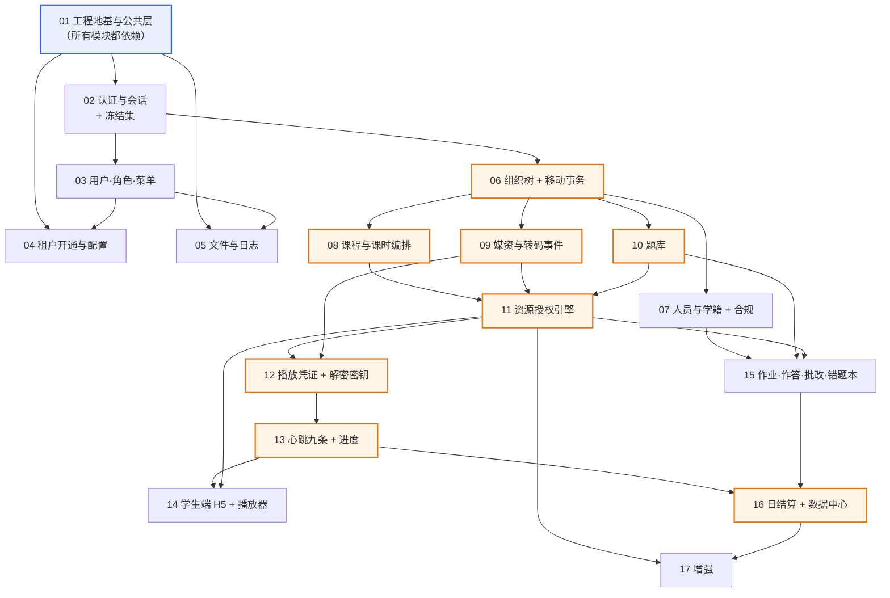

# EduMatrix 实施计划（模块序列）

> **本文不做设计决策。** 表名、字段、枚举、路由、错误码一律引用已冻结文档；文档未定案的一律进 §E 待决项，不自行发明。
>
> **文档权威顺序**：`DESIGN-CONTRACT.md` > `03-API接口文档/` 六分册 > `01-PRD-产品需求文档.md` > `02-数据库设计.md` + `backend/src/main/resources/db/migration/V202608120000__baseline.sql`。
> `docs/00-原始需求.md` 是客户输入基线，**只读、不引用为设计依据**。
>
> **执行方式**：一个开发者，按 01 → 17 顺序逐个模块做完再做下一个。没有并行、没有分期，**全部接口都在这条序列里**——没有任何一个接口游离在 17 个模块之外（总数以 `00-通用约定` §10 为准，本文不复述）。

---

## ⚠️ 开工前的头号未知项：R1a 微信内置浏览器可行性

**先做这一项，在写第 01 行代码之前。**

它是整份计划里**唯一能推翻已定案架构**的一项：微信内置浏览器（X5/XWEB）上，AES-128 加密 HLS + hls.js + 跑马灯水印 + 禁止向前拖拽，这四件事能不能**同时**成立。任何一件不成立，契约 §1 的加密选型就要回到阿里云私有加密 + 阿里云播放器 SDK——模块 12 的解密密钥接口、模块 14 的 DPlayer 二开整体重做。

**它不依赖任何前置**：不依赖后端、不依赖阿里云账号、不依赖 ICP 备案。ffmpeg 自切一段加密 HLS + 二十行 mock 密钥端点，扔任意一台已备案的 HTTPS 静态站即可跑完。

**越晚做越贵**：模块 12 与 14 写完再撞车，付出的是删代码，不是改计划。

**怎么做见 §D 的 R1a**（四问、依赖、撞车后的影响面）。

---

## ✅ F-1 已解决（数据部分）：菜单与角色绑定已落地

**当初为什么必须先解决它**——这段推演保留在此，因为它是一次真实故障的还原，不是流程说辞：

> 读到一个没有菜单绑定的角色，`perms` 依然是空数组，**后果与零权限完全相同**：前端按钮全隐、后端 `@SaCheckPermission` 全部 403。契约 §2.9 花大篇幅解决的那个"系统开箱即不可用"，会以另一种形态原样重现。而它是个**不报错的故障**——接口返回 200、字段齐全，只是数组为空（03-01 §1.5）。

**现在去哪找**：

| 内容 | 位置 |
| --- | --- |
| 菜单与角色绑定数据 | `backend/src/main/resources/db/migration/V202608140000__init_menu_and_role_menu.sql`（Flyway 增量，基线未动） |
| `perms` 命名规范 | `DESIGN-CONTRACT.md` §3.1（格式 / 八个前缀 / 动作词表穷举 / 禁用同义写法） |
| 菜单树权威表 | `DESIGN-CONTRACT.md` §10 附表 A（与上述 SQL 同源生成） |

**还剩什么**：F-1 的**数据**问题已解决，**三件产品决策仍待拍板**——按钮粒度、`student` 的绑定是否需要、`teacher` 的 B3（依赖 F-6）。**这三件不阻塞模块 03 开工**，改的是数据不是代码。详见 §E 的 F-1。

---

## §A 模块索引

| # | 模块 | 前置 | 一句话交付物 |
| --- | --- | --- | --- |
| **01** | 工程地基与公共层 | — | 41 表 Flyway 基线 + 租户插件 + 数据权限入口 + 统一响应/ID/时间/traceId，**全系统只写这一次** |
| **02** | 认证与会话 + 冻结集鉴权 | 01 | 四类角色能登录，停用一个管理员分支对已在线的人**立即**生效 |
| **03** | 用户 · 角色 · 菜单 | 01, 02 | `/auth/me` 返回非空 `roles` / `perms`（初始化数据已就位，见 F-1） |
| **04** | 租户开通与租户配置 | 01, 03 | 平台超管能开机构，三步同事务；两个租户配置键可读可改 |
| **05** | 文件与日志 | 01, 03 | 私有桶 + 时效签名 URL + 三重类型校验；登录/操作日志可查 |
| **06** | 组织树查询与节点移动事务 | 01, 02 | 树能查、能改名、能停用；**移动节点是全系统唯一改树入口**，`ancestors` 同事务重算 |
| **07** | 人员与学籍 + K12 合规 | 06 | 建管理员/教师/学生，分配导师、转交、调岗、退课、归档、脱敏 |
| **08** | 课程与课时编排 | 06 | 课程—章节—课时三级结构可编排，图文课时可用 |
| **09** | 媒资与转码事件消费 | 06 | 视频直传上云，`FileUploadComplete` / `TranscodeComplete` 经 XXL-Job 拉队列消费 |
| **10** | 题库 | 06 | 六题型 + 版本快照；**三类受管资源就此齐全** |
| **11** | 资源授权引擎 | 08, 09, 10 | `org_resource_grant` 逐级下发、级联撤销、有效期截断，**`resource_type` 1/2/3 一次做全** |
| **12** | 播放凭证与解密密钥 | 09, 11 | 两条逐条相同的校验链；密钥接口才是真正的鉴权闸口 |
| **13** | 心跳九条与进度 | 12 | 防刷九条全实现，Redis 缓冲 60s 批量落盘，落盘时判完播 |
| **14** | 学生端 H5 与播放器二开 | 11, 12, 13 | 学生在微信里打开加密视频：禁快进、跑马灯水印、静默心跳 |
| **15** | 作业发布 · 作答 · 批改 · 错题本 | 07, 10, 11 | 发布固化版本、预建答卷、自动判卷、批改流水线、动态错题本 |
| **16** | 日结算与数据中心 | 13, 15 | `stat_student_daily` 双快照上卷；**全部指标列都有真值，无恒 0 列** |
| **17** | 增强 | 11, 16 | 权限模板、标签、Excel 导入、报表导出、大屏进阶 |

**接口分配核对**：03-01 共 36（02:6 + 03:16 + 04:9 + 05:5）｜03-02 共 51（06:6 + 07:20 + 11:6 + 17:19）｜03-03 共 34（08:21 + 09:5 + 12:2 + 13:3 + 14:3）｜03-04 共 31（10:12 + 15:19）｜03-05 共 8（16:5 + 17:3）。五个分册相加 **160**。

> **本行是核对，不是声明。** 接口总数的权威在 `00-通用约定` §10，本行的作用是验证"17 个模块的接口分配之和 = 那个总数"，即没有接口无人认领、也没有模块认领了不存在的接口。**两侧不一致时，改的是本行，不是 §10。**
>
> 此前本行写「合计 159」并声称"与 §10 声明一致"——F-2 把总数从 159 改到 160 后，§10 与 `README.md` 都跟上了，本行没有，那句"一致"就成了假的。这类复述型数字是 C5 管不到的：C5 比对的是目录表 / 正文 / README 三处，本文档不在其中，也不该在——**04 对接口总数没有权威，它只是引用者**。因此文首（§0 执行方式）那处纯叙述性的复述已删除，全文只保留本行一个数字，且明确标注它是被核对方。

### 两处顺序调整及理由

| 调整 | 理由（可核对） |
| --- | --- |
| **题库（10）排在资源授权（11）之前** | 03-04 §0.1 规定题目可见性判定为「我的节点是该题的 `owner_node_id`，或该题已被显式授权给我的节点」。题目实体不存在时，授权引擎的 `resource_type=2` 只能写成空实现或 TODO。先做题库，11 就能把 1/2/3 三类一次做全 |
| **数据中心（16）排在作业（15）之后** | 03-05 §2.3(5) 的 `is_active` 完整口径是「`watch_seconds > 0` **或** 当日有提交答卷行为（`ontime_submit_count + late_submit_count > 0`）」；`ontime_submit_rate` 的分子分母全部来自 `hw_answer_sheet` / `hw_homework_target`。作业先做完，结算任务一次算全，`stat_*` 三表不出现恒 0 列 |

---

## §B 逐模块明细

### 01 工程地基与公共层

| 项 | 内容 |
| --- | --- |
| **前置** | 无 |
| **涉及表** | **写**：全部 41 张（本模块只建表，**不新增任何业务数据**）。`sys_10 + org_10 + crs_4 + vod_4 + qb_3 + hw_6 + stat_4`（契约 §9.1）。<br>注意基线脚本**自带**四个内置角色与一套示例租户/管理员/教师/学生的 `INSERT`——它们是基线内容的一部分，模块 01 不改也不删（契约 §7.3）；其中示例数据会随迁移进入生产库，见 §E 的 **F-16** |
| **涉及接口** | 无 |

**必读文档**

| 文档 | 读它为了什么 |
| --- | --- |
| `DESIGN-CONTRACT.md` §2.2 通用字段 | 逻辑删除是**毫秒时间戳**不是 0/1 标志；唯一索引末尾统一追加 `deleted_at` |
| `DESIGN-CONTRACT.md` §2.9 平台级行 | `TenantLineHandler` 只对 `sys_role` / `sys_role_menu` 放行 `tenant_id = 0`，其余 5 张表加 `org_node` 严格过滤 |
| `DESIGN-CONTRACT.md` §2.8 无会话上下文的写入 | 三类无会话写入的统一规则；`TenantHelper` 用完必须 `clear()` |
| `DESIGN-CONTRACT.md` §2.4 数据权限选路表 | `FIND_IN_SET` 是语义定义**不是执行写法**，三条执行路径各自命中哪个索引 |
| `02-数据库设计.md` §3.1.2 子树查询的三条路径 | 前缀 LIKE 的 SQL 模板与**空串分支不可省**的推导 |
| `02-数据库设计.md` §3.2 数据权限的实际 SQL 过滤 | 拦截器统一注入的过滤片段长什么样 |
| `00-通用约定.md` §3 / §4 / §5 / §6 | 响应体、分页、ID 字符串化、时间与时区四条硬约定 |
| `00-通用约定.md` §9 错误码总表 | 全部错误码落成枚举类，与登记册逐码一致 |
| `DESIGN-CONTRACT.md` §7.1 可观测性 | `traceId` 贯穿链路、响应头 `X-Trace-Id` 回传；10 项指标的埋点位置 |
| `DESIGN-CONTRACT.md` §7.3 数据库变更管理 | 基线文件此后不再改动，一切走增量脚本 |

**必须落地的规则**

1. 基线文件即 `backend/src/main/resources/db/migration/V202608120000__baseline.sql`（由原 `docs/sql/edumatrix_ddl.sql` 原样改名迁入，**迁移动作本身就属于本模块**，见 `05-工程结构.md` §B），**一次性建全 41 张表**（契约 §7.3）。做到第 15 个模块才写作业代码，但 9 张 `qb_` / `hw_` 表从第 1 天就在库里——**不要因为暂时用不到就删表或拆基线**，此后变更一律走增量脚本，基线文件不再改动。
2. `vod_heartbeat_log` 按月 RANGE 分区随基线建出，含 `pmax`（DDL 尾部分区定义）。
3. 逻辑删除：`@TableLogic(value="0", delval="UNIX_TIMESTAMP(NOW(3))*1000")`（契约 §2.2）。核心业务数据禁止物理删除。
4. 租户插件放行逻辑**写在 `TenantLineHandler` 的表达式构造里**，返回 `tenant_id = ? OR tenant_id = 0` 而非单等式（契约 §2.9）。
5. `sys_menu` 与 `sys_tenant` 不带 `tenant_id`，**不进插件**（契约 §2.9）。
6. 超管的跨租户访问靠**租户插件对超管整体放行**，与第 4 条是两条不同通道，不得混用（契约 §2.9）。
7. 数据权限过滤只有一条规则——你能看到的数据 = 你所在节点的子树（契约 §2.4）。按选路表实现三条路径：教师退化为 `parent_id` 直查、管理员走 `ancestors` 前缀 LIKE、逐层浏览走 `parent_id`。**前缀计算的空串分支不可省**（契约 §2.4 选路表）。
8. 解析 `ancestors` 时**跳过首位哨兵 `0`**；按 `IN` 查名称时返回行数比 id 数少 1 是正确行为（契约 §2.9）。
9. 无会话上下文模板：事件消费 / 定时任务 / 异步 Worker 三类入口统一用「从数据显式取 `tenant_id` → `TenantHelper.setTenantId()` → 处理 → `clear()`」，跨租户任务按租户分片，**无法确定租户一律拒绝并告警**（契约 §2.8 规则 1/2/3）。
10. 所有 bigint ID 序列化为字符串；请求侧一律以字符串接收（`00-通用约定` §5）。
11. 时间统一 `yyyy-MM-dd HH:mm:ss`、纯日期 `yyyy-MM-dd`、时长以秒为整数；服务器、数据库、接口三层都在东八区（`00-通用约定` §6）。
12. 统一响应体 `{code, msg, data}`；分页 `data` 固定 `{total, list}`，允许附加可选 `summary`，除三者外不得有同级字段（`00-通用约定` §3 / §4.2）。
13. 业务错误统一 HTTP 200，框架层错误 HTTP 码与 `code` 一致（`00-通用约定` §3.3）。
14. `traceId` 32 位 hex，经 MDC 贯穿日志、异步线程池、XXL-Job；响应头 `X-Trace-Id` 原样回传（契约 §7.1）。
15. 慢查询阈值 200ms，`FIND_IN_SET` 出现在慢查询日志中即视为缺陷并单独告警（契约 §7.1）。
16. 越权拒绝三分法落成公共异常：路径上的资源越界 → 404；请求体/参数中显式指定的目标越界 → `10107`；功能权限不足 → 403（契约 §2.4 / `00-通用约定` §2.4）。
17. 数据权限过滤条件为空集时记 `ERROR` 日志——那意味着过滤逻辑写漏了，正在返回全量数据（契约 §7.1 日志分级）。

**对外产出（后续模块一律调用，不得自写）**

| 产出 | 形态 |
| --- | --- |
| 租户过滤 | `TenantLineHandler` 实现类（含 `tenant_id = 0` 放行表清单）；业务代码**任何地方不得出现手写的 `OR tenant_id = 0`** |
| 无会话租户上下文 | `TenantHelper.setTenantId(Long)` / `TenantHelper.clear()`，配一个 `runWithTenant(tenantId, Runnable)` 包装器保证 `clear()` 一定执行 |
| 数据权限 | `SubtreeScopeHelper.subtreeNodeIds(myNodeId)` 返回子树节点 ID 集合（按选路表实现，内部区分教师/管理员两条路径）；`SubtreeScopeHelper.assertInSubtree(targetNodeId)` 越界时按三分法抛对应异常 |
| 祖先链缓存 | Redis `node:anc:{nodeId}` → STRING，值为该节点 `ancestors`（契约 §2.3）。读写封装为 `NodeAncestorCache.get(nodeId)` / `evictSubtree(nodeId)` |
| 统一响应 | `R<T>` + 全局异常处理器；`R.ok(data)` / `R.fail(ErrorCode)` |
| 错误码 | `ErrorCode` 枚举，逐码对应 `00-通用约定` §9 登记册 |
| ID | 雪花 `IdWorker.nextId()`；Jackson 全局 `Long → String` 序列化器 |
| 分页 | `PageResult<T>{total, list}`；`pageSize` 上限 100 强制生效 |
| 幂等 | `@Idempotent` 注解 + Redis key `idem:{userId}:{requestId}`，TTL 5 分钟（`00-通用约定` §7.2） |
| 链路 | `TraceIdFilter` + MDC；异步线程池与 XXL-Job 的 traceId 继承包装 |
| 指标 | `MetricsRegistry` 常量类，登记契约 §7.1 的 10 项指标名 |

**禁止事项**

- 不自造表名、字段名、枚举值、接口路径、错误码——一律引用已冻结文档。
- 不重写公共层：本模块是公共层本身，后续模块需要上述能力时**调用这里的类**。
- 不改已交付模块。
- **本模块特有**：不得为了"暂时用不到"而从基线里删除 `qb_` / `hw_` 九张表；不得在业务代码里逐处手写租户放行条件（契约 §2.9 明令）；不得把 `ancestors` 写进 JWT（它随节点移动而变，写进去就固化成发证时刻的快照，契约 §2.3）。

**做完什么算做完**

- 空库执行基线脚本 → 41 张表建出，`vod_heartbeat_log` 分区就位（契约 §9.1 表总数）。
- 任一接口响应满足 `00-通用约定` §3 / §5 / §6；响应头带 `X-Trace-Id`。
- 自检：`SELECT COUNT(*) FROM information_schema.tables WHERE table_schema=...` 得 41；全局 grep 业务代码，`OR tenant_id = 0` 命中数为 0；`FIND_IN_SET` 在业务 Mapper 中命中数为 0。

---

### 02 认证与会话 + 冻结集鉴权

| 项 | 内容 |
| --- | --- |
| **前置** | 01（提供统一响应、错误码、`NodeAncestorCache`、租户插件） |
| **涉及表** | **写**：`sys_login_log`、`sys_user`（`last_login_time` / `pwd_reset_flag`）｜**只读**：`org_node`、`sys_tenant`、`org_student`、`sys_role`、`sys_role_menu`、`sys_menu`、`sys_user_role` |

**涉及接口（03-01，6 个）**

| 编号 | 名称 | 方法 | 路径 |
| --- | --- | --- | --- |
| §1.1 | 获取图形验证码 | GET | `/api/v1/auth/captcha` |
| §1.2 | 登录 | POST | `/api/v1/auth/login` |
| §1.3 | 刷新令牌 | POST | `/api/v1/auth/refresh` |
| §1.4 | 登出 | POST | `/api/v1/auth/logout` |
| §1.5 | 获取当前用户信息 | GET | `/api/v1/auth/me` |
| §1.6 | 修改密码（本人） | PUT | `/api/v1/auth/password` |

**必读文档**

| 文档 | 读它为了什么 |
| --- | --- |
| `DESIGN-CONTRACT.md` §2.3「停用语义」与「定案：鉴权拦截器校验冻结集」 | 停用按节点类型区分；登录两段校验；冻结集为什么不是用户集 |
| `03-01 §1.2` 登录 | 登录校验的完整判定顺序与各自错误码 |
| `03-01 §1.5` 获取当前用户信息 | `roles` / `perms` / `nodePath` 的组装口径 |
| `00-通用约定.md` §2.1 / §2.2 Token 机制与生命周期 | 双 Token 有效期、refreshToken 旋转（一次性使用） |
| `00-通用约定.md` §2.3 认证白名单 | 免登录接口只有四条，其中 `GET /api/v1/vod/decrypt-key` 由模块 12 实现 |
| `00-通用约定.md` §8 限流约定 | 登录与验证码的 IP 限流、连续密码错误锁定 |
| `PRD` §7.3 安全条款 1/2 | BCrypt cost ≥ 10、弱密码策略、登出即时失效 |

**必须落地的规则**

1. **登录停用校验分两段，缺一不可**（契约 §2.3）：① 本人所在节点 `status=1` 即拒登（教师/学生的"仅本人"停用由此生效）；② 拆 `ancestors` 主键 `IN` 查询，命中 `node_type=1 且 status=1` 的祖先即拒登（管理员的分支冻结由此生效）。两段任一命中返回 `10017`。
2. **只写 `org_node.status` 一行，绝不同步写 `sys_user.status`**（契约 §2.3）。后者是与组织无关的账号级封禁、仅超管可置。停用与启用天然对称可逆，正因为写的是同一字段的两个方向。
3. **冻结集鉴权**（契约 §2.3）：Redis `frozen:{tenantId}` SET 存该租户当前被停用的节点 id；每请求取 `node:anc:{myNodeId}` 拆出祖先链与冻结集求交，命中即拒并返回 `10017`。
4. 顺序约束两条，方向都朝"宁可多拦一瞬"（契约 §2.3）：停用**先 `SADD` 再提交事务**；启用**先提交事务再 `SREM`**。
5. **Redis 不可用时鉴权降级为查库**（拆 `ancestors` 主键 `IN`，约 5 行点查），**不得跳过校验**——这是安全校验不是缓存加速（契约 §2.3）。
6. 租户到期或停用 → `10007`；账号级封禁或锁定 → `10005`；学籍已归档 → `10015`；节点或其上级停用 → `10017`。四者提示语不同，不得合并（`00-通用约定` §9.2）。
7. refreshToken **旋转**：每次刷新下发新的，旧的立即失效；失效或过期返回 `10006`（`00-通用约定` §2.2 规则 3/4）。
8. `pwd_reset_flag=1` 时强制改密，未改密前不得访问其他页面（PRD F1-1 规则 6）。
9. 登录失败连续 5 次锁定 15 分钟，返回 `10005` 并在 `msg` 提示剩余时间（`00-通用约定` §8）。
10. 登录成功与失败**都**写 `sys_login_log`（PRD F1-1 验收标准要求失败也留痕）。
11. `/auth/me` 的 `roles` / `perms` 依赖 `sys_user_role → sys_role → sys_role_menu → sys_menu` 链路；该链路的初始化数据已由 `backend/src/main/resources/db/migration/V202608140000__init_menu_and_role_menu.sql` 提供（四角色 perms 计数 **`org_admin 94 / teacher 61 / super_admin 31 / student 0`**，见 §E 的 F-1）。
    > **本行数字于模块 02 按迁移后实测值订正**（原写 `93 / 61 / 31 / 2`）。两处差异都源自本文档 §E 内部的后续定案，属同一份文档的前后不一致，非权威冲突：**`student 0`** 依据 F-1 定案②「`student` 不绑任何菜单行……`sys_role_menu` 中 `student` 的 2 条绑定已删除（201 → 200 行）」，库中正为 200 行；**`org_admin 94`** 依据 F-2 定案「菜单 A14 的 `visible` 由 0 改 1 并绑 `org_admin`」，即 93 + 1。
    >
    > **`student` 的 `perms` 为空数组是设计意图，不是租户插件失效。**两者的外部表现相同（接口 200、字段齐全、数组为空），区分方法：看 `roles` —— 其中有 `student` 这一行即说明 `tenant_id = 0` 的平台级放行生效。该区分已写成断言（`AuthMeIT.studentHasRolesButNoPerms`）。

**对外产出**

| 产出 | 形态 |
| --- | --- |
| 冻结集 | Redis `frozen:{tenantId}` → SET；封装 `FrozenNodeCache.add(tenantId, nodeId)` / `remove(...)` / `isFrozen(tenantId, ancestorIds)`，含 Redis 不可用时的查库降级分支 |
| 会话上下文 | 登录时把 `userId` / `userType` / `nodeId` / `tenantId` 放进 Sa-Token Session；`LoginHelper.getNodeId()` 等取值方法。**`ancestors` 不进 Token**（契约 §2.3） |
| 鉴权拦截器 | 每请求执行冻结集校验，模块 03 之后的所有接口自动受保护 |

**禁止事项**

- 通用三条（不自造命名 / 不重写公共层 / 不改已交付模块）。
- 需要租户上下文、数据权限、统一响应、ID 序列化时**调用 01 的公共类，不要自己写一份**。
- **本模块特有**：不得为"让停用立刻生效"而遍历子树逐个 `StpUtil.logout()`——那又回到"为 1.1 万人写 2.2 万次"的形态（契约 §2.3 方案对照表）；不得把 `ancestors` 写进 JWT；不得在停用时顺手改 `sys_user.status`。

**做完什么算做完**

- PRD F1-1 验收标准 · Given 机构 `expire_time` 为 `2026-08-11 23:59:59`，When 该机构任一账号在 `2026-08-12 09:00:00` 登录，Then 返回 `10007` 且 `sys_login_log` 记录失败状态。
- PRD F1-1 验收标准 · Given 机构管理员用初始密码首次登录，Then 强制进入修改密码页。
- PRD F1-2 验收标准 · Given **管理员**节点 N 被停用，When 其子树内学生登录，Then 被拒；When **教师**节点 T 被停用，其名下学员登录，Then 成功。
- 自检：停用一个管理员节点后，其子树内**已持有有效 accessToken** 的账号下一次请求即返回 `10017`（不等 2 小时）；断开 Redis 后该校验仍生效（走查库降级）。

---

### 03 用户 · 角色 · 菜单

| 项 | 内容 |
| --- | --- |
| **前置** | 01、02（提供登录态与 `perms` 的消费方） |
| **涉及表** | **写**：`sys_user`、`sys_role`、`sys_user_role`、`sys_menu`、`sys_role_menu`、**`org_node`**、**`org_node_change_log`**｜**只读**：**`sys_tenant`**<br>**订正说明**：本行原写「只读 `org_node`」，与 03-01 分册不符。§2.2 的副作用是「**同一事务内**创建 `org_node` 节点并回写 `sys_user.node_id`，同时记录一条 `org_node_change_log`（`change_type=1` 建档）」，§2.4 要求「同时**逻辑删除**其 `org_node` 节点」——两处都是**写**；§2.2「创建学生账号受租户 `max_student_count` 限制」则需只读 `sys_tenant`。<br>**`org_node_change_log` 只有 §2.2 一处写入**：§2.4 的原文只有节点逻辑删除与作废 Token，而 03-02 分册的三个删除人员接口同样不写轨迹——**不要在删除路径上补一条** |

**涉及接口（03-01，16 个）**

| 编号 | 名称 | 方法 | 路径 |
| --- | --- | --- | --- |
| §2.1 | 分页查询用户 | GET | `/api/v1/system/users` |
| §2.2 | 创建用户 | POST | `/api/v1/system/users` |
| §2.3 | 修改用户 | PUT | `/api/v1/system/users/{id}` |
| §2.4 | 删除用户（逻辑删除） | DELETE | `/api/v1/system/users/{id}` |
| §2.5 | 重置用户密码 | PUT | `/api/v1/system/users/{id}/password/reset` |
| §2.6 | 启用/停用用户 | PUT | `/api/v1/system/users/{id}/status` |
| §3.1 | 分页查询角色 | GET | `/api/v1/system/roles` |
| §3.2 | 查询角色详情 | GET | `/api/v1/system/roles/{id}` |
| §3.3 | 创建角色 | POST | `/api/v1/system/roles` |
| §3.4 | 修改角色 | PUT | `/api/v1/system/roles/{id}` |
| §3.5 | 删除角色（逻辑删除） | DELETE | `/api/v1/system/roles/{id}` |
| §3.6 | 为角色分配菜单 | PUT | `/api/v1/system/roles/{id}/menus` |
| §4.1 | 查询菜单树 | GET | `/api/v1/system/menus/tree` |
| §4.2 | 创建菜单 | POST | `/api/v1/system/menus` |
| §4.3 | 修改菜单 | PUT | `/api/v1/system/menus/{id}` |
| §4.4 | 删除菜单（逻辑删除） | DELETE | `/api/v1/system/menus/{id}` |

**必读文档**

| 文档 | 读它为了什么 |
| --- | --- |
| `DESIGN-CONTRACT.md` §2.9 末段「放宽的只是读，写侧必须反向收紧」 | 四个内置角色对 `org_admin` **全只读**，只有 `super_admin` 可改、任何人不可删 |
| `DESIGN-CONTRACT.md` 第 3 节 角色与操作权限 | 四个角色穷举；机构管理员与下级管理员**角色相同**，差别只在树的位置 |
| `03-01 §3` 导语与 §3.4 / §3.5 / §3.6 | 预置角色的只读约束在三个写接口上分别怎么落 |
| **`03-01 §2` 导语**（逐字读） | **本组写接口 2.2~2.6 一律仅 `super_admin`**，只有 2.1 保留 `org_admin`；以及「为什么必须收敛成一条路径」的三条理由（建人/删人/停用） |
| `03-01 §2.6` 启用/停用用户 | 该接口已收敛为**超管专用**（契约 §2.3） |
| `00-通用约定.md` §9.2 | 本模块相关业务错误码**共 10 个**：`10001` / `10008` / `10009` / `10012` / `10104` / `10105` / `10106` / `10107` / `10108` / `10207`。<br>**订正说明**：本行原只列前四个。逐接口对照 03-01 的「相关业务错误码」表：§2.2 六个（`10001` `10207` `10104` `10105` `10106` `10107`）、§2.3 一个（`10012`）、§2.4 两个（`10012` `10108`）、§2.6 一个（`10012`）、§3.5 一个（`10008`）、§4.4 一个（`10009`）；§2.1/§2.5/§3.1~§3.4/§3.6/§4.1~§4.3 无业务码（预置角色受限、`roleName`/`roleKey`/`perms` 重复、越权菜单一律 **400**） |

**必须落地的规则**

1. `sys_role` / `sys_role_menu` 的 `tenant_id = 0` 行是**全平台共用的同一行**，对 `org_admin` 全只读：改名称、改状态、改菜单绑定一律拒绝，任何人不可删（契约 §2.9）。
2. **`/api/v1/system/users` 的五个写接口（§2.2 创建 / §2.3 修改 / §2.4 删除 / §2.5 重置密码 / §2.6 启停用）一律仅 `super_admin` 可调**；只有 §2.1 分页查询保留 `org_admin`。菜单管理的 §4.2 / §4.3 / §4.4 同样仅 `super_admin`（平台级维护接口，org_admin 及以下 403）。
   **订正说明**：本条原只写了「`PUT /users/{id}/status` 仅超管可调」，漏了 §2.2~§2.5 四条。三方证据一致、本条落单：① 03-01 §2 导语明写「本组的写接口（2.2~2.6）**一律仅 `super_admin` 可调**，用途限定为平台级账号维护……机构侧人员的建、改、删、重置密码、启停用**一律走 02-组织机构分册的 `/api/v1/org/**`**」；② §2.2~§2.6 的「允许角色」栏逐条写着「**仅 `super_admin`**」；③ 菜单初始化脚本 `V202608140000` 里 `system:user:add/edit/remove/resetPwd/status` 与 `system:menu:add/edit/remove` **只绑了 `super_admin`**。
   **为什么这条不能弄错**：§2 导语给了理由——本组的创建**不写 `org_teacher` / `org_student` 档案**，机构侧经此路径建人会产生 PRD F1-3 规则 1 明令禁止的**孤儿数据**（有节点无档案，在 `/org/teachers` 列表里查不到、无工号无科目）。把 `org_admin` 放进来，等于给机构侧开了一条造孤儿数据的路。
   而 §2.6 那一条的单独理由仍然成立：机构侧改不了 `sys_user.status`，这正是不允许停用节点时顺手写它的原因。
   **落地形态**：收敛**不靠代码里的 `if`**，靠 `sys_role_menu` 的初始化数据——权限的真相只有一份，代码里再写一份就有了两份，而两份迟早会分叉（本条冲突正是这个形态）。回归测试见 `SystemUserWriteScopeIT`。
3. 角色数据权限口径：`org_admin` 可见「本租户自建角色 + 平台预置角色」（03-01 §3.1）。
4. 不允许对当前登录账号执行删除、停用、降权 → `10012`（PRD F1-3 规则 9）。
5. 角色被用户引用时不可删 → `10008`；菜单存在子节点或被角色引用时不可删 → `10009`（`00-通用约定` §9.2）。
6. 用户名全局唯一 → `10001`。删除走逻辑删除，`uk_username(username, deleted_at)` 自动放行同名重建（契约 §2.2）。
7. **任何层级的管理员 `role_key` 一律 `org_admin`**，菜单/按钮权限完全一致；层级差异只体现在数据范围（契约 §3、PRD F1-3 规则 7）。

**对外产出**

| 产出 | 形态 |
| --- | --- |
| 权限校验 | `@SaCheckPermission("system:user:list")` 形态的注解可用；`perms` 从 `sys_menu.perms` 装配 |
| 菜单初始化脚本 | 已落成 `backend/src/main/resources/db/migration/V202608140000__init_menu_and_role_menu.sql`（124 行菜单 + 201 行角色绑定）。**此后追加菜单同样走增量脚本，不改基线文件**（契约 §7.3） |

**禁止事项**

- 通用三条。
- 需要租户上下文/数据权限/统一响应/ID 序列化时调用 01 的公共类，不要自己写一份。
- **本模块特有**：不得给 `org_admin` 开放预置角色的任何写入口；不得把菜单初始化数据写进 `V202608120000__baseline.sql`（基线已冻结，走增量脚本）。

**做完什么算做完**

- **契约 §3 / PRD F1-3 规则 7**：两个**不同层级**的 `org_admin`（机构最高管理员与下级管理员）调 `/auth/me`，`role_key` 相同、`perms` **逐条相同**，差异只体现在 `nodeId`。
  **订正说明**：本条原写的是 PRD F1-3 那条完整验收标准（「乙创建丙，丙的 role_key 与乙相同、菜单权限一致，且丙的子树严格包含于乙的子树」），**与模块 07 的完成判据第一条「PRD F1-3 全部 5 条验收标准」重复**，且本模块跑不出它：F1-3 的 5 条逐条都是 `/org/**` 的语义（三写一事务、`org_teacher.student_count` +1、`guardianConsent`、`10013` 时事务回滚），而按 03-01 §2 导语，建人走 `/org/**`，本模块的 §2.2 是超管专用且不写档案表——用它建人正是被禁的那条路。参数名也对不上（PRD/03-02 用 `initPassword` 明文返回一次，03-01 §2.2 用 `password` 调用方指定不回显），**说明这两条路本来就不是同一件事**。
  该判据**整体归模块 07**；本模块承担的是其中属于 RBAC 的那半句（角色固定不分层），它不需要建人就能验。
- 自检：租户 A 的机构管理员调 `/auth/me`，`roles` 与 `perms` **均非空**；同一账号尝试修改预置 `teacher` 角色的菜单绑定被拒；租户 A 列不出租户 B 的自建角色。
- **写侧收紧三件套**：`org_admin` 对预置角色的改名称 / 改状态 / 改菜单绑定分别被拒（**400**）；`super_admin` 改得动；**任何人删不掉**（含超管）。
- **§3.6 防提权**：`org_admin` 给自建角色分配一个自己没有的菜单 → 被拒（400）；§3.3 建角色时塞越权菜单同样被拒（它等价于建后调 §3.6）。
- **§2.2~§2.6 五个写接口对 `org_admin` 全部 403**（规则 2 的回归测试）。
- **同名重建**：创建用户 U → 逻辑删除 → 再创建同名 U 成功（`uk_username(username, deleted_at)` 自动放行）。
- **§2.4 子节点保护**：删除一个仍有未删除子节点的用户 → `10108`，账号与节点均未被改动。
- **§2.2 副作用**：同事务落 `org_node` + `org_node_change_log`（`change_type=1`、`from_parent_id` 为 NULL），`node_type` 与 `userType` **恒等**，父节点 `child_count` +1。

---

### 04 租户开通与租户配置

| 项 | 内容 |
| --- | --- |
| **前置** | 01、03 |
| **涉及表** | **写**：`sys_tenant`、`sys_tenant_config`、`org_node`、`sys_user`、`sys_user_role`｜**只读**：`org_student`（在读学生数上限校验） |

**涉及接口（03-01，9 个）**

| 编号 | 名称 | 方法 | 路径 |
| --- | --- | --- | --- |
| §5.1 | 分页查询租户 | GET | `/api/v1/system/tenants` |
| §5.2 | 查询租户详情 | GET | `/api/v1/system/tenants/{id}` |
| §5.3 | 创建租户（开通机构） | POST | `/api/v1/system/tenants` |
| §5.4 | 修改租户 | PUT | `/api/v1/system/tenants/{id}` |
| §5.5 | 删除租户（逻辑删除） | DELETE | `/api/v1/system/tenants/{id}` |
| §5.6 | 租户续期 | PUT | `/api/v1/system/tenants/{id}/renew` |
| §5.7 | 启用/停用租户 | PUT | `/api/v1/system/tenants/{id}/status` |
| §6.1 | 查询租户配置列表 | GET | `/api/v1/system/tenant-configs` |
| §6.2 | 修改租户配置 | PUT | `/api/v1/system/tenant-configs/{configKey}` |

**必读文档**

| 文档 | 读它为了什么 |
| --- | --- |
| `DESIGN-CONTRACT.md` §2.1 多租户与树根 | 开通租户的**循环依赖**与固定的三步落库顺序 |
| `03-01 §5.0` 租户与组织树根节点的对应关系 | 机构根节点 id = `tenant_id` = `sys_tenant.root_node_id` |
| `DESIGN-CONTRACT.md` §5 末「租户配置键白名单」 | 只有两个合法键及各自默认值与取值范围 |
| `PRD` F1-1 机构开通与生命周期 | 到期、停用、学生规模上限三条业务规则 |

**必须落地的规则**

1. **三步同一事务**（契约 §2.1）：插租户行（`root_node_id` 暂空）→ 插机构根节点 → 回写 `root_node_id`。`sys_tenant.root_node_id` 必须允许 NULL，否则这个循环依赖解不开。
2. 机构根节点 `node_type=1`、`parent_id=0`、其 id 即该租户的 `tenant_id`；与初始管理员 `sys_user.node_id` 互为反向引用（PRD F1-1 规则 2）。
3. 初始密码系统生成，`pwd_reset_flag=1`，明文**仅在创建响应中返回一次**、不落库不可再查（PRD F1-1 规则 6、F1-3 规则 3）。
4. 机构根节点**不可删除、不可移动、不可停用**（PRD F1-1 规则 7）；停用机构走 `sys_tenant.status`。
5. 在读学生数（`org_student.status=0`）达 `max_student_count` 时新增/导入被拒 → `10207`（PRD F1-1 规则 5）。
6. 配置键不在白名单 → `10016`（`00-通用约定` §9.2）。两个合法键：`complete_rate_threshold`（int，默认 90，范围 60~100）、`watermark_phone_mask`（int，默认 1）。
7. **云厂商选择属平台部署级参数，不是租户配置键**（契约 §5 末）——不得为它加键。存放位置见 §E 的 F-5。

**对外产出**

| 产出 | 形态 |
| --- | --- |
| 租户配置读取 | `TenantConfigHelper.getInt(key)`，读不到时回落平台默认值（02-数据库设计 §4 `sys_tenant_config` 说明）。模块 13 判完播、模块 12 取水印开关都走它 |

**禁止事项**

- 通用三条 + 调用 01 公共类。
- **本模块特有**：不得往租户配置键白名单里加键（白名单是穷举，契约 §5 末）；不得把 AK/SK 等部署参数塞进 `sys_tenant_config`。

**做完什么算做完**

- PRD F1-1 验收标准 · Given 平台超管创建机构成功，When 查看该机构组织树，Then 存在且仅存在一个 `node_type=1`、`parent_id=0` 的机构根节点，`sys_tenant.root_node_id` 指向它，且与初始管理员 `sys_user.node_id` 互为反向引用。
- PRD F1-1 验收标准 · Given `max_student_count=500` 且在读已 500 人，When 导入含 10 名新学生的 Excel，Then 整体拒绝（`10207`）。
- 自检：中断第 2 步后回滚，库中不留孤儿租户行。

---

### 05 文件与日志

| 项 | 内容 |
| --- | --- |
| **前置** | 01、03 |
| **涉及表** | **写**：`sys_file`、`sys_oper_log`｜**只读**：`sys_login_log` |

**涉及接口（03-01，5 个）**

| 编号 | 名称 | 方法 | 路径 |
| --- | --- | --- | --- |
| §7.1 | 上传文件 | POST | `/api/v1/system/files` |
| §7.2 | 查询文件详情 | GET | `/api/v1/system/files/{id}` |
| §7.3 | 下载文件 | GET | `/api/v1/system/files/{id}/download` |
| §8.1 | 分页查询登录日志 | GET | `/api/v1/system/logs/login` |
| §8.2 | 分页查询操作日志 | GET | `/api/v1/system/logs/oper` |

**必读文档**

| 文档 | 读它为了什么 |
| --- | --- |
| `00-通用约定.md` §7.4 文件与导出的安全基线 | 六条硬要求逐条，含 Excel 公式注入与字符白名单 |
| `03-01 §7.3` 下载文件 | 归属校验的**唯一入口**就在这里 |
| `DESIGN-CONTRACT.md` §7.2 第 5 条 | 两张日志表保留 ≥ 6 个月，且不参与删除请求的清理 |

**必须落地的规则**

1. 对象存储桶**一律私有**；任何文件访问经服务端换取**时效签名 URL（≤30 分钟）**，禁止长期公开直链；文件域名与业务域名分离（`00-通用约定` §7.4）。
2. **归属校验只在下载接口实现一次**；任何其他接口不得返回可直接访问的文件地址，否则该校验被绕过（`00-通用约定` §7.4）。
3. 上传三重校验：扩展名 + 请求 `Content-Type` + **文件头魔数**，以魔数为准且必须与扩展名一致；服务端强制重命名为 `{fileId}.{规范扩展名}`；下载统一 `Content-Disposition: attachment` + `X-Content-Type-Options: nosniff`；**SVG 不在白名单内**（`00-通用约定` §7.4）。
4. **Excel 写出防公式注入**：任何 `.xlsx` 的字符串单元格若以 `=` `+` `-` `@` `Tab` `CR` 开头，必须前置单引号或显式设为文本格式（`00-通用约定` §7.4）。这条要做成公共工具，模块 17 的导入失败报告与导出报表都用它。
5. 敏感文件（导入源文件、失败报告、导出报表）保留 **7 天**后由定时任务物理清理（`00-通用约定` §7.4）。
6. 文件类型不支持或超限 → `10011`（`00-通用约定` §9.2）。
7. 两张日志表保留 ≥ 6 个月，**不参与删除请求的清理**（契约 §7.2 第 5 条）——与模块 07 的脱敏任务边界要划清。
8. **三个文件接口不加 `@SaCheckPermission`**（契约 §3.1 边界 0，F-1② 定案）：`system:file:*` 的 `perms` 只用于管理端 A22 页面的菜单显隐，不作为接口鉴权依据。归属校验走 `00-通用约定` §7.4 的 `bizType` 校验，且**只在下载接口（03-01 §7.3）实现一次**——任何其他接口不得返回可直接访问的文件地址，否则该校验被绕过。

**对外产出**

| 产出 | 形态 |
| --- | --- |
| 文件服务 | `FileService.upload(...)` 返回 `sys_file.id`；`FileService.signedUrl(fileId)` 生成 ≤30 分钟签名 URL |
| Excel 安全写出 | `SafeExcelWriter`，字符串单元格自动做公式注入转义；`ExcelInputValidator` 拒绝以 `= + - @` 开头的文本 |
| 操作日志 | `@OperLog(module=..., action=...)` 注解，写 `sys_oper_log` |

**禁止事项**

- 通用三条 + 调用 01 公共类。
- **本模块特有**：不得在下载接口之外的任何接口返回文件直链或未签名地址；不得把 SVG 加进上传白名单；不得让脱敏任务清理两张日志表。

**做完什么算做完**

- 自检（对齐 `00-通用约定` §7.4 逐条）：改扩展名伪装的文件被魔数校验拒绝；签名 URL 超过 30 分钟后失效；构造姓名为 `=1+1` 的数据导出后，单元格内容以单引号开头、Excel 打开不执行公式；跨用户请求他人文件的下载接口被拒。

---

### 06 组织树查询与节点移动事务

| 项 | 内容 |
| --- | --- |
| **前置** | 01（`SubtreeScopeHelper` / `NodeAncestorCache`）、02（冻结集写侧） |
| **涉及表** | **写**：`org_node`、`org_node_change_log`、`sys_user`（重置密码）｜**只读**：`org_teacher`、`org_student`、`org_resource_grant`（移动时回传跨管辖清单） |

**涉及接口（03-02，6 个）**

| 引用（分册 + 目录编号 + 接口名） | 方法 | 路径 |
| --- | --- | --- |
| 03-02 接口 1 组织树查询 | GET | `/api/v1/org/nodes/tree` |
| 03-02 接口 2 节点详情 | GET | `/api/v1/org/nodes/{id}` |
| 03-02 接口 3 修改节点 | PUT | `/api/v1/org/nodes/{id}` |
| 03-02 接口 4 移动节点 | PUT | `/api/v1/org/nodes/{id}/move` |
| 03-02 接口 5 节点停用 / 启用 | PUT | `/api/v1/org/nodes/{id}/status` |
| 03-02 接口 6 重置人员密码 | PUT | `/api/v1/org/nodes/{id}/password/reset` |

**必读文档**

| 文档 | 读它为了什么 |
| --- | --- |
| `DESIGN-CONTRACT.md` §2.3 结构约束 1~5 | 承载规则、防成环、`ancestors` 同事务重算、深度上限 50 级 |
| `02-数据库设计.md` §3.1.3 移动节点的完整事务 | **7 步 SQL 模板**与加锁顺序；第 6 步为什么绝不能写成 `FIND_IN_SET` |
| `02-数据库设计.md` §3.1.4 防成环校验的具体写法 | 两个条件缺一不可；为什么必须在 `FOR UPDATE` 之后校验 |
| `02-数据库设计.md` §3.1.5 承载规则的落库校验点 | 全部会改变父子关系的入口逐一枚举，建议收敛为一个静态方法 |
| `00-通用约定.md` §7.5 组织树结构操作的并发约束 | 同一事务、行锁、校验在锁内、**非幂等不可重试** |
| `03-02 §3.4` 移动节点 | 11 条校验的**执行顺序**与各自错误码；`outOfScopeGrants` 回传 |
| `03-02 §3.5` 节点停用 / 启用 | 冻结集写侧顺序；为什么不碰 `sys_user.status` |
| `03-02 §3.1` 组织树查询 | 懒加载口径（按 `parent_id` 逐层，只返回操作人子树） |

**必须落地的规则**

1. **移动节点是全系统唯一改变树结构的入口**（03-02 §3.4）。模块 07 的分配导师、转交管理员、教师调岗都是它的语义化封装，**不得另写一套改父逻辑**。
2. 事务内按 02-数据库设计 §3.1.3 的 7 步执行：更新 `parent_id` 与自身 `ancestors` → **一条前缀替换 UPDATE 重算整棵子树** → 旧父 `child_count-1` / 新父 `+1` → 沿新旧两条祖先链维护 `student_count` → 写 `org_node_change_log`。**任一步失败整体回滚。**
3. **加锁顺序固定为 id 升序**；成环校验与父子类型校验必须在 `FOR UPDATE` 拿到锁之后执行（`00-通用约定` §7.5、02-数据库设计 §3.1.3 要求 2/3.1.4）。
4. **第 6 步维护 `student_count` 时绝不可写 `FIND_IN_SET`**——它是列上的函数、必然全表扫，而这条 UPDATE 跑在已持有 `FOR UPDATE` 锁的事务里，等于每次分配导师都把整张 `org_node` 锁一遍（02-数据库设计 §3.1.3 注释）。改为 Java 侧 `split(ancestors)` 后用 `IN`。
5. 防成环两个条件缺一不可：`targetParentId != movingNodeId` 且 `FIND_IN_SET(movingNodeId, targetParent.ancestors) = 0`。此处 `FIND_IN_SET` **无性能问题**，因为 `id = targetParentId` 已把结果集收敛到 1 行（02-数据库设计 §3.1.4）。违反 → `10103`。
6. 树深度上限 50 级，**必须在服务层校验**，超限返回 `400`——不校验的话第 51 级会在写入时 `Data too long` 让整个复合事务回滚、失败点难以定位（契约 §2.3 约束 5）。
7. **事务提交后**递归删除被移动子树的 `node:anc:*` 键（契约 §2.3、03-02 §3.4）。这是「学员被移走后原上级立即失去访问权」这句承诺的**唯一落地机制**。
8. 移动响应必须回传 `outOfScopeGrants` 清单，并支持 `revokeOutOfScopeGrants`（默认 `false`）（契约 §2.5 规则 9、03-02 §3.4）。**本模块先把字段与开关做出来**，级联回收动作在模块 11 接上。
9. 异动类型按被移动节点与目标父节点的类型自动推断：学生→教师 = `2`；学生→管理员 = `3`；教师→管理员 = `4`；管理员→管理员 = `8`（03-02 §3.4 映射表）。
10. **教师调岗只写 1 条 `change_type=4`**，随行学员不逐条写 `change_type=2`（PRD F1-4 规则 6）。
11. 停用/启用只写 `org_node.status` 一行，配合模块 02 的冻结集；停用节点不可作为新建/移动/授权目标 → `10109`（03-02 §3.5）。
12. 重置人员密码：事务内写 `sys_user.password` → 置 `pwd_reset_flag=1` → **作废该用户全部在线 Token** → 写 `sys_oper_log`（03-02 §3.6）。
13. 移动接口对客户端**不可自动重试**（`00-通用约定` §7.5）——超时后节点可能已移动成功。

**对外产出**

| 产出 | 形态 |
| --- | --- |
| 唯一改树入口 | `NodeMoveService.move(nodeId, toParentId, opts)`，返回含 `changeType` / `affectedNodeCount` / `outOfScopeGrants`。模块 07 全部改父动作调它 |
| 承载规则 | `NodeTypeRule.assertCanBeChildOf(parentType, childType)` 静态方法，所有入口共用（02-数据库设计 §3.1.5 建议） |
| 异动轨迹 | `NodeChangeLogWriter.write(nodeId, changeType, from, to, reason)`，**必须在调用方事务内** |
| 树指标 | `tree_move_depth` / `tree_move_subtree_size` 两个 Histogram 埋点（契约 §7.1） |

**禁止事项**

- 通用三条 + 调用 01 公共类。
- **本模块特有**：不得在 `NodeMoveService` 之外新增任何写 `parent_id` 的路径；不得把 `ancestors` 重算与移动拆成两个事务（契约 §9.2 铁律 1）；不得在维护冗余计数时使用 `FIND_IN_SET`；不得在锁外做成环校验。

**做完什么算做完**

- PRD F1-2 验收标准 · Given 节点 P 的子树共含 12 个后代，P 从 X 移动到 Y，When 事务提交，Then P 及全部 12 个后代的 `ancestors` 均已重算为以 Y 的 `ancestors` 为前缀；以 Y 为根做子树查询能命中全部 13 个节点。
- PRD F1-2 验收标准 · Given 节点 A 是 B 的祖先，When 把 A 移动到 B 之下，Then `10103` 且两棵子树的 `parent_id` 与 `ancestors` 一律不变。
- PRD F1-2 验收标准 · Given 教师节点 T，When 在 T 下新建管理员节点，Then `10105`；When 在 T 下新建学生节点，Then 成功。
- PRD F1-2 验收标准 · Given 校区节点 S1 下存在未删除的下级节点，When 删除 S1，Then `10108`。
- 边界 B4 的回归要求：**覆盖多层嵌套的移动用例**必须在上线前存在。
- 自检：10 个并发事务交叉移动同一子树内的不同节点，跑完后全树 `ancestors` 与 `parent_id` 自洽、无环（可用 02-数据库设计 §3.1.1 的递归 CTE 巡检，遇环会被 `cte_max_recursion_depth` 截断报错）。

---

### 07 人员与学籍 + K12 合规

| 项 | 内容 |
| --- | --- |
| **前置** | 06（`NodeMoveService` / `NodeTypeRule` / 异动轨迹） |
| **涉及表** | **写**：`org_node`、`sys_user`、`sys_user_role`、`org_teacher`、`org_student`、`org_node_change_log`、`sys_oper_log`｜**只读**：`sys_tenant`（学生上限） |

**涉及接口（03-02，20 个）**

| 引用（分册 + 目录编号 + 接口名） | 方法 | 路径 |
| --- | --- | --- |
| 03-02 接口 7 管理员分页列表 | GET | `/api/v1/org/admins` |
| 03-02 接口 8 新建下级管理员 | POST | `/api/v1/org/admins` |
| 03-02 接口 9 修改管理员 | PUT | `/api/v1/org/admins/{id}` |
| 03-02 接口 10 删除管理员 | DELETE | `/api/v1/org/admins/{id}` |
| 03-02 接口 11 教师分页列表 | GET | `/api/v1/org/teachers` |
| 03-02 接口 12 新建教师 | POST | `/api/v1/org/teachers` |
| 03-02 接口 13 修改教师 | PUT | `/api/v1/org/teachers/{id}` |
| 03-02 接口 14 删除教师 | DELETE | `/api/v1/org/teachers/{id}` |
| 03-02 接口 15 教师名下学员列表 | GET | `/api/v1/org/teachers/{id}/students` |
| 03-02 接口 16 学生分页列表 | GET | `/api/v1/org/students` |
| 03-02 接口 17 创建学生 | POST | `/api/v1/org/students` |
| 03-02 接口 18 修改学生 | PUT | `/api/v1/org/students/{id}` |
| 03-02 接口 19 删除学生 | DELETE | `/api/v1/org/students/{id}` |
| 03-02 接口 20 分配导师 | POST | `/api/v1/org/students/{id}/assign-teacher` |
| 03-02 接口 21 批量分配导师 | POST | `/api/v1/org/students/assign-teacher-batch` |
| 03-02 接口 22 转交给其他管理员 | POST | `/api/v1/org/students/transfer-admin` |
| 03-02 接口 23 学生退课 | POST | `/api/v1/org/students/{id}/quit` |
| 03-02 接口 24 批量毕业归档 | POST | `/api/v1/org/students/archive` |
| 03-02 接口 25 归档恢复 | POST | `/api/v1/org/students/{id}/unarchive` |
| 03-02 接口 26 学生异动轨迹 | GET | `/api/v1/org/students/{id}/change-logs` |

**必读文档**

| 文档 | 读它为了什么 |
| --- | --- |
| `PRD` F1-3 人员管理 | 三写一事务；初始密码规则；学生默认挂创建者节点的语义 |
| `PRD` F1-4 学员分配、转交与教师调岗 | 三个业务语义共用同一个动作与同一套校验 |
| `PRD` F1-7 退课 / F1-8 毕业归档与归档恢复 | 两者的区别、统计分母的进出、恢复时必须重新指定归属节点 |
| `PRD` F1-9 节点异动轨迹 | 轨迹只增不改不删；教师调岗只写 1 条 |
| `PRD` §7.6 F7-1 / F7-2 / F7-3 | 合规三件套的**可测**验收标准（契约 §7.2 只有条款、没有验收标准） |
| `03-02 §6.9` 批量毕业归档 | `archiveReason` 与 30 日脱敏倒计时的关系；脱敏任务的扫描条件 |
| `03-02 §6.10` 归档恢复 | 已脱敏不可恢复 → `10209` |
| `DESIGN-CONTRACT.md` §2.2「同源原则」表第 2 行 | 脱敏为什么是**覆写掩码 + `anonymized_at`**，而不是置 NULL |

**必须落地的规则**

1. **三写一事务**：`org_node` + `sys_user` + 档案表任一失败整体回滚，不允许出现"有账号无节点"或"有节点无账号"（PRD F1-3 规则 1）。
2. 唯一性：username 全局唯一 → `10001`；手机号本租户内唯一 → `10013`；`teacher_no` 机构内唯一 → `10201`；`student_no` 机构内唯一 → `10202`（PRD F1-3 规则 2）。
3. 初始密码由创建者指定或服务端随机生成 ≥12 位强口令，明文**仅返回一次**，`pwd_reset_flag=1`。**严禁使用手机号后 6 位等可由账号推导的默认值**——用户名即手机号，同源意味着拿到名单即可登录任意账号（PRD F1-3 规则 3）。
4. 学生创建时默认挂在**创建者所在节点**下：管理员创建 → 语义为"已归属该管理员、尚未分配导师"；教师创建 → 即刻成为其名下学员（PRD F1-3 规则 4）。
5. 分配导师 / 批量分配 / 转交管理员 **一律调用 06 的 `NodeMoveService`**，不得另写改父逻辑（03-02 §3.4 说明）。
6. 仅 `org_student.status=0` 在读学生可被分配/转交，否则 `10203`；批量名单中含状态不符者 **整批拒绝** → `10208`，不做部分成功（PRD F1-4 规则 4/9、边界 B10）。
7. 目标父节点与当前父节点相同 → `10205`；目标节点已停用 → `10109`（PRD F1-4 规则 3/5）。
8. 删除教师节点前须先转移全部名下学员 → `10206`；节点下存在未删除子节点 → `10108`（PRD F1-2 规则 10/11）。
9. **F7-1 监护人同意留痕**：创建学生必须携带 `guardianConsent=true`，否则 `400`；服务端据此写 `sys_oper_log`（操作人 + 时间戳）（03-02 §6.2 参数表、PRD F7-1）。
10. **F7-3 删除请求路径**：`archiveReason=2` 归档 → 30 日撤回窗口 → 脱敏定时任务扫描 `archive_reason=2 AND archive_time <= NOW()-30天 AND anonymized_at IS NULL`，把 `org_student.guardian_phone` / `sys_user.phone` 覆写为掩码、`guardian_name` / `real_name` 覆写为姓氏 + `*`，回写 `anonymized_at` 并记 `sys_oper_log`（03-02 §6.9）。**`sys_login_log` / `sys_oper_log` 不受影响**（契约 §7.2 第 5 条）。
11. `archiveReason=1`（正常毕业）满 30 日**不脱敏**——毕业校友的联系方式必须保留（PRD F7-3）。
12. 已脱敏（`anonymized_at` 非空）不可归档恢复 → `10209`；对 `status=0` 的学员调恢复 → `10204`（03-02 §6.10）。
13. 归档恢复**必须重新指定归属节点**（默认原父节点；原父已删除或停用时必须另选）（PRD F1-8 规则 6）。
14. 退课是**流失口径的唯一数据来源**：`status` 由 0→1，记 `quit_time` / `quit_reason`，写 `change_type=7`（PRD F1-7 规则 6）。
15. 退课与归档**都不移动节点、不撤销授权、不删学习记录**（PRD F1-7 规则 4、F1-8 规则 7/8、边界 B11）。
16. 归档/恢复**仅管理员可执行**，教师调用返回 403（PRD F1-8 规则 5）。
17. 轨迹**只增不改不删**，系统不提供任何编辑/删除接口（PRD F1-9 规则 2）。
18. 学员被移出某管理员子树后，该管理员即失去对其轨迹的查看权（PRD F1-9 规则 7）。

**对外产出**

| 产出 | 形态 |
| --- | --- |
| 学籍状态校验 | `StudentStatusGuard.assertActive(studentId)`，`status != 0` 时抛 `10203`；批量版整批拒绝抛 `10208`。模块 15 发布作业、模块 11 授权目标选择器都调它 |
| 脱敏任务 | XXL-Job `AnonymizeArchivedStudentJob`（每日一次），按 §2.8 规则设置租户上下文 |
| 冗余维护 | `org_teacher.student_count` 与 `org_node.child_count` / `student_count` 的维护统一在 06 的移动事务与本模块建删事务内 |

**禁止事项**

- 通用三条 + 调用 01 公共类；**改父一律走 06 的 `NodeMoveService`**。
- **本模块特有**：不得用置 NULL 的方式做脱敏（契约 §2.2 同源原则——那会把"本来就没填"和"提过删除请求已脱敏"混成同一状态，而后者恰是监管问询时唯一要证明的事）；不得让脱敏任务碰两张日志表；不得对批量操作做部分成功。

**做完什么算做完**

- PRD F1-3 全部 5 条验收标准。
- PRD F1-4 全部 7 条验收标准（重点：教师带 12 名学员调岗后 13 个节点 `ancestors` 全部重算、原上级立即查不到、**只新增 1 条 `change_type=4`**）。
- PRD F1-7 全部 5 条、F1-8 全部 6 条、F1-9 全部 4 条验收标准。
- PRD F7-1 两条、F7-3 全部 5 条验收标准。
- 自检：未勾选监护人同意时创建学生返回 `400` 且无任何节点/账号/档案产生。

---

### 08 课程与课时编排

| 项 | 内容 |
| --- | --- |
| **前置** | 06（`owner_node_id` 需要节点体系与数据权限） |
| **涉及表** | **写**：`crs_course`、`crs_chapter`、`crs_lesson`、`crs_material`｜**只读**：`vod_video`（课时关联校验）、`sys_file`（封面与附件） |

**涉及接口（03-03，21 个）**

| 引用（分册 + 目录编号 + 接口名） | 方法 | 路径 |
| --- | --- | --- |
| 03-03 接口 1 课程分页列表 | GET | `/api/v1/course/courses` |
| 03-03 接口 2 课程详情 | GET | `/api/v1/course/courses/{id}` |
| 03-03 接口 3 创建课程 | POST | `/api/v1/course/courses` |
| 03-03 接口 4 修改课程 | PUT | `/api/v1/course/courses/{id}` |
| 03-03 接口 5 删除课程 | DELETE | `/api/v1/course/courses/{id}` |
| 03-03 接口 6 课程上下架 | PUT | `/api/v1/course/courses/{id}/shelf` |
| 03-03 接口 7 章节树查询 | GET | `/api/v1/course/courses/{id}/chapters` |
| 03-03 接口 8 创建章节 | POST | `/api/v1/course/chapters` |
| 03-03 接口 9 修改章节 | PUT | `/api/v1/course/chapters/{id}` |
| 03-03 接口 10 删除章节 | DELETE | `/api/v1/course/chapters/{id}` |
| 03-03 接口 11 章节拖拽排序 | PUT | `/api/v1/course/courses/{id}/chapters/sort` |
| 03-03 接口 12 课时分页列表 | GET | `/api/v1/course/lessons` |
| 03-03 接口 13 课时详情 | GET | `/api/v1/course/lessons/{id}` |
| 03-03 接口 14 创建课时 | POST | `/api/v1/course/lessons` |
| 03-03 接口 15 修改课时 | PUT | `/api/v1/course/lessons/{id}` |
| 03-03 接口 16 删除课时 | DELETE | `/api/v1/course/lessons/{id}` |
| 03-03 接口 17 图文资料分页列表 | GET | `/api/v1/course/materials` |
| 03-03 接口 18 图文资料详情 | GET | `/api/v1/course/materials/{id}` |
| 03-03 接口 19 创建图文资料 | POST | `/api/v1/course/materials` |
| 03-03 接口 20 修改图文资料 | PUT | `/api/v1/course/materials/{id}` |
| 03-03 接口 21 删除图文资料 | DELETE | `/api/v1/course/materials/{id}` |

**必读文档**

| 文档 | 读它为了什么 |
| --- | --- |
| `PRD` F2-1 课程与「章-节-课时」编排 | 两级章节、课时可见性前置、编排权限归 `owner_node_id` |
| `PRD` F2-2 图文课时 | 富文本 XSS 过滤白名单；**图文完播判定简化为首次访问置 2** |
| `03-03 §0.2.1` 课程与视频的归属字段 | `owner_node_id` 是唯一归属真相源，不设 `teacher_id` / `creator` |
| `03-03 §1.6` 课程上下架 / §2.5 章节拖拽排序 | 状态机与并发编辑冲突（`20018`） |
| `00-通用约定.md` §9.3 | `20004` / `20005` / `20006` / `20008` / `20009` / `20010` / `20014` / `20018` / `20019` 的触发场景 |

**必须落地的规则**

1. 课程以 `owner_node_id` 归属（创建时写入创建者所在节点）；需要作者署名时用公共字段 `create_by`。**不设专用创建人列**（契约 §4 资源归属唯一化）。
2. 章节最多两级：章（`parent_id=0`）→ 节；课时可挂在章下也可挂在节下。违反 → `20006`（PRD F2-1 规则 1）。
3. 视频课时必须关联 `vod_video` 且其 `status=2` 才允许置为可见，否则 `20008`；**`20003` 只用于上架与发放播放凭证场景**（PRD F2-1 验收标准明确区分）。
4. 图文课时必须关联 `crs_material`，否则 `20009`；`lessonType` 与关联资源参数不匹配 → `20019`。
5. **编排权限只归 `owner_node_id` 所在节点**：被授权方只能使用不能改内容，写操作返回 403（PRD F2-1 规则 8）。这条在模块 11 完成后才有被授权方，但**判定逻辑现在就要写对**。
6. 富文本服务端 XSS 白名单过滤，不允许外链脚本（PRD F2-2 规则 1）。
7. **图文课时完播判定：学生首次成功访问内容接口时服务端直接把 `watch_status` 由 0 置 2**（不经过 1）并记 `complete_time`，`watched_duration` / `max_position` 保持 0（PRD F2-2 规则 3、03-03 §6.3）。写入动作在模块 14 的学生端接口里，**本模块只需保证课时结构支持它**。
8. `lesson_count` / `total_duration` 在课时增删与视频时长变化时同步维护（PRD F2-1 规则 7）。
9. 删除一律逻辑删除；删除章节时其下课时一并逻辑删除，二次确认提示影响课时数（PRD F2-1 规则 6）。
10. 图文资料被课时引用时不可删 → `20010`。
11. 章节排序提交的 id 集合与课程未删除章节集合不一致 → `20018`（并发编辑）。

**对外产出**

| 产出 | 形态 |
| --- | --- |
| 课时可见性判定 | `LessonVisibilityChecker.assertVisible(lessonId)`：存在、未删除、`status=1`、类型匹配，否则 `20014`。模块 12 / 13 / 14 共用 |
| 资源归属判定 | `ResourceOwnerChecker.isOwner(resourceType, resourceId, myNodeId)`，模块 11 的授权规则 1 与本模块的编排权限共用 |

**禁止事项**

- 通用三条 + 调用 01 公共类。
- **本模块特有**：不得给课程/课时加独立的授权表或授权字段——授权统一走 `org_resource_grant`（契约 §4 注）；不得让被授权方获得编排能力；不得用 `20003` 表达"关联视频状态不可用"。

**做完什么算做完**

- PRD F2-1 全部 4 条验收标准（重点：关联视频 `status=1` 时置课时可见返回 **`20008`**；`owner_node_id` 非本节点时新增课时被拒）。
- PRD F2-2 两条验收标准（含 `<script>` 被过滤）。
- 自检：在"节"下再建子章节被拒并提示两级上限。

---

### 09 媒资与转码事件消费

| 项 | 内容 |
| --- | --- |
| **前置** | 06（`owner_node_id`）、08（课时引用校验）、01（`TenantHelper` 无会话上下文） |
| **涉及表** | **写**：`vod_video`、`sys_oper_log`｜**只读**：`crs_lesson`（引用计数）、`crs_course`（冗余刷新） |

**涉及接口（03-03，5 个）**

| 引用（分册 + 目录编号 + 接口名） | 方法 | 路径 |
| --- | --- | --- |
| 03-03 接口 25 获取视频上传凭证 | POST | `/api/v1/vod/videos/upload-token` |
| 03-03 接口 26 媒资分页列表 | GET | `/api/v1/vod/videos` |
| 03-03 接口 27 删除媒资 | DELETE | `/api/v1/vod/videos/{id}` |
| 03-03 接口 33 重新发起转码 | POST | `/api/v1/vod/videos/{id}/retranscode` |
| 03-03 接口 34 媒资禁用/启用 | PUT | `/api/v1/vod/videos/{id}/status` |

**外加一个 XXL-Job 任务（非接口）**：转码事件消费，见 `03-03 §7.2`。

**必读文档**

| 文档 | 读它为了什么 |
| --- | --- |
| `03-03 §7.2` 转码事件消费 | 事件映射、幂等键、**先落库再删消息**、挑流条件、孤儿消息处置 |
| `DESIGN-CONTRACT.md` §2.8「转码事件为什么改用消息队列拉取」 | 四条理由与保留的幂等要求；报文里的 URL 一律不采信 |
| `DESIGN-CONTRACT.md` §1「转码模板组的部署约定」 | 单一清晰度、挑选规则、挑不到必须置 3、两个区域下拉框 |
| `PRD` F2-3 视频上传与云端转码 | 上传流程、状态机、失败处置、单文件上限 |
| `03-03 §7.1` 获取视频上传凭证 | 续签/重传允许的媒资状态 `status ∈ {0,3}` |
| `DESIGN-CONTRACT.md` §7.1 | `vod_callback_orphan_total` / `vod_event_queue_depth` / `vod_event_last_consume_lag_seconds` 三项指标 |

**必须落地的规则**

1. 上传直传：服务端预创建 `vod_video`（`status=0`，`upload_user_id` = 当前用户），阿里云返回的 `cloudVideoId` **在发放凭证时即写入 `vod_file_id`**——事件反查链路自建号起就是闭合的（03-03 §7.1、契约 §2.8 规则 1）。
2. `owner_node_id` 由服务端强制写入上传者所在节点，**请求体不接受该参数**（03-03 §7.3 说明）。
3. 转码成功必须映射 **`TranscodeComplete`（`Status=success`）**，**不能映射 `StreamTranscodeComplete`**——后者是单清晰度完成，会造成"低清先转完就置 2、高清地址永远写不进去"，且源视频损坏时收不到任何失败通知（03-03 §7.2）。
4. **不采信报文中的任何 URL**（官方返回的是 HTTP 地址，全站 HTTPS 下会被混合内容拦截）；改为反调 `GetPlayInfo`，按 **`Format == "m3u8" && Encrypt == true`** 挑出唯一一路写入 `hls_url`（03-03 §7.2、契约 §1）。
5. **挑不到则置 `status=3` 并告警，绝不可置 2**——否则 `hls_url` 为 NULL 而状态为 2，课时能上架、学生点进去什么都播不了（契约 §1 部署约定第 3 条）。
6. 幂等键 `vod_file_id + EventType + Status`，**加 `Status` 是必需的**——`TranscodeComplete` 的成功与失败共用同一 `EventType`（契约 §2.8、03-03 §7.2）。
7. **必须先落库成功再删消息**，顺序反了就是丢事件（契约 §2.8）。
8. 消费任务按 §2.8 三条规则设置租户上下文：从 `vod_file_id` 反查媒资行取 `tenant_id` → `setTenantId` → 处理完 `clear()`；**反查不到媒资时记 `sys_oper_log` + `vod_callback_orphan_total` 指标并删除该消息**——不删会被无限重投，但这是一次静默的数据丢失，必须有人看见（契约 §2.8 规则 3）。
9. **冗余刷新（引用课时的 `duration`、所属课程的 `total_duration`）必须另发异步任务**，不放在消费事务里——扇出会拉长单条消息处理时间进而逼高不可见时长（03-03 §7.2）。
10. 消息不可见时长必须大于单条消息处理耗时上限，与拉取间隔一起定（契约 §1 上线前置确认第 2 条）。
11. 续签/重传仅 `status ∈ {0,3}` 可用，否则 `20015`；重新发起转码仅 `status=3` 可调用（03-03 §7.1 / §7.5）。
12. 禁用/启用仅在 `2 ↔ 9` 之间切换，其他状态返回 `20015`；转码状态一律由事件消费驱动（03-03 §7.6）。
13. 媒资被未删除课时引用时不可删 → `20016`（PRD F2-3 规则 6）。
14. 写操作要求 `owner_node_id = 我的节点`，被授权方只读（03-03 §7.4 / §7.5 / §7.6 权限说明）。

**对外产出**

| 产出 | 形态 |
| --- | --- |
| 媒资状态判定 | `VideoStatusChecker.assertPlayable(videoId)`：`status ∈ {0,1}` 抛 `20003`，`status ∈ {3,9}` 抛 `20015`。模块 12 播放凭证与解密密钥共用 |
| 事件消费任务 | XXL-Job `VodEventConsumeJob`，10s 触发一次，单次拉取上限 16 条 |
| 云 SDK 封装 | `VodClient`（上传凭证 / `GetPlayInfo` / 提交转码），部署参数来源见 §E 的 F-5 |

**禁止事项**

- 通用三条 + 调用 01 公共类（尤其 `TenantHelper`：本任务无会话，必须显式设置并 `clear()`）。
- **本模块特有**：不得新增任何免登录的 HTTP 回调端点（契约 §2.8——去掉它之后再没有一个免登录入口能写库）；不得按 `StreamTranscodeComplete` 推进状态；不得把报文里的 URL 直接存进 `hls_url`；不得在挑流为空时置 `status=2`。

**做完什么算做完**

- PRD F2-3 全部 3 条验收标准（重点：`TranscodeComplete(success)` 处理完毕后 `status=2` 且 `duration` / `hls_url` 已回填；媒资被未删除课时引用时删除被拒）。
- 自检：同一条消息重复投递两次，第二次被幂等键拦下且不产生第二次 `GetPlayInfo` 调用；构造一条 `vod_file_id` 查不到媒资的消息，`vod_callback_orphan_total` +1 且该消息被删除；模拟落库失败，消息**未被删除**、下一轮重新可见。

---

### 10 题库

| 项 | 内容 |
| --- | --- |
| **前置** | 06（`owner_node_id` 与数据权限） |
| **涉及表** | **写**：`qb_category`、`qb_question`、`qb_question_version`｜**只读**：`hw_homework_question`（引用校验） |

**涉及接口（03-04，12 个）**

| 引用（分册 + 目录编号 + 接口名） | 方法 | 路径 |
| --- | --- | --- |
| 03-04 接口 1 获取题库分类树 | GET | `/api/v1/question/categories` |
| 03-04 接口 2 新增题库分类 | POST | `/api/v1/question/categories` |
| 03-04 接口 3 修改题库分类 | PUT | `/api/v1/question/categories/{id}` |
| 03-04 接口 4 删除题库分类 | DELETE | `/api/v1/question/categories/{id}` |
| 03-04 接口 5 分页查询题目 | GET | `/api/v1/question/questions` |
| 03-04 接口 6 创建题目 | POST | `/api/v1/question/questions` |
| 03-04 接口 7 修改题目（自动生成新版本） | PUT | `/api/v1/question/questions/{id}` |
| 03-04 接口 8 题目详情（当前版本） | GET | `/api/v1/question/questions/{id}` |
| 03-04 接口 9 题目版本列表 | GET | `/api/v1/question/questions/{id}/versions` |
| 03-04 接口 10 题目指定版本快照 | GET | `/api/v1/question/questions/{id}/versions/{version}` |
| 03-04 接口 11 启用/停用题目 | PUT | `/api/v1/question/questions/{id}/status` |
| 03-04 接口 12 删除题目 | DELETE | `/api/v1/question/questions/{id}` |

**必读文档**

| 文档 | 读它为了什么 |
| --- | --- |
| `DESIGN-CONTRACT.md` §5「答案 JSON 结构」表 | 六种题型的 JSON 形状；**判断题必须是布尔字面量不是字符串** |
| `PRD` F3-1 题库分类与六种题型 / F3-2 题目物理 ID + 版本机制 | 版本规则：编辑 = 写新版本并更新 `current_version`，历史不可改不可删 |
| `03-04 §0.1` 角色、数据权限与题目可见性 | 可见性判定公式；材料题以**父题**为授权粒度 |
| `03-04 §2.2` 创建题目 / §2.3 修改题目 | 六题型的 `content` / `correctAnswer` 校验口径 |
| `00-通用约定.md` §9.4 | `30001` / `30004` / `30005` / `30006` / `30007` / `30008` 的触发场景 |

**必须落地的规则**

1. 题目物理 ID 恒定、永不复用；编辑题目 = 写入新 `qb_question_version`（`version+1`）并更新 `current_version`；**历史版本不可修改、不可删除**（契约 §4 版本规则、PRD F3-2）。
2. 六种题型的 `correct_answer` / `student_answer` **共用同一形状**，按契约 §5 的表逐型实现。
3. **判断题必须是 JSON 布尔字面量 `true`，不是字符串 `"true"`**——两者在 JSON 里都"看得过去"，但一旦两端不一致，全部判断题一律判错，且客观题不开放教师改分、错了没有救济路径。服务端反序列化时做类型校验，收到 `"true"` 直接返回 `400`，**不做隐式转换**（契约 §5 强调段）。
4. 多选比较前**必须排序去重**；填空按 `index` 对齐并去首尾空白（契约 §5）。
5. 材料题（`question_type=6`）父题不存答案，逐子题按其自身题型取结构，父题分数 = 子题之和（契约 §5）。授权粒度为父题（03-04 §0.1）。
6. 题目以 `owner_node_id` 归属；写操作（改/停用/删除）**仅限自有题目**（03-04 §0.1 权限表）。
7. 分类下存在子分类或题目时不可删 → `30004`；题目被作业引用时不可停用 → `30001`、不可删除 → `30005`（`00-通用约定` §9.4）。
8. 题目内容与题型不匹配 → `30006`；请求的版本不存在 → `30007`。
9. 题目状态 `0草稿 1启用 2停用`；选题/发布时存在 0 或 2 的题目 → `30008`（模块 15 校验，本模块提供状态）。

**对外产出**

| 产出 | 形态 |
| --- | --- |
| 题目可见性 | `QuestionVisibilityChecker.visibleIds(myNodeId)` 与 `assertVisible(questionId)`，实现 03-04 §0.1 的判定公式（自有 ∪ 显式授权且在有效期内）。**模块 11 完成后这里才有第二个分支**，接口签名现在就定 |
| 答案 JSON | `AnswerJson` 序列化/反序列化 + 类型校验（含判断题布尔断言）；`AutoGrader.grade(type, correct, student)` 供模块 15 调用 |
| 版本快照 | `QuestionVersionService.snapshot(questionId)` 返回当前版本号，供模块 15 发布时固化 |

**禁止事项**

- 通用三条 + 调用 01 公共类。
- **本模块特有**：不得对判断题做字符串到布尔的隐式转换；不得修改或删除任何历史版本行；不得在题目上加独立授权字段（授权走 `org_resource_grant`，`resource_type=2`）。

**做完什么算做完**

- PRD F3-1 与 F3-2 的验收标准（题型校验、版本递增、历史不可改）。
- 自检：提交 `{"answer": "true"}` 的判断题被 `400` 拒绝；提交 `{"answer": true}` 通过；多选提交 `["C","A"]` 与 `["A","C"]` 判分一致；编辑题目后 `current_version` +1 且旧版本行内容逐字不变。

---

### 11 资源授权引擎

| 项 | 内容 |
| --- | --- |
| **前置** | 08（课程）、09（视频）、10（题目）——**三类受管资源到此齐全，`resource_type` 1/2/3 一次做全** |
| **涉及表** | **写**：`org_resource_grant`、`sys_oper_log`｜**只读**：`org_node`、`crs_course`、`qb_question`、`vod_video` |

**涉及接口（03-02，6 个）**

| 引用（分册 + 目录编号 + 接口名） | 方法 | 路径 |
| --- | --- | --- |
| 03-02 接口 37 我可授权的资源列表 | GET | `/api/v1/org/grants/grantable-resources` |
| 03-02 接口 38 授权资源给节点 | POST | `/api/v1/org/grants` |
| 03-02 接口 39 撤销资源授权（级联子树） | DELETE | `/api/v1/org/grants` |
| 03-02 接口 40 修改授权有效期 | PUT | `/api/v1/org/grants/validity` |
| 03-02 接口 41 节点已获授权资源列表 | GET | `/api/v1/org/nodes/{id}/granted-resources` |
| 03-02 接口 51 授权健康度巡检结果查询 | GET | `/api/v1/org/grants/health` |

**外加一个 XXL-Job 任务（非接口）**：悬挂授权巡检，见 `PRD` FR-7。

**必读文档**

| 文档 | 读它为了什么 |
| --- | --- |
| `DESIGN-CONTRACT.md` §2.5 资源逐级下发（规则 1~12） | 十二条规则，本模块的主体 |
| `02-数据库设计.md` §3.3 为什么不做继承，以及级联回收 | 落库逻辑与索引依据 |
| `PRD` FR-1 / FR-2 / FR-3 / FR-4 / FR-7 | 各自的验收标准 |
| `03-02 §9.2` 授权资源给节点 | 批量双重收缩、总量上限、`10308` 的处置 |
| `03-02 §9.3` 撤销资源授权 | 级联是强制行为、不提供关闭开关；`cascadeDetail` 披露影响面 |
| `03-02 §9.4` 修改授权有效期 | 缩短时子树截断、延长时不级联 |
| `DESIGN-CONTRACT.md` §7.1 | `grant_dangling_count`（>0 告警）与 `grant_rows_per_node`（P99>2000）两项指标 |

**必须落地的规则**

1. **只能授权自己拥有的资源**（自己是 `owner_node_id`，或该资源已显式授权给自己所在节点且在有效期内），否则 `10301`；**响应不区分"不存在"与"无权"**以防探测（契约 §2.5 规则 1、PRD FR-1 规则 2）。
2. **只能授权给自己子树内的节点**，否则 `10302`；禁止横向与向上授权（契约 §2.5 规则 2）。
3. **不向下继承，每一层都必须显式授权**（契约 §2.5 规则 3、PRD FR-2）。
4. **判定只查一条命中，不回溯祖先链**：`target_node_id = 我 AND resource_id = X AND 在有效期内`（契约 §2.5 规则 4）。
5. **级联回收必须实现**：撤销时同事务级联撤销该资源在目标节点整棵子树内的全部授权；**学习记录一律保留不删**（契约 §2.5 规则 5、PRD FR-4）。级联**不提供关闭开关**（03-02 §9.3）。
6. **有效期不得超过上级**：下级授权的 `valid_end` 自动截断为不晚于授权人自身的 `valid_end`；授权人为 `owner_node_id` 时不受此限（契约 §2.5 规则 7）。**缩短有效期时子树内晚于新值的行一并截断，延长则不级联**（PRD FR-1 规则 4）。
7. **修改有效期走独立接口**，既不重复插入也不走"撤销+重授"——撤销强制级联整棵子树，用它续期会连带清空下级全部授权（PRD FR-1 规则 4）。
8. **被授权方只能用、不能改**：写操作一律要求 `owner_node_id = 我的节点`，否则 403（契约 §2.5 规则 8）。
9. **`resource_type` 为 2（题目）或 3（视频）时不得授权给学生节点** → `10308`；套用模板时改为跳过并计入 `skippedCount`，不抛该码（契约 §2.5 规则 11、`00-通用约定` §9.2）。
10. **资源被删除/停用时授权行一律保留，不做级联撤销**——资源状态可逆而级联撤销不可逆，一次误下架会清空全机构授权（契约 §2.5 规则 12）。巡检时指向已删除/已停用资源的授权行**不计为悬挂**。
11. **撤销课程授权不影响已分发的作业**（契约 §2.5 规则 10、PRD FR-4 规则 5、边界 B27）——作业是已下达的任务，不是资源。
12. **节点移动与授权正交**：不自动撤销也不自动新增；跨管辖授权**降级为只读**（丧失再下发能力），判定为「授权行的 `target_node_id` 当前祖先链不再包含该资源 `owner_node_id` 或其有效授权链」（契约 §2.5 规则 9）。**在此接上模块 06 预留的 `outOfScopeGrants` 与 `revokeOutOfScopeGrants`。**
13. 批量授权实际命中 =（所选目标范围 ∩ 操作人子树）×（资源清单 ∩ 操作人当前拥有），双重收缩；被跳过的目标与资源**分组列出并注明原因，不静默丢弃**（PRD FR-3 规则 4）。
14. **单次写入的授权行数 ≤ 5000**，超限整体拒绝、不落任何行、提示分批（契约 §2.5 模板段、03-02 §9.2）。
15. 重复授权 → `10303`（命中 `UK(resource_type, resource_id, target_node_id, deleted_at)`）。
16. **巡检结果必须分两类计数**：`danglingCount` 真悬挂（目标值 0，进告警）与 `crossScopeCount` 跨管辖（合法保留、只作待办，**不计入一致性指标**）。合并计数会让任何一次教师调岗或学员转交使指标永久非 0，最终结果是运维关掉告警、真悬挂也没人看（契约 §2.5 规则 6）。
17. 所有授权/撤销写 `sys_oper_log`，撤销需含级联影响的节点数与学员数（PRD FR-1 规则 9、FR-4 规则 7）。
18. **`@SaCheckPermission` 通过不等于资源权限通过。** 系统有三个**互相独立**的权限维度，只有第一个随树逐级收缩：

    | 维度 | 载体 | 是否逐级收缩 |
    | --- | --- | --- |
    | 数据范围 | `org_node.ancestors` 子树 | **是**，自动生效 |
    | 功能权限 | `sys_role_menu` → `sys_menu.perms` | **否**，由角色定、与树位置无关（契约 §3 开篇：操作权限由固定角色决定，树只决定数据范围） |
    | 资源可用性 | `org_resource_grant` | **既不收缩也不继承**，逐级显式授权、不回溯祖先链（契约 §2.5 规则 3/4） |

    因此：下级管理员持有 `org:grant:grant` 只说明他能执行"下发"这个**动作**，不说明他能下发**哪些资源**；选中上级拥有但未授予他的资源时必须返回 `10301`。**功能权限与资源可用性是两道独立的门，`GrantChecker` 不得因为注解已放行就跳过拥有性校验**（契约 §2.5、§3）。

**对外产出**

| 产出 | 形态 |
| --- | --- |
| 授权判定 | `GrantChecker.hasGrant(resourceType, resourceId, nodeId)` —— **单条命中、不回溯祖先链**。模块 12（播放凭证与解密密钥）、模块 14（学生端课程列表）、模块 15（选题）、模块 16（完播率分母）全部调它 |
| 拥有判定 | `GrantChecker.owns(resourceType, resourceId, nodeId)` = 是 `owner_node_id` ∪ 被授权且在有效期内 |
| 级联撤销 | `GrantService.revokeCascade(resourceType, resourceId, targetNodeId)`，同事务级联，返回 `cascadeDetail` |
| 巡检任务 | XXL-Job `GrantConsistencyJob`（每日低峰、按租户分批），产出 `grant_dangling_count` 与 `crossScopeCount` 两个独立指标 |

**禁止事项**

- 通用三条 + 调用 01 公共类。
- **本模块特有**：不得回溯祖先链做授权判定；不得把撤销做成"非级联"或加开关；不得用"撤销+重授"实现续期；不得对 `resource_type=2/3` 放行学生节点目标；不得在资源被删除或停用时级联撤销授权行；不得把 `danglingCount` 与 `crossScopeCount` 合并成一个数。

**做完什么算做完**

- PRD FR-1 全部 5 条、FR-2 全部 5 条、FR-3 全部 5 条、FR-4 全部 5 条、FR-7 全部 4 条验收标准。
- 重点三条：FR-2 · Given 四级授权链，查询「N3 能否用 N0 拥有的第 50 门课」→ 判定为否；FR-4 · Given 甲撤销乙对 K 的授权 → 乙/丙/8 名学员共 10 行**同一事务内**全部撤销且 `vod_watch_progress` 一行不删；FR-3 · Given 授权人有效期至 12-31、下级指定至次年 06-30 → 实际写入 12-31 并在响应中提示已截断。
- 自检：构造 `资源数 × 目标节点数 = 5001` 的批量授权，整体被拒且**一行未落**；把题目授权给学生节点 → `10308`；课程下架后授权行仍在，重新上架后学员无需重授即可访问。

---

### 12 播放凭证与解密密钥

| 项 | 内容 |
| --- | --- |
| **前置** | 09（`VideoStatusChecker`）、11（`GrantChecker`） |
| **涉及表** | **写**：`vod_play_auth_log`｜**只读**：`crs_lesson`、`crs_course`、`vod_video`、`org_resource_grant`、`org_student`、`sys_user`、`sys_tenant_config` |

**涉及接口（03-03，2 个）**

| 引用（分册 + 目录编号 + 接口名） | 方法 | 路径 |
| --- | --- | --- |
| 03-03 接口 28 获取播放凭证 | POST | `/api/v1/vod/play-auth` |
| 03-03 接口 29 获取解密密钥 | GET | `/api/v1/vod/decrypt-key` |

**必读文档**

| 文档 | 读它为了什么 |
| --- | --- |
| `DESIGN-CONTRACT.md` §1「视频加密方式定案」及其后的越权面提示 | 为什么密钥接口才是真正的鉴权闸口；`MtsHlsUriToken` 身份通道 |
| `03-03 §8.1` 获取播放凭证 | 三步校验链、响应字段生成规则、续签必须回传 `sessionId` |
| `03-03 §8.2` 获取解密密钥 | 四步校验链**与 8.1 逐条相同**；keyToken TTL 约束；审计 `event_type=2` |
| `00-通用约定.md` §2.3 认证白名单 | 本接口免登录但**不免鉴权**，身份完全来自 URL 参数 |
| `PRD` F2-4 播放凭证与时效鉴权 | 五条验收标准 |
| `PRD` §7.6 F7-2 最小必要与水印脱敏 | 学生端一律脱敏且不读租户配置；管理端预览可配 |

**必须落地的规则**

1. **8.1 校验链三步**（03-03 §8.1）：课时校验（存在、未删、`status=1`、`lesson_type=1`，否则 `20014`）→ 授权校验（该**学生节点**被授权该课程且在有效期内、课程已上架，**不回溯祖先链**，否则 `20013`）→ 视频校验（`status ∈ {0,1}` → `20003`；`status ∈ {3,9}` → `20015`）。
2. **8.2 的校验链与 8.1 逐条相同，不得简化**（契约 §1、03-03 §8.2）。m3u8 与 TS 分片由 CDN 直出，`auth_key` 只防盗链、不防越权——**8.1 拦的是"能不能拿到地址"，8.2 拦的是"能不能看"，只做前者等于没做**。
3. **身份不能走请求头**：`#EXT-X-KEY` 的密钥 URI 是转码提交时写死的固定地址，发起请求的是 hls.js 内核，不会携带任何自定义头。身份**完全来自 URL 上的 `MtsHlsUriToken`**（契约 §1、03-03 §8.2）。需先在控制台开启「HLS 标准加密参数透传」。
4. **keyToken 的 TTL 必须 ≤ `authExpire`（300s）**——它比凭证活得久多少，撤销授权后的拦截窗口就被拉长多少（契约 §1、03-03 §8.2）。
5. **8.1 续签时必须换发新的 keyToken 并重新跑完整校验链**——这才是「撤销授权后学员在下一次心跳或凭证续签时被拒」真正生效的那一处（03-03 §8.2）。
6. `sessionId` 标识**本次播放**而非本次取证；**续签凭证时保持不变**（契约 §6.4、03-03 §8.1）。
7. 审计：**8.1 写 `event_type=1`、8.2 写 `event_type=2`**，每次发放都写。只审计 8.1 会漏掉最关键的那次调用——一次取证可对应多次取密钥（03-03 §8.2）。`student_id` 仅 `viewer_type=3` 时写入，管理端预览留 NULL（03-03 §8.1）。
8. 管理端预览走同一接口，跳过"学生节点被授权"这一步，改按 03-03 §0.2 的资源可见性校验；**预览同样必须落审计**（03-03 §8.1）。
9. **水印文本**：学生端播放（`viewer_type=3`）一律中间四位打星、**不读租户配置、不可关闭**；管理端预览（`viewer_type ∈ {1,2}`）读 `watermark_phone_mask`（契约 §7.2 第 2 条、PRD F7-2）。
10. `maxPosition` 取 `vod_watch_progress.max_position` 与 Redis 缓冲的较大值；**`watchStatus=2` 后同样按真实 `max_position` 限制拖拽，不解除禁快进**（03-03 §8.1）。
11. 水印刷新间隔由服务端每次在 **8~15 秒**间随机下发（03-03 §8.1、PRD F2-6 规则 2）。
12. **明文密钥不落库、不进日志**；`vod_video.decrypt_key_uri` 只存 URI（03-03 §8.2）。
13. 凭证有效期固定 300 秒（`authExpire=300`）（PRD F2-4 规则 1）。

**对外产出**

| 产出 | 形态 |
| --- | --- |
| Redis 键 | `play:auth:{authToken}` → Hash{studentId, lessonId, videoId, sessionId}，TTL 300s；`play:key:{keyToken}` → Hash{studentId, lessonId}，TTL ≤ 300s |
| 常量类 | `PlayAuthKeys`（键前缀与 TTL 常量）、`PlayAuthConst.AUTH_EXPIRE = 300`。**模块 13 的心跳规则 1 直接读这些键，不要另建一套** |
| 校验链 | `PlayAuthChainService.verify(viewerUserId, lessonId)` —— 8.1 与 8.2 共用同一个方法，保证"逐条相同"不是靠人肉对齐 |

**禁止事项**

- 通用三条 + 调用 01 公共类。
- **本模块特有**：不得为 8.2 单写一份校验逻辑（必须与 8.1 共用 `PlayAuthChainService`）；不得让 keyToken 的 TTL 超过 `authExpire`；不得在续签时跳过授权重判；不得给学生端水印读租户配置；不得把明文密钥写进日志。

**做完什么算做完**

- PRD F2-4 全部 5 条验收标准。
- **契约 §1 / 03-03 §8.2 的核心场景**：Given 学生已拿到 m3u8 地址且正在播放，When 上级撤销其课程授权，Then 下一次 `GET /api/v1/vod/decrypt-key` 返回 `20013` 且播放中断——**不是等凭证过期**。
- PRD F7-2 三条验收标准（学生端一律脱敏；租户把 `watermark_phone_mask` 置 0 对学生端无效；管理端预览按配置显示）。
- 自检：把 8.1 的授权校验临时改成恒真，8.2 仍能独立拦下越权请求（证明两条链不是同一处的重复而是各自生效）。

---

### 13 心跳九条与进度

| 项 | 内容 |
| --- | --- |
| **前置** | 12（`PlayAuthKeys` / `sessionId`） |
| **涉及表** | **写**：`vod_watch_progress`、`vod_heartbeat_log`｜**只读**：`vod_video`、`crs_lesson`、`sys_tenant_config` |

**涉及接口（03-03，3 个）**

| 引用（分册 + 目录编号 + 接口名） | 方法 | 路径 |
| --- | --- | --- |
| 03-03 接口 30 播放心跳上报 | POST | `/api/v1/vod/heartbeat` |
| 03-03 接口 31 单课时进度查询 | GET | `/api/v1/vod/progress` |
| 03-03 接口 32 整课进度查询 | GET | `/api/v1/vod/progress/course/{courseId}` |

**外加一个 XXL-Job 任务（非接口）**：心跳批量落盘，见 `03-03 §8.3.2`。

**必读文档**

| 文档 | 读它为了什么 |
| --- | --- |
| `03-03 §8.3.1` 服务端九条校验规则 | **本模块的主体**，九条与阈值 |
| `03-03 §8.3.2` Redis 缓冲 + 批量落盘 | 键结构、脏集合、落盘周期、完播判定时机 |
| `03-03 §8.3.3` 客户端降级策略 | 三种错误码前端各自怎么处理（模块 14 实现，此处定口径） |
| `DESIGN-CONTRACT.md` §6.4 关键接口签名 | 请求体与响应体**签名固定，任何字段不得增删改名**；`seeked` 与 `sessionId` 的由来 |
| `PRD` F2-5 禁快进与完播状态机 / F2-7 心跳 / F2-8 断点续播 / F2-9 完播判定 | 验收标准与状态机 |
| `DESIGN-CONTRACT.md` §7.1 | `heartbeat_flush_lag_seconds`（>180s 告警）与 `heartbeat_reject_total{rule}` 两项指标 |

**必须落地的规则**

1. **九条规则全部实现**（03-03 §8.3.1）。规则 6/7/9 互相咬合，只做前五条会出现"多端并发导致学习时长永久归零"这类静默故障。
2. 规则 1 凭证有效 → `20001`；规则 2 间隔校验（Δt < 8s 异常；≥8s 有效，单次计入 `min(Δt, 15)` 秒）；规则 3 拖拽校验（`currentTime ≤ maxPosition + 15`）；规则 4 倍速不加速累计；规则 5 异常心跳丢弃 → `20002`；规则 6 推进一致性（`Δ currentTime ∈ [0.5, 1.5] × Δt × playRate`）；规则 7 并发课时数 ≤ 2；规则 8 单日 10 小时 / 单课时 `duration × 3` 封顶；规则 9 同课时会话择一 → `20020`。
3. **规则 6 只在连续两次 `seeked=false` 的心跳之间校验**；`seeked=true` 重置校验基准，本次不做推进判定但**正常计时**（契约 §6.4、03-03 §8.3.1）。
4. **`seeked` 自身必须限频**：连续 `seeked=true` 不超过 **2 次**、单课时每小时不超过 **20 次**，超出按规则 5 丢弃，并在 `vod_heartbeat_log.reject_rule` 留痕（**不设风控分列**，F-3 定案）——否则脚本每次都置 `true` 即可永久关闭规则 6（契约 §6.4、03-03 §8.3.1）。
5. **规则 3 与 `seeked` 无关**：拖拽上限对 `seeked=true` 的心跳同样生效。`seeked` 解的是"向后拖回复看被误判"，规则 3 拦的是"向前跳过没看的内容"，方向相反，放开等于绕过禁快进（03-03 §8.3.1 注）。
6. **被拒绝的心跳一律不推进任何基准**（时间基准、位置基准、`maxPosition`）。唯一例外是规则 9 的会话接管——接管时**必须**重置规则 6 的位置基准，否则新设备第一条心跳就被判位置跳变，接管等于没发生（契约 §6.4、03-03 §8.3.1）。
7. **每条心跳都写 `vod_heartbeat_log` 并以 `reject_rule` 记录判定结果**（0 采纳；2/3/5/6/7/8/9 对应被拒规则）。**`1` 与 `4` 保留不使用**：规则 1 在进入心跳处理前即被拦下、尚未通过学生↔课时绑定校验；规则 4 是计时口径、不拒绝心跳。**规则 2/3 失败虽统一返回 `20002`，`reject_rule` 记的是首次判定失败的那条**，`5` 专指参数明显非法（03-03 §8.3.1、DDL 该列注释）。
8. **规则编号是 `reject_rule` 的取值域，PRD F2-7 与 §8.3.1 三处必须一致**——编号已持久化进审计表且按月分区留存数年，改号会让历史日志指向另一条规则且无法回溯修正（契约 §6.4、03-03 §8.3.1）。
9. 有效心跳**只写 Redis 不直接写库**：`vod:hb:{studentId}:{lessonId}` Hash（watchedDuration / maxPosition / watchStatus / lastHeartbeatTime / videoId / courseId，TTL 24h），并加入脏集合 `vod:hb:dirty`；**XXL-Job 每 60s** 批量 UPSERT `vod_watch_progress` 并批插 `vod_heartbeat_log`，落盘成功后移出脏集合（03-03 §8.3.2）。
10. **完播判定在落盘时执行，是唯一判定时机**：`watchedDuration ≥ duration × complete_rate_threshold`（租户级配置，默认 90）→ 置 `watch_status=2` 并记 `complete_time`，同步刷新 Redis 缓冲；状态单向流转不回退（03-03 §8.3.2、PRD F2-9 规则 1）。
11. 请求体与响应体**签名与契约 §6.4 完全一致，任何字段不得增删改名**。
12. 所有进度查询读取时合并 Redis 缓冲与 DB **取较大值**（03-03 §8.3.2 第 4 条）。
13. `GET /api/v1/vod/progress` 与 `GET /api/v1/vod/progress/course/{courseId}` **不对管理端开放**；教师/管理员查名下学员进度走 `/api/v1/stat/**`（03-03 §8.4 / §8.5 权限说明）。
14. Redis 不可用时心跳降级直写数据库（限流保护）；恢复后由任务对账取大值合并（PRD F2-7 处理流程 6、边界 B46）。

**对外产出**

| 产出 | 形态 |
| --- | --- |
| Redis 键 | `vod:hb:{studentId}:{lessonId}` → Hash；`vod:hb:dirty` → SET。常量类 `HeartbeatKeys` |
| 落盘任务 | XXL-Job `HeartbeatFlushJob`（60s），暴露 `heartbeat_flush_lag_seconds` Gauge |
| 进度读取 | `ProgressReader.merge(studentId, lessonId)`：合并 Redis 与 DB 取大值。模块 14 与模块 16 都调它 |
| 拒绝指标 | `heartbeat_reject_total{rule}` Counter，按 `reject_rule` 打标签 |

**禁止事项**

- 通用三条 + 调用 01 公共类。
- **本模块特有**：不得只实现前五条规则；不得改动契约 §6.4 的心跳签名；不得改动 §8.3.1 的规则编号；不得让被拒心跳推进任何基准；不得在落盘之外的任何位置判定完播；不得把进度查询接口对管理端开放。

**做完什么算做完**

- PRD F2-7 全部 9 条验收标准（重点：seek 拖回复看正常计时；连续第 3 次 `seeked=true` 返回 `20002`；多端 `20020`；原会话静默 60s 后新会话接管且**不被规则 6 永久拒绝**）。
- PRD F2-5 三条、F2-8 两条、F2-9 验收标准。
- 自检：脚本以 3s 间隔发心跳，除首次外全部 `20002` 且 `vod_heartbeat_log` 留痕 `reject_rule=2`；2 倍速播放 300 秒墙钟，`watchedDuration` 增量约 300 而非 600；同一课时开三个会话，第三个被规则 7 或 9 拦下。

---

### 14 学生端 H5 与播放器二开

| 项 | 内容 |
| --- | --- |
| **前置** | 11（课程可见性）、12（凭证与密钥）、13（心跳与进度） |
| **涉及表** | **写**：`vod_watch_progress`（图文课时首访置 2）｜**只读**：`crs_course`、`crs_chapter`、`crs_lesson`、`crs_material`、`org_resource_grant` |

**涉及接口（03-03，3 个）**

| 引用（分册 + 目录编号 + 接口名） | 方法 | 路径 |
| --- | --- | --- |
| 03-03 接口 22 我的课程（学生端） | GET | `/api/v1/course/my-courses` |
| 03-03 接口 23 课程大纲（学生端） | GET | `/api/v1/course/courses/{id}/outline` |
| 03-03 接口 24 图文课时内容查看（学生端） | GET | `/api/v1/course/lessons/{id}/material` |

**前端页面**：`PRD` §6.3 的 C1 登录页、C2 学习首页、C3 课程列表、C4 课程详情、C5 视频播放页、C6 图文课时页、C11 我的档案（档案接口在模块 16）、C12 个人设置。

**必读文档**

| 文档 | 读它为了什么 |
| --- | --- |
| `03-03 §6.1 / §6.2 / §6.3` 学生端课程 | 三个接口的口径；图文课时首访置完成的服务端动作 |
| `PRD` F2-5 禁快进与完播状态机 | `maxPosition` 之前可自由拖拽、之后回弹 |
| `PRD` F2-6 跑马灯水印 | 位置随机、防 DOM 篡改、全屏与画中画同样存在 |
| `03-03 §8.3.3` 客户端降级策略 | `20001` / `20002` / `20020` 三种处理方式**完全不同** |
| `DESIGN-CONTRACT.md` §2.7 学生端可见性 | 学生之间互不可见，本端不得出现任何他人数据 |
| `PRD` §7.4 兼容性 | 微信内置浏览器（X5/XWEB）为一级适配目标 |
| `PRD` §7.5 API-First 与小程序复用约束 | 学生端能力必须无 Cookie 依赖、无浏览器特有 API 依赖 |

**必须落地的规则**

1. 学生端课程列表 = **本人节点被显式授权且在有效期内**的已上架课程（调 11 的 `GrantChecker`，不回溯祖先链）（PRD FR-2 验收标准、契约 §2.5 规则 4）。
2. **图文课时首次成功访问内容接口时，服务端直接把 `watch_status` 由 0 置 2**（不经过 1）并记 `complete_time`，`watched_duration` / `max_position` 保持 0，**无需前端上报**（PRD F2-2 规则 3、03-03 §6.3）。
3. **禁快进**：拖拽目标 ≤ `max_position` 允许（复看）；> `max_position` 前端强制回弹并提示。服务端规则 3 为唯一权威（PRD F2-5 规则 1）。
4. **跑马灯水印**：内容取 8.1 响应的 `watermark.text`（服务端已按 `viewer_type` 脱敏，前端**不得自行拼接手机号**）；每 `watermark.interval` 秒随机换位，落点覆盖九宫格；半透明；**水印 DOM 被删除或隐藏时播放器强制暂停**（MutationObserver 防篡改）；全屏与画中画同样存在（PRD F2-6 规则 2/3/4）。
5. **心跳仅在真实播放状态下每 10 秒触发**；暂停、卡顿缓冲、页面切后台时停止（PRD F2-7 处理流程 1）。
6. `seeked` 的置位时机：用户拖动进度条后、或从暂停恢复播放后的**第一次**心跳置 `true`，其余一律 `false`（契约 §6.4）。
7. **三种错误码处理完全不同**（03-03 §8.3.3）：`20002` **静默降级**（不弹窗、不打断、不回退进度条）；`20001` 无感调 8.1 续签后继续；**`20020` 不得静默降级**——必须暂停播放并明确提示"该课时正在其他设备播放"，提供"在本设备继续"按钮（点击后停止上报 60s 等待接管）。
8. 网络失败时本次心跳**直接丢弃，不做本地补偿重发**——补发报文会被规则 2 判异常（03-03 §8.3.3）。
9. 断点续播取 `max_position` 作为起点（"最远触达"而非"最后停留"）；`watch_status=2` 时默认从 0 复看并提示（PRD F2-8 规则 1/2）。
10. 离开页面时补发一次收尾心跳（beacon），缩小续播误差（PRD F2-8 规则 4）。
11. **本端不存在任何展示他人数据的页面元素**——无同学名单、无群体平均、无排行榜（契约 §2.7、PRD §6.3 私域硬约束）。
12. 无 Cookie 依赖、无浏览器特有 API 依赖（播放器除外），保证小程序可复用同一套接口（PRD §7.5 第 5 条）。

**对外产出**

| 产出 | 形态 |
| --- | --- |
| 播放器组件 | DPlayer 二开封装（禁快进 / 水印 / 心跳 / 续签 / 三码处理），供后续任何播放场景复用 |

**禁止事项**

- 通用三条 + 调用 01 公共类。
- **本模块特有**：不得在前端拼接或展示完整手机号（水印文本一律取服务端下发值）；不得把 `20020` 做成静默降级（那等于让用户白学一小时）；不得对心跳做本地补偿重发；不得在学生端引入任何他人数据。

**做完什么算做完**

- PRD FR-2 验收标准 · Given N2 把 3 门课授给学生 N3，When N3 登录 H5，Then 课程列表恰为这 3 门，N2 拥有的另外 7 门完全不可见。
- PRD F2-2 验收标准 · Given 学生首次成功打开图文课时详情页，Then 该课时 `watch_status=2` 且 `complete_time` 已记录。
- PRD F2-5 验收标准 · Given `max_position=300`，拖到 500 → 回弹到 300 并提示；拖到 120 → 正常复播。
- PRD F2-6 两条验收标准（删水印 DOM 后 1 秒内暂停；全屏 60 秒内至少变换 4 次位置且始终可见）。
- PRD F2-8 两条验收标准。
- PRD F4-3 验收标准 · Given 学生打开自己的档案页，Then 页面不含任何他人姓名、群体平均值或排名。
- 自检：R1a 的四项结论在真机上复现（见 §D）。

---

### 15 作业发布 · 作答 · 批改 · 错题本

| 项 | 内容 |
| --- | --- |
| **前置** | 07（学籍状态）、10（题目与版本快照、`AutoGrader`）、11（题目可见性） |
| **涉及表** | **写**：`hw_homework`、`hw_homework_question`、`hw_homework_target`、`hw_answer_sheet`、`hw_answer_detail`、`hw_wrong_book`｜**只读**：`qb_question`、`qb_question_version`、`org_node`、`org_student` |

**涉及接口（03-04，19 个）**

| 引用（分册 + 目录编号 + 接口名） | 方法 | 路径 |
| --- | --- | --- |
| 03-04 接口 13 创建作业（草稿） | POST | `/api/v1/homework/homeworks` |
| 03-04 接口 14 修改作业 | PUT | `/api/v1/homework/homeworks/{id}` |
| 03-04 接口 15 删除作业 | DELETE | `/api/v1/homework/homeworks/{id}` |
| 03-04 接口 16 教师作业分页查询 | GET | `/api/v1/homework/homeworks` |
| 03-04 接口 17 作业题目快照列表 | GET | `/api/v1/homework/homeworks/{id}/questions` |
| 03-04 接口 18 发布作业 | POST | `/api/v1/homework/homeworks/{id}/publish` |
| 03-04 接口 19 撤回作业 | POST | `/api/v1/homework/homeworks/{id}/revoke` |
| 03-04 接口 20 我的作业列表（学生） | GET | `/api/v1/homework/my` |
| 03-04 接口 21 进入作答（领取答卷） | GET | `/api/v1/homework/homeworks/{id}/sheet` |
| 03-04 接口 22 暂存作答（单题/批量） | PUT | `/api/v1/homework/sheets/{sheetId}/answers` |
| 03-04 接口 23 提交答卷（触发自动判卷） | POST | `/api/v1/homework/sheets/{sheetId}/submit` |
| 03-04 接口 24 待批改答卷列表 | GET | `/api/v1/homework/homeworks/{id}/grading/sheets` |
| 03-04 接口 25 答卷详情 | GET | `/api/v1/homework/sheets/{sheetId}` |
| 03-04 接口 26 批改答卷（主观题打分） | PUT | `/api/v1/homework/sheets/{sheetId}/grade` |
| 03-04 接口 27 错题本分页查询 | GET | `/api/v1/homework/wrong-book` |
| 03-04 接口 28 错题详情 | GET | `/api/v1/homework/wrong-book/{id}` |
| 03-04 接口 29 标记错题掌握状态 | PUT | `/api/v1/homework/wrong-book/{id}/master` |
| 03-04 接口 30 按新答案重判客观题（专项任务） | POST | `/api/v1/homework/homeworks/{id}/regrade-question` |
| 03-04 接口 31 学生错题本查询（教师/管理员） | GET | `/api/v1/homework/students/{studentId}/wrong-book` |

**外加一个 XXL-Job 任务（非接口）**：作业截止扫描（把到期未交的答卷置 `status=4`）。

**必读文档**

| 文档 | 读它为了什么 |
| --- | --- |
| `DESIGN-CONTRACT.md` §2.6 归属与结算规则 | **发布时预建答卷**为什么是必须的；`teacher_node_id` 快照的固化时点 |
| `PRD` F3-3 / F3-4 / F3-5 / F3-6 / F3-7 / F3-8 | 选题固化、发布分发、作答、自动判卷、批改流水线、错题本 |
| `03-04 §3.6` 发布作业 | 固化版本 + 展开学生名单 + 预建答卷的落库顺序 |
| `03-04 §4.4` 提交答卷 | 自动判卷触发时机与三态判定 |
| `03-04 §5.3` 批改答卷 | 首次批改与修正批改的状态前置；7 天窗口 |
| `DESIGN-CONTRACT.md` §5「三态口径」 | `正确率 + 漏选率 + 错误率 = 100%`；半对不计入错误率 |
| `00-通用约定.md` §9.4 | `30001`~`30017` 全段 |
| `PRD` 边界 B36 / B39 / B41 / B42 / B44 / B45 / B47 / B48 | 撤回重发、作答中撤回、重考、答案错、截止边界、重复提交、材料题错题 |

**必须落地的规则**

1. **发布时为每个目标学生预建 `status=0` 答卷并写入 `teacher_node_id` 初值**（契约 §2.6）。**必须发布时预建、而非首次进入时创建**——否则从未打开作业的学生根本没有答卷行，「截止时把 0/1 置 4」无行可置，「逾期未交」整个统计口径落空。
2. 发布时**固化题目版本**写入 `hw_homework_question.question_version`；此后题目再编辑不影响已发布作业（PRD F3-3、契约 §4）。
3. `hw_homework_target` **全量精确到学生**；发布目标为空或含子树外学生 → `30011`，整批拒绝并在 `data.invalidStudentIds` 列出越界学员（`00-通用约定` §9.4）。
4. `teacher_node_id` 三个固化时点：发布时写初值 → 提交时最终固化 → 逾期未交在截止置 `status=4` 时固化，**此后永不回改**（契约 §2.6）。
5. 答卷状态机 `0未开始 1作答中 2已提交待批改 3已批改 4逾期未交`；重复提交 → `30003`（UK 兜底）；对 2/3/4 调暂存 → `30016`（`00-通用约定` §9.4、边界 B47）。
6. 自动判分只在 `question_type ∈ {1,2,3,4}` 上执行；比较前统一：多选排序去重、填空按 `index` 对齐并去首尾空白（契约 §5）。调用 10 的 `AutoGrader`。
7. `is_correct` 取值 `0错误 1正确 2半对`，待批改为 NULL（契约 §5）。**半对不计入错误率，独立为漏选率**（契约 §5 三态口径）。
8. **客观题不开放教师改分**；答案配置错误走「编辑题目生成新版本 → 管理员触发按新答案重判专项任务（接口 30）」（PRD F3-6 规则 3、边界 B42）。
9. 批改修正窗口：已批改（状态 3）答卷仅允许在**首次批改完成（`grade_time`）后 7 天内**修正 → 超期 `30017`（PRD F3-7 规则 5）。
10. 截止判定以**服务端接收时间**为准：`submit_time <= deadline` 判按时；超过且 `allow_late_submit=1` 判 `is_late=1`；`=0` 返回 `30002`，答卷按截止调度置 4（边界 B44）。
11. **已分发的作业与资源授权解耦**：撤销课程/题目授权不影响作答、批改与成绩（契约 §2.5 规则 10、边界 B27/B29）。
12. 撤回作业：仅状态 1 可撤回 → 否则 `30012`；已提交答卷保留，重新发布视为新一轮（PRD F3-4 规则 5、边界 B36/B41）。
13. 错题本绑定**首次做错时刻的 `question_version`**；材料题按子题记录，渲染时联动加载做错时刻的父题版本快照（契约 §4、边界 B48）。
14. 退课/归档学员的未批改答卷**保留且仍可批改**，但该生不再计入任何统计分母（边界 B17）。

**对外产出**

| 产出 | 形态 |
| --- | --- |
| 提交率口径 | `SubmitStatsService`：按作业聚合「`deadline` 前提交且 `is_late=0` 的答卷数 / 命中 `hw_homework_target` 的在读学生数」，再按 `hw_answer_sheet.teacher_node_id` 汇总。**模块 16 的结算任务直接调它，不另写一套 SQL** |
| 截止调度 | XXL-Job `HomeworkDeadlineJob`，把到期未交的 0/1 答卷置 4 并固化 `teacher_node_id` |
| 错题写入 | `WrongBookWriter.record(studentId, questionId, version, ...)`，`is_correct ∈ {0,2}` 宽口径纳入（契约 §5） |

**禁止事项**

- 通用三条 + 调用 01 公共类。
- **本模块特有**：不得改为"首次进入时创建答卷"（契约 §2.6 明令）；不得让撤销授权影响已分发作业；不得给客观题开放教师手工改分入口；不得把半对计入错误率。

**做完什么算做完**

- PRD F3-3~F3-8 全部验收标准。
- 契约 §2.6 的核心场景：Given 作业发布给 40 名学生但其中 3 人从未打开，When 截止调度执行，Then 这 3 人的答卷行存在且被置为 `status=4`（"逾期未交"可被统计到）。
- 自检：提交 `["C","A"]` 与 `["A","C"]` 的多选判分一致；判断题提交字符串被拒；同一答卷双击提交只产生一次判卷与一条错题记录。

---

### 16 日结算与数据中心

| 项 | 内容 |
| --- | --- |
| **前置** | 13（学习时长）、15（提交行为）——**两者都齐了，`stat_*` 三表不出现恒 0 列** |
| **涉及表** | **写**：`stat_student_daily`、`stat_teacher_daily`、`stat_node_daily`｜**只读**：`vod_watch_progress`、`hw_answer_sheet`、`hw_homework_target`、`hw_answer_detail`、`org_node`、`org_student`、`org_resource_grant`、`crs_lesson`、`org_node_change_log` |

**涉及接口（03-05，5 个）**

| 编号 | 名称 | 方法 | 路径 |
| --- | --- | --- | --- |
| §4.1 | 导师看板 | GET | `/api/v1/stat/teacher/dashboard` |
| §4.2 | 单次作业分析 | GET | `/api/v1/stat/teacher/homework/{homeworkId}/analysis` |
| §4.3 | 机构/节点大屏总览 | GET | `/api/v1/stat/node/overview` |
| §4.4 | 学员学习档案（管理端） | GET | `/api/v1/stat/students/{id}/profile` |
| §4.5 | 我的学习档案（学生本人） | GET | `/api/v1/stat/my/profile` |

**外加一个 XXL-Job 任务（非接口）**：日结算，每日凌晨 00:30 结算前一日（T-1），见 `03-05 §2.1`。

**必读文档**

| 文档 | 读它为了什么 |
| --- | --- |
| `03-05 §2.1` 数据生成链路 / §2.1.1 统计表铁律 | 双快照写入时点；**存分子分母不只存比率**；两类列的区间取法不同 |
| `03-05 §2.3` 各指标计算公式（1)~(8) | 八个指标的唯一权威口径 |
| `03-05 §2.4` 归属与结算口径 | 已结算行永不重算；换绑当日归新导师 |
| `03-05 §2.5` 数据权限在本模块的落地 | 聚合数值 vs 个体明细的两套过滤 |
| `03-05 §2.6` 学生端可见性约束 | §4.5 不得返回任何他人数据 |
| `DESIGN-CONTRACT.md` §2.6 归属与结算规则 | 「数能算进去，人看不见」的边界裁决 |
| `02-数据库设计.md` §3.5 / §3.6 | 双快照落库逻辑与统计口径的实现细节 |
| `PRD` F4-1 / F4-2 / F4-3 | 验收标准 |

**必须落地的规则**

1. `stat_student_daily` 是**唯一原始事实表**，凭行内 `teacher_node_id` / `node_id` 两个结算时刻快照分别上卷到 `stat_teacher_daily` 与 `stat_node_daily`，**不存在第二份原始数据**（契约 §4 统计架构）。
2. **归属快照永不重算**；指标列可由补数任务重跑覆盖（契约 §2.6）。
3. **两类列的区间取法不同，不可一律 `Σ分子÷Σ分母`**（契约 §4 统计表铁律）：`finished_lesson_count` / `should_lesson_count` 是**累计状态型**，区间取**末日那一行**、严禁跨天求和；`ontime_submit_count` / `late_submit_count` / `should_submit_count` / `watch_seconds` 是**当日流量型**，用 `Σ分子 ÷ Σ分母`。
4. **平均完播率先合并分子分母再相除**，不是"每人先算比率再取算术平均"（PRD F4-1 指标表与验收标准）。分母 = 该生节点被显式授权（有效期内）的课程中可见视频课时总数，**按逐生授权计算**。
5. **作业相关列一次算全，不写 0**：`ontime_submit_count` / `late_submit_count` / `should_submit_count` / `ontime_submit_rate` 全部按 03-05 §2.3(3) 口径计算，调模块 15 的 `SubmitStatsService`。
6. **`is_active` 按完整口径**：`watch_seconds > 0` **或** 当日有提交答卷行为（`ontime_submit_count + late_submit_count > 0`）（03-05 §2.3(5)）。
7. `active_student_count` **不可跨天求和**得到区间活跃人数（那是"活跃人日"）；区间去重活跃人数须回事实表 `COUNT(DISTINCT student_id)`（03-05 §2.3(5)）。本模块接口只返回逐日与今日活跃数。
8. **`stat_node_daily` 是子树聚合**：每行的值已含整棵子树，读某节点大屏只需 1 行命中；**父子节点的行不可相加**（契约 §4）。
9. **聚合数值 vs 个体明细的两套过滤**（契约 §2.6）：聚合走结算快照、**包含已转出学员在其名下期间产生的数据**，但响应中**不得返回任何已转出学员的身份信息**；个体明细在快照基础上**叠加当前子树过滤**，已转出学员不出现在任何明细列表中、详情页返回 404。一句话：**数能算进去，人看不见。**
10. 未分配导师的学员（`teacher_node_id` 为空）不计入任何导师看板，但**照常计入其所在节点的子树聚合**（契约 §2.6）。
11. 大屏聚合根**由登录者的 `sys_user.node_id` 决定**；若前端传入 `nodeId`，服务端必须校验其在登录者子树内，否则按 03-05 §4.3 返回 `10107`（PRD F4-2 规则 2、边界 B50）。
12. 教师无权访问节点大屏（403）；`teacher` / `student` 访问 §4.3 一律 403（PRD F4-2 规则 5、03-05 §4.3）。
13. 日期跨度上限 90 天，超出 → `40006`；`startDate > endDate` 同码（`00-通用约定` §9.5）。
14. 学生端 §4.5 **不得返回任何他人数据、群体平均值或排名**（契约 §2.7、03-05 §2.6）。
15. 单次作业分析对 `status=0` 草稿或 `status=3` 已撤回的作业 → `40005`（`00-通用约定` §9.5）。
16. 结算任务按租户分片、每片设上下文并清理（契约 §2.8 规则 2）；暴露 `stat_settle_job_duration_seconds` Histogram（契约 §7.1）。

**对外产出**

| 产出 | 形态 |
| --- | --- |
| 结算任务 | XXL-Job `DailySettleJob`（00:30 结算 T-1），三级上卷 |
| 补数入口 | `DailySettleJob` 支持指定日期重跑，**只覆盖指标列、不动归属快照**（契约 §2.6） |
| 档案读取 | `StudentProfileService`，模块 17 的报表导出复用同一口径 |

**禁止事项**

- 通用三条 + 调用 01 公共类。
- **本模块特有**：不得把作业相关列写 0（前置已备齐）；不得让 `is_active` 退化为只看 `watch_seconds`；不得对累计状态型列跨天求和；不得对 `stat_node_daily` 的父子行求和；不得按前端传入的 `nodeId` 直接聚合；不得在聚合响应里返回已转出学员的身份信息。

**做完什么算做完**

- PRD F4-1 全部 6 条验收标准（重点：甲 15/20、乙 1/5 → **64.00%**，不是 47.50%）。
- PRD F4-2 全部 5 条验收标准（重点：下级管理员的聚合根是自己的节点；把 `nodeId` 改为上级被拒）。
- PRD F4-3 全部 5 条验收标准（重点：转入后新导师可见该生**转入前**的完整历史，而其导师看板只含转入后的部分）。
- PRD F1-4 验收标准 · Given 小明当日从导师 A 转到 B，When 次日凌晨结算，Then `stat_student_daily` 仅生成一行且 `teacher_node_id=B`。
- 自检：`stat_*` 三表中 `ontime_submit_count` / `should_submit_count` 存在非 0 行；`is_active=1` 的行里存在 `watch_seconds=0` 但当日有提交的样本。

---

### 17 增强

| 项 | 内容 |
| --- | --- |
| **前置** | 11（授权引擎）、16（统计与档案口径） |
| **涉及表** | **写**：`org_perm_template`、`org_perm_template_item`、`org_tag`、`org_student_tag`、`org_import_task`、`stat_export_task`、`sys_file`、`org_resource_grant`（模板套用与批量授权写入）｜**只读**：`stat_*` 三表、`org_node`、`org_student` |

**涉及接口（03-02 共 19 个 + 03-05 共 3 个）**

| 引用（分册 + 目录编号 + 接口名） | 方法 | 路径 |
| --- | --- | --- |
| 03-02 接口 27 学生导入模板下载 | GET | `/api/v1/org/students/import-template` |
| 03-02 接口 28 学生批量导入 | POST | `/api/v1/org/students/import` |
| 03-02 接口 29 导入任务查询 | GET | `/api/v1/org/import-tasks/{id}` |
| 03-02 接口 30 标签分页列表 | GET | `/api/v1/org/tags` |
| 03-02 接口 31 新建标签 | POST | `/api/v1/org/tags` |
| 03-02 接口 32 修改标签 | PUT | `/api/v1/org/tags/{id}` |
| 03-02 接口 33 删除标签 | DELETE | `/api/v1/org/tags/{id}` |
| 03-02 接口 34 批量打标签 | POST | `/api/v1/org/students/tags` |
| 03-02 接口 35 批量移除标签 | DELETE | `/api/v1/org/students/tags` |
| 03-02 接口 36 按标签批量选人 | GET | `/api/v1/org/students/by-tags` |
| 03-02 接口 42 权限模板分页列表 | GET | `/api/v1/org/perm-templates` |
| 03-02 接口 43 权限模板详情 | GET | `/api/v1/org/perm-templates/{id}` |
| 03-02 接口 44 模板明细项分页列表 | GET | `/api/v1/org/perm-templates/{id}/items` |
| 03-02 接口 45 新建权限模板 | POST | `/api/v1/org/perm-templates` |
| 03-02 接口 46 修改权限模板 | PUT | `/api/v1/org/perm-templates/{id}` |
| 03-02 接口 47 删除权限模板 | DELETE | `/api/v1/org/perm-templates/{id}` |
| 03-02 接口 48 模板追加明细项 | POST | `/api/v1/org/perm-templates/{id}/items` |
| 03-02 接口 49 模板移除明细项 | DELETE | `/api/v1/org/perm-templates/{id}/items` |
| 03-02 接口 50 套用模板到节点 | POST | `/api/v1/org/perm-templates/{id}/apply` |
| 03-05 §4.6 创建导出任务 | POST | `/api/v1/stat/exports` |
| 03-05 §4.7 我的导出任务分页 | GET | `/api/v1/stat/exports` |
| 03-05 §4.8 导出任务详情 | GET | `/api/v1/stat/exports/{id}` |

**前端页面**：`PRD` §6.1 的 A14 资源授权健康度与 A2 工作台两张卡片**依赖 F-2 定案**（见 §E）；A17 大屏进阶模块（下级节点对比 / 节点排行 / 导师排行 / 流失率 / 投屏）走已有的 §4.3 接口。

**必读文档**

| 文档 | 读它为了什么 |
| --- | --- |
| `PRD` FR-5 权限模板定义与维护 / FR-6 套用 | 可见范围例外、**祖先模板明细必须脱敏**、取交集公式 |
| `DESIGN-CONTRACT.md` §2.5 权限模板段 | 例外的安全性靠两条一起保证，缺一不可 |
| `02-数据库设计.md` §3.4 权限模板取交集的落库逻辑 | SQL 层怎么写 |
| `PRD` F1-5 学员标签 | 标签**绝不参与任何权限判断** |
| `PRD` F1-6 学生 Excel 批量导入 | 模板字段、逐行校验、错误报告、上限 |
| `PRD` F4-4 Excel 报表异步导出 | 两种报表、行数上限、范围二次校验 |
| `03-05 §5.1 / §5.2` 导出报表 Excel 列结构 | 两种 `exportType` 的列定义 |
| `00-通用约定.md` §7.4 | 导入导出的文件安全基线（调模块 05 的公共工具） |

**必须落地的规则**

1. **模板明细脱敏是独立于取交集的第二条防线，必须单独实现**：查看**祖先节点建的**模板明细时只返回调用者当前拥有的条目，其余折叠为计数 `{total, visible, hidden}`；本人建的与子树内建的全量返回。**取交集只管"授不出去"，管不了"看得见"——套不出来 ≠ 看不见**（契约 §2.5 模板段、PRD FR-5 规则 3）。
2. 模板可见范围 = 我自己建的 ∪ 我的祖先节点建的 ∪ 我子树内节点建的——**这是数据范围铁律的唯一显式例外**，仅作用于模板对象本身（契约 §2.5、PRD FR-5 规则 2）。
3. 套用时实际授权 = 模板资源清单 ∩ 授权人当前拥有的资源；交集为空 → `10306`；已存在的授权行**跳过而非报错**，计入"已存在"分组（PRD FR-6 规则 1/2/6）。
4. 模板停用（`status=1`）后不可再套用 → `10305`。**模板 `status` 是 0 启用 1 停用**，方向与 `sys_user` / `sys_tenant` / `org_node` 一致（`00-通用约定` §9.2）。
5. 已按模板产生的授权行**不随模板变更或删除而回滚**（PRD FR-5 规则 5、边界 B25）。
6. 套用时 `resource_type=2/3` 目标为学生节点的条目**跳过并计入 `skippedCount`，不抛 `10308`**（`00-通用约定` §9.2）。
7. 单模板条目上限 2000；套用时交集后写入行数 ≤ 5000，超限整体拒绝并提示分批（契约 §2.5、PRD FR-5 规则 6）。
8. **标签绝不参与任何权限判断**（契约 §9.2 铁律 2、PRD F1-5 规则 1）；标签是租户级公共字典，不设归属节点；单个学员标签数 ≤ 20；删除标签**不回收**此前按该标签授出的授权行（PRD F1-5 规则 6、边界 B32）。
9. 教师可给名下学员打标/取消标，**不可定义或删除标签**（PRD F1-5 规则 3）。
10. 导入：仅 `.xlsx`、单文件 ≤ 5MB、**≤ 2000 行**（格式不符 `10002`，行数超限 `10402`）；同一租户同一时刻仅允许一个处理中的任务 → `10401`；逐行独立校验与落库，部分成功即 `status=2`；失败行进错误报告 Excel 并回填 `fail_report_file_id`（PRD F1-6 规则 1~4）。
11. 导入前预校验机构在读学生上限，预计超出 → **整任务拒绝** `10207`，不做部分导入（PRD F1-6 规则 9、边界 B15）。
12. 导入的每一成功行写 `org_node` + `sys_user` + `org_student` + `org_node_change_log`（`change_type=1`），并维护父节点 `child_count` 与教师 `student_count`（PRD F1-6 规则 8）。**走模块 07 的建人事务，不另写一套。**
13. 导出：单任务上限 5 万行，创建时预估超限 → `40007`；`biz_params` 中的 `nodeId` / `teacherNodeId` / `studentIds` **服务端一律二次校验**，出现子树外对象即整任务置 3 失败、不生成文件；任务仅创建人可查 → `40003`；相同参数重复申请 → `40004`；文件保留 7 天，过期下载 → `40008`（PRD F4-4 规则 1~4、`00-通用约定` §9.5）。
14. 导出的"应学课时数"按**该生实际被授权课程**计算，与 F4-1 分母口径一致（PRD F4-4 规则 5）。
15. 批量授权/批量分发的实际生效范围受"目标 ∩ 操作人子树"与"资源 ∩ 操作人已拥有"双重收缩；**新增对象不追溯、不动态命中**（PRD FR-3 规则 5、边界 B31）。

**对外产出**

| 产出 | 形态 |
| --- | --- |
| 导入 Worker | `StudentImportWorker`，从 `org_import_task` 行取 `tenant_id` 设上下文（契约 §2.8 规则 1） |
| 导出 Worker | `ExportTaskWorker`，同上；生成的 Excel 走模块 05 的 `SafeExcelWriter` |

**禁止事项**

- 通用三条 + 调用 01 公共类；**建人走模块 07 的事务，授权走模块 11 的引擎**。
- **本模块特有**：不得让祖先模板的明细全量返回（那当场就能枚举出上级拥有但从未授予的全部资源 ID 与名称）；不得让标签参与任何权限判断；不得对导入做"超上限时部分导入"；不得跳过导出 `biz_params` 的服务端二次校验。

**做完什么算做完**

- PRD FR-5 全部 7 条、FR-6 全部 6 条验收标准（重点：机构建的模板含 600 项而下级只拥有 120 项时，明细**只返回 120 项**，其余仅以计数呈现）。
- PRD F1-5 全部 4 条、F1-6 全部 7 条验收标准。
- PRD F4-4 全部 3 条验收标准。
- 自检：教师篡改 `biz_params.nodeId` 为子树外节点 → 任务置 3 且不生成文件；姓名列含 `=1+1` 的导入行进入失败报告后，报告 Excel 打开不执行公式。

---

## §C 依赖拓扑



**必须严格按序的链**（前一个不完成，后一个写不出正确实现）：

```
01 → 02 → 06 → {08, 09, 10} → 11 → 12 → 13 → 16
                                              ↑
                              15 ──────────────┘
```

| 链上的边 | 为什么不能换序 |
| --- | --- |
| 06 → 08 / 09 / 10 | 三类资源的 `owner_node_id` 与数据权限都依赖节点体系 |
| {08,09,10} → 11 | 三类受管资源齐全后授权引擎才能一次做全 `resource_type` 1/2/3，否则必然留空实现 |
| 11 → 12 | 播放凭证的第 2 步就是授权校验，`GrantChecker` 不存在则这条链写不出来 |
| 12 → 13 | 心跳规则 1 校验的是 12 发放的 `authToken`，`sessionId` 也由 12 下发 |
| 13 + 15 → 16 | `is_active` 完整口径同时需要学习时长与提交行为；提交率的分子分母全部来自作业表 |

**顺序可换的旁支**（互不依赖，先做哪个都行）：

- **03 / 04 / 05** 三者之间：都只依赖 01（04、05 另依赖 03 提供权限校验），彼此无依赖。
- **07 与 08 / 09 / 10** 之间：都只依赖 06，彼此无依赖。07 可以插在这三者任意位置。
- **14 与 15** 之间：14 依赖 11/12/13，15 依赖 07/10/11，两条支路互不相干。
- **17 内部五项**（模板 / 标签 / 导入 / 导出 / 大屏进阶）彼此独立，可任意排序或按需取舍。

---

## §D 前置风险项

> 只能靠写代码消除的未知项。**每项标注"要在第几个模块之前做完"**，不按人日排。

### R1a —— 客户端能力（唯一能推翻已定案架构的一项）

| 项 | 内容 |
| --- | --- |
| 验证什么 | ① 微信 X5/XWEB 能否用 hls.js 播 AES-128 加密 HLS；② 能否拦到 key 请求并读到 URL 上的自定义参数；③ 水印 DOM + MutationObserver 在同层渲染 / 全屏下是否有效；④ 进度条能否拦住（iOS 全屏是否被系统播放器接管） |
| 依赖 | **零阿里云依赖**：ffmpeg 自切一段加密 HLS + 二十行 mock 密钥端点，扔任意一台已备案的 HTTPS 静态站 |
| **必须在哪个模块之前做完** | **模块 01 之前**（它可能推翻契约 §1 的加密选型，而选型决定了 12/13/14 三个模块的整体形态） |
| 撞车后的影响面 | ① 不成立 → 契约 §1「HLS 标准加密 + DPlayer + hls.js」整条选型失效，须回到阿里云私有加密 + 阿里云播放器，模块 12/13/14 全部重做；② 不成立 → `MtsHlsUriToken` 身份通道失效，密钥接口无法鉴权，契约 §2.5「撤销级联回收」的落地点整个消失；③④ 不成立 → PRD F2-5/F2-6 两条一级卖点降级为"仅 Android 有效"，须与需求方重新约定验收口径 |

### R1b —— 端到端加密链路

| 项 | 内容 |
| --- | --- |
| 验证什么 | 阿里云转码模板出加密 HLS、控制台「HLS 标准加密参数透传」开关生效、`MtsHlsUriToken` 被 CDN 追加到 `#EXT-X-KEY` 的 URI 末尾、真密钥接口 + KMS 取密钥联调 |
| 依赖 | 阿里云账号 + 加速域名 + **ICP 备案** |
| **必须在哪个模块之前做完** | **模块 12 之前**（模块 09 可用测试域名先跑通上传与转码事件；只有加密链路的参数透传必须等自有加速域名） |
| 撞车后的影响面 | **调试而非重选**：R1a 已证明客户端路径可行，R1b 撞车通常是参数透传或模板组配置问题，不动架构 |

### R2 —— `ancestors` 子树前缀重算在真实数据量下的耗时

| 项 | 内容 |
| --- | --- |
| 验证什么 | 单租户约 1.1 万节点下，02-数据库设计 §3.1.3 第 5 步前缀 LIKE UPDATE 的耗时。**重点是它跑在一个已持有 `FOR UPDATE` 锁的事务里**——耗时即锁持有时间，直接决定并发移动的吞吐与死锁概率 |
| 验证方式 | 造 1.1 万节点、深度 6~8 层的真实形态树；分别移动 100 / 1000 / 5000 节点的子树各 20 次，记录事务总耗时 P50/P99、锁等待、`tree_move_subtree_size` 分布；再做 10 并发交叉移动测死锁率 |
| **必须在哪个模块之前做完** | **模块 07 之前**（07 的分配/转交/调岗全部走 06 的移动事务，量级问题要在大量调用它之前暴露） |
| 撞车后的影响面 | 若 5000 节点子树的 UPDATE 超过 500ms：02-数据库设计 §3.1.3 要点 3 已给方案（分批 UPDATE 每批 5000 行，同一事务内循环），回头改 06；若 10 并发下出现死锁，说明 id 升序加锁没有覆盖全部加锁点——这属于**铁律 1 未落地，不可上线** |

### R3 —— 心跳 5000 QPS 下 Redis 脏集合 + 60s 批量落盘的实际行为

| 项 | 内容 |
| --- | --- |
| 验证什么 | 5 万人在线时单轮落盘要 UPSERT 5 万行 `vod_watch_progress` + 批插约 30 万行 `vod_heartbeat_log`。**跑不完就会累积，滞后是单调发散的**——`heartbeat_flush_lag_seconds` 一旦越过 180s 告警线就不会自己回落 |
| 验证方式 | 压测 `POST /api/v1/vod/heartbeat` 到 5000 QPS 持续 30 分钟，观察：① 接口 P99 是否 ≤100ms（PRD §7.1）；② 单轮落盘是否 < 60s；③ 脏集合规模是否收敛；④ 连续 30 分钟后 `heartbeat_flush_lag_seconds` 的斜率是否为 0 |
| **必须在哪个模块之前做完** | **模块 14 之前，且紧接模块 13 完成后**——只依赖 13 的落盘逻辑，不依赖 12 的真实播放链路，造数即可压。放到 14 之后再压，撞车时前端已按现有口径写完 |
| 撞车后的影响面 | 落盘跑不完时学习时长**静默丢失且用户无感知**。三条处置**都不是实施方可以自行决定的**：① 放宽落盘周期 = 改 PRD F2-8 规则 3（换设备续播误差口径）；② 明细改采样写入 = 改契约（§8.3.1 要求每条心跳都写，`reject_rule` 是审计唯一依据）；③ 落盘任务按租户分片并发 = 不改口径但要重做 13 的落盘段。**故列入本节而非当作调优。** |

### 独立行动项：ICP 备案

| 项 | 内容 |
| --- | --- |
| 性质 | **整份计划里唯一技术手段完全无效的外部依赖**（契约 §1「上线前置项，周级前置周期，比技术项长」） |
| Owner | 需**机构方提供主体资质材料**——请需求方指定对接人 |
| 动作 | ① 域名注册与主体资料准备：**与模块 01 同时启动**；② 提交备案：模块 06 完成前；③ 备案通过：**模块 12 开始前**（按管局 20 工作日上限倒推） |
| 卡点判定 | 备案未通过则 R1b 无法开始、模块 12 的真机联调无法进行。**顺延天数等于备案剩余天数，没有任何技术手段可以压缩。** |
| 并行手段 | R1a 用任意一台已备案的 HTTPS 静态站即可完成，不等备案；模块 09 的上传与转码事件消费用阿里云默认测试域名即可跑通 |

---

## §E 已决事项与依据

> 本节曾是「需求方待决项」清单，**F-1 ~ F-13 十三条已全部定案**。保留每条的原始问题与「文档现状（已核对）」，
> 是为了让三个月后的读者能看懂**当初为什么会有这条**——只写结论，下一个人会以为它从来不是问题。
> 「定案」列写清：定的是什么、依据是什么、**落地在哪个文件的哪一节**。
>
> **F-14 / F-15 / F-16 仍未定案**（表格里 `#` 列标「未定案」的三行），**第四列写的是"为什么必须由需求方定 / 卡住哪个模块"，不是落地位置**。
> F-14 由 `05-工程结构.md` 在规划包结构时暴露，F-15 / F-16 由模块 01 在落地公共层与 Flyway 基线时暴露——
> **三条都不是新需求，是既有契约/约定的覆盖缺口**：F-14 缺的是免登录读接口的租户上下文口径，
> F-15 缺的是幂等中间态的定义，F-16 缺的是"基线自带示例数据进不进生产"的处置。
>
> **F-17 ~ F-21 由模块 02 在落地认证与冻结集鉴权时暴露，现已定案**（F-21 为部分定案）。
> 五条的性质各不相同，**保留每条的原始问题与「文档现状」是有意的**——只写结论，
> 三个月后的读者会以为它们从来不是问题：
> - **F-17** 是**契约覆盖缺口**：冻结集求交那段缺 `node_type` 判定，照字面实现会让教师停用级联到其学员，
>   违反 §2.3 自己的停用语义表与 PRD F1-2 → **已回写契约 §2.3**；
> - **F-18** 是**两份规范文档互相打架**（`03-01 §1.4` 与 `00-通用约定` §2.3 不可能同时成立），
>   且有用户可见的后果 → **改 §1.4 措辞，白名单一条不加**；
> - **F-19** 是**「单实例」这个前提多了一个之前没登记的依赖项**，单实例下现有实现完全正确、也测不出来
>   → **维持进程内存储，登记于 `05-工程结构.md` §J2 ②**；
> - **F-20** 经核对<b>不是待决项而是文档内部不一致</b>（同一节的说明段与参数表打架）→ **补齐参数表**；
> - **F-21** 是 F-20 的另一端（事前怎么不让它悄悄发生）→ **原则已定案，接口形态待模块 07**。
>
> **F-22 由模块 03 在落地用户管理时暴露，未定案**：03-01 §2.2 允许超管经 `/system/users` 建学生，
> 但该路径不写 `org_student` 档案，建出的学生**无学籍、不占额度、`10207` 实际不可达**，
> 且在 `/org/students` 列表里查不到——**正是 §2 导语自己称为「孤儿数据」的那个形态**。
> 它与 F-14~F-16 同族：**不是新需求，是既有条款自身的覆盖缺口**。**卡上线前，不卡任何模块。**
> 放在这里而不是留在各自被发现的地方，是因为 05 是工程规划、代码注释更是实现细节，两者都无权定契约口径；
> 同一个问题在两处各活一份，早晚会出现"一处改了另一处没改"。

| # | 问题（当初） | 文档现状（已核对） | **定案与落地** |
| --- | --- | --- | --- |
| **F-1** | `sys_menu` 菜单/按钮数据与四个内置角色的 `sys_role_menu` 绑定从哪来？ | `V202608120000__baseline.sql` 尾部只插了 4 个 `sys_role` 行，两张表一行都没有。读到没有菜单绑定的角色，`perms` 恒为空数组，后果与零权限相同，且是接口 200、字段齐全、数组为空的**不报错故障**（03-01 §1.5） | **数据已落地**：`backend/src/main/resources/db/migration/V202608140000__init_menu_and_role_menu.sql`（`sys_menu` 124 行 / `sys_role_menu` 200 行 / 117 个唯一 `perms`）；命名规范见契约 §3.1，菜单树见契约 §10 附表 A（与 SQL 同源生成）。<br>**① 按钮粒度：维持细粒度**（每页 1 个 `:list` + 每个写操作 1 个按钮，学员管理拆 9 个）。依据：契约 §2.9 表格明写 `sys_role` 存「租户自建角色」、03-01 §3.3 允许 `org_admin` 建角色——**机构能自定义角色，细粒度才有人用**；粗粒度约 45 行但机构无法单独收走归档/退课这类不可逆操作。SQL 与附表 A 一字未动。<br>**② `student` 不绑任何菜单行**：学生端接口一律不加 `@SaCheckPermission`，只按角色与数据权限判定 → 落地于契约 §3.1「三条边界」第 0 条、附表 A 脚注、模块 05 规则 8；`sys_role_menu` 中 `student` 的 2 条绑定已删除（201 → 200 行）。<br>**③ `teacher` 的 B3 并入 F-6**，本条不再单列 |
| **F-2** | FR-7 的「一键回收 / 补授上级」、页面 A14、A2 两张卡片走哪个接口？ | 03-02 的 50 个接口里没有任何巡检结果查询、一键回收、补授上级、临期授权接口 | **只新增 1 个只读接口**：`GET /api/v1/org/grants/health`（03-02 **接口 51 授权健康度巡检结果查询**、正文 §9.6，`type=dangling｜expiring`，`summary` 分两类计数）。<br>**⚠ 本行的 `type` 枚举已过时**：`summary` 要分两类计数、而 `type` 只有两个取值，二者对不上——**F-20** 已把参数表补为 `dangling｜crossScope｜expiring`，**以 §9.6 与 F-20 为准**（此处保留原文是为了让人看懂这处不一致是怎么来的）。**两个修复动作复用既有接口**：一键回收 = 接口 39 撤销资源授权（级联逻辑完全相同），补授上级 = 接口 38 授权资源给节点。<br>接口总数 **159 → 160**，已同步 `README.md` 与 `00-通用约定` §10 变更注记。菜单 A14 的 `visible` 由 0 改 1 并绑 `org_admin`。巡检任务本身（模块 11）不动 |
| **F-3** | 规则 6/7/8 反复提到的「风控分」落在哪张表 / 哪个接口？ | 41 张表中没有任何 `risk_score` 类列，`vod_heartbeat_log` 只有 `reject_rule`；没有接口读取它 | **不建表、不建列，改措辞**：「累加风控分」「触发风控标记」统一改为「计入 `vod_heartbeat_log.reject_rule`，由风控报表按 `(student_id, lesson_id, 时间窗)` 聚合呈现」。已改契约 §6.4、PRD F2-7 规则 6/7/8 与验收标准、03-03 §8.3.1 规则 6/7/8。<br>理由：含糊名词若建成列，就要定义算法、衰减、阈值、清零时机——四项全无定义；而 `reject_rule` 按月分区留 6 个月，已是完备的原始事实，任何评分口径将来都能算出来。**与「存分子分母、不存比率」同源** |
| **F-4** | 转码失败的「站内提醒 `upload_user_id`」走什么？ | 41 张表里没有消息/通知表，159 个接口里没有消息列表接口 | **降级，不建消息表、不加接口**：改为「管理端媒资列表红色标记（A11）+ 工作台「转码失败」待办计数（A2），按 `upload_user_id` 归属」。已改 PRD F2-3 规则 3 与验收标准、边界 B37、03-03 §7.5。A11 已有红色标记与重试入口、A2 已有该待办卡片，**用现有接口即可**。改的是措辞不是砍功能 |
| **F-5** | 部署级参数（AK/SK、模板组、SMQ、KMS）存在哪里？是否允许按机构配置？ | 契约 §5 只写了「云厂商选择属平台部署级参数」，未规定存放载体 | **一律走环境变量 / 配置中心，不入库；全平台单一账号，不支持按机构分配** → 落地于契约 §5（原一句话扩为完整定案）。<br>理由写进契约：按机构分配的连锁反应是结构性的——播放凭证签发要按租户取不同 AK、`vod_video` 要加列记录账号归属、**事件通知是按存储区域配的不是按租户配的**（多账号 = 多套队列多套消费者，而 §2.8 的消费任务是单一入口）、加速域名与 ICP 备案各自独立。跨 §2.8 / §5 / §7，将来真有大客户诉求时作独立项目评估 |
| **F-6** | 教师端 B3「学员×课时进度矩阵」用哪个接口？ | 03-03 §8.4/§8.5 明写不对管理端开放，03-05 §4.4 是单学员维度，159 个接口里没有承载它的那一个。注：`vod_watch_progress.idx_lesson_id` 的注释写着「教师端查看某课时下名下学员的观看进度（高频）」——**索引为它建了，接口没建** | **降级为「学员列表 → 单个学员档案 → 导出进度报表」三件套，不新增接口** → **PRD §6.2 的 B3 行描述已同步改写**（否则 UI 验收时对不上，验收人会以为漏做了）。依据：`exportType=1 学员学习进度` 报表的列（学号/姓名/归属路径/导师/课程名/应学课时数/已完成课时数/课程进度/累计观看时长/最近学习时间）**正是该矩阵的行式表达**。菜单树中 B3 不单列，教师从 B2 进入。**F-1 的第③件决策在此收口** |
| **F-7** | `exportType=2` 传进来返回什么（合法但暂未提供）？ | 03-05 §3 定义 `40002` 为「`exportType` 不在 1/2 范围」——即 2 是合法值 | **已关闭（前提变化后自动消失）**，不需要任何改动。本条的成立前提是「分期交付、某个时点只实现其一」；去掉分期后模块 15（作业）先于模块 17（导出），`exportType=1/2` 一次做全，**「合法但暂未提供」这个状态不再存在**。保留本行是为了说明当初为什么会有它——若将来又出现分批上线，这条会原样复活 |
| **F-9** | 三个 `perms` 不符合契约 §3.1 的动作词表 | `stat:board:teacher` 第三段是角色名；`system:log:login` / `system:log:oper` 第三段是日志种类。三者已在 03-01 多处引用 | **永久豁免，不改名**。理由：`perms` 是线上鉴权依据（03-01 §4.3：改动需与后端注解同步发版），改名要同步修订分册、菜单脚本、后端注解三处，收益只是命名整齐。<br>契约 §3.1「遗留例外」已补判据：**例外仅限该表列出的三个，不得新增**；新写 `perms` 一律照动作词表，词表里没有的**先扩词表再用**，不要照这三个的先例造第四个 |
| **F-10** | `system:user:export` 没有承载接口 | 只出现在 03-01 §4.2/§4.3 的菜单 CRUD **示例**里，03-01 §2 的 6 个用户接口没有导出 | **删掉这个 `perms`**。菜单初始化脚本与附表 A 中**本就未收录**它（它是全库 39 个已有标识中唯一未被复用的，写进去就是个点了 404 的按钮），故 SQL 与附表无需改动。<br>03-01 §4.2/§4.3 的三处示例值已改为真实存在的 `system:user:resetPwd`，并在 `perms` 字段说明里注明「下方示例中的取值是已存在的真实标识，照抄前请确认它对应一个真实接口」——**防止下一个人再照示例造一个没有接口的 `perms`** |
| **F-11** | PRD A8 写「支持导出」，03-02 无该接口 | PRD F1-9 规则 5 与 §6.1 A8 行都写了「支持导出」，03-02 的 50 个接口中只有接口 26 学生异动轨迹（只读查询） | **改 PRD，不加接口**：PRD F1-9 规则 5 与 §6.1 A8 行的「支持导出」已删除并写明理由——异动轨迹是低频查询、数据量小，单开导出接口不值得；确有需要时走通用报表导出后续扩展 |
| **F-12** | `sys_menu.perms` 要不要加唯一索引？ | 03-01 §4.2 明写 `perms`「全局唯一」，但基线 `sys_menu` 只有 `PRIMARY KEY (id)` 与 `KEY idx_parent_id` | **加，走增量脚本**：`backend/src/main/resources/db/migration/V202608140100__add_sys_menu_perms_unique.sql`（`ALTER TABLE sys_menu ADD UNIQUE KEY uk_perms (perms, deleted_at)`）。**基线 `V202608120000__baseline.sql` 未动**（契约 §7.3）。<br>脚本注释写清三点：末尾追加 `deleted_at` 是契约 §2.2 的统一约定；`perms` 可空且 MySQL 唯一索引不约束 NULL，7 行 `M` 目录天然不参与冲突；此前唯一性只靠生成脚本保证、数据库拦不住手工加行。<br>`02-数据库设计.md` 的 `sys_menu` 索引表已同步补该行（否则 C14 不一致） |
| **F-13** | `用户管理` 与 `文件管理` 对应 PRD §6 的哪个页面？ | PRD §6.1 的 A20 系统设置核心元素只列了「角色权限、租户配置项、操作/登录日志」，未含用户管理；文件上传/下载则本就没有独立页面 | **补 PRD 页面**：§6.1 已新增 **A21 用户管理 ★**（照 03-01 §2.1~2.6 的能力写）与 **A22 文件管理**（照 §7.1~7.3 写）。附表 A 中这两行的「PRD 页面」列已由 `—` 改为 `A21` / `A22`。<br>理由：菜单里有入口就该有页面定义，否则 PRD §6 与菜单树永远对不齐——**这正是 F-10 / F-11 / F-13 三条同族问题的根源：页面清单 ↔ 菜单 ↔ 接口从未做过双向对齐** |
| **F-14**<br>**未定案** | `GET /api/v1/vod/decrypt-key` 这条**无会话读取**，MyBatis-Plus 租户插件的 `tenant_id` 从哪来？ | 契约 §2.8 标题与正文都是「无会话上下文的**写入**」，逐条列的三类入口是事件消费 / 定时任务 / 异步 Worker，**不含免登录读接口**。`00-通用约定` §2.3 与本文模块 12 规则 3 只写了身份来自 `MtsHlsUriToken`，**均未提租户上下文**。而模块 12 的涉及表里有 `crs_lesson`、`crs_course`、`vod_video`、`org_resource_grant`、`org_student`、`sys_user`、`sys_tenant_config` 七张带 `tenant_id` 的表，全部要在没有会话时读 | **为什么必须由需求方定**：两条可行路径的后果不同，且都动契约口径，实现方无权自选。<br>① 沿用 §2.8 规则 1「从数据显式取」——由 `MtsHlsUriToken` 反查 `studentId` → `org_student.tenant_id` → `runWithTenant` 包住整条校验链。**但第一步查 `org_student` 本身就需要租户上下文**，是个死循环；要走通必须明确该次反查对租户插件豁免，而"哪些查询可以豁免插件"目前全文无定义。<br>② 令牌自带租户——8.1 签发 `keyToken` 时把 `tenantId` 一并写进 Redis 值，8.2 直接取。无死循环，代价是令牌载荷多一个字段、且租户与令牌的绑定关系要纳入 `keyToken` 的 TTL 语义。<br>**另需一并明确**：§2.8 的标题「写入」是否放宽为「写入与读取」——若选 ①，那条规则实际已被用于读路径。<br>**卡住哪个模块**：**模块 12（播放凭证与解密密钥）**。**不阻塞模块 01**——公共层只需提供 `TenantHelper.runWithTenant`（已在模块 01 产出清单内），本条决定的是模块 12 怎么调它，不改公共层签名。<br>**来源**：`05-工程结构.md` §I 的 `Q-1`（该处已注明"已升为 F-14"） |
| **F-15**<br>**未定案** | `@Idempotent` 遇到「同一幂等键的首次请求<b>仍在执行中</b>」时返回什么？ | `00-通用约定` §7.2 只定义了两态：首次执行、以及「同一用户携带相同 `X-Request-Id` 在 5 分钟内重复到达时**直接返回首次处理结果**」。**中间态（首次尚未产出结果）全文未定义**，§9 错误码总表里也没有对应码 | **已按框架层语义实现，需确认或改为登记专用码**。<br>现状：轮询等待首次结果，超时返回 **HTTP 429 + `Retry-After: 1`**；等待窗口为配置项 `edumatrix.idempotent.wait-millis`（默认 1000ms，§7.2 未定义此值故可配）。<br>**完整理由不在此重复**，见 `backend/src/main/java/com/edumatrix/common/idempotent/IdempotentAspect` 类注释（三条：客户端退避行为已由 §7.6 对 429 定义；幂等冲突属框架层而非业务语义，按 §3.3 应走 HTTP 码；不为一个中间态占掉 1xxxx 基础段的预留号位）。<br>**需方决定的是**：接受 429，还是在 §9 基础段（预留 `10010` / `10018~10099`）登记一个专用码。后者要先改 `00-通用约定` §9（契约 §6.3：先登记再使用），并同步 `ErrorCode` 枚举与 C3。<br>**卡住哪个模块**：无。所有写接口都能照常加注解，改的是超时那一支的返回值 |
| **F-16**<br>**未定案** | 基线 DDL 尾部自带的示例数据会随迁移进入**生产库**，要不要拆分？ | `V202608120000__baseline.sql` 尾部除四个内置角色外，还插入了一整套示例数据：示例租户、机构管理员、示例导师、示例学员及其 `org_node` / `org_teacher` / `org_student` / `sys_user_role` 行（密码为 `$2a$10$BCRYPT_PLACEHOLDER_REPLACE_ON_DEPLOY_...` 占位符）。Flyway 基线对所有环境执行同一份脚本，**生产亦然** | **本模块只记录，不处置**——处置要动基线内容，超出模块 01 授权（契约 §7.3：基线文件此后不再改动；模块 01 禁止事项亦明写不得改基线）。<br>**四个内置角色必须留**：契约 §2.9 的 `tenant_id = 0` 放行没有它们就无从验证，`/auth/me` 的 `roles`/`perms` 链路也依赖它们。<br>**示例租户/管理员/教师/学生**：开发环境需要——`PlatformRowVisibilityIT` 与 `SubtreeScopeHelperIT` 的验收正是建立在这棵示例树上；但生产多一个"示例机构"就是脏数据，且它带着一个占位符密码的可登录账号。<br>**可选处置（只列，不拍板）**：① 拆到单独的 Flyway 脚本，按 profile 用 `spring.flyway.locations` 区分（`db/migration` + `db/seed-dev`）；② 生产部署后由运维手工清理并留痕；③ 接受现状，在部署手册中写明必须删除。<br>**卡住哪个模块**：无，但**上线前必须有结论**。<br>**顺带**：模块 01「涉及表」原写「仅建表，不写业务数据」与本条冲突，措辞已修正 |
| **F-17**<br>**已定案** | 契约 §2.3 的**每请求冻结集规则缺 `node_type` 判定**；03-01 §1.2/§1.3 的 **`refreshToken` 示例值形如 JWT** 而实现取不透明随机串 | ① 契约 §2.3 登录侧的两段 SQL，②段明确带 `AND node_type = 1`，并解释「只有管理员节点的停用会冻结子树；教师节点的 `status=1` 只通过①段停掉他自己」。但同一节的**冻结集**那段写的是「拆祖先链，与 `frozen:{tenantId}` 求交集 → 命中即拒」，**不分节点类型，无对应物**。<br>② `03-01 §1.2/§1.3` 响应示例里 `refreshToken` 写作 `eyJhbGciOiJIUzI1NiJ9....refresh`（JWT 形状），而 `00-通用约定` §2.2 规则 3 要求「旧的立即失效」 | **为什么必须由需求方定**：两条都是**文档口径**问题，改的是契约/分册原文，实现方无权自改。<br>**① 冻结集缺 `node_type`（模块 02 发现，已按方案 A 补齐实现）**：照字面实现的后果是**停用教师 T → 学员 S 的祖先链含 T → 求交命中 → S 被拒**，正是 §2.3 自己称为「业务事故」的那件事，且直接违反 PRD F1-2 验收标准。**表现形态格外隐蔽**：登录侧是对的，所以 S 被踢出去后重新登录能进来、进来一发请求又被踢，**死循环且日志无报错**。<br>已落地的方案 A：冻结集当作**快速否定过滤器** —— 未命中直接放行（热路径零查库）；命中则套用与登录**完全相同**的两段规则（自身命中即拒；祖先命中且 `node_type=1` 才拒）。`status` 仍以冻结集为准、不查库，故「先 SADD 再提交」的抢跑保护不丢失；`node_type` 是不变量（无任何接口可改），故那次点查按 nodeId 无限期记忆化，实际是「每个被停用节点查一次」。落地于 `common/frozen/FrozenNodeCache`，判据见 `FrozenNodeAuthIT` / `FrozenNodeDegradeIT`。<br>**定案①：已回写契约 §2.3**（本条的落地位置）——「定案：鉴权拦截器校验"冻结集"」那段之后新增**「命中之后怎么判」**小段，写清两段规则、漏掉 `node_type = 1` 的后果与它隐蔽的表现形态，并写明**冻结集是快速否定过滤器而非判定本身**、**`status` 仍以冻结集为准不回头查库**（回头查就把"先 SADD 再提交"的抢跑保护拆掉了）。<br>**为什么值得动一份冻结的文档**：契约 §7.3 冻的是"别随手改设计"，不是"发现错了也不动"。本条的性质是**契约原文写的规则，照它实现会产生业务事故**——代码已经对了、`common/frozen/FrozenNodeCache` 的类注释也把推导写全了，但<b>下一个读契约的人不会去读那个类注释</b>。<br>**② refreshToken 示例值形状**：实现取**不透明随机串**（32 字节随机数的 URL-safe Base64，Redis 存 SHA-256 哈希）。理由：JWT 是自证的，服务端不存也能验，代价正是**无法让已签发的令牌提前失效**，而 §2.2 规则 3 要求「每次刷新下发新的，旧的立即失效」；要用 JWT 就得再维护一份黑名单，不如从一开始就用「Redis 里有记录才算数」的不透明串。<br>**定案②：已改**——`03-01 §1.2` 与 §1.3 的三处 `refreshToken` 示例值换成不透明随机串形态；`§1.2` 响应字段说明与 `§1.3` 请求参数说明各补一句**「不透明串，前端不得解析其内容」**。理由：**示例是前端最常照抄的地方**，长得像 JWT 就会有人去 `atob()` 解析然后报错。<br>**卡住哪个模块**：无。两条均已落地，实现未动（实现从一开始就是对的，本条改的是让文档追上实现） |
| **F-18**<br>**已定案** | `/auth/logout` 不在免登录白名单，与 `03-01 §1.4`「对已失效 Token 调用同样返回成功」互斥 | `03-01 §1.4` 登出的响应说明写「（当前会话 accessToken 与 refreshToken 同时作废；**对已失效 Token 调用同样返回成功**）」，而 `00-通用约定` §2.3 的免登录白名单**穷举只有四条**（登录 / 验证码 / 刷新令牌 / 解密密钥）、且明写「**其余全部接口必须携带有效 `accessToken`**」，`/auth/logout` 不在其中。Sa-Token 拦截器先于 Controller 执行 `checkLogin()`，已失效 Token 根本到不了登出的方法体 | **为什么必须由需求方定**：两者不可能同时成立，且**这不是覆盖缺口而是两份规范互相打架**——要满足 §1.4 就得把 `/auth/logout` 加进白名单（则 §2.3 的「穷举四条」要改成五条，而模块 01 在 `SaTokenConfig.AUTH_WHITELIST` 上写死了「**不要往这里加路径**。每加一条就是把一个入口暴露到鉴权之外」）；要满足 §2.3 则 §1.4 那句话落不了地。<br>**它有用户可见的后果，因此是产品决策不是实现细节**：前端在 Token 已过期时点「退出登录」会拿到 **401** 而不是成功响应，**要不要把这个 401 当作「已经登出了」来处理**（清本地 Token 并跳登录页），前端必须知道答案；当成错误弹「登录已过期」再让用户点一次登出，是个死循环。<br>**实现现状**：按 §2.3 落地（白名单一条未加），已失效 Token 调登出返回 401；断言与完整理由见 `AuthTokenLifecycleIT.logoutInvalidatesBothTokens` 及其下方注释块。**测试断言的是真实行为，改规范时改的是白名单，不是断言。**<br>**定案：改 §1.4 的措辞，`00-通用约定` §2.3 的白名单一条不加**（选项②）。已落地于 `03-01 §1.4`：写明**已失效 / 缺失 Token 调用返回 401**，并补前端口径「登出时无论收到 `200` 还是 `401`，都应清除本地会话状态——本地状态不该依赖服务端响应」。<br>**为什么不加白名单**：白名单每加一条都要有**非加不可**的理由——`login` / `captcha` 是<b>此刻还没有 token</b>；`refresh` 是 <b>accessToken 已过期</b>；`decrypt-key` 是<b>调用方 hls.js 加不了自定义请求头</b>。`logout` 不属于任何一类：带着有效 Token 调它是正常路径，带着失效 Token 调它——<b>用户本来就已经登出了</b>，没有任何需要服务端配合的动作。<br>**卡住哪个模块**：无。实现从一开始就是 §2.3 的行为并有断言覆盖（`AuthTokenLifecycleIT.logoutInvalidatesBothTokens`），本条只改文档口径 |
| **F-19**<br>**已定案** | Sa-Token 会话存在**进程内存**里：多实例部署下 PRD §7.3「登出/改密**即时失效**」不成立 | `backend/pom.xml` 只引了 `sa-token-spring-boot3-starter`（1.44.0），**没有任何 `sa-token-redis-*`**，故会话数据落在 `SaTokenDaoDefaultImpl`（JVM 内存）。<br>PRD §7.3 安全条款 2 要求「**登出/改密即时失效对应 Token**」；模块 02 已实现改密踢其他会话（按 `userId` 取该账号全部 Token 逐个 `logoutByTokenValue`）与登出作废当前会话。<br>**全套文档中与多实例相关的登记只有一条**：`05-工程结构.md` §F4 配置表里 `SNOWFLAKE_WORKER_ID`「多实例部署时 `worker-id` 必须逐台不同」。**没有任何一处集中登记"改为多实例时必须同时处理什么"，Sa-Token 存储更未被提及**（本条的第一件事就是把这个事实登记下来） | **为什么必须由需求方定**：**单实例下现在的实现完全正确，所以这不是缺陷、也测不出来**——开发与测试环境永远是单实例。它的性质是：**「单实例」这个前提多了一个之前没登记的依赖项。**<br>多实例下的三个后果，**第三个最严重**：<br>① A 机签发的 Token 在 B 机不认识 → 请求随机 401；<br>② 应用重启即全员掉线；<br>③ **PRD §7.3 静默失效** —— 用户在 A 机改密，A 机踢掉了本机内存里的其他会话，但 **B 机内存里那份会话还在，攻击者手上的旧 Token 在 B 机继续有效**。<br>**第 ③ 条与已知的多实例风险不是一类**：雪花 `workerId` 撞车表现为**重复主键**、XXL-Job 重复调度表现为**数据被算两遍**——都是<b>看得见</b>的错乱；而这一条表现为「**某些设备的登出/改密没生效**」，没有任何报错、也没有任何指标会动，只有被盗号的人事后知道。<br>**定案：② 维持进程内存储**，并已登记于 **`05-工程结构.md` §J2 ②**（该节即本条催生的那份「改为多实例时必须同时处理」清单，随 §J 一并新建）。<br>**为什么不现在就换 Redis 存储**：要新增依赖、加序列化配置、**多一个故障面**（Redis 挂 = 全员登不上），而收益在单实例下**是零**——该防的已经由 §J1「J2 清单没处理完之前不得部署第二个实例」防住。<br>**§J2 ② 的处置栏另记了一条重新评估的触发条件**：**即使不上多实例**，进程内存储也意味着**每次发版全员掉线**——单实例下这不是安全问题而是运维体验问题，若发版频繁到让这件事难以忍受，那本身就是切换到集中式存储的充分理由，**不必等到加第二个实例**。<br>**卡住哪个模块**：无。单实例下不阻塞任何模块；上线前的部署决策已由 §J 承接 |
| **F-20**<br>**已定案** | **`03-02 §9.6` 授权健康度巡检结果查询同一节内前后矛盾**：说明段要求分两类返回，`type` 参数表却只有两个取值、没有 `crossScope`（**这不是待决项，是文档内部不一致**） | **同一节，两处打架**：<br>**说明段（正文）已明写**「两类结果必须分开返回，**不得合并计数**（契约 §2.5 规则 6）：`dangling` 真悬挂的目标值恒为 0、进告警；`crossScope` 跨管辖是节点移动的合法产物、只作待办。合并计数会让任何一次教师调岗或学员转交都使指标永久非 0，最终结果是运维关掉告警、真悬挂也没人看」；<br>**而请求参数表**的 `type` 枚举只有 `dangling` 与 `expiring`，**没有 `crossScope`**。响应里的 `summary.crossScopeCount` 倒是有。<br>**说明段点名要求分开返回的那一类，参数表里没有对应的取值** —— 按参数表实现，跨管辖结果查不出来，正好落进说明段自己警告的那个结局 | **定案：参数表补 `crossScope`，说明段一个字不动**（它是对的）。<br>已落地于 `03-02 §9.6`：`type` 扩为三值并逐条写清语义与去向——`dangling` 真悬挂（级联回收失效导致，**目标值恒为 0、进告警**，契约 §7.1 `grant_dangling_count`）｜`crossScope` 跨管辖（**节点移动的合法产物**，学生仍可正常使用、新上级看不到也无法再下发，**只作待办、不计入一致性指标**）｜`expiring` 30 天内到期；`missingNodeId` 字段说明补上 `crossScope` 时的含义（**该补授给谁**）。<br>**这一条为什么原先被误记为待决项**：初次核对时只比了「参数表 vs 契约 §2.5 规则 6」，看上去像是要新增枚举值的**接口签名变更**；实际同一节的说明段早就写明了要分两类，**分册自己已经定了案**，缺的只是参数表跟上。**订正为文档内部不一致后，它不需要需求方拍板。**<br>**接口总数不变（仍 160）**——改的是一个查询参数的枚举，不新增接口；C5 三处计数已复核一致。<br>**卡住哪个模块**：不再卡。模块 11 按补齐后的参数表实现即可。<br>**与 F-21 互为一体**：本条是「**事后怎么把它查出来**」，F-21 是「**事前怎么不让它悄悄发生**」 |
| **F-21**<br>**原则已定案**<br>**接口形态待模块 07** | 转导师 / 转交管理员产生**跨管辖授权**时，是否在执行前披露影响面并提供处置 | `assign-teacher`（03-02 接口 20 分配导师）、`assign-teacher-batch`（接口 21 批量分配导师）、`transfer-admin`（接口 22 转交给其他管理员）执行后，学生原有的资源授权按契约 §2.5 规则 6 **合法保留**，但**操作者当场毫无感知**，只在事后巡检待办里出现（即 F-20 那个接口）。<br>**学生本人不受影响**：契约 §2.5 规则 4，可用性判定只查 `target_node_id = 我` 一条命中、**不回溯祖先链**，所以**转走后仍能继续学**。<br>**受影响的是新上级**：新的祖先链上无人持有该资源，**新导师 / 新管理员看不到这门课，也无法再下发**（授权人只能授权自己拥有的资源，否则 `10301`）。<br>**接口 22 更严重**：两个平级管理员的资源池本来就是分开的，**差集大概率非空**；且 `03-02 §6.7` 明写转交后 `teacherNodeId` 置 `null`，还要再分配导师并授权 —— 完整流程实际是**三步**（转交 → 授权给新管理员 → 分配导师并授权给该导师），**第二步没人提醒，且必须由共同上级执行**（新管理员自己没有那门课，授不了）。<br>**设计里已有同构先例**：`03-02` **接口 39 撤销资源授权（级联子树）** 的级联是强制行为，但「响应中通过 `cascadeDetail` **完整披露被连带撤销的节点，供操作者确认影响面**」——「**把影响面摊开给操作者**」这个模式已经确立 | **定案（原则三条，模块 07 / 11 实现时必须满足）**：<br>**① 三选一，默认「保持现状」。** 契约 §2.5 规则 6 把跨管辖定为**合法状态**；且本系统的教师是**督学导师不是授课老师**，督学动作（看进度、完播率、催作业）全按学生维度查、**不需要课程授权**。强制二选一等于逼操作者在「给导师一堆用不上的授权」和「把学生的课停掉」之间挑一个 —— 默认必须是第三个选项：**什么都不做**。<br>**② 撤销选项的文案必须写明**「已产生的学习记录（`vod_watch_progress`、`hw_answer_sheet`、`hw_wrong_book`）**一律保留不删，仅失去继续访问权**」（契约 §2.5 规则 5）。不写清这一点，操作者要么不敢点，要么随手点了导致**学员第二天进度卡在 60% 打不开**。<br>**③ 执行前披露影响面**，参照 **`03-02` 接口 39 撤销资源授权（级联子树）** 的 `cascadeDetail` 模式 —— 「**把影响面摊开给操作者**」这个模式分册里已经确立，不要另造一套。<br>**留到模块 07 定的一条：预检接口的签名。** 批量场景（**接口 21 批量分配导师** / **接口 22 转交给其他管理员** 各上限 500 人）逐个弹窗不可用，需要按**资源**聚合的差集（每门课涉及多少人 + 当前操作者能否授予）；前端自行调**接口 41 节点已获授权资源列表**做差集，500 人要调 **501 次**，不现实。另需一并定：操作者无权授予时的展示形态（资源不在其可授权范围 → `10301`），以及三个动作是否都要写 `org_node_change_log`。<br>**⚠ 现在就登记一个事实**：预检接口**大概率会让接口总数 160 → 161**，需同步改三处（`03-02` 分册目录、正文、`README.md`），**C5 会校验三者一致**。**模块 07 开工前须先定接口签名并更新计数**，不要等编码中途才发现 —— F-2 那次 159 → 160 的教训就在这里（当时 §10 与 README 都跟上了，`04 §A` 的核对行没跟上，那句"一致"就成了假的）。<br>**卡住哪个模块**：原则已定，**模块 07 / 11 可以按上面三条开工**；只剩预检接口签名待模块 07 开工前敲定。<br>**与 F-20 互为一体**：本条是「**事前怎么不让它悄悄发生**」，F-20 是「**事后怎么把它查出来**」 |
| **F-22**<br>**未定案** | §2.2 允许 `super_admin` 创建 `userType=3` 的学生，**是否应禁止**？ | 03-01 §2.2 的参数表允许 `userType=3`，数据权限栏也写着「创建学生账号受租户 `max_student_count` 限制」、错误码表列了 `10207`。但**该路径不写 `org_student` 档案**（那正是它被禁止给 `org_admin` 用的理由，见 §2 导语）。而 `00-通用约定` §9.2 给 `10207` 的触发场景是「**在读**学生总数将超过 `sys_tenant.max_student_count`」，「在读」的定义是 `org_student.status = 0`——**没有档案行的学生永远不是「在读」**。<br>于是经此路径建出的学生：**无学籍、不占额度、`10207` 实际不可达**，且在 `/org/students` 列表里查不到、在 `stat_*` 里没有归属——**正是 §2 导语称为「孤儿数据」的形态**，只不过这次是超管自己造的 | **口径已定案，是否禁止未定案。**<br>**已定案的部分（模块 03 已落地）**：`max_student_count` 一律按 `org_student` 的**在读行数**计，与模块 07 同口径。另一个候选（按 `org_node` 里 `node_type=3` 的节点数）**被否决**——同一个上限两套算法，模块 07 上线后同一个租户会算出两个不同的学生数，**这种分叉查起来极难**。落地于 `system/user/mapper/StudentQuotaMapper`，类注释写明了本接口实际不可达 `10207`。<br>连带定案：`org_node.student_count` **本模块不维护**（它的语义带「在读」二字，与上述口径自洽）；`child_count` 照常维护（纯结构计数，无歧义，且 §2.4 的 `10108` 要用）。<br>**需方决定的是**：§2.2 是否应**禁止** `userType=3`（超管排障若要建学生，走 `/org/**`）。<br>① **禁止**——最干净：孤儿数据这条路彻底堵死，`10207` 从 §2.2 的错误码表里删除，`StudentQuotaMapper` 与相关校验一并删掉。代价是超管失去一条应急建号路径。<br>② **保留现状**——按现在实现：允许建，但不占额度、`10207` 不可达。代价是文档里躺着一个永不触发的错误码，而「永不触发的码」正是历史包袱的来源——登记册里已有一个保留号位不得复用的先例，多一个就多一处将来读日志时的歧义。<br>③ **补写档案**——让 §2.2 也三写一事务。**不推荐**：那样 §2.2 与 `/org/students` 就成了两条等价路径，而 §2 导语收敛成一条路径的全部理由都会作废。<br>**卡住哪个模块**：无。模块 03 已按 ② 落地并可运行；模块 07 独立实现自己的口径。**但上线前必须有结论**——与 F-16（基线示例数据进不进生产）同族，都是「跑得起来但不该带进生产」的那一类 |

> **F-12 的落地脚本**（已建，非建议）：
>
> ```sql
> ALTER TABLE `sys_menu` ADD UNIQUE KEY `uk_perms` (`perms`, `deleted_at`);
> ```
